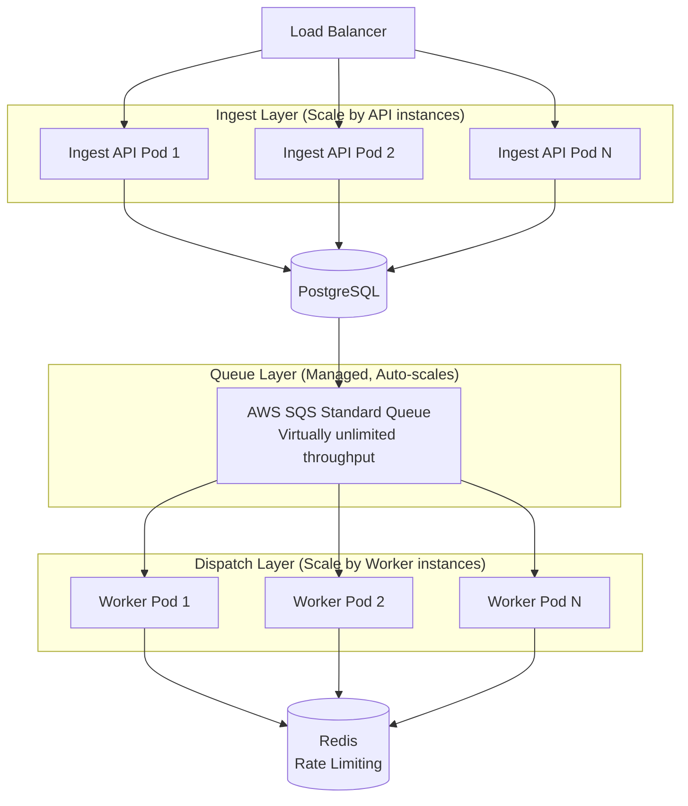
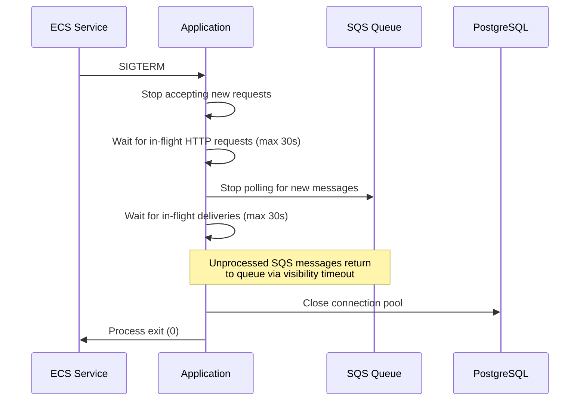

# EventRelay — Non-Functional Requirements

> This document defines the performance, scalability, availability, security, and operational requirements for EventRelay. Each requirement includes specific, measurable targets and the verification methodology.

---

## NFR-1: Performance

### Latency Requirements

| Metric | Target | Measurement | Verification |
|--------|--------|-------------|-------------|
| **Event ingestion latency (p50)** | < 30ms | Time from API request received to 202 response sent | Load test (Gatling/k6) |
| **Event ingestion latency (p95)** | < 60ms | Same as above | Load test |
| **Event ingestion latency (p99)** | < 100ms | Same as above | Load test |
| **First delivery attempt latency (p50)** | < 200ms | Time from event accepted to first HTTP POST sent | End-to-end test |
| **First delivery attempt latency (p95)** | < 350ms | Same as above | End-to-end test |
| **First delivery attempt latency (p99)** | < 500ms | Same as above | End-to-end test |
| **Outbox polling interval** | ≤ 500ms | Time between outbox table polls | Configuration |
| **SQS message visibility timeout** | 60s | Time before unprocessed message reappears | SQS configuration |
| **Webhook HTTP timeout** | 30s (configurable) | Maximum wait for receiver response | Application config |

### Latency Breakdown (Target Budget)

```mermaid
gantt
    title Event-to-Delivery Latency Budget (p99 < 500ms)
    dateFormat X
    axisFormat %Lms
    
    section Ingestion
    API parsing + validation     :0, 10
    DB transaction (outbox)      :10, 30
    API response                 :30, 5
    
    section Queue
    Outbox poll                  :35, 250
    SQS publish                  :285, 15
    SQS receive                  :300, 50
    
    section Delivery
    HMAC computation             :350, 2
    HTTP POST to receiver        :352, 148
```



| Phase | Budget | Optimization Lever |
|-------|--------|--------------------|
| API parsing + validation | 10ms | Efficient JSON deserialization (Jackson) |
| DB transaction | 20ms | Connection pooling (HikariCP), indexed outbox table |
| Outbox polling | 250ms (avg) | Configurable poll interval; consider CDC in v2 |
| SQS publish/receive | 65ms | AWS SDK connection reuse, regional endpoint |
| HMAC computation | 2ms | Pre-computed key spec, cached Mac instance |
| HTTP POST to receiver | Variable | Receiver-dependent; timeout at 30s |

---

## NFR-2: Throughput and Scalability

### Throughput Targets

| Metric | Target | Conditions | Verification |
|--------|--------|------------|-------------|
| **Sustained ingestion throughput** | ≥ 10,000 events/sec | Across all tenants | Load test (30 min sustained) |
| **Peak ingestion throughput** | ≥ 25,000 events/sec | 5-minute burst | Burst load test |
| **Delivery throughput** | ≥ 5,000 deliveries/sec | Per worker pool (scalable) | Load test |
| **Concurrent HTTP connections** | ≥ 1,000 | Outbound to receivers | Connection pool config |
| **SQS message processing rate** | ≥ 10,000 messages/sec | Standard queue | SQS benchmark |
| **Database write throughput** | ≥ 15,000 writes/sec | Events + outbox + delivery attempts | Database benchmark |

### Horizontal Scaling Model



### Scaling Dimensions

| Component | Scaling Strategy | Scale Unit | Trigger |
|-----------|-----------------|------------|---------|
| **Ingest API** | Horizontal (ECS tasks) | +1 task = +2,500 events/sec | CPU > 70% or latency p99 > 100ms |
| **Dispatcher Workers** | Horizontal (ECS tasks) | +1 task = +1,000 deliveries/sec | SQS queue depth > 10,000 |
| **PostgreSQL** | Vertical (RDS instance size) | db.r6g.xlarge → 2xlarge | IOPS > 80% or CPU > 70% |
| **PostgreSQL Read Replicas** | Horizontal (read replicas) | +1 replica for read scaling | Read latency > 50ms |
| **Redis** | Vertical (ElastiCache node) | cache.r6g.large → xlarge | Memory > 75% or CPU > 60% |
| **SQS** | Automatic (AWS managed) | Unlimited | No manual scaling needed |

### Resource Sizing (Initial Production)

| Component | Instance Type | Count | Estimated Cost/month |
|-----------|--------------|-------|---------------------|
| Ingest API | ECS Fargate (1 vCPU, 2GB) | 2-4 tasks | $60-120 |
| Dispatcher Workers | ECS Fargate (1 vCPU, 2GB) | 4-8 tasks | $120-240 |
| PostgreSQL | RDS db.r6g.xlarge (4 vCPU, 32GB) | 1 primary + 1 read replica | $500-600 |
| Redis | ElastiCache cache.r6g.large (2 vCPU, 13GB) | 1 node | $150 |
| SQS | Standard queue | 1 queue | ~$10 (at 10M msgs/month) |
| ALB | Application Load Balancer | 1 | $25 + traffic |
| **Total** | | | **~$865-1,145/month** |

---

## NFR-3: Availability

### Availability Targets

| Metric | Target | Allowed Downtime |
|--------|--------|-----------------|
| **System availability** | ≥ 99.9% | 8.76 hours/year, 43.8 min/month |
| **API availability** | ≥ 99.9% | Same as above |
| **Delivery pipeline availability** | ≥ 99.95% | 4.38 hours/year |
| **Data durability** | ≥ 99.999% | < 0.001% data loss |

### Availability Architecture

| Layer | Redundancy | Failover Mechanism |
|-------|-----------|-------------------|
| **Load Balancer** | AWS ALB (multi-AZ) | Automatic health-check routing |
| **Ingest API** | 2+ ECS tasks (multi-AZ) | ALB health checks, auto-replacement |
| **Dispatcher Workers** | 4+ ECS tasks (multi-AZ) | SQS-based load distribution |
| **PostgreSQL** | RDS Multi-AZ | Automatic failover (< 60s) |
| **Redis** | ElastiCache with replica | Automatic failover |
| **SQS** | AWS managed (multi-AZ) | Built-in redundancy |

### Failure Modes and Recovery

| Failure | Impact | Recovery | RTO | RPO |
|---------|--------|----------|-----|-----|
| Single API task crash | Reduced ingestion capacity | ECS auto-replaces task | < 60s | 0 (no data loss) |
| All API tasks crash | Ingestion unavailable | ECS launches new tasks | < 120s | 0 |
| Single worker crash | Reduced delivery capacity, in-flight messages retry | SQS re-delivers messages | < 60s | 0 |
| PostgreSQL primary failure | DB writes unavailable | RDS Multi-AZ failover | < 60s | ~0 (synchronous replication) |
| Redis failure | Rate limiting disabled, dedup unavailable | ElastiCache failover or fallback | < 60s | Dedup window lost |
| SQS service disruption | Queue operations fail | Outbox continues accumulating; drain on recovery | AWS SLA | 0 (outbox persists) |
| Full AZ failure | Partial capacity loss | Multi-AZ deployment continues serving | < 30s | 0 |
| Full region failure | Complete outage | Manual failover to secondary region (v2) | Hours | Minutes |

### Health Check Configuration

```yaml
# Spring Boot Actuator health checks
management:
  endpoint:
    health:
      show-details: always
      group:
        readiness:
          include: db, redis, sqs
        liveness:
          include: ping, diskSpace

# ECS task definition health check
healthCheck:
  command: ["CMD-SHELL", "curl -f http://localhost:8080/actuator/health/readiness || exit 1"]
  interval: 15
  timeout: 5
  retries: 3
  startPeriod: 30
```

---

## NFR-4: Reliability

### Delivery Reliability Targets

| Metric | Target | Definition |
|--------|--------|-----------|
| **Delivery success rate** | ≥ 99.95% | Events successfully delivered (2xx) within retry window |
| **Retry recovery rate** | ≥ 95% | Events that failed initially but succeeded on retry |
| **Dead-letter rate** | < 0.05% | Events entering DLQ / total events processed |
| **Event loss rate** | 0% | Events accepted but never attempted for delivery |
| **Duplicate delivery rate** | < 1% | Deliveries sent more than once for the same event-subscription pair |

### Reliability Mechanisms

| Mechanism | Purpose | Configuration |
|-----------|---------|---------------|
| **Transactional outbox** | Zero event loss between API and queue | PostgreSQL transaction |
| **SQS at-least-once** | Messages not lost in queue | Built into SQS |
| **Visibility timeout** | Re-deliver if worker crashes | 60 seconds |
| **Exponential backoff** | Handle transient failures | 8 attempts over ~6 hours |
| **Dead-letter queue** | Capture permanent failures | After max retries |
| **Circuit breaker** | Protect failing endpoints | 5 consecutive failures to open |
| **Idempotency keys** | Prevent duplicate ingestion | Redis with 24h TTL |

---

## NFR-5: Security

### Security Requirements

| ID | Requirement | Target | Verification |
|----|-------------|--------|-------------|
| NFR-5.1 | All API endpoints require authentication | 100% | Security audit |
| NFR-5.2 | All webhook deliveries are HMAC-SHA256 signed | 100% | Integration test |
| NFR-5.3 | API keys stored as bcrypt hashes (cost factor 12) | 100% | Code review |
| NFR-5.4 | TLS 1.2+ for all HTTP communication | 100% | TLS scan |
| NFR-5.5 | No secrets in application logs | 100% | Log audit |
| NFR-5.6 | SSRF prevention (no private IP targets) | 100% | Security test |
| NFR-5.7 | SQL injection prevention (parameterized queries) | 100% | SAST scan |
| NFR-5.8 | Rate limiting on auth endpoints (10 req/min) | 100% | Load test |
| NFR-5.9 | Replay attack prevention (5-min timestamp tolerance) | 100% | Integration test |
| NFR-5.10 | Data at rest encryption (RDS, ElastiCache) | 100% | AWS config audit |

### Security Headers (API Responses)

```
Strict-Transport-Security: max-age=31536000; includeSubDomains
X-Content-Type-Options: nosniff
X-Frame-Options: DENY
X-XSS-Protection: 1; mode=block
Cache-Control: no-store
Content-Type: application/json
```

### SSRF Prevention Rules

```java
public boolean isAllowedTargetUrl(String url) {
    URI uri = URI.create(url);
    
    // Must be HTTPS
    if (!"https".equals(uri.getScheme())) return false;
    
    // Resolve IP and check against blocklist
    InetAddress addr = InetAddress.getByName(uri.getHost());
    
    // Block private/reserved ranges
    if (addr.isLoopbackAddress()) return false;       // 127.0.0.0/8
    if (addr.isSiteLocalAddress()) return false;      // 10.0.0.0/8, 172.16.0.0/12, 192.168.0.0/16
    if (addr.isLinkLocalAddress()) return false;      // 169.254.0.0/16
    if (addr.isMulticastAddress()) return false;      // 224.0.0.0/4
    
    // Block metadata endpoints
    String host = uri.getHost();
    if (host.equals("169.254.169.254")) return false; // AWS metadata
    if (host.endsWith(".internal")) return false;      // Internal DNS
    
    return true;
}
```

---

## NFR-6: Observability

### Monitoring Requirements

| ID | Requirement | Implementation |
|----|-------------|---------------|
| NFR-6.1 | Application metrics exposed via Prometheus endpoint | `/actuator/prometheus` |
| NFR-6.2 | Grafana dashboards for system health and delivery metrics | Pre-built dashboard JSON |
| NFR-6.3 | Structured JSON logging with correlation IDs | Logback + MDC |
| NFR-6.4 | Alert rules for critical conditions | Prometheus Alertmanager |
| NFR-6.5 | Log aggregation to centralized system | CloudWatch Logs / ELK |

### Critical Alert Rules

| Alert | Condition | Severity | Action |
|-------|-----------|----------|--------|
| **High DLQ Rate** | DLQ entries > 100 in 15 min | Critical | Investigate endpoint health |
| **Delivery Failure Spike** | Failure rate > 5% over 5 min | Warning | Check receiver health |
| **Ingestion Latency** | p99 > 200ms for 5 min | Warning | Scale API instances |
| **Queue Depth** | SQS messages > 50,000 | Warning | Scale dispatcher workers |
| **Circuit Breaker Open** | Any circuit breaker opens | Info | Notify tenant |
| **Database Connection Pool** | Pool utilization > 90% | Critical | Scale DB or fix connection leaks |
| **Worker Error Rate** | Error rate > 10% over 5 min | Critical | Check worker logs |

### Grafana Dashboard Panels

| Panel | Metrics | Visualization |
|-------|---------|---------------|
| Event Ingestion Rate | `eventrelay_events_ingested_total` | Time series (rate) |
| Delivery Success Rate | `eventrelay_delivery_attempts_total` by status | Pie chart + time series |
| Delivery Latency | `eventrelay_delivery_latency_seconds` | Heatmap (p50/p95/p99) |
| SQS Queue Depth | `aws_sqs_approximate_number_of_messages` | Gauge + time series |
| DLQ Size | `eventrelay_dlq_messages` | Gauge with threshold |
| Retry Distribution | `eventrelay_retry_total` by attempt number | Bar chart |
| Circuit Breaker Status | `eventrelay_circuit_breaker_state` | Status map |
| Throughput by Tenant | `eventrelay_events_ingested_total` by tenant | Top-N table |

---

## NFR-7: Operational Requirements

### Deployment Requirements

| Requirement | Target |
|-------------|--------|
| Zero-downtime deployments | Rolling update via ECS |
| Rollback capability | ECS task revision rollback in < 60s |
| Infrastructure as Code | Terraform or CloudFormation |
| Environment parity | Dev, staging, production identical configs |
| Database migrations | Forward-only, backwards-compatible (Flyway) |
| Configuration management | Environment variables, AWS Parameter Store |

### Graceful Shutdown Sequence



### Backup and Recovery

| Component | Backup Strategy | Frequency | Retention |
|-----------|----------------|-----------|-----------|
| PostgreSQL | RDS automated snapshots | Daily | 30 days |
| PostgreSQL | RDS point-in-time recovery | Continuous (5 min RPO) | 35 days |
| Redis | ElastiCache snapshots | Daily | 7 days |
| Application config | Git repository | Every change | Permanent |
| Terraform state | S3 + DynamoDB locking | Every change | Versioned |

---

## NFR-8: Compliance Considerations

| Area | Requirement | Implementation |
|------|-------------|---------------|
| **Data Residency** | Support single-region deployment | AWS region selection at deploy time |
| **Data Retention** | Configurable retention periods per tenant | Scheduled cleanup job (30/90/365 days) |
| **Audit Trail** | Log all administrative API calls | Audit log table + structured logging |
| **Access Control** | API key authentication with scoped permissions | Per-tenant API keys |
| **Encryption** | Data encrypted at rest and in transit | RDS encryption, TLS 1.2+ |
| **Incident Response** | Document runbooks for common failures | Operational runbook document |

---

## NFR-9: Capacity Planning

### Sizing Calculator

```
Given:
  - Events per day: 10,000,000 (10M)
  - Average event payload size: 2KB
  - Average subscriptions per event: 2
  - Retry rate: 5%
  - Retention period: 30 days

Storage Requirements:
  - Events table: 10M × 2KB × 30 days = ~600GB
  - Delivery attempts: 10M × 2 × 1KB × 30 days = ~600GB  
  - Outbox table: minimal (processed entries purged)
  - DLQ: 10M × 0.05% × 3KB × 30 days = ~450MB
  - Total PostgreSQL storage: ~1.2TB

Queue Requirements:
  - SQS messages per day: 10M × 2 (fan-out) + 1M (retries) = 21M
  - Peak SQS messages per second: ~500 (sustained) to 2,000 (peak)
  - SQS cost: ~$8.40/month (at $0.40/million requests)

Redis Requirements:
  - Rate limit tokens: ~1,000 keys (1 per tenant)
  - Dedup keys: 10M × 24h TTL × 64 bytes = ~640MB
  - Total Redis memory: ~1GB

Compute Requirements:
  - Ingest API: 10M events/day ÷ 86,400 = ~116 events/sec avg
    → 1 API task handles ~2,500/sec → 1 task sufficient (2 for HA)
  - Dispatcher: 20M deliveries/day ÷ 86,400 = ~231 deliveries/sec avg
    → 1 worker handles ~1,000/sec → 1 task sufficient (2 for HA)
```

### Growth Projections

| Metric | Month 1 | Month 3 | Month 6 | Month 12 |
|--------|---------|---------|---------|----------|
| Events/day | 100K | 1M | 5M | 20M |
| Tenants | 5 | 20 | 50 | 200 |
| Subscriptions | 20 | 100 | 300 | 1,000 |
| DB Storage | 5GB | 50GB | 250GB | 1TB |
| API Instances | 1 | 2 | 2 | 4 |
| Worker Instances | 1 | 2 | 4 | 8 |
| Monthly Cost | ~$300 | ~$600 | ~$900 | ~$1,500 |

---

## Acceptance Testing for NFRs

| NFR | Test Type | Tool | Pass Criteria |
|-----|-----------|------|---------------|
| Latency (ingestion p99 < 100ms) | Load test | k6 / Gatling | p99 < 100ms at 1,000 req/s for 10 min |
| Latency (delivery p99 < 500ms) | End-to-end test | Custom harness | p99 < 500ms with mock receiver |
| Throughput (10K events/sec) | Stress test | k6 | Sustained 10K/s for 30 min, 0% errors |
| Availability (99.9%) | Chaos test | Chaos Monkey / manual | Survive task kills, AZ failures |
| Security (HMAC signing) | Integration test | JUnit 5 | 100% of deliveries signed |
| Security (SSRF prevention) | Security test | Custom + OWASP ZAP | All private IPs rejected |
| Observability | Verification | Manual + automation | All metrics exposed, dashboards functional |

---

> [!WARNING]
> NFR targets must be validated before production launch. Any NFR violation is a **launch blocker** — not a "nice to have." Performance regression tests should run in CI/CD to catch NFR degradation early.
