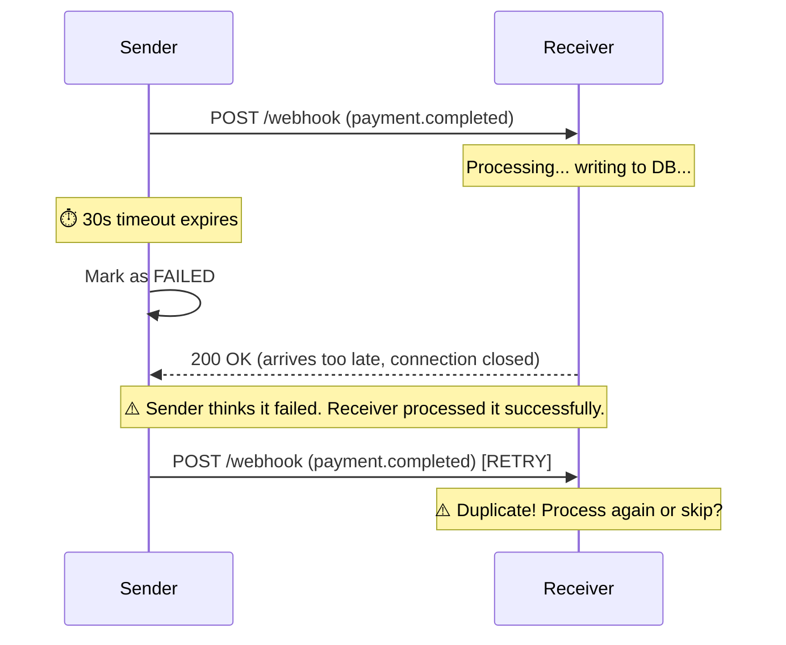
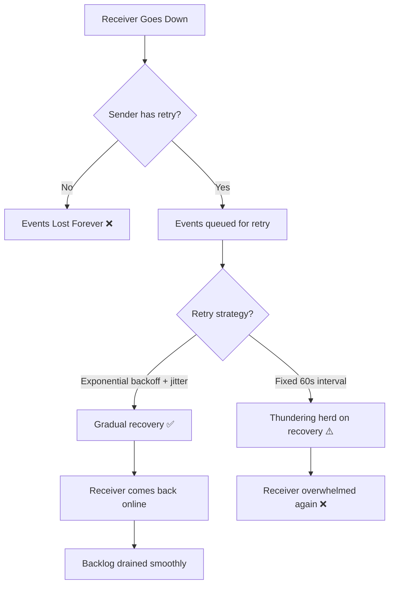
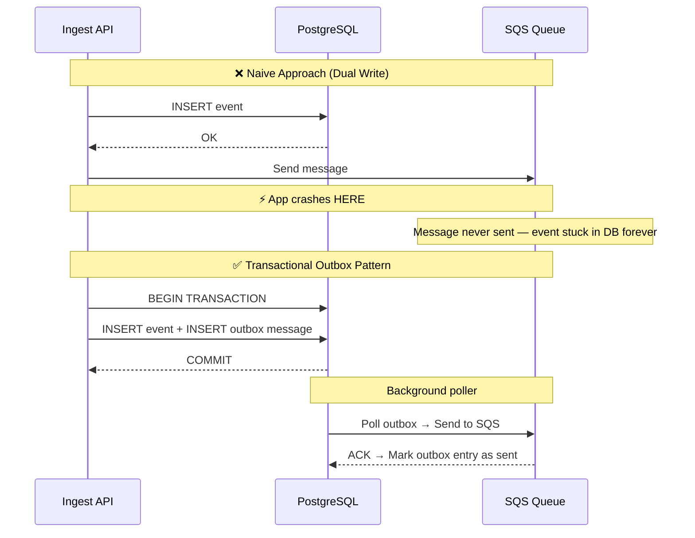

# EventRelay — Problem Statement

> **Core Problem:** Webhooks are the most common integration pattern in modern software, yet most implementations silently lose events, provide zero visibility into failures, and have no recovery mechanism when things go wrong.

---

## 1. Why Webhook Delivery Is Hard

On the surface, webhooks are trivially simple: "When something happens, POST JSON to a URL." But in production, this simplicity conceals an entire class of distributed systems challenges that most teams underestimate — often catastrophically.

### The Illusion of Simplicity

```java
// This is what most teams start with
HttpResponse response = httpClient.send(
    HttpRequest.newBuilder()
        .uri(URI.create(webhookUrl))
        .POST(BodyPublishers.ofString(payload))
        .build(),
    BodyHandlers.ofString()
);
// What could go wrong? Everything.
```

What seems like a 5-line feature actually requires solving **9 distinct distributed systems problems**, each with its own failure modes, edge cases, and production war stories.

---

## 2. The Nine Hard Problems of Webhook Delivery

### Problem 1: Network Failures

**The Challenge:** The network between your server and the receiver is fundamentally unreliable.

| Failure Mode | Frequency | Impact |
|-------------|-----------|--------|
| DNS resolution failure | ~0.1% of requests | Event never reaches receiver |
| TCP connection timeout | ~0.5-1% (varies by receiver) | Blocks sender thread, event may be lost |
| TLS handshake failure | ~0.05% (cert expiry, mismatch) | Silent failure if not handled |
| Connection reset (RST) | ~0.2% (load balancer churn) | Ambiguous — was data received? |
| HTTP response timeout | ~1-3% (slow receivers) | Ambiguous delivery state |

**Real-World Example:**
> In 2019, a major payment processor experienced a 45-minute DNS outage at their webhook receiver's cloud provider. During this window, **~12,000 payment notifications were silently dropped** because the sender's webhook system used fire-and-forget delivery. Merchants didn't receive payment confirmations, leading to duplicate charges when customers retried transactions.

**Why It's Hard:**
- Network failures are **transient and unpredictable** — they can't be prevented, only handled
- Different failure types require different responses (retry vs. alert vs. circuit break)
- Some failures are **ambiguous** — did the receiver get the data before the connection dropped?

---

### Problem 2: Timeout Ambiguity

**The Challenge:** When an HTTP request times out, you don't know if the receiver processed the event or not.



**The Ambiguity Matrix:**

| What Actually Happened | What Sender Sees | Correct Action |
|------------------------|-----------------|----------------|
| Receiver processed, response slow | Timeout | Should NOT retry (but will) |
| Receiver received, crashed during processing | Timeout | Should retry |
| Receiver never received data | Timeout | Should retry |
| Receiver processed, connection died before response | Connection reset | Should NOT retry (but will) |

**Why It's Hard:**
- The sender **cannot distinguish** between these scenarios from its side alone
- Retrying is the safe default, but creates duplicates
- Not retrying risks losing events
- This is fundamentally the [Two Generals' Problem](https://en.wikipedia.org/wiki/Two_Generals%27_Problem)

---

### Problem 3: Duplicate Delivery

**The Challenge:** At-least-once delivery means receivers WILL see duplicates. Most receivers aren't built for this.

**Duplication Scenarios:**

| Scenario | Cause | Mitigation |
|----------|-------|------------|
| Timeout retry | Sender retries after timeout, receiver already processed | Idempotency keys |
| Worker crash | SQS message re-delivered after visibility timeout | Idempotent consumers |
| Network partition | ACK lost, message retransmitted | Event ID deduplication |
| Queue reprocessing | Manual replay or DLQ replay | Consumer-side dedup |

**Business Impact:**
> A SaaS billing platform retried a `invoice.paid` webhook after a timeout. The receiver's accounting system processed the payment twice, resulting in a **$47,000 double-credit** to a customer account. The error wasn't detected for 3 days.

**Why It's Hard:**
- Deduplication requires the **receiver** to maintain state (processed event IDs)
- Deduplication windows have practical limits (can't store every ID forever)
- Some operations are naturally non-idempotent (e.g., incrementing counters, sending emails)
- Distributed deduplication is itself a hard problem (clock skew, cache invalidation)

---

### Problem 4: Receiver Downtime

**The Challenge:** Webhook receivers go down — for maintenance, crashes, scaling events, or outages. Events fired during downtime are lost unless the sender persists and retries them.

**Downtime Statistics (Industry Averages):**

| Receiver Type | Avg Monthly Downtime | Impact on Webhook Delivery |
|--------------|---------------------|---------------------------|
| Small SaaS (single server) | 30-60 min/month | 100% of events lost during downtime without retry |
| Mid-tier (basic HA) | 5-15 min/month | Events lost during deployment windows |
| Enterprise (multi-region) | < 5 min/month | Minimal, but bursts cause backpressure |
| Serverless functions | Variable (cold starts) | Timeouts during cold starts (~1-5s) |

**Downtime Recovery Pattern:**



**Why It's Hard:**
- You can't predict when a receiver will come back
- Naive retry strategies (fixed interval) create thundering herds on recovery
- Long outages (hours/days) require persisting thousands of events
- Some events have time-sensitive relevance (a 3-day-old payment notification is still needed, but a 3-day-old "user is typing" notification is worthless)

---

### Problem 5: Payload Verification and Security

**The Challenge:** How does the receiver verify that a webhook came from EventRelay and wasn't forged by an attacker?

**Attack Vectors:**

| Attack | Description | Without Signing |
|--------|-------------|-----------------|
| **Spoofing** | Attacker sends fake webhooks to receiver URL | Receiver processes fake data |
| **Replay attack** | Attacker captures and re-sends legitimate webhook | Receiver processes duplicate |
| **Man-in-the-middle** | Attacker modifies payload in transit | Receiver processes tampered data |
| **URL discovery** | Attacker discovers webhook URL via brute force | Receiver flooded with fake requests |

**Industry Standard: HMAC-SHA256 Signing**

```
Webhook Request:
  POST /webhooks HTTP/1.1
  Content-Type: application/json
  X-EventRelay-Signature: v1=5257a869e7ecebeda32affa62cdca3fa51cad7e77a0e56ff536d0ce8e108d8bd
  X-EventRelay-Timestamp: 1720584000

  {"event": "payment.completed", "amount": 99.99}

Verification (receiver side):
  1. Concatenate: "1720584000.{payload}"
  2. HMAC-SHA256 with shared secret
  3. Compare signatures (constant-time)
  4. Reject if timestamp > 5 minutes old (replay protection)
```

**Why It's Hard:**
- Signing secrets must be provisioned and rotated per-tenant
- Key rotation requires supporting multiple active signatures during the transition window
- Timing attacks on signature comparison can leak information (must use constant-time comparison)
- Receivers must validate signatures correctly — many don't, creating a false sense of security

---

### Problem 6: Scale Challenges

**The Challenge:** Webhook delivery must scale with event volume, which is inherently bursty and unpredictable.

**Scale Scenarios:**

| Scenario | Event Volume | Challenge |
|----------|-------------|-----------|
| Black Friday flash sale | 50x normal volume in minutes | Worker pool exhaustion, connection pool saturation |
| Batch import | 100K events in 1 second | Queue backpressure, receiver overwhelm |
| Multi-tenant burst | 100 tenants active simultaneously | Fair resource allocation, isolation |
| Cascade failure | 10K events retrying simultaneously | Thundering herd, database hotspot |

**Why It's Hard:**
- **Connection pool exhaustion:** Each delivery attempt holds an HTTP connection. At 10K concurrent deliveries, you need careful connection management
- **Database write amplification:** Each delivery attempt updates status → write-heavy workload at scale
- **Queue depth monitoring:** SQS queues can grow unboundedly — need backpressure mechanisms
- **Receiver diversity:** Some receivers handle 1000 req/s, others choke at 10 req/s. Per-endpoint rate limiting is essential

---

### Problem 7: Ordering Challenges

**The Challenge:** Events have a natural order (created, updated, deleted), but distributed delivery makes ordering extremely difficult to guarantee.

**Ordering Problem Illustration:**

```
Events produced in order:    E1 → E2 → E3
Event E2 delivery fails:     E1 ✅  E2 ❌  E3 ✅
After E2 retry succeeds:     Receiver saw: E1, E3, E2 ← WRONG ORDER

Real-world example:
  1. order.created     → Receiver creates order record
  2. order.updated     → Receiver updates shipping address  
  3. order.cancelled   → Receiver cancels order
  
  If delivered as: 1, 3, 2 → Order is cancelled, then "updated" — final state is WRONG
```

**Why It's Hard:**
- Guaranteeing order requires single-threaded delivery per tenant → kills throughput
- Retries inherently break ordering (later events may succeed while earlier events retry)
- SQS Standard queues provide best-effort ordering only
- SQS FIFO queues guarantee ordering but cap at 300 messages/second per group
- Most webhook consumers don't handle out-of-order delivery correctly

---

### Problem 8: Observability Gap

**The Challenge:** When webhook delivery fails, most systems provide zero visibility into what happened, making debugging nearly impossible.

**The Debugging Nightmare:**

```
Support ticket: "We're not receiving webhooks"

Team's debugging process without observability:
  1. Check application logs → Nothing (fire-and-forget, no logging)
  2. Check receiver logs → Nothing (events never arrived)
  3. Check network → No packet captures available
  4. Manually send a test webhook → Works fine
  5. Conclusion: "Works on my machine" 🤷
  6. Real cause found 2 days later: Receiver's SSL cert expired
     at 3 AM, all events during the 6-hour window were lost.
```

**What Production Observability Requires:**

| Capability | Purpose |
|------------|---------|
| **Event log** | What events were accepted, when, from whom |
| **Delivery audit trail** | Every attempt: timestamp, status code, latency, error |
| **Retry visibility** | How many retries, what backoff, when's the next attempt |
| **DLQ inspection** | What failed permanently, why, full request/response |
| **Metrics dashboards** | Success rates, latency percentiles, queue depth |
| **Alerting** | Notify on elevated failure rates, DLQ growth, circuit breaker trips |
| **Event replay** | Re-deliver failed events after root cause is fixed |

---

### Problem 9: The Dual-Write Problem

**The Challenge:** When you need to write an event to your database AND publish it to a message queue, doing both operations atomically is impossible without special patterns.



**Why It's Hard:**
- Databases and message queues are separate systems — no distributed transaction
- Two-phase commit (2PC) is fragile, slow, and not supported by SQS
- Writing to DB then queue can fail between the two operations
- Writing to queue then DB risks publishing events that don't exist in the database
- The Transactional Outbox Pattern solves this but adds complexity (polling, outbox table, idempotent publishing)

---

## 3. Real-World Webhook Failures and Business Impact

### Case Studies

#### Case 1: Silent Payment Loss (Fintech)

| Aspect | Detail |
|--------|--------|
| **Company** | Mid-size payment processor |
| **Failure** | Webhook endpoint returned 503 during receiver's deployment |
| **Duration** | 12 minutes |
| **Events lost** | ~800 payment confirmation webhooks |
| **Impact** | Merchants didn't know payments succeeded. Manual reconciliation took 3 days. |
| **Root Cause** | No retry mechanism. Fire-and-forget HTTP POST. |
| **Cost** | ~$15,000 in support costs + merchant trust erosion |

#### Case 2: The Thundering Herd (E-Commerce)

| Aspect | Detail |
|--------|--------|
| **Company** | E-commerce platform with 2,000+ merchant integrations |
| **Failure** | All webhook receivers came back online after a 2-hour AWS outage |
| **What Happened** | 500K queued webhooks retried simultaneously |
| **Impact** | Receivers overwhelmed, creating a cascade of new failures |
| **Root Cause** | Fixed 60-second retry interval, no jitter, no rate limiting |
| **Resolution** | Took 6 hours to fully drain the retry queue |

#### Case 3: The Undetected Failure (SaaS)

| Aspect | Detail |
|--------|--------|
| **Company** | B2B SaaS platform |
| **Failure** | Customer's SSL certificate expired |
| **Duration** | 11 days (!) before anyone noticed |
| **Events lost** | ~45,000 webhooks over 11 days |
| **Impact** | Customer's downstream systems were out of sync for nearly 2 weeks |
| **Root Cause** | No monitoring, no alerting, no delivery status dashboard |

#### Case 4: The Duplicate Charge (Billing)

| Aspect | Detail |
|--------|--------|
| **Company** | Subscription billing platform |
| **Failure** | Webhook delivery timed out after 30s, but receiver had already processed |
| **What Happened** | Retry delivered the same `invoice.paid` event; receiver charged customer twice |
| **Impact** | $23,000 in erroneous charges, customer churn |
| **Root Cause** | No idempotency key in webhook, receiver didn't deduplicate |

---

## 4. How the Industry Leaders Handle It

### Stripe: The Gold Standard

Stripe delivers **billions of webhooks per month** with 99.999% reliability. Their approach:

| Feature | Implementation |
|---------|---------------|
| **Retry schedule** | 8 attempts over ~3 days: immediately, 5min, 30min, 2h, 5h, 10h, 1d, 2d |
| **Signing** | HMAC-SHA256 with `Stripe-Signature` header + timestamp |
| **Idempotency** | Every event has a unique `id`; consumers expected to deduplicate |
| **Ordering** | Not guaranteed; events include `created` timestamp for consumer reordering |
| **DLQ/Replay** | Dashboard shows failed deliveries, manual retry button |
| **Monitoring** | Endpoint health dashboard, email alerts on sustained failures |
| **Endpoint disabling** | Automatically disables endpoint after sustained failures (circuit breaker) |
| **Tolerance** | Expects `2xx` within 20 seconds |

### GitHub: Webhooks at Developer Scale

| Feature | Implementation |
|---------|---------------|
| **Retry** | Immediate retry on failure, up to 3 attempts within 1 hour |
| **Signing** | HMAC-SHA256 with `X-Hub-Signature-256` header |
| **Delivery log** | Full delivery history visible in Settings → Webhooks |
| **Redeliver** | Manual redeliver button per event in the UI |
| **Ping** | `ping` event to test endpoint connectivity on creation |
| **Content types** | `application/json` and `application/x-www-form-urlencoded` |

### AWS EventBridge → API Destinations

| Feature | Implementation |
|---------|---------------|
| **Retry** | Up to 185 retries over 24 hours with exponential backoff |
| **DLQ** | Routes to SQS dead-letter queue on exhaustion |
| **Rate limiting** | Configurable invocation rate per destination |
| **Auth** | API Key, OAuth, Basic Auth support |
| **Ordering** | Best-effort per event bus |

---

## 5. The Cost of Getting Webhooks Wrong

### Quantified Business Impact

| Failure Type | Frequency (without EventRelay) | Business Cost |
|-------------|-------------------------------|---------------|
| Lost payment notifications | ~0.5% of deliveries | Chargebacks, reconciliation ($$$) |
| Duplicate event processing | ~1-3% of retried events | Double charges, data corruption |
| Silent delivery failures | Unknown (no observability) | Customer churn, trust erosion |
| Delayed notifications | During receiver downtime | SLA violations, support tickets |
| Security breaches (unsigned) | Rare but catastrophic | Fake transactions, data manipulation |
| Debugging time | 2-8 hours per incident | Engineering time ($150-300/hr) |

### Total Cost of Unreliable Webhooks (Estimated)

For a mid-size SaaS platform processing 1M webhooks/month:

```
Direct costs:
  - Lost events requiring manual reconciliation:  $2,000/month
  - Duplicate processing errors:                   $1,500/month
  - Engineering time debugging:                    $3,000/month
  
Indirect costs:
  - Customer support for webhook issues:           $1,000/month
  - Customer churn (trust erosion):                $5,000/month
  - Delayed feature development:                   $4,000/month
  
Estimated total:                                  ~$16,500/month
                                                  ~$198,000/year
```

---

## 6. EventRelay's Answer

EventRelay addresses every problem identified above:

| Problem | EventRelay Solution |
|---------|-------------------|
| Network failures | Persistent queue (SQS) + automatic retries with exponential backoff |
| Timeout ambiguity | Idempotency keys + at-least-once delivery + consumer dedup guidance |
| Duplicate delivery | Event IDs in headers, ingestion-side dedup (Redis), consumer-side guidance |
| Receiver downtime | Events persisted in PostgreSQL outbox, retried for up to 24+ hours |
| Payload verification | HMAC-SHA256 signing with per-tenant secrets, replay protection |
| Scale challenges | SQS-backed workers, per-tenant rate limiting, connection pool management |
| Ordering challenges | Sequence numbers + timestamps; strict ordering deferred (documented tradeoff) |
| Observability gap | Prometheus metrics, delivery audit trail, DLQ inspection, Grafana dashboards |
| Dual-write problem | Transactional outbox pattern — single atomic DB write |

---

> [!CAUTION]
> Every production webhook system will encounter these problems. The question is not *if* but *when*. EventRelay is designed to handle every failure mode described in this document — and to make those failures visible, recoverable, and measurable.
