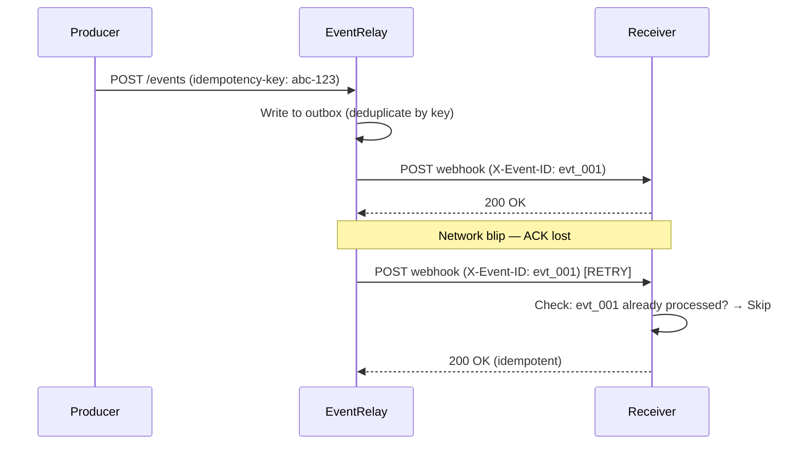
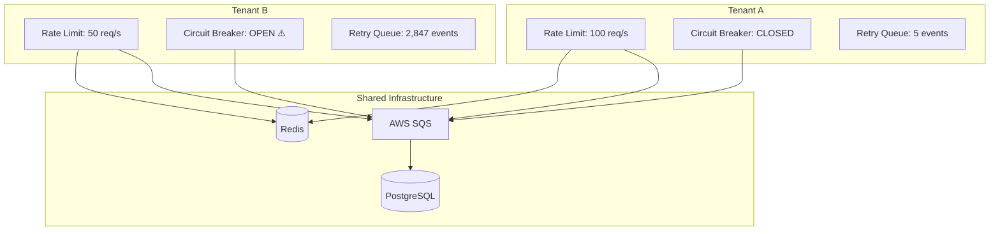
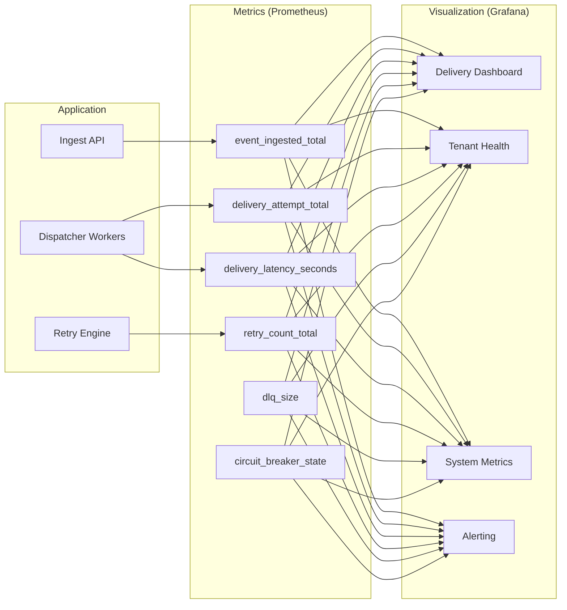
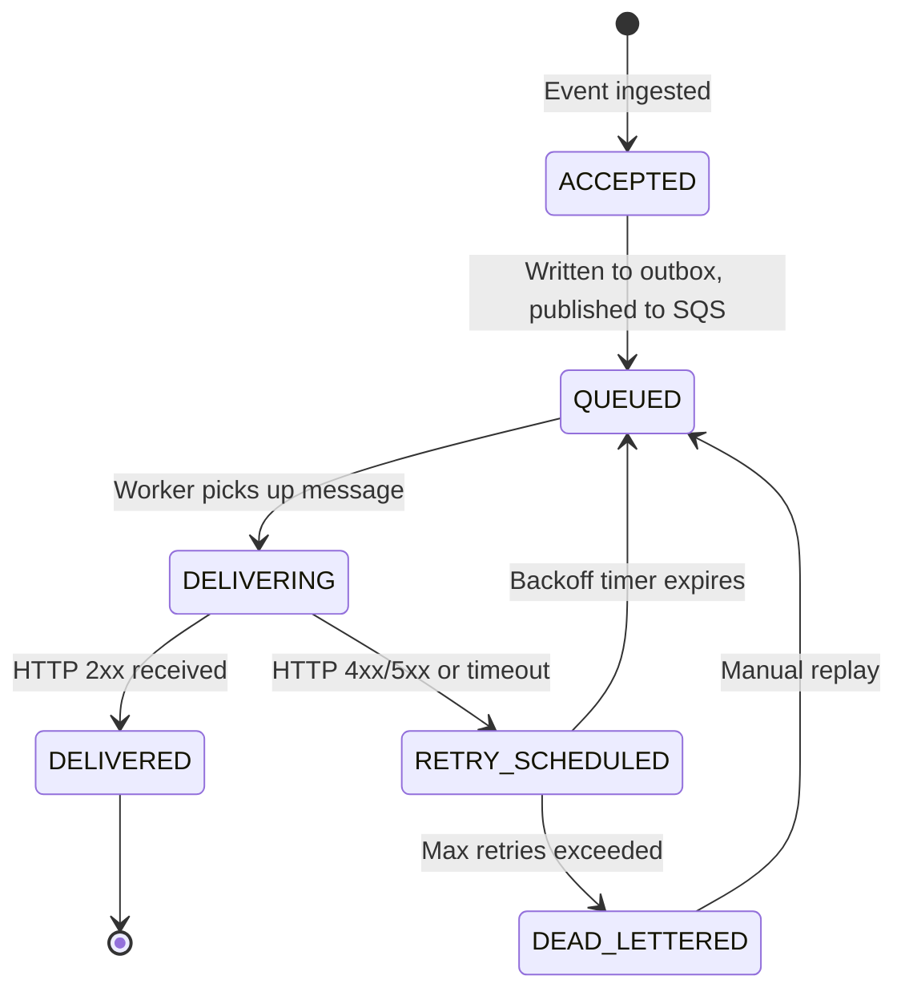

# EventRelay — Product Principles

> **Guiding Maxim:** When in doubt, choose the option that makes event delivery more reliable, even at the cost of throughput, complexity, or development speed.

---

## 1. Core Principles

### Principle 1: Reliability Over Speed

**Statement:** EventRelay will always prioritize delivery guarantee over raw throughput or latency optimization.

**What this means in practice:**

| Scenario | Fast Approach ❌ | Reliable Approach ✅ |
|----------|-----------------|---------------------|
| Event ingestion | Fire-and-forget to SQS | Write to PostgreSQL outbox transactionally, then relay to SQS |
| Delivery attempt | In-memory retry queue | Persistent retry state in database with SQS visibility timeout |
| Worker crash mid-delivery | Event lost | SQS message becomes visible again after visibility timeout |
| Database write + queue publish | Two separate operations (dual write) | Single transaction (outbox pattern) |

**Design Decision:**
```
We accept ~10-20ms additional latency on ingestion to guarantee 
zero event loss. A transactional write to PostgreSQL outbox adds 
overhead but eliminates the dual-write problem entirely.
```

**Tradeoff Rationale:** A payment notification that arrives 20ms later is invisible to users. A payment notification that never arrives causes chargebacks, support tickets, and lost trust. The math is clear.

---

### Principle 2: At-Least-Once Delivery

**Statement:** EventRelay guarantees that every event will be delivered at least once. Consumers must be designed for idempotent processing.

**Why not exactly-once?**

Exactly-once delivery in a distributed system is a [well-known impossibility](https://www.confluent.io/blog/exactly-once-semantics-are-possible-heres-how-apache-kafka-does-it/) without end-to-end coordination. Instead, EventRelay follows the industry-standard approach used by Stripe, GitHub, and AWS:



**Consumer Contract:**
- Every webhook delivery includes an `X-Event-ID` header
- Consumers SHOULD track processed event IDs and skip duplicates
- EventRelay provides deduplication on the ingestion side (Redis-backed, 24h TTL)
- Delivery-side deduplication is the receiver's responsibility

**Implementation Details:**

```java
// Ingestion-side deduplication
public boolean isDuplicate(String idempotencyKey) {
    String redisKey = "dedup:" + idempotencyKey;
    // SETNX with 24-hour TTL — returns false if key already exists
    return !redisTemplate.opsForValue()
        .setIfAbsent(redisKey, "1", Duration.ofHours(24));
}
```

---

### Principle 3: Tenant Isolation

**Statement:** One tenant's behavior must never degrade another tenant's experience. Failures, traffic spikes, and slow receivers are isolated.

**Isolation Boundaries:**



**Isolation Mechanisms:**

| Layer | Mechanism | Purpose |
|-------|-----------|---------|
| **API ingestion** | Per-tenant API rate limiting (token bucket, Redis) | Prevent noisy-neighbor on ingest |
| **Delivery** | Per-endpoint circuit breakers | Stop hammering a dead endpoint |
| **Retry** | Per-tenant retry budgets | Prevent one tenant's failures from consuming all retry capacity |
| **Queue** | SQS message attributes for tenant routing | Enable per-tenant queue priority in the future |
| **Database** | Tenant ID on every row, indexed queries | Logical isolation, query performance |

**Anti-Pattern Avoided:**
> ❌ Sharing a single retry counter across all tenants — one tenant with a down endpoint would exhaust retry capacity for everyone.

---

### Principle 4: Developer Experience First

**Statement:** Every API, error message, and configuration option should be designed for the developer who will integrate with EventRelay at 2 AM during an incident.

**DX Standards:**

| Area | Standard |
|------|----------|
| **API responses** | Always include `request_id`, structured error codes, human-readable messages |
| **Error messages** | Actionable — tell the developer what went wrong AND how to fix it |
| **API design** | RESTful, consistent naming, pagination, filtering |
| **Documentation** | Every endpoint documented with request/response examples |
| **Debugging** | Event explorer with full delivery history, request/response bodies |
| **Onboarding** | Working example in < 5 minutes with curl commands |

**Error Response Philosophy:**

```json
// ❌ Bad — What does this mean? What do I do?
{
  "error": "Bad Request",
  "status": 400
}

// ✅ Good — Clear, actionable, traceable
{
  "error": {
    "code": "INVALID_EVENT_TYPE",
    "message": "Event type 'payment.completed' is not registered. Available types: payment.created, payment.failed, payment.refunded",
    "hint": "Register the event type via POST /api/v1/event-types before publishing events",
    "request_id": "req_8f3a2b1c",
    "documentation_url": "https://docs.eventrelay.dev/errors/INVALID_EVENT_TYPE"
  }
}
```

**API Consistency Rules:**
1. All timestamps in ISO 8601 UTC (`2026-07-10T04:00:00Z`)
2. All IDs prefixed with entity type (`evt_`, `sub_`, `ten_`, `dlv_`)
3. Pagination via cursor-based `?cursor=xxx&limit=50`
4. Filtering via query params `?status=failed&event_type=payment.created`
5. Bulk operations return `207 Multi-Status` with per-item results

---

### Principle 5: Observability Built-In

**Statement:** Every event, delivery attempt, retry, and failure is instrumented from day one. Observability is not a Phase 3 feature — it is a Phase 1 requirement.

**Observability Stack:**



**Key Metrics (Non-Negotiable):**

| Metric | Type | Labels | Purpose |
|--------|------|--------|---------|
| `eventrelay_events_ingested_total` | Counter | `tenant_id`, `event_type` | Ingestion volume |
| `eventrelay_delivery_attempts_total` | Counter | `tenant_id`, `status`, `attempt_number` | Delivery success/failure tracking |
| `eventrelay_delivery_latency_seconds` | Histogram | `tenant_id`, `event_type` | Latency distribution (p50/p95/p99) |
| `eventrelay_retry_total` | Counter | `tenant_id`, `attempt_number` | Retry volume and distribution |
| `eventrelay_dlq_messages` | Gauge | `tenant_id` | Dead-letter queue depth |
| `eventrelay_circuit_breaker_state` | Gauge | `tenant_id`, `endpoint` | 0=closed, 1=half-open, 2=open |
| `eventrelay_rate_limit_rejected_total` | Counter | `tenant_id` | Rate limit enforcement |
| `eventrelay_ingestion_latency_seconds` | Histogram | — | API response time |

**Structured Logging Standard:**

```json
{
  "timestamp": "2026-07-10T04:00:00.123Z",
  "level": "WARN",
  "logger": "RetryEngine",
  "message": "Delivery failed, scheduling retry",
  "context": {
    "event_id": "evt_abc123",
    "tenant_id": "ten_xyz789",
    "subscription_id": "sub_def456",
    "target_url": "https://merchant.com/webhooks",
    "attempt_number": 3,
    "http_status": 503,
    "next_retry_at": "2026-07-10T04:05:30.000Z",
    "backoff_seconds": 300
  }
}
```

---

### Principle 6: Security by Default

**Statement:** Security is not a feature toggle. Every webhook delivery is signed, every API call is authenticated, and every piece of data is encrypted — by default, with zero configuration required.

**Security Layers:**

| Layer | Mechanism | Default |
|-------|-----------|---------|
| **API Authentication** | API keys (per-tenant) | Required — no anonymous access |
| **Webhook Signing** | HMAC-SHA256 with per-tenant secrets | Always on — cannot be disabled |
| **Data at Rest** | PostgreSQL encryption (RDS) | Enabled via AWS |
| **Data in Transit** | TLS 1.2+ for all HTTP | Enforced |
| **Secret Management** | AWS Secrets Manager / env vars | Secrets never in code or logs |
| **Replay Prevention** | Timestamp in HMAC, 5-minute tolerance | Built into signing scheme |
| **Key Rotation** | Dual active signing keys during rotation | Supported from v1 |

**HMAC Signing Implementation:**

```java
public String computeSignature(String payload, String secret, long timestamp) {
    String signedContent = timestamp + "." + payload;
    Mac mac = Mac.getInstance("HmacSHA256");
    mac.init(new SecretKeySpec(secret.getBytes(UTF_8), "HmacSHA256"));
    byte[] hash = mac.doFinal(signedContent.getBytes(UTF_8));
    return "v1=" + Base64.getEncoder().encodeToString(hash);
}

// Delivered as headers:
// X-EventRelay-Signature: v1=K7gNU3sdo+OL0wNhqoVWhr3g6s1xYv72ol/pe/Unols=
// X-EventRelay-Timestamp: 1720584000
```

**Anti-Patterns Avoided:**
> ❌ Never log webhook payloads in production (may contain PII)  
> ❌ Never store signing secrets in plaintext in the database  
> ❌ Never allow unsigned webhook delivery — even in development mode

---

## 2. Design Philosophy

### Choose Boring Technology

EventRelay deliberately uses proven, well-understood technologies:

| Choice | Why |
|--------|-----|
| **PostgreSQL** (not MongoDB) | ACID transactions for outbox pattern, mature, well-tooled |
| **AWS SQS** (not Kafka) | Managed, zero-ops, built-in retry semantics, sufficient for webhook delivery |
| **Redis** (not custom cache) | Battle-tested for rate limiting, simple dedup, widely understood |
| **Spring Boot** (not reactive framework) | Largest ecosystem, easiest hiring, well-documented |
| **Docker + ECS** (not Kubernetes) | Simpler operational model for the scale we target |

### Optimize for Debuggability

Every design decision should make debugging easier:

1. **Unique IDs everywhere** — Every event, delivery attempt, and API request has a traceable ID
2. **Full delivery history** — Every attempt is logged with request/response details
3. **State machines are explicit** — Event states (`PENDING → DELIVERING → DELIVERED / FAILED / DLQ`) are clearly defined
4. **No silent failures** — Every error path produces a log, metric, or alert

### Event Lifecycle State Machine



---

## 3. Tradeoff Decisions

### Decision Log

| # | Decision | Option A | Option B | Chosen | Rationale |
|---|----------|----------|----------|--------|-----------|
| 1 | Delivery guarantee | Exactly-once | At-least-once | **At-least-once** | Exactly-once requires two-phase commit with receiver — impractical for webhooks |
| 2 | Event ordering | Strict per-tenant ordering | Best-effort ordering | **Best-effort** | Strict ordering requires single-threaded delivery per tenant, destroying throughput |
| 3 | Outbox polling | CDC (Debezium) | Polling publisher | **Polling publisher** | Simpler to operate, CDC adds Kafka/Connect dependency |
| 4 | Payload storage | Store full payload | Store reference + external storage | **Full payload in DB** | Simpler, avoids S3 dependency; large payload support (>256KB) deferred to v2 |
| 5 | Queue technology | Kafka | SQS | **SQS** | No ordering requirement, managed service, simpler operations, built-in DLQ |
| 6 | Rate limiting | Per-tenant fixed window | Per-tenant token bucket | **Token bucket** | Smoother traffic distribution, no burst-at-window-boundary problem |
| 7 | Retry backoff | Fixed intervals | Exponential with jitter | **Exponential + jitter** | Prevents thundering herd, industry standard |
| 8 | Multi-tenancy model | Database per tenant | Shared DB, tenant ID column | **Shared DB** | Simpler operations, sufficient isolation for v1 |

### Ordering: Why We Don't Guarantee It

> [!IMPORTANT]
> EventRelay does NOT guarantee strict event ordering. Events may be delivered out of order, especially during retries. This is a deliberate design choice.

**Why:**
- Strict ordering requires serializing all deliveries per tenant → single-threaded bottleneck
- SQS Standard queues provide best-effort ordering (sufficient for most use cases)
- SQS FIFO queues limit throughput to 300 msg/s per group (too low)
- Most webhook consumers don't need ordering — they need completeness

**Mitigation:**
- Each event includes a `created_at` timestamp and monotonic `sequence_number`
- Consumers can reorder locally if needed
- Future: SQS FIFO with message group ID for tenants that opt-in to ordering

---

## 4. Anti-Patterns to Avoid

### Architecture Anti-Patterns

| Anti-Pattern | Why It's Dangerous | EventRelay's Approach |
|-------------|-------------------|----------------------|
| **Dual Write** | Writing to DB and queue separately can lose events on partial failure | Transactional outbox — single DB write, then async relay to SQS |
| **Synchronous Delivery** | Blocking the ingest API on webhook delivery adds latency and coupling | Async — ingest returns immediately, delivery is decoupled |
| **Unbounded Retries** | Retrying forever wastes resources and can DDoS a recovering endpoint | Capped at configurable max attempts (default: 8), then DLQ |
| **Fixed Retry Intervals** | All retries at 60s creates a thundering herd on recovery | Exponential backoff: 1s, 5s, 30s, 5m, 30m, 1h, 2h, 4h |
| **No Circuit Breaker** | Continuously hitting a dead endpoint wastes resources | Circuit breaker opens after N consecutive failures, stops delivery |
| **Shared Retry Pool** | One tenant's failures consume retry capacity for all | Per-tenant retry budgets and isolated circuit breakers |
| **Log-Only Observability** | Logs without metrics means no alerting, no dashboards | Prometheus metrics + structured logs + Grafana dashboards |

### Code Anti-Patterns

| Anti-Pattern | Example | Better Approach |
|-------------|---------|-----------------|
| **Swallowing exceptions** | `catch (Exception e) { /* ignore */ }` | Log, increment error counter, re-throw or handle explicitly |
| **String concatenation for SQL** | `"SELECT * FROM events WHERE id = '" + id + "'"` | Parameterized queries via JPA/JDBC |
| **Hardcoded timeouts** | `httpClient.timeout(5000)` | Configurable via `application.yml` with sensible defaults |
| **Synchronous Redis calls in hot path** | Blocking call during delivery | Use Lettuce async client or batch operations |
| **Missing null checks on external data** | Trusting webhook payload structure | Validate all inputs, fail fast with clear errors |

### Operational Anti-Patterns

| Anti-Pattern | Risk | Mitigation |
|-------------|------|------------|
| **No health checks** | ECS can't detect unhealthy containers | `/actuator/health` with DB + Redis + SQS checks |
| **No graceful shutdown** | In-flight deliveries lost on deployment | Drain SQS messages, wait for in-flight requests, then shutdown |
| **No backpressure** | Workers overwhelmed by queue depth | Limit concurrent deliveries, SQS visibility timeout |
| **Logging secrets** | HMAC keys in logs = security breach | Sanitize all log output, never log secrets or full payloads |

---

## 5. Principle Hierarchy

When principles conflict, resolve using this priority order:

```
1. Security          — Never compromise on security
2. Reliability       — Don't lose events
3. Tenant Isolation  — Don't let one tenant affect another
4. Observability     — If you can't see it, you can't fix it
5. Developer Experience — Make it easy to use correctly
6. Performance       — Speed matters, but not more than the above
```

**Example Conflict Resolution:**

> **Scenario:** Adding HMAC signature computation adds ~2ms to every delivery.  
> **Principle Conflict:** Security (sign everything) vs. Performance (minimize latency).  
> **Resolution:** Security wins. 2ms is negligible, but unsigned webhooks are a security hole. HMAC signing is always on.

> **Scenario:** Logging full request/response bodies helps debugging but may contain PII.  
> **Principle Conflict:** Observability (log everything) vs. Security (protect data).  
> **Resolution:** Security wins. Log metadata (status, latency, headers) but redact/exclude bodies in production. Provide opt-in body logging for development environments only.

---

> [!TIP]
> These principles should be referenced during code reviews, architecture discussions, and when evaluating feature requests. If a proposed change violates a principle, it needs explicit justification from the team.
