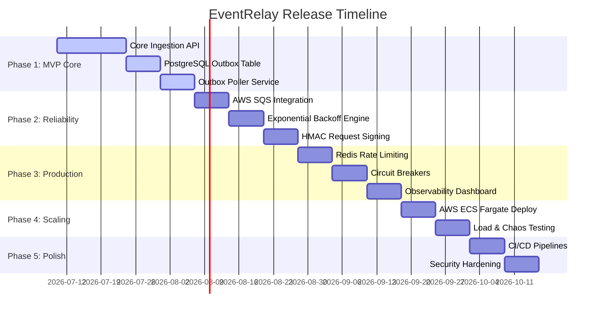

# EventRelay — Roadmap

This document outlines the phased development roadmap for EventRelay. It spans five distinct phases, moving from a single-node Minimal Viable Product (MVP) to a production-grade, highly available, and auto-scaling distributed system.

---

## Phase 1: Minimal Viable Product (MVP) — Weeks 1-4

The goal of Phase 1 is to establish the core ingestion pipeline, the database schema, and the transactional outbox pattern to guarantee that no incoming events are lost.

### Key Milestones & Deliverables
1. **Core Domain & Database Schema**: Initial tables for tenants, subscriptions, events, and the outbox log using Flyway migrations.
2. **Ingest Service API**: REST endpoints to accept events (`POST /api/v1/events`) and authenticate requests using basic API keys.
3. **Transactional Outbox Writer**: Spring Boot service layer that writes both the event log and the outbox record in a single database transaction.
4. **Outbox Poller**: A scheduled worker that polls the outbox table using `SELECT FOR UPDATE SKIP LOCKED` and publishes directly to a mock dispatcher.
5. **Basic HTTP Dispatcher**: A single-threaded worker that makes HTTP POST requests to the target subscription URL.

### Dependencies
* Database configuration (PostgreSQL 15+)
* Spring Boot 3.2.x framework setup

---

## Phase 2: Distributed Reliability — Weeks 5-7

Phase 2 transitions the architecture from a single-node poller to a decoupled, queue-backed distributed system utilizing AWS SQS, introducing critical reliability guarantees.

### Key Milestones & Deliverables
1. **AWS SQS Integration**: Decouple the outbox poller from the dispatcher by publishing events to an SQS queue.
2. **Exponential Backoff & Jitter**: Implement the backoff algorithm in the dispatcher workers with decorrelated jitter to prevent thundering herds on failing receivers.
3. **Dead-Letter Queue (DLQ)**: Configure SQS DLQ redrive policies for events that exceed max retry attempts (default 5).
4. **HMAC Webhook Request Signing**: Compute HMAC-SHA256 signatures of payload + timestamp using tenant signing secrets and attach them to the `X-EventRelay-Signature` headers.
5. **Idempotency Check**: Redis-backed cache checking of client-provided idempotency keys in the ingestion path.

### Dependencies
* LocalStack for local SQS simulation
* Redis 7.x cluster setup

---

## Phase 3: Production Operations — Weeks 8-10

This phase focuses on tenant isolation, endpoint protection, and visibility. We ensure one tenant cannot exhaust system resources and developers can debug deliveries.

### Key Milestones & Deliverables
1. **Per-Tenant Rate Limiting**: Implement token bucket rate limiting in Redis using atomic Lua scripts.
2. **Circuit Breaker Integration**: Implement Resilience4j circuit breakers on webhook destinations to pause delivery attempts to endpoints that are down.
3. **Observability Stack**: Integrate Prometheus metrics (Micrometer) and structured JSON logging (Logback/MDC) containing tenant and event contexts.
4. **Grafana Dashboards**: Create dashboards visualizing delivery success rates, retry counts, queue latency (p95/p99), and throughput.
5. **Tenant Dashboard API**: Endpoints to list dead-lettered events and trigger manual replays.

### Dependencies
* Prometheus & Grafana stack running locally
* React-based UI mockup completion

---

## Phase 4: High Scalability & Chaos — Weeks 11-12

Phase 4 prepares the system for production-scale traffic, deploying to the cloud and validating guarantees under injected failure conditions.

### Key Milestones & Deliverables
1. **ECS Fargate Provisioning**: Terraform modules for ALB, ECS Cluster, Task Definitions, VPC, and NAT Gateways.
2. **ECS Auto-Scaling**: Configure auto-scaling rules based on CPU utilization and SQS queue depth (`ApproximateNumberOfMessagesVisible`).
3. **Load Testing**: Execute k6 testing scripts simulating 5,000 requests/sec ingest and worker scale-out.
4. **Chaos Engineering**: Run Toxiproxy and Testcontainers integration suites to verify zero-loss guarantees during simulated SQS network drops and worker crashes.

### Dependencies
* AWS Sandbox access
* Docker registry (ECR) config

---

## Phase 5: Hardening & Release — Weeks 13-14

The final phase secures the system, automates delivery pipelines, and completes documentation.

### Key Milestones & Deliverables
1. **GitHub Actions CI/CD**: Build multi-stage Docker images, run unit/integration tests, and deploy to ECS on merge to `main`.
2. **Secret Rotation**: Implement zero-downtime signing secret rotation and database credential rotation via AWS Secrets Manager.
3. **Security Audit**: Scan dependencies for CVEs, implement SSRF protection on dispatcher URLs, and establish CORS policies.
4. **Runbooks & Documentation**: Create operational playbooks for disaster recovery, database migration rollbacks, and capacity planning.

---

## Risk Management & Mitigation

| Identified Risk | Impact | Likelihood | Mitigation Strategy |
|-----------------|--------|------------|---------------------|
| Ingestion database bottlenecks | High | Medium | Implement partition logic on events table; tune HikariCP connection pool settings. |
| Malicious subscription URLs (SSRF) | Critical | Low | Validate target URLs against a blacklist of internal CIDR ranges (localhost, 10.0.0.0/8, etc.). |
| Quota limit exhaustion on SQS | Medium | Low | Request AWS service quota increases; utilize batch processing APIs for SQS send/receive operations. |
| Redis cache eviction data loss | High | Low | Configure Redis with `noeviction` policy for idempotency keys, and `allkeys-lru` only for transient caches. |
