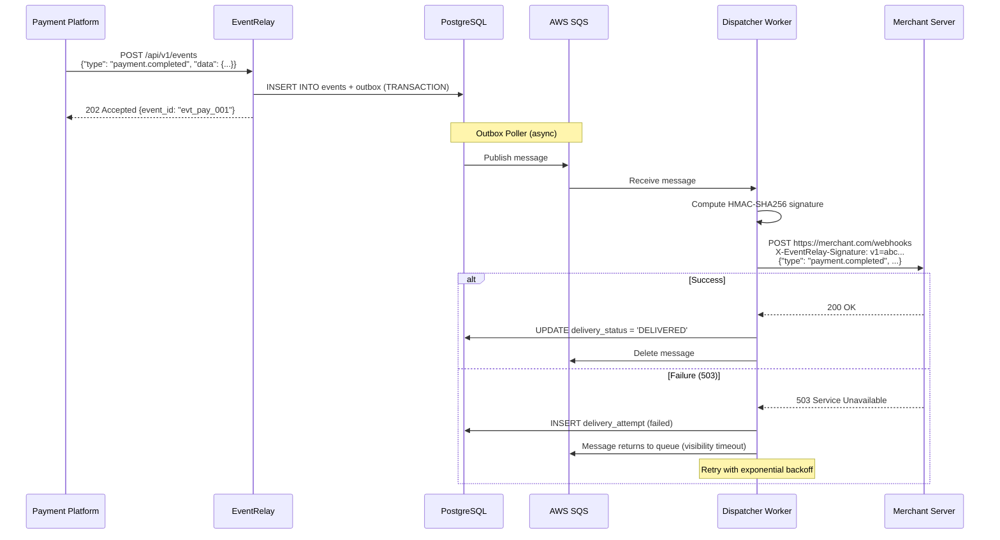
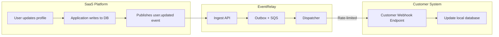

# EventRelay — Use Cases

> This document defines the primary use cases for EventRelay, each with user stories, acceptance criteria, sequence flows, and edge cases. These use cases drive the functional requirements and test scenarios.

---

## Use Case Overview

| # | Use Case | Priority | Primary Actor | Event Volume |
|---|----------|----------|--------------|-------------|
| UC-1 | Payment Notification Delivery | **Critical** | Payment Platform | 1K-10K events/hour |
| UC-2 | CI/CD Pipeline Triggers | High | DevOps Platform | 100-1K events/hour |
| UC-3 | Real-Time Data Sync | High | SaaS Platform | 5K-50K events/hour |
| UC-4 | Event-Driven Microservices | High | Backend Engineers | 10K-100K events/hour |
| UC-5 | Partner Integration Webhooks | Medium | B2B Platform | 500-5K events/hour |
| UC-6 | Audit Trail Delivery | Medium | Compliance Team | 1K-10K events/hour |

---

## UC-1: Payment Notification Delivery

### Context

A payment processing platform (like Stripe or Razorpay) needs to notify merchants in real-time when payment events occur — charges, refunds, disputes, and payouts. Missing a payment notification can result in unshipped orders, unreconciled accounts, or customer support escalations.

### User Stories

**US-1.1: As a payment platform**, I want to register merchant webhook endpoints so that I can deliver payment event notifications to each merchant's server.

**US-1.2: As a payment platform**, I want payment events to be reliably delivered even if a merchant's server is temporarily down, so that no payment notification is ever permanently lost.

**US-1.3: As a merchant**, I want to verify that incoming webhooks genuinely came from the payment platform (not forged by an attacker), so that I can trust the data and act on it.

**US-1.4: As a payment platform**, I want to see which deliveries failed and why, so that I can proactively alert merchants about endpoint issues.

### Sequence Flow



### Acceptance Criteria

| # | Criterion | Verification |
|---|-----------|-------------|
| AC-1.1 | Payment events are accepted and acknowledged within 100ms (p99) | Load test |
| AC-1.2 | Events are delivered to merchant endpoints with HMAC-SHA256 signature | Integration test |
| AC-1.3 | Failed deliveries are retried with exponential backoff (1s, 5s, 30s, 5m, 30m, 1h, 2h, 4h) | Unit test + integration test |
| AC-1.4 | After max retries (8), event is moved to dead-letter queue | Integration test |
| AC-1.5 | Duplicate events (same idempotency key) are rejected with 409 Conflict | API test |
| AC-1.6 | Delivery status is queryable via `GET /api/v1/events/{id}/deliveries` | API test |
| AC-1.7 | DLQ events can be replayed via `POST /api/v1/events/{id}/replay` | API test |

### Edge Cases

| Edge Case | Expected Behavior |
|-----------|-------------------|
| Merchant returns 301 redirect | Do NOT follow redirects — treat as failure (security risk) |
| Merchant returns 200 but connection resets before full ACK | Treat as ambiguous — retry (at-least-once) |
| Payment event payload is 300KB (large) | Accept up to 256KB default limit; reject larger with 413 |
| 1000 merchants all have the same endpoint URL | Each subscription is independent; deliver separately |
| Merchant endpoint uses self-signed SSL cert | Reject — require valid TLS certificates |
| Merchant returns 200 after 25 seconds | Timeout at 30s — mark as success (received 200) |
| Merchant returns 200 after 35 seconds | Timeout at 30s — mark as timeout, retry |

---

## UC-2: CI/CD Pipeline Triggers

### Context

A source code hosting platform (like GitHub or GitLab) needs to trigger CI/CD builds, deployments, and notifications when code changes occur. Webhooks to CI systems must be reliable — a missed `push` webhook means a build doesn't start, and developers waste time wondering why.

### User Stories

**US-2.1: As a DevOps platform**, I want to register CI/CD webhook endpoints (Jenkins, GitHub Actions, ArgoCD) for specific event types (push, pull_request, tag), so that builds are triggered automatically.

**US-2.2: As a DevOps platform**, I want to filter events by type, so that a CI system only receives `push` events and a deployment system only receives `release` events.

**US-2.3: As a DevOps engineer**, I want to see a log of all webhook deliveries for debugging, so that when a build doesn't trigger, I can determine whether the webhook was sent and what response was received.

### Event Types

| Event Type | Trigger | Typical Consumer |
|------------|---------|-----------------|
| `code.push` | Code pushed to branch | CI build system |
| `code.pull_request.opened` | PR created | Code review bot, CI |
| `code.pull_request.merged` | PR merged | Deployment pipeline |
| `code.tag.created` | Release tag pushed | Release pipeline |
| `code.branch.created` | New branch created | Environment provisioner |
| `code.branch.deleted` | Branch deleted | Cleanup automation |

### Acceptance Criteria

| # | Criterion | Verification |
|---|-----------|-------------|
| AC-2.1 | Subscriptions can filter by event type (e.g., only `code.push`) | API test |
| AC-2.2 | Multiple subscriptions for the same tenant deliver independently | Integration test |
| AC-2.3 | Delivery latency for first attempt is < 500ms (p99) | Performance test |
| AC-2.4 | Event history is queryable with filters (type, status, date range) | API test |
| AC-2.5 | Webhook payload includes event type in a header (`X-Event-Type`) | Integration test |

### Edge Cases

| Edge Case | Expected Behavior |
|-----------|-------------------|
| Developer pushes 50 commits in a batch | Single `code.push` event with commit list |
| CI system is scaling up (cold start) | Retry handles initial timeouts; deliver on retry |
| Same repo triggers 3 different CI systems | 3 separate subscriptions, 3 independent deliveries |
| Webhook URL changes mid-delivery | In-flight deliveries use the URL at subscription time |
| Event type is not subscribed by anyone | Event is accepted and stored but no delivery occurs |

---

## UC-3: Real-Time Data Sync

### Context

A SaaS platform needs to sync data changes (user profiles, inventory updates, configuration changes) to customer systems in near-real-time. Unlike periodic batch sync, webhook-based sync provides immediate updates — but requires reliability guarantees to prevent data drift.

### User Stories

**US-3.1: As a SaaS platform**, I want to push data changes to customer endpoints as they happen, so that customers always have up-to-date data without polling our API.

**US-3.2: As a SaaS customer**, I want to receive webhook events in the order they occurred, so that I can apply changes sequentially without data corruption.

**US-3.3: As a SaaS platform**, I want to rate-limit webhook delivery per customer, so that a high-volume customer doesn't overwhelm their own receiving infrastructure.

### Data Sync Flow



### Acceptance Criteria

| # | Criterion | Verification |
|---|-----------|-------------|
| AC-3.1 | Events include `sequence_number` for consumer-side ordering | API test |
| AC-3.2 | Rate limiting respects per-tenant configuration (e.g., 50 req/s) | Load test |
| AC-3.3 | Rate-limited events are queued, not dropped | Integration test |
| AC-3.4 | Events include both current and previous data (`data` + `previous_data`) for change detection | API test |
| AC-3.5 | High-throughput sync (1000 events/s) doesn't degrade other tenants | Isolation test |

### Edge Cases

| Edge Case | Expected Behavior |
|-----------|-------------------|
| Customer's system is 10x slower than event rate | Events queue up; rate limiter smooths delivery |
| Same entity updated 100 times in 1 second | All 100 events delivered; consumer deduplicates by sequence number |
| Customer disables sync temporarily | Events accumulate in queue; delivered when re-enabled |
| Event payload contains sensitive PII | Payload stored encrypted; HMAC signing ensures integrity |
| Customer migrates to a new endpoint URL | Subscription update takes effect for new events; in-flight events use old URL |

---

## UC-4: Event-Driven Microservices Communication

### Context

A backend engineering team is building an event-driven architecture where microservices communicate via webhooks. For example, when an order service creates an order, it fires events consumed by the fulfillment service, notification service, and analytics service.

### User Stories

**US-4.1: As a backend engineer**, I want to publish domain events (order.created, order.shipped, order.cancelled) to EventRelay, so that downstream services receive them reliably without point-to-point integration.

**US-4.2: As a backend engineer**, I want each downstream service to independently subscribe to the event types it cares about, so that adding new consumers doesn't require changes to the publisher.

**US-4.3: As a backend engineer**, I want to see end-to-end event flow from publication to delivery across all consumers, so that I can debug integration issues quickly.

### Architecture

```mermaid
graph TB
    subgraph "Event Producers"
        OS[Order Service]
        PS[Payment Service]
        IS[Inventory Service]
    end
    
    subgraph "EventRelay"
        API[Ingest API]
        Q[SQS Queue]
        D[Dispatcher Workers]
    end
    
    subgraph "Event Consumers"
        FS[Fulfillment Service<br/>subscribes: order.created, order.cancelled]
        NS[Notification Service<br/>subscribes: order.*, payment.*]
        AS[Analytics Service<br/>subscribes: * (all events)]
    end
    
    OS & PS & IS -->|POST /events| API
    API --> Q --> D
    D -->|webhook| FS
    D -->|webhook| NS
    D -->|webhook| AS
```

### Acceptance Criteria

| # | Criterion | Verification |
|---|-----------|-------------|
| AC-4.1 | Multiple consumers can subscribe to the same event type independently | Integration test |
| AC-4.2 | Wildcard subscriptions (`order.*`) deliver all matching events | API test |
| AC-4.3 | Failure of one consumer's endpoint doesn't block delivery to others | Integration test |
| AC-4.4 | Event fan-out to 10+ consumers completes within 2 seconds for first attempt | Performance test |
| AC-4.5 | Each consumer's delivery is retried independently | Integration test |

### Edge Cases

| Edge Case | Expected Behavior |
|-----------|-------------------|
| Consumer A is down, B and C are up | A's delivery enters retry; B and C receive immediately |
| New consumer subscribes after events were published | Only receives new events from subscription creation time |
| Consumer processes event but returns 500 by mistake | EventRelay retries — consumer must handle idempotently |
| Event type matches 20 subscriptions | All 20 deliveries created and dispatched independently |
| Producer publishes 10K events/second burst | SQS absorbs burst; workers process at sustainable rate |

---

## UC-5: Partner Integration Webhooks

### Context

A B2B platform needs to deliver integration webhooks to partner organizations. Partners have varying technical capabilities — from sophisticated microservices architectures to simple PHP scripts on shared hosting. The platform must deliver reliably to all of them while protecting partners from being overwhelmed.

### User Stories

**US-5.1: As a B2B platform**, I want to onboard partner webhook endpoints with API key authentication, so that each partner receives events securely with their own signing secret.

**US-5.2: As a B2B platform**, I want to configure different rate limits per partner (based on their plan), so that enterprise partners can receive higher throughput while free-tier partners are protected from overload.

**US-5.3: As a partner**, I want to manually replay failed webhooks when my system recovers from an outage, so that I don't lose any events during downtime.

### Tenant Configuration

```json
{
  "tenant_id": "ten_partner_acme",
  "name": "Acme Corporation",
  "plan": "enterprise",
  "config": {
    "rate_limit": {
      "requests_per_second": 100,
      "burst_size": 200
    },
    "retry": {
      "max_attempts": 10,
      "backoff_multiplier": 2.0,
      "max_backoff_seconds": 14400
    },
    "signing": {
      "algorithm": "hmac-sha256",
      "secret": "whsec_************",
      "header_name": "X-EventRelay-Signature"
    }
  },
  "subscriptions": [
    {
      "subscription_id": "sub_acme_orders",
      "target_url": "https://api.acme.com/webhooks/orders",
      "event_types": ["order.created", "order.updated", "order.cancelled"],
      "active": true
    }
  ]
}
```

### Acceptance Criteria

| # | Criterion | Verification |
|---|-----------|-------------|
| AC-5.1 | Each tenant has isolated API keys and signing secrets | Security test |
| AC-5.2 | Rate limits are configurable per tenant and enforced | Load test |
| AC-5.3 | DLQ events are filterable by tenant for manual replay | API test |
| AC-5.4 | Tenant can be deactivated without losing queued events | Integration test |
| AC-5.5 | Signing secrets can be rotated with dual-key support | Security test |
| AC-5.6 | Tenant dashboard shows delivery metrics (success rate, latency, failures) | UI test |

### Edge Cases

| Edge Case | Expected Behavior |
|-----------|-------------------|
| Partner endpoint returns 401 (auth changed) | Retry (may be transient); alert after 3 consecutive 401s |
| Partner's server is HTTP-only (no HTTPS) | Reject subscription — require HTTPS for security |
| Partner requests 10,000 req/s rate limit | Apply platform maximum (e.g., 500 req/s) regardless of request |
| Partner rotates signing secret | Support dual secrets during 24h transition window |
| Partner deletes their subscription but has events in retry queue | Discard pending retries for deleted subscriptions |

---

## UC-6: Audit Trail Delivery

### Context

A platform operating in a regulated industry (fintech, healthcare, enterprise SaaS) needs to deliver audit events to compliance and monitoring systems. Every data access, permission change, and sensitive operation generates an audit event that must be reliably delivered and stored for regulatory compliance.

### User Stories

**US-6.1: As a compliance officer**, I want every security-sensitive action to be delivered as a webhook to our SIEM system, so that we have a complete audit trail for regulatory audits (SOC 2, HIPAA, GDPR).

**US-6.2: As a compliance officer**, I want to verify that no audit events were lost during delivery, so that I can certify completeness of the audit trail.

**US-6.3: As a security engineer**, I want audit events to include tamper-evident signatures, so that I can detect if any event was modified in transit.

### Audit Event Types

| Event Type | Trigger | Sensitivity |
|------------|---------|-------------|
| `audit.user.login` | User authenticates | Medium |
| `audit.user.login_failed` | Failed authentication | High |
| `audit.user.permission_changed` | Role/permission update | High |
| `audit.data.accessed` | Sensitive data viewed | High |
| `audit.data.exported` | Bulk data export | Critical |
| `audit.data.deleted` | Data deletion | Critical |
| `audit.config.changed` | System configuration change | High |
| `audit.api_key.created` | API key provisioned | High |
| `audit.api_key.revoked` | API key revoked | High |

### Acceptance Criteria

| # | Criterion | Verification |
|---|-----------|-------------|
| AC-6.1 | Audit events are immutable — once accepted, they cannot be modified or deleted | Database constraint test |
| AC-6.2 | Every event has a `sequence_number` for gap detection by consumers | API test |
| AC-6.3 | Events include HMAC signature for tamper evidence | Integration test |
| AC-6.4 | Event retention is configurable per tenant (30, 90, 365 days) | Configuration test |
| AC-6.5 | Delivery history is retained for the full retention period | Data lifecycle test |
| AC-6.6 | API supports querying events by date range for audit purposes | API test |
| AC-6.7 | DLQ has zero tolerance — alerts fire immediately when any audit event enters DLQ | Alerting test |

### Edge Cases

| Edge Case | Expected Behavior |
|-----------|-------------------|
| SIEM system is down for maintenance | Events queued and retried; alert compliance team after 30 min |
| Audit event volume spikes during data migration | Rate limiting ensures SIEM isn't overwhelmed |
| Audit event is large (10KB+ with full context) | Accept within payload limits; compress if needed |
| Tenant attempts to delete an audit event | Reject — audit events are immutable |
| Clock skew between producer and EventRelay | Use EventRelay's server timestamp as authoritative |
| Regulatory audit requests complete event history | `GET /api/v1/events?type=audit.*&since=2026-01-01&until=2026-06-30` |

---

## Use Case Interaction Matrix

Shows how use cases share EventRelay capabilities:

| Capability | UC-1 Payment | UC-2 CI/CD | UC-3 Sync | UC-4 Microservices | UC-5 Partner | UC-6 Audit |
|------------|:---:|:---:|:---:|:---:|:---:|:---:|
| Event ingestion | ✅ | ✅ | ✅ | ✅ | ✅ | ✅ |
| HMAC signing | ✅ | ✅ | ✅ | ⚪ | ✅ | ✅ |
| Retry (exponential backoff) | ✅ | ✅ | ✅ | ✅ | ✅ | ✅ |
| Dead-letter queue | ✅ | ✅ | ✅ | ✅ | ✅ | ✅ |
| Rate limiting | ⚪ | ⚪ | ✅ | ⚪ | ✅ | ⚪ |
| Circuit breaker | ✅ | ⚪ | ✅ | ✅ | ✅ | ⚪ |
| Event type filtering | ✅ | ✅ | ✅ | ✅ | ✅ | ✅ |
| Wildcard subscriptions | ⚪ | ⚪ | ⚪ | ✅ | ⚪ | ✅ |
| Replay | ✅ | ✅ | ✅ | ✅ | ✅ | ✅ |
| Audit/compliance | ⚪ | ⚪ | ⚪ | ⚪ | ⚪ | ✅ |
| Idempotency enforcement | ✅ | ⚪ | ✅ | ✅ | ✅ | ✅ |

✅ = Critical &nbsp; ⚪ = Nice to have

---

> [!NOTE]
> Each use case should be validated through end-to-end integration tests that simulate realistic traffic patterns, failure scenarios, and recovery flows. See the testing strategy documentation for implementation details.
