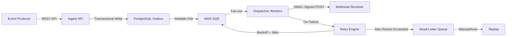
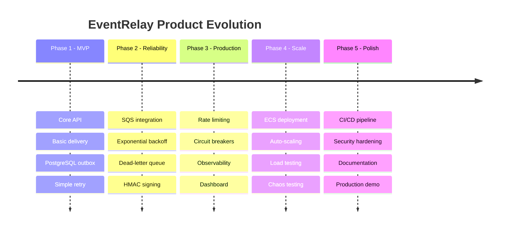

# EventRelay — Vision

> **Vision Statement:** EventRelay is the reliability layer for webhook delivery — guaranteeing that every event reaches its destination, every time, even when the internet doesn't cooperate.

---

## 1. Why EventRelay Exists

Webhooks are the backbone of modern software integration. Every time a payment succeeds on Stripe, a commit lands on GitHub, or an order ships on Shopify, a webhook fires. Yet despite their ubiquity, **most webhook implementations are dangerously fragile** — a single failed HTTP call can silently drop critical business data.

EventRelay exists to solve this fundamental problem: **making webhook delivery as reliable as the events themselves.**

### The Webhook Paradox

Webhooks are deceptively simple — "just POST to a URL" — but production-grade delivery requires solving an entire class of distributed systems challenges:

| Challenge | Naive Approach | EventRelay Approach |
|-----------|---------------|---------------------|
| Receiver is down | Event lost forever | Persistent queue + exponential backoff retry |
| Network timeout | Unclear delivery state | Idempotency keys + at-least-once guarantee |
| Burst traffic | Receiver overwhelmed | Per-tenant rate limiting (token bucket) |
| Payload tampering | No verification | HMAC-SHA256 request signing |
| Debugging failures | No visibility | Full event log + dead-letter queue + replay |
| Receiver is slow | Blocks sender | Async dispatch via SQS workers |

---

## 2. Market Opportunity

### The Webhook Infrastructure Gap

The webhook delivery market is at an inflection point:

- **$2.4B+ API management market** (2024), with webhooks as the fastest-growing integration pattern
- **92% of SaaS platforms** use webhooks for real-time notifications (Zapier State of APIs, 2023)
- **~15% of webhook deliveries fail** on first attempt across the industry (Svix benchmark data)
- **Most companies build in-house** — poorly — because no standard solution existed until recently

### Why Now?

1. **Event-driven architecture adoption** is accelerating (microservices, serverless, real-time)
2. **Compliance requirements** (SOC 2, GDPR) demand audit trails for data movement
3. **Developer experience expectations** have risen — teams expect Stripe-level webhook UX
4. **Cloud-native infrastructure** (SQS, ECS, Redis) makes building this 10x cheaper than 5 years ago

---

## 3. What Makes EventRelay Different

### Beyond "Just HTTP POST"

EventRelay is not a simple HTTP client with retries. It is a **complete delivery guarantee system** built on battle-tested distributed systems patterns:

### Core Differentiators

| Capability | Basic Webhook | EventRelay |
|------------|--------------|------------|
| Delivery guarantee | Best-effort (fire-and-forget) | At-least-once with idempotency |
| Retry strategy | Fixed interval or none | Exponential backoff with jitter (1s → 1h) |
| Failure handling | Silent loss | DLQ + inspection + replay |
| Security | Plain HTTP | HMAC-SHA256 per-tenant signing |
| Multi-tenancy | N/A | Full tenant isolation with rate limiting |
| Observability | Logs (maybe) | Prometheus metrics + event explorer + delivery audit trail |
| Scalability | Single process | Horizontally scalable workers on ECS/Fargate |
| Data integrity | No guarantees | Transactional outbox pattern — no lost events |

---

## 4. Competitive Landscape

### Comparison with Existing Solutions

| Feature | EventRelay | Svix | Hookdeck | In-House |
|---------|-----------|------|----------|----------|
| **Delivery model** | At-least-once | At-least-once | At-least-once | Varies |
| **Hosting** | Self-hosted (AWS) | SaaS + self-hosted | SaaS only | Self-hosted |
| **Queue backend** | AWS SQS | Redis/PostgreSQL | Proprietary | Varies |
| **Retry strategy** | Exponential + jitter | Exponential | Configurable | Usually basic |
| **HMAC signing** | SHA-256 (built-in) | Webhooks standard | SHA-256 | Manual |
| **Dead-letter queue** | Built-in + replay | Built-in | Built-in | Rarely |
| **Rate limiting** | Token bucket (Redis) | Built-in | Built-in | Rarely |
| **Circuit breaker** | Built-in | Endpoint disabling | Built-in | Rarely |
| **Cost** | Infrastructure only | $0.02/msg (SaaS) | $0.006/event | Engineering time |
| **Vendor lock-in** | None (OSS) | Low | Medium | None |
| **Setup complexity** | Medium | Low (SaaS) | Low (SaaS) | High |
| **Customization** | Full control | API-driven | Limited | Full control |

### EventRelay's Sweet Spot

EventRelay targets the gap between:
- **"Just use HttpClient"** — teams that need more reliability than a raw HTTP call but haven't built infrastructure
- **"Just use Svix SaaS"** — teams that need self-hosted control, compliance requirements, or AWS-native integration

---

## 5. Target Users

### Primary Personas

#### 1. SaaS Platform Engineers
> *"We need to notify 500+ customer endpoints when events happen in our platform, and we can't afford to lose a single payment notification."*

- Building webhook systems for their SaaS products
- Need multi-tenant isolation and per-customer rate limiting
- Care about delivery SLAs and audit trails
- **Example:** A payment platform notifying merchants of transaction events

#### 2. Backend/Infrastructure Engineers
> *"We're building event-driven microservices and need a reliable way to fan out events to internal and external consumers."*

- Designing event-driven architectures
- Need transactional outbox to prevent dual-write problems
- Want Prometheus/Grafana integration for observability
- **Example:** An e-commerce platform syncing order events to fulfillment, analytics, and notification services

#### 3. Enterprise Integration Teams
> *"We have strict compliance requirements and can't send data through third-party SaaS — we need a self-hosted solution with full audit trails."*

- Operating in regulated industries (fintech, healthcare)
- Need self-hosted deployment with VPC control
- Require complete event audit logs for compliance
- **Example:** A healthcare platform delivering HIPAA-compliant event notifications

#### 4. Developer Experience Teams
> *"Our developers waste hours debugging webhook failures. We need visibility into what was sent, when, and what failed."*

- Responsible for developer-facing APIs and documentation
- Need dashboard for event inspection and replay
- Want clear error messages and delivery status APIs
- **Example:** An API platform providing webhook delivery status to its customers

### Secondary Personas

| Persona | Need | EventRelay Value |
|---------|------|-----------------|
| DevOps Engineers | Reliable deployment, auto-scaling | ECS/Fargate, CloudWatch, health checks |
| Security Engineers | Payload integrity, key rotation | HMAC signing, API key management |
| Product Managers | Delivery metrics, SLA reporting | Dashboard, success rate tracking |

---

## 6. Long-Term Product Vision

### Phase Evolution

### Future Vision (Beyond v1)

| Capability | Description | Timeline |
|------------|-------------|----------|
| **Event Transformations** | JSONPath/JMESPath transforms before delivery | v2 |
| **Fan-out Patterns** | One event → multiple subscribers with filtering | v2 |
| **GraphQL Subscriptions** | WebSocket-based real-time delivery alternative | v2 |
| **Multi-region** | Active-active deployment across AWS regions | v3 |
| **Event Schema Registry** | Schema validation + evolution (Avro/JSON Schema) | v3 |
| **Self-service Portal** | Tenant onboarding, key management, analytics | v3 |
| **Webhook Standard** | Full compliance with emerging webhook standards | v3 |

---

## 7. Success Metrics

### North Star Metric

> **Delivery Success Rate ≥ 99.95%** — measured as the percentage of events that are successfully delivered (HTTP 2xx) within the retry window.

### Key Performance Indicators

| Metric | Target | Measurement |
|--------|--------|-------------|
| **First-attempt delivery latency (p99)** | < 500ms | Prometheus histogram |
| **Event ingestion latency (p99)** | < 100ms | API response time |
| **Delivery success rate** | ≥ 99.95% | Successful / total deliveries |
| **Retry recovery rate** | ≥ 95% | Events recovered via retry / total retried |
| **Dead-letter rate** | < 0.05% | Events in DLQ / total events |
| **System availability** | ≥ 99.9% | Uptime monitoring |
| **Throughput capacity** | ≥ 10,000 events/sec | Load testing |
| **Mean time to replay** | < 5 minutes | DLQ → successful delivery |

### Quality Gates

| Gate | Criteria |
|------|----------|
| **MVP Launch** | Core API works, basic retry, 100 events/sec |
| **Production Ready** | All NFRs met, monitoring in place, load tested |
| **Enterprise Ready** | Multi-tenant isolation, HMAC signing, audit trail |

---

## 8. Design Philosophy

EventRelay is built on these foundational beliefs:

1. **Events are precious** — Every event represents a real business action. Losing an event is unacceptable.
2. **The network is hostile** — Assume every HTTP call can fail, timeout, or return garbage. Design for it.
3. **Observability is not optional** — If you can't see what's happening, you can't fix it. Every event gets a trace.
4. **Simplicity enables reliability** — Fewer moving parts means fewer failure modes. Choose boring technology.
5. **Tenants are isolated** — One tenant's problems must never impact another tenant's delivery.

---

## 9. References

| Resource | Description |
|----------|-------------|
| [Stripe Webhooks](https://stripe.com/docs/webhooks) | Gold standard for webhook UX and reliability |
| [Svix](https://www.svix.com/) | Leading webhook-as-a-service platform |
| [Hookdeck](https://hookdeck.com/) | Event gateway for webhooks |
| [Standard Webhooks](https://www.standardwebhooks.com/) | Emerging industry standard for webhook delivery |
| [Transactional Outbox Pattern](https://microservices.io/patterns/data/transactional-outbox.html) | Core pattern for reliable event publishing |

---

> [!NOTE]
> This vision document is a living artifact. It should be revisited as the project evolves, market conditions change, and user feedback is incorporated. The core principle — **reliable delivery above all else** — remains constant.
