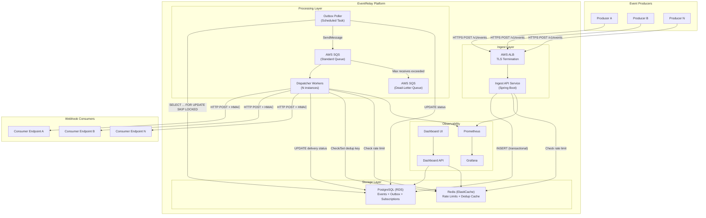
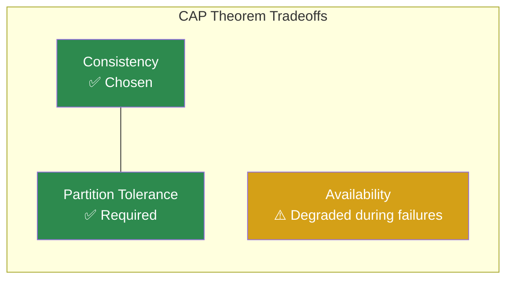
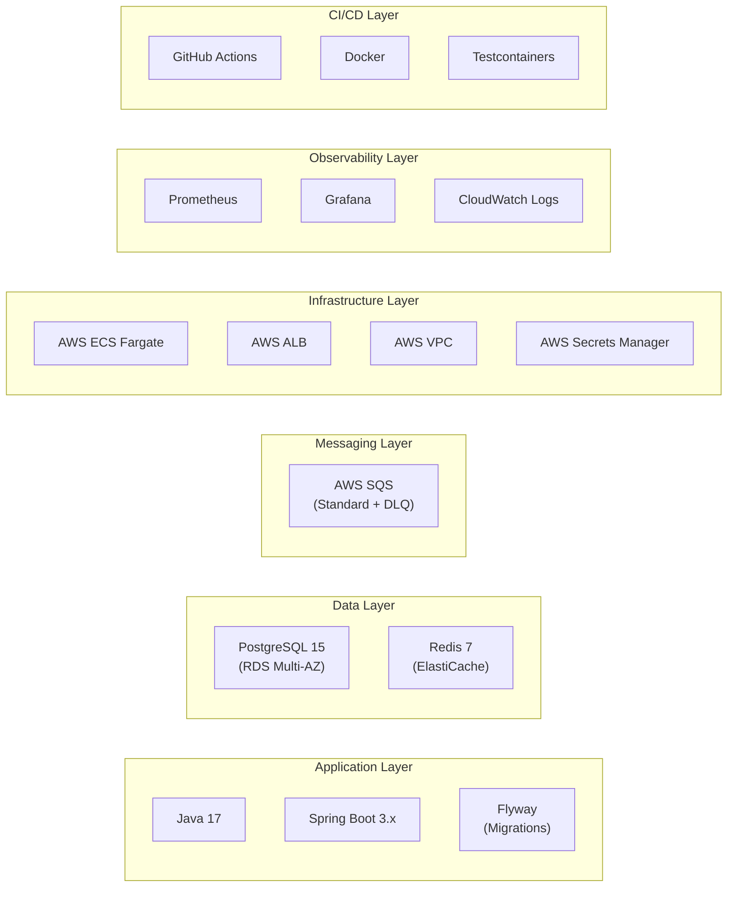

# EventRelay — System Architecture

> **Document Status:** Living Document · **Last Updated:** 2026-07-10 · **Owner:** Platform Engineering

## 1. Overview

EventRelay is a **reliable webhook delivery platform** that guarantees at-least-once delivery of HTTP callbacks to subscriber endpoints. It is designed for multi-tenant environments where durability, observability, and fault tolerance are non-negotiable requirements.

The system processes events submitted by upstream producers, persists them durably, and dispatches them as HTTP POST requests to registered subscriber URLs — handling retries, rate limiting, dead-lettering, and replay transparently.

> [!IMPORTANT]
> EventRelay guarantees **at-least-once delivery**, not exactly-once. Consumers must implement idempotency using the `X-EventRelay-Idempotency-Key` header included in every delivery attempt.

---

## 2. Architecture Style

EventRelay follows an **event-driven microservices architecture** with a **transactional outbox pattern** at its core. The system is decomposed into three primary services:

| Service | Role | Scaling Model |
|---|---|---|
| **Ingest API** | Accepts events, validates, persists to outbox | Horizontal (stateless) |
| **Outbox Poller** | Reads outbox, publishes to SQS | Single-leader with failover |
| **Dispatcher Workers** | Consumes SQS, delivers HTTP callbacks | Horizontal (SQS-driven autoscaling) |

Supporting infrastructure includes PostgreSQL (durable state), Redis (rate limiting & dedup cache), SQS (message queue), and a Dashboard API/UI for operational visibility.

---

## 3. High-Level Architecture Diagram

---

## 4. Key Design Decisions

### 4.1 Transactional Outbox Pattern vs. Direct Publishing

| Criteria | Direct Publishing (e.g., publish to SQS in API handler) | Transactional Outbox |
|---|---|---|
| **Atomicity** | ❌ Event accepted but SQS publish fails → lost event | ✅ Event + outbox row in same DB transaction |
| **Consistency** | ❌ Dual-write problem (DB + Queue) | ✅ Single write, single source of truth |
| **Failure Mode** | Lost messages on queue unavailability | At most delayed delivery (poller catches up) |
| **Complexity** | Lower initial complexity | Slightly higher (needs poller) |
| **Auditability** | Queue is ephemeral — no audit trail | ✅ Full audit trail in PostgreSQL |

**Decision:** We chose the transactional outbox pattern because **losing a webhook event is unacceptable**. The dual-write problem with direct publishing creates a class of bugs that are extremely difficult to detect and debug in production. The outbox pattern guarantees that if the API returns `202 Accepted`, the event **will** be delivered.

> [!NOTE]
> This is the same pattern used by Stripe for their webhook infrastructure and described in the "Transactional Outbox" section of Chris Richardson's *Microservices Patterns*.

### 4.2 AWS SQS vs. Apache Kafka

| Criteria | Apache Kafka | AWS SQS |
|---|---|---|
| **Operational Overhead** | High (brokers, ZooKeeper/KRaft, topic management) | Zero (fully managed) |
| **Ordering Guarantees** | Per-partition ordering | Best-effort (Standard) or FIFO |
| **Consumer Model** | Pull-based, consumer groups | Pull-based, visibility timeout |
| **Replay/Rewind** | ✅ Native log replay | ❌ Messages deleted after processing |
| **Throughput** | Very high (100K+ msg/sec per partition) | High (≈3,000 msg/sec per queue, unlimited with batching) |
| **Cost at Low Volume** | High (always-on brokers) | Very low (pay-per-message) |
| **Dead-Letter Queue** | Manual implementation | ✅ Native DLQ support |

**Decision:** SQS was chosen because:
1. **Operational simplicity** — no cluster management, no partition rebalancing, no broker failures to handle
2. **Cost efficiency** — pay-per-use vs. always-on broker infrastructure
3. **Native DLQ support** — critical for our retry/dead-letter architecture
4. **Sufficient throughput** — our target of 10K events/sec is well within SQS capabilities with batching
5. **Replay is handled at the application layer** — we store all events in PostgreSQL, so Kafka's log replay is redundant

> [!TIP]
> If EventRelay needs to scale beyond 100K events/sec or requires strict per-key ordering with high-throughput replay, Kafka (or Amazon MSK) should be reconsidered. The outbox pattern remains valid with either queue technology.

### 4.3 PostgreSQL vs. NoSQL (DynamoDB/MongoDB)

| Criteria | PostgreSQL | DynamoDB | MongoDB |
|---|---|---|---|
| **ACID Transactions** | ✅ Full | Limited (single-table) | Limited |
| **Relational Queries** | ✅ Native | ❌ Requires denormalization | Partial |
| **Outbox Pattern Support** | ✅ `SELECT FOR UPDATE SKIP LOCKED` | Requires DynamoDB Streams | Requires Change Streams |
| **Schema Evolution** | Migrations (Flyway) | Schema-free | Schema-free |
| **Operational Maturity** | Decades | High (AWS managed) | High |
| **Complex Queries (Dashboard)** | ✅ JOINs, aggregations, window functions | ❌ Limited | Partial |
| **JSON Support** | ✅ `jsonb` with indexing | Native | Native |

**Decision:** PostgreSQL was chosen because:
1. **Transactional outbox pattern** requires `SELECT ... FOR UPDATE SKIP LOCKED` — a PostgreSQL strength
2. **Multi-table transactions** — event ingestion writes to `events`, `outbox`, and `delivery_attempts` atomically
3. **Rich query support** — the Dashboard requires complex aggregations, filtering, and joins across events, subscriptions, and delivery attempts
4. **JSONB** — event payloads are stored as `jsonb`, giving us schema flexibility where needed while keeping relational integrity for metadata
5. **Mature ecosystem** — RDS PostgreSQL with Multi-AZ, read replicas, point-in-time recovery

---

## 5. CAP Theorem Analysis

EventRelay operates as a **CP system** (Consistency + Partition Tolerance) with high availability achieved through operational design rather than eventual consistency tradeoffs.

### Consistency vs. Availability Tradeoffs

| Scenario | Behavior | Justification |
|---|---|---|
| **PostgreSQL primary fails** | Ingest API returns `503`; no events accepted until failover completes (~30-60s with Multi-AZ) | Accepting events without durable storage would violate our delivery guarantee |
| **Redis unavailable** | Rate limiting falls back to a permissive default; dedup cache misses are tolerable (consumers handle idempotency) | Rate limiting is a best-effort protection; delivery correctness doesn't depend on it |
| **SQS unavailable** | Outbox poller pauses; events accumulate in the outbox table; delivery is delayed but not lost | The outbox is the source of truth, SQS is a transport optimization |
| **Network partition between workers and consumers** | Delivery attempts fail; retry engine activates; events eventually reach DLQ if consumer remains unreachable | This is the core value proposition — handling consumer unavailability gracefully |

### Why CP over AP?

For a webhook delivery platform, **data consistency is paramount**:
- An event that is accepted (`202 Accepted`) **must** eventually be delivered
- The system must never report a delivery as successful when it wasn't
- Duplicate delivery is acceptable (at-least-once); lost delivery is not

> [!WARNING]
> During a PostgreSQL failover (typically 30-60 seconds with RDS Multi-AZ), the Ingest API will reject new events with `503 Service Unavailable`. Producers should implement retry logic with exponential backoff. This is a deliberate tradeoff: we prefer temporary unavailability over risking data loss.

---

## 6. Architecture Principles

### 6.1 Core Principles

| Principle | Description | Implementation |
|---|---|---|
| **Durability First** | Every accepted event must be persisted before acknowledgment | Transactional outbox with PostgreSQL WAL |
| **At-Least-Once Delivery** | Events may be delivered more than once, but never lost | SQS visibility timeout + retry engine + DLQ |
| **Tenant Isolation** | One tenant's traffic must not impact another | Per-tenant rate limiting, tenant-scoped queries |
| **Observability** | Every event's lifecycle must be fully traceable | Structured logging, Prometheus metrics, delivery audit trail |
| **Defense in Depth** | Security at every layer | HMAC signing, API key auth, VPC isolation, encryption at rest/transit |
| **Graceful Degradation** | System degrades predictably under failure | Circuit breakers, rate limiters, DLQ, health checks |

### 6.2 Non-Functional Requirements

| Requirement | Target | Measurement |
|---|---|---|
| **Throughput** | 10,000 events/sec (sustained) | Prometheus `events_ingested_total` rate |
| **Delivery Latency (p50)** | < 500ms from ingestion to delivery | Prometheus histogram `delivery_latency_seconds` |
| **Delivery Latency (p99)** | < 2s from ingestion to delivery | Same histogram, 99th percentile |
| **Availability** | 99.95% (Ingest API) | ALB health check uptime |
| **Durability** | 99.9999% (no event loss) | Zero-loss validation via outbox reconciliation |
| **RTO** | < 5 minutes | Time to recover from component failure |
| **RPO** | 0 (zero data loss) | Transactional outbox guarantees |

---

## 7. Technology Stack Summary

| Layer | Technology | Version | Purpose |
|---|---|---|---|
| **Runtime** | Java | 17 (LTS) | Application runtime |
| **Framework** | Spring Boot | 3.x | REST APIs, dependency injection, configuration |
| **Database** | PostgreSQL | 15+ | Event store, outbox, subscriptions, delivery log |
| **Cache** | Redis | 7+ | Rate limiting (token bucket), idempotency dedup cache |
| **Queue** | AWS SQS | N/A | Asynchronous event dispatch, native DLQ |
| **Compute** | AWS ECS Fargate | N/A | Container orchestration, auto-scaling |
| **Load Balancer** | AWS ALB | N/A | TLS termination, health checks, routing |
| **Secrets** | AWS Secrets Manager | N/A | API keys, DB credentials, HMAC signing keys |
| **Migrations** | Flyway | 9+ | Database schema versioning |
| **CI/CD** | GitHub Actions | N/A | Build, test, deploy pipelines |
| **Testing** | Testcontainers + JUnit 5 | N/A | Integration tests with real PostgreSQL/Redis/SQS |
| **Monitoring** | Prometheus + Grafana | N/A | Metrics collection and visualization |

---

## 8. Cross-Cutting Concerns

### 8.1 Idempotency

Every event is assigned a unique `idempotency_key` (UUID v7) at ingestion time. This key is:
- Stored in the `events` table
- Included in the `X-EventRelay-Idempotency-Key` delivery header
- Cached in Redis for fast duplicate detection (TTL: 24 hours)
- Used by the Ingest API to reject duplicate submissions (same producer + same idempotency key)

### 8.2 Multi-Tenancy

EventRelay is multi-tenant by design:
- Every resource (subscription, event, delivery attempt) is scoped to a `tenant_id`
- API keys are tenant-scoped
- Rate limits are applied per-tenant
- Database queries always include `tenant_id` in WHERE clauses (with composite indexes)
- No shared-nothing architecture; all tenants share infrastructure but are logically isolated

### 8.3 Observability

Every event transition emits:
- A **structured log** (JSON) with correlation IDs (`event_id`, `tenant_id`, `subscription_id`, `delivery_attempt_id`)
- A **Prometheus metric** (counter, histogram, or gauge as appropriate)
- An **audit record** in the `delivery_attempts` table

---

## 9. Related Documents

| Document | Description |
|---|---|
| [Service Overview](./Service_Overview.md) | Detailed breakdown of each service component |
| [Component Interactions](./Component_Interactions.md) | Inter-service communication patterns and sequence diagrams |
| [Data Flow](./DataFlow.md) | End-to-end data flow with transformation details |
| [Event Flow](./EventFlow.md) | Event lifecycle and state machine |
| [Deployment](./Deployment.md) | AWS deployment architecture |
| [Scalability](./Scalability.md) | Scaling strategies and capacity planning |
| [High Availability](./High_Availability.md) | HA design and failover procedures |
| [Security Architecture](./Security_Architecture.md) | Security layers and threat model |
