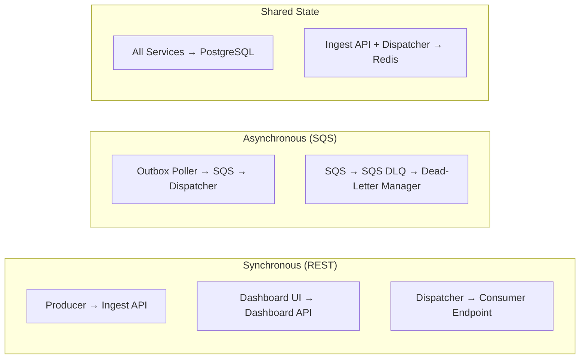
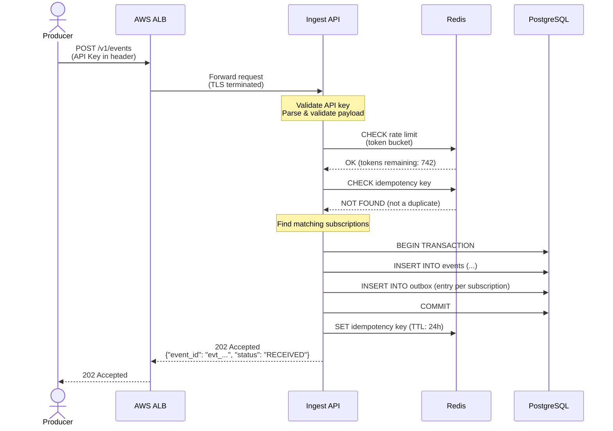
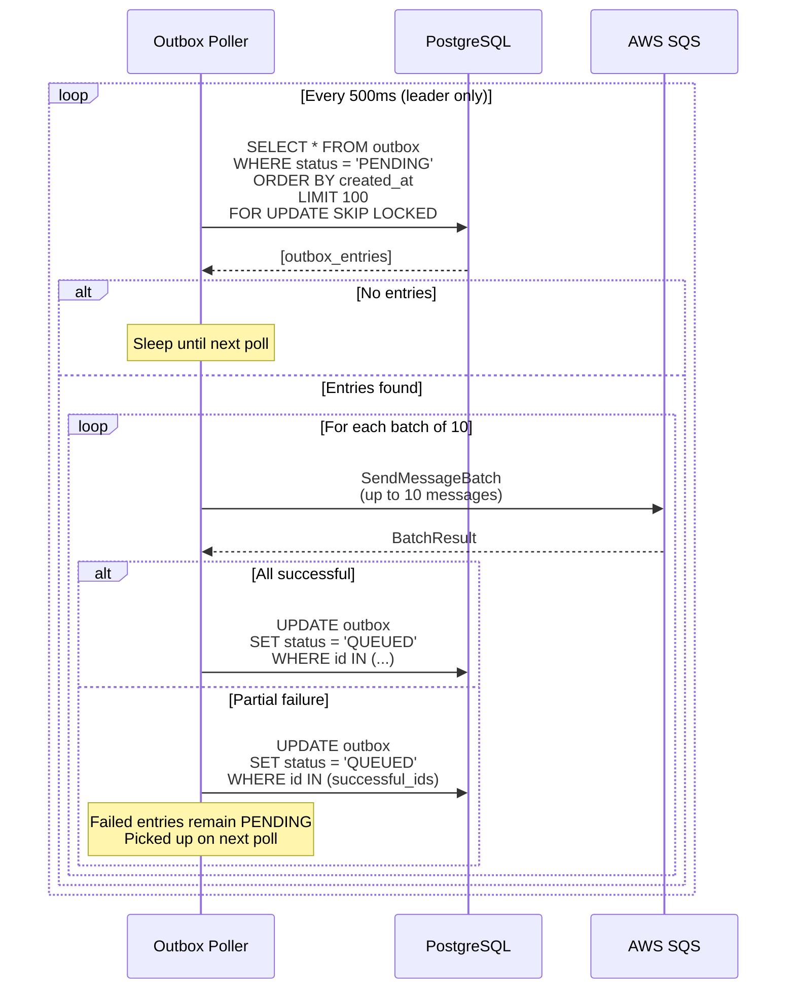
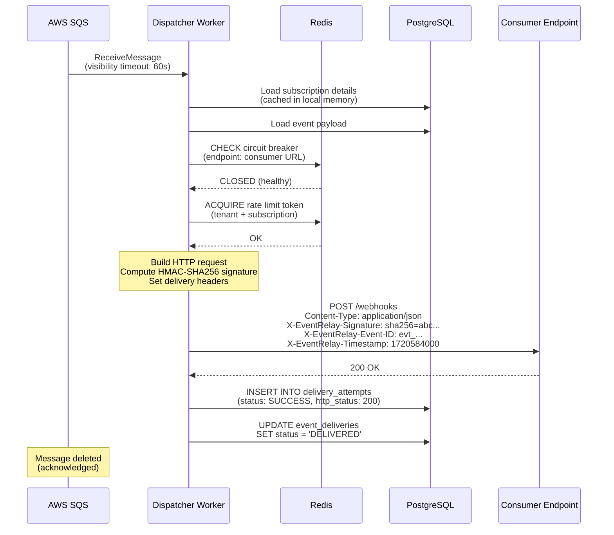
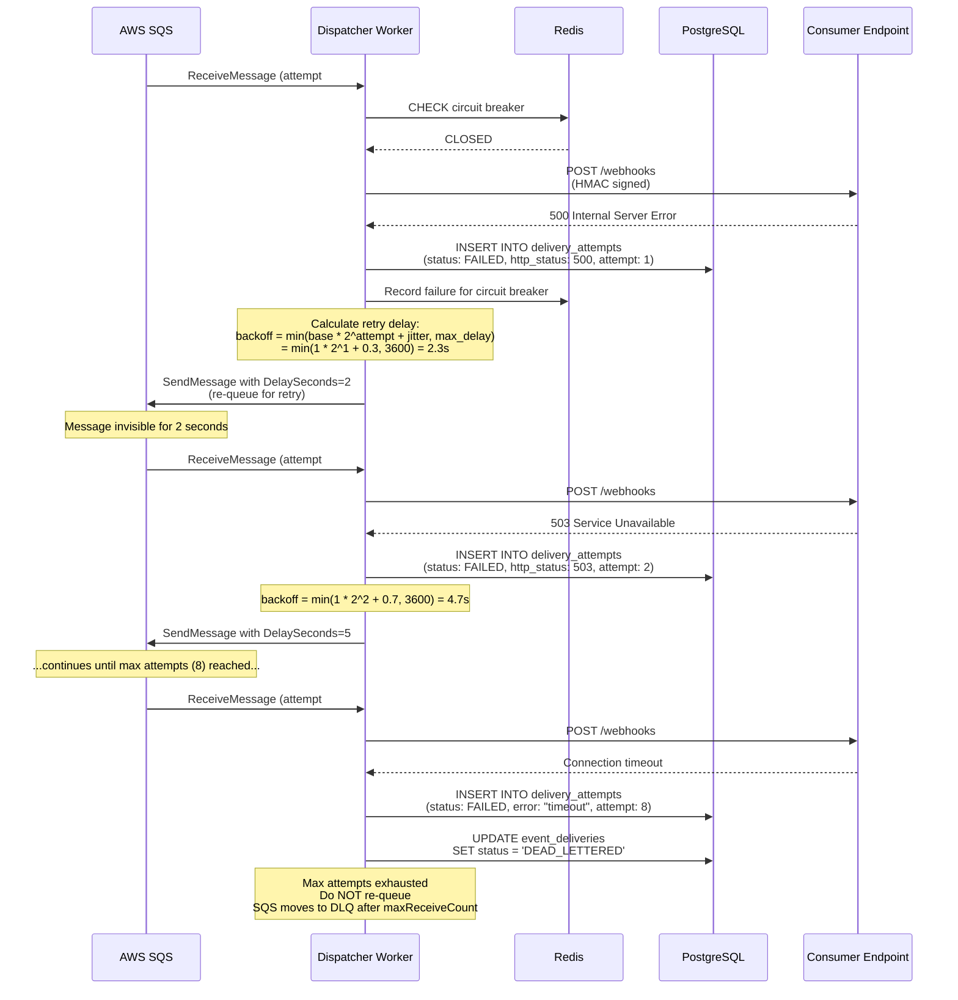
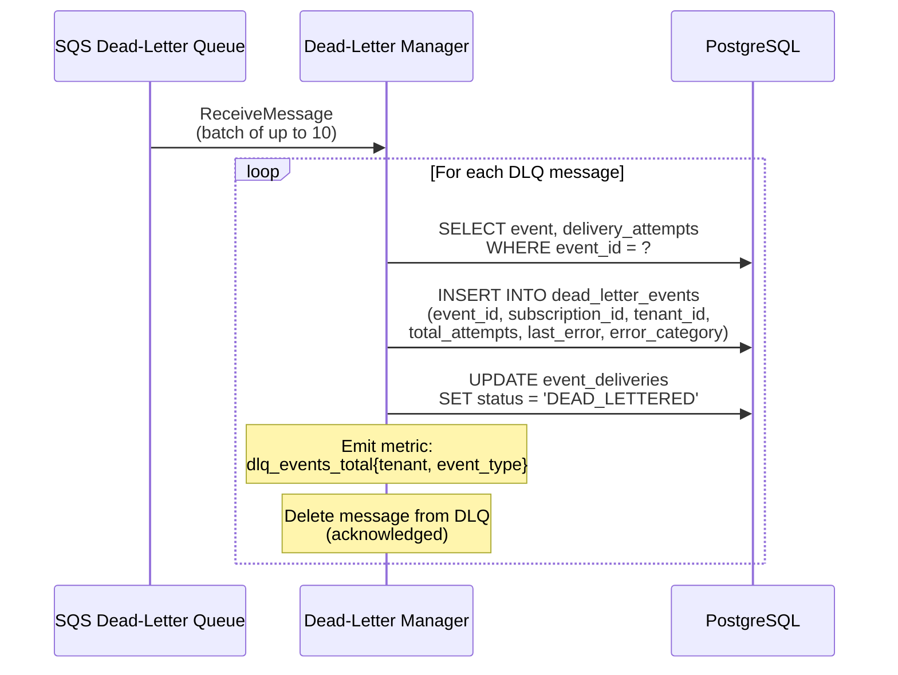
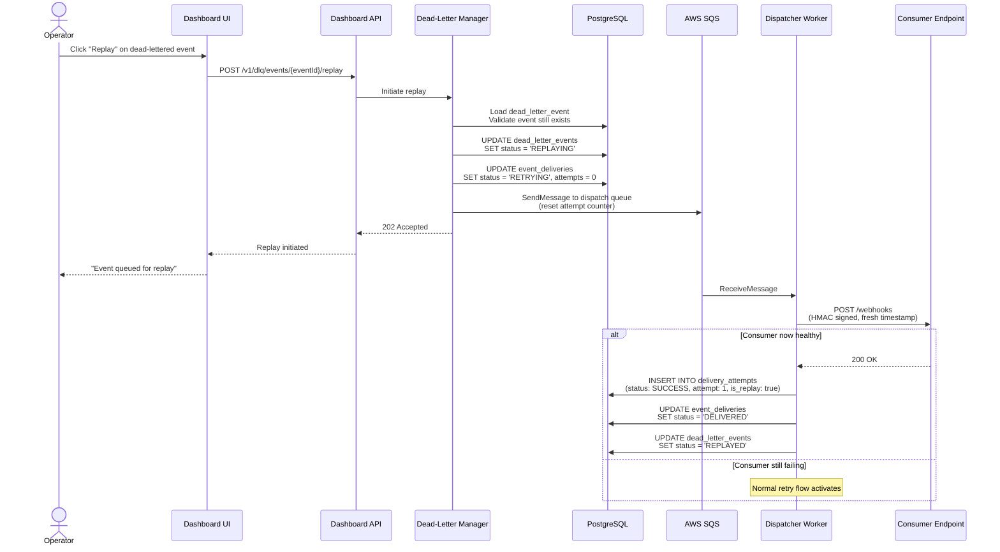
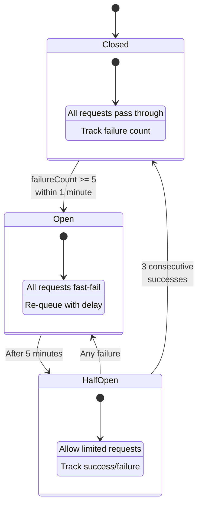
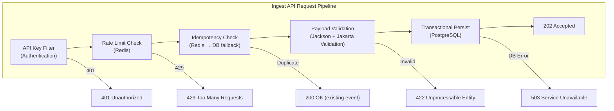
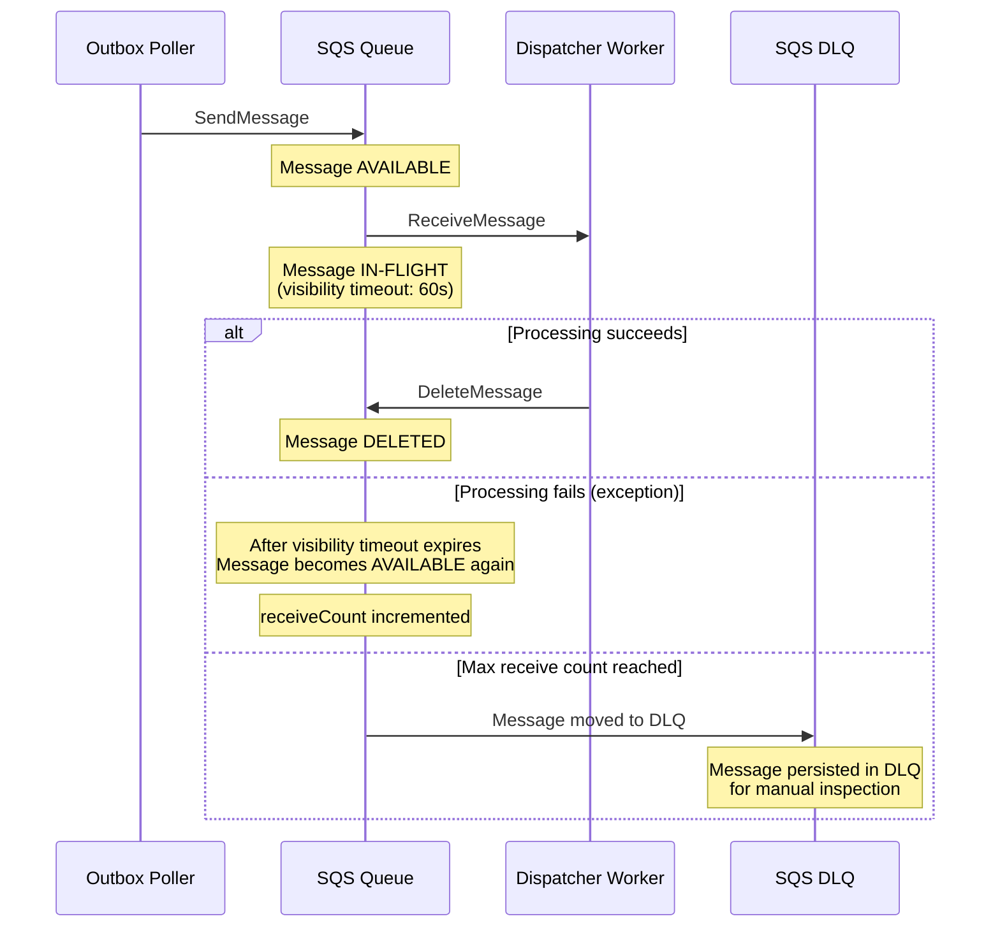

# EventRelay — Component Interactions

> **Document Status:** Living Document · **Last Updated:** 2026-07-10 · **Owner:** Platform Engineering

## 1. Communication Patterns Overview

EventRelay uses four distinct communication patterns:

| Pattern | Technology | Use Case | Latency | Coupling |
|---|---|---|---|---|
| **Synchronous REST** | HTTP/JSON | API requests, Dashboard queries | Low (< 100ms) | Tight |
| **Asynchronous Messaging** | AWS SQS | Event dispatch, DLQ processing | Variable (50ms–hours) | Loose |
| **Shared Database** | PostgreSQL | State management, audit trail | Low (< 10ms) | Medium |
| **Shared Cache** | Redis | Rate limiting, dedup, circuit breaker state | Very Low (< 1ms) | Low |



---

## 2. Sequence Diagrams

### 2.1 Event Ingestion (Happy Path)



### 2.2 Outbox Polling and SQS Publishing



### 2.3 Successful Webhook Delivery



### 2.4 Failed Delivery with Retry



### 2.5 Dead-Letter Queue Processing



### 2.6 Event Replay from Dead-Letter Queue



---

## 3. Inter-Component Data Contracts

### 3.1 SQS Message Schema (Outbox Poller → Dispatcher)

```json
{
  "messageId": "msg_01J5K...",
  "eventId": "evt_01J5K...",
  "subscriptionId": "sub_01J5K...",
  "tenantId": "tenant_acme",
  "eventType": "order.completed",
  "attemptNumber": 1,
  "maxAttempts": 8,
  "enqueuedAt": "2026-07-10T04:00:00.000Z",
  "outboxEntryId": "obx_01J5K..."
}
```

> [!NOTE]
> The SQS message does **not** contain the event payload. The Dispatcher Worker loads the full payload from PostgreSQL. This keeps SQS messages small (< 1 KB) and avoids SQS's 256 KB message size limit.

### 3.2 SQS Message Attributes

| Attribute | Type | Value | Purpose |
|---|---|---|---|
| `tenantId` | String | `tenant_acme` | SQS message filtering (future) |
| `eventType` | String | `order.completed` | SQS message filtering (future) |
| `attemptNumber` | Number | `1` | Retry tracking |
| `originalEnqueuedAt` | String | ISO-8601 timestamp | Latency tracking |

### 3.3 Database Shared State Contract

All services read/write to the same PostgreSQL database. Ownership boundaries:

| Table | Primary Writer | Readers |
|---|---|---|
| `events` | Ingest API | All services |
| `outbox` | Ingest API (insert), Poller (update) | Poller |
| `subscriptions` | Ingest API | Dispatcher, Dashboard API |
| `delivery_attempts` | Dispatcher Workers | Dashboard API, DLM |
| `event_deliveries` | Dispatcher Workers, DLM | Dashboard API |
| `dead_letter_events` | Dead-Letter Manager | Dashboard API |
| `tenants` | Dashboard API (admin) | Ingest API |
| `api_keys` | Dashboard API (admin) | Ingest API |

---

## 4. Error Handling at Component Boundaries

### 4.1 Error Categories and Handling

| Error Category | HTTP Status | Retryable | Action |
|---|---|---|---|
| **Client Error** | 400-499 (except 429) | ❌ No | Log, mark failed, send to DLQ immediately |
| **Rate Limited** | 429 | ✅ Yes | Respect `Retry-After` header, re-queue with delay |
| **Server Error** | 500-599 | ✅ Yes | Exponential backoff retry |
| **Connection Error** | N/A | ✅ Yes | Exponential backoff retry |
| **Timeout** | N/A | ✅ Yes | Exponential backoff retry |
| **DNS Resolution Failure** | N/A | ✅ Yes (limited) | Retry up to 3 times, then DLQ |
| **SSL/TLS Error** | N/A | ❌ No | Log, mark failed, alert, DLQ |

> [!WARNING]
> Client errors (4xx except 429) are **not retried**. If a consumer returns `401 Unauthorized` or `404 Not Found`, the event is immediately dead-lettered. This prevents wasting resources on permanently failing deliveries.

### 4.2 Circuit Breaker Thresholds

```java
@ConfigurationProperties(prefix = "eventrelay.circuit-breaker")
public class CircuitBreakerConfig {
    private int failureThreshold = 5;        // failures to open circuit
    private int successThreshold = 3;        // successes to close circuit
    private Duration halfOpenTimeout = Duration.ofSeconds(30);
    private Duration openTimeout = Duration.ofMinutes(5);
    private Duration windowSize = Duration.ofMinutes(1);
}
```



---

## 5. Synchronous Communication Details

### 5.1 Ingest API — Internal Communication



### 5.2 Timeout Configuration

| Connection | Connect Timeout | Read Timeout | Idle Timeout |
|---|---|---|---|
| Ingest API → PostgreSQL | 5s | 10s | 600s (HikariCP) |
| Ingest API → Redis | 2s | 3s | 300s |
| Dispatcher → Consumer | 5s | 30s | N/A (per-request) |
| Dispatcher → PostgreSQL | 5s | 10s | 600s |
| Dispatcher → Redis | 2s | 3s | 300s |
| Dashboard API → PostgreSQL | 5s | 30s | 600s |

---

## 6. Asynchronous Communication Details

### 6.1 SQS Queue Configuration

| Queue | Type | Visibility Timeout | Message Retention | Max Receive Count | DLQ |
|---|---|---|---|---|---|
| `eventrelay-dispatch` | Standard | 60 seconds | 14 days | 8 | `eventrelay-dispatch-dlq` |
| `eventrelay-dispatch-dlq` | Standard | 300 seconds | 14 days | N/A | None |
| `eventrelay-replay` | Standard | 120 seconds | 7 days | 5 | `eventrelay-dispatch-dlq` |

### 6.2 Message Lifecycle in SQS



---

## 7. Health Check Dependencies

Each service implements health checks that verify its critical dependencies:

```java
@Component
public class CustomHealthIndicator implements HealthIndicator {

    @Override
    public Health health() {
        Map<String, Object> details = new LinkedHashMap<>();

        // Check PostgreSQL
        details.put("database", checkDatabase());

        // Check Redis
        details.put("redis", checkRedis());

        // Check SQS (for services that use it)
        details.put("sqs", checkSqs());

        boolean allHealthy = details.values().stream()
            .allMatch(v -> "UP".equals(v));

        return allHealthy
            ? Health.up().withDetails(details).build()
            : Health.down().withDetails(details).build();
    }
}
```

| Service | Health Dependencies | Failure Action |
|---|---|---|
| Ingest API | PostgreSQL, Redis | ALB removes instance from target group |
| Outbox Poller | PostgreSQL, SQS | Standby takes over via leader election |
| Dispatcher | PostgreSQL, SQS, Redis | ECS restarts task |
| Dead-Letter Manager | PostgreSQL, SQS DLQ | Alerts fired; manual intervention |
| Dashboard API | PostgreSQL (replica) | ALB removes instance |

---

## 8. Related Documents

| Document | Description |
|---|---|
| [Architecture](./Architecture.md) | High-level system architecture |
| [Service Overview](./Service_Overview.md) | Individual service details |
| [Data Flow](./DataFlow.md) | End-to-end data flow diagrams |
| [Event Flow](./EventFlow.md) | Event state machine and lifecycle |
