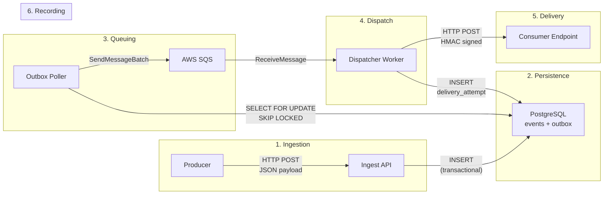
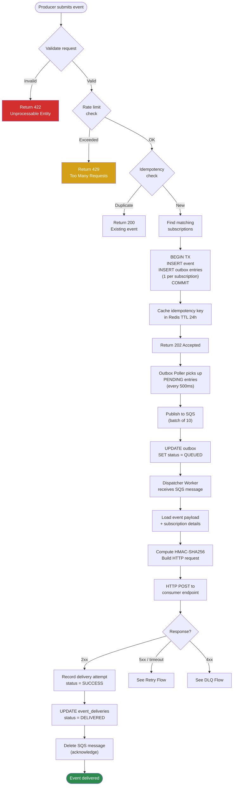
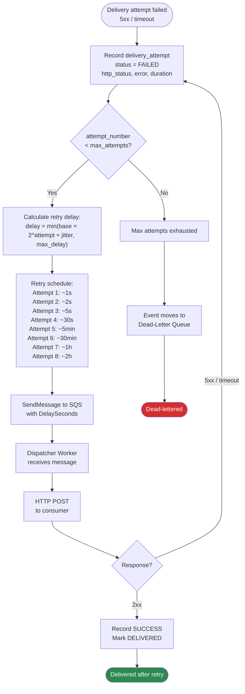
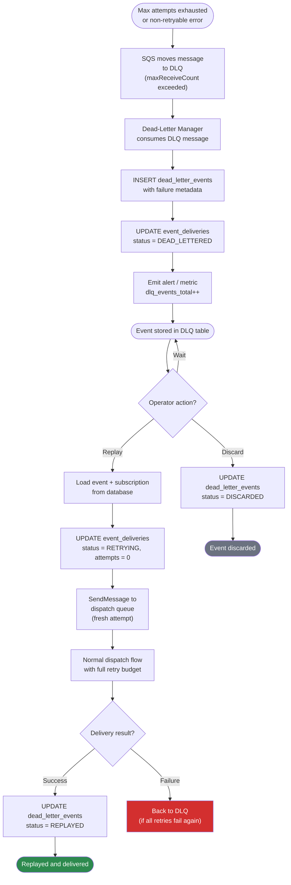

# EventRelay — Data Flow

> **Document Status:** Living Document · **Last Updated:** 2026-07-10 · **Owner:** Platform Engineering

## 1. Overview

This document traces the end-to-end data flow through EventRelay from event submission to delivery confirmation, covering data transformations, payload sizes, and throughput at each stage.

---

## 2. End-to-End Data Flow Summary



---

## 3. Detailed Data Flow — Happy Path



---

## 4. Detailed Data Flow — Retry Path



---

## 5. Detailed Data Flow — Dead-Letter and Replay Path



---

## 6. Data Transformations at Each Stage

### 6.1 Stage-by-Stage Transformation Table

| Stage | Input | Transformation | Output | Storage |
|---|---|---|---|---|
| **1. API Reception** | Raw HTTP request (JSON body + headers) | Parse JSON, validate schema, extract API key, assign event ID (UUID v7) | Validated `EventRequest` DTO | — |
| **2. Rate Limit Check** | `tenant_id` | Token bucket check via Redis Lua script | Allow / Deny | Redis (rate limit counters) |
| **3. Idempotency Check** | `tenant_id + idempotency_key` | Redis GET → DB fallback if miss | New / Duplicate | Redis (dedup cache) |
| **4. Subscription Match** | `tenant_id + event_type` | SQL query on `subscriptions` table with filters | List of matching `Subscription` entities | — |
| **5. Event Persistence** | `EventRequest` DTO | Map to `Event` entity, serialize payload as JSONB | `events` row + N `outbox` rows | PostgreSQL |
| **6. Outbox Polling** | `outbox` rows (status = PENDING) | Map to SQS message format (lightweight metadata, no payload) | SQS `SendMessageBatchRequest` | — |
| **7. SQS Transport** | SQS message (JSON) | SQS stores and delivers (no transformation) | SQS message | SQS |
| **8. Dispatch Prep** | SQS message metadata | Load full event from DB, load subscription signing secret | `HttpRequest` with HMAC signature | — |
| **9. HMAC Signing** | Raw JSON body + signing secret | `HMAC-SHA256(secret, body)` → hex-encoded | `X-EventRelay-Signature` header | — |
| **10. HTTP Delivery** | Fully formed HTTP request | HTTP POST to consumer endpoint | HTTP response (status + body) | — |
| **11. Attempt Recording** | Delivery result | Map to `DeliveryAttempt` entity | `delivery_attempts` row | PostgreSQL |

### 6.2 Payload Format at Each Stage

**Producer → Ingest API (HTTP Request Body):**
```json
{
  "event_type": "order.completed",
  "idempotency_key": "ord_abc123_completed",
  "payload": {
    "order_id": "ord_abc123",
    "total": 99.99,
    "currency": "USD"
  },
  "metadata": {
    "source": "order-service"
  }
}
```
*Typical size: 200 bytes – 100 KB*

**PostgreSQL `events` Table Row:**
```sql
INSERT INTO events (
    id, tenant_id, event_type, idempotency_key,
    payload, metadata, status, created_at
) VALUES (
    'evt_01J5K6M7N8P9Q0R1S2T3U4V5',
    'tenant_acme',
    'order.completed',
    'ord_abc123_completed',
    '{"order_id":"ord_abc123","total":99.99,"currency":"USD"}'::jsonb,
    '{"source":"order-service"}'::jsonb,
    'RECEIVED',
    '2026-07-10T04:00:00.000Z'
);
```

**PostgreSQL `outbox` Table Row (one per subscription):**
```sql
INSERT INTO outbox (
    id, event_id, subscription_id, tenant_id,
    status, created_at
) VALUES (
    'obx_01J5K...', 'evt_01J5K...', 'sub_01J5K...', 'tenant_acme',
    'PENDING', '2026-07-10T04:00:00.000Z'
);
```

**SQS Message (Outbox Poller → Dispatcher):**
```json
{
  "messageId": "msg_01J5K...",
  "eventId": "evt_01J5K6M7N8P9Q0R1S2T3U4V5",
  "subscriptionId": "sub_01J5K...",
  "tenantId": "tenant_acme",
  "eventType": "order.completed",
  "attemptNumber": 1,
  "maxAttempts": 8,
  "enqueuedAt": "2026-07-10T04:00:00.123Z"
}
```
*Typical size: ~300 bytes (no payload — loaded from DB by worker)*

**Dispatcher → Consumer (HTTP Request):**
```http
POST /webhooks HTTP/1.1
Host: api.acme.com
Content-Type: application/json
User-Agent: EventRelay/1.0
X-EventRelay-Signature: sha256=a1b2c3d4e5f6...
X-EventRelay-Event-ID: evt_01J5K6M7N8P9Q0R1S2T3U4V5
X-EventRelay-Event-Type: order.completed
X-EventRelay-Timestamp: 1720584000
X-EventRelay-Idempotency-Key: ord_abc123_completed
X-EventRelay-Attempt: 1

{
  "event_id": "evt_01J5K6M7N8P9Q0R1S2T3U4V5",
  "event_type": "order.completed",
  "created_at": "2026-07-10T04:00:00.000Z",
  "data": {
    "order_id": "ord_abc123",
    "total": 99.99,
    "currency": "USD"
  }
}
```
*Typical size: 500 bytes – 256 KB (max enforced at ingestion)*

---

## 7. Throughput and Sizing at Each Stage

### 7.1 Throughput Targets

| Stage | Target Throughput | Bottleneck Factor | Mitigation |
|---|---|---|---|
| **API Ingestion** | 10,000 events/sec | CPU (validation), DB writes | Horizontal scaling (2-10 instances), batch inserts |
| **Outbox Polling** | 20,000 rows/sec | DB read + SQS write throughput | `SKIP LOCKED` for contention-free reads, batch SQS sends |
| **SQS Transport** | 30,000 messages/sec | SQS throughput (unlimited for Standard) | Multiple SQS queues if needed (future) |
| **Dispatcher Delivery** | 10,000 deliveries/sec | Consumer response time, network I/O | Horizontal scaling (3-50 instances), async I/O |
| **Attempt Recording** | 10,000 inserts/sec | DB write throughput | Batch inserts, connection pooling |

### 7.2 Payload Size Limits

| Boundary | Max Size | Enforcement Point |
|---|---|---|
| Ingest API request body | 256 KB | Spring Boot `server.max-http-post-size` |
| Event payload (`events.payload`) | 256 KB | Application validation |
| SQS message body | < 1 KB | Application design (metadata only) |
| Delivery request body | 256 KB | Application design (event payload + envelope) |
| Delivery response body (stored) | 1 KB | Application truncation |

### 7.3 Fan-Out Analysis

A single ingested event fans out to N webhook deliveries, where N = number of matching subscriptions:

| Fan-Out Ratio | Scenario | Impact |
|---|---|---|
| 1:1 | One subscription per event type | Linear throughput |
| 1:10 | 10 subscribers for a popular event type | 10x dispatch messages per ingested event |
| 1:100 | 100 subscribers (enterprise scenario) | 100x dispatch messages; may need queue partitioning |
| 1:1000 | Broadcast event (all tenants) | Requires special handling (batch dispatch, separate queue) |

> [!IMPORTANT]
> The outbox table generates **one row per subscription** per event. For a 1:100 fan-out ratio at 1,000 events/sec, the outbox writes 100,000 rows/sec. This is the primary scaling concern and may require outbox table partitioning at high fan-out ratios.

---

## 8. Data Retention and Cleanup

| Data | Retention Period | Cleanup Strategy |
|---|---|---|
| `events` | 90 days | Partition by `created_at`, drop old partitions |
| `outbox` | 7 days (after QUEUED) | Scheduled batch delete of QUEUED entries older than 7 days |
| `delivery_attempts` | 90 days | Partition by `created_at`, drop old partitions |
| `event_deliveries` | 90 days | Cascade with `events` deletion |
| `dead_letter_events` | 365 days | Manual review required before deletion |
| Redis dedup cache | 24 hours | TTL-based automatic expiry |
| Redis rate limit counters | 1 hour | TTL-based automatic expiry |
| SQS messages | 14 days (max retention) | Automatic deletion after processing or retention expiry |

### 8.1 Data Volume Estimates

At 10,000 events/sec with average 3 subscriptions per event:

| Data Store | Write Rate | Daily Volume | Monthly Volume (uncompressed) |
|---|---|---|---|
| `events` table | 10K rows/sec | 864M rows | ~26B rows |
| `outbox` table | 30K rows/sec | 2.6B rows | Cleaned after 7 days |
| `delivery_attempts` | 30K rows/sec | 2.6B rows | ~78B rows |
| SQS messages | 30K msg/sec | 2.6B messages | N/A (ephemeral) |
| Redis keys (dedup) | 10K keys/sec | ~10M active keys | N/A (TTL: 24h) |

> [!TIP]
> PostgreSQL table partitioning by `created_at` (monthly) is essential at this scale. Use `pg_partman` for automated partition management. Without partitioning, `delivery_attempts` would exceed billions of rows per month.

---

## 9. Data Consistency Guarantees

| Guarantee | Mechanism | Scope |
|---|---|---|
| **Event accepted = Event will be delivered** | Transactional outbox (same DB transaction) | Event + outbox entry |
| **No lost outbox entries** | `SELECT FOR UPDATE SKIP LOCKED` + status tracking | Outbox → SQS transition |
| **No duplicate SQS messages** | SQS message deduplication window (not relied upon); consumer-side idempotency | SQS transport |
| **Delivery attempt always recorded** | DB write after each HTTP call (success or failure) | Dispatcher → PostgreSQL |
| **DLQ entry = max retries exhausted** | SQS `maxReceiveCount` + application-level attempt tracking | SQS → DLQ transition |

---

## 10. Related Documents

| Document | Description |
|---|---|
| [Architecture](./Architecture.md) | High-level system architecture |
| [Event Flow](./EventFlow.md) | Event lifecycle and state machine |
| [Component Interactions](./Component_Interactions.md) | Sequence diagrams and communication patterns |
| [Scalability](./Scalability.md) | Capacity planning and scaling strategies |
