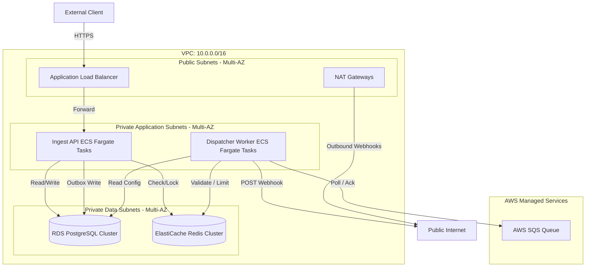

# EventRelay — Deployment Architecture

This document describes the AWS production deployment topology for EventRelay, detailing multi-AZ network setups, Fargate container configurations, database clusters, and secure connections.

---

## 1. Network Topology (VPC)

EventRelay is deployed inside a dedicated Virtual Private Cloud (VPC) spanning two Availability Zones (AZs) for high availability and fault isolation.

| Subnet Group | CIDR Block (AZ-A) | CIDR Block (AZ-B) | Route Configuration |
|--------------|-------------------|-------------------|---------------------|
| **Public Subnets** | `10.0.1.0/24` | `10.0.2.0/24` | Attached to Internet Gateway. Hosts ALB and NAT Gateways. |
| **Private App Subnets** | `10.0.10.0/24` | `10.0.20.0/24` | Routed via NAT Gateways for outbound internet access. Hosts ECS tasks. |
| **Private Data Subnets** | `10.0.100.0/24` | `10.0.200.0/24` | No external routing. Hosts RDS and Redis clusters. |

---

## 2. Ingest API Service Deployment

The Ingest API service handles HTTPS requests from client platforms.

- **Service Type**: ECS Fargate Service.
- **Task Size**: `0.5 vCPU / 1 GB RAM` (Base size, scales horizontally).
- **Target Tracking Scaling**:
  - Scale out: Triggered when average CPU utilization exceeds 70% or average ALB request count per target exceeds 1,000 requests/minute.
  - Scale in: Triggered when average CPU utilization drops below 30% over a 15-minute window.
- **Port Mapping**: Container port `8080` mapped via Target Group to ALB on port `443` (TLS terminated at ALB).

---

## 3. Dispatcher Worker Deployment

The Dispatcher Workers consume events from AWS SQS and post them to receiver webhooks.

- **Service Type**: ECS Fargate Service (Runs independently from Ingest API).
- **Task Size**: `1.0 vCPU / 2 GB RAM`.
- **Target Tracking Scaling**:
  - Scale out: Step scaling based on SQS queue metric `ApproximateNumberOfMessagesVisible` > 5,000 messages.
  - Scale in: Safe scale-in rules with a cooldown period of 300 seconds to prevent thrashing.
- **Network Access**: Internal security groups allow workers to establish outbound TCP connections on ports `80` and `443` through the NAT Gateway.

---

## 4. Database & Cache Tier

### AWS RDS PostgreSQL (Multi-AZ)
- **Engine Version**: PostgreSQL 15.x.
- **Instance Type**: `db.m6g.xlarge` (1 Primary, 1 standby replica in different AZ).
- **Storage**: SSD (gp3) with storage auto-scaling enabled.
- **Isolation**: Housed in private data subnets; accessible only from ECS services.

### AWS ElastiCache Redis (Cluster Mode)
- **Engine Version**: Redis 7.x.
- **Topology**: 1 Primary shard, 1 replica shard, Multi-AZ enabled.
- **Eviction Policy**: `allkeys-lru` for caching, with token buckets kept in non-evictable memory.

---

## 5. Security Groups Setup

Security groups enforce least privilege network communication:

| Security Group | Inbound Rules | Outbound Rules |
|----------------|---------------|----------------|
| **ALB-SG** | Port `443` from `0.0.0.0/0` | Port `8080` to **Ingest-SG** |
| **Ingest-SG** | Port `8080` from **ALB-SG** | Ports `5432` (**RDS-SG**), `6379` (**Redis-SG**) |
| **Workers-SG** | None | Ports `5432` (**RDS-SG**), `6379` (**Redis-SG**), Port `443` to HTTPS endpoints via NAT |
| **RDS-SG** | Port `5432` from **Ingest-SG** and **Workers-SG** | None |
| **Redis-SG** | Port `6379` from **Ingest-SG** and **Workers-SG** | None |
