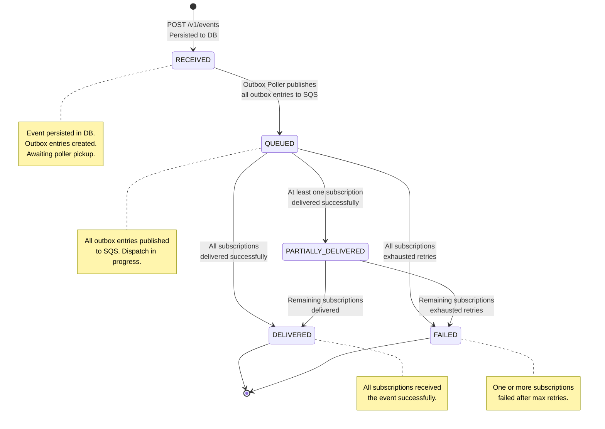
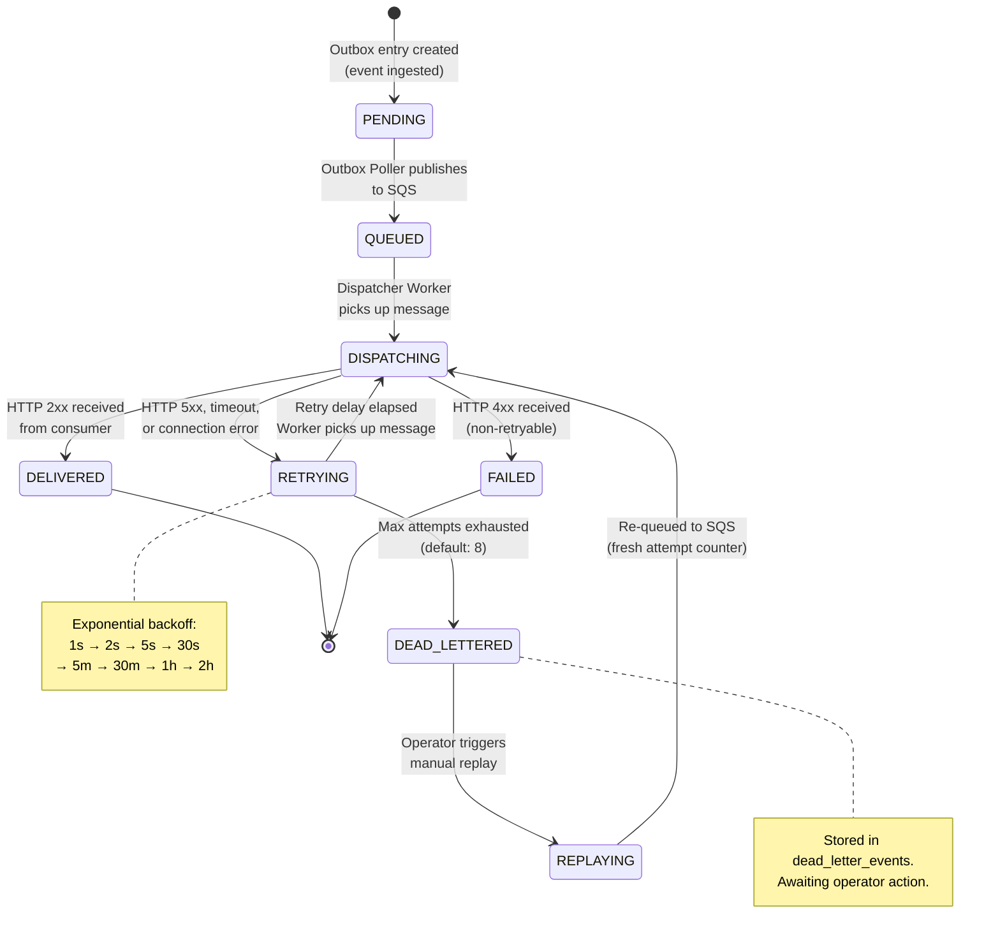
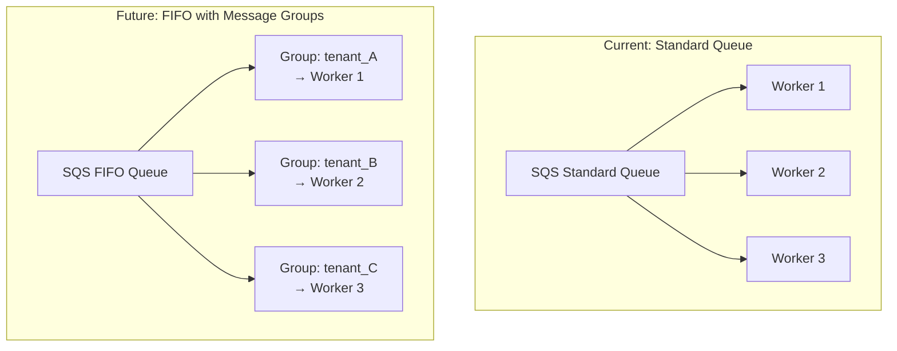
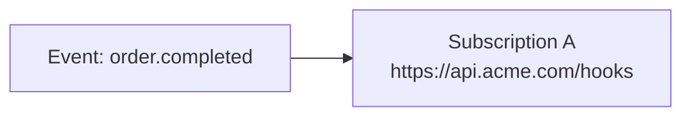
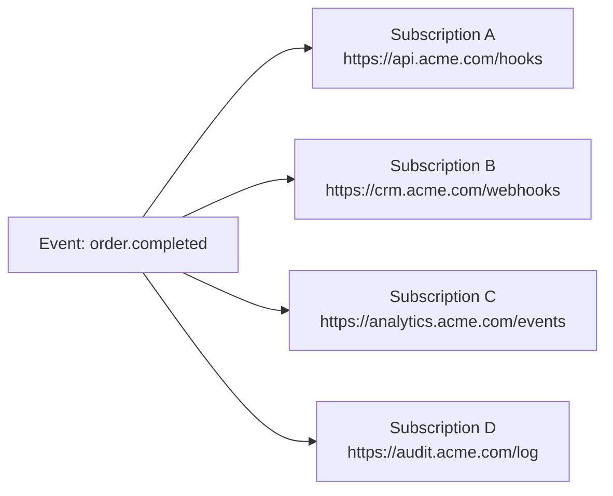
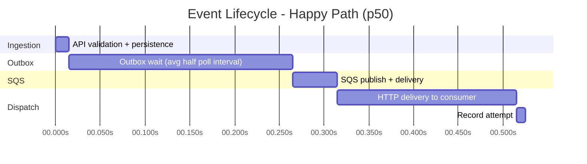

# EventRelay — Event Flow & Lifecycle

> **Document Status:** Living Document · **Last Updated:** 2026-07-10 · **Owner:** Platform Engineering

## 1. Overview

Every event in EventRelay passes through a well-defined lifecycle with explicit states and transitions. This document describes the event state machine, transition rules, ordering guarantees, and fan-out scenarios.

> [!IMPORTANT]
> There are two distinct state machines: the **Event State** (tracks the overall event) and the **Event Delivery State** (tracks delivery to each individual subscription). A single event may have multiple delivery states — one per matched subscription.

---

## 2. Event States

### 2.1 Event State Machine



### 2.2 Event States Reference

| State | Description | Terminal? | Trigger |
|---|---|---|---|
| `RECEIVED` | Event accepted and persisted to the database with outbox entries | No | `POST /v1/events` returns `202 Accepted` |
| `QUEUED` | All outbox entries for this event have been published to SQS | No | Outbox Poller marks all entries as `QUEUED` |
| `PARTIALLY_DELIVERED` | At least one (but not all) subscriptions received the event | No | First successful delivery recorded |
| `DELIVERED` | All matched subscriptions received the event successfully | ✅ Yes | Last subscription delivery succeeds |
| `FAILED` | At least one subscription failed after exhausting all retries | ✅ Yes | Last pending delivery exhausts retries or DLQ |

---

## 3. Event Delivery States (Per-Subscription)

### 3.1 Event Delivery State Machine



### 3.2 Event Delivery States Reference

| State | Description | Terminal? | Max Duration in State |
|---|---|---|---|
| `PENDING` | Outbox entry created, awaiting poller pickup | No | ~500ms (poller interval) |
| `QUEUED` | Published to SQS, awaiting Dispatcher Worker | No | ~seconds (SQS delivery) |
| `DISPATCHING` | Worker is actively attempting HTTP delivery | No | 35 seconds (connect + read timeout) |
| `DELIVERED` | Consumer responded with HTTP 2xx | ✅ Yes | — |
| `FAILED` | Non-retryable error (HTTP 4xx except 429) | ✅ Yes | — |
| `RETRYING` | Delivery failed, scheduled for retry | No | Up to ~4 hours (sum of all backoff intervals) |
| `DEAD_LETTERED` | All retry attempts exhausted | No (can be replayed) | Indefinite (awaits operator) |
| `REPLAYING` | Operator initiated replay from DLQ | No | ~seconds (re-queued to SQS) |

---

## 4. State Transition Rules

### 4.1 Transition Table

| From State | To State | Trigger | Condition | Action |
|---|---|---|---|---|
| — | `PENDING` | Event ingested | Subscription matches event type | Create outbox entry |
| `PENDING` | `QUEUED` | Outbox Poller cycle | Poller acquires row lock | Publish to SQS, update outbox status |
| `QUEUED` | `DISPATCHING` | SQS `ReceiveMessage` | Worker receives message | Start HTTP delivery attempt |
| `DISPATCHING` | `DELIVERED` | HTTP response received | Status code 2xx | Record attempt, delete SQS message |
| `DISPATCHING` | `FAILED` | HTTP response received | Status code 4xx (except 429) | Record attempt, delete SQS message, may DLQ |
| `DISPATCHING` | `RETRYING` | HTTP response or timeout | Status 5xx, 429, timeout, connection error | Record attempt, re-queue with delay |
| `RETRYING` | `DISPATCHING` | SQS delay elapsed | Message becomes visible again | Worker picks up message |
| `RETRYING` | `DEAD_LETTERED` | Max attempts exceeded | `attempt_number >= max_attempts` | Move to DLQ, record in `dead_letter_events` |
| `DEAD_LETTERED` | `REPLAYING` | Operator action | Manual or bulk replay triggered | Update DLQ entry status |
| `REPLAYING` | `DISPATCHING` | SQS message sent | Fresh message in dispatch queue | Reset attempt counter, normal flow |

### 4.2 Retry Schedule

The retry delay uses **exponential backoff with jitter**:

```
delay = min(base_delay × 2^attempt + random_jitter, max_delay)
```

| Attempt | Base Delay | Calculated Delay | Cumulative Time |
|---|---|---|---|
| 1 | 1s | ~1s | ~1s |
| 2 | 2s | ~2-3s | ~3-4s |
| 3 | 4s | ~5-6s | ~8-10s |
| 4 | 16s | ~18-25s | ~26-35s |
| 5 | 64s | ~65-90s (~1-1.5 min) | ~1.5-2 min |
| 6 | 256s | ~260-350s (~4-6 min) | ~6-8 min |
| 7 | 1024s | ~1030-1200s (~17-20 min) | ~23-28 min |
| 8 | 3600s (capped) | ~3600s (1 hour) | ~1.4-1.5 hours |

**Configuration:**

```java
@ConfigurationProperties(prefix = "eventrelay.retry")
public class RetryConfig {
    private int maxAttempts = 8;
    private Duration baseDelay = Duration.ofSeconds(1);
    private Duration maxDelay = Duration.ofHours(1);
    private double jitterFactor = 0.1;  // ±10% random jitter
    private double backoffMultiplier = 2.0;

    public Duration calculateDelay(int attemptNumber) {
        long delayMs = (long) (baseDelay.toMillis()
            * Math.pow(backoffMultiplier, attemptNumber));
        delayMs = Math.min(delayMs, maxDelay.toMillis());

        // Add jitter: ±10%
        long jitter = (long) (delayMs * jitterFactor * (Math.random() * 2 - 1));
        return Duration.ofMillis(delayMs + jitter);
    }
}
```

> [!NOTE]
> **Why jitter?** Without jitter, all failed deliveries to the same endpoint retry at exactly the same time, creating a "thundering herd" that overwhelms the recovering endpoint. Jitter spreads retries over a time window, giving the endpoint time to recover.

---

## 5. Event Ordering Guarantees

### 5.1 Ordering Model

EventRelay provides **best-effort ordering** with the following characteristics:

| Property | Guarantee | Mechanism |
|---|---|---|
| **Per-event ordering** | Delivery attempts for a single event are sequential | SQS visibility timeout prevents concurrent attempts |
| **Cross-event ordering** | ❌ Not guaranteed | SQS Standard Queue does not guarantee FIFO |
| **Per-tenant ordering** | ❌ Not guaranteed | Multiple workers process concurrently |
| **Per-subscription ordering** | ❌ Not guaranteed | Different events dispatched in parallel |

### 5.2 Why Best-Effort Ordering?

Strict ordering requires:
1. **Single consumer per partition** — limits horizontal scaling
2. **Head-of-line blocking** — one slow delivery blocks all subsequent events
3. **Complex rebalancing** — partition assignment must be coordinated

For webhook delivery, **most consumers don't need strict ordering**. Events include timestamps and sequence metadata that consumers can use for application-level ordering.

### 5.3 Ordering Metadata in Delivery Headers

```http
X-EventRelay-Event-ID: evt_01J5K6M7N8P9Q0R1S2T3U4V5
X-EventRelay-Timestamp: 1720584000
X-EventRelay-Sequence: 42
```

- **Event-ID**: UUID v7, which is time-ordered — lexicographic sorting gives chronological order
- **Timestamp**: Unix timestamp of event creation
- **Sequence**: Per-subscription monotonically increasing sequence number

> [!TIP]
> If a consumer needs strict ordering, they can buffer received webhooks and process them in `X-EventRelay-Sequence` order. This pushes ordering responsibility to the consumer, where it belongs (since only the consumer knows its specific ordering requirements).

### 5.4 Future: FIFO Ordering Support

For use cases requiring strict ordering, a future enhancement could use **SQS FIFO Queues**:



---

## 6. Fan-Out Scenarios

### 6.1 Single-Subscription Fan-Out (1:1)

The simplest case: one event matches one subscription.



- 1 outbox entry
- 1 SQS message
- 1 delivery attempt

### 6.2 Multi-Subscription Fan-Out (1:N)

One event matches N subscriptions (common in multi-tenant or multi-consumer scenarios).



- N outbox entries (one per subscription)
- N SQS messages
- N independent delivery tracks (each with its own retry state)

### 6.3 Fan-Out Implications

| Fan-Out Ratio | Outbox Writes/Event | SQS Messages/Event | DB Impact | Notes |
|---|---|---|---|---|
| 1:1 | 1 | 1 | Minimal | Simple case |
| 1:5 | 5 | 5 | Low | Typical multi-consumer |
| 1:50 | 50 | 50 | Medium | Large tenant with many integrations |
| 1:500 | 500 | 500 | High | Requires batch optimization |
| 1:5000 | 5000 | 5000 | Very High | Requires dedicated queue + async outbox writes |

> [!WARNING]
> At fan-out ratios above 1:100, the transactional insert of outbox entries becomes the bottleneck. Consider batch inserts with `INSERT INTO outbox (...) VALUES (...), (...), ...` and potentially async outbox writes outside the API request transaction for extreme fan-out scenarios.

### 6.4 Independent Delivery Tracking

Each subscription delivery is tracked independently. This means:

```
Event evt_123 → order.completed
├── Delivery to Sub A → DELIVERED (attempt 1, 200ms)
├── Delivery to Sub B → DELIVERED (attempt 2, retried once, 5.2s total)
├── Delivery to Sub C → RETRYING (attempt 4, next retry in 30s)
└── Delivery to Sub D → DEAD_LETTERED (8 attempts over 1.5 hours)
```

The overall event status is:
- `PARTIALLY_DELIVERED` — because Sub A and B succeeded, but Sub C and D haven't
- Will become `FAILED` when Sub C and D reach terminal states (unless Sub C succeeds)

---

## 7. Event Lifecycle Timing

### 7.1 Typical Timing — Happy Path



| Phase | p50 Latency | p99 Latency | Notes |
|---|---|---|---|
| API validation + persistence | 15ms | 50ms | Single DB transaction |
| Outbox wait | 250ms | 500ms | Half of 500ms poll interval (avg) |
| SQS publish + delivery | 50ms | 200ms | SQS latency |
| Worker pickup + dispatch | 200ms | 1s | Includes HTTP call to consumer |
| **Total (ingestion → delivery)** | **~500ms** | **~2s** | Target: p99 < 2s |

### 7.2 Typical Timing — Retry Path

| Retry Attempt | Additional Delay | Cumulative Time |
|---|---|---|
| 1st retry | ~1s | ~1.5s |
| 2nd retry | ~2s | ~3.5s |
| 3rd retry | ~5s | ~8.5s |
| 4th retry | ~30s | ~38s |
| 5th retry | ~5 min | ~5.5 min |
| 6th retry | ~30 min | ~35 min |
| 7th retry | ~1 hour | ~1.5 hours |
| 8th retry (final) | ~2 hours | ~3.5 hours |
| DLQ processing | Operator-dependent | Hours to days |

---

## 8. Event Metadata Schema

Every event carries metadata through its lifecycle:

```java
public class Event {
    private String id;                    // UUID v7 (time-sortable)
    private String tenantId;              // Owning tenant
    private String eventType;             // e.g., "order.completed"
    private String idempotencyKey;        // Producer-provided dedup key
    private JsonNode payload;             // Actual event data (JSONB)
    private JsonNode metadata;            // Producer-provided metadata
    private EventStatus status;           // Current lifecycle state
    private int subscriptionCount;        // Number of matched subscriptions
    private int deliveredCount;           // Number of successful deliveries
    private int failedCount;              // Number of failed deliveries
    private Instant createdAt;            // Ingestion timestamp
    private Instant updatedAt;            // Last status change
    private Instant deliveredAt;          // When fully delivered (nullable)
}

public class EventDelivery {
    private String id;                    // Delivery tracking ID
    private String eventId;              // Parent event
    private String subscriptionId;       // Target subscription
    private String tenantId;             // Tenant scope
    private DeliveryStatus status;       // Per-subscription delivery state
    private int attemptCount;            // Total attempts made
    private int maxAttempts;             // Configured max (default: 8)
    private Instant nextRetryAt;         // Scheduled retry time (nullable)
    private Instant createdAt;
    private Instant updatedAt;
    private Instant deliveredAt;         // When delivered (nullable)
}
```

---

## 9. Edge Cases and Special Scenarios

### 9.1 Subscription Created After Event Ingestion

- Event is matched to subscriptions **at ingestion time only**
- If a subscription is created after the event, it will NOT receive the event
- This is by design: webhook subscriptions are forward-looking

### 9.2 Subscription Deactivated During Delivery

- If a subscription is deactivated while delivery is in progress:
  - The Dispatcher Worker checks subscription status before each delivery attempt
  - If inactive, the message is acknowledged (deleted from SQS) without delivery
  - The event delivery status is set to `CANCELLED`

### 9.3 Event Payload Updated After Ingestion

- Event payloads are **immutable** after ingestion
- There is no API to update an event's payload
- To correct an event, submit a new event with the corrected data

### 9.4 Consumer Returns Redirect (3xx)

- EventRelay follows up to **3 redirects** (301, 302, 307, 308)
- The final response determines success/failure
- Redirect chains are logged in the delivery attempt record

### 9.5 Consumer Closes Connection Mid-Response

- Treated as a **connection error** (retryable)
- Partial response body is stored (up to 1 KB)
- Normal retry flow activates

---

## 10. Related Documents

| Document | Description |
|---|---|
| [Architecture](./Architecture.md) | High-level system architecture |
| [Data Flow](./DataFlow.md) | End-to-end data flow and transformations |
| [Component Interactions](./Component_Interactions.md) | Sequence diagrams for key flows |
| [High Availability](./High_Availability.md) | Failover and recovery procedures |
