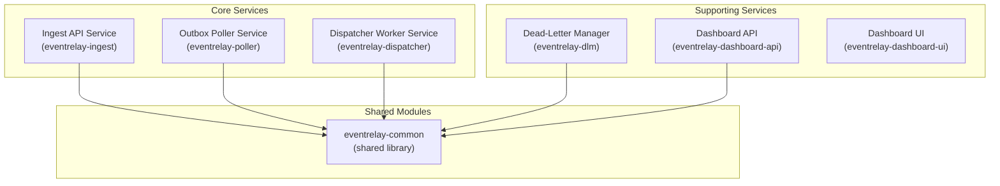

# EventRelay — Service Overview

> **Document Status:** Living Document · **Last Updated:** 2026-07-10 · **Owner:** Platform Engineering

## 1. Service Inventory

EventRelay comprises six services and one shared library module:



| Service | Type | Instances | Port | Health Endpoint |
|---|---|---|---|---|
| Ingest API | REST API (Spring Boot) | 2–10 (auto-scaled) | 8080 | `/actuator/health` |
| Outbox Poller | Scheduled Task (Spring Boot) | 1 active + 1 standby | 8081 | `/actuator/health` |
| Dispatcher Workers | SQS Consumer (Spring Boot) | 3–50 (auto-scaled) | 8082 | `/actuator/health` |
| Dead-Letter Manager | REST API + Scheduled Task | 1–3 | 8083 | `/actuator/health` |
| Dashboard API | REST API (Spring Boot) | 2–4 | 8084 | `/actuator/health` |
| Dashboard UI | Static SPA (React/Next.js) | 2 (behind CDN) | 3000 | `/health` |

---

## 2. Ingest API Service (`eventrelay-ingest`)

### 2.1 Responsibilities

- Accept inbound events via REST API
- Validate event payload, headers, and authentication
- Enforce per-tenant rate limits
- Deduplicate events using idempotency keys
- Persist event + outbox entry in a single database transaction
- Return `202 Accepted` with event metadata

### 2.2 API Endpoints

| Method | Path | Description | Auth |
|---|---|---|---|
| `POST` | `/v1/events` | Submit a new event | API Key |
| `POST` | `/v1/events/batch` | Submit up to 100 events in a batch | API Key |
| `GET` | `/v1/events/{eventId}` | Retrieve event details and delivery status | API Key |
| `GET` | `/v1/events/{eventId}/attempts` | List delivery attempts for an event | API Key |
| `POST` | `/v1/subscriptions` | Register a new webhook subscription | API Key |
| `GET` | `/v1/subscriptions` | List subscriptions for the tenant | API Key |
| `PUT` | `/v1/subscriptions/{subscriptionId}` | Update a subscription | API Key |
| `DELETE` | `/v1/subscriptions/{subscriptionId}` | Deactivate a subscription | API Key |
| `GET` | `/v1/subscriptions/{subscriptionId}/secret` | Rotate and retrieve signing secret | API Key |
| `GET` | `/actuator/health` | Health check | None |
| `GET` | `/actuator/prometheus` | Prometheus metrics | Internal |

### 2.3 Request/Response Example

**POST /v1/events**

```json
// Request
{
  "event_type": "order.completed",
  "idempotency_key": "ord_abc123_completed_2026-07-10",
  "payload": {
    "order_id": "ord_abc123",
    "total": 99.99,
    "currency": "USD",
    "customer_id": "cust_xyz789"
  },
  "metadata": {
    "source": "order-service",
    "trace_id": "abc-def-123"
  }
}

// Response (202 Accepted)
{
  "event_id": "evt_01J5K6M7N8P9Q0R1S2T3U4V5",
  "event_type": "order.completed",
  "status": "RECEIVED",
  "created_at": "2026-07-10T04:00:00.000Z",
  "subscriptions_matched": 3,
  "links": {
    "self": "/v1/events/evt_01J5K6M7N8P9Q0R1S2T3U4V5",
    "attempts": "/v1/events/evt_01J5K6M7N8P9Q0R1S2T3U4V5/attempts"
  }
}
```

### 2.4 Internal Flow

```java
@Service
@Transactional
public class EventIngestionService {

    public EventResponse ingestEvent(String tenantId, EventRequest request) {
        // 1. Rate limit check (Redis)
        rateLimiter.checkOrThrow(tenantId);

        // 2. Idempotency check (Redis + DB fallback)
        if (deduplicationService.isDuplicate(tenantId, request.getIdempotencyKey())) {
            return existingEventResponse(tenantId, request.getIdempotencyKey());
        }

        // 3. Find matching subscriptions
        List<Subscription> subscriptions = subscriptionRepository
            .findActiveByTenantAndEventType(tenantId, request.getEventType());

        // 4. Persist event
        Event event = eventRepository.save(Event.builder()
            .tenantId(tenantId)
            .eventType(request.getEventType())
            .payload(request.getPayload())    // stored as JSONB
            .idempotencyKey(request.getIdempotencyKey())
            .status(EventStatus.RECEIVED)
            .build());

        // 5. Write outbox entries (one per subscription)
        for (Subscription sub : subscriptions) {
            outboxRepository.save(OutboxEntry.builder()
                .eventId(event.getId())
                .subscriptionId(sub.getId())
                .tenantId(tenantId)
                .status(OutboxStatus.PENDING)
                .build());
        }

        // 6. Cache idempotency key in Redis (TTL: 24h)
        deduplicationService.markProcessed(tenantId, request.getIdempotencyKey());

        return toResponse(event, subscriptions.size());
    }
}
```

### 2.5 Dependencies

| Dependency | Purpose | Failure Impact |
|---|---|---|
| PostgreSQL | Event persistence, subscription lookup | Service returns `503` — cannot accept events |
| Redis | Rate limiting, dedup cache | Falls back to DB-based dedup; rate limiting disabled |
| AWS Secrets Manager | API key validation | Cached locally; startup failure if unavailable |

### 2.6 Resource Requirements

| Resource | Min | Recommended | Max (auto-scale limit) |
|---|---|---|---|
| CPU | 0.5 vCPU | 1 vCPU | 2 vCPU |
| Memory | 512 MB | 1 GB | 2 GB |
| Instances | 2 | 4 | 10 |
| DB Connections (per instance) | 5 | 10 | 20 |

---

## 3. Outbox Poller Service (`eventrelay-poller`)

### 3.1 Responsibilities

- Poll the `outbox` table for `PENDING` entries
- Batch entries and publish them to SQS
- Update outbox entry status to `QUEUED`
- Maintain leader election to ensure only one active poller
- Handle SQS publish failures with local retries

### 3.2 Polling Mechanism

```java
@Component
public class OutboxPoller {

    private static final int BATCH_SIZE = 100;
    private static final Duration POLL_INTERVAL = Duration.ofMillis(500);

    @Scheduled(fixedDelay = 500) // 500ms between poll completions
    @LeaderOnly // Custom annotation — only runs on the elected leader
    public void pollOutbox() {
        List<OutboxEntry> entries = outboxRepository
            .findPendingWithLock(BATCH_SIZE);
        // Uses: SELECT * FROM outbox
        //       WHERE status = 'PENDING'
        //       ORDER BY created_at ASC
        //       LIMIT 100
        //       FOR UPDATE SKIP LOCKED

        if (entries.isEmpty()) return;

        // Batch into SQS-compatible groups (max 10 per SQS batch)
        List<List<OutboxEntry>> batches = Lists.partition(entries, 10);

        for (List<OutboxEntry> batch : batches) {
            SendMessageBatchResult result = sqsClient.sendMessageBatch(
                buildBatchRequest(batch)
            );

            // Mark successful entries as QUEUED
            markAsQueued(result.getSuccessful(), batch);

            // Log and retry failed entries (they remain PENDING)
            handleFailures(result.getFailed(), batch);
        }
    }
}
```

### 3.3 Leader Election

The outbox poller uses a **PostgreSQL advisory lock** for leader election:

```sql
-- Acquire advisory lock (non-blocking)
SELECT pg_try_advisory_lock(hashtext('outbox-poller-leader'));

-- The instance that acquires the lock becomes the leader
-- Lock is released on disconnect or explicit release
```

| Property | Value |
|---|---|
| Lock renewal interval | 10 seconds |
| Lock timeout | 30 seconds |
| Standby poll interval | 5 seconds (checking if leader is alive) |
| Max standby instances | 1 |

### 3.4 Dependencies

| Dependency | Purpose | Failure Impact |
|---|---|---|
| PostgreSQL | Read outbox entries, leader election | Poller pauses; events accumulate in outbox |
| AWS SQS | Publish messages for dispatch | Entries remain `PENDING`; poller retries on next cycle |

### 3.5 Resource Requirements

| Resource | Min | Recommended | Max |
|---|---|---|---|
| CPU | 0.25 vCPU | 0.5 vCPU | 1 vCPU |
| Memory | 256 MB | 512 MB | 1 GB |
| Instances | 2 (1 active + 1 standby) | 2 | 2 |
| DB Connections (per instance) | 3 | 5 | 10 |

---

## 4. Dispatcher Worker Service (`eventrelay-dispatcher`)

### 4.1 Responsibilities

- Consume messages from SQS
- Perform HTTP POST delivery to subscriber endpoints
- Sign requests with HMAC-SHA256
- Handle delivery responses (success, client error, server error, timeout)
- Record delivery attempts in the database
- Enforce per-tenant and per-subscription rate limits
- Manage circuit breakers for failing endpoints

### 4.2 Delivery Flow

```java
@Component
public class DispatcherWorker {

    @SqsListener("${eventrelay.sqs.dispatch-queue}")
    public void handleMessage(DispatchMessage message) {
        String eventId = message.getEventId();
        String subscriptionId = message.getSubscriptionId();

        // 1. Load subscription details (cached)
        Subscription sub = subscriptionCache.get(subscriptionId);
        if (sub == null || !sub.isActive()) {
            log.warn("Subscription {} inactive, skipping", subscriptionId);
            return; // ACK the message — don't redeliver
        }

        // 2. Check circuit breaker
        if (circuitBreaker.isOpen(sub.getTargetUrl())) {
            // Re-queue with delay for circuit breaker cooldown
            requeueWithDelay(message, circuitBreaker.getCooldownSeconds(sub.getTargetUrl()));
            return;
        }

        // 3. Rate limit check
        rateLimiter.acquireOrWait(sub.getTenantId(), sub.getId());

        // 4. Build and sign HTTP request
        Event event = eventRepository.findById(eventId);
        HttpRequest request = buildSignedRequest(sub, event);

        // 5. Execute delivery
        DeliveryResult result = httpDeliveryClient.deliver(request);

        // 6. Record attempt
        deliveryAttemptRepository.save(DeliveryAttempt.builder()
            .eventId(eventId)
            .subscriptionId(subscriptionId)
            .tenantId(sub.getTenantId())
            .httpStatus(result.getStatusCode())
            .responseBody(truncate(result.getBody(), 1024))
            .responseTimeMs(result.getDurationMs())
            .attempt(message.getAttemptNumber())
            .status(result.isSuccess() ? AttemptStatus.SUCCESS : AttemptStatus.FAILED)
            .build());

        // 7. Update event delivery status
        if (result.isSuccess()) {
            eventDeliveryService.markDelivered(eventId, subscriptionId);
        } else {
            handleFailure(message, result, sub);
        }
    }
}
```

### 4.3 HTTP Delivery Configuration

| Parameter | Value | Notes |
|---|---|---|
| Connect timeout | 5 seconds | Time to establish TCP connection |
| Read timeout | 30 seconds | Time to receive response body |
| Max response body | 1 KB | Only stored for debugging; truncated |
| User-Agent | `EventRelay/1.0` | Identifies the delivery source |
| Content-Type | `application/json` | Always JSON payloads |
| Max payload size | 256 KB | Events larger than this are rejected at ingestion |

### 4.4 HMAC Signing Headers

Every delivery request includes the following headers:

| Header | Value | Purpose |
|---|---|---|
| `X-EventRelay-Signature` | `sha256=<hex-digest>` | HMAC-SHA256 of the raw body using subscription's signing secret |
| `X-EventRelay-Event-ID` | `evt_01J5K6M7N8P9...` | Unique event identifier |
| `X-EventRelay-Event-Type` | `order.completed` | Event type for routing |
| `X-EventRelay-Timestamp` | `1720584000` | Unix timestamp of delivery attempt (for replay attack prevention) |
| `X-EventRelay-Idempotency-Key` | `ord_abc123_completed_...` | Idempotency key for consumer-side dedup |
| `X-EventRelay-Attempt` | `1` | Delivery attempt number |

### 4.5 Dependencies

| Dependency | Purpose | Failure Impact |
|---|---|---|
| AWS SQS | Receive dispatch messages | Workers idle; no deliveries (messages safe in queue) |
| PostgreSQL | Load event data, record delivery attempts | Delivery pauses; messages return to SQS after visibility timeout |
| Redis | Rate limiting, circuit breaker state | Rate limiting disabled; circuit breaker falls back to local state |
| Target URLs | HTTP delivery endpoints | Retry engine activates; eventually DLQ |

### 4.6 Resource Requirements

| Resource | Min | Recommended | Max (auto-scale limit) |
|---|---|---|---|
| CPU | 0.5 vCPU | 1 vCPU | 2 vCPU |
| Memory | 512 MB | 1 GB | 2 GB |
| Instances | 3 | 10 | 50 |
| DB Connections (per instance) | 5 | 10 | 15 |
| SQS Concurrent Consumers (per instance) | 5 | 10 | 20 |

---

## 5. Rate Limiter (Redis-Based)

### 5.1 Responsibilities

- Enforce per-tenant request rate limits at the Ingest API
- Enforce per-tenant and per-subscription delivery rate limits at the Dispatcher
- Provide rate limit status via response headers

### 5.2 Algorithm: Token Bucket

```java
@Component
public class RedisRateLimiter {

    // Lua script for atomic token bucket operation
    private static final String TOKEN_BUCKET_SCRIPT = """
        local key = KEYS[1]
        local max_tokens = tonumber(ARGV[1])
        local refill_rate = tonumber(ARGV[2])  -- tokens per second
        local now = tonumber(ARGV[3])
        local requested = tonumber(ARGV[4])

        local bucket = redis.call('hmget', key, 'tokens', 'last_refill')
        local tokens = tonumber(bucket[1]) or max_tokens
        local last_refill = tonumber(bucket[2]) or now

        -- Refill tokens based on elapsed time
        local elapsed = math.max(0, now - last_refill)
        tokens = math.min(max_tokens, tokens + (elapsed * refill_rate))

        if tokens >= requested then
            tokens = tokens - requested
            redis.call('hmset', key, 'tokens', tokens, 'last_refill', now)
            redis.call('expire', key, 3600)
            return {1, tokens}  -- allowed, remaining tokens
        else
            return {0, tokens}  -- denied, remaining tokens
        end
    """;
}
```

### 5.3 Default Rate Limits

| Tier | Ingest Rate (events/sec) | Delivery Rate (webhooks/sec) | Burst Allowance |
|---|---|---|---|
| Free | 10 | 50 | 2x for 10 seconds |
| Starter | 100 | 500 | 2x for 10 seconds |
| Business | 1,000 | 5,000 | 3x for 30 seconds |
| Enterprise | 10,000 | 50,000 | 5x for 60 seconds |

### 5.4 Rate Limit Response Headers

```http
X-RateLimit-Limit: 1000
X-RateLimit-Remaining: 742
X-RateLimit-Reset: 1720584060
Retry-After: 1   # Only present when rate limited (HTTP 429)
```

---

## 6. Dead-Letter Manager (`eventrelay-dlm`)

### 6.1 Responsibilities

- Consume messages from the SQS dead-letter queue
- Persist dead-lettered events with failure metadata
- Provide APIs for inspecting and replaying dead-lettered events
- Support bulk replay with configurable concurrency
- Generate alerts for dead-letter events

### 6.2 API Endpoints

| Method | Path | Description |
|---|---|---|
| `GET` | `/v1/dlq/events` | List dead-lettered events (paginated, filterable) |
| `GET` | `/v1/dlq/events/{eventId}` | Get dead-letter details including all delivery attempts |
| `POST` | `/v1/dlq/events/{eventId}/replay` | Replay a single dead-lettered event |
| `POST` | `/v1/dlq/events/replay` | Bulk replay with filters (tenant, event type, date range) |
| `GET` | `/v1/dlq/stats` | Dead-letter statistics (counts by tenant, type, error category) |
| `DELETE` | `/v1/dlq/events/{eventId}` | Mark a dead-lettered event as discarded |

### 6.3 Dead-Letter Entry Schema

```json
{
  "dlq_entry_id": "dlq_01J5K...",
  "event_id": "evt_01J5K...",
  "subscription_id": "sub_01J5K...",
  "tenant_id": "tenant_acme",
  "event_type": "order.completed",
  "target_url": "https://api.acme.com/webhooks",
  "total_attempts": 8,
  "first_attempt_at": "2026-07-10T04:00:00Z",
  "last_attempt_at": "2026-07-10T10:30:00Z",
  "last_error": "Connection timed out after 30000ms",
  "last_http_status": null,
  "error_category": "TIMEOUT",
  "status": "DEAD_LETTERED",
  "payload": { "..." }
}
```

### 6.4 Resource Requirements

| Resource | Min | Recommended | Max |
|---|---|---|---|
| CPU | 0.25 vCPU | 0.5 vCPU | 1 vCPU |
| Memory | 256 MB | 512 MB | 1 GB |
| Instances | 1 | 2 | 3 |

---

## 7. Dashboard API (`eventrelay-dashboard-api`)

### 7.1 Responsibilities

- Serve the Dashboard UI with aggregated operational data
- Provide real-time event status and delivery metrics
- Support filtering, searching, and pagination across all entities
- Expose tenant management endpoints (admin only)
- Serve audit logs and delivery attempt history

### 7.2 Key API Endpoints

| Method | Path | Description |
|---|---|---|
| `GET` | `/v1/dashboard/overview` | Aggregate metrics: events/sec, success rate, active subscriptions |
| `GET` | `/v1/dashboard/events` | Search/filter events with delivery status |
| `GET` | `/v1/dashboard/events/{eventId}/timeline` | Full lifecycle timeline of an event |
| `GET` | `/v1/dashboard/subscriptions` | List subscriptions with health indicators |
| `GET` | `/v1/dashboard/subscriptions/{id}/metrics` | Delivery success rate, latency percentiles |
| `GET` | `/v1/dashboard/tenants` | Tenant list with usage stats (admin) |
| `GET` | `/v1/dashboard/dlq` | Dead-letter queue overview |

### 7.3 Query Optimization

Dashboard queries can be expensive. Key optimizations:

```sql
-- Materialized view for subscription health (refreshed every 60s)
CREATE MATERIALIZED VIEW subscription_health AS
SELECT
    s.id AS subscription_id,
    s.tenant_id,
    s.target_url,
    COUNT(da.id) AS total_attempts_24h,
    COUNT(da.id) FILTER (WHERE da.status = 'SUCCESS') AS success_count_24h,
    ROUND(
        COUNT(da.id) FILTER (WHERE da.status = 'SUCCESS')::numeric /
        NULLIF(COUNT(da.id), 0) * 100, 2
    ) AS success_rate_24h,
    PERCENTILE_CONT(0.5) WITHIN GROUP (ORDER BY da.response_time_ms) AS p50_latency_ms,
    PERCENTILE_CONT(0.99) WITHIN GROUP (ORDER BY da.response_time_ms) AS p99_latency_ms
FROM subscriptions s
LEFT JOIN delivery_attempts da ON da.subscription_id = s.id
    AND da.created_at > NOW() - INTERVAL '24 hours'
GROUP BY s.id, s.tenant_id, s.target_url;
```

### 7.4 Resource Requirements

| Resource | Min | Recommended | Max |
|---|---|---|---|
| CPU | 0.5 vCPU | 1 vCPU | 2 vCPU |
| Memory | 512 MB | 1 GB | 2 GB |
| Instances | 2 | 3 | 4 |
| DB Connections (per instance) | 5 | 10 | 15 |

> [!TIP]
> The Dashboard API should connect to a **PostgreSQL read replica** to avoid impacting the write path. Only the DLQ replay endpoint needs write access to the primary.

---

## 8. Dashboard UI (`eventrelay-dashboard-ui`)

### 8.1 Responsibilities

- Real-time operational dashboard for webhook delivery monitoring
- Event search, filtering, and detail views
- Subscription management with health indicators
- Dead-letter queue browser with replay controls
- Tenant usage and billing metrics

### 8.2 Key Screens

| Screen | Description |
|---|---|
| **Overview** | Real-time event throughput, delivery success rate, active subscriptions, recent failures |
| **Events** | Searchable table of events with status badges (DELIVERED, FAILED, RETRYING, DEAD_LETTERED) |
| **Event Detail** | Full event payload, matched subscriptions, delivery attempt timeline with HTTP details |
| **Subscriptions** | Subscription list with health scores, last delivery time, failure rate |
| **Dead-Letter Queue** | Failed events with error details, replay button, bulk replay |
| **Tenant Settings** | API key management, rate limit configuration, signing secret rotation |

### 8.3 Technology

| Technology | Purpose |
|---|---|
| React 18+ / Next.js | Frontend framework |
| TanStack Query | Server state management, caching |
| Tailwind CSS | Styling |
| Recharts | Metrics visualization |
| WebSocket / SSE | Real-time event stream (optional) |

### 8.4 Resource Requirements

| Resource | Min | Recommended |
|---|---|---|
| CPU | 0.25 vCPU | 0.5 vCPU |
| Memory | 256 MB | 512 MB |
| Instances | 2 (behind CDN) | 2 |

---

## 9. Shared Library (`eventrelay-common`)

### 9.1 Contents

| Module | Description |
|---|---|
| `model` | Shared domain entities (Event, Subscription, DeliveryAttempt) |
| `dto` | Data transfer objects for inter-service communication |
| `crypto` | HMAC-SHA256 signing and verification utilities |
| `exception` | Common exception hierarchy |
| `config` | Shared configuration classes (DataSource, Redis, SQS) |
| `metrics` | Custom Prometheus metric definitions |
| `util` | ID generation (ULID/UUID v7), JSON utilities, validation helpers |

### 9.2 ID Generation Strategy

```java
public class IdGenerator {
    /**
     * Generates a time-ordered, globally unique ID using UUID v7.
     * Benefits:
     * - Sortable by creation time (useful for pagination)
     * - No coordination required (unlike auto-increment)
     * - K-sortable (efficient B-tree indexing)
     */
    public static String generateEventId() {
        return "evt_" + UUIDv7.generate().toString().replace("-", "");
    }

    public static String generateSubscriptionId() {
        return "sub_" + UUIDv7.generate().toString().replace("-", "");
    }
}
```

---

## 10. Service Dependency Matrix

| Service | PostgreSQL | Redis | SQS | SQS DLQ | Secrets Manager |
|---|---|---|---|---|---|
| Ingest API | **Read/Write** | Rate limit, Dedup | — | — | API keys |
| Outbox Poller | **Read/Write** | — | **Write** | — | — |
| Dispatcher Workers | **Read/Write** | Rate limit, Circuit breaker | **Read** | — | Signing secrets |
| Dead-Letter Manager | **Read/Write** | — | **Write** (replay) | **Read** | — |
| Dashboard API | **Read** (replica) | Stats cache | — | — | — |

---

## 11. Related Documents

| Document | Description |
|---|---|
| [Architecture](./Architecture.md) | High-level system architecture |
| [Component Interactions](./Component_Interactions.md) | Inter-service communication patterns |
| [Deployment](./Deployment.md) | AWS deployment architecture |
