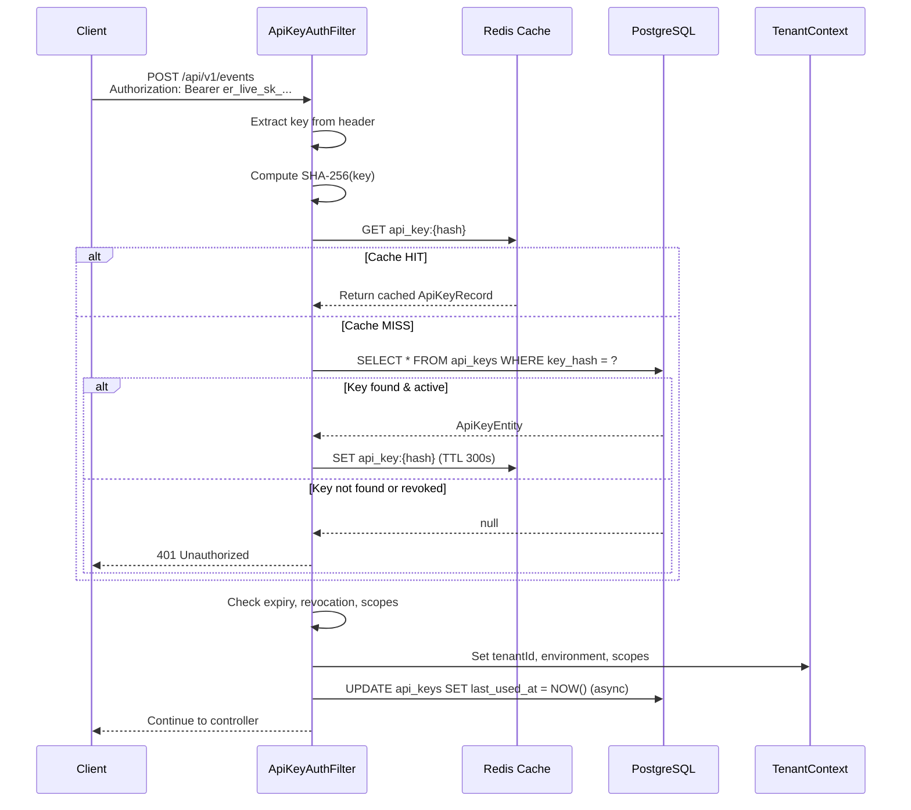
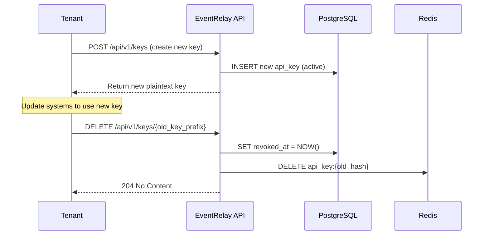

# Authentication — API Key System

## Overview

EventRelay uses a bearer-token API key authentication model. Each tenant is issued API keys with environment-scoped prefixes (`er_live_`, `er_test_`). Keys are hashed before storage (SHA-256 + salt), and the plaintext is shown to the tenant exactly once at creation time.

This design mirrors the authentication approach used by **Stripe**, **GitHub**, and **Svix** — prefixed, scoped keys that are easy to identify in logs without revealing the secret portion.

> [!IMPORTANT]
> API keys are the **sole authentication mechanism** for the ingestion API. There is no OAuth, no session cookies, no JWT. Simplicity is a feature — webhook platforms must be easy to integrate.

---

## API Key Format

```
er_live_sk_a1b2c3d4e5f6g7h8i9j0k1l2m3n4o5p6q7r8s9t0
├─────────┤├──────────────────────────────────────────┤
  prefix                 random secret (40 chars)
```

### Prefix Structure

| Prefix | Environment | Purpose |
|---|---|---|
| `er_live_sk_` | Production | Live event delivery |
| `er_test_sk_` | Sandbox | Testing, no actual delivery |
| `er_live_pk_` | Production | Public key (read-only operations) |
| `er_admin_sk_` | Admin | Platform administration |

### Key Components

| Component | Length | Charset | Example |
|---|---|---|---|
| Platform prefix | 3 chars | `er_` | `er_` |
| Environment | 5 chars | `live_` or `test_` | `live_` |
| Type | 3 chars | `sk_` or `pk_` | `sk_` |
| Secret | 40 chars | `[a-z0-9]` | `a1b2c3d4e5f6g7h8i9j0...` |
| **Total** | **51 chars** | | `er_live_sk_a1b2c3d4...` |

### Key Generation Code

```java
@Service
public class ApiKeyGenerator {

    private static final SecureRandom SECURE_RANDOM = new SecureRandom();
    private static final String CHARSET = "abcdefghijklmnopqrstuvwxyz0123456789";
    private static final int SECRET_LENGTH = 40;

    public GeneratedApiKey generate(ApiKeyEnvironment environment, ApiKeyType type) {
        String prefix = buildPrefix(environment, type);
        String secret = generateSecret();
        String plaintext = prefix + secret;
        String hash = hashKey(plaintext);
        // Store first 8 chars of secret as prefix for identification in UI
        String identifierPrefix = prefix + secret.substring(0, 4);

        return new GeneratedApiKey(plaintext, hash, identifierPrefix);
    }

    private String buildPrefix(ApiKeyEnvironment env, ApiKeyType type) {
        return "er_" + env.value() + "_" + type.value() + "_";
    }

    private String generateSecret() {
        StringBuilder sb = new StringBuilder(SECRET_LENGTH);
        for (int i = 0; i < SECRET_LENGTH; i++) {
            sb.append(CHARSET.charAt(SECURE_RANDOM.nextInt(CHARSET.length())));
        }
        return sb.toString();
    }

    private String hashKey(String plaintext) {
        return Hashing.sha256()
            .hashString(plaintext, StandardCharsets.UTF_8)
            .toString();
    }

    public boolean verify(String plaintext, String storedHash) {
        String computed = hashKey(plaintext);
        return MessageDigest.isEqual(
            computed.getBytes(StandardCharsets.UTF_8),
            storedHash.getBytes(StandardCharsets.UTF_8)
        );
    }
}

public record GeneratedApiKey(
    String plaintext,   // Shown to user once, never stored
    String hash,        // SHA-256 hash, stored in DB
    String prefix       // e.g., "er_live_sk_a1b2" — stored for identification
) {}

public enum ApiKeyEnvironment {
    LIVE("live"), TEST("test");
    private final String value;
    ApiKeyEnvironment(String value) { this.value = value; }
    public String value() { return value; }
}

public enum ApiKeyType {
    SECRET("sk"), PUBLIC("pk"), ADMIN("admin_sk");
    private final String value;
    ApiKeyType(String value) { this.value = value; }
    public String value() { return value; }
}
```

> [!TIP]
> We use SHA-256 instead of bcrypt for API key hashing. Unlike passwords, API keys are high-entropy random strings — dictionary/rainbow-table attacks are infeasible. SHA-256 allows O(1) lookup by hash, while bcrypt would require scanning all keys and verifying each (O(n) per request).

---

## Database Schema

```sql
CREATE TABLE api_keys (
    id              UUID PRIMARY KEY DEFAULT gen_random_uuid(),
    tenant_id       UUID NOT NULL REFERENCES tenants(id) ON DELETE CASCADE,
    key_hash        VARCHAR(64) NOT NULL UNIQUE,     -- SHA-256 hex digest
    key_prefix      VARCHAR(20) NOT NULL,            -- e.g., "er_live_sk_a1b2"
    environment     VARCHAR(10) NOT NULL,            -- 'live' or 'test'
    key_type        VARCHAR(10) NOT NULL DEFAULT 'sk', -- 'sk', 'pk'
    scopes          TEXT[] NOT NULL DEFAULT '{}',     -- e.g., '{events:write, subscriptions:read}'
    name            VARCHAR(255),                    -- Human-readable label
    last_used_at    TIMESTAMP WITH TIME ZONE,
    expires_at      TIMESTAMP WITH TIME ZONE,        -- NULL = no expiry
    revoked_at      TIMESTAMP WITH TIME ZONE,        -- NULL = active
    created_at      TIMESTAMP WITH TIME ZONE NOT NULL DEFAULT NOW(),
    created_by      VARCHAR(255)
);

CREATE INDEX idx_api_keys_key_hash ON api_keys(key_hash);
CREATE INDEX idx_api_keys_tenant_id ON api_keys(tenant_id);
CREATE INDEX idx_api_keys_prefix ON api_keys(key_prefix);
```

### JPA Entity

```java
@Entity
@Table(name = "api_keys")
@Getter @Setter @NoArgsConstructor
public class ApiKeyEntity {

    @Id
    @GeneratedValue(strategy = GenerationType.UUID)
    private UUID id;

    @Column(name = "tenant_id", nullable = false)
    private UUID tenantId;

    @Column(name = "key_hash", nullable = false, unique = true, length = 64)
    private String keyHash;

    @Column(name = "key_prefix", nullable = false, length = 20)
    private String keyPrefix;

    @Enumerated(EnumType.STRING)
    @Column(nullable = false, length = 10)
    private ApiKeyEnvironment environment;

    @Enumerated(EnumType.STRING)
    @Column(name = "key_type", nullable = false, length = 10)
    private ApiKeyType keyType;

    @Column(columnDefinition = "TEXT[]")
    @JdbcTypeCode(SqlTypes.ARRAY)
    private String[] scopes;

    @Column(length = 255)
    private String name;

    @Column(name = "last_used_at")
    private Instant lastUsedAt;

    @Column(name = "expires_at")
    private Instant expiresAt;

    @Column(name = "revoked_at")
    private Instant revokedAt;

    @Column(name = "created_at", nullable = false, updatable = false)
    private Instant createdAt;

    public boolean isActive() {
        return revokedAt == null
            && (expiresAt == null || expiresAt.isAfter(Instant.now()));
    }
}
```

---

## Authentication Flow



---

## Spring Security Configuration

```java
@Configuration
@EnableWebSecurity
@EnableMethodSecurity
@RequiredArgsConstructor
public class SecurityConfig {

    private final ApiKeyAuthenticationFilter apiKeyAuthFilter;

    @Bean
    public SecurityFilterChain securityFilterChain(HttpSecurity http) throws Exception {
        return http
            .csrf(AbstractHttpConfigurer::disable)
            .sessionManagement(session ->
                session.sessionCreationPolicy(SessionCreationPolicy.STATELESS))
            .authorizeHttpRequests(auth -> auth
                .requestMatchers("/actuator/health", "/actuator/info").permitAll()
                .requestMatchers("/api/v1/tenants/**").hasRole("ADMIN")
                .requestMatchers("/api/v1/**").authenticated()
                .anyRequest().denyAll()
            )
            .addFilterBefore(apiKeyAuthFilter, UsernamePasswordAuthenticationFilter.class)
            .exceptionHandling(ex -> ex
                .authenticationEntryPoint(new ApiKeyAuthenticationEntryPoint())
                .accessDeniedHandler(new ApiKeyAccessDeniedHandler())
            )
            .build();
    }
}
```

---

## API Key Authentication Filter

```java
@Component
@RequiredArgsConstructor
@Slf4j
public class ApiKeyAuthenticationFilter extends OncePerRequestFilter {

    private static final String AUTH_HEADER = "Authorization";
    private static final String BEARER_PREFIX = "Bearer ";
    private static final String API_KEY_PREFIX = "er_";

    private final ApiKeyService apiKeyService;
    private final TenantContext tenantContext;

    @Override
    protected boolean shouldNotFilter(HttpServletRequest request) {
        String path = request.getRequestURI();
        return path.startsWith("/actuator/");
    }

    @Override
    protected void doFilterInternal(HttpServletRequest request,
                                     HttpServletResponse response,
                                     FilterChain chain) throws ServletException, IOException {

        String authHeader = request.getHeader(AUTH_HEADER);

        if (authHeader == null || !authHeader.startsWith(BEARER_PREFIX)) {
            sendUnauthorized(response, "Missing or invalid Authorization header");
            return;
        }

        String apiKey = authHeader.substring(BEARER_PREFIX.length()).trim();

        if (!apiKey.startsWith(API_KEY_PREFIX)) {
            sendUnauthorized(response, "Invalid API key format");
            return;
        }

        try {
            ApiKeyAuthentication auth = apiKeyService.authenticate(apiKey);

            if (auth == null) {
                sendUnauthorized(response, "Invalid or revoked API key");
                return;
            }

            // Set Spring Security context
            SecurityContextHolder.getContext().setAuthentication(auth);

            // Set tenant context for downstream use
            tenantContext.setCurrentTenantId(auth.getTenantId());
            tenantContext.setEnvironment(auth.getEnvironment());

            chain.doFilter(request, response);

        } finally {
            SecurityContextHolder.clearContext();
            tenantContext.clear();
        }
    }

    private void sendUnauthorized(HttpServletResponse response, String message) throws IOException {
        response.setStatus(HttpServletResponse.SC_UNAUTHORIZED);
        response.setContentType(MediaType.APPLICATION_JSON_VALUE);
        response.getWriter().write(JsonUtil.toJson(
            ApiResponse.error(new ApiError("401", "INVALID_API_KEY", message,
                null, RequestContext.getRequestId()))
        ));
    }
}
```

### Authentication Token

```java
public class ApiKeyAuthentication extends AbstractAuthenticationToken {

    private final String tenantId;
    private final ApiKeyEnvironment environment;
    private final Set<String> scopes;
    private final String keyPrefix;

    public ApiKeyAuthentication(String tenantId, ApiKeyEnvironment environment,
                                 Set<String> scopes, String keyPrefix) {
        super(scopes.stream()
            .map(s -> new SimpleGrantedAuthority("SCOPE_" + s))
            .collect(Collectors.toList()));
        this.tenantId = tenantId;
        this.environment = environment;
        this.scopes = scopes;
        this.keyPrefix = keyPrefix;
        setAuthenticated(true);
    }

    @Override
    public Object getCredentials() { return null; }

    @Override
    public Object getPrincipal() { return tenantId; }

    public String getTenantId() { return tenantId; }
    public ApiKeyEnvironment getEnvironment() { return environment; }
    public Set<String> getScopes() { return scopes; }
}
```

---

## API Key Service with Caching

```java
@Service
@RequiredArgsConstructor
@Slf4j
public class ApiKeyService {

    private final ApiKeyRepository apiKeyRepository;
    private final RedisTemplate<String, String> redisTemplate;
    private final ObjectMapper objectMapper;

    private static final String CACHE_PREFIX = "api_key:";
    private static final Duration CACHE_TTL = Duration.ofMinutes(5);

    public ApiKeyAuthentication authenticate(String plaintextKey) {
        String hash = sha256(plaintextKey);
        String cacheKey = CACHE_PREFIX + hash;

        // 1. Check Redis cache
        String cached = redisTemplate.opsForValue().get(cacheKey);
        if (cached != null) {
            return deserializeAuth(cached);
        }

        // 2. Check PostgreSQL
        Optional<ApiKeyEntity> entity = apiKeyRepository.findByKeyHash(hash);

        if (entity.isEmpty() || !entity.get().isActive()) {
            return null;
        }

        ApiKeyEntity key = entity.get();
        ApiKeyAuthentication auth = new ApiKeyAuthentication(
            key.getTenantId().toString(),
            key.getEnvironment(),
            Set.of(key.getScopes()),
            key.getKeyPrefix()
        );

        // 3. Cache in Redis
        try {
            redisTemplate.opsForValue().set(
                cacheKey,
                objectMapper.writeValueAsString(auth),
                CACHE_TTL
            );
        } catch (Exception e) {
            log.warn("Failed to cache API key auth", e);
        }

        // 4. Update last_used_at asynchronously
        apiKeyRepository.updateLastUsedAt(key.getId(), Instant.now());

        return auth;
    }

    private String sha256(String input) {
        return Hashing.sha256()
            .hashString(input, StandardCharsets.UTF_8)
            .toString();
    }
}
```

---

## Key Rotation

Key rotation allows tenants to create a new key and phase out the old one without downtime.

### Rotation Flow



### Rotation Rules

| Rule | Value |
|---|---|
| Max active keys per tenant | 5 |
| Grace period after revocation | 0 (immediate) |
| Key expiry support | Optional, via `expires_at` |
| Rotation notification | Webhook to tenant admin URL |

---

## Scope Permissions

API keys can be scoped to limit access:

| Scope | Allows |
|---|---|
| `events:write` | POST `/api/v1/events` |
| `events:read` | GET `/api/v1/events`, GET `/api/v1/events/{id}` |
| `subscriptions:write` | POST/PATCH/DELETE `/api/v1/subscriptions` |
| `subscriptions:read` | GET `/api/v1/subscriptions` |
| `tenant:read` | GET `/api/v1/tenants/{id}` |
| `admin:*` | All operations (admin keys only) |

### Scope Enforcement

```java
@Aspect
@Component
@RequiredArgsConstructor
public class ScopeEnforcementAspect {

    @Before("@annotation(requireScope)")
    public void checkScope(RequireScope requireScope) {
        ApiKeyAuthentication auth = (ApiKeyAuthentication)
            SecurityContextHolder.getContext().getAuthentication();

        String required = requireScope.value();
        if (!auth.getScopes().contains(required) && !auth.getScopes().contains("admin:*")) {
            throw new InsufficientScopeException(
                "API key lacks required scope: " + required);
        }
    }
}

@Target(ElementType.METHOD)
@Retention(RetentionPolicy.RUNTIME)
public @interface RequireScope {
    String value();
}
```

Usage on a controller method:

```java
@PostMapping
@RequireScope("events:write")
public ApiResponse<EventSubmissionResponse> submitEvent(...) { ... }
```

---

## Production Considerations

1. **Key leakage detection** — Log key prefixes (never the full key) in audit logs. Monitor for keys appearing in GitHub, logs, or error messages via `er_live_sk_` pattern matching.
2. **Rate limiting per key** — Distinct from per-tenant rate limiting. A tenant with 3 keys should share a single rate limit bucket.
3. **IP allowlisting** — Future enhancement: allow tenants to restrict API key usage to specific IP ranges.
4. **Audit log** — Every API key creation, rotation, and revocation should be recorded in an immutable audit log table.
5. **Cache invalidation** — When a key is revoked, immediately delete from Redis to prevent the 5-minute cache TTL from allowing continued use.
6. **Timing-safe comparison** — Use `MessageDigest.isEqual()` to prevent timing attacks when comparing hashes.

---

## Cross-References

- [REST API](./REST_API.md) — How authentication headers are used
- [Tenant Management](./Tenant_Management.md) — Tenant provisioning and key issuance
- [Event Validation](./Event_Validation.md) — Validation runs after authentication
