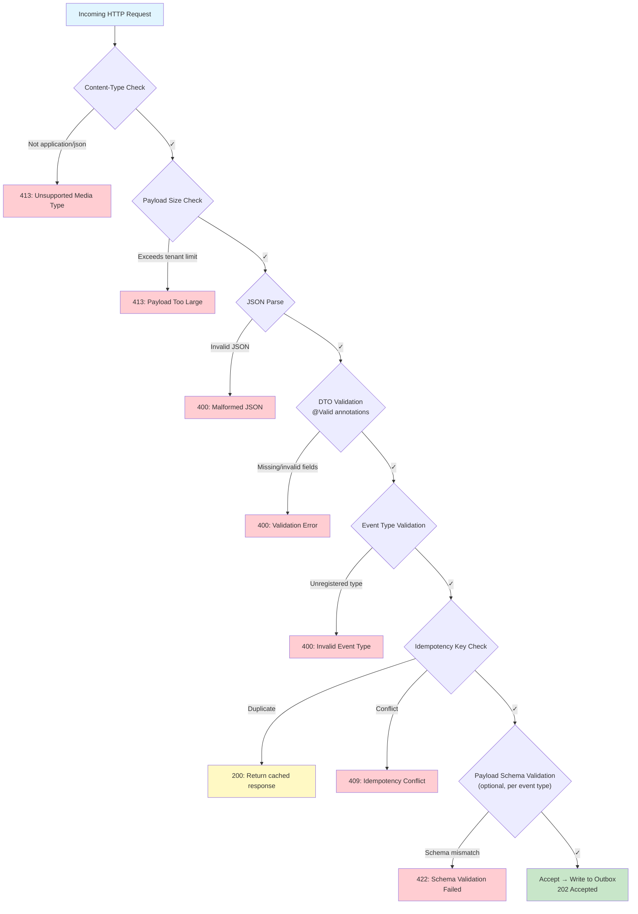

# Event Validation — Input Validation Strategy

## Overview

Every event submitted to EventRelay passes through a multi-stage validation pipeline before being accepted into the outbox. Validation is strict and tenant-aware — different tenants can have different payload size limits, registered event types, and content-type constraints.

The philosophy: **reject early, reject clearly**. A well-structured `400 Bad Request` with field-level errors saves hours of debugging for integrators.

> [!IMPORTANT]
> Validation occurs **synchronously** in the ingestion path. Every validation step must be fast (< 5ms total). Expensive checks (e.g., schema registry lookups) are cached aggressively.

---

## Validation Pipeline



---

## Stage 1: Content-Type Enforcement

```java
@Component
@Order(1)
public class ContentTypeValidationFilter extends OncePerRequestFilter {

    private static final Set<String> ALLOWED_CONTENT_TYPES = Set.of(
        "application/json",
        "application/json; charset=utf-8",
        "application/json;charset=utf-8"
    );

    @Override
    protected boolean shouldNotFilter(HttpServletRequest request) {
        return !"POST".equalsIgnoreCase(request.getMethod())
            || !request.getRequestURI().startsWith("/api/v1/events");
    }

    @Override
    protected void doFilterInternal(HttpServletRequest request,
                                     HttpServletResponse response,
                                     FilterChain chain) throws ServletException, IOException {
        String contentType = request.getContentType();

        if (contentType == null || ALLOWED_CONTENT_TYPES.stream()
                .noneMatch(ct -> contentType.toLowerCase().startsWith(ct.split(";")[0]))) {
            response.setStatus(HttpServletResponse.SC_UNSUPPORTED_MEDIA_TYPE);
            response.setContentType(MediaType.APPLICATION_JSON_VALUE);
            response.getWriter().write(JsonUtil.toJson(ApiResponse.error(new ApiError(
                "415", "UNSUPPORTED_MEDIA_TYPE",
                "Content-Type must be application/json",
                null, RequestContext.getRequestId()
            ))));
            return;
        }

        chain.doFilter(request, response);
    }
}
```

---

## Stage 2: Payload Size Enforcement

Payload size is enforced **before** JSON parsing to prevent out-of-memory conditions on maliciously large payloads.

### Configuration

| Plan | Default Max Size | Configurable |
|---|---|---|
| FREE | 64 KB | No |
| STARTER | 128 KB | No |
| BUSINESS | 256 KB | Yes (up to 512 KB) |
| ENTERPRISE | 1 MB | Yes (up to 5 MB) |

### Size Limit Filter

```java
@Component
@Order(2)
@RequiredArgsConstructor
public class PayloadSizeLimitFilter extends OncePerRequestFilter {

    private final TenantContext tenantContext;
    private final TenantConfigService tenantConfigService;

    private static final int ABSOLUTE_MAX_BYTES = 5 * 1024 * 1024; // 5MB hard cap

    @Override
    protected boolean shouldNotFilter(HttpServletRequest request) {
        return !"POST".equalsIgnoreCase(request.getMethod())
            || !request.getRequestURI().startsWith("/api/v1/events");
    }

    @Override
    protected void doFilterInternal(HttpServletRequest request,
                                     HttpServletResponse response,
                                     FilterChain chain) throws ServletException, IOException {

        int contentLength = request.getContentLength();

        // Reject if Content-Length header exceeds absolute max
        if (contentLength > ABSOLUTE_MAX_BYTES) {
            rejectTooLarge(response, ABSOLUTE_MAX_BYTES);
            return;
        }

        // Get tenant-specific limit
        String tenantId = tenantContext.getCurrentTenantId();
        TenantConfig config = tenantConfigService.getConfig(tenantId);
        int maxSize = config.getPayload().getMaxSizeBytes();

        if (contentLength > maxSize) {
            rejectTooLarge(response, maxSize);
            return;
        }

        // Wrap the request to also enforce during read (Content-Length can be spoofed)
        LimitedContentRequestWrapper wrappedRequest =
            new LimitedContentRequestWrapper(request, maxSize);

        try {
            chain.doFilter(wrappedRequest, response);
        } catch (PayloadTooLargeException e) {
            rejectTooLarge(response, maxSize);
        }
    }

    private void rejectTooLarge(HttpServletResponse response, int maxSize) throws IOException {
        response.setStatus(413);
        response.setContentType(MediaType.APPLICATION_JSON_VALUE);
        response.getWriter().write(JsonUtil.toJson(ApiResponse.error(new ApiError(
            "413", "PAYLOAD_TOO_LARGE",
            String.format("Payload exceeds maximum allowed size of %d bytes", maxSize),
            null, RequestContext.getRequestId()
        ))));
    }
}
```

### Request Wrapper with Size Enforcement

```java
public class LimitedContentRequestWrapper extends HttpServletRequestWrapper {

    private final byte[] body;

    public LimitedContentRequestWrapper(HttpServletRequest request, int maxBytes)
            throws IOException {
        super(request);

        ByteArrayOutputStream buffer = new ByteArrayOutputStream();
        InputStream input = request.getInputStream();
        byte[] chunk = new byte[4096];
        int totalRead = 0;
        int bytesRead;

        while ((bytesRead = input.read(chunk)) != -1) {
            totalRead += bytesRead;
            if (totalRead > maxBytes) {
                throw new PayloadTooLargeException(
                    "Payload exceeds maximum size of " + maxBytes + " bytes");
            }
            buffer.write(chunk, 0, bytesRead);
        }

        this.body = buffer.toByteArray();
    }

    @Override
    public ServletInputStream getInputStream() {
        return new DelegatingServletInputStream(new ByteArrayInputStream(body));
    }

    @Override
    public BufferedReader getReader() {
        return new BufferedReader(new InputStreamReader(getInputStream(), StandardCharsets.UTF_8));
    }
}
```

---

## Stage 3: DTO Validation (Bean Validation)

Standard Jakarta Bean Validation annotations on the request DTO:

```java
@Validated
public record EventSubmissionRequest(

    @NotBlank(message = "event_type is required")
    @Size(max = 255, message = "event_type must not exceed 255 characters")
    @Pattern(
        regexp = "^[a-z][a-z0-9_]*(\\.[a-z][a-z0-9_]*)*$",
        message = "event_type must be dot-separated lowercase identifiers (e.g., payment.completed)"
    )
    @JsonProperty("event_type")
    String eventType,

    @NotNull(message = "payload is required")
    @JsonProperty("payload")
    Map<String, Object> payload,

    @JsonProperty("metadata")
    @Size(max = 20, message = "metadata must not exceed 20 entries")
    Map<@Size(max = 64) String, @Size(max = 256) String> metadata

) {}
```

### Validation Rules Summary

| Field | Rule | Error Code |
|---|---|---|
| `event_type` | Required, max 255 chars, dot-separated lowercase | `VALIDATION_ERROR` |
| `event_type` | Must match `^[a-z][a-z0-9_]*(\.[a-z][a-z0-9_]*)*$` | `VALIDATION_ERROR` |
| `payload` | Required, must be non-null JSON object | `VALIDATION_ERROR` |
| `payload` | Size within tenant limit (default 256KB) | `PAYLOAD_TOO_LARGE` |
| `metadata` | Optional, max 20 entries | `VALIDATION_ERROR` |
| `metadata` keys | Max 64 characters each | `VALIDATION_ERROR` |
| `metadata` values | Max 256 characters each | `VALIDATION_ERROR` |
| `Idempotency-Key` header | Required, UUID v4 format | `VALIDATION_ERROR` |

---

## Stage 4: Event Type Validation

Validates that the submitted event type is registered for this tenant:

```java
@Component
@RequiredArgsConstructor
public class EventTypeValidator {

    private final EventTypeRegistryService registryService;

    /**
     * Validates that the event type is registered for the given tenant.
     * Falls back to allowing all event types if the tenant hasn't configured a registry.
     */
    public void validate(String tenantId, String eventType) {
        Set<String> registeredTypes = registryService.getRegisteredTypes(tenantId);

        // If tenant has no registered types, allow all (open mode)
        if (registeredTypes.isEmpty()) {
            return;
        }

        if (!registeredTypes.contains(eventType)) {
            throw new InvalidEventTypeException(
                String.format("Event type '%s' is not registered for this tenant. " +
                    "Registered types: %s", eventType, registeredTypes)
            );
        }
    }
}

@Service
@RequiredArgsConstructor
public class EventTypeRegistryService {

    private final EventTypeRepository eventTypeRepository;

    @Cacheable(value = "event-types", key = "#tenantId")
    public Set<String> getRegisteredTypes(String tenantId) {
        return eventTypeRepository.findByTenantId(UUID.fromString(tenantId))
            .stream()
            .map(EventTypeEntity::getName)
            .collect(Collectors.toSet());
    }
}
```

### Event Type Registry Table

```sql
CREATE TABLE event_types (
    id          UUID PRIMARY KEY DEFAULT gen_random_uuid(),
    tenant_id   UUID NOT NULL REFERENCES tenants(id) ON DELETE CASCADE,
    name        VARCHAR(255) NOT NULL,
    description VARCHAR(1000),
    schema      JSONB,                              -- Optional JSON Schema for payload validation
    created_at  TIMESTAMP WITH TIME ZONE NOT NULL DEFAULT NOW(),

    CONSTRAINT uq_tenant_event_type UNIQUE (tenant_id, name)
);

CREATE INDEX idx_event_types_tenant ON event_types(tenant_id);
```

---

## Stage 5: Payload Schema Validation (Optional)

For tenants that register JSON schemas for their event types, we validate the payload structure.

```java
@Component
@RequiredArgsConstructor
@Slf4j
public class PayloadSchemaValidator {

    private final EventTypeRegistryService registryService;
    private final JsonSchemaFactory schemaFactory;

    @PostConstruct
    void init() {
        // Use JSON Schema draft 2020-12
    }

    public List<SchemaValidationError> validate(String tenantId, String eventType,
                                                  Map<String, Object> payload) {
        Optional<JsonNode> schemaNode = registryService.getSchema(tenantId, eventType);

        if (schemaNode.isEmpty()) {
            return List.of(); // No schema registered, skip validation
        }

        JsonSchema schema = schemaFactory.getSchema(schemaNode.get());
        JsonNode payloadNode = objectMapper.valueToTree(payload);
        Set<ValidationMessage> errors = schema.validate(payloadNode);

        if (errors.isEmpty()) {
            return List.of();
        }

        return errors.stream()
            .map(e -> new SchemaValidationError(
                e.getPath(),
                e.getMessage(),
                e.getType()
            ))
            .toList();
    }
}

public record SchemaValidationError(
    String path,
    String message,
    String type
) {}
```

### Example Schema Registration

```json
{
  "event_type": "payment.completed",
  "schema": {
    "$schema": "https://json-schema.org/draft/2020-12/schema",
    "type": "object",
    "required": ["payment_id", "amount", "currency"],
    "properties": {
      "payment_id": {
        "type": "string",
        "pattern": "^pay_[a-zA-Z0-9]+$"
      },
      "amount": {
        "type": "integer",
        "minimum": 0
      },
      "currency": {
        "type": "string",
        "enum": ["USD", "EUR", "GBP"]
      },
      "customer_id": {
        "type": "string"
      }
    },
    "additionalProperties": true
  }
}
```

---

## Stage 6: Idempotency Key Validation

```java
@Component
public class IdempotencyKeyValidator {

    private static final Pattern UUID_V4_PATTERN = Pattern.compile(
        "^[0-9a-f]{8}-[0-9a-f]{4}-4[0-9a-f]{3}-[89ab][0-9a-f]{3}-[0-9a-f]{12}$",
        Pattern.CASE_INSENSITIVE
    );

    /**
     * Validates the Idempotency-Key header format.
     * Must be a valid UUID v4 string.
     */
    public void validate(String idempotencyKey) {
        if (idempotencyKey == null || idempotencyKey.isBlank()) {
            throw new ValidationException(
                "Idempotency-Key header is required for event submission");
        }

        if (idempotencyKey.length() > 64) {
            throw new ValidationException(
                "Idempotency-Key must not exceed 64 characters");
        }

        if (!UUID_V4_PATTERN.matcher(idempotencyKey).matches()) {
            throw new ValidationException(
                "Idempotency-Key must be a valid UUID v4");
        }
    }
}
```

---

## Integrated Validation Service

The `EventValidationService` orchestrates the entire pipeline:

```java
@Service
@RequiredArgsConstructor
@Slf4j
public class EventValidationService {

    private final TenantConfigService tenantConfigService;
    private final EventTypeValidator eventTypeValidator;
    private final PayloadSchemaValidator schemaValidator;
    private final IdempotencyKeyValidator idempotencyKeyValidator;
    private final ObjectMapper objectMapper;

    /**
     * Runs the complete validation pipeline.
     * Throws specific exceptions at each stage for precise error reporting.
     */
    public void validate(String tenantId, EventSubmissionRequest request,
                          String idempotencyKey) {

        // 1. Idempotency key format
        idempotencyKeyValidator.validate(idempotencyKey);

        // 2. Tenant-specific payload size (double-check after filter)
        TenantConfig config = tenantConfigService.getConfig(tenantId);
        int payloadSize = estimatePayloadSize(request.payload());
        if (payloadSize > config.getPayload().getMaxSizeBytes()) {
            throw new PayloadTooLargeException(String.format(
                "Payload size %d bytes exceeds limit of %d bytes",
                payloadSize, config.getPayload().getMaxSizeBytes()
            ));
        }

        // 3. Event type registration check
        eventTypeValidator.validate(tenantId, request.eventType());

        // 4. Payload schema validation (if schema registered)
        List<SchemaValidationError> schemaErrors =
            schemaValidator.validate(tenantId, request.eventType(), request.payload());
        if (!schemaErrors.isEmpty()) {
            throw new SchemaValidationException(schemaErrors);
        }

        log.debug("Event validation passed: tenant={}, type={}", tenantId, request.eventType());
    }

    private int estimatePayloadSize(Map<String, Object> payload) {
        try {
            return objectMapper.writeValueAsBytes(payload).length;
        } catch (Exception e) {
            throw new ValidationException("Failed to serialize payload for size check");
        }
    }
}
```

---

## Error Response Format

All validation errors follow a consistent structure. Field-level errors include the rejected value for easy debugging:

```json
{
  "status": "error",
  "error": {
    "status": "400",
    "code": "VALIDATION_ERROR",
    "message": "Request validation failed",
    "fields": [
      {
        "field": "event_type",
        "message": "event_type must be dot-separated lowercase identifiers (e.g., payment.completed)",
        "rejected_value": "Payment-COMPLETED"
      },
      {
        "field": "payload",
        "message": "payload is required",
        "rejected_value": null
      }
    ],
    "request_id": "req_01H5KXZV3JQXR8N4M2GFTY9WBC"
  }
}
```

### Schema Validation Error

```json
{
  "status": "error",
  "error": {
    "status": "422",
    "code": "SCHEMA_VALIDATION_FAILED",
    "message": "Payload does not conform to the registered schema for 'payment.completed'",
    "fields": [
      {
        "field": "$.amount",
        "message": "must be of type integer, found string",
        "rejected_value": "not-a-number"
      },
      {
        "field": "$.currency",
        "message": "must be one of [USD, EUR, GBP]",
        "rejected_value": "BTC"
      }
    ],
    "request_id": "req_01H5KXZV3JQXR8N4M2GFTY9WBC"
  }
}
```

---

## Custom Validators

### Event Type Format Validator (Annotation-based)

```java
@Target({ElementType.FIELD, ElementType.PARAMETER})
@Retention(RetentionPolicy.RUNTIME)
@Constraint(validatedBy = EventTypeFormatValidator.class)
public @interface ValidEventType {
    String message() default "Invalid event type format";
    Class<?>[] groups() default {};
    Class<? extends Payload>[] payload() default {};
}

public class EventTypeFormatValidator implements ConstraintValidator<ValidEventType, String> {

    private static final Pattern EVENT_TYPE_PATTERN =
        Pattern.compile("^[a-z][a-z0-9_]*(\\.[a-z][a-z0-9_]*)*$");

    @Override
    public boolean isValid(String value, ConstraintValidatorContext context) {
        if (value == null || value.isBlank()) {
            return true; // @NotBlank handles null/empty
        }
        return EVENT_TYPE_PATTERN.matcher(value).matches();
    }
}
```

### URL Format Validator

```java
@Target({ElementType.FIELD, ElementType.PARAMETER})
@Retention(RetentionPolicy.RUNTIME)
@Constraint(validatedBy = HttpsUrlValidator.class)
public @interface ValidHttpsUrl {
    String message() default "Must be a valid HTTPS URL";
    Class<?>[] groups() default {};
    Class<? extends Payload>[] payload() default {};
}

public class HttpsUrlValidator implements ConstraintValidator<ValidHttpsUrl, String> {

    @Override
    public boolean isValid(String value, ConstraintValidatorContext context) {
        if (value == null) return true;
        try {
            URI uri = new URI(value);
            return "https".equals(uri.getScheme()) && uri.getHost() != null;
        } catch (URISyntaxException e) {
            return false;
        }
    }
}
```

---

## Validation Metrics

Track validation failures in Prometheus for monitoring:

```java
@Component
@RequiredArgsConstructor
public class ValidationMetrics {

    private final MeterRegistry meterRegistry;

    public void recordValidationFailure(String tenantId, String stage, String errorCode) {
        meterRegistry.counter("eventrelay.validation.failures",
            "tenant_id", tenantId,
            "stage", stage,
            "error_code", errorCode
        ).increment();
    }

    public void recordValidationSuccess(String tenantId) {
        meterRegistry.counter("eventrelay.validation.success",
            "tenant_id", tenantId
        ).increment();
    }

    public void recordValidationLatency(String tenantId, long durationMs) {
        meterRegistry.timer("eventrelay.validation.duration",
            "tenant_id", tenantId
        ).record(Duration.ofMillis(durationMs));
    }
}
```

---

## Production Considerations

1. **Validation order matters** — Cheap checks (size, content-type) come before expensive ones (schema validation, DB lookups). This reduces load under attack.
2. **Cache event type registries** — Use Caffeine (local cache, 60s TTL) backed by Redis (shared cache, 10m TTL) for event type lookups. Invalidate on registration changes.
3. **Schema validation library** — Use `networknt/json-schema-validator` for Java. It supports JSON Schema draft 2020-12 and is performant (~100μs per validation for typical schemas).
4. **Payload size estimation** — `objectMapper.writeValueAsBytes()` creates a full serialized copy. For performance, consider using `ContentCachingRequestWrapper` to check the raw byte count from the request body directly.
5. **Error aggregation** — Collect all validation errors in a single pass rather than failing on the first error. This improves the developer experience for API consumers.
6. **Sanitization** — Strip or reject control characters (null bytes, etc.) from string fields to prevent log injection and downstream parsing issues.

---

## Cross-References

- [REST API](./REST_API.md) — Error response format and status codes
- [Idempotency](./Idempotency.md) — Idempotency key validation details
- [Tenant Management](./Tenant_Management.md) — Per-tenant payload size limits
- [Transactional Outbox](./Transactional_Outbox.md) — What happens after validation passes
