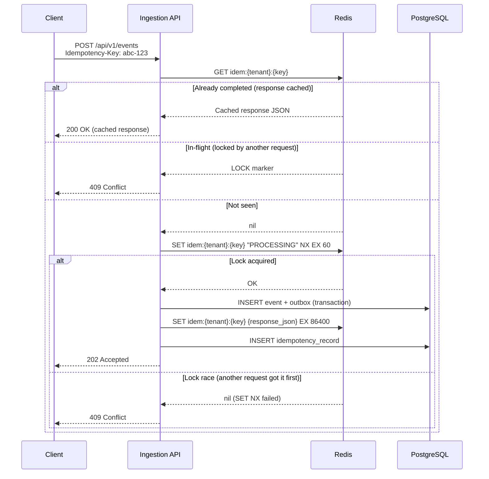
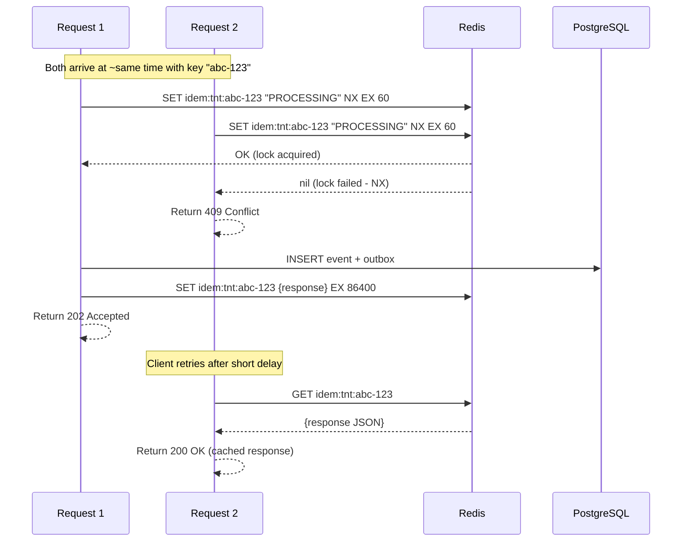

# Idempotency — Duplicate Request Handling

## Overview

Idempotency is a critical property of the EventRelay ingestion API: submitting the same event twice with the same idempotency key produces the same result — the event is ingested exactly once. This protects against:

- **Client retries** — Network timeout, client crashes and replays
- **Load balancer retries** — ALB/NLB retry on 502/503
- **Duplicate form submissions** — User double-clicks "Send"

The implementation uses a **dual-layer approach**: Redis for fast in-flight deduplication and PostgreSQL for durable idempotency records. This mirrors the approach used by **Stripe** and **GitHub** for their idempotent APIs.

> [!IMPORTANT]
> Idempotency is **required** for `POST /api/v1/events`. The `Idempotency-Key` header is mandatory. If omitted, the API returns `400 Bad Request`.

---

## How It Works — High Level



---

## Idempotency Key Format

| Property | Specification |
|---|---|
| Format | UUID v4 (RFC 4122) |
| Length | 36 characters (with hyphens) |
| Header | `Idempotency-Key` |
| Scope | Per-tenant (same key from different tenants = different events) |
| TTL | 24 hours |
| Example | `550e8400-e29b-41d4-a716-446655440000` |

> [!TIP]
> Why UUID v4? It provides sufficient entropy (122 bits) to prevent collisions without coordination. Clients generate them locally — no server round-trip needed. This is the same approach used by Stripe's `Idempotency-Key`.

### Validation

```java
@Component
public class IdempotencyKeyValidator {

    private static final int MAX_LENGTH = 64;
    private static final Pattern UUID_PATTERN = Pattern.compile(
        "^[0-9a-fA-F]{8}-[0-9a-fA-F]{4}-4[0-9a-fA-F]{3}-[89abAB][0-9a-fA-F]{3}-[0-9a-fA-F]{12}$"
    );

    public void validate(String key) {
        if (key == null || key.isBlank()) {
            throw new MissingIdempotencyKeyException(
                "Idempotency-Key header is required for this endpoint");
        }
        if (key.length() > MAX_LENGTH) {
            throw new InvalidIdempotencyKeyException(
                "Idempotency-Key must not exceed " + MAX_LENGTH + " characters");
        }
        if (!UUID_PATTERN.matcher(key).matches()) {
            throw new InvalidIdempotencyKeyException(
                "Idempotency-Key must be a valid UUID v4");
        }
    }
}
```

---

## Database Schema

```sql
CREATE TABLE idempotency_records (
    id              UUID PRIMARY KEY DEFAULT gen_random_uuid(),
    tenant_id       UUID NOT NULL REFERENCES tenants(id),
    idempotency_key VARCHAR(64) NOT NULL,
    request_hash    VARCHAR(64) NOT NULL,           -- SHA-256 of request body
    response_body   JSONB NOT NULL,                 -- Cached response
    http_status     INT NOT NULL,                   -- Cached HTTP status code
    created_at      TIMESTAMP WITH TIME ZONE NOT NULL DEFAULT NOW(),
    expires_at      TIMESTAMP WITH TIME ZONE NOT NULL,

    CONSTRAINT uq_tenant_idempotency_key UNIQUE (tenant_id, idempotency_key)
);

CREATE INDEX idx_idempotency_expires ON idempotency_records(expires_at);
CREATE INDEX idx_idempotency_tenant_key ON idempotency_records(tenant_id, idempotency_key);
```

The `events` table also has a uniqueness constraint for defense-in-depth:

```sql
-- In the events table
CONSTRAINT uq_tenant_idempotency UNIQUE (tenant_id, idempotency_key)
```

---

## Redis Key Structure

```
Key:   idem:{tenantId}:{idempotencyKey}
Value: "PROCESSING" (during in-flight request)
       OR: JSON serialized response (after completion)
TTL:   60 seconds (PROCESSING lock)
       86400 seconds / 24 hours (completed response)
```

### Redis Commands Used

| Operation | Command | Purpose |
|---|---|---|
| Acquire lock | `SET idem:{t}:{k} "PROCESSING" NX EX 60` | Atomic check-and-set, 60s auto-expire |
| Store response | `SET idem:{t}:{k} {json} EX 86400` | Cache result for 24 hours |
| Check status | `GET idem:{t}:{k}` | Fast lookup |
| Release lock | `DEL idem:{t}:{k}` | On request failure (cleanup) |

---

## Idempotency Service Implementation

```java
@Service
@RequiredArgsConstructor
@Slf4j
public class IdempotencyService {

    private final RedisTemplate<String, String> redisTemplate;
    private final IdempotencyRecordRepository recordRepository;
    private final ObjectMapper objectMapper;

    private static final String KEY_PREFIX = "idem:";
    private static final String PROCESSING_VALUE = "PROCESSING";
    private static final Duration LOCK_TTL = Duration.ofSeconds(60);
    private static final Duration RESPONSE_TTL = Duration.ofHours(24);

    /**
     * Checks if a request with this idempotency key has been seen before.
     *
     * Returns:
     * - empty() if the key is new (lock acquired, proceed with processing)
     * - Optional.of(response) if the key was already processed (return cached response)
     *
     * Throws:
     * - IdempotencyConflictException if another request is currently processing this key
     * - IdempotencyMismatchException if the same key is used with a different request body
     */
    public Optional<EventSubmissionResponse> checkAndLock(
            String tenantId, String idempotencyKey, String requestBodyHash) {

        String redisKey = buildKey(tenantId, idempotencyKey);

        // 1. Fast path: check Redis
        String existing = redisTemplate.opsForValue().get(redisKey);

        if (existing != null) {
            if (PROCESSING_VALUE.equals(existing)) {
                // Another request is currently processing with this key
                throw new IdempotencyConflictException(
                    "A request with this idempotency key is currently being processed. " +
                    "Please retry after a short delay.");
            }

            // Response is cached — return it
            log.debug("Idempotency cache hit: key={}", idempotencyKey);
            return Optional.of(deserializeResponse(existing));
        }

        // 2. Check PostgreSQL (Redis might have expired but DB record exists)
        Optional<IdempotencyRecord> dbRecord =
            recordRepository.findByTenantIdAndIdempotencyKey(
                UUID.fromString(tenantId), idempotencyKey);

        if (dbRecord.isPresent()) {
            IdempotencyRecord record = dbRecord.get();

            // Verify request body matches
            if (!record.getRequestHash().equals(requestBodyHash)) {
                throw new IdempotencyMismatchException(
                    "Idempotency key was already used with a different request body. " +
                    "Each unique request must use a unique idempotency key.");
            }

            // Re-cache in Redis
            String responseJson = objectMapper.writeValueAsString(record.getResponseBody());
            redisTemplate.opsForValue().set(redisKey, responseJson, RESPONSE_TTL);

            return Optional.of(deserializeResponse(responseJson));
        }

        // 3. Key not seen — acquire lock
        Boolean acquired = redisTemplate.opsForValue()
            .setIfAbsent(redisKey, PROCESSING_VALUE, LOCK_TTL);

        if (Boolean.TRUE.equals(acquired)) {
            log.debug("Idempotency lock acquired: key={}", idempotencyKey);
            return Optional.empty(); // Proceed with processing
        }

        // Race condition: another request acquired the lock between our GET and SET
        throw new IdempotencyConflictException(
            "A request with this idempotency key is currently being processed");
    }

    /**
     * Stores the response for a successfully processed idempotent request.
     * Called after the event is written to the database.
     */
    public void storeResponse(String tenantId, String idempotencyKey,
                                String requestBodyHash,
                                EventSubmissionResponse response) {
        String redisKey = buildKey(tenantId, idempotencyKey);

        try {
            // 1. Store in Redis (fast lookup)
            String responseJson = objectMapper.writeValueAsString(response);
            redisTemplate.opsForValue().set(redisKey, responseJson, RESPONSE_TTL);

            // 2. Store in PostgreSQL (durable, survives Redis restarts)
            IdempotencyRecord record = new IdempotencyRecord();
            record.setTenantId(UUID.fromString(tenantId));
            record.setIdempotencyKey(idempotencyKey);
            record.setRequestHash(requestBodyHash);
            record.setResponseBody(objectMapper.valueToTree(response));
            record.setHttpStatus(202);
            record.setExpiresAt(Instant.now().plus(RESPONSE_TTL));

            recordRepository.save(record);

            log.debug("Idempotency response stored: key={}", idempotencyKey);

        } catch (Exception e) {
            log.error("Failed to store idempotency response: key={}", idempotencyKey, e);
            // Non-fatal — worst case, a retry will re-process (event table UNIQUE constraint
            // prevents duplicate events)
        }
    }

    /**
     * Releases the lock if request processing fails.
     * This allows the client to retry with the same idempotency key.
     */
    public void releaseLock(String tenantId, String idempotencyKey) {
        String redisKey = buildKey(tenantId, idempotencyKey);

        // Only delete if the value is still "PROCESSING" (prevent deleting a completed response)
        String current = redisTemplate.opsForValue().get(redisKey);
        if (PROCESSING_VALUE.equals(current)) {
            redisTemplate.delete(redisKey);
            log.debug("Idempotency lock released: key={}", idempotencyKey);
        }
    }

    private String buildKey(String tenantId, String idempotencyKey) {
        return KEY_PREFIX + tenantId + ":" + idempotencyKey;
    }

    private EventSubmissionResponse deserializeResponse(String json) {
        try {
            return objectMapper.readValue(json, EventSubmissionResponse.class);
        } catch (Exception e) {
            throw new RuntimeException("Failed to deserialize cached idempotency response", e);
        }
    }
}
```

---

## Request Body Hash

To detect misuse (same idempotency key, different request body), we compute a hash of the request:

```java
@Component
public class RequestHasher {

    private final ObjectMapper objectMapper;

    public RequestHasher(ObjectMapper objectMapper) {
        this.objectMapper = objectMapper;
    }

    /**
     * Computes a deterministic SHA-256 hash of the request body.
     * Used to detect idempotency key reuse with different payloads.
     */
    public String hash(EventSubmissionRequest request) {
        try {
            // Serialize with sorted keys for deterministic output
            String normalized = objectMapper.writer()
                .with(SerializationFeature.ORDER_MAP_ENTRIES_BY_KEYS)
                .writeValueAsString(request);

            return Hashing.sha256()
                .hashString(normalized, StandardCharsets.UTF_8)
                .toString();
        } catch (JsonProcessingException e) {
            throw new RuntimeException("Failed to hash request body", e);
        }
    }
}
```

---

## Handling Concurrent Duplicate Requests

When two identical requests arrive simultaneously (same idempotency key):



### Three Possible Outcomes

| Scenario | Outcome | HTTP Status |
|---|---|---|
| First request with this key | Process normally | `202 Accepted` |
| Duplicate after completion | Return cached response | `200 OK` |
| Duplicate while in-flight | Reject, client retries | `409 Conflict` |

---

## Idempotency Record Entity

```java
@Entity
@Table(name = "idempotency_records")
@Getter @Setter @NoArgsConstructor
public class IdempotencyRecord {

    @Id
    @GeneratedValue(strategy = GenerationType.UUID)
    private UUID id;

    @Column(name = "tenant_id", nullable = false)
    private UUID tenantId;

    @Column(name = "idempotency_key", nullable = false, length = 64)
    private String idempotencyKey;

    @Column(name = "request_hash", nullable = false, length = 64)
    private String requestHash;

    @JdbcTypeCode(SqlTypes.JSON)
    @Column(name = "response_body", columnDefinition = "jsonb", nullable = false)
    private JsonNode responseBody;

    @Column(name = "http_status", nullable = false)
    private int httpStatus;

    @Column(name = "created_at", nullable = false, updatable = false)
    private Instant createdAt;

    @Column(name = "expires_at", nullable = false)
    private Instant expiresAt;

    @PrePersist
    protected void onCreate() {
        createdAt = Instant.now();
    }
}
```

---

## Repository

```java
public interface IdempotencyRecordRepository extends JpaRepository<IdempotencyRecord, UUID> {

    Optional<IdempotencyRecord> findByTenantIdAndIdempotencyKey(
        UUID tenantId, String idempotencyKey);

    @Modifying
    @Query("DELETE FROM IdempotencyRecord r WHERE r.expiresAt < :cutoff")
    int deleteExpired(@Param("cutoff") Instant cutoff);
}
```

---

## Cleanup Job

Expired idempotency records are purged daily:

```java
@Service
@RequiredArgsConstructor
@Slf4j
public class IdempotencyCleanupService {

    private final IdempotencyRecordRepository repository;
    private final MeterRegistry meterRegistry;

    @Scheduled(cron = "0 30 3 * * *") // 3:30 AM daily
    @Transactional
    public void cleanup() {
        int deleted = repository.deleteExpired(Instant.now());
        log.info("Purged {} expired idempotency records", deleted);
        meterRegistry.counter("eventrelay.idempotency.purged").increment(deleted);
    }
}
```

---

## Defense in Depth — PostgreSQL Constraint

Even if Redis fails or the idempotency service has a bug, the PostgreSQL unique constraint on `(tenant_id, idempotency_key)` in the `events` table provides a last line of defense:

```sql
-- This constraint catches any duplicates that slip through Redis
CONSTRAINT uq_tenant_idempotency UNIQUE (tenant_id, idempotency_key)
```

If a duplicate INSERT is attempted, PostgreSQL throws a `DataIntegrityViolationException`, which the ingestion service catches and converts to a `409 Conflict`:

```java
@Service
public class EventIngestionService {

    @Transactional
    public EventSubmissionResponse ingest(...) {
        try {
            // ... normal flow
            eventRepository.save(event);
        } catch (DataIntegrityViolationException e) {
            if (isUniqueConstraintViolation(e, "uq_tenant_idempotency")) {
                // Race condition: another thread/instance processed the same key
                log.warn("Duplicate event caught by DB constraint: key={}", idempotencyKey);
                return idempotencyService.getStoredResponse(tenantId, idempotencyKey)
                    .orElseThrow(() -> new IdempotencyConflictException(
                        "Duplicate event detected. Please retry."));
            }
            throw e;
        }
    }
}
```

---

## Integration with Event Ingestion

Here's how idempotency integrates into the full ingestion flow:

```java
@Transactional
public EventSubmissionResponse ingest(String tenantId,
                                       EventSubmissionRequest request,
                                       String idempotencyKey) {

    // 1. Validate idempotency key format
    idempotencyKeyValidator.validate(idempotencyKey);

    // 2. Compute request body hash
    String requestHash = requestHasher.hash(request);

    // 3. Check idempotency (fast path: Redis, slow path: PostgreSQL)
    Optional<EventSubmissionResponse> cached =
        idempotencyService.checkAndLock(tenantId, idempotencyKey, requestHash);

    if (cached.isPresent()) {
        // Duplicate request — return cached response
        return cached.get();
    }

    try {
        // 4. Validate event
        validationService.validate(tenantId, request, idempotencyKey);

        // 5. Write event + outbox (single transaction)
        EventEntity event = createAndSaveEvent(tenantId, request, idempotencyKey);
        createOutboxEntries(event, tenantId);

        // 6. Build response
        EventSubmissionResponse response = buildResponse(event, idempotencyKey);

        // 7. Store response for future idempotency lookups
        idempotencyService.storeResponse(tenantId, idempotencyKey, requestHash, response);

        return response;

    } catch (Exception e) {
        // Release lock so client can retry
        idempotencyService.releaseLock(tenantId, idempotencyKey);
        throw e;
    }
}
```

---

## Edge Cases

| Edge Case | Behavior |
|---|---|
| Same key, same body, same tenant | Return cached response (200) |
| Same key, different body, same tenant | Return 422 with `IDEMPOTENCY_MISMATCH` error |
| Same key, different tenant | Independent — processed as separate events |
| Key used, then expired (>24h) | Processed as a new event |
| Redis down during check | Fall through to PostgreSQL lookup |
| Redis down during lock | DB unique constraint catches duplicates |
| Request fails after lock acquired | Lock auto-expires in 60s, or explicitly released |
| Server crash during processing | Lock auto-expires in 60s, client retries |

---

## Configuration

```yaml
eventrelay:
  idempotency:
    enabled: true
    lock-ttl-seconds: 60          # How long the PROCESSING lock lives
    response-ttl-hours: 24        # How long cached responses are kept
    cleanup-cron: "0 30 3 * * *"  # When to purge expired records
    redis-key-prefix: "idem:"
    require-uuid-format: true     # Enforce UUID v4 format
```

---

## Production Considerations

1. **Redis availability** — If Redis is down, the system falls back to PostgreSQL-only idempotency (higher latency, but still correct). The DB unique constraint is the ultimate safety net.
2. **Key collision probability** — UUID v4 has 2^122 possible values. The probability of collision in 10 billion keys is ~10^-18. This is not a practical concern.
3. **TTL selection** — 24 hours matches the typical retry window for webhook integrations. Stripe uses 24 hours; some systems use 48 hours for slow integrations.
4. **Lock TTL** — 60 seconds is generous for an operation that should complete in < 100ms. This protects against process crashes but doesn't block legitimate retries too long.
5. **Request hash determinism** — Ensure the `ObjectMapper` always produces the same JSON for the same input (sort keys, consistent null handling). Non-deterministic serialization would cause false `IDEMPOTENCY_MISMATCH` errors.
6. **Metrics to track** — Cache hit rate (high is good), conflict rate (should be < 0.1%), mismatch rate (indicates client bugs), expired cleanup counts.

---

## Cross-References

- [REST API](./REST_API.md) — `Idempotency-Key` header requirement
- [Event Validation](./Event_Validation.md) — Idempotency key format validation
- [Transactional Outbox](./Transactional_Outbox.md) — Outbox writes happen after idempotency check
- [Authentication](./Authentication.md) — Tenant scoping for idempotency keys
