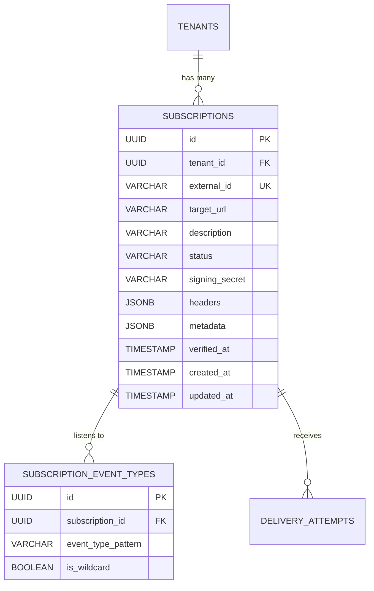
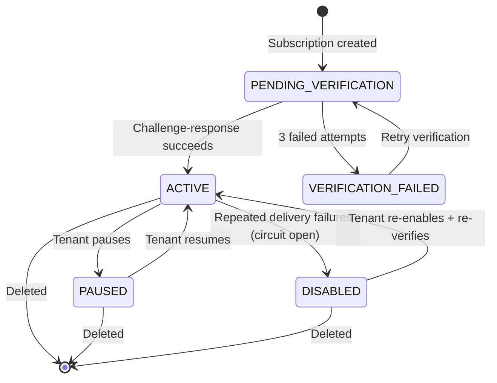
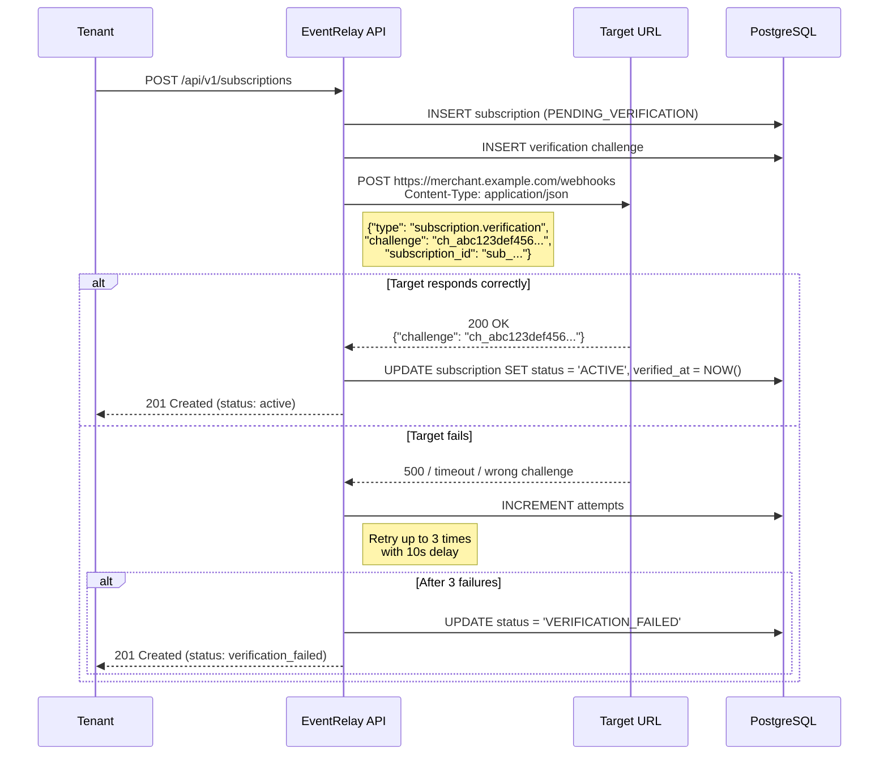

# Subscription Management

## Overview

Subscriptions define *where* and *what* events should be delivered. A subscription binds a target URL to one or more event types for a specific tenant. EventRelay supports exact matches (`payment.completed`), wildcard patterns (`payment.*`), and URL verification via challenge-response — following the patterns used by **Stripe Webhooks**, **GitHub Webhooks**, and **Svix**.

---

## Subscription Model



---

## Database Schema

```sql
CREATE TABLE subscriptions (
    id              UUID PRIMARY KEY DEFAULT gen_random_uuid(),
    tenant_id       UUID NOT NULL REFERENCES tenants(id) ON DELETE CASCADE,
    external_id     VARCHAR(50) NOT NULL UNIQUE,
    target_url      VARCHAR(2048) NOT NULL,
    description     VARCHAR(500),
    status          VARCHAR(20) NOT NULL DEFAULT 'PENDING_VERIFICATION',
    signing_secret  VARCHAR(255) NOT NULL,          -- HMAC-SHA256 secret for this subscription
    custom_headers  JSONB DEFAULT '{}',             -- Additional headers to include in delivery
    metadata        JSONB DEFAULT '{}',
    verified_at     TIMESTAMP WITH TIME ZONE,
    paused_at       TIMESTAMP WITH TIME ZONE,
    disabled_at     TIMESTAMP WITH TIME ZONE,
    created_at      TIMESTAMP WITH TIME ZONE NOT NULL DEFAULT NOW(),
    updated_at      TIMESTAMP WITH TIME ZONE NOT NULL DEFAULT NOW(),

    CONSTRAINT uq_tenant_url UNIQUE (tenant_id, target_url)
);

CREATE INDEX idx_subscriptions_tenant_id ON subscriptions(tenant_id);
CREATE INDEX idx_subscriptions_status ON subscriptions(status);
CREATE INDEX idx_subscriptions_target_url ON subscriptions(target_url);

CREATE TABLE subscription_event_types (
    id                  UUID PRIMARY KEY DEFAULT gen_random_uuid(),
    subscription_id     UUID NOT NULL REFERENCES subscriptions(id) ON DELETE CASCADE,
    event_type_pattern  VARCHAR(255) NOT NULL,       -- e.g., "payment.completed" or "payment.*"
    is_wildcard         BOOLEAN NOT NULL DEFAULT FALSE,
    created_at          TIMESTAMP WITH TIME ZONE NOT NULL DEFAULT NOW(),

    CONSTRAINT uq_sub_event_type UNIQUE (subscription_id, event_type_pattern)
);

CREATE INDEX idx_sub_event_types_subscription ON subscription_event_types(subscription_id);
CREATE INDEX idx_sub_event_types_pattern ON subscription_event_types(event_type_pattern);

-- Verification challenges table
CREATE TABLE subscription_verifications (
    id              UUID PRIMARY KEY DEFAULT gen_random_uuid(),
    subscription_id UUID NOT NULL REFERENCES subscriptions(id) ON DELETE CASCADE,
    challenge_token VARCHAR(64) NOT NULL,
    expires_at      TIMESTAMP WITH TIME ZONE NOT NULL,
    verified_at     TIMESTAMP WITH TIME ZONE,
    attempts        INT NOT NULL DEFAULT 0,
    created_at      TIMESTAMP WITH TIME ZONE NOT NULL DEFAULT NOW()
);
```

---

## Subscription Lifecycle



| Status | Events Delivered? | Description |
|---|---|---|
| `PENDING_VERIFICATION` | No | Awaiting URL ownership verification |
| `ACTIVE` | Yes | Normal operation |
| `PAUSED` | No (queued) | Manually paused by tenant, events accumulate |
| `DISABLED` | No (DLQ) | Automatically disabled after repeated failures |
| `VERIFICATION_FAILED` | No | Challenge-response failed 3 times |

---

## JPA Entities

```java
@Entity
@Table(name = "subscriptions")
@Getter @Setter @NoArgsConstructor
public class SubscriptionEntity {

    @Id
    @GeneratedValue(strategy = GenerationType.UUID)
    private UUID id;

    @Column(name = "tenant_id", nullable = false)
    private UUID tenantId;

    @Column(name = "external_id", nullable = false, unique = true, length = 50)
    private String externalId;

    @Column(name = "target_url", nullable = false, length = 2048)
    private String targetUrl;

    @Column(length = 500)
    private String description;

    @Enumerated(EnumType.STRING)
    @Column(nullable = false, length = 20)
    private SubscriptionStatus status = SubscriptionStatus.PENDING_VERIFICATION;

    @Column(name = "signing_secret", nullable = false, length = 255)
    private String signingSecret;

    @JdbcTypeCode(SqlTypes.JSON)
    @Column(name = "custom_headers", columnDefinition = "jsonb")
    private Map<String, String> customHeaders = new HashMap<>();

    @OneToMany(mappedBy = "subscription", cascade = CascadeType.ALL, orphanRemoval = true)
    private List<SubscriptionEventTypeEntity> eventTypes = new ArrayList<>();

    @Column(name = "verified_at")
    private Instant verifiedAt;

    @Column(name = "created_at", nullable = false, updatable = false)
    private Instant createdAt;

    @Column(name = "updated_at", nullable = false)
    private Instant updatedAt;

    @PrePersist
    protected void onCreate() {
        externalId = "sub_" + ULID.random();
        createdAt = Instant.now();
        updatedAt = Instant.now();
    }

    @PreUpdate
    protected void onUpdate() {
        updatedAt = Instant.now();
    }
}

public enum SubscriptionStatus {
    PENDING_VERIFICATION, ACTIVE, PAUSED, DISABLED, VERIFICATION_FAILED
}

@Entity
@Table(name = "subscription_event_types")
@Getter @Setter @NoArgsConstructor
public class SubscriptionEventTypeEntity {

    @Id
    @GeneratedValue(strategy = GenerationType.UUID)
    private UUID id;

    @ManyToOne(fetch = FetchType.LAZY)
    @JoinColumn(name = "subscription_id", nullable = false)
    private SubscriptionEntity subscription;

    @Column(name = "event_type_pattern", nullable = false, length = 255)
    private String eventTypePattern;

    @Column(name = "is_wildcard", nullable = false)
    private boolean wildcard;

    @Column(name = "created_at", nullable = false, updatable = false)
    private Instant createdAt = Instant.now();
}
```

---

## URL Verification (Challenge-Response)

When a subscription is created, EventRelay sends a `POST` to the target URL with a challenge token. The endpoint must respond with the challenge token to prove ownership.

### Verification Flow



### Verification Service

```java
@Service
@RequiredArgsConstructor
@Slf4j
public class SubscriptionVerificationService {

    private final SubscriptionRepository subscriptionRepository;
    private final VerificationRepository verificationRepository;
    private final RestClient restClient;

    private static final int MAX_VERIFICATION_ATTEMPTS = 3;
    private static final Duration CHALLENGE_EXPIRY = Duration.ofMinutes(10);
    private static final Duration RETRY_DELAY = Duration.ofSeconds(10);

    @Async
    public void initiateVerification(SubscriptionEntity subscription) {
        String challengeToken = "ch_" + generateSecureToken(32);

        SubscriptionVerification verification = new SubscriptionVerification();
        verification.setSubscriptionId(subscription.getId());
        verification.setChallengeToken(challengeToken);
        verification.setExpiresAt(Instant.now().plus(CHALLENGE_EXPIRY));
        verificationRepository.save(verification);

        for (int attempt = 1; attempt <= MAX_VERIFICATION_ATTEMPTS; attempt++) {
            try {
                boolean verified = sendChallenge(
                    subscription.getTargetUrl(),
                    challengeToken,
                    subscription.getExternalId()
                );

                if (verified) {
                    subscription.setStatus(SubscriptionStatus.ACTIVE);
                    subscription.setVerifiedAt(Instant.now());
                    subscriptionRepository.save(subscription);
                    verification.setVerifiedAt(Instant.now());
                    verificationRepository.save(verification);
                    log.info("Subscription verified: {}", subscription.getExternalId());
                    return;
                }
            } catch (Exception e) {
                log.warn("Verification attempt {} failed for {}: {}",
                    attempt, subscription.getExternalId(), e.getMessage());
            }

            verification.setAttempts(attempt);
            verificationRepository.save(verification);

            if (attempt < MAX_VERIFICATION_ATTEMPTS) {
                sleep(RETRY_DELAY);
            }
        }

        subscription.setStatus(SubscriptionStatus.VERIFICATION_FAILED);
        subscriptionRepository.save(subscription);
        log.warn("Subscription verification failed: {}", subscription.getExternalId());
    }

    private boolean sendChallenge(String targetUrl, String challenge, String subscriptionId) {
        Map<String, String> body = Map.of(
            "type", "subscription.verification",
            "challenge", challenge,
            "subscription_id", subscriptionId
        );

        ResponseEntity<Map> response = restClient.post()
            .uri(targetUrl)
            .contentType(MediaType.APPLICATION_JSON)
            .body(body)
            .retrieve()
            .toEntity(Map.class);

        return response.getStatusCode().is2xxSuccessful()
            && challenge.equals(response.getBody().get("challenge"));
    }

    private String generateSecureToken(int length) {
        byte[] bytes = new byte[length];
        new SecureRandom().nextBytes(bytes);
        return Hex.encodeHexString(bytes);
    }
}
```

---

## Event Type Matching

### Exact Match
```
Subscription: payment.completed
Event:        payment.completed  → ✅ MATCH
Event:        payment.refunded   → ✗ NO MATCH
```

### Wildcard Match (`*`)
```
Subscription: payment.*
Event:        payment.completed  → ✅ MATCH
Event:        payment.refunded   → ✅ MATCH
Event:        order.created      → ✗ NO MATCH
```

### Multi-Level Wildcard (`**`)
```
Subscription: payment.**
Event:        payment.completed         → ✅ MATCH
Event:        payment.refund.completed  → ✅ MATCH
Event:        order.created             → ✗ NO MATCH
```

### Catch-All
```
Subscription: *
Event:        (any event type)  → ✅ MATCH
```

### Matching Engine

```java
@Service
@Slf4j
public class EventTypeMatcherService {

    /**
     * Finds all active subscriptions for a tenant that match the given event type.
     */
    public List<SubscriptionEntity> findMatchingSubscriptions(
            UUID tenantId, String eventType, List<SubscriptionEntity> subscriptions) {

        return subscriptions.stream()
            .filter(sub -> sub.getStatus() == SubscriptionStatus.ACTIVE)
            .filter(sub -> sub.getTenantId().equals(tenantId))
            .filter(sub -> matchesAnyPattern(eventType, sub.getEventTypes()))
            .toList();
    }

    private boolean matchesAnyPattern(String eventType,
                                       List<SubscriptionEventTypeEntity> patterns) {
        return patterns.stream()
            .anyMatch(p -> matchPattern(eventType, p.getEventTypePattern(), p.isWildcard()));
    }

    /**
     * Pattern matching logic:
     * - Exact match:  "payment.completed" matches "payment.completed"
     * - Single wild:  "payment.*" matches "payment.completed" (one segment)
     * - Multi wild:   "payment.**" matches "payment.refund.completed" (multiple segments)
     * - Catch-all:    "*" matches everything
     */
    public boolean matchPattern(String eventType, String pattern, boolean isWildcard) {
        if (!isWildcard) {
            return eventType.equals(pattern);
        }

        if ("*".equals(pattern)) {
            return true;
        }

        if (pattern.endsWith(".**")) {
            String prefix = pattern.substring(0, pattern.length() - 3);
            return eventType.startsWith(prefix + ".") || eventType.equals(prefix);
        }

        if (pattern.endsWith(".*")) {
            String prefix = pattern.substring(0, pattern.length() - 2);
            if (!eventType.startsWith(prefix + ".")) {
                return false;
            }
            String remainder = eventType.substring(prefix.length() + 1);
            return !remainder.contains(".");  // Single segment only
        }

        return eventType.equals(pattern);
    }
}
```

### Optimized Matching via SQL

For high-throughput matching, we push pattern matching into the database:

```sql
-- Find all active subscriptions matching a given event type for a tenant
SELECT DISTINCT s.*
FROM subscriptions s
JOIN subscription_event_types set_ ON set_.subscription_id = s.id
WHERE s.tenant_id = :tenantId
  AND s.status = 'ACTIVE'
  AND (
    -- Exact match
    (set_.is_wildcard = FALSE AND set_.event_type_pattern = :eventType)
    -- Single wildcard (payment.* matches payment.completed)
    OR (set_.is_wildcard = TRUE AND set_.event_type_pattern LIKE '%.*'
        AND :eventType LIKE REPLACE(set_.event_type_pattern, '.*', '.%')
        AND :eventType NOT LIKE REPLACE(set_.event_type_pattern, '.*', '.%.%'))
    -- Multi wildcard (payment.** matches payment.refund.completed)
    OR (set_.is_wildcard = TRUE AND set_.event_type_pattern LIKE '%.**'
        AND :eventType LIKE REPLACE(set_.event_type_pattern, '.**', '.%'))
    -- Catch-all
    OR (set_.is_wildcard = TRUE AND set_.event_type_pattern = '*')
  );
```

---

## Subscription Service

```java
@Service
@RequiredArgsConstructor
@Transactional
@Slf4j
public class SubscriptionService {

    private final SubscriptionRepository subscriptionRepository;
    private final TenantConfigService tenantConfigService;
    private final SubscriptionVerificationService verificationService;
    private final SigningSecretGenerator signingSecretGenerator;

    public SubscriptionResponse create(String tenantId, SubscriptionCreateRequest request) {
        UUID tenantUuid = resolveTenantUuid(tenantId);

        // 1. Check subscription limit
        TenantConfig config = tenantConfigService.getConfig(tenantId);
        long currentCount = subscriptionRepository.countByTenantId(tenantUuid);
        if (currentCount >= config.getLimits().getMaxSubscriptions()) {
            throw new QuotaExceededException(
                "Subscription limit reached: " + config.getLimits().getMaxSubscriptions());
        }

        // 2. Validate URL
        validateTargetUrl(request.targetUrl());

        // 3. Check for duplicate URL
        if (subscriptionRepository.existsByTenantIdAndTargetUrl(tenantUuid, request.targetUrl())) {
            throw new DuplicateResourceException(
                "A subscription for this URL already exists");
        }

        // 4. Create subscription
        SubscriptionEntity subscription = new SubscriptionEntity();
        subscription.setTenantId(tenantUuid);
        subscription.setTargetUrl(request.targetUrl());
        subscription.setDescription(request.description());
        subscription.setSigningSecret(signingSecretGenerator.generate());

        // 5. Add event type patterns
        for (String pattern : request.eventTypes()) {
            SubscriptionEventTypeEntity eventType = new SubscriptionEventTypeEntity();
            eventType.setSubscription(subscription);
            eventType.setEventTypePattern(pattern);
            eventType.setWildcard(pattern.contains("*"));
            subscription.getEventTypes().add(eventType);
        }

        subscription = subscriptionRepository.save(subscription);

        // 6. Initiate async URL verification
        verificationService.initiateVerification(subscription);

        log.info("Subscription created: id={}, url={}, eventTypes={}",
            subscription.getExternalId(), request.targetUrl(), request.eventTypes());

        return SubscriptionResponse.from(subscription);
    }

    public SubscriptionResponse update(String tenantId, String subscriptionId,
                                        SubscriptionUpdateRequest request) {
        SubscriptionEntity subscription = findByTenantAndId(tenantId, subscriptionId);

        if (request.status() != null) {
            switch (request.status()) {
                case PAUSED -> {
                    subscription.setStatus(SubscriptionStatus.PAUSED);
                    subscription.setPausedAt(Instant.now());
                }
                case ACTIVE -> {
                    if (subscription.getVerifiedAt() == null) {
                        throw new IllegalStateException("Cannot activate unverified subscription");
                    }
                    subscription.setStatus(SubscriptionStatus.ACTIVE);
                }
            }
        }

        if (request.eventTypes() != null) {
            subscription.getEventTypes().clear();
            for (String pattern : request.eventTypes()) {
                SubscriptionEventTypeEntity et = new SubscriptionEventTypeEntity();
                et.setSubscription(subscription);
                et.setEventTypePattern(pattern);
                et.setWildcard(pattern.contains("*"));
                subscription.getEventTypes().add(et);
            }
        }

        subscription = subscriptionRepository.save(subscription);
        return SubscriptionResponse.from(subscription);
    }

    public void delete(String tenantId, String subscriptionId) {
        SubscriptionEntity subscription = findByTenantAndId(tenantId, subscriptionId);
        subscriptionRepository.delete(subscription);
        log.info("Subscription deleted: {}", subscriptionId);
    }

    private void validateTargetUrl(String url) {
        try {
            URI uri = new URI(url);
            if (!"https".equals(uri.getScheme())) {
                throw new ValidationException("target_url must use HTTPS");
            }
            if (uri.getHost() == null) {
                throw new ValidationException("target_url must have a valid host");
            }
            // Block internal/private IP ranges
            InetAddress address = InetAddress.getByName(uri.getHost());
            if (address.isLoopbackAddress() || address.isSiteLocalAddress()
                    || address.isLinkLocalAddress()) {
                throw new ValidationException("target_url must not point to internal addresses");
            }
        } catch (URISyntaxException | UnknownHostException e) {
            throw new ValidationException("Invalid target_url: " + e.getMessage());
        }
    }
}
```

> [!WARNING]
> **SSRF Prevention**: The `validateTargetUrl` method blocks loopback, site-local, and link-local addresses to prevent Server-Side Request Forgery (SSRF). In production, also block cloud metadata endpoints (e.g., `169.254.169.254`) and resolve DNS at delivery time to prevent DNS rebinding attacks.

---

## Signing Secret Generation

Each subscription gets a unique HMAC signing secret:

```java
@Component
public class SigningSecretGenerator {

    private static final SecureRandom SECURE_RANDOM = new SecureRandom();

    public String generate() {
        byte[] secretBytes = new byte[32];
        SECURE_RANDOM.nextBytes(secretBytes);
        return "whsec_" + Base64.getUrlEncoder().withoutPadding().encodeToString(secretBytes);
    }
}
```

---

## DTOs

```java
@Validated
public record SubscriptionCreateRequest(
    @NotBlank @Size(max = 2048)
    @JsonProperty("target_url") String targetUrl,

    @NotEmpty @Size(max = 20)
    @JsonProperty("event_types") List<@NotBlank @Size(max = 255) String> eventTypes,

    @Size(max = 500)
    String description,

    Map<String, String> metadata
) {}

public record SubscriptionUpdateRequest(
    SubscriptionStatus status,
    @JsonProperty("event_types") List<String> eventTypes,
    String description
) {}

public record SubscriptionResponse(
    @JsonProperty("subscription_id") String subscriptionId,
    @JsonProperty("target_url") String targetUrl,
    @JsonProperty("event_types") List<String> eventTypes,
    @JsonProperty("status") SubscriptionStatus status,
    @JsonProperty("signing_secret") String signingSecret,
    @JsonProperty("created_at") Instant createdAt
) {
    public static SubscriptionResponse from(SubscriptionEntity entity) {
        return new SubscriptionResponse(
            entity.getExternalId(),
            entity.getTargetUrl(),
            entity.getEventTypes().stream()
                .map(SubscriptionEventTypeEntity::getEventTypePattern)
                .toList(),
            entity.getStatus(),
            entity.getSigningSecret(),
            entity.getCreatedAt()
        );
    }
}
```

---

## Production Considerations

1. **DNS resolution at delivery time** — Always re-resolve DNS when dispatching to prevent DNS rebinding attacks.
2. **URL allowlist** — Enterprise tenants may configure an allowlist of permitted target URL domains.
3. **Subscription health monitoring** — Track consecutive delivery failure counts per subscription. Auto-disable after N consecutive failures (default: 50).
4. **Event type registry** — Consider maintaining a registry of valid event types per tenant so subscriptions can only be created for known types.
5. **Batch subscriptions** — For high-volume tenants, consider a batch create endpoint for registering multiple subscriptions atomically.
6. **Webhook signature rotation** — Provide an endpoint to rotate the signing secret. During rotation, send events with both old and new signatures for a grace period.

---

## Cross-References

- [REST API](./REST_API.md) — Subscription CRUD endpoints
- [Authentication](./Authentication.md) — Tenant-scoped subscription access
- [Tenant Management](./Tenant_Management.md) — Subscription limits per plan
- [Event Validation](./Event_Validation.md) — Validating event types against subscriptions
