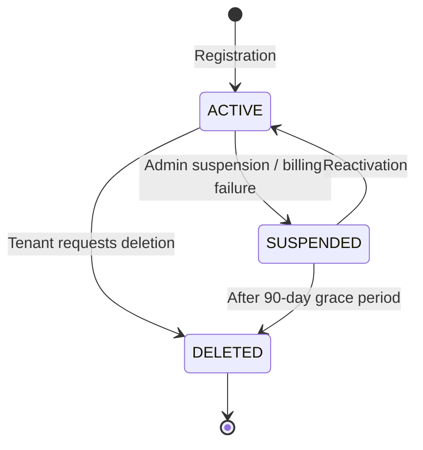

# Tenant Management — Multi-Tenant Architecture

## Overview

EventRelay is a multi-tenant platform where each tenant is an organization that sends events through the system. Tenants are isolated at the data layer (shared database, tenant-scoped queries), have independent configuration (rate limits, retry policies, payload size limits), and are identified via API keys.

This document covers tenant registration, configuration, data isolation, and the request-scoped tenant context propagation mechanism.

---

## Architecture Decisions

| Decision | Choice | Rationale |
|---|---|---|
| Tenancy model | Shared DB, shared schema | Simpler ops, lower cost. Isolation via `tenant_id` column + RLS. |
| Tenant ID format | ULID (prefixed `tnt_`) | Sortable, URL-safe, no coordination required. |
| Configuration storage | JSONB column | Flexible schema evolution without migrations. |
| Tenant context | `ThreadLocal` + request scope | Zero-allocation for synchronous Spring MVC request handling. |

---

## Database Schema

```sql
CREATE TABLE tenants (
    id              UUID PRIMARY KEY DEFAULT gen_random_uuid(),
    external_id     VARCHAR(50) NOT NULL UNIQUE,      -- e.g., "tnt_01H5KXZV..."
    name            VARCHAR(255) NOT NULL,
    contact_email   VARCHAR(255) NOT NULL,
    plan            VARCHAR(20) NOT NULL DEFAULT 'FREE',
    status          VARCHAR(20) NOT NULL DEFAULT 'ACTIVE',
    config          JSONB NOT NULL DEFAULT '{}',
    metadata        JSONB DEFAULT '{}',
    created_at      TIMESTAMP WITH TIME ZONE NOT NULL DEFAULT NOW(),
    updated_at      TIMESTAMP WITH TIME ZONE NOT NULL DEFAULT NOW(),
    suspended_at    TIMESTAMP WITH TIME ZONE,
    deleted_at      TIMESTAMP WITH TIME ZONE           -- Soft delete
);

CREATE INDEX idx_tenants_external_id ON tenants(external_id);
CREATE INDEX idx_tenants_status ON tenants(status);
CREATE INDEX idx_tenants_plan ON tenants(plan);

-- Row-Level Security (enforced at connection level)
ALTER TABLE tenants ENABLE ROW LEVEL SECURITY;

CREATE POLICY tenant_isolation_policy ON tenants
    USING (id = current_setting('app.current_tenant_id')::UUID);
```

### Tenant Status Lifecycle



| Status | API Access | Event Delivery | Data Retention |
|---|---|---|---|
| `ACTIVE` | Full access | Active | Indefinite |
| `SUSPENDED` | Read-only | Paused (queued) | 90 days |
| `DELETED` | Denied | Stopped | 30-day purge |

---

## Tenant Configuration (JSONB)

The `config` column stores tenant-specific settings as a JSONB document:

```json
{
  "rate_limit": {
    "max_events_per_second": 100,
    "burst_size": 150
  },
  "payload": {
    "max_size_bytes": 262144,
    "allowed_content_types": ["application/json"]
  },
  "retry_policy": {
    "max_attempts": 8,
    "backoff_base_seconds": 1,
    "backoff_multiplier": 5.0,
    "backoff_max_seconds": 3600,
    "jitter_enabled": true
  },
  "delivery": {
    "timeout_seconds": 30,
    "max_concurrent_deliveries": 50
  },
  "limits": {
    "max_subscriptions": 50,
    "max_event_types": 200,
    "max_api_keys": 5
  },
  "features": {
    "custom_retry_policy": true,
    "dlq_replay": true,
    "event_transformations": false
  }
}
```

### Default Configuration by Plan

| Setting | FREE | STARTER | BUSINESS | ENTERPRISE |
|---|---|---|---|---|
| `max_events_per_second` | 10 | 50 | 500 | 5000 |
| `burst_size` | 15 | 75 | 750 | 7500 |
| `max_payload_size_bytes` | 65,536 | 131,072 | 262,144 | 1,048,576 |
| `max_attempts` | 3 | 5 | 8 | 15 |
| `max_subscriptions` | 5 | 20 | 50 | 500 |
| `max_api_keys` | 1 | 3 | 5 | 20 |
| `timeout_seconds` | 10 | 15 | 30 | 60 |
| `custom_retry_policy` | ✗ | ✗ | ✓ | ✓ |
| `dlq_replay` | ✗ | ✓ | ✓ | ✓ |

---

## JPA Entity

```java
@Entity
@Table(name = "tenants")
@Getter @Setter @NoArgsConstructor
@SQLDelete(sql = "UPDATE tenants SET deleted_at = NOW() WHERE id = ?")
@Where(clause = "deleted_at IS NULL")
public class TenantEntity {

    @Id
    @GeneratedValue(strategy = GenerationType.UUID)
    private UUID id;

    @Column(name = "external_id", nullable = false, unique = true, length = 50)
    private String externalId;

    @Column(nullable = false, length = 255)
    private String name;

    @Column(name = "contact_email", nullable = false, length = 255)
    private String contactEmail;

    @Enumerated(EnumType.STRING)
    @Column(nullable = false, length = 20)
    private TenantPlan plan;

    @Enumerated(EnumType.STRING)
    @Column(nullable = false, length = 20)
    private TenantStatus status = TenantStatus.ACTIVE;

    @JdbcTypeCode(SqlTypes.JSON)
    @Column(columnDefinition = "jsonb", nullable = false)
    private TenantConfig config;

    @JdbcTypeCode(SqlTypes.JSON)
    @Column(columnDefinition = "jsonb")
    private Map<String, Object> metadata;

    @Column(name = "created_at", nullable = false, updatable = false)
    private Instant createdAt;

    @Column(name = "updated_at", nullable = false)
    private Instant updatedAt;

    @Column(name = "suspended_at")
    private Instant suspendedAt;

    @Column(name = "deleted_at")
    private Instant deletedAt;

    @PrePersist
    protected void onCreate() {
        createdAt = Instant.now();
        updatedAt = Instant.now();
        externalId = "tnt_" + ULID.random();
    }

    @PreUpdate
    protected void onUpdate() {
        updatedAt = Instant.now();
    }
}

public enum TenantPlan { FREE, STARTER, BUSINESS, ENTERPRISE }
public enum TenantStatus { ACTIVE, SUSPENDED, DELETED }
```

### Tenant Configuration Value Object

```java
@Data @NoArgsConstructor @AllArgsConstructor
public class TenantConfig {

    private RateLimitConfig rateLimit = new RateLimitConfig();
    private PayloadConfig payload = new PayloadConfig();
    private RetryPolicyConfig retryPolicy = new RetryPolicyConfig();
    private DeliveryConfig delivery = new DeliveryConfig();
    private LimitsConfig limits = new LimitsConfig();
    private FeaturesConfig features = new FeaturesConfig();

    @Data
    public static class RateLimitConfig {
        private int maxEventsPerSecond = 10;
        private int burstSize = 15;
    }

    @Data
    public static class PayloadConfig {
        private int maxSizeBytes = 65536;
        private List<String> allowedContentTypes = List.of("application/json");
    }

    @Data
    public static class RetryPolicyConfig {
        private int maxAttempts = 3;
        private int backoffBaseSeconds = 1;
        private double backoffMultiplier = 5.0;
        private int backoffMaxSeconds = 3600;
        private boolean jitterEnabled = true;
    }

    @Data
    public static class DeliveryConfig {
        private int timeoutSeconds = 10;
        private int maxConcurrentDeliveries = 10;
    }

    @Data
    public static class LimitsConfig {
        private int maxSubscriptions = 5;
        private int maxEventTypes = 200;
        private int maxApiKeys = 1;
    }

    @Data
    public static class FeaturesConfig {
        private boolean customRetryPolicy = false;
        private boolean dlqReplay = false;
        private boolean eventTransformations = false;
    }
}
```

---

## Tenant Service Layer

```java
@Service
@RequiredArgsConstructor
@Transactional
@Slf4j
public class TenantService {

    private final TenantRepository tenantRepository;
    private final ApiKeyGenerator apiKeyGenerator;
    private final ApiKeyRepository apiKeyRepository;
    private final TenantConfigDefaults configDefaults;

    public TenantRegistrationResponse register(TenantRegistrationRequest request) {
        // 1. Create tenant entity
        TenantEntity tenant = new TenantEntity();
        tenant.setName(request.name());
        tenant.setContactEmail(request.contactEmail());
        tenant.setPlan(request.plan());

        // 2. Merge request config with plan defaults
        TenantConfig config = configDefaults.mergeWithDefaults(
            request.config(), request.plan()
        );
        tenant.setConfig(config);

        tenant = tenantRepository.save(tenant);
        log.info("Tenant registered: id={}, name={}, plan={}",
            tenant.getExternalId(), tenant.getName(), tenant.getPlan());

        // 3. Generate initial API key
        GeneratedApiKey apiKey = apiKeyGenerator.generate(
            ApiKeyEnvironment.LIVE, ApiKeyType.SECRET
        );

        ApiKeyEntity keyEntity = new ApiKeyEntity();
        keyEntity.setTenantId(tenant.getId());
        keyEntity.setKeyHash(apiKey.hash());
        keyEntity.setKeyPrefix(apiKey.prefix());
        keyEntity.setEnvironment(ApiKeyEnvironment.LIVE);
        keyEntity.setKeyType(ApiKeyType.SECRET);
        keyEntity.setScopes(new String[]{"events:write", "events:read",
            "subscriptions:write", "subscriptions:read"});
        keyEntity.setName("Default API Key");
        keyEntity.setCreatedAt(Instant.now());

        apiKeyRepository.save(keyEntity);

        // 4. Return response (with plaintext key — shown ONCE)
        return new TenantRegistrationResponse(
            tenant.getExternalId(),
            tenant.getName(),
            tenant.getPlan(),
            apiKey.plaintext(),   // One-time display
            apiKey.prefix(),
            tenant.getCreatedAt()
        );
    }

    @Transactional(readOnly = true)
    public TenantDetailResponse getTenantDetail(String externalId) {
        TenantEntity tenant = tenantRepository.findByExternalId(externalId)
            .orElseThrow(() -> new ResourceNotFoundException("Tenant not found: " + externalId));

        return TenantDetailResponse.from(tenant);
    }

    public void suspendTenant(String externalId, String reason) {
        TenantEntity tenant = tenantRepository.findByExternalId(externalId)
            .orElseThrow(() -> new ResourceNotFoundException("Tenant not found: " + externalId));

        tenant.setStatus(TenantStatus.SUSPENDED);
        tenant.setSuspendedAt(Instant.now());
        tenantRepository.save(tenant);

        log.warn("Tenant suspended: id={}, reason={}", externalId, reason);
    }
}
```

---

## Tenant Context Propagation

The tenant context is resolved from the API key during authentication and propagated through the request lifecycle via a `ThreadLocal`-backed holder.

### TenantContext

```java
@Component
@RequestScope
public class TenantContext {

    private String currentTenantId;
    private ApiKeyEnvironment environment;
    private TenantConfig config;

    public void setCurrentTenantId(String tenantId) {
        this.currentTenantId = tenantId;
    }

    public String getCurrentTenantId() {
        if (currentTenantId == null) {
            throw new IllegalStateException("Tenant context not initialized");
        }
        return currentTenantId;
    }

    public void setEnvironment(ApiKeyEnvironment environment) {
        this.environment = environment;
    }

    public ApiKeyEnvironment getEnvironment() {
        return environment;
    }

    public void setConfig(TenantConfig config) {
        this.config = config;
    }

    public TenantConfig getConfig() {
        return config;
    }

    public void clear() {
        this.currentTenantId = null;
        this.environment = null;
        this.config = null;
    }
}
```

### ThreadLocal Holder (for async/non-request contexts)

```java
public final class TenantContextHolder {

    private static final ThreadLocal<TenantInfo> CONTEXT = new ThreadLocal<>();

    private TenantContextHolder() {}

    public static void set(TenantInfo tenantInfo) {
        CONTEXT.set(tenantInfo);
    }

    public static TenantInfo get() {
        TenantInfo info = CONTEXT.get();
        if (info == null) {
            throw new IllegalStateException("No tenant context bound to current thread");
        }
        return info;
    }

    public static Optional<TenantInfo> tryGet() {
        return Optional.ofNullable(CONTEXT.get());
    }

    public static void clear() {
        CONTEXT.remove();
    }

    public record TenantInfo(
        String tenantId,
        ApiKeyEnvironment environment,
        TenantConfig config
    ) {}
}
```

### Propagation to Async Tasks

When dispatching work to thread pools or SQS, the tenant context must be explicitly propagated:

```java
@Component
public class TenantAwareTaskDecorator implements TaskDecorator {

    @Override
    public Runnable decorate(Runnable runnable) {
        // Capture context from the calling thread
        TenantContextHolder.TenantInfo tenantInfo = TenantContextHolder.get();
        String requestId = RequestContext.getRequestId();

        return () -> {
            try {
                TenantContextHolder.set(tenantInfo);
                RequestContext.setRequestId(requestId);
                MDC.put("tenantId", tenantInfo.tenantId());
                MDC.put("requestId", requestId);
                runnable.run();
            } finally {
                TenantContextHolder.clear();
                RequestContext.clear();
                MDC.clear();
            }
        };
    }
}

@Configuration
public class AsyncConfig {

    @Bean
    public TaskExecutor taskExecutor(TenantAwareTaskDecorator decorator) {
        ThreadPoolTaskExecutor executor = new ThreadPoolTaskExecutor();
        executor.setCorePoolSize(10);
        executor.setMaxPoolSize(50);
        executor.setQueueCapacity(100);
        executor.setThreadNamePrefix("async-");
        executor.setTaskDecorator(decorator);
        executor.initialize();
        return executor;
    }
}
```

---

## Tenant Data Isolation

### Query-Level Isolation

All repositories enforce tenant scoping:

```java
public interface EventRepository extends JpaRepository<EventEntity, UUID> {

    @Query("SELECT e FROM EventEntity e WHERE e.tenantId = :tenantId AND e.externalId = :eventId")
    Optional<EventEntity> findByTenantAndExternalId(
        @Param("tenantId") UUID tenantId,
        @Param("eventId") String eventId
    );

    @Query("SELECT e FROM EventEntity e WHERE e.tenantId = :tenantId ORDER BY e.createdAt DESC")
    Page<EventEntity> findByTenantId(@Param("tenantId") UUID tenantId, Pageable pageable);
}
```

### Hibernate Filter (Automatic Tenant Scoping)

```java
@FilterDef(name = "tenantFilter",
    parameters = @ParamDef(name = "tenantId", type = UUID.class))
@Filter(name = "tenantFilter", condition = "tenant_id = :tenantId")
@Entity
@Table(name = "events")
public class EventEntity {
    // ... fields
}

@Component
@RequiredArgsConstructor
public class TenantFilterAspect {

    private final EntityManager entityManager;
    private final TenantContext tenantContext;

    @Before("execution(* com.eventrelay.repository.*.*(..))")
    public void enableTenantFilter() {
        Session session = entityManager.unwrap(Session.class);
        session.enableFilter("tenantFilter")
            .setParameter("tenantId", UUID.fromString(tenantContext.getCurrentTenantId()));
    }
}
```

---

## Tenant Configuration Caching

Tenant configs are hot data — fetched on every request. We cache them in Redis:

```java
@Service
@RequiredArgsConstructor
public class TenantConfigService {

    private final TenantRepository tenantRepository;
    private final RedisTemplate<String, String> redisTemplate;
    private final ObjectMapper objectMapper;

    private static final String CACHE_PREFIX = "tenant_config:";
    private static final Duration CACHE_TTL = Duration.ofMinutes(10);

    public TenantConfig getConfig(String tenantId) {
        String cacheKey = CACHE_PREFIX + tenantId;

        // 1. Check cache
        String cached = redisTemplate.opsForValue().get(cacheKey);
        if (cached != null) {
            return deserialize(cached);
        }

        // 2. Load from DB
        TenantEntity tenant = tenantRepository.findByExternalId(tenantId)
            .orElseThrow(() -> new ResourceNotFoundException("Tenant not found"));

        TenantConfig config = tenant.getConfig();

        // 3. Cache
        redisTemplate.opsForValue().set(cacheKey, serialize(config), CACHE_TTL);

        return config;
    }

    public void invalidateCache(String tenantId) {
        redisTemplate.delete(CACHE_PREFIX + tenantId);
    }
}
```

---

## Tenant Repository

```java
public interface TenantRepository extends JpaRepository<TenantEntity, UUID> {

    Optional<TenantEntity> findByExternalId(String externalId);

    @Query("SELECT t FROM TenantEntity t WHERE t.status = :status")
    List<TenantEntity> findByStatus(@Param("status") TenantStatus status);

    @Modifying
    @Query("UPDATE TenantEntity t SET t.status = 'DELETED', t.deletedAt = NOW() " +
           "WHERE t.status = 'SUSPENDED' AND t.suspendedAt < :cutoff")
    int purgeExpiredSuspensions(@Param("cutoff") Instant cutoff);
}
```

---

## Production Considerations

1. **Tenant quotas** — Enforce subscription and event-type limits at the service layer, not just the DB. Return `422 Unprocessable Entity` when limits are hit.
2. **Configuration hot-reload** — Use a Redis pub/sub channel to notify instances when tenant config changes, triggering cache invalidation.
3. **Tenant onboarding webhook** — Emit a `tenant.registered` event internally to trigger welcome emails, Slack alerts, etc.
4. **Metrics per tenant** — Tag all Prometheus metrics with `tenant_id` (use a cardinality-safe label strategy — top-N tenants by volume, aggregate the rest as `other`).
5. **Data residency** — For Enterprise tenants, support region-pinned data storage. Store `data_region` in tenant config and route queries accordingly.
6. **Soft delete** — Never hard-delete tenants. The `@SQLDelete` annotation ensures all deletions are soft. A background job purges data after the retention period.

---

## Cross-References

- [Authentication](./Authentication.md) — API key creation during tenant registration
- [REST API](./REST_API.md) — Tenant management endpoints
- [Event Validation](./Event_Validation.md) — Tenant-specific validation rules (payload size, event types)
