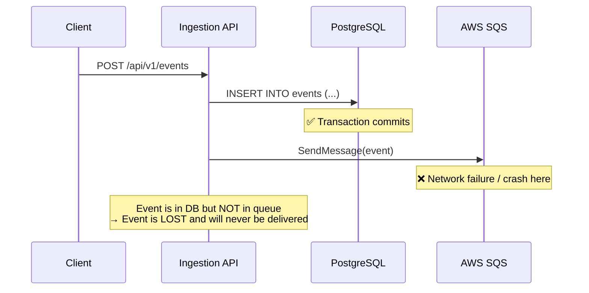
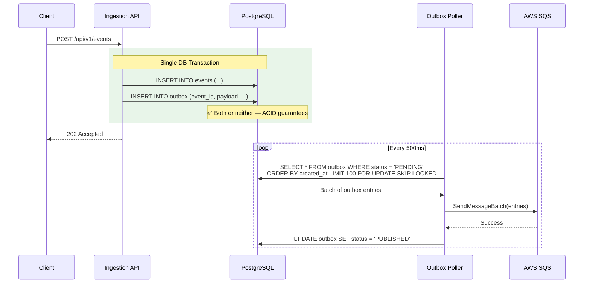
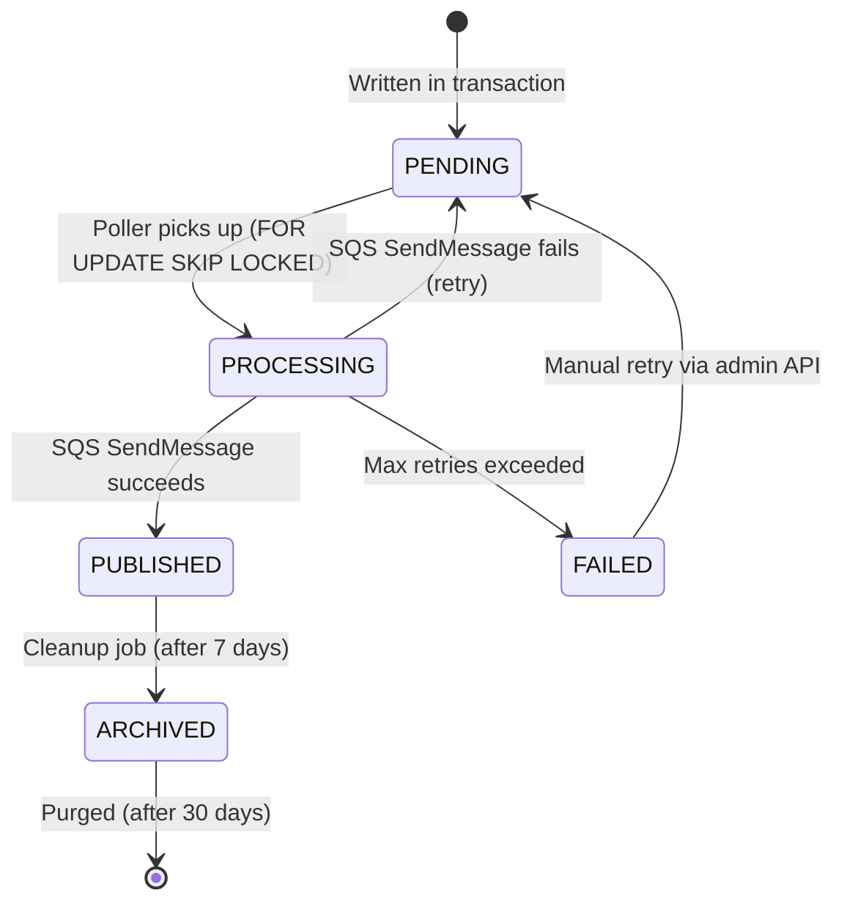
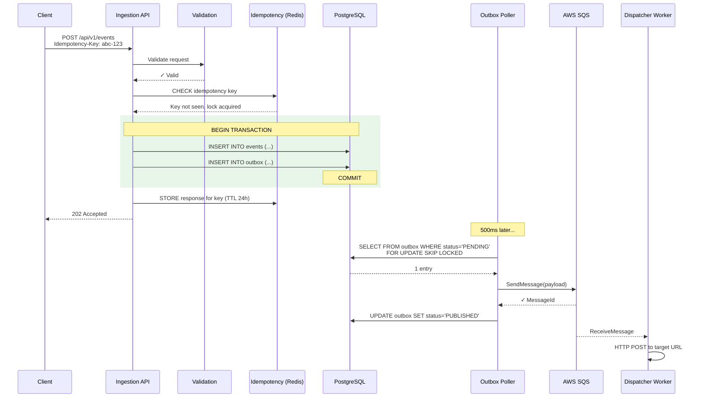

# Transactional Outbox Pattern — Deep Dive

## Overview

The transactional outbox pattern is the **most critical architectural pattern** in EventRelay. It solves the dual-write problem — ensuring that when an event is accepted via the API, it is **guaranteed** to be dispatched to SQS for delivery, even if the application crashes between writing to the database and publishing to the queue.

Without this pattern, you face two unacceptable failure modes:
1. **Write to DB, fail to publish** → Event accepted but never delivered (silent data loss)
2. **Publish to queue, fail to commit DB** → Event delivered but no record exists (phantom delivery)

The outbox pattern eliminates both by making the event write and the "intent to publish" a single atomic database transaction.

> [!IMPORTANT]
> This pattern is used by **Stripe**, **Shopify**, and **Debezium** in production at massive scale. It is the industry-standard approach for reliable event publishing from a transactional database.

---

## The Dual-Write Problem



### Why can't we just retry?

| Approach | Problem |
|---|---|
| Publish first, then DB | If DB commit fails, event was delivered but has no record |
| DB first, then publish | If publish fails, event is recorded but never delivered |
| DB + publish in same "transaction" | SQS is not a transactional resource — no 2PC support |
| Retry on failure | Process crash between DB commit and publish = no retry code runs |

---

## The Solution: Transactional Outbox



### Key Insight

The outbox table acts as a **local message queue within the database**. Since both the event record and the outbox entry are written in the same transaction, they share ACID guarantees. A separate poller process reads from the outbox and publishes to SQS asynchronously.

---

## Database Schema

### Events Table

```sql
CREATE TABLE events (
    id              UUID PRIMARY KEY DEFAULT gen_random_uuid(),
    tenant_id       UUID NOT NULL REFERENCES tenants(id),
    external_id     VARCHAR(50) NOT NULL UNIQUE,       -- e.g., "evt_01H5KX..."
    event_type      VARCHAR(255) NOT NULL,
    payload         JSONB NOT NULL,
    metadata        JSONB DEFAULT '{}',
    idempotency_key VARCHAR(64),
    status          VARCHAR(20) NOT NULL DEFAULT 'PENDING',
    created_at      TIMESTAMP WITH TIME ZONE NOT NULL DEFAULT NOW(),

    CONSTRAINT uq_tenant_idempotency UNIQUE (tenant_id, idempotency_key)
);

CREATE INDEX idx_events_tenant_id ON events(tenant_id);
CREATE INDEX idx_events_external_id ON events(external_id);
CREATE INDEX idx_events_status ON events(status);
CREATE INDEX idx_events_created_at ON events(created_at);
CREATE INDEX idx_events_type_tenant ON events(event_type, tenant_id);
```

### Outbox Table

```sql
CREATE TABLE outbox (
    id              BIGSERIAL PRIMARY KEY,
    aggregate_type  VARCHAR(50) NOT NULL DEFAULT 'event',
    aggregate_id    UUID NOT NULL,                     -- References events.id
    event_type      VARCHAR(255) NOT NULL,
    tenant_id       UUID NOT NULL,
    payload         JSONB NOT NULL,                    -- Full message payload for SQS
    status          VARCHAR(20) NOT NULL DEFAULT 'PENDING',
    retry_count     INT NOT NULL DEFAULT 0,
    max_retries     INT NOT NULL DEFAULT 5,
    last_error      TEXT,
    published_at    TIMESTAMP WITH TIME ZONE,
    created_at      TIMESTAMP WITH TIME ZONE NOT NULL DEFAULT NOW(),
    processed_at    TIMESTAMP WITH TIME ZONE,
    locked_until    TIMESTAMP WITH TIME ZONE           -- For pessimistic polling lock
);

-- Critical index: the poller query uses this
CREATE INDEX idx_outbox_status_created ON outbox(status, created_at)
    WHERE status = 'PENDING';

-- For cleanup queries
CREATE INDEX idx_outbox_published_at ON outbox(published_at)
    WHERE status = 'PUBLISHED';

-- For monitoring stuck entries
CREATE INDEX idx_outbox_locked_until ON outbox(locked_until)
    WHERE status = 'PROCESSING';
```

### Outbox Entry Lifecycle



| Status | Description |
|---|---|
| `PENDING` | Awaiting pickup by poller |
| `PROCESSING` | Locked by a poller instance, attempting SQS publish |
| `PUBLISHED` | Successfully sent to SQS |
| `FAILED` | Exceeded max retries, requires manual intervention |
| `ARCHIVED` | Moved to archive table, pending purge |

---

## Outbox Writer (Ingestion Path)

The outbox writer executes within the same `@Transactional` boundary as the event write:

```java
@Service
@RequiredArgsConstructor
@Slf4j
public class EventIngestionService {

    private final EventRepository eventRepository;
    private final OutboxRepository outboxRepository;
    private final EventValidationService validationService;
    private final IdempotencyService idempotencyService;
    private final SubscriptionMatcherService subscriptionMatcher;
    private final ObjectMapper objectMapper;
    private final MeterRegistry meterRegistry;

    @Transactional
    public EventSubmissionResponse ingest(String tenantId,
                                           EventSubmissionRequest request,
                                           String idempotencyKey) {
        Timer.Sample timer = Timer.start(meterRegistry);

        // 1. Validate the event
        validationService.validate(tenantId, request, idempotencyKey);

        // 2. Check idempotency (returns cached response if duplicate)
        Optional<EventSubmissionResponse> cached =
            idempotencyService.checkAndLock(tenantId, idempotencyKey);
        if (cached.isPresent()) {
            return cached.get();
        }

        try {
            // 3. Create event entity
            EventEntity event = new EventEntity();
            event.setTenantId(UUID.fromString(tenantId));
            event.setEventType(request.eventType());
            event.setPayload(request.payload());
            event.setMetadata(request.metadata());
            event.setIdempotencyKey(idempotencyKey);
            event.setStatus(EventStatus.PENDING);
            event = eventRepository.save(event);

            // 4. Find matching subscriptions
            List<SubscriptionEntity> matchingSubs =
                subscriptionMatcher.findMatches(tenantId, request.eventType());

            // 5. Write outbox entry for EACH matching subscription
            for (SubscriptionEntity sub : matchingSubs) {
                OutboxEntry outboxEntry = createOutboxEntry(event, sub, tenantId);
                outboxRepository.save(outboxEntry);
            }

            // 6. Build response
            EventSubmissionResponse response = new EventSubmissionResponse(
                event.getExternalId(),
                event.getEventType(),
                event.getStatus(),
                event.getCreatedAt(),
                idempotencyKey
            );

            // 7. Store response for idempotency
            idempotencyService.storeResponse(tenantId, idempotencyKey, response);

            timer.stop(meterRegistry.timer("eventrelay.ingestion.duration",
                "tenant_id", tenantId, "event_type", request.eventType()));

            log.info("Event ingested: eventId={}, type={}, subscriptions={}",
                event.getExternalId(), request.eventType(), matchingSubs.size());

            return response;

        } catch (Exception e) {
            idempotencyService.releaseLock(tenantId, idempotencyKey);
            throw e;
        }
    }

    private OutboxEntry createOutboxEntry(EventEntity event,
                                           SubscriptionEntity subscription,
                                           String tenantId) {
        // Build the SQS message payload
        OutboxMessagePayload messagePayload = new OutboxMessagePayload(
            event.getExternalId(),
            event.getEventType(),
            tenantId,
            subscription.getExternalId(),
            subscription.getTargetUrl(),
            subscription.getSigningSecret(),
            event.getPayload(),
            event.getMetadata(),
            event.getCreatedAt()
        );

        OutboxEntry entry = new OutboxEntry();
        entry.setAggregateType("event");
        entry.setAggregateId(event.getId());
        entry.setEventType(event.getEventType());
        entry.setTenantId(UUID.fromString(tenantId));
        entry.setPayload(objectMapper.valueToTree(messagePayload));
        entry.setStatus(OutboxStatus.PENDING);
        entry.setRetryCount(0);
        entry.setMaxRetries(5);

        return entry;
    }
}
```

### Outbox Message Payload

The payload stored in the outbox contains everything the dispatcher needs:

```java
public record OutboxMessagePayload(
    String eventId,
    String eventType,
    String tenantId,
    String subscriptionId,
    String targetUrl,
    String signingSecret,
    Map<String, Object> payload,
    Map<String, String> metadata,
    Instant createdAt
) {}
```

---

## Outbox Poller Service

The poller runs as a scheduled task, picking up pending outbox entries and publishing them to SQS.

### Poller Implementation

```java
@Service
@RequiredArgsConstructor
@Slf4j
public class OutboxPollerService {

    private final OutboxRepository outboxRepository;
    private final SqsPublisher sqsPublisher;
    private final MeterRegistry meterRegistry;
    private final ObjectMapper objectMapper;

    private static final int BATCH_SIZE = 100;
    private static final int MAX_RETRIES = 5;

    /**
     * Polls the outbox table for pending entries and publishes them to SQS.
     * Uses SELECT ... FOR UPDATE SKIP LOCKED for concurrent poller instances.
     */
    @Scheduled(fixedDelay = 500, timeUnit = TimeUnit.MILLISECONDS)
    @Transactional
    public void poll() {
        List<OutboxEntry> entries = outboxRepository.findPendingEntries(BATCH_SIZE);

        if (entries.isEmpty()) {
            return;
        }

        log.debug("Outbox poller picked up {} entries", entries.size());

        // Group by tenant for potential batching optimizations
        Map<UUID, List<OutboxEntry>> byTenant = entries.stream()
            .collect(Collectors.groupingBy(OutboxEntry::getTenantId));

        int published = 0;
        int failed = 0;

        for (OutboxEntry entry : entries) {
            try {
                publishToSqs(entry);
                entry.setStatus(OutboxStatus.PUBLISHED);
                entry.setPublishedAt(Instant.now());
                entry.setProcessedAt(Instant.now());
                published++;
            } catch (Exception e) {
                entry.setRetryCount(entry.getRetryCount() + 1);
                entry.setLastError(truncate(e.getMessage(), 500));

                if (entry.getRetryCount() >= entry.getMaxRetries()) {
                    entry.setStatus(OutboxStatus.FAILED);
                    log.error("Outbox entry {} permanently failed after {} retries",
                        entry.getId(), entry.getRetryCount(), e);
                    meterRegistry.counter("eventrelay.outbox.permanent_failures").increment();
                } else {
                    entry.setStatus(OutboxStatus.PENDING);
                    log.warn("Outbox entry {} failed (attempt {}/{}): {}",
                        entry.getId(), entry.getRetryCount(), entry.getMaxRetries(),
                        e.getMessage());
                }
                failed++;
            }

            outboxRepository.save(entry);
        }

        // Metrics
        meterRegistry.counter("eventrelay.outbox.published").increment(published);
        meterRegistry.counter("eventrelay.outbox.failed").increment(failed);
        meterRegistry.gauge("eventrelay.outbox.batch_size", entries.size());
    }

    private void publishToSqs(OutboxEntry entry) {
        String messageBody = objectMapper.writeValueAsString(entry.getPayload());

        sqsPublisher.publish(
            messageBody,
            Map.of(
                "tenantId", entry.getTenantId().toString(),
                "eventType", entry.getEventType(),
                "aggregateId", entry.getAggregateId().toString()
            ),
            // Use aggregate_id as dedup ID for SQS FIFO (if using FIFO)
            entry.getAggregateId().toString()
        );
    }
}
```

### Repository with `FOR UPDATE SKIP LOCKED`

```java
public interface OutboxRepository extends JpaRepository<OutboxEntry, Long> {

    @Query(value = """
        SELECT * FROM outbox
        WHERE status = 'PENDING'
          AND (locked_until IS NULL OR locked_until < NOW())
        ORDER BY created_at ASC
        LIMIT :batchSize
        FOR UPDATE SKIP LOCKED
        """, nativeQuery = true)
    List<OutboxEntry> findPendingEntries(@Param("batchSize") int batchSize);

    @Query("SELECT COUNT(o) FROM OutboxEntry o WHERE o.status = 'PENDING'")
    long countPending();

    @Query("SELECT COUNT(o) FROM OutboxEntry o WHERE o.status = 'FAILED'")
    long countFailed();

    @Modifying
    @Query(value = """
        DELETE FROM outbox
        WHERE status = 'PUBLISHED'
          AND published_at < :cutoff
        """, nativeQuery = true)
    int cleanupPublished(@Param("cutoff") Instant cutoff);
}
```

> [!TIP]
> `FOR UPDATE SKIP LOCKED` is the secret sauce for horizontally scalable polling. Multiple poller instances can run concurrently — each one locks a different set of rows, with no contention or double-processing. This is a PostgreSQL feature specifically designed for work-queue patterns.

---

## SQS Publisher

```java
@Component
@RequiredArgsConstructor
@Slf4j
public class SqsPublisher {

    private final SqsClient sqsClient;

    @Value("${eventrelay.sqs.queue-url}")
    private String queueUrl;

    public void publish(String messageBody, Map<String, String> attributes,
                         String deduplicationId) {
        Map<String, MessageAttributeValue> messageAttributes = attributes.entrySet().stream()
            .collect(Collectors.toMap(
                Map.Entry::getKey,
                e -> MessageAttributeValue.builder()
                    .dataType("String")
                    .stringValue(e.getValue())
                    .build()
            ));

        SendMessageRequest request = SendMessageRequest.builder()
            .queueUrl(queueUrl)
            .messageBody(messageBody)
            .messageAttributes(messageAttributes)
            .messageGroupId(attributes.get("tenantId")) // FIFO ordering per tenant
            .messageDeduplicationId(deduplicationId)
            .build();

        SendMessageResponse response = sqsClient.sendMessage(request);

        log.debug("Published to SQS: messageId={}, dedup={}",
            response.messageId(), deduplicationId);
    }
}
```

---

## Polling vs. Change Data Capture (CDC)

| Aspect | Polling | CDC (Debezium) |
|---|---|---|
| Latency | 100-500ms (poll interval) | 10-50ms (near real-time) |
| Complexity | Simple (scheduled task) | High (Kafka Connect, Debezium, connectors) |
| Scalability | Good with `SKIP LOCKED` | Excellent (single-threaded, log-based) |
| Infrastructure | No additional systems | Requires Kafka + Debezium |
| Ordering | Best-effort per tenant | Strict WAL ordering |
| Operational burden | Low | Medium-High |
| Recommended for | < 10K events/sec | > 10K events/sec |

### EventRelay's Choice: Polling (Phase 1) → CDC (Phase 2)

We start with polling for simplicity. The architecture allows a future migration to CDC by:
1. Deploying Debezium to read the WAL for the outbox table
2. Routing changes to a Kafka topic
3. Replacing the poller with a Kafka consumer that publishes to SQS

The outbox table schema is CDC-friendly by design — it has a monotonically increasing `id` (BIGSERIAL) and a clear `status` column for tracking.

---

## Message Ordering

### Per-Tenant Ordering

Events within a single tenant are ordered by `outbox.created_at` (which reflects insertion order due to BIGSERIAL `id`). Using SQS FIFO with `messageGroupId = tenantId` preserves this ordering per tenant.

### Cross-Tenant Independence

Events from different tenants are fully independent and can be processed in any order. SQS FIFO's message group concept ensures tenant-level ordering without global serialization.

```
Tenant A: event1 → event2 → event3  (ordered within group)
Tenant B: event4 → event5           (ordered within group)
                                     (A and B groups are independent)
```

---

## Outbox Cleanup & Archival

Published outbox entries must be cleaned up to prevent unbounded table growth.

### Cleanup Job

```java
@Service
@RequiredArgsConstructor
@Slf4j
public class OutboxCleanupService {

    private final OutboxRepository outboxRepository;
    private final OutboxArchiveRepository archiveRepository;
    private final MeterRegistry meterRegistry;

    /**
     * Runs daily. Archives published entries older than 7 days,
     * then purges archive entries older than 30 days.
     */
    @Scheduled(cron = "0 0 3 * * *") // 3 AM daily
    @Transactional
    public void cleanup() {
        Instant archiveCutoff = Instant.now().minus(Duration.ofDays(7));
        Instant purgeCutoff = Instant.now().minus(Duration.ofDays(30));

        // 1. Archive published entries
        int archived = archivePublishedEntries(archiveCutoff);
        log.info("Archived {} outbox entries older than {}", archived, archiveCutoff);

        // 2. Purge old archives
        int purged = archiveRepository.deleteOlderThan(purgeCutoff);
        log.info("Purged {} archived entries older than {}", purged, purgeCutoff);

        // 3. Alert on stuck entries
        long failedCount = outboxRepository.countFailed();
        if (failedCount > 0) {
            log.warn("Found {} FAILED outbox entries requiring manual review", failedCount);
            meterRegistry.gauge("eventrelay.outbox.failed_count", failedCount);
        }

        long pendingCount = outboxRepository.countPending();
        meterRegistry.gauge("eventrelay.outbox.pending_count", pendingCount);
    }

    private int archivePublishedEntries(Instant cutoff) {
        // Move to archive table, then delete from outbox
        // Done in batches of 1000 to avoid long transactions
        int totalArchived = 0;
        int batchArchived;
        do {
            batchArchived = outboxRepository.archiveAndDelete(cutoff, 1000);
            totalArchived += batchArchived;
        } while (batchArchived == 1000);
        return totalArchived;
    }
}
```

### Archive Table

```sql
CREATE TABLE outbox_archive (
    id              BIGINT PRIMARY KEY,
    aggregate_type  VARCHAR(50) NOT NULL,
    aggregate_id    UUID NOT NULL,
    event_type      VARCHAR(255) NOT NULL,
    tenant_id       UUID NOT NULL,
    payload         JSONB NOT NULL,
    status          VARCHAR(20) NOT NULL,
    retry_count     INT NOT NULL,
    published_at    TIMESTAMP WITH TIME ZONE,
    created_at      TIMESTAMP WITH TIME ZONE NOT NULL,
    archived_at     TIMESTAMP WITH TIME ZONE NOT NULL DEFAULT NOW()
);

CREATE INDEX idx_outbox_archive_archived_at ON outbox_archive(archived_at);
```

---

## Outbox Entity

```java
@Entity
@Table(name = "outbox")
@Getter @Setter @NoArgsConstructor
public class OutboxEntry {

    @Id
    @GeneratedValue(strategy = GenerationType.IDENTITY)
    private Long id;

    @Column(name = "aggregate_type", nullable = false, length = 50)
    private String aggregateType;

    @Column(name = "aggregate_id", nullable = false)
    private UUID aggregateId;

    @Column(name = "event_type", nullable = false, length = 255)
    private String eventType;

    @Column(name = "tenant_id", nullable = false)
    private UUID tenantId;

    @JdbcTypeCode(SqlTypes.JSON)
    @Column(columnDefinition = "jsonb", nullable = false)
    private JsonNode payload;

    @Enumerated(EnumType.STRING)
    @Column(nullable = false, length = 20)
    private OutboxStatus status = OutboxStatus.PENDING;

    @Column(name = "retry_count", nullable = false)
    private int retryCount = 0;

    @Column(name = "max_retries", nullable = false)
    private int maxRetries = 5;

    @Column(name = "last_error", columnDefinition = "TEXT")
    private String lastError;

    @Column(name = "published_at")
    private Instant publishedAt;

    @Column(name = "created_at", nullable = false, updatable = false)
    private Instant createdAt;

    @Column(name = "processed_at")
    private Instant processedAt;

    @Column(name = "locked_until")
    private Instant lockedUntil;

    @PrePersist
    protected void onCreate() {
        createdAt = Instant.now();
    }
}

public enum OutboxStatus {
    PENDING, PROCESSING, PUBLISHED, FAILED, ARCHIVED
}
```

---

## Monitoring & Alerting

### Key Metrics

| Metric | Type | Alert Threshold |
|---|---|---|
| `eventrelay.outbox.pending_count` | Gauge | > 1000 for > 5 minutes |
| `eventrelay.outbox.published` | Counter | Rate drop > 50% (anomaly) |
| `eventrelay.outbox.permanent_failures` | Counter | Any increment |
| `eventrelay.outbox.failed_count` | Gauge | > 0 |
| `eventrelay.outbox.poll_duration_ms` | Timer | p99 > 1000ms |
| `eventrelay.outbox.lag_seconds` | Gauge | > 10s |

### Outbox Lag Calculation

```java
@Scheduled(fixedRate = 10, timeUnit = TimeUnit.SECONDS)
public void calculateOutboxLag() {
    Instant oldestPending = outboxRepository.findOldestPendingTimestamp();
    if (oldestPending != null) {
        double lagSeconds = Duration.between(oldestPending, Instant.now()).toMillis() / 1000.0;
        meterRegistry.gauge("eventrelay.outbox.lag_seconds", lagSeconds);
    }
}
```

---

## End-to-End Sequence



---

## Production Considerations

1. **Poller instance count** — Run 2-3 poller instances for redundancy. `SKIP LOCKED` ensures no contention. Scale horizontally as throughput grows.
2. **Batch publishing** — Use SQS `SendMessageBatch` (up to 10 messages) to reduce API calls. Group entries by tenant for FIFO ordering.
3. **Outbox table partitioning** — For very high throughput (>100K events/day), partition the outbox table by `created_at` (range partitioning, daily). This makes cleanup efficient (`DROP PARTITION` vs `DELETE`).
4. **Connection pool sizing** — Each poller instance holds a DB connection during polling. Size HikariCP accordingly: `pollerInstances * 2 + apiServerThreads`.
5. **Graceful shutdown** — On SIGTERM, the poller should finish processing its current batch before exiting. Use `@PreDestroy` to set a shutdown flag.
6. **Idempotent publish** — SQS FIFO's `messageDeduplicationId` ensures that if the poller crashes after `SendMessage` but before updating the outbox status, the re-poll + re-publish won't create a duplicate message.
7. **Dead letter monitoring** — Set up PagerDuty/Slack alerts for any `FAILED` outbox entries. These represent events that were accepted but cannot be published.
8. **Backpressure** — If the outbox pending count grows beyond a threshold, consider applying backpressure to the ingestion API (return `503` or slow down responses).

---

## Cross-References

- [REST API](./REST_API.md) — The ingestion endpoint that triggers outbox writes
- [Event Validation](./Event_Validation.md) — Validation that runs before outbox write
- [Idempotency](./Idempotency.md) — Idempotency checks in the ingestion flow
- [Subscription Management](./Subscription_Management.md) — How matching subscriptions are found
