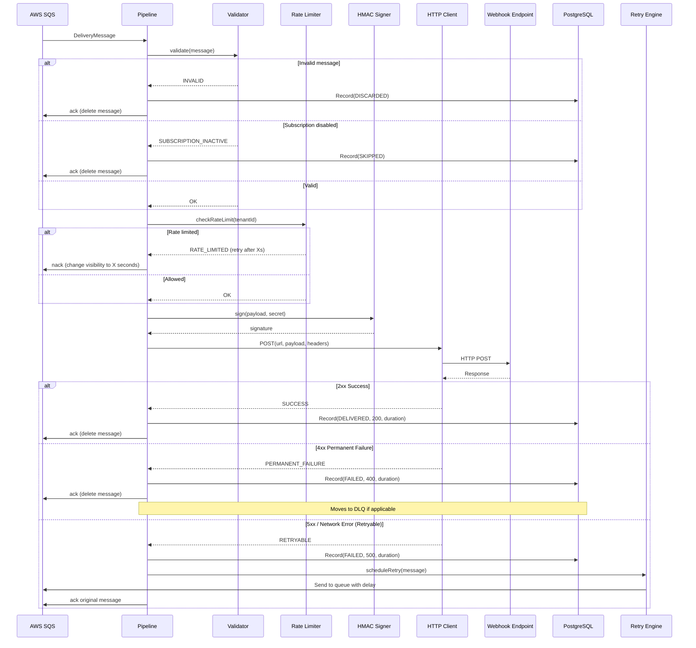

# Delivery Pipeline

## Overview

The delivery pipeline defines the ordered sequence of stages every webhook event passes through from SQS dequeue to final acknowledgment. Each stage is a discrete, testable unit with well-defined inputs, outputs, and failure modes. The pipeline is implemented using a chain-of-responsibility pattern, enabling stages to be added, removed, or reordered without modifying the overall orchestration.

---

## Pipeline Stages

```
┌──────────┐    ┌──────────┐    ┌───────────┐    ┌──────────┐    ┌──────────┐    ┌──────────┐    ┌──────────┐
│ DEQUEUE  │───▶│ VALIDATE │───▶│RATE CHECK │───▶│   SIGN   │───▶│ DELIVER  │───▶│  RECORD  │───▶│ ACK/NACK │
└──────────┘    └──────────┘    └───────────┘    └──────────┘    └──────────┘    └──────────┘    └──────────┘
```

| Stage | Purpose | Failure Action |
|-------|---------|----------------|
| **Dequeue** | Receive message from SQS | N/A (handled by dispatcher) |
| **Validate** | Verify message integrity and subscription status | Ack + discard |
| **Rate Check** | Enforce per-tenant rate limits via Redis | Nack (requeue with delay) |
| **Sign** | Compute HMAC-SHA256 signature | Fail + alert (signing key issue) |
| **Deliver** | HTTP POST to target URL | Classify (retry / permanent fail) |
| **Record** | Persist delivery result to PostgreSQL | Log + retry record later |
| **Ack/Nack** | Acknowledge or requeue SQS message | Log (SQS visibility timeout handles it) |

---

## Sequence Diagram



---

## Pipeline Orchestrator

```java
package com.eventrelay.dispatch.pipeline;

import com.eventrelay.dispatch.http.DeliveryResult;
import com.eventrelay.dispatch.http.ResponseClassification;
import com.eventrelay.dispatch.http.WebhookDeliveryService;
import com.eventrelay.dispatch.recording.DeliveryRecorder;
import com.eventrelay.dispatch.retry.RetryScheduler;
import com.eventrelay.dispatch.signing.HmacSigner;
import com.eventrelay.dispatch.validation.MessageValidator;
import com.eventrelay.dispatch.validation.ValidationResult;
import com.eventrelay.queue.SqsMessageConsumer;
import com.eventrelay.queue.model.DeliveryMessage;
import com.eventrelay.ratelimit.RateLimitResult;
import com.eventrelay.ratelimit.RateLimiter;
import io.micrometer.core.instrument.MeterRegistry;
import org.slf4j.Logger;
import org.slf4j.LoggerFactory;
import org.springframework.stereotype.Component;

/**
 * Orchestrates the full delivery pipeline: validate → rate-check → sign →
 * deliver → record → ack/nack.
 *
 * <p>Each stage is a separate component injected via DI, making the pipeline
 * easy to test and extend. The orchestrator handles error propagation and
 * ensures every message is either acknowledged or nacked.
 */
@Component
public class DeliveryPipeline {

    private static final Logger log = LoggerFactory.getLogger(DeliveryPipeline.class);

    private final MessageValidator validator;
    private final RateLimiter rateLimiter;
    private final WebhookDeliveryService deliveryService;
    private final DeliveryRecorder recorder;
    private final RetryScheduler retryScheduler;
    private final SqsMessageConsumer messageConsumer;
    private final MeterRegistry meterRegistry;

    public DeliveryPipeline(
            MessageValidator validator,
            RateLimiter rateLimiter,
            WebhookDeliveryService deliveryService,
            DeliveryRecorder recorder,
            RetryScheduler retryScheduler,
            SqsMessageConsumer messageConsumer,
            MeterRegistry meterRegistry) {
        this.validator = validator;
        this.rateLimiter = rateLimiter;
        this.deliveryService = deliveryService;
        this.recorder = recorder;
        this.retryScheduler = retryScheduler;
        this.messageConsumer = messageConsumer;
        this.meterRegistry = meterRegistry;
    }

    /**
     * Executes the full delivery pipeline for a single message.
     * This method is called from worker threads and must be thread-safe.
     */
    public void execute(DeliveryMessage message) {
        String deliveryId = message.getDeliveryId().toString();

        try {
            // ─── Stage 1: Validate ───
            ValidationResult validation = stageValidate(message);
            if (!validation.isValid()) {
                handleInvalidMessage(message, validation);
                return;
            }

            // ─── Stage 2: Rate Check ───
            RateLimitResult rateResult = stageRateCheck(message);
            if (rateResult.isLimited()) {
                handleRateLimited(message, rateResult);
                return;
            }

            // ─── Stage 3 & 4: Sign + Deliver ───
            DeliveryResult result = stageDeliver(message);

            // ─── Stage 5: Record ───
            stageRecord(message, result);

            // ─── Stage 6: Ack/Nack based on result ───
            stageAckNack(message, result);

        } catch (Exception e) {
            log.error("Pipeline execution failed: deliveryId={}", deliveryId, e);
            meterRegistry.counter("pipeline.unhandled_error").increment();
            // Don't ack — let SQS visibility timeout redeliver the message
            throw e;
        }
    }

    // ──────────────────────────────────────────────────────────────
    // Stage Implementations
    // ──────────────────────────────────────────────────────────────

    /**
     * Stage 1: Validate message integrity and subscription status.
     */
    private ValidationResult stageValidate(DeliveryMessage message) {
        log.debug("[{}] Stage: VALIDATE", message.getDeliveryId());
        meterRegistry.counter("pipeline.stage", "stage", "validate").increment();

        return validator.validate(message);
    }

    /**
     * Stage 2: Check per-tenant rate limits via Redis.
     */
    private RateLimitResult stageRateCheck(DeliveryMessage message) {
        log.debug("[{}] Stage: RATE_CHECK", message.getDeliveryId());
        meterRegistry.counter("pipeline.stage", "stage", "rate_check").increment();

        return rateLimiter.tryConsume(
                message.getTenantId().toString(),
                1 // tokens to consume
        );
    }

    /**
     * Stages 3-4: Sign the payload and deliver via HTTP POST.
     * Signing is handled internally by WebhookDeliveryService.
     */
    private DeliveryResult stageDeliver(DeliveryMessage message) {
        log.debug("[{}] Stage: DELIVER (attempt {})",
                message.getDeliveryId(), message.getAttemptNumber());
        meterRegistry.counter("pipeline.stage", "stage", "deliver").increment();

        return deliveryService.deliver(message);
    }

    /**
     * Stage 5: Record the delivery result to PostgreSQL.
     */
    private void stageRecord(DeliveryMessage message, DeliveryResult result) {
        log.debug("[{}] Stage: RECORD (status={})",
                message.getDeliveryId(), result.statusCode());
        meterRegistry.counter("pipeline.stage", "stage", "record").increment();

        try {
            recorder.record(message, result);
        } catch (Exception e) {
            // Recording failure should not prevent ack/nack
            log.error("[{}] Failed to record delivery result, continuing",
                    message.getDeliveryId(), e);
            meterRegistry.counter("pipeline.record.error").increment();
        }
    }

    /**
     * Stage 6: Acknowledge or nack the SQS message based on delivery result.
     */
    private void stageAckNack(DeliveryMessage message, DeliveryResult result) {
        log.debug("[{}] Stage: ACK/NACK (classification={})",
                message.getDeliveryId(), result.classification());

        switch (result.classification()) {
            case SUCCESS -> {
                messageConsumer.ackMessage(message);
                meterRegistry.counter("pipeline.outcome", "result", "success").increment();
            }

            case PERMANENT_FAILURE -> {
                messageConsumer.ackMessage(message); // Don't redeliver
                retryScheduler.handlePermanentFailure(message, result);
                meterRegistry.counter("pipeline.outcome", "result", "permanent_failure").increment();
            }

            case RETRYABLE -> {
                if (message.getAttemptNumber() >= message.getMaxAttempts()) {
                    // Exhausted all retries → move to DLQ
                    messageConsumer.ackMessage(message);
                    retryScheduler.moveToDeadLetterQueue(message, result);
                    meterRegistry.counter("pipeline.outcome", "result", "exhausted").increment();
                } else {
                    // Schedule retry with backoff
                    messageConsumer.ackMessage(message);
                    retryScheduler.scheduleRetry(message, result);
                    meterRegistry.counter("pipeline.outcome", "result", "retry_scheduled").increment();
                }
            }
        }
    }

    // ──────────────────────────────────────────────────────────────
    // Error Handlers
    // ──────────────────────────────────────────────────────────────

    private void handleInvalidMessage(DeliveryMessage message, ValidationResult validation) {
        log.warn("[{}] Message validation failed: reason={}",
                message.getDeliveryId(), validation.reason());

        recorder.recordSkipped(message, validation.reason());
        messageConsumer.ackMessage(message); // Remove from queue
        meterRegistry.counter("pipeline.outcome", "result", "invalid").increment();
    }

    private void handleRateLimited(DeliveryMessage message, RateLimitResult rateResult) {
        log.info("[{}] Rate limited for tenant {}. Retry after {}s",
                message.getDeliveryId(), message.getTenantId(),
                rateResult.retryAfterSeconds());

        // Requeue with delay by changing visibility timeout
        int delaySeconds = Math.max(1, (int) rateResult.retryAfterSeconds());
        messageConsumer.extendVisibility(message, delaySeconds);
        meterRegistry.counter("pipeline.outcome", "result", "rate_limited").increment();
    }
}
```

---

## Message Validator

```java
package com.eventrelay.dispatch.validation;

import com.eventrelay.queue.model.DeliveryMessage;
import com.eventrelay.subscription.SubscriptionService;
import com.eventrelay.subscription.model.Subscription;
import org.slf4j.Logger;
import org.slf4j.LoggerFactory;
import org.springframework.stereotype.Component;

import java.util.Optional;

@Component
public class MessageValidator {

    private static final Logger log = LoggerFactory.getLogger(MessageValidator.class);

    private final SubscriptionService subscriptionService;

    public MessageValidator(SubscriptionService subscriptionService) {
        this.subscriptionService = subscriptionService;
    }

    public ValidationResult validate(DeliveryMessage message) {
        // Check required fields
        if (message.getDeliveryId() == null) {
            return ValidationResult.invalid("Missing deliveryId");
        }
        if (message.getTargetUrl() == null || message.getTargetUrl().isBlank()) {
            return ValidationResult.invalid("Missing or empty targetUrl");
        }
        if (message.getPayload() == null || message.getPayload().isBlank()) {
            return ValidationResult.invalid("Missing or empty payload");
        }
        if (message.getSigningSecret() == null || message.getSigningSecret().isBlank()) {
            return ValidationResult.invalid("Missing signing secret");
        }

        // Validate URL scheme (only HTTPS in production)
        if (!message.getTargetUrl().startsWith("https://")) {
            log.warn("Non-HTTPS target URL: {}", message.getTargetUrl());
            // Allow HTTP in non-production environments
        }

        // Check subscription is still active
        Optional<Subscription> subscription = subscriptionService
                .findById(message.getSubscriptionId());

        if (subscription.isEmpty()) {
            return ValidationResult.invalid(
                    "Subscription not found: " + message.getSubscriptionId());
        }
        if (!subscription.get().isActive()) {
            return ValidationResult.invalid(
                    "Subscription inactive: " + message.getSubscriptionId());
        }

        return ValidationResult.valid();
    }
}
```

```java
package com.eventrelay.dispatch.validation;

public record ValidationResult(boolean isValid, String reason) {
    public static ValidationResult valid() {
        return new ValidationResult(true, null);
    }

    public static ValidationResult invalid(String reason) {
        return new ValidationResult(false, reason);
    }
}
```

---

## Delivery Recorder

```java
package com.eventrelay.dispatch.recording;

import com.eventrelay.dispatch.http.DeliveryResult;
import com.eventrelay.queue.model.DeliveryMessage;
import org.springframework.jdbc.core.namedparam.MapSqlParameterSource;
import org.springframework.jdbc.core.namedparam.NamedParameterJdbcTemplate;
import org.springframework.stereotype.Component;

import java.time.Instant;

@Component
public class DeliveryRecorder {

    private final NamedParameterJdbcTemplate jdbc;

    public DeliveryRecorder(NamedParameterJdbcTemplate jdbc) {
        this.jdbc = jdbc;
    }

    /**
     * Records a delivery attempt result in the delivery_attempts table.
     */
    public void record(DeliveryMessage message, DeliveryResult result) {
        jdbc.update("""
            INSERT INTO delivery_attempts (
                delivery_id, event_id, subscription_id, tenant_id,
                attempt_number, status_code, response_body,
                duration_ms, classification, target_url, attempted_at
            ) VALUES (
                :deliveryId, :eventId, :subscriptionId, :tenantId,
                :attemptNumber, :statusCode, :responseBody,
                :durationMs, :classification, :targetUrl, :attemptedAt
            )
            """,
            new MapSqlParameterSource()
                .addValue("deliveryId", message.getDeliveryId())
                .addValue("eventId", message.getEventId())
                .addValue("subscriptionId", message.getSubscriptionId())
                .addValue("tenantId", message.getTenantId())
                .addValue("attemptNumber", result.attemptNumber())
                .addValue("statusCode", result.statusCode())
                .addValue("responseBody", truncate(result.responseBody(), 4096))
                .addValue("durationMs", result.durationMs())
                .addValue("classification", result.classification().name())
                .addValue("targetUrl", message.getTargetUrl())
                .addValue("attemptedAt", Instant.now())
        );

        // Update delivery status in main deliveries table
        String newStatus = switch (result.classification()) {
            case SUCCESS -> "DELIVERED";
            case PERMANENT_FAILURE -> "FAILED";
            case RETRYABLE -> message.getAttemptNumber() >= message.getMaxAttempts()
                    ? "EXHAUSTED" : "RETRYING";
        };

        jdbc.update("""
            UPDATE deliveries
            SET status = :status,
                last_attempt_at = :attemptedAt,
                last_status_code = :statusCode,
                attempt_count = :attemptNumber,
                updated_at = :updatedAt
            WHERE id = :deliveryId
            """,
            new MapSqlParameterSource()
                .addValue("status", newStatus)
                .addValue("attemptedAt", Instant.now())
                .addValue("statusCode", result.statusCode())
                .addValue("attemptNumber", result.attemptNumber())
                .addValue("updatedAt", Instant.now())
                .addValue("deliveryId", message.getDeliveryId())
        );
    }

    /**
     * Records a skipped delivery (invalid message or inactive subscription).
     */
    public void recordSkipped(DeliveryMessage message, String reason) {
        jdbc.update("""
            UPDATE deliveries
            SET status = 'SKIPPED',
                skip_reason = :reason,
                updated_at = :updatedAt
            WHERE id = :deliveryId
            """,
            new MapSqlParameterSource()
                .addValue("reason", reason)
                .addValue("updatedAt", Instant.now())
                .addValue("deliveryId", message.getDeliveryId())
        );
    }

    private String truncate(String value, int maxLength) {
        if (value == null) return null;
        return value.length() > maxLength
                ? value.substring(0, maxLength) + "...[truncated]"
                : value;
    }
}
```

---

## Database Schema for Delivery Attempts

```sql
CREATE TABLE delivery_attempts (
    id              BIGSERIAL PRIMARY KEY,
    delivery_id     UUID NOT NULL,
    event_id        UUID NOT NULL,
    subscription_id UUID NOT NULL,
    tenant_id       UUID NOT NULL,
    attempt_number  INTEGER NOT NULL,
    status_code     INTEGER,
    response_body   TEXT,
    duration_ms     BIGINT NOT NULL,
    classification  VARCHAR(32) NOT NULL,
    target_url      VARCHAR(2048) NOT NULL,
    attempted_at    TIMESTAMP WITH TIME ZONE NOT NULL DEFAULT NOW(),

    CONSTRAINT fk_delivery FOREIGN KEY (delivery_id) REFERENCES deliveries(id)
);

CREATE INDEX idx_delivery_attempts_delivery_id ON delivery_attempts(delivery_id);
CREATE INDEX idx_delivery_attempts_tenant_event ON delivery_attempts(tenant_id, event_id);
CREATE INDEX idx_delivery_attempts_attempted_at ON delivery_attempts(attempted_at);
```

---

## Pipeline Metrics Summary

| Metric | Type | Description |
|--------|------|-------------|
| `pipeline.stage` | Counter (tagged) | Execution count per stage |
| `pipeline.outcome` | Counter (tagged) | Final outcome distribution |
| `pipeline.record.error` | Counter | Recording failures |
| `pipeline.unhandled_error` | Counter | Unhandled pipeline exceptions |

---

## Production Considerations

1. **Stage Isolation**: Each stage catches its own exceptions. A recording failure (stage 5) must not prevent the ack/nack (stage 6) — otherwise the message would be redelivered and the webhook sent again.

2. **Idempotent Recording**: The `delivery_attempts` table uses `(delivery_id, attempt_number)` as a logical key. If a recording is retried due to a transient database error, the insert is idempotent via `ON CONFLICT DO NOTHING`.

3. **Rate Limit Requeue**: When rate-limited, the message's SQS visibility timeout is extended rather than nacking immediately. This avoids a thundering herd of rate-limited messages all becoming visible simultaneously.

4. **Subscription Hot-Check**: The validator checks subscription status at delivery time (not just at enqueue time). This handles the case where a subscription is disabled between enqueue and delivery.

---

## Related Documents

- [Dispatcher](./Dispatcher.md) — How messages enter the pipeline
- [HTTP Delivery](./HTTP_Delivery.md) — Stage 4 implementation details
- [Delivery States](./Delivery_States.md) — State machine for delivery lifecycle
- [Retry Policies](./Retry_Policies.md) — Retry decision logic
