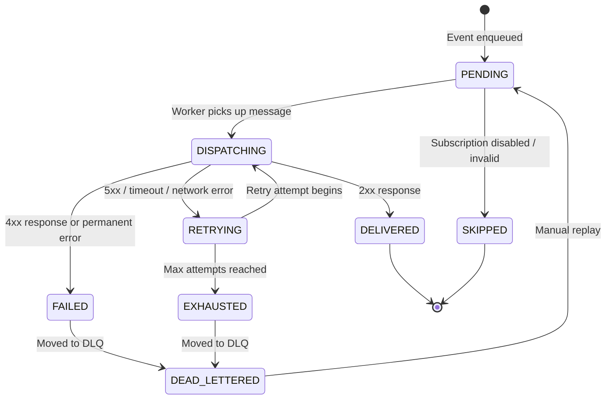

# Delivery State Machine

## Overview

Every webhook delivery in EventRelay follows a well-defined state machine. The state machine governs what actions are permitted on a delivery, determines retry eligibility, and drives dashboard visibility. States are persisted in PostgreSQL and updated atomically as deliveries progress through the pipeline.

> [!IMPORTANT]
> State transitions are **unidirectional** (with one exception: `DEAD_LETTERED` → `PENDING` via manual replay). This prevents oscillation and makes the delivery lifecycle predictable and auditable.

---

## State Transition Diagram



---

## State Definitions

| State | Description | Terminal? | Retryable? |
|-------|-------------|-----------|------------|
| `PENDING` | Delivery created, waiting in SQS queue | No | N/A |
| `DISPATCHING` | Worker is actively delivering (HTTP POST in progress) | No | N/A |
| `DELIVERED` | Successfully delivered (2xx response received) | **Yes** | No |
| `FAILED` | Permanently failed (4xx, invalid subscription, etc.) | Semi | No |
| `RETRYING` | Failed with retryable error, waiting for next attempt | No | Yes |
| `EXHAUSTED` | All retry attempts consumed without success | Semi | No |
| `DEAD_LETTERED` | Moved to dead-letter queue for manual review | Semi | Via replay |
| `SKIPPED` | Skipped due to inactive subscription or invalid message | **Yes** | No |

---

## Allowed Transitions

| From | To | Trigger | Automated? |
|------|----|---------|------------|
| `PENDING` | `DISPATCHING` | Worker dequeues message | Yes |
| `PENDING` | `SKIPPED` | Validation fails (inactive subscription, malformed) | Yes |
| `DISPATCHING` | `DELIVERED` | HTTP response 2xx | Yes |
| `DISPATCHING` | `FAILED` | HTTP response 4xx (non-retryable) | Yes |
| `DISPATCHING` | `RETRYING` | HTTP response 5xx, 408, 429, timeout, or network error | Yes |
| `RETRYING` | `DISPATCHING` | Retry timer fires, worker picks up | Yes |
| `RETRYING` | `EXHAUSTED` | `attemptNumber >= maxAttempts` | Yes |
| `FAILED` | `DEAD_LETTERED` | Background job moves to DLQ | Yes |
| `EXHAUSTED` | `DEAD_LETTERED` | Background job moves to DLQ | Yes |
| `DEAD_LETTERED` | `PENDING` | Admin triggers manual replay | **Manual** |

> [!WARNING]
> The following transitions are **explicitly forbidden** and will throw `IllegalStateTransitionException`:
> - `DELIVERED` → any state (successful deliveries are immutable)
> - `SKIPPED` → any state (skipped deliveries are immutable)
> - `RETRYING` → `FAILED` (must go through `DISPATCHING` first)
> - Any state → `PENDING` (except `DEAD_LETTERED` via replay)

---

## State Machine Implementation

```java
package com.eventrelay.dispatch.state;

import java.util.EnumMap;
import java.util.EnumSet;
import java.util.Map;
import java.util.Set;

/**
 * Delivery state machine with enforced transition rules.
 */
public enum DeliveryState {

    PENDING,
    DISPATCHING,
    DELIVERED,
    FAILED,
    RETRYING,
    EXHAUSTED,
    DEAD_LETTERED,
    SKIPPED;

    private static final Map<DeliveryState, Set<DeliveryState>> ALLOWED_TRANSITIONS;

    static {
        ALLOWED_TRANSITIONS = new EnumMap<>(DeliveryState.class);

        ALLOWED_TRANSITIONS.put(PENDING, EnumSet.of(DISPATCHING, SKIPPED));
        ALLOWED_TRANSITIONS.put(DISPATCHING, EnumSet.of(DELIVERED, FAILED, RETRYING));
        ALLOWED_TRANSITIONS.put(DELIVERED, EnumSet.noneOf(DeliveryState.class)); // terminal
        ALLOWED_TRANSITIONS.put(FAILED, EnumSet.of(DEAD_LETTERED));
        ALLOWED_TRANSITIONS.put(RETRYING, EnumSet.of(DISPATCHING, EXHAUSTED));
        ALLOWED_TRANSITIONS.put(EXHAUSTED, EnumSet.of(DEAD_LETTERED));
        ALLOWED_TRANSITIONS.put(DEAD_LETTERED, EnumSet.of(PENDING)); // manual replay only
        ALLOWED_TRANSITIONS.put(SKIPPED, EnumSet.noneOf(DeliveryState.class)); // terminal
    }

    /**
     * Validates that a transition from this state to the target state is allowed.
     *
     * @throws IllegalStateTransitionException if the transition is not permitted
     */
    public void validateTransition(DeliveryState target) {
        Set<DeliveryState> allowed = ALLOWED_TRANSITIONS.getOrDefault(
                this, EnumSet.noneOf(DeliveryState.class));

        if (!allowed.contains(target)) {
            throw new IllegalStateTransitionException(this, target);
        }
    }

    /**
     * Returns true if this state allows transitioning to the target state.
     */
    public boolean canTransitionTo(DeliveryState target) {
        return ALLOWED_TRANSITIONS.getOrDefault(
                this, EnumSet.noneOf(DeliveryState.class)).contains(target);
    }

    /**
     * Returns true if this is a terminal state (no further transitions possible).
     */
    public boolean isTerminal() {
        return ALLOWED_TRANSITIONS.getOrDefault(
                this, EnumSet.noneOf(DeliveryState.class)).isEmpty();
    }

    /**
     * Returns true if the delivery is in an active (non-terminal) state.
     */
    public boolean isActive() {
        return this == PENDING || this == DISPATCHING || this == RETRYING;
    }
}
```

---

## State Transition Exception

```java
package com.eventrelay.dispatch.state;

public class IllegalStateTransitionException extends RuntimeException {

    private final DeliveryState fromState;
    private final DeliveryState toState;

    public IllegalStateTransitionException(DeliveryState from, DeliveryState to) {
        super(String.format("Illegal state transition: %s → %s", from, to));
        this.fromState = from;
        this.toState = to;
    }

    public DeliveryState getFromState() { return fromState; }
    public DeliveryState getToState() { return toState; }
}
```

---

## State Transition Service

```java
package com.eventrelay.dispatch.state;

import io.micrometer.core.instrument.MeterRegistry;
import org.slf4j.Logger;
import org.slf4j.LoggerFactory;
import org.springframework.jdbc.core.namedparam.MapSqlParameterSource;
import org.springframework.jdbc.core.namedparam.NamedParameterJdbcTemplate;
import org.springframework.stereotype.Service;
import org.springframework.transaction.annotation.Transactional;

import java.time.Instant;
import java.util.UUID;

/**
 * Manages delivery state transitions with database persistence and
 * audit logging. All transitions are validated against the state machine
 * before being persisted.
 */
@Service
public class DeliveryStateService {

    private static final Logger log = LoggerFactory.getLogger(DeliveryStateService.class);

    private final NamedParameterJdbcTemplate jdbc;
    private final MeterRegistry meterRegistry;

    public DeliveryStateService(NamedParameterJdbcTemplate jdbc,
                                 MeterRegistry meterRegistry) {
        this.jdbc = jdbc;
        this.meterRegistry = meterRegistry;
    }

    /**
     * Transitions a delivery to a new state. Uses optimistic locking via
     * the current state to prevent concurrent conflicting transitions.
     *
     * @param deliveryId The delivery ID
     * @param fromState Expected current state (for optimistic lock)
     * @param toState Target state
     * @param reason Optional reason for the transition
     * @return true if the transition was applied, false if the current state
     *         didn't match (concurrent modification)
     */
    @Transactional
    public boolean transition(UUID deliveryId, DeliveryState fromState,
                               DeliveryState toState, String reason) {
        // Validate transition is allowed
        fromState.validateTransition(toState);

        // Atomic update with optimistic locking on current state
        int updated = jdbc.update("""
            UPDATE deliveries
            SET status = :toState,
                previous_status = :fromState,
                status_reason = :reason,
                updated_at = :now
            WHERE id = :deliveryId
              AND status = :fromState
            """,
            new MapSqlParameterSource()
                .addValue("deliveryId", deliveryId)
                .addValue("fromState", fromState.name())
                .addValue("toState", toState.name())
                .addValue("reason", reason)
                .addValue("now", Instant.now())
        );

        if (updated == 0) {
            log.warn("State transition failed (concurrent modification): " +
                     "deliveryId={}, expected={}, target={}",
                    deliveryId, fromState, toState);
            meterRegistry.counter("delivery.state.conflict").increment();
            return false;
        }

        // Record transition in audit log
        recordTransitionAudit(deliveryId, fromState, toState, reason);

        log.info("State transition: deliveryId={}, {} → {} (reason: {})",
                deliveryId, fromState, toState, reason);
        meterRegistry.counter("delivery.state.transition",
                "from", fromState.name(),
                "to", toState.name()).increment();

        return true;
    }

    /**
     * Records a state transition in the audit log for debugging and compliance.
     */
    private void recordTransitionAudit(UUID deliveryId, DeliveryState fromState,
                                        DeliveryState toState, String reason) {
        jdbc.update("""
            INSERT INTO delivery_state_log (
                delivery_id, from_state, to_state, reason, transitioned_at
            ) VALUES (
                :deliveryId, :fromState, :toState, :reason, :now
            )
            """,
            new MapSqlParameterSource()
                .addValue("deliveryId", deliveryId)
                .addValue("fromState", fromState.name())
                .addValue("toState", toState.name())
                .addValue("reason", reason)
                .addValue("now", Instant.now())
        );
    }

    /**
     * Gets the current state of a delivery.
     */
    public DeliveryState getCurrentState(UUID deliveryId) {
        String state = jdbc.queryForObject("""
            SELECT status FROM deliveries WHERE id = :deliveryId
            """,
            new MapSqlParameterSource("deliveryId", deliveryId),
            String.class
        );
        return DeliveryState.valueOf(state);
    }
}
```

---

## Database Schema

```sql
-- Main deliveries table with state column
CREATE TABLE deliveries (
    id               UUID PRIMARY KEY DEFAULT gen_random_uuid(),
    event_id         UUID NOT NULL,
    subscription_id  UUID NOT NULL,
    tenant_id        UUID NOT NULL,
    target_url       VARCHAR(2048) NOT NULL,
    payload          JSONB NOT NULL,
    status           VARCHAR(32) NOT NULL DEFAULT 'PENDING',
    previous_status  VARCHAR(32),
    status_reason    TEXT,
    attempt_count    INTEGER NOT NULL DEFAULT 0,
    max_attempts     INTEGER NOT NULL DEFAULT 5,
    last_attempt_at  TIMESTAMP WITH TIME ZONE,
    last_status_code INTEGER,
    next_attempt_at  TIMESTAMP WITH TIME ZONE,
    skip_reason      TEXT,
    created_at       TIMESTAMP WITH TIME ZONE NOT NULL DEFAULT NOW(),
    updated_at       TIMESTAMP WITH TIME ZONE NOT NULL DEFAULT NOW(),

    CONSTRAINT chk_delivery_status CHECK (
        status IN ('PENDING', 'DISPATCHING', 'DELIVERED', 'FAILED',
                   'RETRYING', 'EXHAUSTED', 'DEAD_LETTERED', 'SKIPPED')
    )
);

CREATE INDEX idx_deliveries_status ON deliveries(status);
CREATE INDEX idx_deliveries_tenant_status ON deliveries(tenant_id, status);
CREATE INDEX idx_deliveries_next_attempt ON deliveries(next_attempt_at)
    WHERE status = 'RETRYING';

-- State transition audit log
CREATE TABLE delivery_state_log (
    id              BIGSERIAL PRIMARY KEY,
    delivery_id     UUID NOT NULL,
    from_state      VARCHAR(32) NOT NULL,
    to_state        VARCHAR(32) NOT NULL,
    reason          TEXT,
    transitioned_at TIMESTAMP WITH TIME ZONE NOT NULL DEFAULT NOW(),

    CONSTRAINT fk_delivery_state_log FOREIGN KEY (delivery_id)
        REFERENCES deliveries(id)
);

CREATE INDEX idx_state_log_delivery_id ON delivery_state_log(delivery_id);
CREATE INDEX idx_state_log_transitioned_at ON delivery_state_log(transitioned_at);
```

---

## State Distribution Dashboard Query

```sql
-- Real-time state distribution per tenant
SELECT
    tenant_id,
    status,
    COUNT(*) as count,
    ROUND(100.0 * COUNT(*) / SUM(COUNT(*)) OVER (PARTITION BY tenant_id), 2) as pct
FROM deliveries
WHERE created_at > NOW() - INTERVAL '24 hours'
GROUP BY tenant_id, status
ORDER BY tenant_id, count DESC;
```

**Example output:**
```
 tenant_id  |    status     | count |  pct
------------+---------------+-------+-------
 acme-corp  | DELIVERED     | 45231 | 97.82
 acme-corp  | RETRYING      |   512 |  1.11
 acme-corp  | FAILED        |   298 |  0.64
 acme-corp  | DEAD_LETTERED |   102 |  0.22
 acme-corp  | PENDING       |    89 |  0.19
 acme-corp  | SKIPPED       |     8 |  0.02
```

---

## State Lifecycle Timing

| State | Typical Duration | Maximum Duration |
|-------|-----------------|-----------------|
| `PENDING` | < 1 second | Depends on queue depth |
| `DISPATCHING` | 100ms - 30s | 60s (call timeout) |
| `RETRYING` | 1s - 1 hour | Depends on backoff schedule |
| `DELIVERED` | ∞ (terminal) | ∞ |
| `FAILED` | Brief (auto-transitions to DLQ) | Minutes |
| `EXHAUSTED` | Brief (auto-transitions to DLQ) | Minutes |
| `DEAD_LETTERED` | Until manual replay | Retention period (30 days) |
| `SKIPPED` | ∞ (terminal) | ∞ |

---

## Production Considerations

1. **Optimistic Locking**: State transitions use `WHERE status = :fromState` as an optimistic lock. If two workers try to transition the same delivery simultaneously, only one succeeds. The other sees `updated = 0` and handles the conflict gracefully.

2. **Audit Log**: Every transition is logged in `delivery_state_log`. This is essential for debugging delivery failures and for compliance auditing. The log is append-only and never modified.

3. **Partial Index**: The index on `next_attempt_at WHERE status = 'RETRYING'` is a partial index that only indexes deliveries awaiting retry. This keeps the index small and fast.

4. **State Staleness**: A delivery stuck in `DISPATCHING` for more than the SQS visibility timeout will be redelivered. A background job should detect `DISPATCHING` deliveries older than 2× the visibility timeout and transition them to `RETRYING`.

---

## Related Documents

- [Delivery Pipeline](./Delivery_Pipeline.md) — Pipeline stages that trigger transitions
- [Retry Policies](./Retry_Policies.md) — What triggers RETRYING vs FAILED
- [Dead Letter Queue](./Dead_Letter_Queue.md) — DEAD_LETTERED state handling
- [Replay Engine](./Replay_Engine.md) — DEAD_LETTERED → PENDING replay
