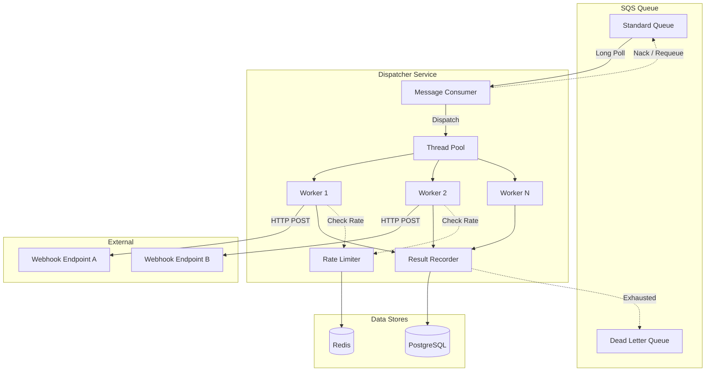
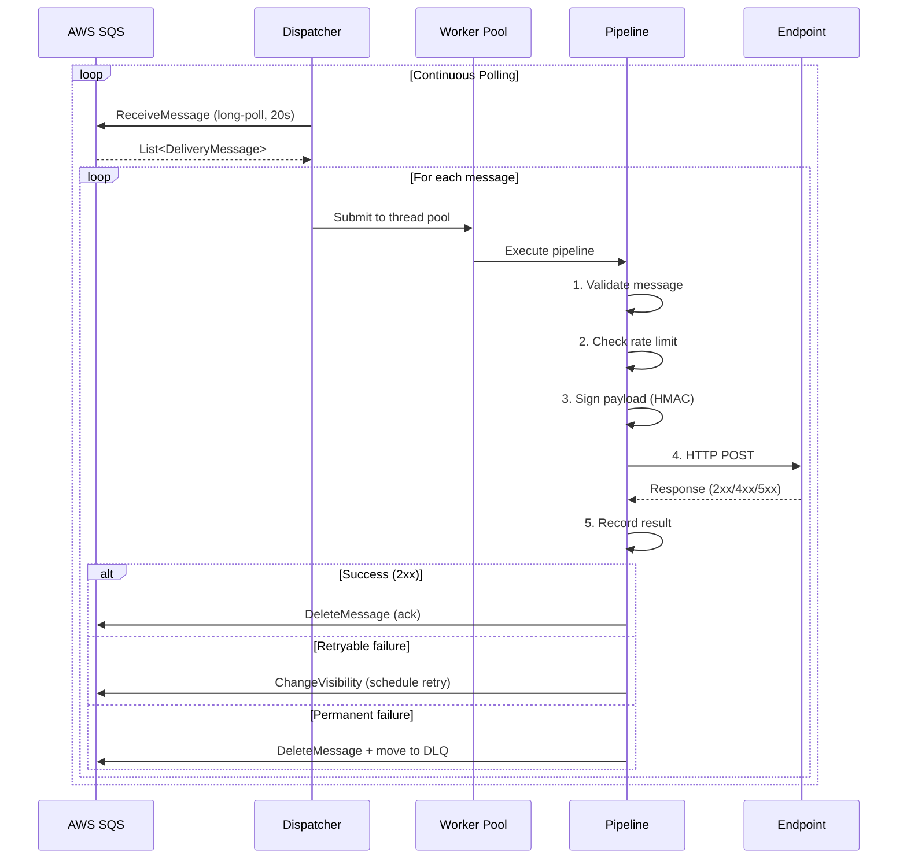

# Core Dispatcher Architecture

## Overview

The Dispatcher is the central orchestration component of EventRelay's delivery engine. It bridges the message queue (AWS SQS) and downstream webhook endpoints, coordinating message consumption, worker thread allocation, delivery execution, and result recording. The dispatcher operates as a continuously-running service within an ECS/Fargate task, designed for horizontal scaling with multiple instances consuming from the same SQS queue.

> [!IMPORTANT]
> The dispatcher follows an **at-least-once delivery** guarantee. Consumers must handle duplicate deliveries using the idempotency key provided in the `X-EventRelay-Delivery-Id` header.

---

## Architecture Overview



---

## Core Dispatcher Class

```java
package com.eventrelay.dispatch;

import com.eventrelay.dispatch.pipeline.DeliveryPipeline;
import com.eventrelay.dispatch.worker.WorkerPoolManager;
import com.eventrelay.queue.SqsMessageConsumer;
import com.eventrelay.queue.model.DeliveryMessage;
import io.micrometer.core.instrument.MeterRegistry;
import io.micrometer.core.instrument.Timer;
import jakarta.annotation.PostConstruct;
import jakarta.annotation.PreDestroy;
import org.slf4j.Logger;
import org.slf4j.LoggerFactory;
import org.springframework.stereotype.Component;

import java.util.List;
import java.util.concurrent.CompletableFuture;
import java.util.concurrent.atomic.AtomicBoolean;
import java.util.concurrent.atomic.AtomicLong;

/**
 * Core dispatcher that coordinates SQS message consumption, worker thread
 * allocation, and delivery execution. Runs as a continuous loop within the
 * application lifecycle.
 *
 * <p>Design principles:
 * <ul>
 *   <li>Non-blocking message consumption with configurable batch sizes</li>
 *   <li>Backpressure-aware: stops polling when worker pool is saturated</li>
 *   <li>Graceful shutdown: completes in-flight deliveries before stopping</li>
 *   <li>Horizontally scalable: multiple instances consume from the same queue</li>
 * </ul>
 */
@Component
public class EventDispatcher {

    private static final Logger log = LoggerFactory.getLogger(EventDispatcher.class);

    private final SqsMessageConsumer messageConsumer;
    private final WorkerPoolManager workerPool;
    private final DeliveryPipeline deliveryPipeline;
    private final DispatcherConfig config;
    private final MeterRegistry meterRegistry;

    private final AtomicBoolean running = new AtomicBoolean(false);
    private final AtomicLong messagesProcessed = new AtomicLong(0);
    private final AtomicLong messagesFailed = new AtomicLong(0);

    private Thread pollingThread;

    public EventDispatcher(
            SqsMessageConsumer messageConsumer,
            WorkerPoolManager workerPool,
            DeliveryPipeline deliveryPipeline,
            DispatcherConfig config,
            MeterRegistry meterRegistry) {
        this.messageConsumer = messageConsumer;
        this.workerPool = workerPool;
        this.deliveryPipeline = deliveryPipeline;
        this.config = config;
        this.meterRegistry = meterRegistry;
    }

    @PostConstruct
    public void start() {
        if (running.compareAndSet(false, true)) {
            log.info("Starting EventDispatcher with config: {}", config);
            pollingThread = new Thread(this::pollLoop, "dispatcher-poll");
            pollingThread.setDaemon(false);
            pollingThread.start();
        }
    }

    @PreDestroy
    public void stop() {
        if (running.compareAndSet(true, false)) {
            log.info("Stopping EventDispatcher. Completing in-flight deliveries...");
            pollingThread.interrupt();
            workerPool.shutdownGracefully(config.getShutdownTimeoutSeconds());
            log.info("EventDispatcher stopped. Processed={}, Failed={}",
                    messagesProcessed.get(), messagesFailed.get());
        }
    }

    /**
     * Main polling loop. Long-polls SQS for messages and dispatches them
     * to worker threads. Implements backpressure by pausing polls when
     * the worker pool queue depth exceeds the configured threshold.
     */
    private void pollLoop() {
        log.info("Dispatcher poll loop started");

        while (running.get()) {
            try {
                // Backpressure check: pause if workers are saturated
                if (workerPool.isOverloaded()) {
                    log.debug("Worker pool saturated (queue depth: {}), pausing poll for {}ms",
                            workerPool.getQueueDepth(), config.getBackpressurePauseMs());
                    meterRegistry.counter("dispatcher.backpressure.pauses").increment();
                    Thread.sleep(config.getBackpressurePauseMs());
                    continue;
                }

                // Calculate adaptive batch size based on available capacity
                int batchSize = Math.min(
                        config.getMaxBatchSize(),
                        workerPool.getAvailableCapacity()
                );

                if (batchSize <= 0) {
                    Thread.sleep(100); // Brief pause when no capacity
                    continue;
                }

                // Long-poll SQS (up to 20 seconds wait time)
                Timer.Sample sample = Timer.start(meterRegistry);
                List<DeliveryMessage> messages = messageConsumer.receiveMessages(
                        batchSize,
                        config.getSqsWaitTimeSeconds()
                );
                sample.stop(meterRegistry.timer("dispatcher.sqs.poll.duration"));

                if (messages.isEmpty()) {
                    continue; // SQS returned no messages, loop back
                }

                meterRegistry.counter("dispatcher.messages.received")
                        .increment(messages.size());

                log.debug("Received {} messages from SQS", messages.size());

                // Dispatch each message to worker pool
                for (DeliveryMessage message : messages) {
                    dispatchToWorker(message);
                }

            } catch (InterruptedException e) {
                Thread.currentThread().interrupt();
                log.info("Poll loop interrupted, shutting down");
                break;
            } catch (Exception e) {
                log.error("Error in poll loop, retrying after pause", e);
                meterRegistry.counter("dispatcher.poll.errors").increment();
                sleepQuietly(config.getErrorPauseMs());
            }
        }

        log.info("Dispatcher poll loop exited");
    }

    /**
     * Dispatches a single message to the worker pool for delivery processing.
     * The delivery pipeline handles all stages: validation, rate checking,
     * signing, HTTP delivery, result recording, and SQS acknowledgment.
     */
    private void dispatchToWorker(DeliveryMessage message) {
        CompletableFuture.runAsync(
                () -> processMessage(message),
                workerPool.getExecutor()
        ).exceptionally(throwable -> {
            log.error("Unhandled error processing message: deliveryId={}",
                    message.getDeliveryId(), throwable);
            messagesFailed.incrementAndGet();
            meterRegistry.counter("dispatcher.delivery.unhandled_error").increment();
            // Nack the message so SQS makes it visible again after visibility timeout
            messageConsumer.nackMessage(message);
            return null;
        });
    }

    /**
     * Processes a single delivery message through the full pipeline.
     */
    private void processMessage(DeliveryMessage message) {
        Timer.Sample sample = Timer.start(meterRegistry);
        try {
            deliveryPipeline.execute(message);
            messagesProcessed.incrementAndGet();
            meterRegistry.counter("dispatcher.delivery.success").increment();
        } catch (Exception e) {
            messagesFailed.incrementAndGet();
            meterRegistry.counter("dispatcher.delivery.failure").increment();
            throw e;
        } finally {
            sample.stop(meterRegistry.timer("dispatcher.delivery.duration"));
        }
    }

    private void sleepQuietly(long ms) {
        try {
            Thread.sleep(ms);
        } catch (InterruptedException e) {
            Thread.currentThread().interrupt();
        }
    }

    // --- Health & Status ---

    public boolean isRunning() {
        return running.get();
    }

    public DispatcherStatus getStatus() {
        return new DispatcherStatus(
                running.get(),
                messagesProcessed.get(),
                messagesFailed.get(),
                workerPool.getActiveWorkerCount(),
                workerPool.getQueueDepth()
        );
    }
}
```

---

## Dispatcher Configuration

```java
package com.eventrelay.dispatch;

import org.springframework.boot.context.properties.ConfigurationProperties;
import org.springframework.validation.annotation.Validated;

import jakarta.validation.constraints.Max;
import jakarta.validation.constraints.Min;
import jakarta.validation.constraints.Positive;

@Validated
@ConfigurationProperties(prefix = "eventrelay.dispatcher")
public class DispatcherConfig {

    /** Maximum number of messages to receive per SQS poll (1-10) */
    @Min(1) @Max(10)
    private int maxBatchSize = 10;

    /** SQS long-poll wait time in seconds (0-20) */
    @Min(0) @Max(20)
    private int sqsWaitTimeSeconds = 20;

    /** Pause duration when worker pool is saturated (ms) */
    @Positive
    private long backpressurePauseMs = 500;

    /** Pause duration after poll loop error (ms) */
    @Positive
    private long errorPauseMs = 5000;

    /** Max seconds to wait for in-flight deliveries during shutdown */
    @Positive
    private int shutdownTimeoutSeconds = 30;

    /** SQS visibility timeout in seconds — must exceed max delivery time */
    @Positive
    private int visibilityTimeoutSeconds = 120;

    /** Queue depth threshold to trigger backpressure */
    @Positive
    private int backpressureThreshold = 100;

    // Getters and setters omitted for brevity
    public int getMaxBatchSize() { return maxBatchSize; }
    public void setMaxBatchSize(int maxBatchSize) { this.maxBatchSize = maxBatchSize; }
    public int getSqsWaitTimeSeconds() { return sqsWaitTimeSeconds; }
    public void setSqsWaitTimeSeconds(int sqsWaitTimeSeconds) { this.sqsWaitTimeSeconds = sqsWaitTimeSeconds; }
    public long getBackpressurePauseMs() { return backpressurePauseMs; }
    public void setBackpressurePauseMs(long backpressurePauseMs) { this.backpressurePauseMs = backpressurePauseMs; }
    public long getErrorPauseMs() { return errorPauseMs; }
    public void setErrorPauseMs(long errorPauseMs) { this.errorPauseMs = errorPauseMs; }
    public int getShutdownTimeoutSeconds() { return shutdownTimeoutSeconds; }
    public void setShutdownTimeoutSeconds(int shutdownTimeoutSeconds) { this.shutdownTimeoutSeconds = shutdownTimeoutSeconds; }
    public int getVisibilityTimeoutSeconds() { return visibilityTimeoutSeconds; }
    public void setVisibilityTimeoutSeconds(int visibilityTimeoutSeconds) { this.visibilityTimeoutSeconds = visibilityTimeoutSeconds; }
    public int getBackpressureThreshold() { return backpressureThreshold; }
    public void setBackpressureThreshold(int backpressureThreshold) { this.backpressureThreshold = backpressureThreshold; }
}
```

### Application Configuration (YAML)

```yaml
eventrelay:
  dispatcher:
    max-batch-size: 10
    sqs-wait-time-seconds: 20
    backpressure-pause-ms: 500
    error-pause-ms: 5000
    shutdown-timeout-seconds: 30
    visibility-timeout-seconds: 120
    backpressure-threshold: 100
```

---

## SQS Message Consumer

```java
package com.eventrelay.queue;

import com.eventrelay.queue.model.DeliveryMessage;
import com.fasterxml.jackson.databind.ObjectMapper;
import org.slf4j.Logger;
import org.slf4j.LoggerFactory;
import org.springframework.stereotype.Component;
import software.amazon.awssdk.services.sqs.SqsClient;
import software.amazon.awssdk.services.sqs.model.*;

import java.util.List;

@Component
public class SqsMessageConsumer {

    private static final Logger log = LoggerFactory.getLogger(SqsMessageConsumer.class);

    private final SqsClient sqsClient;
    private final ObjectMapper objectMapper;
    private final String queueUrl;

    public SqsMessageConsumer(SqsClient sqsClient, ObjectMapper objectMapper,
                              SqsQueueConfig queueConfig) {
        this.sqsClient = sqsClient;
        this.objectMapper = objectMapper;
        this.queueUrl = queueConfig.getDeliveryQueueUrl();
    }

    /**
     * Long-polls SQS for delivery messages.
     *
     * @param maxMessages Maximum messages to receive (1-10)
     * @param waitTimeSeconds Long-poll wait time (0-20s)
     * @return List of delivery messages, empty if none available
     */
    public List<DeliveryMessage> receiveMessages(int maxMessages, int waitTimeSeconds) {
        ReceiveMessageRequest request = ReceiveMessageRequest.builder()
                .queueUrl(queueUrl)
                .maxNumberOfMessages(maxMessages)
                .waitTimeSeconds(waitTimeSeconds)
                .messageAttributeNames("All")
                .attributeNamesWithStrings("ApproximateReceiveCount")
                .build();

        ReceiveMessageResponse response = sqsClient.receiveMessage(request);

        return response.messages().stream()
                .map(this::deserialize)
                .toList();
    }

    /**
     * Acknowledges successful processing by deleting the message from SQS.
     */
    public void ackMessage(DeliveryMessage message) {
        sqsClient.deleteMessage(DeleteMessageRequest.builder()
                .queueUrl(queueUrl)
                .receiptHandle(message.getReceiptHandle())
                .build());
        log.debug("Acked message: deliveryId={}", message.getDeliveryId());
    }

    /**
     * Negative acknowledgment — changes visibility timeout to 0 so the
     * message becomes immediately available for reprocessing.
     */
    public void nackMessage(DeliveryMessage message) {
        sqsClient.changeMessageVisibility(ChangeMessageVisibilityRequest.builder()
                .queueUrl(queueUrl)
                .receiptHandle(message.getReceiptHandle())
                .visibilityTimeout(0)
                .build());
        log.debug("Nacked message: deliveryId={}", message.getDeliveryId());
    }

    /**
     * Extends the visibility timeout for long-running deliveries.
     */
    public void extendVisibility(DeliveryMessage message, int additionalSeconds) {
        sqsClient.changeMessageVisibility(ChangeMessageVisibilityRequest.builder()
                .queueUrl(queueUrl)
                .receiptHandle(message.getReceiptHandle())
                .visibilityTimeout(additionalSeconds)
                .build());
    }

    private DeliveryMessage deserialize(Message sqsMessage) {
        try {
            DeliveryMessage dm = objectMapper.readValue(
                    sqsMessage.body(), DeliveryMessage.class);
            dm.setReceiptHandle(sqsMessage.receiptHandle());
            dm.setReceiveCount(Integer.parseInt(
                    sqsMessage.attributesAsStrings()
                            .getOrDefault("ApproximateReceiveCount", "1")));
            return dm;
        } catch (Exception e) {
            log.error("Failed to deserialize SQS message: {}", sqsMessage.messageId(), e);
            throw new MessageDeserializationException(sqsMessage.messageId(), e);
        }
    }
}
```

---

## Delivery Message Model

```java
package com.eventrelay.queue.model;

import com.fasterxml.jackson.annotation.JsonIgnoreProperties;
import java.time.Instant;
import java.util.Map;
import java.util.UUID;

@JsonIgnoreProperties(ignoreUnknown = true)
public class DeliveryMessage {

    private UUID deliveryId;
    private UUID eventId;
    private UUID subscriptionId;
    private UUID tenantId;
    private String targetUrl;
    private String eventType;
    private String payload;           // JSON event body
    private Map<String, String> headers; // Custom headers from subscription
    private String signingSecret;     // HMAC signing key for this subscription
    private int attemptNumber;
    private int maxAttempts;
    private Instant scheduledAt;
    private Instant createdAt;

    // SQS metadata — not serialized in queue body
    private transient String receiptHandle;
    private transient int receiveCount;

    // Getters and setters...
    public UUID getDeliveryId() { return deliveryId; }
    public void setDeliveryId(UUID deliveryId) { this.deliveryId = deliveryId; }
    public UUID getEventId() { return eventId; }
    public void setEventId(UUID eventId) { this.eventId = eventId; }
    public UUID getSubscriptionId() { return subscriptionId; }
    public void setSubscriptionId(UUID subscriptionId) { this.subscriptionId = subscriptionId; }
    public UUID getTenantId() { return tenantId; }
    public void setTenantId(UUID tenantId) { this.tenantId = tenantId; }
    public String getTargetUrl() { return targetUrl; }
    public void setTargetUrl(String targetUrl) { this.targetUrl = targetUrl; }
    public String getEventType() { return eventType; }
    public void setEventType(String eventType) { this.eventType = eventType; }
    public String getPayload() { return payload; }
    public void setPayload(String payload) { this.payload = payload; }
    public Map<String, String> getHeaders() { return headers; }
    public void setHeaders(Map<String, String> headers) { this.headers = headers; }
    public String getSigningSecret() { return signingSecret; }
    public void setSigningSecret(String signingSecret) { this.signingSecret = signingSecret; }
    public int getAttemptNumber() { return attemptNumber; }
    public void setAttemptNumber(int attemptNumber) { this.attemptNumber = attemptNumber; }
    public int getMaxAttempts() { return maxAttempts; }
    public void setMaxAttempts(int maxAttempts) { this.maxAttempts = maxAttempts; }
    public Instant getScheduledAt() { return scheduledAt; }
    public void setScheduledAt(Instant scheduledAt) { this.scheduledAt = scheduledAt; }
    public Instant getCreatedAt() { return createdAt; }
    public void setCreatedAt(Instant createdAt) { this.createdAt = createdAt; }
    public String getReceiptHandle() { return receiptHandle; }
    public void setReceiptHandle(String receiptHandle) { this.receiptHandle = receiptHandle; }
    public int getReceiveCount() { return receiveCount; }
    public void setReceiveCount(int receiveCount) { this.receiveCount = receiveCount; }
}
```

---

## Message Processing Pipeline



---

## Dispatcher Status Model

```java
package com.eventrelay.dispatch;

public record DispatcherStatus(
    boolean running,
    long messagesProcessed,
    long messagesFailed,
    int activeWorkers,
    int queueDepth
) {
    public double successRate() {
        long total = messagesProcessed + messagesFailed;
        return total == 0 ? 1.0 : (double) messagesProcessed / total;
    }
}
```

---

## Key Metrics

| Metric | Type | Description |
|--------|------|-------------|
| `dispatcher.messages.received` | Counter | Total messages received from SQS |
| `dispatcher.delivery.success` | Counter | Successful deliveries |
| `dispatcher.delivery.failure` | Counter | Failed deliveries |
| `dispatcher.delivery.duration` | Timer | End-to-end delivery time |
| `dispatcher.sqs.poll.duration` | Timer | SQS long-poll duration |
| `dispatcher.backpressure.pauses` | Counter | Times polling paused due to worker saturation |
| `dispatcher.poll.errors` | Counter | Errors in the polling loop |
| `dispatcher.delivery.unhandled_error` | Counter | Unhandled exceptions in workers |

---

## Horizontal Scaling

Multiple dispatcher instances can run concurrently against the same SQS queue. SQS handles message distribution automatically:

- **Standard Queue**: Messages are delivered to one consumer; however, at-least-once semantics mean occasional duplicates
- **Visibility Timeout**: Prevents other consumers from processing the same message while one instance handles it
- **Auto Scaling**: ECS service auto-scales based on `ApproximateNumberOfMessagesVisible` metric

```yaml
# ECS Auto Scaling Policy
scaling:
  metric: SQS ApproximateNumberOfMessagesVisible
  target: 100           # Target messages per instance
  scale-out-cooldown: 60s
  scale-in-cooldown: 300s
  min-instances: 2
  max-instances: 20
```

> [!TIP]
> Set `min-instances: 2` to ensure high availability. With a single instance, a deployment or crash causes a delivery gap until the replacement starts.

---

## Production Considerations

1. **Visibility Timeout vs Delivery Timeout**: The SQS visibility timeout (default 120s) must exceed the maximum possible delivery time (connect + read + write timeouts = 45s) plus processing overhead. A 2.5× safety margin is recommended.

2. **Backpressure**: The dispatcher monitors worker pool queue depth and pauses SQS polling when saturated, preventing memory exhaustion from unbounded queueing.

3. **Message Ordering**: SQS standard queues do **not** guarantee ordering. If ordering matters, use per-subscription FIFO queues or implement application-level sequencing.

4. **Poison Messages**: Messages that repeatedly fail deserialization are detected via `ApproximateReceiveCount` and routed to the SQS dead-letter queue after the configured `maxReceiveCount`.

5. **Idempotency**: Every delivery carries a unique `deliveryId`. Consumers should use this for deduplication since at-least-once delivery means the same event may be delivered more than once.

---

## Related Documents

- [Worker Model](./Worker_Model.md) — Thread pool configuration and lifecycle management
- [Delivery Pipeline](./Delivery_Pipeline.md) — Step-by-step delivery stages
- [HTTP Delivery](./HTTP_Delivery.md) — HTTP client configuration and delivery execution
- [Failure Recovery](./Failure_Recovery.md) — Failure scenarios and recovery procedures
