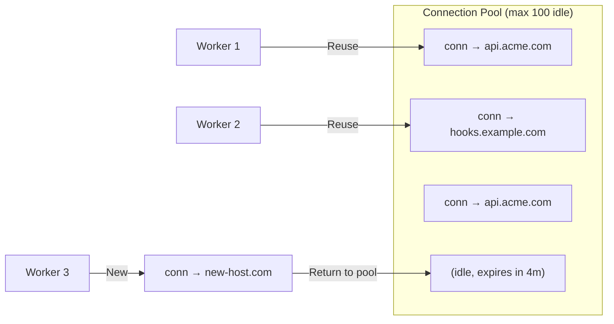

# HTTP Delivery Implementation

## Overview

The HTTP delivery layer is responsible for the actual webhook POST to consumer endpoints. It wraps OkHttp3 with production-grade configuration: connection pooling, timeouts, redirect following, response classification, and comprehensive logging. Every delivery includes HMAC-SHA256 signature headers so consumers can verify authenticity.

> [!IMPORTANT]
> The HTTP client is shared across all worker threads. OkHttp3's `OkHttpClient` is thread-safe and designed for reuse — creating one client per request would exhaust file descriptors and degrade performance.

---

## HTTP Client Configuration

```java
package com.eventrelay.dispatch.http;

import okhttp3.ConnectionPool;
import okhttp3.Dispatcher;
import okhttp3.OkHttpClient;
import okhttp3.Protocol;
import org.springframework.context.annotation.Bean;
import org.springframework.context.annotation.Configuration;

import javax.net.ssl.SSLContext;
import javax.net.ssl.TrustManagerFactory;
import java.security.KeyStore;
import java.util.Arrays;
import java.util.concurrent.TimeUnit;

@Configuration
public class HttpClientConfig {

    @Bean
    public OkHttpClient webhookHttpClient(HttpDeliveryConfig config) {
        // Connection pool: reuse connections to frequently-called endpoints
        ConnectionPool connectionPool = new ConnectionPool(
                config.getMaxIdleConnections(),      // 100 idle connections
                config.getKeepAliveDurationSeconds(), // 5 minutes keep-alive
                TimeUnit.SECONDS
        );

        // OkHttp dispatcher: controls max concurrent requests
        Dispatcher dispatcher = new Dispatcher();
        dispatcher.setMaxRequests(config.getMaxConcurrentRequests());        // 200 total
        dispatcher.setMaxRequestsPerHost(config.getMaxRequestsPerHost());   // 10 per host

        return new OkHttpClient.Builder()
                // Timeouts
                .connectTimeout(config.getConnectTimeoutMs(), TimeUnit.MILLISECONDS)  // 5s
                .readTimeout(config.getReadTimeoutMs(), TimeUnit.MILLISECONDS)        // 30s
                .writeTimeout(config.getWriteTimeoutMs(), TimeUnit.MILLISECONDS)      // 10s
                .callTimeout(config.getCallTimeoutMs(), TimeUnit.MILLISECONDS)        // 60s overall

                // Connection management
                .connectionPool(connectionPool)
                .dispatcher(dispatcher)
                .retryOnConnectionFailure(false) // We handle retries ourselves

                // Redirect policy
                .followRedirects(config.isFollowRedirects())                  // true
                .followSslRedirects(config.isFollowSslRedirects())            // true

                // Protocol support
                .protocols(Arrays.asList(Protocol.HTTP_2, Protocol.HTTP_1_1))

                // Interceptors
                .addInterceptor(new RedirectLimitInterceptor(config.getMaxRedirects())) // 3
                .addInterceptor(new RequestLoggingInterceptor())
                .addNetworkInterceptor(new ResponseMetricsInterceptor())

                .build();
    }
}
```

---

## Timeout Configuration

| Timeout | Default | Purpose | Rationale |
|---------|---------|---------|-----------|
| **Connect** | 5,000 ms | TCP + TLS handshake | Most servers respond within 1-2s; 5s covers slow DNS + distant servers |
| **Read** | 30,000 ms | Time to first byte + body | Generous to handle slow backends processing the webhook |
| **Write** | 10,000 ms | Time to send request body | Webhook payloads are typically small (<1 MB); 10s is generous |
| **Call** | 60,000 ms | Overall deadline | Hard cap preventing zombie connections; sum of all phases |

```java
package com.eventrelay.dispatch.http;

import org.springframework.boot.context.properties.ConfigurationProperties;

@ConfigurationProperties(prefix = "eventrelay.http")
public class HttpDeliveryConfig {

    // Timeouts (milliseconds)
    private long connectTimeoutMs = 5_000;
    private long readTimeoutMs = 30_000;
    private long writeTimeoutMs = 10_000;
    private long callTimeoutMs = 60_000;

    // Connection pool
    private int maxIdleConnections = 100;
    private long keepAliveDurationSeconds = 300;

    // Concurrency
    private int maxConcurrentRequests = 200;
    private int maxRequestsPerHost = 10;

    // Redirects
    private boolean followRedirects = true;
    private boolean followSslRedirects = true;
    private int maxRedirects = 3;

    // Request settings
    private long maxResponseBodyBytes = 1_048_576; // 1 MB - we only need status code + headers
    private String userAgent = "EventRelay-Webhook/1.0";

    // Getters and setters...
    public long getConnectTimeoutMs() { return connectTimeoutMs; }
    public void setConnectTimeoutMs(long v) { this.connectTimeoutMs = v; }
    public long getReadTimeoutMs() { return readTimeoutMs; }
    public void setReadTimeoutMs(long v) { this.readTimeoutMs = v; }
    public long getWriteTimeoutMs() { return writeTimeoutMs; }
    public void setWriteTimeoutMs(long v) { this.writeTimeoutMs = v; }
    public long getCallTimeoutMs() { return callTimeoutMs; }
    public void setCallTimeoutMs(long v) { this.callTimeoutMs = v; }
    public int getMaxIdleConnections() { return maxIdleConnections; }
    public void setMaxIdleConnections(int v) { this.maxIdleConnections = v; }
    public long getKeepAliveDurationSeconds() { return keepAliveDurationSeconds; }
    public void setKeepAliveDurationSeconds(long v) { this.keepAliveDurationSeconds = v; }
    public int getMaxConcurrentRequests() { return maxConcurrentRequests; }
    public void setMaxConcurrentRequests(int v) { this.maxConcurrentRequests = v; }
    public int getMaxRequestsPerHost() { return maxRequestsPerHost; }
    public void setMaxRequestsPerHost(int v) { this.maxRequestsPerHost = v; }
    public boolean isFollowRedirects() { return followRedirects; }
    public void setFollowRedirects(boolean v) { this.followRedirects = v; }
    public boolean isFollowSslRedirects() { return followSslRedirects; }
    public void setFollowSslRedirects(boolean v) { this.followSslRedirects = v; }
    public int getMaxRedirects() { return maxRedirects; }
    public void setMaxRedirects(int v) { this.maxRedirects = v; }
    public long getMaxResponseBodyBytes() { return maxResponseBodyBytes; }
    public void setMaxResponseBodyBytes(long v) { this.maxResponseBodyBytes = v; }
    public String getUserAgent() { return userAgent; }
    public void setUserAgent(String v) { this.userAgent = v; }
}
```

### YAML Configuration

```yaml
eventrelay:
  http:
    connect-timeout-ms: 5000
    read-timeout-ms: 30000
    write-timeout-ms: 10000
    call-timeout-ms: 60000
    max-idle-connections: 100
    keep-alive-duration-seconds: 300
    max-concurrent-requests: 200
    max-requests-per-host: 10
    follow-redirects: true
    follow-ssl-redirects: true
    max-redirects: 3
    max-response-body-bytes: 1048576
    user-agent: "EventRelay-Webhook/1.0"
```

---

## Webhook Delivery Service

```java
package com.eventrelay.dispatch.http;

import com.eventrelay.dispatch.signing.HmacSigner;
import com.eventrelay.queue.model.DeliveryMessage;
import io.micrometer.core.instrument.MeterRegistry;
import io.micrometer.core.instrument.Timer;
import okhttp3.*;
import org.slf4j.Logger;
import org.slf4j.LoggerFactory;
import org.springframework.stereotype.Service;

import java.io.IOException;
import java.time.Instant;
import java.util.Map;
import java.util.concurrent.TimeUnit;

@Service
public class WebhookDeliveryService {

    private static final Logger log = LoggerFactory.getLogger(WebhookDeliveryService.class);
    private static final MediaType JSON = MediaType.get("application/json; charset=utf-8");

    private final OkHttpClient httpClient;
    private final HmacSigner signer;
    private final HttpDeliveryConfig config;
    private final MeterRegistry meterRegistry;

    public WebhookDeliveryService(OkHttpClient httpClient, HmacSigner signer,
                                   HttpDeliveryConfig config, MeterRegistry meterRegistry) {
        this.httpClient = httpClient;
        this.signer = signer;
        this.config = config;
        this.meterRegistry = meterRegistry;
    }

    /**
     * Delivers a webhook event to the target URL.
     *
     * @return DeliveryResult with status code, headers, and timing info
     */
    public DeliveryResult deliver(DeliveryMessage message) {
        long startTime = System.nanoTime();
        String timestamp = String.valueOf(Instant.now().getEpochSecond());

        try {
            // Build signed request
            Request request = buildRequest(message, timestamp);

            log.debug("Delivering webhook: deliveryId={}, url={}, attempt={}",
                    message.getDeliveryId(), message.getTargetUrl(),
                    message.getAttemptNumber());

            // Execute HTTP POST
            try (Response response = httpClient.newCall(request).execute()) {
                long durationMs = TimeUnit.NANOSECONDS.toMillis(
                        System.nanoTime() - startTime);

                // Read response body (limited to prevent OOM)
                String responseBody = readResponseBody(response);

                DeliveryResult result = new DeliveryResult(
                        message.getDeliveryId(),
                        response.code(),
                        responseBody,
                        durationMs,
                        message.getAttemptNumber(),
                        classifyResponse(response.code()),
                        extractResponseHeaders(response)
                );

                recordMetrics(result);

                log.info("Delivery completed: deliveryId={}, status={}, duration={}ms, " +
                         "classification={}",
                        message.getDeliveryId(), result.statusCode(),
                        result.durationMs(), result.classification());

                return result;
            }

        } catch (IOException e) {
            long durationMs = TimeUnit.NANOSECONDS.toMillis(
                    System.nanoTime() - startTime);

            log.warn("Delivery failed (network error): deliveryId={}, error={}, duration={}ms",
                    message.getDeliveryId(), e.getMessage(), durationMs);

            meterRegistry.counter("delivery.http.error",
                    "type", classifyException(e)).increment();

            return DeliveryResult.networkError(
                    message.getDeliveryId(),
                    e.getMessage(),
                    durationMs,
                    message.getAttemptNumber()
            );
        }
    }

    /**
     * Builds the HTTP request with all required EventRelay headers.
     */
    private Request buildRequest(DeliveryMessage message, String timestamp) {
        // Generate HMAC signature
        String signaturePayload = timestamp + "." + message.getPayload();
        String signature = signer.sign(signaturePayload, message.getSigningSecret());

        Request.Builder builder = new Request.Builder()
                .url(message.getTargetUrl())
                .post(RequestBody.create(message.getPayload(), JSON))

                // Standard headers
                .header("Content-Type", "application/json")
                .header("User-Agent", config.getUserAgent())

                // EventRelay signature headers
                .header("X-EventRelay-Signature", "v1=" + signature)
                .header("X-EventRelay-Timestamp", timestamp)
                .header("X-EventRelay-Delivery-Id", message.getDeliveryId().toString())

                // Informational headers
                .header("X-EventRelay-Event-Type", message.getEventType())
                .header("X-EventRelay-Event-Id", message.getEventId().toString())
                .header("X-EventRelay-Attempt", String.valueOf(message.getAttemptNumber()));

        // Add custom headers from subscription configuration
        if (message.getHeaders() != null) {
            for (Map.Entry<String, String> entry : message.getHeaders().entrySet()) {
                // Prevent overriding system headers
                if (!entry.getKey().startsWith("X-EventRelay-")) {
                    builder.header(entry.getKey(), entry.getValue());
                }
            }
        }

        return builder.build();
    }

    /**
     * Reads response body up to the configured max size to prevent OOM.
     */
    private String readResponseBody(Response response) {
        try {
            ResponseBody body = response.body();
            if (body == null) return "";

            // Limit body read to prevent OOM from malicious responses
            byte[] bytes = body.byteStream()
                    .readNBytes((int) config.getMaxResponseBodyBytes());
            return new String(bytes);
        } catch (IOException e) {
            log.debug("Failed to read response body", e);
            return "[unreadable]";
        }
    }

    private Map<String, String> extractResponseHeaders(Response response) {
        return Map.of(
                "Content-Type", response.header("Content-Type", ""),
                "Retry-After", response.header("Retry-After", ""),
                "X-Request-Id", response.header("X-Request-Id", "")
        );
    }

    private void recordMetrics(DeliveryResult result) {
        meterRegistry.counter("delivery.http.status",
                "code", String.valueOf(result.statusCode()),
                "classification", result.classification().name()
        ).increment();

        meterRegistry.timer("delivery.http.duration")
                .record(result.durationMs(), TimeUnit.MILLISECONDS);
    }

    private String classifyException(IOException e) {
        String msg = e.getMessage() != null ? e.getMessage().toLowerCase() : "";
        if (msg.contains("timeout")) return "timeout";
        if (msg.contains("connect")) return "connection_refused";
        if (msg.contains("reset")) return "connection_reset";
        if (msg.contains("dns") || msg.contains("resolve")) return "dns_failure";
        if (msg.contains("ssl") || msg.contains("tls")) return "tls_error";
        return "network_error";
    }

    /**
     * Classifies HTTP response codes into delivery outcomes.
     */
    static ResponseClassification classifyResponse(int statusCode) {
        if (statusCode >= 200 && statusCode < 300) {
            return ResponseClassification.SUCCESS;
        }
        // Specific retryable 4xx codes
        if (statusCode == 408 || statusCode == 429) {
            return ResponseClassification.RETRYABLE;
        }
        // All other 4xx are permanent failures
        if (statusCode >= 400 && statusCode < 500) {
            return ResponseClassification.PERMANENT_FAILURE;
        }
        // All 5xx are retryable
        if (statusCode >= 500) {
            return ResponseClassification.RETRYABLE;
        }
        // 1xx, 3xx (shouldn't reach here due to redirect following)
        return ResponseClassification.RETRYABLE;
    }
}
```

---

## Response Classification

```java
package com.eventrelay.dispatch.http;

/**
 * Classification of HTTP response codes for retry decisions.
 */
public enum ResponseClassification {
    /** 2xx — Delivery successful, acknowledge and record */
    SUCCESS,

    /** 5xx, 408, 429, network errors — Schedule retry with backoff */
    RETRYABLE,

    /** 4xx (except 408, 429) — Permanent failure, do not retry */
    PERMANENT_FAILURE
}
```

### Response Code Decision Matrix

| Status Code | Classification | Action | Rationale |
|-------------|---------------|--------|-----------|
| **200-299** | `SUCCESS` | Ack + record | Delivery accepted by consumer |
| **301, 302, 307, 308** | (followed) | Follow redirect | OkHttp follows automatically (up to 3 hops) |
| **400 Bad Request** | `PERMANENT_FAILURE` | DLQ | Our payload is invalid; retrying won't help |
| **401 Unauthorized** | `PERMANENT_FAILURE` | DLQ | Credentials are wrong; needs human fix |
| **403 Forbidden** | `PERMANENT_FAILURE` | DLQ | Not allowed; needs human fix |
| **404 Not Found** | `PERMANENT_FAILURE` | DLQ | Endpoint doesn't exist |
| **405 Method Not Allowed** | `PERMANENT_FAILURE` | DLQ | Endpoint doesn't accept POST |
| **408 Request Timeout** | `RETRYABLE` | Retry with backoff | Server timed out; transient |
| **410 Gone** | `PERMANENT_FAILURE` | DLQ + disable subscription | Endpoint permanently removed |
| **413 Payload Too Large** | `PERMANENT_FAILURE` | DLQ | Payload exceeds receiver limit |
| **429 Too Many Requests** | `RETRYABLE` | Retry with `Retry-After` | Rate limited; honor backoff header |
| **500 Internal Server Error** | `RETRYABLE` | Retry with backoff | Server error; likely transient |
| **502 Bad Gateway** | `RETRYABLE` | Retry with backoff | Upstream error; transient |
| **503 Service Unavailable** | `RETRYABLE` | Retry with backoff | Server temporarily down |
| **504 Gateway Timeout** | `RETRYABLE` | Retry with backoff | Upstream timeout; transient |
| Network error / timeout | `RETRYABLE` | Retry with backoff | Connection failed; transient |

---

## Delivery Result

```java
package com.eventrelay.dispatch.http;

import java.util.Map;
import java.util.UUID;

/**
 * Immutable result of a webhook delivery attempt.
 */
public record DeliveryResult(
    UUID deliveryId,
    int statusCode,
    String responseBody,
    long durationMs,
    int attemptNumber,
    ResponseClassification classification,
    Map<String, String> responseHeaders
) {
    /**
     * Creates a result for network-level failures (no HTTP response received).
     */
    public static DeliveryResult networkError(UUID deliveryId, String errorMessage,
                                               long durationMs, int attemptNumber) {
        return new DeliveryResult(
                deliveryId,
                0, // No HTTP status code
                errorMessage,
                durationMs,
                attemptNumber,
                ResponseClassification.RETRYABLE,
                Map.of()
        );
    }

    public boolean isSuccess() {
        return classification == ResponseClassification.SUCCESS;
    }

    public boolean isRetryable() {
        return classification == ResponseClassification.RETRYABLE;
    }

    public boolean isPermanentFailure() {
        return classification == ResponseClassification.PERMANENT_FAILURE;
    }

    /**
     * Returns the Retry-After value if present (for 429 responses).
     * Returns null if not present.
     */
    public Long getRetryAfterSeconds() {
        String retryAfter = responseHeaders.getOrDefault("Retry-After", "");
        if (retryAfter.isEmpty()) return null;
        try {
            return Long.parseLong(retryAfter);
        } catch (NumberFormatException e) {
            return null; // Could be an HTTP-date; we only support seconds
        }
    }
}
```

---

## Redirect Limit Interceptor

```java
package com.eventrelay.dispatch.http;

import okhttp3.Interceptor;
import okhttp3.Request;
import okhttp3.Response;
import org.slf4j.Logger;
import org.slf4j.LoggerFactory;

import java.io.IOException;

/**
 * Limits the number of redirects followed to prevent infinite redirect loops.
 * OkHttp follows up to 20 redirects by default — we restrict to 3.
 */
public class RedirectLimitInterceptor implements Interceptor {

    private static final Logger log = LoggerFactory.getLogger(RedirectLimitInterceptor.class);
    private final int maxRedirects;

    public RedirectLimitInterceptor(int maxRedirects) {
        this.maxRedirects = maxRedirects;
    }

    @Override
    public Response intercept(Chain chain) throws IOException {
        Request request = chain.request();
        Response response = chain.proceed(request);

        int redirectCount = 0;
        Response prior = response.priorResponse();
        while (prior != null) {
            redirectCount++;
            prior = prior.priorResponse();
        }

        if (redirectCount > maxRedirects) {
            response.close();
            throw new TooManyRedirectsException(
                    "Exceeded max redirects (" + maxRedirects + ") for: " +
                    request.url());
        }

        return response;
    }
}
```

---

## Request Headers Specification

Every webhook delivery includes these headers:

| Header | Example Value | Description |
|--------|---------------|-------------|
| `Content-Type` | `application/json` | Always JSON |
| `User-Agent` | `EventRelay-Webhook/1.0` | Identifies the delivery agent |
| `X-EventRelay-Signature` | `v1=5d4f2c...` | HMAC-SHA256 signature for payload verification |
| `X-EventRelay-Timestamp` | `1720612800` | Unix timestamp when the request was signed |
| `X-EventRelay-Delivery-Id` | `550e8400-e29b...` | Unique delivery attempt ID (idempotency key) |
| `X-EventRelay-Event-Type` | `order.created` | Event type that triggered this webhook |
| `X-EventRelay-Event-Id` | `a3f5b2c1-...` | Original event ID |
| `X-EventRelay-Attempt` | `2` | Current attempt number (1-based) |

> [!NOTE]
> The signature format `v1=<hex>` is versioned so we can migrate to new algorithms (e.g., Ed25519) without breaking existing consumers. This mirrors Stripe's `Stripe-Signature` format.

### Signature Verification (Consumer Side)

```python
# Python example for consumers to verify webhook signatures
import hmac
import hashlib
import time

def verify_signature(payload: bytes, signature_header: str,
                      timestamp_header: str, secret: str,
                      tolerance_seconds: int = 300) -> bool:
    # 1. Check timestamp freshness (prevent replay attacks)
    timestamp = int(timestamp_header)
    if abs(time.time() - timestamp) > tolerance_seconds:
        return False

    # 2. Compute expected signature
    signed_payload = f"{timestamp}.".encode() + payload
    expected = hmac.new(
        secret.encode(), signed_payload, hashlib.sha256
    ).hexdigest()

    # 3. Compare (constant-time)
    received = signature_header.replace("v1=", "")
    return hmac.compare_digest(expected, received)
```

---

## Connection Pool Behavior



**Connection reuse** is critical for performance:
- TLS handshake takes 50-200ms; reusing connections eliminates this overhead
- HTTP/2 multiplexing allows multiple concurrent requests over a single connection
- The pool automatically evicts connections idle for >5 minutes

---

## Production Considerations

1. **DNS Caching**: OkHttp uses Java's default DNS resolver, which caches entries for 30 seconds. For services with frequent DNS changes, configure a shorter TTL via `networkaddress.cache.ttl`.

2. **TLS Certificate Validation**: Never disable certificate validation in production. Use a custom `TrustManager` only if you need to trust specific internal CAs.

3. **Response Body Limits**: We cap response body reads at 1 MB to prevent OOM from malicious or misconfigured endpoints returning large responses.

4. **Per-Host Limits**: The `maxRequestsPerHost=10` setting prevents a single slow endpoint from monopolizing the entire connection pool.

5. **HTTP/2**: Enabled by default. HTTP/2 provides header compression and multiplexing, reducing latency for endpoints that support it.

6. **Private Network Protection**: Consider blocking requests to private IP ranges (10.x.x.x, 172.16-31.x.x, 192.168.x.x, 127.x.x.x) to prevent SSRF attacks via webhook URLs.

---

## Related Documents

- [Delivery Pipeline](./Delivery_Pipeline.md) — How HTTP delivery fits into the full pipeline
- [Timeout Handling](./Timeout_Handling.md) — Detailed timeout strategy
- [Retry Policies](./Retry_Policies.md) — How response codes drive retry decisions
- [Backoff Algorithms](./Backoff_Algorithms.md) — Delay calculation between retries
