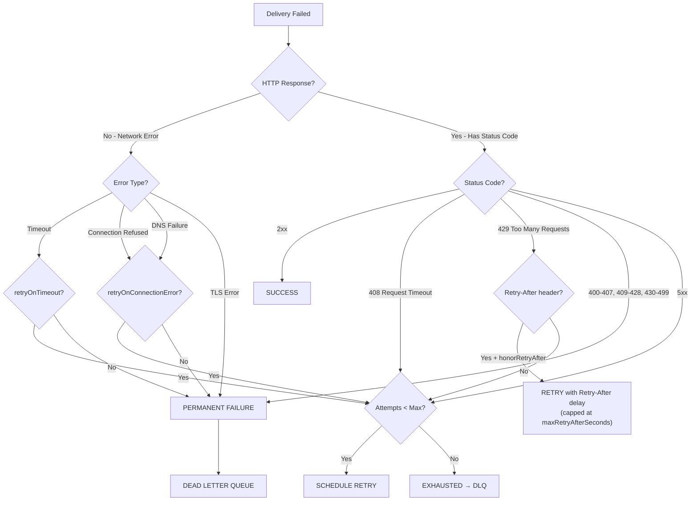

# Retry Policies

## Overview

EventRelay's retry system determines **whether** a failed delivery should be retried, **how many times**, and under what conditions. Retry policies are configurable per-tenant with a sensible default policy. The system distinguishes between retryable failures (server errors, timeouts) and permanent failures (client errors indicating misconfiguration) to avoid wasting resources on deliveries that will never succeed.

> [!IMPORTANT]
> Retry policies control the **decision** to retry. The **timing** of retries (backoff delays) is handled by the [Backoff Algorithms](./Backoff_Algorithms.md) component. Together, they form the complete retry engine.

---

## Default Retry Policy

| Parameter | Default | Description |
|-----------|---------|-------------|
| `maxAttempts` | 5 | Total delivery attempts (1 initial + 4 retries) |
| `retryableStatusCodes` | `408, 429, 500-599` | HTTP status codes that trigger retry |
| `permanentFailureCodes` | `400-407, 409-428, 430-499` | Codes treated as permanent failures |
| `retryOnTimeout` | `true` | Retry on connection/read/write timeouts |
| `retryOnConnectionError` | `true` | Retry on DNS, TCP, TLS failures |
| `honorRetryAfter` | `true` | Respect `Retry-After` header from 429 responses |
| `maxRetryAfterSeconds` | 3600 | Cap on `Retry-After` values (1 hour max) |

---

## Retry Decision Matrix



---

## Retry Policy Interface and Implementations

```java
package com.eventrelay.dispatch.retry;

import com.eventrelay.dispatch.http.DeliveryResult;

/**
 * Strategy interface for retry decisions. Implementations determine
 * whether a failed delivery should be retried based on the failure
 * characteristics and attempt history.
 */
public interface RetryPolicy {

    /**
     * Evaluates whether the delivery should be retried.
     *
     * @param result The delivery result (contains status code, error info)
     * @param attemptNumber Current attempt number (1-based)
     * @param maxAttempts Maximum allowed attempts
     * @return RetryDecision indicating whether and how to retry
     */
    RetryDecision evaluate(DeliveryResult result, int attemptNumber, int maxAttempts);

    /**
     * Returns the policy name for logging and configuration.
     */
    String getName();
}
```

```java
package com.eventrelay.dispatch.retry;

import java.time.Duration;

/**
 * The outcome of a retry policy evaluation.
 */
public record RetryDecision(
    Action action,
    String reason,
    Duration overrideDelay  // Optional: overrides backoff (e.g., for Retry-After)
) {
    public enum Action {
        /** Retry the delivery with standard backoff */
        RETRY,
        /** Retry the delivery with a specific delay (e.g., Retry-After) */
        RETRY_WITH_DELAY,
        /** Do not retry — permanent failure */
        PERMANENT_FAILURE,
        /** Do not retry — all attempts exhausted */
        EXHAUSTED
    }

    public static RetryDecision retry(String reason) {
        return new RetryDecision(Action.RETRY, reason, null);
    }

    public static RetryDecision retryWithDelay(String reason, Duration delay) {
        return new RetryDecision(Action.RETRY_WITH_DELAY, reason, delay);
    }

    public static RetryDecision permanentFailure(String reason) {
        return new RetryDecision(Action.PERMANENT_FAILURE, reason, null);
    }

    public static RetryDecision exhausted(String reason) {
        return new RetryDecision(Action.EXHAUSTED, reason, null);
    }

    public boolean shouldRetry() {
        return action == Action.RETRY || action == Action.RETRY_WITH_DELAY;
    }
}
```

---

## Default Retry Policy Implementation

```java
package com.eventrelay.dispatch.retry;

import com.eventrelay.dispatch.http.DeliveryResult;
import com.eventrelay.dispatch.http.ResponseClassification;

import java.time.Duration;
import java.util.Set;

/**
 * Default retry policy used when no tenant-specific policy is configured.
 * Follows industry-standard practices (similar to Stripe, GitHub, Svix).
 *
 * <p>Key decisions:
 * <ul>
 *   <li>5xx → always retry (server error, likely transient)</li>
 *   <li>429 → retry, honoring Retry-After header</li>
 *   <li>408 → retry (request timeout, transient)</li>
 *   <li>4xx (other) → permanent failure (client error, won't change)</li>
 *   <li>Network errors → retry (DNS, connection, timeout)</li>
 *   <li>TLS errors → permanent failure (certificate issue)</li>
 * </ul>
 */
public class DefaultRetryPolicy implements RetryPolicy {

    private static final Set<Integer> RETRYABLE_STATUS_CODES = Set.of(
            408, // Request Timeout
            429  // Too Many Requests
            // All 5xx codes are handled separately
    );

    private static final Set<Integer> NON_RETRYABLE_STATUS_CODES = Set.of(
            400, // Bad Request
            401, // Unauthorized
            403, // Forbidden
            404, // Not Found
            405, // Method Not Allowed
            406, // Not Acceptable
            409, // Conflict
            410, // Gone
            411, // Length Required
            413, // Payload Too Large
            414, // URI Too Long
            415, // Unsupported Media Type
            422  // Unprocessable Entity
    );

    private final RetryPolicyConfig config;

    public DefaultRetryPolicy(RetryPolicyConfig config) {
        this.config = config;
    }

    @Override
    public RetryDecision evaluate(DeliveryResult result, int attemptNumber, int maxAttempts) {
        // Check if max attempts exhausted
        if (attemptNumber >= maxAttempts) {
            return RetryDecision.exhausted(
                    String.format("Max attempts (%d) exhausted. Last status: %d",
                            maxAttempts, result.statusCode()));
        }

        // Successful delivery — no retry needed
        if (result.isSuccess()) {
            return RetryDecision.permanentFailure("Delivery successful — no retry needed");
        }

        // Network-level failure (no HTTP response)
        if (result.statusCode() == 0) {
            return evaluateNetworkError(result);
        }

        // HTTP response received — classify by status code
        return evaluateStatusCode(result);
    }

    private RetryDecision evaluateNetworkError(DeliveryResult result) {
        String errorMsg = result.responseBody(); // Contains error message for network errors

        // TLS errors are typically permanent (bad cert, protocol mismatch)
        if (errorMsg != null && (errorMsg.contains("ssl") || errorMsg.contains("tls")
                || errorMsg.contains("certificate"))) {
            return RetryDecision.permanentFailure(
                    "TLS error (non-retryable): " + errorMsg);
        }

        // Timeout errors are retryable
        if (config.isRetryOnTimeout() && errorMsg != null
                && errorMsg.contains("timeout")) {
            return RetryDecision.retry("Timeout error: " + errorMsg);
        }

        // Connection errors are retryable
        if (config.isRetryOnConnectionError()) {
            return RetryDecision.retry("Network error: " + errorMsg);
        }

        return RetryDecision.permanentFailure("Network error (retry disabled): " + errorMsg);
    }

    private RetryDecision evaluateStatusCode(DeliveryResult result) {
        int statusCode = result.statusCode();

        // 429 Too Many Requests — honor Retry-After header
        if (statusCode == 429) {
            Long retryAfter = result.getRetryAfterSeconds();
            if (retryAfter != null && config.isHonorRetryAfter()) {
                long cappedDelay = Math.min(retryAfter, config.getMaxRetryAfterSeconds());
                return RetryDecision.retryWithDelay(
                        "Rate limited (429). Retry-After: " + retryAfter + "s",
                        Duration.ofSeconds(cappedDelay));
            }
            return RetryDecision.retry("Rate limited (429), no Retry-After header");
        }

        // 5xx Server Error — always retryable
        if (statusCode >= 500) {
            return RetryDecision.retry(
                    "Server error (" + statusCode + "), will retry");
        }

        // 408 Request Timeout — retryable
        if (statusCode == 408) {
            return RetryDecision.retry("Request timeout (408), will retry");
        }

        // All other 4xx — permanent failure
        if (statusCode >= 400 && statusCode < 500) {
            return RetryDecision.permanentFailure(
                    "Client error (" + statusCode + "), not retryable");
        }

        // Unexpected status code — retry to be safe
        return RetryDecision.retry(
                "Unexpected status code (" + statusCode + "), retrying");
    }

    @Override
    public String getName() {
        return "default";
    }
}
```

---

## Per-Tenant Retry Policy Configuration

```java
package com.eventrelay.dispatch.retry;

import org.springframework.boot.context.properties.ConfigurationProperties;

@ConfigurationProperties(prefix = "eventrelay.retry")
public class RetryPolicyConfig {

    /** Maximum total delivery attempts (initial + retries) */
    private int maxAttempts = 5;

    /** Whether to retry on connection/read/write timeouts */
    private boolean retryOnTimeout = true;

    /** Whether to retry on connection refused, DNS failure, etc. */
    private boolean retryOnConnectionError = true;

    /** Whether to honor the Retry-After header from 429 responses */
    private boolean honorRetryAfter = true;

    /** Maximum Retry-After value we'll honor (seconds) */
    private long maxRetryAfterSeconds = 3600;

    /** Whether to disable a subscription after N consecutive failures */
    private boolean autoDisableOnConsecutiveFailures = true;

    /** Number of consecutive failures before auto-disabling subscription */
    private int consecutiveFailureThreshold = 50;

    // Getters and setters
    public int getMaxAttempts() { return maxAttempts; }
    public void setMaxAttempts(int maxAttempts) { this.maxAttempts = maxAttempts; }
    public boolean isRetryOnTimeout() { return retryOnTimeout; }
    public void setRetryOnTimeout(boolean retryOnTimeout) { this.retryOnTimeout = retryOnTimeout; }
    public boolean isRetryOnConnectionError() { return retryOnConnectionError; }
    public void setRetryOnConnectionError(boolean v) { this.retryOnConnectionError = v; }
    public boolean isHonorRetryAfter() { return honorRetryAfter; }
    public void setHonorRetryAfter(boolean honorRetryAfter) { this.honorRetryAfter = honorRetryAfter; }
    public long getMaxRetryAfterSeconds() { return maxRetryAfterSeconds; }
    public void setMaxRetryAfterSeconds(long v) { this.maxRetryAfterSeconds = v; }
    public boolean isAutoDisableOnConsecutiveFailures() { return autoDisableOnConsecutiveFailures; }
    public void setAutoDisableOnConsecutiveFailures(boolean v) { this.autoDisableOnConsecutiveFailures = v; }
    public int getConsecutiveFailureThreshold() { return consecutiveFailureThreshold; }
    public void setConsecutiveFailureThreshold(int v) { this.consecutiveFailureThreshold = v; }
}
```

### Per-Tenant Policy DTO (Stored in PostgreSQL)

```java
package com.eventrelay.dispatch.retry;

import java.util.Set;
import java.util.UUID;

/**
 * Tenant-specific retry policy configuration. Stored in the `tenant_retry_policies`
 * table and merged with the system default at runtime.
 */
public record TenantRetryPolicy(
    UUID tenantId,
    int maxAttempts,                        // Override default max attempts
    Set<Integer> additionalRetryableCodes,  // Custom retryable status codes
    Set<Integer> additionalNonRetryableCodes,// Custom non-retryable codes
    boolean retryOnTimeout,
    boolean retryOnConnectionError,
    boolean honorRetryAfter,
    long maxRetryAfterSeconds
) {
    /**
     * Merges tenant-specific overrides with the system default policy.
     */
    public static TenantRetryPolicy withDefaults(UUID tenantId, RetryPolicyConfig defaults) {
        return new TenantRetryPolicy(
                tenantId,
                defaults.getMaxAttempts(),
                Set.of(),
                Set.of(),
                defaults.isRetryOnTimeout(),
                defaults.isRetryOnConnectionError(),
                defaults.isHonorRetryAfter(),
                defaults.getMaxRetryAfterSeconds()
        );
    }
}
```

### Tenant Policy Database Schema

```sql
CREATE TABLE tenant_retry_policies (
    tenant_id                   UUID PRIMARY KEY,
    max_attempts                INTEGER NOT NULL DEFAULT 5,
    additional_retryable_codes  INTEGER[] DEFAULT '{}',
    additional_non_retryable_codes INTEGER[] DEFAULT '{}',
    retry_on_timeout            BOOLEAN NOT NULL DEFAULT true,
    retry_on_connection_error   BOOLEAN NOT NULL DEFAULT true,
    honor_retry_after           BOOLEAN NOT NULL DEFAULT true,
    max_retry_after_seconds     BIGINT NOT NULL DEFAULT 3600,
    created_at                  TIMESTAMP WITH TIME ZONE NOT NULL DEFAULT NOW(),
    updated_at                  TIMESTAMP WITH TIME ZONE NOT NULL DEFAULT NOW(),

    CONSTRAINT fk_tenant FOREIGN KEY (tenant_id) REFERENCES tenants(id)
);

-- Example: tenant that needs more retry attempts and custom codes
INSERT INTO tenant_retry_policies (tenant_id, max_attempts, additional_retryable_codes)
VALUES ('550e8400-e29b-41d4-a716-446655440001', 10, '{409, 423}');
```

---

## Retry Policy Resolver

```java
package com.eventrelay.dispatch.retry;

import org.springframework.stereotype.Component;

import java.util.Map;
import java.util.UUID;
import java.util.concurrent.ConcurrentHashMap;

/**
 * Resolves the effective retry policy for a given tenant. Uses a cache
 * to avoid repeated database lookups.
 */
@Component
public class RetryPolicyResolver {

    private final RetryPolicyConfig defaultConfig;
    private final TenantRetryPolicyRepository repository;
    private final Map<UUID, RetryPolicy> policyCache = new ConcurrentHashMap<>();

    public RetryPolicyResolver(RetryPolicyConfig defaultConfig,
                                TenantRetryPolicyRepository repository) {
        this.defaultConfig = defaultConfig;
        this.repository = repository;
    }

    /**
     * Resolves the retry policy for a tenant. Falls back to the default
     * policy if no tenant-specific policy exists.
     */
    public RetryPolicy resolve(UUID tenantId) {
        return policyCache.computeIfAbsent(tenantId, id -> {
            return repository.findByTenantId(id)
                    .map(tenantPolicy -> (RetryPolicy) new TenantAwareRetryPolicy(
                            tenantPolicy, defaultConfig))
                    .orElseGet(() -> new DefaultRetryPolicy(defaultConfig));
        });
    }

    /**
     * Invalidates the cached policy for a tenant (called when the tenant
     * updates their retry configuration).
     */
    public void invalidate(UUID tenantId) {
        policyCache.remove(tenantId);
    }

    /**
     * Clears the entire policy cache (called on configuration changes).
     */
    public void clearCache() {
        policyCache.clear();
    }
}
```

---

## Retry Scheduler

```java
package com.eventrelay.dispatch.retry;

import com.eventrelay.dispatch.backoff.BackoffCalculator;
import com.eventrelay.dispatch.http.DeliveryResult;
import com.eventrelay.dispatch.state.DeliveryState;
import com.eventrelay.dispatch.state.DeliveryStateService;
import com.eventrelay.queue.SqsMessageProducer;
import com.eventrelay.queue.model.DeliveryMessage;
import io.micrometer.core.instrument.MeterRegistry;
import org.slf4j.Logger;
import org.slf4j.LoggerFactory;
import org.springframework.stereotype.Component;

import java.time.Duration;

@Component
public class RetryScheduler {

    private static final Logger log = LoggerFactory.getLogger(RetryScheduler.class);

    private final RetryPolicyResolver policyResolver;
    private final BackoffCalculator backoffCalculator;
    private final SqsMessageProducer messageProducer;
    private final DeliveryStateService stateService;
    private final MeterRegistry meterRegistry;

    public RetryScheduler(RetryPolicyResolver policyResolver,
                           BackoffCalculator backoffCalculator,
                           SqsMessageProducer messageProducer,
                           DeliveryStateService stateService,
                           MeterRegistry meterRegistry) {
        this.policyResolver = policyResolver;
        this.backoffCalculator = backoffCalculator;
        this.messageProducer = messageProducer;
        this.stateService = stateService;
        this.meterRegistry = meterRegistry;
    }

    /**
     * Evaluates the retry policy and schedules the next attempt if applicable.
     */
    public void scheduleRetry(DeliveryMessage message, DeliveryResult result) {
        RetryPolicy policy = policyResolver.resolve(message.getTenantId());
        RetryDecision decision = policy.evaluate(
                result, message.getAttemptNumber(), message.getMaxAttempts());

        if (!decision.shouldRetry()) {
            log.info("[{}] Retry decision: no retry. Reason: {}",
                    message.getDeliveryId(), decision.reason());
            moveToDeadLetterQueue(message, result);
            return;
        }

        // Calculate delay
        Duration delay;
        if (decision.overrideDelay() != null) {
            delay = decision.overrideDelay(); // e.g., from Retry-After header
        } else {
            delay = backoffCalculator.calculateDelay(message.getAttemptNumber());
        }

        // Update state to RETRYING
        stateService.transition(
                message.getDeliveryId(),
                DeliveryState.DISPATCHING,
                DeliveryState.RETRYING,
                decision.reason()
        );

        // Re-enqueue with delay
        DeliveryMessage retryMessage = createRetryMessage(message);
        messageProducer.sendWithDelay(retryMessage, delay);

        log.info("[{}] Retry scheduled: attempt={}/{}, delay={}s, reason={}",
                message.getDeliveryId(),
                message.getAttemptNumber() + 1,
                message.getMaxAttempts(),
                delay.toSeconds(),
                decision.reason());

        meterRegistry.counter("retry.scheduled",
                "attempt", String.valueOf(message.getAttemptNumber() + 1)).increment();
    }

    /**
     * Handles permanent failures — moves directly to DLQ without retry.
     */
    public void handlePermanentFailure(DeliveryMessage message, DeliveryResult result) {
        log.info("[{}] Permanent failure: status={}, moving to DLQ",
                message.getDeliveryId(), result.statusCode());

        stateService.transition(
                message.getDeliveryId(),
                DeliveryState.DISPATCHING,
                DeliveryState.FAILED,
                "Permanent failure: HTTP " + result.statusCode()
        );

        moveToDeadLetterQueue(message, result);
    }

    /**
     * Moves a delivery to the dead-letter queue.
     */
    public void moveToDeadLetterQueue(DeliveryMessage message, DeliveryResult result) {
        stateService.transition(
                message.getDeliveryId(),
                // Could be FAILED or EXHAUSTED depending on path
                stateService.getCurrentState(message.getDeliveryId()),
                DeliveryState.DEAD_LETTERED,
                "Moved to DLQ: " + result.classification()
        );

        messageProducer.sendToDeadLetterQueue(message, result);
        meterRegistry.counter("retry.dead_lettered").increment();
    }

    private DeliveryMessage createRetryMessage(DeliveryMessage original) {
        DeliveryMessage retry = new DeliveryMessage();
        retry.setDeliveryId(original.getDeliveryId());
        retry.setEventId(original.getEventId());
        retry.setSubscriptionId(original.getSubscriptionId());
        retry.setTenantId(original.getTenantId());
        retry.setTargetUrl(original.getTargetUrl());
        retry.setEventType(original.getEventType());
        retry.setPayload(original.getPayload());
        retry.setHeaders(original.getHeaders());
        retry.setSigningSecret(original.getSigningSecret());
        retry.setAttemptNumber(original.getAttemptNumber() + 1);
        retry.setMaxAttempts(original.getMaxAttempts());
        return retry;
    }
}
```

---

## YAML Configuration

```yaml
eventrelay:
  retry:
    max-attempts: 5
    retry-on-timeout: true
    retry-on-connection-error: true
    honor-retry-after: true
    max-retry-after-seconds: 3600
    auto-disable-on-consecutive-failures: true
    consecutive-failure-threshold: 50
```

---

## Comparison with Industry Standards

| Platform | Max Attempts | Retryable Codes | Backoff Strategy |
|----------|-------------|-----------------|------------------|
| **EventRelay** (default) | 5 | 408, 429, 5xx | Exponential + jitter |
| **Stripe** | 8 | 5xx, network errors | Exponential |
| **GitHub** | 3 | 5xx, network errors | Exponential with 10s base |
| **Svix** | 5 | 5xx, timeouts | Exponential + jitter |
| **Twilio** | 4 | 5xx, timeouts | Fixed intervals |

---

## Production Considerations

1. **Auto-Disable Subscriptions**: After 50 consecutive failures (configurable), the subscription is automatically disabled to prevent wasting resources on a permanently broken endpoint. The tenant receives a notification.

2. **TLS Errors Are Permanent**: Certificate validation failures, protocol mismatches, and expired certificates are treated as permanent failures because they won't resolve without human intervention.

3. **429 Rate Limiting**: We honor the `Retry-After` header but cap it at 1 hour. Malicious or misconfigured servers can't make us wait indefinitely.

4. **Policy Caching**: Tenant retry policies are cached in memory (`ConcurrentHashMap`) to avoid database lookups on every delivery. Cache entries are invalidated when the tenant updates their policy via the API.

5. **Custom Retryable Codes**: Some APIs use non-standard status codes (e.g., 423 Locked, 409 Conflict) for transient errors. Tenants can add these to their custom retryable codes list.

---

## Related Documents

- [Backoff Algorithms](./Backoff_Algorithms.md) — How retry delays are calculated
- [Delivery States](./Delivery_States.md) — State transitions driven by retry decisions
- [Dead Letter Queue](./Dead_Letter_Queue.md) — Where exhausted retries end up
- [HTTP Delivery](./HTTP_Delivery.md) — Status code classification
