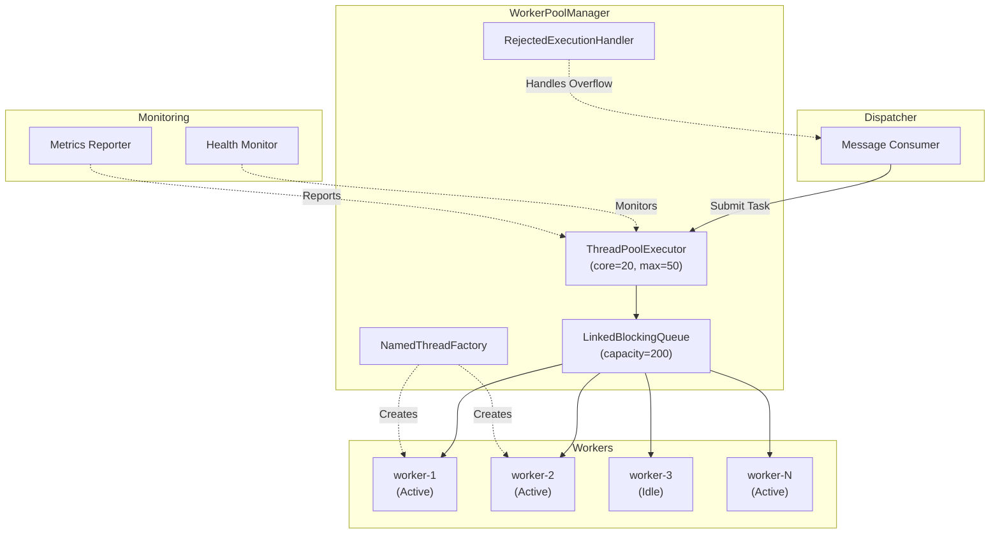
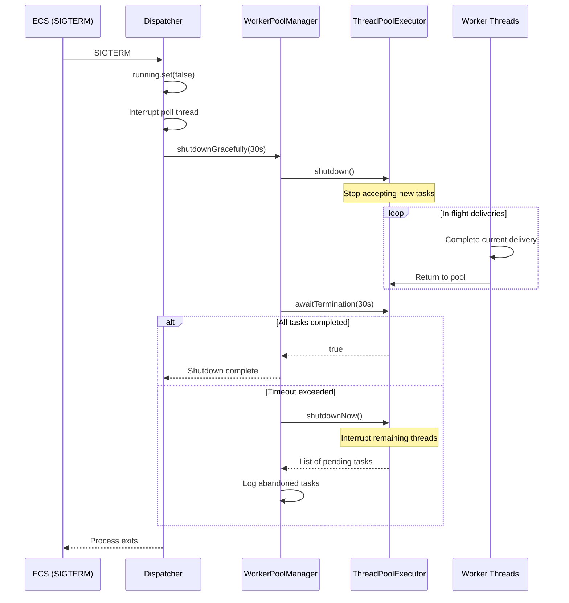

# Worker Threading Model

## Overview

EventRelay's dispatcher uses a managed thread pool to execute webhook deliveries concurrently. The worker model is designed for high throughput under load, graceful degradation under pressure, and clean shutdown with in-flight delivery completion. Each worker thread runs a single delivery through the full pipeline — from rate checking to HTTP POST to result recording.

> [!NOTE]
> The default configuration of **20 worker threads** is tuned for a single ECS task with 1 vCPU / 2 GB memory. Since webhook delivery is I/O-bound (waiting on HTTP responses), the thread count can significantly exceed CPU core count.

---

## Thread Pool Architecture



---

## WorkerPoolManager Implementation

```java
package com.eventrelay.dispatch.worker;

import io.micrometer.core.instrument.MeterRegistry;
import io.micrometer.core.instrument.Tags;
import io.micrometer.core.instrument.binder.jvm.ExecutorServiceMetrics;
import org.slf4j.Logger;
import org.slf4j.LoggerFactory;
import org.springframework.stereotype.Component;

import jakarta.annotation.PostConstruct;
import jakarta.annotation.PreDestroy;
import java.util.concurrent.*;
import java.util.concurrent.atomic.AtomicInteger;

/**
 * Manages the worker thread pool for webhook delivery execution.
 *
 * <p>Thread pool sizing rationale for I/O-bound work:
 * <pre>
 *   Optimal threads = N_cpu × (1 + W/C)
 *   Where W = wait time (avg 500ms for HTTP), C = compute time (avg 5ms)
 *   For 2 CPUs: 2 × (1 + 500/5) = 202 threads (theoretical max)
 *   Practical limit: 20-50 threads per instance to limit connection pressure
 * </pre>
 */
@Component
public class WorkerPoolManager {

    private static final Logger log = LoggerFactory.getLogger(WorkerPoolManager.class);

    private final WorkerPoolConfig config;
    private final MeterRegistry meterRegistry;

    private ThreadPoolExecutor executor;
    private ScheduledExecutorService healthChecker;

    public WorkerPoolManager(WorkerPoolConfig config, MeterRegistry meterRegistry) {
        this.config = config;
        this.meterRegistry = meterRegistry;
    }

    @PostConstruct
    public void initialize() {
        BlockingQueue<Runnable> workQueue = new LinkedBlockingQueue<>(
                config.getQueueCapacity()
        );

        executor = new ThreadPoolExecutor(
                config.getCorePoolSize(),      // Core threads (kept alive)
                config.getMaxPoolSize(),       // Maximum threads under load
                config.getKeepAliveSeconds(),  // Idle thread keep-alive
                TimeUnit.SECONDS,
                workQueue,
                new NamedThreadFactory("delivery-worker"),
                new BackpressureRejectionHandler()
        );

        // Allow core threads to time out when idle (important for scale-down)
        executor.allowCoreThreadTimeOut(config.isAllowCoreThreadTimeout());

        // Pre-start core threads for immediate availability
        if (config.isPrestartCoreThreads()) {
            executor.prestartAllCoreThreads();
            log.info("Pre-started {} core worker threads", config.getCorePoolSize());
        }

        // Register Micrometer metrics for the thread pool
        ExecutorServiceMetrics.monitor(
                meterRegistry, executor, "delivery.worker.pool",
                Tags.of("type", "webhook-delivery")
        );

        // Start health monitoring
        startHealthMonitor();

        log.info("Worker pool initialized: core={}, max={}, queueCapacity={}",
                config.getCorePoolSize(), config.getMaxPoolSize(),
                config.getQueueCapacity());
    }

    /**
     * Returns the underlying executor for task submission.
     */
    public ExecutorService getExecutor() {
        return executor;
    }

    /**
     * Returns the number of currently active (executing) worker threads.
     */
    public int getActiveWorkerCount() {
        return executor.getActiveCount();
    }

    /**
     * Returns the number of tasks waiting in the queue.
     */
    public int getQueueDepth() {
        return executor.getQueue().size();
    }

    /**
     * Calculates available capacity (how many more tasks can be accepted
     * before triggering backpressure).
     */
    public int getAvailableCapacity() {
        return config.getQueueCapacity() - executor.getQueue().size();
    }

    /**
     * Returns true if the worker pool is overloaded (queue depth exceeds
     * the backpressure threshold).
     */
    public boolean isOverloaded() {
        return getQueueDepth() >= config.getBackpressureThreshold();
    }

    /**
     * Graceful shutdown: stops accepting new tasks, waits for in-flight
     * deliveries to complete, then force-terminates if timeout exceeded.
     */
    public void shutdownGracefully(int timeoutSeconds) {
        log.info("Initiating graceful shutdown (timeout={}s)", timeoutSeconds);

        // Stop the health checker first
        if (healthChecker != null) {
            healthChecker.shutdownNow();
        }

        // Phase 1: Stop accepting new tasks
        executor.shutdown();

        try {
            // Phase 2: Wait for in-flight deliveries to complete
            if (!executor.awaitTermination(timeoutSeconds, TimeUnit.SECONDS)) {
                log.warn("Graceful shutdown timed out after {}s. " +
                         "Force-terminating {} tasks",
                        timeoutSeconds, executor.getActiveCount());

                // Phase 3: Force terminate remaining tasks
                var remaining = executor.shutdownNow();
                log.warn("Force-terminated. {} tasks were in queue", remaining.size());

                // Give interrupted tasks a brief window to clean up
                if (!executor.awaitTermination(5, TimeUnit.SECONDS)) {
                    log.error("Worker pool did not terminate cleanly");
                }
            } else {
                log.info("Graceful shutdown completed. All in-flight deliveries finished.");
            }
        } catch (InterruptedException e) {
            executor.shutdownNow();
            Thread.currentThread().interrupt();
        }
    }

    /**
     * Periodic health monitoring of the worker pool. Logs warnings when
     * the pool approaches saturation and emits gauge metrics.
     */
    private void startHealthMonitor() {
        healthChecker = Executors.newSingleThreadScheduledExecutor(
                r -> new Thread(r, "worker-health-monitor")
        );

        healthChecker.scheduleAtFixedRate(() -> {
            try {
                int active = executor.getActiveCount();
                int poolSize = executor.getPoolSize();
                int queueSize = executor.getQueue().size();
                long completed = executor.getCompletedTaskCount();

                // Saturation warning
                double utilization = poolSize > 0
                        ? (double) active / poolSize
                        : 0.0;

                if (utilization > 0.9) {
                    log.warn("Worker pool near saturation: active={}/{}, queue={}, completed={}",
                            active, poolSize, queueSize, completed);
                } else {
                    log.debug("Worker pool health: active={}/{}, queue={}, completed={}",
                            active, poolSize, queueSize, completed);
                }

                // Emit custom gauges
                meterRegistry.gauge("worker.pool.utilization", utilization);
                meterRegistry.gauge("worker.pool.queue.depth", queueSize);
            } catch (Exception e) {
                log.warn("Health monitor error", e);
            }
        }, 10, config.getHealthCheckIntervalSeconds(), TimeUnit.SECONDS);
    }

    /**
     * Thread pool status snapshot for health endpoints and dashboards.
     */
    public WorkerPoolStatus getStatus() {
        return new WorkerPoolStatus(
                executor.getCorePoolSize(),
                executor.getMaximumPoolSize(),
                executor.getPoolSize(),
                executor.getActiveCount(),
                executor.getQueue().size(),
                executor.getCompletedTaskCount(),
                executor.getTaskCount(),
                executor.getLargestPoolSize()
        );
    }
}
```

---

## Named Thread Factory

```java
package com.eventrelay.dispatch.worker;

import java.util.concurrent.ThreadFactory;
import java.util.concurrent.atomic.AtomicInteger;

/**
 * Creates named daemon threads for easy identification in thread dumps,
 * logs, and monitoring tools.
 */
public class NamedThreadFactory implements ThreadFactory {

    private final AtomicInteger threadNumber = new AtomicInteger(1);
    private final String namePrefix;
    private final Thread.UncaughtExceptionHandler exceptionHandler;

    public NamedThreadFactory(String namePrefix) {
        this.namePrefix = namePrefix;
        this.exceptionHandler = (thread, throwable) -> {
            System.err.printf("Uncaught exception in thread %s: %s%n",
                    thread.getName(), throwable.getMessage());
            throwable.printStackTrace(System.err);
        };
    }

    @Override
    public Thread newThread(Runnable r) {
        Thread t = new Thread(r, namePrefix + "-" + threadNumber.getAndIncrement());
        t.setDaemon(false); // Non-daemon: JVM waits for completion on shutdown
        t.setPriority(Thread.NORM_PRIORITY);
        t.setUncaughtExceptionHandler(exceptionHandler);
        return t;
    }
}
```

---

## Backpressure Rejection Handler

```java
package com.eventrelay.dispatch.worker;

import io.micrometer.core.instrument.Metrics;
import org.slf4j.Logger;
import org.slf4j.LoggerFactory;

import java.util.concurrent.RejectedExecutionHandler;
import java.util.concurrent.ThreadPoolExecutor;

/**
 * Custom rejection handler that blocks the submitting thread briefly
 * rather than throwing an exception. This creates natural backpressure
 * on the SQS consumer — if workers can't keep up, polling slows down.
 *
 * <p>Alternatives considered:
 * <ul>
 *   <li>AbortPolicy: Throws exception, requires nack handling upstream</li>
 *   <li>CallerRunsPolicy: Executes in consumer thread, blocks polling</li>
 *   <li>DiscardPolicy: Silently drops tasks — unacceptable for webhooks</li>
 * </ul>
 */
public class BackpressureRejectionHandler implements RejectedExecutionHandler {

    private static final Logger log = LoggerFactory.getLogger(
            BackpressureRejectionHandler.class);

    private static final long BACKOFF_MS = 100;
    private static final int MAX_RETRIES = 50; // 5 seconds total

    @Override
    public void rejectedExecution(Runnable r, ThreadPoolExecutor executor) {
        if (executor.isShutdown()) {
            log.warn("Task rejected: executor is shut down");
            Metrics.counter("worker.pool.rejected", "reason", "shutdown").increment();
            return;
        }

        Metrics.counter("worker.pool.rejected", "reason", "queue_full").increment();
        log.warn("Worker pool queue full (size={}). Applying backpressure.",
                executor.getQueue().size());

        // Attempt to re-queue with brief backoff
        for (int attempt = 0; attempt < MAX_RETRIES; attempt++) {
            try {
                if (executor.getQueue().offer(r, BACKOFF_MS, java.util.concurrent.TimeUnit.MILLISECONDS)) {
                    return; // Successfully re-queued
                }
            } catch (InterruptedException e) {
                Thread.currentThread().interrupt();
                log.error("Interrupted while applying backpressure");
                return;
            }
        }

        log.error("Failed to queue task after {} retries. Task will be lost " +
                  "and message will be redelivered by SQS after visibility timeout.",
                MAX_RETRIES);
        Metrics.counter("worker.pool.rejected", "reason", "exhausted").increment();
    }
}
```

---

## Worker Pool Configuration

```java
package com.eventrelay.dispatch.worker;

import org.springframework.boot.context.properties.ConfigurationProperties;
import org.springframework.validation.annotation.Validated;

import jakarta.validation.constraints.Min;
import jakarta.validation.constraints.Positive;

@Validated
@ConfigurationProperties(prefix = "eventrelay.worker-pool")
public class WorkerPoolConfig {

    /** Core number of worker threads kept alive */
    @Min(1)
    private int corePoolSize = 20;

    /** Maximum worker threads under peak load */
    @Min(1)
    private int maxPoolSize = 50;

    /** Internal task queue capacity */
    @Positive
    private int queueCapacity = 200;

    /** Idle thread keep-alive time (seconds) */
    @Positive
    private long keepAliveSeconds = 60;

    /** Allow core threads to time out and be reclaimed */
    private boolean allowCoreThreadTimeout = true;

    /** Pre-start all core threads on initialization */
    private boolean prestartCoreThreads = true;

    /** Queue depth threshold that triggers backpressure */
    @Positive
    private int backpressureThreshold = 100;

    /** Health check interval in seconds */
    @Positive
    private int healthCheckIntervalSeconds = 30;

    // Getters and setters
    public int getCorePoolSize() { return corePoolSize; }
    public void setCorePoolSize(int corePoolSize) { this.corePoolSize = corePoolSize; }
    public int getMaxPoolSize() { return maxPoolSize; }
    public void setMaxPoolSize(int maxPoolSize) { this.maxPoolSize = maxPoolSize; }
    public int getQueueCapacity() { return queueCapacity; }
    public void setQueueCapacity(int queueCapacity) { this.queueCapacity = queueCapacity; }
    public long getKeepAliveSeconds() { return keepAliveSeconds; }
    public void setKeepAliveSeconds(long keepAliveSeconds) { this.keepAliveSeconds = keepAliveSeconds; }
    public boolean isAllowCoreThreadTimeout() { return allowCoreThreadTimeout; }
    public void setAllowCoreThreadTimeout(boolean allowCoreThreadTimeout) { this.allowCoreThreadTimeout = allowCoreThreadTimeout; }
    public boolean isPrestartCoreThreads() { return prestartCoreThreads; }
    public void setPrestartCoreThreads(boolean prestartCoreThreads) { this.prestartCoreThreads = prestartCoreThreads; }
    public int getBackpressureThreshold() { return backpressureThreshold; }
    public void setBackpressureThreshold(int backpressureThreshold) { this.backpressureThreshold = backpressureThreshold; }
    public int getHealthCheckIntervalSeconds() { return healthCheckIntervalSeconds; }
    public void setHealthCheckIntervalSeconds(int healthCheckIntervalSeconds) { this.healthCheckIntervalSeconds = healthCheckIntervalSeconds; }
}
```

### Application Configuration (YAML)

```yaml
eventrelay:
  worker-pool:
    core-pool-size: 20
    max-pool-size: 50
    queue-capacity: 200
    keep-alive-seconds: 60
    allow-core-thread-timeout: true
    prestart-core-threads: true
    backpressure-threshold: 100
    health-check-interval-seconds: 30
```

---

## Thread Pool Sizing Guide

| Deployment Size | vCPU | Memory | Core Threads | Max Threads | Queue Capacity |
|----------------|------|--------|-------------|-------------|----------------|
| **Small** | 0.5 | 1 GB | 10 | 25 | 100 |
| **Medium** (default) | 1 | 2 GB | 20 | 50 | 200 |
| **Large** | 2 | 4 GB | 40 | 100 | 400 |
| **X-Large** | 4 | 8 GB | 80 | 200 | 800 |

> [!TIP]
> Since webhook delivery is I/O-bound (mostly waiting for HTTP responses), thread count can be 10-50× the CPU core count. Monitor `worker.pool.utilization` and adjust: if consistently >90%, increase `maxPoolSize`; if consistently <30%, decrease `corePoolSize`.

---

## Graceful Shutdown Sequence



> [!WARNING]
> ECS sends SIGTERM and waits for `stopTimeout` (default 30s) before SIGKILL. Ensure `eventrelay.dispatcher.shutdown-timeout-seconds` is less than the ECS `stopTimeout` to allow clean exit. Recommended: set shutdown timeout to 25s with ECS stop timeout of 30s.

---

## Worker Pool Status

```java
package com.eventrelay.dispatch.worker;

/**
 * Snapshot of worker pool state for health endpoints and dashboards.
 */
public record WorkerPoolStatus(
    int corePoolSize,
    int maxPoolSize,
    int currentPoolSize,
    int activeThreads,
    int queuedTasks,
    long completedTasks,
    long totalTasks,
    int largestPoolSize
) {
    public double utilization() {
        return currentPoolSize > 0
                ? (double) activeThreads / currentPoolSize
                : 0.0;
    }

    public boolean isHealthy() {
        return currentPoolSize > 0 && utilization() < 0.95;
    }
}
```

---

## Health Endpoint Integration

```java
@RestController
@RequestMapping("/actuator")
public class WorkerHealthEndpoint {

    private final WorkerPoolManager workerPool;

    public WorkerHealthEndpoint(WorkerPoolManager workerPool) {
        this.workerPool = workerPool;
    }

    @GetMapping("/worker-pool")
    public WorkerPoolStatus getWorkerPoolStatus() {
        return workerPool.getStatus();
    }
}
```

**Example response:**
```json
{
  "corePoolSize": 20,
  "maxPoolSize": 50,
  "currentPoolSize": 20,
  "activeThreads": 14,
  "queuedTasks": 3,
  "completedTasks": 158432,
  "totalTasks": 158449,
  "largestPoolSize": 35,
  "utilization": 0.7,
  "healthy": true
}
```

---

## Production Considerations

1. **Thread Naming**: All worker threads are named `delivery-worker-N` for easy identification in thread dumps (`jstack`), logs, and APM tools.

2. **Non-Daemon Threads**: Worker threads are non-daemon so the JVM waits for them during shutdown rather than killing them abruptly.

3. **Queue Capacity**: The bounded queue (default 200) prevents unbounded memory growth. If the queue fills, the `BackpressureRejectionHandler` blocks the submitter briefly, creating natural backpressure.

4. **Core Thread Timeout**: Enabled by default so idle threads are reclaimed during low-traffic periods, reducing resource consumption.

5. **Pre-started Threads**: Core threads are pre-started on initialization so the first batch of messages doesn't incur thread creation latency.

6. **Health Monitoring**: The dedicated health monitor thread logs pool utilization every 30 seconds and emits Micrometer gauge metrics for Prometheus/Grafana dashboards.

---

## Related Documents

- [Dispatcher](./Dispatcher.md) — Core dispatcher architecture
- [Delivery Pipeline](./Delivery_Pipeline.md) — Pipeline execution model
- [Failure Recovery](./Failure_Recovery.md) — Worker crash recovery
- [Timeout Handling](./Timeout_Handling.md) — Timeout strategy
