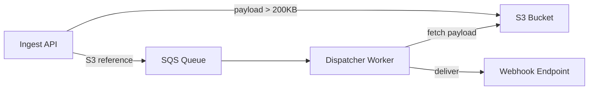

# AWS SQS — EventRelay's Message Queue

## Why AWS SQS?

EventRelay requires a **durable, highly available message queue** between the Ingest API and Dispatcher Workers. AWS SQS is the backbone of this decoupling layer — it absorbs traffic spikes, survives component failures, and requires zero operational overhead for cluster management.

> [!NOTE]
> Systems like Stripe and GitHub use internal queue infrastructure for webhook delivery. For teams without dedicated infrastructure engineers, SQS provides equivalent reliability as a fully managed service.

### Managed Service Benefits

| Benefit | Description | Impact on EventRelay |
|---|---|---|
| **Zero Server Management** | No brokers to provision, patch, or scale | Operations team focuses on application logic |
| **Automatic Scaling** | Handles 1 to millions of messages/sec | Absorbs tenant traffic spikes without pre-provisioning |
| **99.999999999% Durability** | Messages replicated across 3+ AZs | No message loss even during AZ failures |
| **99.9% Availability SLA** | Backed by AWS SLA | Meets enterprise reliability requirements |
| **Built-in DLQ** | Native dead-letter queue support | Poison messages isolated automatically |
| **Encryption at Rest** | SSE-SQS or SSE-KMS | Compliance with data protection requirements |
| **IAM Integration** | Fine-grained access control | Per-service permissions, no shared credentials |
| **CloudWatch Integration** | Native metrics and alarms | Operational visibility without custom instrumentation |

### Why Not Kafka / RabbitMQ / Redis Streams?

| Alternative | Reason for Not Choosing |
|---|---|
| **Apache Kafka** | Powerful but requires cluster management (ZooKeeper/KRaft), partition tuning, and operational expertise. Overkill for webhook delivery where ordering is best-effort. |
| **Amazon MSK** | Managed Kafka still requires topic/partition management. Higher cost at low-to-medium throughput. Better for event streaming, not task dispatch. |
| **RabbitMQ** | Requires broker management (even on Amazon MQ). More complex routing model than needed. |
| **Redis Streams** | No built-in DLQ, limited durability guarantees, requires manual consumer group management. Redis is better used for caching/rate limiting (which EventRelay does). |

---

## Standard vs FIFO Queues

SQS offers two queue types. EventRelay uses **Standard queues** for the primary delivery path.

### Comparison Table

| Feature | Standard Queue | FIFO Queue |
|---|---|---|
| **Throughput** | Unlimited (practically) | 300 msg/s (3,000 with batching) |
| **Delivery Guarantee** | At-least-once | Exactly-once processing |
| **Ordering** | Best-effort | Strict FIFO per message group |
| **Deduplication** | Application-level required | Built-in (5-min window) |
| **Max In-Flight** | 120,000 messages | 20,000 messages |
| **Pricing** | $0.40 per million requests | $0.50 per million requests |
| **Batching** | Up to 10 messages | Up to 10 messages |
| **Queue Name** | Any valid name | Must end with `.fifo` |

### Why Standard Queues for Webhooks

```
Webhook delivery is inherently unordered at the HTTP level.
Even with ordered queuing, network latency, retries, and
consumer concurrency break ordering guarantees downstream.
```

**Decision: Standard Queue** — EventRelay prioritizes **throughput and availability** over strict ordering:

1. **Throughput** — Standard queues have no TPS limit; FIFO caps at 3,000 msg/s with batching
2. **At-Least-Once is Acceptable** — Webhook consumers must be idempotent anyway (network failures cause duplicate HTTP calls)
3. **In-Flight Limit** — 120K vs 20K; with slow endpoints, in-flight count grows quickly
4. **Cost** — 20% cheaper per request
5. **Ordering is Best-Effort Anyway** — HTTP delivery over the internet cannot guarantee ordering

> [!TIP]
> If a specific tenant requires strict ordering (e.g., financial event sequences), consider a **hybrid approach**: route those subscriptions through a FIFO queue with the tenant ID as the message group ID. See [FIFO_vs_Standard.md](./FIFO_vs_Standard.md) for details.

---

## SQS Limits and Constraints

### Message Size

| Constraint | Limit | EventRelay Approach |
|---|---|---|
| **Max message body** | 256 KB | Store large payloads in S3, pass reference in message |
| **Max message attributes** | 10 attributes | Use 6 attributes (see below) |
| **Max attribute name** | 256 characters | Short, descriptive names |
| **Max attribute value** | 256 KB (shared with body) | Minimal metadata in attributes |

### Queue Limits

| Constraint | Limit | Notes |
|---|---|---|
| **In-flight messages (Standard)** | 120,000 | Per queue; monitor `ApproximateNumberOfMessagesNotVisible` |
| **In-flight messages (FIFO)** | 20,000 | Per queue |
| **Message retention** | 1 min – 14 days | EventRelay uses 14 days |
| **Visibility timeout** | 0 sec – 12 hours | EventRelay uses 60s default |
| **Long poll wait time** | 0 – 20 seconds | EventRelay uses 20s |
| **Delay queue** | 0 – 15 minutes | Used for retry backoff ≤ 15 min |
| **Batch size** | 1 – 10 messages | EventRelay uses 10 for throughput |
| **Queues per account** | Unlimited (soft limit) | Request increase if needed |

### Handling the 256KB Limit

For events with large payloads (e.g., bulk data exports), EventRelay uses the **claim-check pattern**:



```java
@Component
public class LargePayloadHandler {
    
    private static final int PAYLOAD_THRESHOLD_BYTES = 200 * 1024; // 200KB
    
    private final S3Client s3Client;
    private final String bucketName;
    
    public SqsMessagePayload preparePayload(WebhookEvent event) {
        byte[] serialized = objectMapper.writeValueAsBytes(event.getPayload());
        
        if (serialized.length > PAYLOAD_THRESHOLD_BYTES) {
            String s3Key = String.format("events/%s/%s/%s.json",
                event.getTenantId(),
                event.getEventId(),
                Instant.now().toEpochMilli());
            
            s3Client.putObject(
                PutObjectRequest.builder()
                    .bucket(bucketName)
                    .key(s3Key)
                    .build(),
                RequestBody.fromBytes(serialized)
            );
            
            return SqsMessagePayload.builder()
                .payloadType(PayloadType.S3_REFERENCE)
                .s3Bucket(bucketName)
                .s3Key(s3Key)
                .build();
        }
        
        return SqsMessagePayload.builder()
            .payloadType(PayloadType.INLINE)
            .data(serialized)
            .build();
    }
}
```

---

## SQS Pricing Model

### Cost Structure (US East — N. Virginia, as of 2025)

| Tier | Standard Queue | FIFO Queue |
|---|---|---|
| **First 1M requests/month** | Free | Free |
| **After 1M** | $0.40 per million | $0.50 per million |
| **Data transfer (in)** | Free | Free |
| **Data transfer (out)** | Standard AWS rates | Standard AWS rates |

### Cost Estimation for EventRelay

| Scenario | Events/Month | SQS Requests* | Monthly Cost |
|---|---|---|---|
| **Startup** | 100K | ~400K | Free tier |
| **Growth** | 5M | ~20M | ~$7.60 |
| **Scale** | 50M | ~200M | ~$79.60 |
| **Enterprise** | 500M | ~2B | ~$799.60 |

> *Each event generates ~4 SQS API calls: SendMessage, ReceiveMessage, ChangeMessageVisibility, DeleteMessage

> [!NOTE]
> SQS pricing is per API request, not per message. Long polling (`WaitTimeSeconds=20`) dramatically reduces empty `ReceiveMessage` calls compared to short polling.

---

## Spring Boot Integration with AWS SDK v2

### Dependencies

```xml
<!-- pom.xml -->
<dependencyManagement>
    <dependencies>
        <dependency>
            <groupId>software.amazon.awssdk</groupId>
            <artifactId>bom</artifactId>
            <version>2.25.60</version>
            <type>pom</type>
            <scope>import</scope>
        </dependency>
    </dependencies>
</dependencyManagement>

<dependencies>
    <!-- AWS SQS SDK v2 -->
    <dependency>
        <groupId>software.amazon.awssdk</groupId>
        <artifactId>sqs</artifactId>
    </dependency>
    
    <!-- STS for ECS task role assumption -->
    <dependency>
        <groupId>software.amazon.awssdk</groupId>
        <artifactId>sts</artifactId>
    </dependency>
    
    <!-- Spring Cloud AWS (optional, for higher-level abstractions) -->
    <dependency>
        <groupId>io.awspring.cloud</groupId>
        <artifactId>spring-cloud-aws-starter-sqs</artifactId>
        <version>3.1.1</version>
    </dependency>
</dependencies>
```

### Application Configuration

```yaml
# application.yml
eventrelay:
  sqs:
    region: us-east-1
    delivery-queue-url: https://sqs.us-east-1.amazonaws.com/123456789/eventrelay-delivery
    dlq-url: https://sqs.us-east-1.amazonaws.com/123456789/eventrelay-dlq
    retry-queue-url: https://sqs.us-east-1.amazonaws.com/123456789/eventrelay-retry
    max-messages-per-poll: 10
    wait-time-seconds: 20
    visibility-timeout-seconds: 60
    consumer:
      concurrency: 5
      max-concurrent-messages: 50
      shutdown-timeout-seconds: 30

spring:
  cloud:
    aws:
      region:
        static: us-east-1
      credentials:
        # Uses DefaultCredentialsProvider chain:
        # 1. Environment variables
        # 2. System properties
        # 3. ECS container credentials (in production)
        # 4. EC2 instance profile
        use-default-credentials-chain: true
```

### SQS Client Configuration

```java
@Configuration
@EnableConfigurationProperties(SqsProperties.class)
public class SqsClientConfiguration {

    @Bean
    public SqsClient sqsClient(SqsProperties props) {
        return SqsClient.builder()
            .region(Region.of(props.getRegion()))
            .credentialsProvider(DefaultCredentialsProvider.create())
            .httpClientBuilder(ApacheHttpClient.builder()
                .maxConnections(50)
                .connectionTimeout(Duration.ofSeconds(5))
                .socketTimeout(Duration.ofSeconds(30))
            )
            .overrideConfiguration(ClientOverrideConfiguration.builder()
                .retryPolicy(RetryPolicy.builder()
                    .numRetries(3)
                    .build())
                .apiCallTimeout(Duration.ofSeconds(30))
                .apiCallAttemptTimeout(Duration.ofSeconds(10))
                .build())
            .build();
    }

    @Bean
    public SqsAsyncClient sqsAsyncClient(SqsProperties props) {
        return SqsAsyncClient.builder()
            .region(Region.of(props.getRegion()))
            .credentialsProvider(DefaultCredentialsProvider.create())
            .httpClientBuilder(NettyNioAsyncHttpClient.builder()
                .maxConcurrency(100)
                .connectionTimeout(Duration.ofSeconds(5))
                .readTimeout(Duration.ofSeconds(30))
            )
            .overrideConfiguration(ClientOverrideConfiguration.builder()
                .retryPolicy(RetryPolicy.builder()
                    .numRetries(3)
                    .build())
                .build())
            .build();
    }
}
```

### Configuration Properties Class

```java
@ConfigurationProperties(prefix = "eventrelay.sqs")
@Validated
public class SqsProperties {

    @NotBlank
    private String region;

    @NotBlank
    private String deliveryQueueUrl;

    @NotBlank
    private String dlqUrl;

    private String retryQueueUrl;

    @Min(1) @Max(10)
    private int maxMessagesPerPoll = 10;

    @Min(0) @Max(20)
    private int waitTimeSeconds = 20;

    @Min(0) @Max(43200) // 12 hours max
    private int visibilityTimeoutSeconds = 60;

    private ConsumerProperties consumer = new ConsumerProperties();

    @Data
    public static class ConsumerProperties {
        @Min(1) @Max(20)
        private int concurrency = 5;

        @Min(1) @Max(200)
        private int maxConcurrentMessages = 50;

        @Min(5)
        private int shutdownTimeoutSeconds = 30;
    }

    // Getters and setters...
}
```

### SQS Message Producer

```java
@Service
@Slf4j
public class SqsMessageProducer {

    private final SqsClient sqsClient;
    private final SqsProperties sqsProperties;
    private final ObjectMapper objectMapper;
    private final MeterRegistry meterRegistry;

    public SqsMessageProducer(SqsClient sqsClient,
                               SqsProperties sqsProperties,
                               ObjectMapper objectMapper,
                               MeterRegistry meterRegistry) {
        this.sqsClient = sqsClient;
        this.sqsProperties = sqsProperties;
        this.objectMapper = objectMapper;
        this.meterRegistry = meterRegistry;
    }

    public String sendDeliveryMessage(DeliveryTask task) {
        Timer.Sample sample = Timer.start(meterRegistry);
        try {
            String messageBody = objectMapper.writeValueAsString(task);
            
            SendMessageRequest request = SendMessageRequest.builder()
                .queueUrl(sqsProperties.getDeliveryQueueUrl())
                .messageBody(messageBody)
                .messageAttributes(buildMessageAttributes(task))
                .build();

            // Apply delay for retry messages (up to 15 min)
            if (task.getDelaySeconds() > 0) {
                request = request.toBuilder()
                    .delaySeconds(Math.min(task.getDelaySeconds(), 900))
                    .build();
            }

            SendMessageResponse response = sqsClient.sendMessage(request);
            
            log.info("Sent delivery message: messageId={}, eventId={}, tenant={}",
                response.messageId(), task.getEventId(), task.getTenantId());
            
            meterRegistry.counter("sqs.messages.sent",
                "queue", "delivery",
                "tenant", task.getTenantId()
            ).increment();
            
            return response.messageId();
            
        } catch (JsonProcessingException e) {
            throw new MessageSerializationException("Failed to serialize task", e);
        } catch (SqsException e) {
            meterRegistry.counter("sqs.messages.send.error",
                "queue", "delivery",
                "error", e.awsErrorDetails().errorCode()
            ).increment();
            throw new QueueException("Failed to send message to SQS", e);
        } finally {
            sample.stop(meterRegistry.timer("sqs.send.duration", "queue", "delivery"));
        }
    }

    private Map<String, MessageAttributeValue> buildMessageAttributes(DeliveryTask task) {
        Map<String, MessageAttributeValue> attrs = new HashMap<>();
        
        attrs.put("tenantId", MessageAttributeValue.builder()
            .dataType("String").stringValue(task.getTenantId()).build());
        attrs.put("eventType", MessageAttributeValue.builder()
            .dataType("String").stringValue(task.getEventType()).build());
        attrs.put("attemptNumber", MessageAttributeValue.builder()
            .dataType("Number").stringValue(String.valueOf(task.getAttemptNumber())).build());
        attrs.put("originalTimestamp", MessageAttributeValue.builder()
            .dataType("Number").stringValue(String.valueOf(task.getOriginalTimestamp())).build());
        attrs.put("idempotencyKey", MessageAttributeValue.builder()
            .dataType("String").stringValue(task.getIdempotencyKey()).build());
        attrs.put("subscriptionId", MessageAttributeValue.builder()
            .dataType("String").stringValue(task.getSubscriptionId()).build());
        
        return attrs;
    }
}
```

### SQS Message Consumer

```java
@Component
@Slf4j
public class SqsMessageConsumer {

    private final SqsClient sqsClient;
    private final SqsProperties sqsProperties;
    private final WebhookDispatcher dispatcher;
    private final MeterRegistry meterRegistry;
    
    private final ExecutorService executorService;
    private volatile boolean running = true;

    @PostConstruct
    public void startPolling() {
        int concurrency = sqsProperties.getConsumer().getConcurrency();
        for (int i = 0; i < concurrency; i++) {
            executorService.submit(this::pollLoop);
        }
        log.info("Started {} SQS polling threads", concurrency);
    }

    private void pollLoop() {
        while (running) {
            try {
                ReceiveMessageRequest request = ReceiveMessageRequest.builder()
                    .queueUrl(sqsProperties.getDeliveryQueueUrl())
                    .maxNumberOfMessages(sqsProperties.getMaxMessagesPerPoll())
                    .waitTimeSeconds(sqsProperties.getWaitTimeSeconds())
                    .visibilityTimeout(sqsProperties.getVisibilityTimeoutSeconds())
                    .messageAttributeNames("All")
                    .attributeNamesWithStrings("ApproximateReceiveCount")
                    .build();

                ReceiveMessageResponse response = sqsClient.receiveMessage(request);

                for (Message message : response.messages()) {
                    processMessage(message);
                }
            } catch (SqsException e) {
                log.error("SQS polling error", e);
                meterRegistry.counter("sqs.poll.error").increment();
                sleepQuietly(Duration.ofSeconds(5));
            }
        }
    }

    private void processMessage(Message message) {
        Timer.Sample sample = Timer.start(meterRegistry);
        try {
            DeliveryTask task = objectMapper.readValue(
                message.body(), DeliveryTask.class);
            
            DeliveryResult result = dispatcher.deliver(task);
            
            if (result.isSuccess()) {
                deleteMessage(message);
                meterRegistry.counter("sqs.messages.processed",
                    "result", "success").increment();
            } else if (result.shouldRetry()) {
                // Message will become visible again after visibility timeout
                log.warn("Delivery failed, will retry: eventId={}, attempt={}",
                    task.getEventId(), task.getAttemptNumber());
            } else {
                // Permanent failure — let it go to DLQ via redrive policy
                log.error("Permanent delivery failure: eventId={}",
                    task.getEventId());
            }
        } catch (Exception e) {
            log.error("Failed to process message: {}", message.messageId(), e);
            meterRegistry.counter("sqs.messages.processed",
                "result", "error").increment();
        } finally {
            sample.stop(meterRegistry.timer("sqs.message.processing.duration"));
        }
    }

    private void deleteMessage(Message message) {
        sqsClient.deleteMessage(DeleteMessageRequest.builder()
            .queueUrl(sqsProperties.getDeliveryQueueUrl())
            .receiptHandle(message.receiptHandle())
            .build());
    }

    @PreDestroy
    public void shutdown() {
        running = false;
        executorService.shutdown();
        try {
            if (!executorService.awaitTermination(
                    sqsProperties.getConsumer().getShutdownTimeoutSeconds(),
                    TimeUnit.SECONDS)) {
                executorService.shutdownNow();
            }
        } catch (InterruptedException e) {
            executorService.shutdownNow();
            Thread.currentThread().interrupt();
        }
    }
}
```

---

## Local Development with LocalStack

For local development and testing, EventRelay uses LocalStack to emulate SQS:

```yaml
# docker-compose.yml (excerpt)
services:
  localstack:
    image: localstack/localstack:3.5
    ports:
      - "4566:4566"
    environment:
      - SERVICES=sqs,s3
      - DEFAULT_REGION=us-east-1
    volumes:
      - ./infra/localstack/init-sqs.sh:/etc/localstack/init/ready.d/init-sqs.sh
```

```bash
#!/bin/bash
# infra/localstack/init-sqs.sh

# Create DLQ first
awslocal sqs create-queue \
  --queue-name eventrelay-dlq \
  --attributes '{
    "MessageRetentionPeriod": "1209600",
    "VisibilityTimeout": "60"
  }'

DLQ_ARN=$(awslocal sqs get-queue-attributes \
  --queue-url http://localhost:4566/000000000000/eventrelay-dlq \
  --attribute-names QueueArn --query 'Attributes.QueueArn' --output text)

# Create main delivery queue with redrive policy
awslocal sqs create-queue \
  --queue-name eventrelay-delivery \
  --attributes '{
    "VisibilityTimeout": "60",
    "MessageRetentionPeriod": "1209600",
    "ReceiveMessageWaitTimeSeconds": "20",
    "RedrivePolicy": "{\"deadLetterTargetArn\":\"'$DLQ_ARN'\",\"maxReceiveCount\":5}"
  }'

echo "SQS queues created successfully"
```

```yaml
# application-local.yml
eventrelay:
  sqs:
    region: us-east-1
    delivery-queue-url: http://localhost:4566/000000000000/eventrelay-delivery
    dlq-url: http://localhost:4566/000000000000/eventrelay-dlq

spring:
  cloud:
    aws:
      endpoint: http://localhost:4566
      region:
        static: us-east-1
      credentials:
        access-key: test
        secret-key: test
```

---

## Production Considerations

### Connection Management
- Use **connection pooling** — the `ApacheHttpClient` or `NettyNioAsyncHttpClient` manages connections automatically
- Set `maxConnections` based on consumer concurrency (rule of thumb: 2× number of polling threads)
- Monitor connection pool exhaustion via SDK metrics

### Error Handling
- SQS SDK retries transient errors (throttling, 5xx) automatically with exponential backoff
- Configure `numRetries` in the retry policy (default: 3)
- Handle `SqsException` with `awsErrorDetails().errorCode()` for specific error handling
- Watch for `OverLimit` errors if approaching the 120K in-flight message limit

### Credential Management
- **Never** hardcode AWS credentials in application code or config files
- Use **ECS Task Roles** in production (automatic credential rotation)
- Use **environment variables** or **IAM profiles** in non-container environments
- Use **LocalStack** with dummy credentials for local development

### Performance Tuning
- **Long polling** (`waitTimeSeconds=20`) reduces empty responses and cost by ~10×
- **Batch operations** (`SendMessageBatch`, `DeleteMessageBatch`) reduce API calls by up to 10×
- **Async client** for non-blocking I/O in high-throughput scenarios
- **Multiple polling threads** — scale consumer concurrency per ECS task

---

## Related Documents

- [Queue_Configuration.md](./Queue_Configuration.md) — Detailed queue setup and infrastructure
- [Message_Lifecycle.md](./Message_Lifecycle.md) — How messages flow through the queue
- [Visibility_Timeout.md](./Visibility_Timeout.md) — Timeout tuning for reliable delivery
- [FIFO_vs_Standard.md](./FIFO_vs_Standard.md) — Queue type decision in depth
- [Queue_Monitoring.md](./Queue_Monitoring.md) — Metrics and alerting
