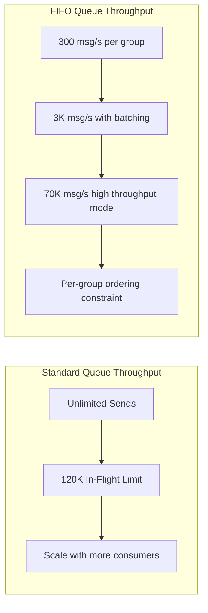
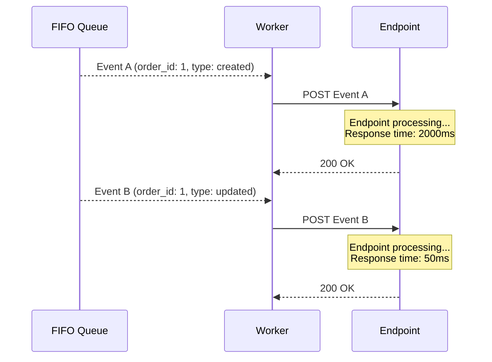
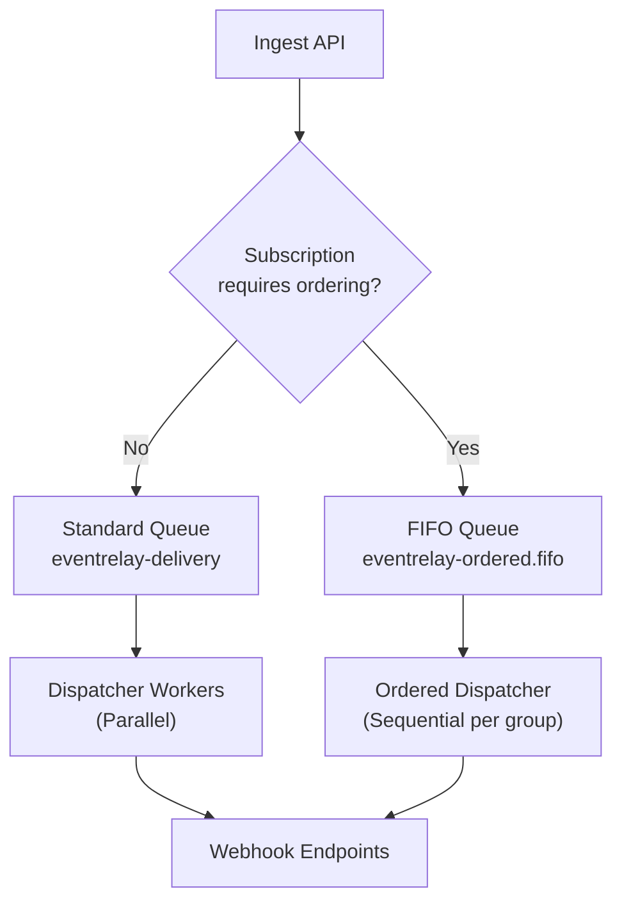

# FIFO vs Standard Queues

## Overview

AWS SQS offers two queue types: **Standard** and **FIFO** (First-In-First-Out). This document provides a detailed comparison in the context of webhook delivery, explains why EventRelay uses Standard queues as the default, and outlines when a hybrid approach with FIFO queues is justified.

> [!NOTE]
> This is one of the most impactful architectural decisions in a webhook delivery system. Choosing wrong can either limit throughput (FIFO) or surprise consumers with out-of-order events (Standard). EventRelay's approach: **Standard by default, FIFO opt-in for specific tenants.**

---

## Detailed Comparison

### Feature-by-Feature Analysis

| Feature | Standard Queue | FIFO Queue |
|---|---|---|
| **Throughput** | Unlimited (practical limit ~120K/s) | 300 msg/s (3,000 with batching, 70K with high throughput mode) |
| **Delivery** | At-least-once | Exactly-once processing |
| **Ordering** | Best-effort (mostly FIFO) | Strict FIFO per message group |
| **Deduplication** | Not supported (app-level) | Built-in 5-minute dedup window |
| **Message Groups** | Not applicable | Required (`MessageGroupId`) |
| **In-Flight Limit** | 120,000 per queue | 20,000 per queue |
| **Batching** | Up to 10 messages | Up to 10 messages |
| **Delay Queues** | Per-queue and per-message | Per-queue only (not per-message) |
| **Dead Letter Queue** | Standard DLQ | FIFO DLQ required |
| **Cost** | $0.40/million requests | $0.50/million requests |
| **Queue Name** | Any valid name | Must end in `.fifo` |
| **Content-Based Dedup** | No | Yes (optional) |
| **High Throughput Mode** | N/A | Up to 70K msg/s (with partitions) |

### Throughput Deep Dive



**Standard Queue:**
- No hard throughput limit on `SendMessage`
- Limited by the 120K in-flight message cap
- Multiple consumers can process in parallel without coordination
- Throughput scales linearly with consumer count

**FIFO Queue:**
- Base: 300 transactions/second (TPS) per API action
- With batching (10 messages/batch): 3,000 messages/second
- High throughput mode: up to 70,000 messages/second
- **Per message group**: only one message processed at a time (sequential)
- Parallelism requires multiple message groups

### Ordering Behavior

**Standard Queue — Best-Effort Ordering:**
```
Send Order:    A → B → C → D → E
Receive Order: A → C → B → D → E  (mostly preserved, occasional reordering)
```

SQS Standard queues use a distributed architecture where messages are stored redundantly across servers. This means delivery order is **generally** preserved but not guaranteed, especially under high throughput.

**FIFO Queue — Strict Ordering:**
```
Send Order:    A → B → C → D → E  (all in same message group)
Receive Order: A → B → C → D → E  (guaranteed)
```

With FIFO, messages within the same `MessageGroupId` are always delivered in exact send order. Messages in different groups can be processed in parallel.

### Deduplication Behavior

**Standard Queue:**
```
Send: Message X (id=123)
Send: Message X (id=123)  ← duplicate (e.g., outbox poller retry)
Receive: Message X        ← received at least once
Receive: Message X        ← possible duplicate delivery
```
Application must handle deduplication (see [Deduplication.md](./Deduplication.md)).

**FIFO Queue:**
```
Send: Message X (dedup_id="abc123")
Send: Message X (dedup_id="abc123")  ← within 5-minute window
Receive: Message X                    ← received exactly once
```
SQS automatically deduplicates within a 5-minute window using the `MessageDeduplicationId`.

---

## Why EventRelay Chooses Standard Queues

### Reason 1: Throughput Requirements

EventRelay is designed to handle **millions of webhook deliveries per hour**. FIFO queue throughput constraints would create bottlenecks:

```
Scenario: 10,000 tenants, 100 events/second aggregate

Standard Queue:
  - 100 msg/s << 120K in-flight limit
  - No throughput concern at any scale
  - All 100 events processed in parallel

FIFO Queue (one group per tenant):
  - 100 msg/s / 10,000 tenants = 0.01 msg/s per group
  - Well within limits per group
  - BUT: Only one message per group processed at a time
  - If one tenant's endpoint is slow (30s), their queue backs up
```

At scale with bursty traffic patterns, FIFO queue limitations become problematic:

| Events/second | Standard Queue | FIFO Queue (batched) | FIFO High Throughput |
|---|---|---|---|
| 100 | ✅ No issue | ✅ No issue | ✅ No issue |
| 1,000 | ✅ No issue | ✅ Within limit | ✅ No issue |
| 5,000 | ✅ No issue | ⚠️ Near limit | ✅ No issue |
| 10,000 | ✅ No issue | ❌ Exceeds limit | ✅ No issue |
| 100,000 | ✅ No issue | ❌ Far exceeds | ⚠️ Near limit |

### Reason 2: Webhook Delivery is Inherently Unordered

Even with a FIFO queue, **HTTP delivery cannot guarantee order**:



With FIFO + single worker: Events arrive in order, but consumer processing time varies. The ordering guarantee is only at the **HTTP delivery level**, not at the **consumer processing level**.

With retries, ordering breaks further:

```
Event A: Delivered at t=0     (success)
Event B: Delivered at t=1     (fails, retried at t=61)
Event C: Delivered at t=2     (success)
Event D: Delivered at t=3     (success)
Event B: Re-delivered at t=61 (success, but now out of order)
```

### Reason 3: Cost Efficiency

```
Monthly volume: 50M events

Standard: 50M × 4 API calls × $0.40/1M = $80
FIFO:     50M × 4 API calls × $0.50/1M = $100

Savings: $20/month (20% less)
```

The cost difference is modest, but the throughput and operational simplicity benefits are significant.

### Reason 4: Per-Message Delay Support

Standard queues support **per-message `DelaySeconds`** (0–900 seconds), which EventRelay uses for retry backoff. FIFO queues only support **queue-level** delays, requiring separate queues or external scheduling for different delay intervals.

```java
// Standard queue: Per-message delay for retry backoff
sqsClient.sendMessage(SendMessageRequest.builder()
    .queueUrl(deliveryQueueUrl)
    .messageBody(taskJson)
    .delaySeconds(calculateBackoff(attemptNumber)) // 1s, 5s, 30s, 300s...
    .build());

// FIFO queue: Cannot set per-message delay
// Would need separate delay queues or external scheduler
```

---

## When to Use FIFO Queues

Despite choosing Standard as the default, FIFO queues are appropriate for specific use cases:

### Use Case 1: Financial Event Sequences

When events represent a **state machine** and order matters:

```
order.created → order.payment_captured → order.fulfilled → order.completed
```

If `order.fulfilled` arrives before `order.payment_captured`, the consumer's state machine breaks.

### Use Case 2: Regulatory Compliance

Some industries require **provable ordering** of events for audit trails:
- Payment processing (PCI-DSS)
- Healthcare data exchange (HIPAA)
- Financial reporting (SOX compliance)

### Use Case 3: Low-Volume, High-Value Streams

Tenants with low throughput (<100 events/second) where ordering is critical and the throughput penalty is acceptable.

---

## Hybrid Architecture

EventRelay supports a **hybrid approach** where most traffic goes through Standard queues, but specific subscriptions are routed to FIFO queues.

### Architecture



### Routing Logic

```java
@Service
public class QueueRouter {
    
    private final SqsClient sqsClient;
    private final SqsProperties sqsProperties;
    private final SubscriptionRepository subscriptionRepository;

    public String routeMessage(DeliveryTask task) {
        Subscription subscription = subscriptionRepository
            .findById(task.getSubscriptionId())
            .orElseThrow();
        
        if (subscription.isOrderedDelivery()) {
            return sendToFifoQueue(task, subscription);
        } else {
            return sendToStandardQueue(task);
        }
    }

    private String sendToFifoQueue(DeliveryTask task, 
                                    Subscription subscription) {
        // Use tenant ID + subscription ID as message group
        // for per-subscription ordering
        String messageGroupId = String.format("%s:%s",
            task.getTenantId(), task.getSubscriptionId());
        
        // Use event ID as dedup ID (SQS 5-min window)
        String deduplicationId = task.getIdempotencyKey();
        
        SendMessageRequest request = SendMessageRequest.builder()
            .queueUrl(sqsProperties.getOrderedQueueUrl())
            .messageBody(objectMapper.writeValueAsString(task))
            .messageGroupId(messageGroupId)
            .messageDeduplicationId(deduplicationId)
            .messageAttributes(buildAttributes(task))
            .build();
        
        SendMessageResponse response = sqsClient.sendMessage(request);
        
        log.info("Routed to FIFO queue: eventId={}, group={}", 
            task.getEventId(), messageGroupId);
        
        return response.messageId();
    }

    private String sendToStandardQueue(DeliveryTask task) {
        SendMessageRequest request = SendMessageRequest.builder()
            .queueUrl(sqsProperties.getDeliveryQueueUrl())
            .messageBody(objectMapper.writeValueAsString(task))
            .messageAttributes(buildAttributes(task))
            .build();
        
        return sqsClient.sendMessage(request).messageId();
    }
}
```

### Subscription Configuration

```java
@Entity
@Table(name = "subscriptions")
public class Subscription {
    
    @Id
    private String id;
    
    @Column(name = "tenant_id")
    private String tenantId;
    
    @Column(name = "target_url")
    private String targetUrl;
    
    @Column(name = "ordered_delivery")
    private boolean orderedDelivery = false;  // Default: unordered
    
    @Column(name = "event_types")
    @ElementCollection
    private Set<String> eventTypes;
    
    // ...
}
```

### API Endpoint for Subscription Creation

```json
POST /api/v1/subscriptions
{
  "targetUrl": "https://api.acme.com/webhooks",
  "eventTypes": ["order.created", "order.updated", "order.completed"],
  "orderedDelivery": true,
  "signingSecret": "whsec_..."
}
```

---

## Performance Impact of FIFO Constraints

### Message Group Blocking

In FIFO queues, messages within the same group are processed **sequentially**. A slow endpoint blocks all subsequent messages in that group:

```
Message Group: tenant_123:sub_456

Event A: Processing... (endpoint takes 30s)
Event B: Waiting... (blocked by Event A)
Event C: Waiting... (blocked by Event A)
Event D: Waiting... (blocked by Event A)
Event E: Waiting... (blocked by Event A)

Time to process all 5 events:
- Standard queue (parallel): ~30s (bottleneck is Event A)
- FIFO queue (sequential):   ~32s (30 + 0.5 + 0.5 + 0.5 + 0.5)
```

For most cases the difference is small, but with many events queued:

```
100 events, each taking 1s to deliver:
- Standard queue: ~10s (10 parallel workers)
- FIFO queue: ~100s (sequential per group)
```

### Mitigation: Message Group Granularity

Choose message group ID granularity based on ordering requirements:

| Granularity | Message Group ID | Parallelism | Ordering Scope |
|---|---|---|---|
| **Per-tenant** | `tenant_123` | Low (1 stream/tenant) | All events for a tenant ordered |
| **Per-subscription** | `tenant_123:sub_456` | Medium | Events per subscription ordered |
| **Per-entity** | `tenant_123:order_789` | High | Events per entity ordered |

```java
// Per-entity ordering — best parallelism with meaningful ordering
String messageGroupId = String.format("%s:%s:%s",
    task.getTenantId(),
    task.getSubscriptionId(),
    task.getEntityId()  // e.g., "order_12345"
);
```

---

## Decision Matrix

Use this matrix to decide which queue type fits a specific use case:

| Requirement | Standard | FIFO | Recommendation |
|---|---|---|---|
| Throughput > 3K msg/s | ✅ | ⚠️ | Standard |
| Exactly-once processing | ❌ | ✅ | FIFO (or app-level dedup) |
| Strict ordering required | ❌ | ✅ | FIFO |
| Per-message delay needed | ✅ | ❌ | Standard |
| In-flight > 20K messages | ✅ | ❌ | Standard |
| Simple operations | ✅ | ⚠️ | Standard |
| Cost-sensitive | ✅ | ⚠️ | Standard |
| Regulatory ordering requirement | ❌ | ✅ | FIFO |

> [!TIP]
> When in doubt, start with **Standard queues** and add FIFO as an opt-in feature. It's easier to add ordering later than to remove throughput limits from an architecture built on FIFO assumptions.

---

## Migration Path: Standard → Hybrid

If you start with Standard and later need FIFO for some subscriptions:

1. **Create the FIFO queue** alongside the Standard queue
2. **Add `orderedDelivery` flag** to the subscription model
3. **Deploy queue router** that checks the flag before sending
4. **Deploy a FIFO consumer** alongside the Standard consumer
5. **Migrate subscriptions** one tenant at a time (update flag via API)
6. **Monitor** FIFO queue depth and processing latency

No data migration is needed — new events are routed to the appropriate queue, and existing in-flight messages in the Standard queue complete naturally.

---

## Related Documents

- [AWS_SQS.md](./AWS_SQS.md) — SQS fundamentals and configuration
- [Ordering.md](./Ordering.md) — Event ordering strategies beyond queue type
- [Deduplication.md](./Deduplication.md) — Handling duplicates in Standard queues
- [Queue_Configuration.md](./Queue_Configuration.md) — Queue attribute configuration
