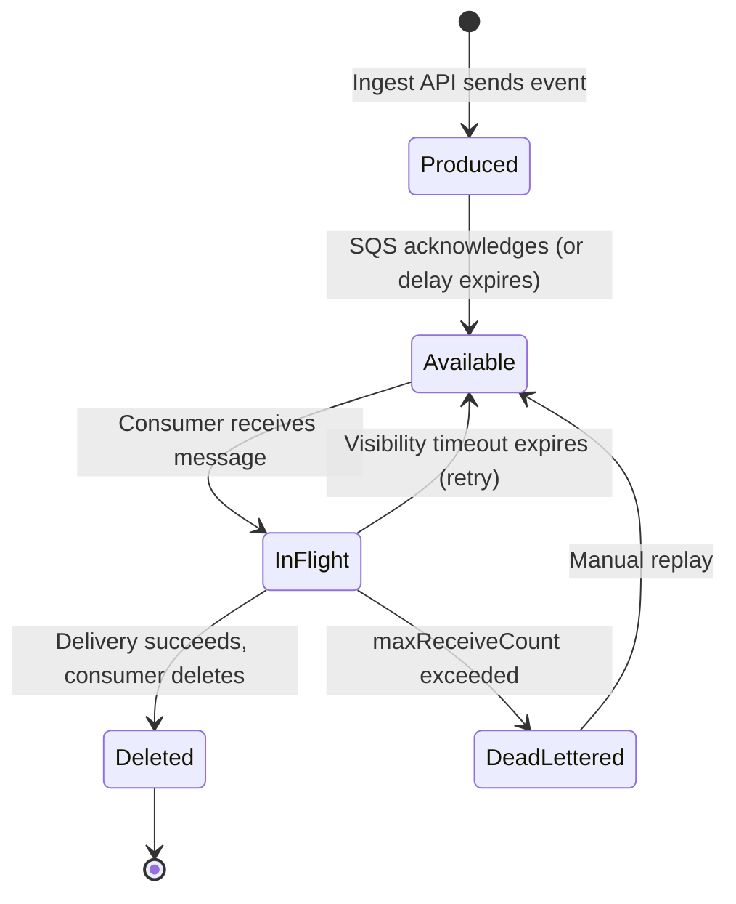
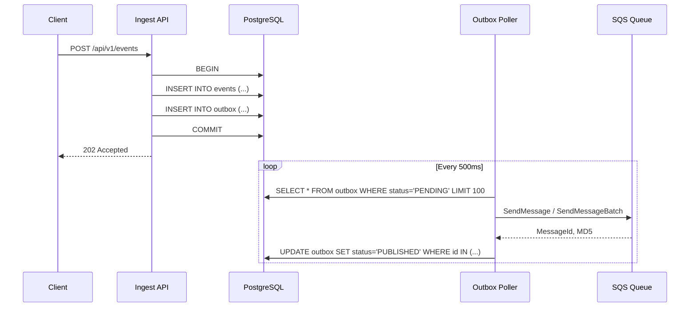
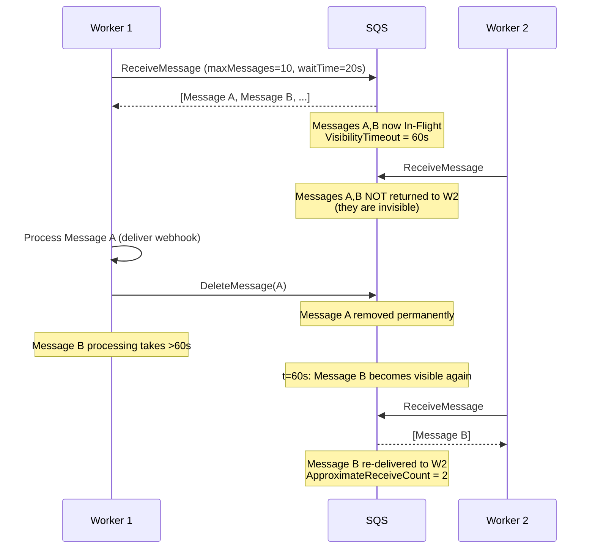
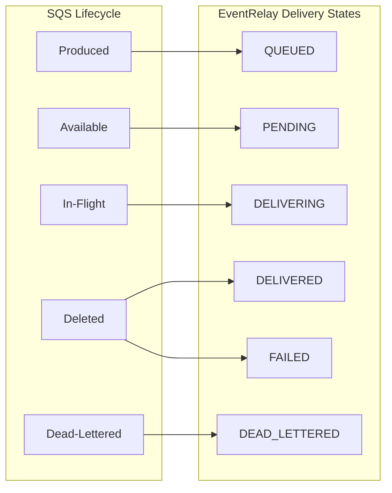
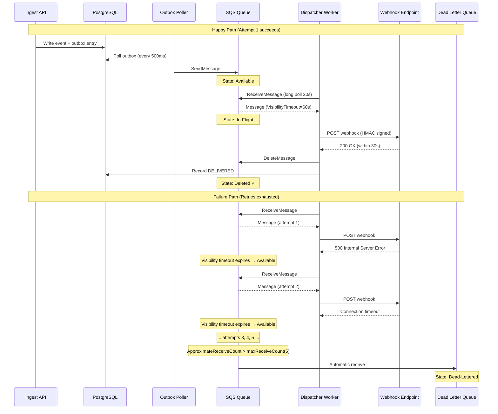

# Message Lifecycle

## Overview

Every webhook delivery task in EventRelay follows a deterministic lifecycle through the SQS queue. Understanding this lifecycle is critical for debugging delivery failures, tuning performance, and ensuring at-least-once delivery guarantees.



---

## Lifecycle Phases

### Phase 1: Message Production

The Ingest API writes events to the **outbox table** transactionally, then the **outbox poller** publishes them to SQS.



**Key properties at this phase:**
- Message is **not yet in SQS** until the outbox poller publishes it
- The outbox pattern guarantees **no message loss** even if SQS is temporarily unavailable
- Messages get a `MessageId` assigned by SQS (UUID format)

### Phase 2: Available (Waiting for Consumer)

After `SendMessage` succeeds (and any per-message `DelaySeconds` expires), the message enters the **Available** state. It is visible to consumers calling `ReceiveMessage`.

```
Timeline:
├── t=0    SendMessage accepted by SQS
├── t=0+D  Message becomes Available (D = DelaySeconds, default 0)
├── ...    Message sits in queue, waiting for ReceiveMessage
└── t=14d  Message expires if never processed (MessageRetentionPeriod)
```

**SQS metrics affected:**
- `ApproximateNumberOfMessagesVisible` — incremented
- `ApproximateAgeOfOldestMessage` — starts counting from send time

### Phase 3: In-Flight (Processing)

When a Dispatcher Worker calls `ReceiveMessage`, the message transitions to **In-Flight**. It becomes invisible to other consumers for the duration of the `VisibilityTimeout`.



**Critical timing:**

| Event | Timestamp | Notes |
|---|---|---|
| `ReceiveMessage` | t=0 | Visibility timer starts |
| Start HTTP delivery | t=0.05s | Worker begins webhook call |
| HTTP response received | t=2s | Typical successful delivery |
| `DeleteMessage` | t=2.01s | Message removed from queue |
| Visibility timeout | t=60s | **Deadline** — if not deleted by now, message reappears |

> [!WARNING]
> If webhook delivery takes longer than the visibility timeout (60s), the message will become visible again and another worker may deliver it concurrently. This is why the visibility timeout must exceed the maximum expected HTTP delivery time. See [Visibility_Timeout.md](./Visibility_Timeout.md).

### Phase 4a: Deleted (Success)

After successful delivery, the consumer calls `DeleteMessage` with the `ReceiptHandle` obtained from `ReceiveMessage`. The message is permanently removed from the queue.

```java
// Successful delivery path
DeliveryResult result = httpClient.deliverWebhook(task);
if (result.isSuccess()) {
    sqsClient.deleteMessage(DeleteMessageRequest.builder()
        .queueUrl(queueUrl)
        .receiptHandle(message.receiptHandle())
        .build());
    
    deliveryLogRepository.recordSuccess(task.getEventId(), result);
}
```

> [!IMPORTANT]
> The `ReceiptHandle` is **specific to each receive**. If the visibility timeout expires and the message is re-received, the old receipt handle becomes invalid. Always use the receipt handle from the most recent `ReceiveMessage` call.

### Phase 4b: Returned to Available (Retry)

If the consumer does **not** delete the message before the visibility timeout expires, the message automatically returns to the **Available** state. This happens when:

1. **Webhook delivery fails** (HTTP 5xx, timeout, connection refused)
2. **Consumer crashes** before calling `DeleteMessage`
3. **Processing exceeds visibility timeout**

The `ApproximateReceiveCount` attribute increments each time the message is received.

### Phase 4c: Dead-Lettered

When `ApproximateReceiveCount` exceeds the `maxReceiveCount` in the redrive policy, SQS automatically moves the message to the Dead Letter Queue (DLQ).

```
Main Queue                          DLQ
┌──────────────┐                    ┌──────────────┐
│ Message X    │                    │ Message X    │
│ ReceiveCount │ ──── exceeds ────> │ Original     │
│ = 6          │    maxReceive=5    │ attributes   │
│              │                    │ preserved    │
└──────────────┘                    └──────────────┘
```

---

## Message Structure

### SQS Message Body

EventRelay serializes the delivery task as JSON in the message body:

```json
{
  "eventId": "evt_01HX7K2M3N4P5Q6R7S8T9U0V",
  "subscriptionId": "sub_01HX7K2M3N4P5Q6R7S8T9U0V",
  "tenantId": "tenant_acme_corp",
  "eventType": "order.completed",
  "targetUrl": "https://api.acme.com/webhooks/orders",
  "payload": {
    "order_id": "ord_12345",
    "total": 99.99,
    "currency": "USD",
    "items": [
      {"sku": "WIDGET-001", "quantity": 2}
    ]
  },
  "attemptNumber": 1,
  "maxAttempts": 8,
  "idempotencyKey": "evt_01HX7K2M3N4P5Q6R7S8T9U0V:sub_01HX7K2M3N4P5Q6R7S8T9U0V:1",
  "originalTimestamp": 1720612077000,
  "scheduledAt": 1720612077000,
  "signingSecret": "whsec_encrypted_...",
  "timeoutMs": 30000,
  "metadata": {
    "sourceIp": "10.0.1.50",
    "ingestTimestamp": 1720612076500
  }
}
```

### Message Attributes

SQS message attributes carry metadata **outside** the body, enabling attribute-based filtering and routing without deserializing the payload:

| Attribute Name | Data Type | Example Value | Purpose |
|---|---|---|---|
| `tenantId` | String | `tenant_acme_corp` | Tenant identification for rate limiting and routing |
| `eventType` | String | `order.completed` | Event type for filtering and metrics |
| `attemptNumber` | Number | `1` | Current delivery attempt (1-based) |
| `originalTimestamp` | Number | `1720612077000` | Event creation time (epoch millis) |
| `idempotencyKey` | String | `evt_...:sub_...:1` | Deduplication across retries |
| `subscriptionId` | String | `sub_01HX...` | Target subscription identifier |

```java
// Reading message attributes
private DeliveryContext extractContext(Message message) {
    Map<String, MessageAttributeValue> attrs = message.messageAttributes();
    
    return DeliveryContext.builder()
        .tenantId(attrs.get("tenantId").stringValue())
        .eventType(attrs.get("eventType").stringValue())
        .attemptNumber(Integer.parseInt(
            attrs.get("attemptNumber").stringValue()))
        .originalTimestamp(Instant.ofEpochMilli(
            Long.parseLong(attrs.get("originalTimestamp").stringValue())))
        .idempotencyKey(attrs.get("idempotencyKey").stringValue())
        .subscriptionId(attrs.get("subscriptionId").stringValue())
        .approximateReceiveCount(Integer.parseInt(
            message.attributesAsStrings()
                .getOrDefault("ApproximateReceiveCount", "1")))
        .build();
}
```

### System Attributes

SQS automatically adds system attributes to each message:

| System Attribute | Description | Usage in EventRelay |
|---|---|---|
| `SenderId` | AWS account/IAM principal that sent the message | Audit trail |
| `SentTimestamp` | Epoch millis when SQS received the message | Latency calculation |
| `ApproximateReceiveCount` | Number of times the message has been received | Retry tracking, DLQ threshold |
| `ApproximateFirstReceiveTimestamp` | Epoch millis of first receive | Time-in-queue metrics |
| `MessageDeduplicationId` | Dedup ID (FIFO only) | N/A for Standard queues |
| `MessageGroupId` | Group ID (FIFO only) | N/A for Standard queues |

---

## Lifecycle-to-Delivery-State Mapping

EventRelay maps SQS message lifecycle states to internal delivery states persisted in PostgreSQL:



| SQS State | EventRelay State | Database Status | Description |
|---|---|---|---|
| Message sent | `QUEUED` | `queued` | Event accepted, message in outbox |
| Available in queue | `PENDING` | `pending` | Message ready for consumer pickup |
| In-Flight | `DELIVERING` | `delivering` | Consumer is attempting HTTP delivery |
| Deleted (success) | `DELIVERED` | `delivered` | Webhook accepted by target (2xx) |
| Deleted (permanent fail) | `FAILED` | `failed` | Non-retryable failure (4xx, invalid URL) |
| Returned to Available | `PENDING` | `pending` | Retry scheduled; attempt count incremented |
| Moved to DLQ | `DEAD_LETTERED` | `dead_lettered` | All retries exhausted |

### State Transition Recording

```java
@Service
@Slf4j
public class DeliveryStateManager {

    private final DeliveryLogRepository deliveryLogRepository;
    private final MeterRegistry meterRegistry;

    @Transactional
    public void recordStateTransition(String eventId, 
                                       String subscriptionId,
                                       DeliveryState fromState,
                                       DeliveryState toState,
                                       DeliveryAttemptResult attemptResult) {
        DeliveryLog log = deliveryLogRepository
            .findByEventIdAndSubscriptionId(eventId, subscriptionId)
            .orElseThrow(() -> new DeliveryLogNotFoundException(eventId));
        
        log.setState(toState);
        log.setLastAttemptAt(Instant.now());
        log.setAttemptCount(log.getAttemptCount() + 1);
        
        if (attemptResult != null) {
            log.setLastHttpStatus(attemptResult.getHttpStatus());
            log.setLastResponseBody(
                truncate(attemptResult.getResponseBody(), 1024));
            log.setLastErrorMessage(attemptResult.getErrorMessage());
        }
        
        if (toState == DeliveryState.DELIVERED) {
            log.setDeliveredAt(Instant.now());
            long latencyMs = Duration.between(
                log.getCreatedAt(), Instant.now()).toMillis();
            meterRegistry.timer("delivery.latency.total",
                "tenant", log.getTenantId(),
                "eventType", log.getEventType()
            ).record(latencyMs, TimeUnit.MILLISECONDS);
        }
        
        deliveryLogRepository.save(log);
        
        log.info("State transition: eventId={}, {}→{}, attempt={}",
            eventId, fromState, toState, log.getAttemptCount());
    }
}
```

---

## Timing Diagram: Full Lifecycle



---

## Message Expiration

Messages that remain in the queue beyond the `MessageRetentionPeriod` (14 days for EventRelay) are **permanently deleted** by SQS. This is a safety net, not a normal path.

**Scenarios that could cause expiration:**
1. All Dispatcher Workers are down for >14 days
2. Queue is misconfigured and no consumers are attached
3. Messages are produced faster than consumed over an extended period

> [!CAUTION]
> SQS does **not** notify you when messages expire. Monitor `ApproximateAgeOfOldestMessage` and alert when it approaches the retention period. A reasonable alarm threshold is **24 hours** — if the oldest message is a day old, something is wrong.

```java
// Health check that validates queue age
@Component
public class QueueAgeHealthIndicator implements HealthIndicator {
    
    private static final long MAX_AGE_SECONDS = 3600; // Alert if > 1 hour

    @Override
    public Health health() {
        long oldestMessageAge = getOldestMessageAge();
        
        if (oldestMessageAge > MAX_AGE_SECONDS) {
            return Health.down()
                .withDetail("oldestMessageAgeSeconds", oldestMessageAge)
                .withDetail("threshold", MAX_AGE_SECONDS)
                .build();
        }
        return Health.up()
            .withDetail("oldestMessageAgeSeconds", oldestMessageAge)
            .build();
    }
}
```

---

## Related Documents

- [AWS_SQS.md](./AWS_SQS.md) — SQS fundamentals and client configuration
- [Visibility_Timeout.md](./Visibility_Timeout.md) — Deep dive on In-Flight timeout management
- [Poison_Messages.md](./Poison_Messages.md) — DLQ handling and message recovery
- [Queue_Monitoring.md](./Queue_Monitoring.md) — Monitoring lifecycle metrics
- [Deduplication.md](./Deduplication.md) — Handling duplicate message delivery
