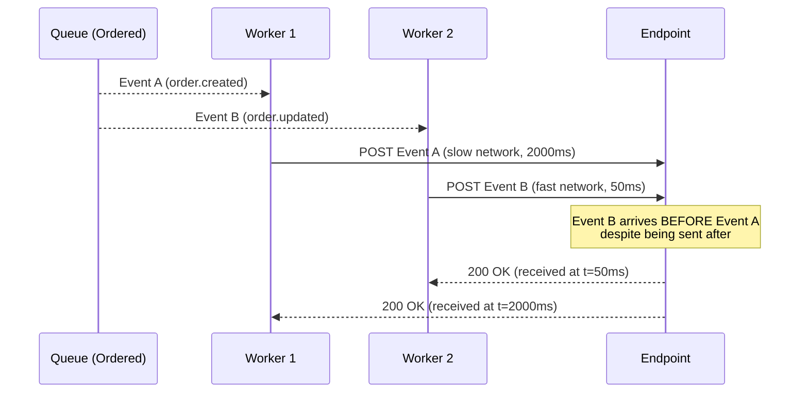
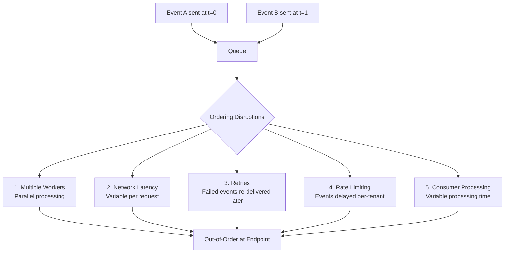
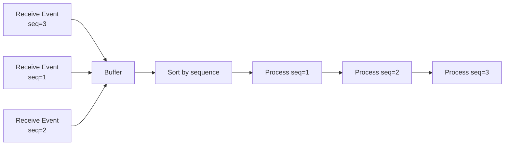
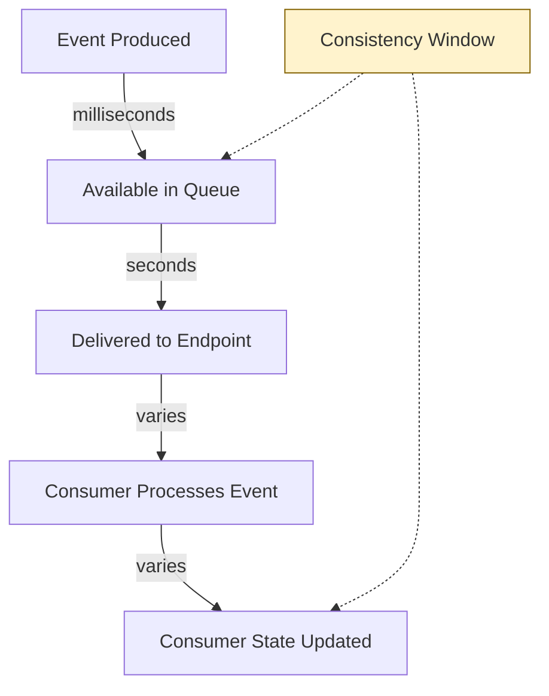

# Event Ordering

## Overview

Event ordering is one of the most nuanced challenges in webhook delivery. While producers emit events in a natural causal order, the distributed nature of queues, retries, and HTTP delivery means consumers may receive events **out of order**. This document explains why strict ordering is hard, what ordering guarantees EventRelay provides, and how consumers can handle ordering at the application level.

> [!IMPORTANT]
> **EventRelay's default guarantee: No ordering.** Standard SQS queues provide best-effort ordering with no strict guarantee. Tenants requiring ordered delivery must opt into FIFO queue routing (see [FIFO_vs_Standard.md](./FIFO_vs_Standard.md)).

---

## Why Strict Ordering Is Hard

### The Fundamental Problem

Even with a perfectly ordered queue, **distributed webhook delivery inherently breaks ordering**:



### Sources of Ordering Disruption



| Disruption Source | Description | Mitigation |
|---|---|---|
| **Concurrent workers** | Multiple workers process messages in parallel | Single-worker per group (FIFO) |
| **Network latency variation** | HTTP requests take variable time | Cannot mitigate at network level |
| **Retry timing** | Failed events re-delivered minutes/hours later | Include sequence number for consumer-side reordering |
| **Rate limiting** | Per-tenant throttling delays some events | Ordering-aware rate limiter |
| **SQS Standard reordering** | Distributed architecture causes occasional reordering | Use FIFO queue |
| **Consumer processing time** | Even with sequential delivery, async consumer processing reorders | Consumer-side buffering |

---

## Ordering Strategies

### Strategy 1: No Ordering (Default)

The simplest and highest-throughput option. Events are delivered as fast as possible with no ordering guarantees.

**When to use:**
- Events are independent (e.g., `user.login`, `email.opened`)
- Consumers are idempotent and don't depend on event ordering
- Throughput is more important than ordering
- Real-world example: Stripe webhooks (no ordering guarantee)

```
Producer Order:  A → B → C → D → E
Delivery Order:  C → A → E → B → D  (any order possible)
```

### Strategy 2: Per-Tenant Ordering (FIFO Queue)

All events for a single tenant are delivered in order. Uses FIFO queue with `tenantId` as the `MessageGroupId`.

```java
SendMessageRequest.builder()
    .queueUrl(fifoQueueUrl)
    .messageBody(taskJson)
    .messageGroupId(task.getTenantId())  // All tenant events ordered
    .messageDeduplicationId(task.getEventId())
    .build();
```

**When to use:**
- Tenant-level state changes (e.g., account lifecycle events)
- Low event volume per tenant
- Tenant expects events to arrive in causal order

**Tradeoff:**
- A slow endpoint blocks **all** events for that tenant
- Maximum parallelism = number of tenants

### Strategy 3: Per-Subscription Ordering (FIFO Queue)

Events for each subscription (tenant + endpoint combination) are ordered independently.

```java
String messageGroupId = String.format("%s:%s",
    task.getTenantId(), task.getSubscriptionId());

SendMessageRequest.builder()
    .queueUrl(fifoQueueUrl)
    .messageBody(taskJson)
    .messageGroupId(messageGroupId)
    .messageDeduplicationId(task.getEventId())
    .build();
```

**When to use:**
- A tenant has multiple subscriptions (e.g., analytics endpoint + billing endpoint)
- Ordering is important per endpoint but not across endpoints
- Better parallelism than per-tenant ordering

### Strategy 4: Per-Entity Ordering (FIFO Queue)

Events for a specific business entity (e.g., an order) are ordered, but events across entities can be parallel.

```java
// Entity-level ordering: only events for the same order are sequential
String messageGroupId = String.format("%s:%s:%s",
    task.getTenantId(), task.getEventType().getEntityType(), task.getEntityId());
// e.g., "tenant_123:order:ord_456"

SendMessageRequest.builder()
    .queueUrl(fifoQueueUrl)
    .messageBody(taskJson)
    .messageGroupId(messageGroupId)
    .messageDeduplicationId(task.getEventId())
    .build();
```

**When to use:**
- Entity lifecycle events (order, payment, shipment)
- High event volume per tenant, but each entity has few events
- Maximum parallelism within FIFO constraints

**Example:**
```
Tenant has 1000 orders:
- Per-tenant ordering:  1 stream, all events sequential
- Per-entity ordering:  1000 streams, massive parallelism
```

### Strategy 5: Consumer-Side Reordering

EventRelay delivers events unordered (Standard queue), but includes metadata that consumers can use to reorder:

```json
{
  "eventId": "evt_123",
  "eventType": "order.updated",
  "sequenceNumber": 3,
  "timestamp": "2025-01-15T10:30:00Z",
  "entityId": "order_456",
  "data": { ... }
}
```

Consumers buffer events and process them in sequence number order:



---

## Timestamp-Based Ordering

When strict ordering isn't available, consumers can use **timestamps** to determine event precedence and resolve conflicts.

### Event Timestamp Headers

EventRelay includes ordering-relevant headers in every webhook delivery:

```http
POST /webhooks HTTP/1.1
Content-Type: application/json
X-EventRelay-Event-Id: evt_01HX7K2M3N4P5Q6R7S8T9U0V
X-EventRelay-Timestamp: 1720612077
X-EventRelay-Sequence: 42
X-EventRelay-Signature: v1=5257a869...
```

| Header | Description | Usage |
|---|---|---|
| `X-EventRelay-Timestamp` | Unix timestamp when event was created | Last-write-wins conflict resolution |
| `X-EventRelay-Sequence` | Monotonically increasing per entity | Gap detection, reordering |
| `X-EventRelay-Event-Id` | Globally unique event identifier | Deduplication |

### Last-Write-Wins at the Consumer

Consumers can use timestamps to ensure they never apply a stale update:

```python
# Consumer-side ordering example (Python)
def handle_webhook(event):
    entity_id = event['data']['order_id']
    event_timestamp = event['timestamp']
    
    # Check if we've already processed a newer event
    current = db.get_last_processed_timestamp(entity_id)
    
    if current and current >= event_timestamp:
        # Stale event — skip it
        log.info(f"Skipping stale event for {entity_id}: "
                 f"current={current}, received={event_timestamp}")
        return Response(200)  # ACK to prevent retry
    
    # Apply the update
    db.update_entity(entity_id, event['data'])
    db.set_last_processed_timestamp(entity_id, event_timestamp)
    return Response(200)
```

### Sequence Number Generation

EventRelay assigns sequence numbers per entity to support gap detection:

```java
@Service
public class SequenceNumberService {
    
    private final JdbcTemplate jdbcTemplate;
    
    /**
     * Atomically generates the next sequence number for an entity.
     * Uses a PostgreSQL advisory lock for per-entity serialization.
     */
    @Transactional
    public long nextSequence(String tenantId, String entityType, 
                              String entityId) {
        String key = String.format("%s:%s:%s", tenantId, entityType, entityId);
        long lockId = key.hashCode() & 0xFFFFFFFFL;
        
        // Advisory lock prevents concurrent sequence generation for same entity
        jdbcTemplate.execute("SELECT pg_advisory_xact_lock(" + lockId + ")");
        
        return jdbcTemplate.queryForObject(
            """
            INSERT INTO entity_sequences (entity_key, sequence_number)
            VALUES (?, 1)
            ON CONFLICT (entity_key) 
            DO UPDATE SET sequence_number = entity_sequences.sequence_number + 1
            RETURNING sequence_number
            """,
            Long.class, key
        );
    }
}
```

```sql
-- Schema for sequence tracking
CREATE TABLE entity_sequences (
    entity_key   VARCHAR(512) PRIMARY KEY,
    sequence_number BIGINT NOT NULL DEFAULT 1,
    updated_at   TIMESTAMPTZ NOT NULL DEFAULT NOW()
);

CREATE INDEX idx_entity_sequences_updated 
    ON entity_sequences(updated_at);
```

---

## Handling Out-of-Order Delivery at the Consumer

### Pattern 1: Idempotent State Updates

Design state updates so that applying them out of order produces the same final state:

```
Events: order.status_changed(pending → paid)
        order.status_changed(paid → shipped)

If received as: shipped, then paid
- Naive: Apply paid → state = paid (WRONG)
- Timestamp-based: paid.timestamp < shipped.timestamp → skip paid (CORRECT)
```

### Pattern 2: Version Vectors

Include a version number with each event. Consumers reject events with stale versions:

```json
{
  "eventType": "order.updated",
  "entityVersion": 5,
  "data": {
    "order_id": "ord_123",
    "status": "shipped"
  }
}
```

```java
// Consumer implementation
public void handleOrderUpdate(WebhookEvent event) {
    int incomingVersion = event.getEntityVersion();
    
    Order order = orderRepository.findById(event.getData().getOrderId());
    if (order.getVersion() >= incomingVersion) {
        // Already processed a newer version — skip
        return;
    }
    
    order.setStatus(event.getData().getStatus());
    order.setVersion(incomingVersion);
    orderRepository.save(order); // Optimistic locking via version column
}
```

### Pattern 3: Event Sourcing Buffer

For consumers that need strict ordering, buffer events and process in order:

```java
@Service
public class OrderedEventBuffer {
    
    private final Map<String, PriorityQueue<BufferedEvent>> buffers = 
        new ConcurrentHashMap<>();
    private final Map<String, Long> lastProcessedSequence = 
        new ConcurrentHashMap<>();
    
    public void onEvent(String entityId, long sequence, WebhookEvent event) {
        PriorityQueue<BufferedEvent> buffer = buffers.computeIfAbsent(
            entityId, k -> new PriorityQueue<>(
                Comparator.comparingLong(BufferedEvent::sequence)));
        
        buffer.add(new BufferedEvent(sequence, event));
        
        // Process any events that are now in order
        drainInOrder(entityId, buffer);
    }
    
    private void drainInOrder(String entityId, 
                               PriorityQueue<BufferedEvent> buffer) {
        long expected = lastProcessedSequence.getOrDefault(entityId, 0L) + 1;
        
        while (!buffer.isEmpty() && buffer.peek().sequence() == expected) {
            BufferedEvent buffered = buffer.poll();
            processEvent(buffered.event());
            lastProcessedSequence.put(entityId, expected);
            expected++;
        }
        
        if (!buffer.isEmpty()) {
            log.debug("Gap detected for entity {}: expected seq={}, " +
                "next in buffer={}", entityId, expected, 
                buffer.peek().sequence());
        }
    }
    
    record BufferedEvent(long sequence, WebhookEvent event) {}
}
```

---

## Eventual Consistency

EventRelay operates on an **eventual consistency** model for event delivery:



### Consistency Guarantees

| Guarantee | Description |
|---|---|
| **At-least-once delivery** | Every event will be delivered at least once (possibly more) |
| **Eventual delivery** | All events will eventually be delivered (within retry window) |
| **No ordering guarantee** (Standard) | Events may arrive in any order |
| **Per-group ordering** (FIFO) | Events within a message group arrive in order |
| **Eventual consistency** | Consumer state converges to producer state eventually |

### Consistency Window

The time between event production and consumer state update:

| Component | Typical Latency | Worst Case |
|---|---|---|
| Outbox poll interval | 500ms | 1s |
| SQS send + receive | 10-50ms | 200ms |
| Webhook HTTP delivery | 100ms - 2s | 30s (timeout) |
| Consumer processing | 10ms - 500ms | Varies |
| **Total (happy path)** | **~1s** | **~32s** |
| **Total (with retries)** | Minutes to hours | 24 hours (max retry window) |

---

## Ordering Tradeoffs Summary

| Approach | Throughput | Ordering Guarantee | Complexity | Use Case |
|---|---|---|---|---|
| **No ordering (Standard)** | Unlimited | None | Low | Independent events |
| **Per-tenant FIFO** | Low | Strict per tenant | Medium | Tenant lifecycle events |
| **Per-subscription FIFO** | Medium | Strict per subscription | Medium | Multiple endpoints |
| **Per-entity FIFO** | High | Strict per entity | Medium | Entity state machines |
| **Consumer-side reorder** | Unlimited | Application-level | High | Custom consumer logic |
| **Timestamp-based LWW** | Unlimited | Causal (approximate) | Medium | Status/state updates |

> [!TIP]
> **Start without ordering guarantees.** Most webhook consumers can handle out-of-order events with timestamps and idempotency. Add ordering only when a specific business requirement demands it — and even then, prefer per-entity ordering over per-tenant ordering for better parallelism.

---

## EventRelay's Ordering Headers

Every webhook delivery from EventRelay includes these headers to support consumer-side ordering:

```http
POST /webhooks/events HTTP/1.1
Host: api.consumer.com
Content-Type: application/json

X-EventRelay-Event-Id: evt_01HX7K2M3N4P5Q6R7S8T9U0V
X-EventRelay-Timestamp: 1720612077
X-EventRelay-Sequence: 42
X-EventRelay-Entity-Id: order_12345
X-EventRelay-Attempt: 1
X-EventRelay-Signature: v1=a1b2c3d4...

{
  "type": "order.updated",
  "data": { ... }
}
```

Consumers can use `X-EventRelay-Sequence` for gap detection and `X-EventRelay-Timestamp` for last-write-wins resolution, regardless of the queue type used for delivery.

---

## Related Documents

- [FIFO_vs_Standard.md](./FIFO_vs_Standard.md) — Queue type comparison and hybrid architecture
- [Deduplication.md](./Deduplication.md) — Handling duplicate deliveries from at-least-once delivery
- [Message_Lifecycle.md](./Message_Lifecycle.md) — How retry timing affects ordering
- [Visibility_Timeout.md](./Visibility_Timeout.md) — Timeout effects on message redelivery order
