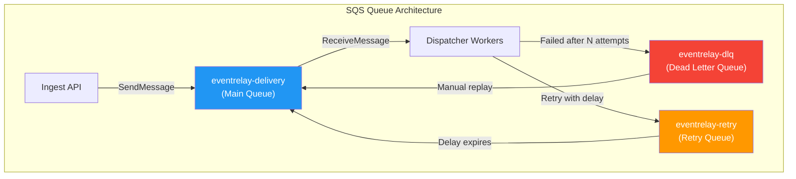

# Queue Configuration

## Overview

EventRelay uses a multi-queue architecture in AWS SQS to separate concerns across the delivery pipeline. Each queue is configured with specific attributes optimized for its role in the webhook delivery lifecycle.



---

## Queue Inventory

EventRelay provisions three SQS queues per environment:

| Queue Name | Type | Purpose | Message Volume |
|---|---|---|---|
| `eventrelay-delivery-{env}` | Standard | Primary delivery dispatch | High (all events) |
| `eventrelay-dlq-{env}` | Standard | Failed messages after max retries | Low (failure rate) |
| `eventrelay-retry-{env}` | Standard | Delayed retry scheduling | Medium (retry rate) |

---

## Queue Attributes

### Main Delivery Queue (`eventrelay-delivery`)

| Attribute | Value | Rationale |
|---|---|---|
| `VisibilityTimeout` | **60 seconds** | Must exceed max HTTP delivery time (30s timeout + processing overhead) |
| `MessageRetentionPeriod` | **1,209,600 seconds (14 days)** | Maximum retention; gives ops team time to recover from extended outages |
| `ReceiveMessageWaitTimeSeconds` | **20 seconds** | Maximum long-polling duration; reduces empty responses and API costs |
| `DelaySeconds` | **0** | No default delay; delays applied per-message for retries |
| `MaximumMessageSize` | **262,144 bytes (256 KB)** | SQS maximum; large payloads use S3 claim-check pattern |
| `RedrivePolicy` | `{"maxReceiveCount": 5, "deadLetterTargetArn": "<dlq-arn>"}` | After 5 failed receives, move to DLQ |
| `SqsManagedSseEnabled` | **true** | Server-side encryption with SQS-managed keys |

### Dead Letter Queue (`eventrelay-dlq`)

| Attribute | Value | Rationale |
|---|---|---|
| `VisibilityTimeout` | **60 seconds** | Same as main queue for consistent processing |
| `MessageRetentionPeriod` | **1,209,600 seconds (14 days)** | Maximum retention for investigation and replay |
| `ReceiveMessageWaitTimeSeconds` | **20 seconds** | Long polling for DLQ processor |
| `DelaySeconds` | **0** | No delay needed |
| `RedriveAllowPolicy` | `{"redrivePermission": "byQueue", "sourceQueueArns": ["<delivery-queue-arn>"]}` | Only accepts messages from the delivery queue |
| `SqsManagedSseEnabled` | **true** | Encrypted at rest |

> [!IMPORTANT]
> The DLQ should **not** have its own redrive policy. Messages that reach the DLQ represent permanent failures that require human investigation or automated replay logic.

### Retry Queue (`eventrelay-retry`)

| Attribute | Value | Rationale |
|---|---|---|
| `VisibilityTimeout` | **60 seconds** | Processing timeout for retry scheduling |
| `MessageRetentionPeriod` | **1,209,600 seconds (14 days)** | Retain through extended retry windows |
| `ReceiveMessageWaitTimeSeconds` | **20 seconds** | Long polling |
| `DelaySeconds` | **0** | Per-message delay used instead (0–900 seconds) |
| `SqsManagedSseEnabled` | **true** | Encrypted at rest |

> [!NOTE]
> SQS `DelaySeconds` per message is capped at **15 minutes** (900 seconds). For longer retry intervals (e.g., 1 hour, 24 hours), EventRelay uses a **scheduled retry table** in PostgreSQL that re-enqueues messages at the appropriate time.

---

## Infrastructure as Code

### Terraform Configuration

```hcl
# modules/sqs/main.tf

variable "environment" {
  type        = string
  description = "Deployment environment (dev, staging, prod)"
}

variable "max_receive_count" {
  type    = number
  default = 5
}

# Dead Letter Queue (must be created first)
resource "aws_sqs_queue" "dlq" {
  name = "eventrelay-dlq-${var.environment}"

  message_retention_seconds  = 1209600  # 14 days
  visibility_timeout_seconds = 60
  receive_wait_time_seconds  = 20
  sqs_managed_sse_enabled    = true

  tags = {
    Service     = "eventrelay"
    Environment = var.environment
    Component   = "dlq"
  }
}

# Main Delivery Queue
resource "aws_sqs_queue" "delivery" {
  name = "eventrelay-delivery-${var.environment}"

  message_retention_seconds  = 1209600  # 14 days
  visibility_timeout_seconds = 60
  receive_wait_time_seconds  = 20
  delay_seconds              = 0
  max_message_size           = 262144   # 256 KB
  sqs_managed_sse_enabled    = true

  redrive_policy = jsonencode({
    deadLetterTargetArn = aws_sqs_queue.dlq.arn
    maxReceiveCount     = var.max_receive_count
  })

  tags = {
    Service     = "eventrelay"
    Environment = var.environment
    Component   = "delivery"
  }
}

# Retry Queue
resource "aws_sqs_queue" "retry" {
  name = "eventrelay-retry-${var.environment}"

  message_retention_seconds  = 1209600  # 14 days
  visibility_timeout_seconds = 60
  receive_wait_time_seconds  = 20
  sqs_managed_sse_enabled    = true

  tags = {
    Service     = "eventrelay"
    Environment = var.environment
    Component   = "retry"
  }
}

# DLQ Redrive Allow Policy
resource "aws_sqs_queue_redrive_allow_policy" "dlq_allow" {
  queue_url = aws_sqs_queue.dlq.id

  redrive_allow_policy = jsonencode({
    redrivePermission = "byQueue"
    sourceQueueArns   = [aws_sqs_queue.delivery.arn]
  })
}

# Outputs
output "delivery_queue_url" {
  value = aws_sqs_queue.delivery.url
}

output "delivery_queue_arn" {
  value = aws_sqs_queue.delivery.arn
}

output "dlq_url" {
  value = aws_sqs_queue.dlq.url
}

output "dlq_arn" {
  value = aws_sqs_queue.dlq.arn
}

output "retry_queue_url" {
  value = aws_sqs_queue.retry.url
}
```

### CloudFormation Template

```yaml
# cloudformation/sqs-queues.yaml
AWSTemplateFormatVersion: "2010-09-09"
Description: "EventRelay SQS Queue Infrastructure"

Parameters:
  Environment:
    Type: String
    AllowedValues: [dev, staging, prod]
    Default: dev
  MaxReceiveCount:
    Type: Number
    Default: 5
    MinValue: 1
    MaxValue: 20

Resources:
  # Dead Letter Queue
  DeadLetterQueue:
    Type: AWS::SQS::Queue
    Properties:
      QueueName: !Sub "eventrelay-dlq-${Environment}"
      MessageRetentionPeriod: 1209600
      VisibilityTimeout: 60
      ReceiveMessageWaitTimeSeconds: 20
      SqsManagedSseEnabled: true
      Tags:
        - Key: Service
          Value: eventrelay
        - Key: Environment
          Value: !Ref Environment

  # Main Delivery Queue
  DeliveryQueue:
    Type: AWS::SQS::Queue
    DependsOn: DeadLetterQueue
    Properties:
      QueueName: !Sub "eventrelay-delivery-${Environment}"
      MessageRetentionPeriod: 1209600
      VisibilityTimeout: 60
      ReceiveMessageWaitTimeSeconds: 20
      DelaySeconds: 0
      MaximumMessageSize: 262144
      SqsManagedSseEnabled: true
      RedrivePolicy:
        deadLetterTargetArn: !GetAtt DeadLetterQueue.Arn
        maxReceiveCount: !Ref MaxReceiveCount
      Tags:
        - Key: Service
          Value: eventrelay
        - Key: Environment
          Value: !Ref Environment

  # Retry Queue
  RetryQueue:
    Type: AWS::SQS::Queue
    Properties:
      QueueName: !Sub "eventrelay-retry-${Environment}"
      MessageRetentionPeriod: 1209600
      VisibilityTimeout: 60
      ReceiveMessageWaitTimeSeconds: 20
      SqsManagedSseEnabled: true
      Tags:
        - Key: Service
          Value: eventrelay
        - Key: Environment
          Value: !Ref Environment

  # DLQ Redrive Allow Policy
  DeadLetterQueuePolicy:
    Type: AWS::SQS::QueuePolicy
    Properties:
      Queues:
        - !Ref DeadLetterQueue
      PolicyDocument:
        Version: "2012-10-17"
        Statement:
          - Sid: AllowRedriveFromDeliveryQueue
            Effect: Allow
            Principal:
              Service: sqs.amazonaws.com
            Action: sqs:SendMessage
            Resource: !GetAtt DeadLetterQueue.Arn
            Condition:
              ArnEquals:
                aws:SourceArn: !GetAtt DeliveryQueue.Arn

Outputs:
  DeliveryQueueUrl:
    Value: !Ref DeliveryQueue
    Export:
      Name: !Sub "${Environment}-eventrelay-delivery-queue-url"
  DeliveryQueueArn:
    Value: !GetAtt DeliveryQueue.Arn
    Export:
      Name: !Sub "${Environment}-eventrelay-delivery-queue-arn"
  DlqUrl:
    Value: !Ref DeadLetterQueue
    Export:
      Name: !Sub "${Environment}-eventrelay-dlq-url"
  DlqArn:
    Value: !GetAtt DeadLetterQueue.Arn
    Export:
      Name: !Sub "${Environment}-eventrelay-dlq-arn"
  RetryQueueUrl:
    Value: !Ref RetryQueue
    Export:
      Name: !Sub "${Environment}-eventrelay-retry-queue-url"
```

---

## IAM Access Policies

### ECS Task Role — Dispatcher Workers

```json
{
  "Version": "2012-10-17",
  "Statement": [
    {
      "Sid": "SQSConsumerPermissions",
      "Effect": "Allow",
      "Action": [
        "sqs:ReceiveMessage",
        "sqs:DeleteMessage",
        "sqs:ChangeMessageVisibility",
        "sqs:GetQueueAttributes",
        "sqs:GetQueueUrl"
      ],
      "Resource": [
        "arn:aws:sqs:us-east-1:123456789:eventrelay-delivery-*",
        "arn:aws:sqs:us-east-1:123456789:eventrelay-dlq-*"
      ]
    },
    {
      "Sid": "SQSProducerPermissions",
      "Effect": "Allow",
      "Action": [
        "sqs:SendMessage",
        "sqs:SendMessageBatch"
      ],
      "Resource": [
        "arn:aws:sqs:us-east-1:123456789:eventrelay-retry-*",
        "arn:aws:sqs:us-east-1:123456789:eventrelay-delivery-*"
      ]
    }
  ]
}
```

### ECS Task Role — Ingest API

```json
{
  "Version": "2012-10-17",
  "Statement": [
    {
      "Sid": "SQSProducerOnly",
      "Effect": "Allow",
      "Action": [
        "sqs:SendMessage",
        "sqs:SendMessageBatch",
        "sqs:GetQueueUrl"
      ],
      "Resource": [
        "arn:aws:sqs:us-east-1:123456789:eventrelay-delivery-*"
      ]
    }
  ]
}
```

> [!WARNING]
> Follow the **principle of least privilege**: the Ingest API should only have `SendMessage` permissions, never `ReceiveMessage` or `DeleteMessage`. The Dispatcher Workers need both producer (for retry) and consumer permissions.

---

## Encryption Configuration

### SSE-SQS (Default)

SQS-managed encryption is the simplest option and suitable for most use cases:

```hcl
resource "aws_sqs_queue" "delivery" {
  # ...
  sqs_managed_sse_enabled = true
}
```

### SSE-KMS (Customer-Managed Key)

For regulatory requirements (HIPAA, PCI-DSS) or cross-account access, use a customer-managed KMS key:

```hcl
resource "aws_kms_key" "sqs_key" {
  description             = "EventRelay SQS encryption key"
  deletion_window_in_days = 30
  enable_key_rotation     = true

  policy = jsonencode({
    Version = "2012-10-17"
    Statement = [
      {
        Sid    = "AllowKeyAdministration"
        Effect = "Allow"
        Principal = {
          AWS = "arn:aws:iam::123456789:root"
        }
        Action   = "kms:*"
        Resource = "*"
      },
      {
        Sid    = "AllowSQSToUseKey"
        Effect = "Allow"
        Principal = {
          Service = "sqs.amazonaws.com"
        }
        Action = [
          "kms:GenerateDataKey",
          "kms:Decrypt"
        ]
        Resource = "*"
      }
    ]
  })
}

resource "aws_kms_alias" "sqs_key_alias" {
  name          = "alias/eventrelay-sqs-${var.environment}"
  target_key_id = aws_kms_key.sqs_key.key_id
}

resource "aws_sqs_queue" "delivery_encrypted" {
  name                              = "eventrelay-delivery-${var.environment}"
  kms_master_key_id                 = aws_kms_key.sqs_key.arn
  kms_data_key_reuse_period_seconds = 300  # 5 minutes
  # ... other attributes
}
```

> [!NOTE]
> When using SSE-KMS, the ECS task role must also have `kms:GenerateDataKey` and `kms:Decrypt` permissions on the KMS key. SSE-KMS adds ~$1/month per key plus $0.03 per 10,000 API calls for encrypt/decrypt operations.

---

## Queue Policies

### Resource-Based Policy (Cross-Account Access)

If EventRelay components run in different AWS accounts:

```json
{
  "Version": "2012-10-17",
  "Statement": [
    {
      "Sid": "AllowCrossAccountSend",
      "Effect": "Allow",
      "Principal": {
        "AWS": "arn:aws:iam::987654321:role/eventrelay-ingest-role"
      },
      "Action": "sqs:SendMessage",
      "Resource": "arn:aws:sqs:us-east-1:123456789:eventrelay-delivery-prod",
      "Condition": {
        "StringEquals": {
          "aws:PrincipalOrgID": "o-exampleorgid"
        }
      }
    }
  ]
}
```

---

## Environment-Specific Configuration

| Parameter | Development | Staging | Production |
|---|---|---|---|
| `VisibilityTimeout` | 30s | 60s | 60s |
| `MessageRetentionPeriod` | 4 days | 14 days | 14 days |
| `MaxReceiveCount` (DLQ) | 3 | 5 | 5 |
| Encryption | SSE-SQS | SSE-SQS | SSE-KMS |
| Consumer Concurrency | 2 | 5 | 10 |
| Max In-Flight | 20 | 100 | 500 |
| Long Poll Wait | 5s | 20s | 20s |

---

## Production Considerations

### Queue Naming Convention
Use consistent naming: `{service}-{component}-{environment}`
- `eventrelay-delivery-prod`
- `eventrelay-dlq-prod`
- `eventrelay-retry-prod`

### Tagging Strategy
Apply consistent tags for cost allocation and resource management:
- `Service`: `eventrelay`
- `Environment`: `dev|staging|prod`
- `Component`: `delivery|dlq|retry`
- `Owner`: `platform-team`
- `CostCenter`: `eng-infrastructure`

### Multi-Region
For disaster recovery, consider:
- Cross-region queue replication is **not native** to SQS
- Use application-level replication: write to both regions
- Or use a multi-region active-passive setup with DNS failover

---

## Related Documents

- [AWS_SQS.md](./AWS_SQS.md) — SQS fundamentals and Spring Boot integration
- [Message_Lifecycle.md](./Message_Lifecycle.md) — Message state transitions
- [Visibility_Timeout.md](./Visibility_Timeout.md) — Timeout configuration deep dive
- [Poison_Messages.md](./Poison_Messages.md) — DLQ and redrive configuration
- [Queue_Monitoring.md](./Queue_Monitoring.md) — Monitoring queue health
