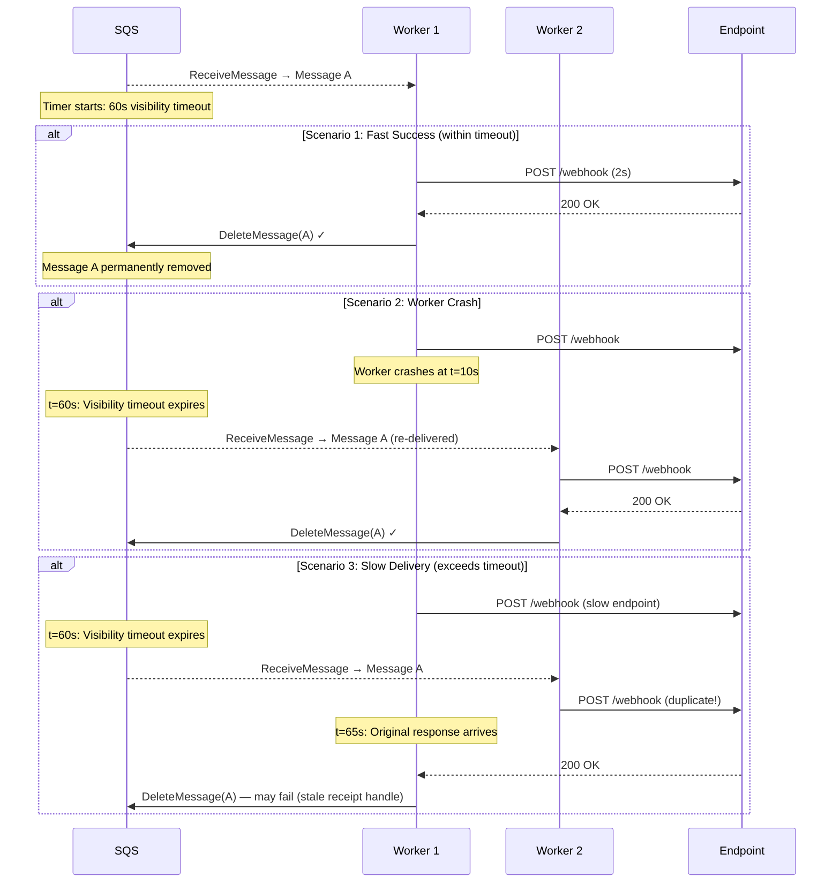
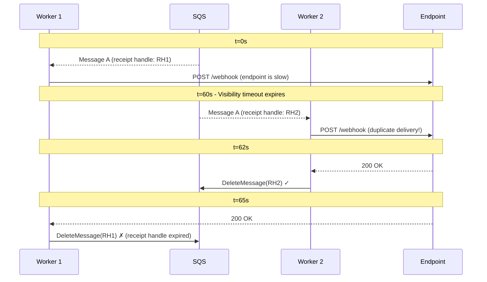

# Visibility Timeout

## Overview

The **visibility timeout** is the single most critical SQS configuration parameter for EventRelay's delivery guarantees. It defines how long a message remains invisible to other consumers after being received. If the consumer fails to delete the message within this window, SQS assumes processing failed and makes the message available again.

> [!IMPORTANT]
> Setting the visibility timeout too low causes **duplicate deliveries**. Setting it too high delays **retries** after genuine failures. This document provides the formulas and reasoning for EventRelay's 60-second default.

---

## Why Visibility Timeout Matters

### At-Least-Once Delivery Guarantee

SQS Standard queues guarantee **at-least-once** delivery. The visibility timeout is the mechanism that makes this work:



---

## Calculating Optimal Visibility Timeout

### The Formula

```
VisibilityTimeout = MaxHTTPDeliveryTime + ProcessingOverhead + SafetyMargin
```

For EventRelay:

| Component | Value | Reasoning |
|---|---|---|
| **Max HTTP delivery timeout** | 30 seconds | EventRelay's HTTP client timeout for webhook delivery |
| **Pre-delivery processing** | 2 seconds | Deserialize, validate, rate-limit check, HMAC signing |
| **Post-delivery processing** | 3 seconds | Record result to database, update metrics |
| **Connection establishment** | 5 seconds | DNS resolution + TCP + TLS handshake (worst case) |
| **Safety margin** | 20 seconds | Buffer for GC pauses, network jitter, slow DB writes |
| **Total** | **60 seconds** | EventRelay's configured visibility timeout |

### Why Not Shorter?

| Visibility Timeout | Risk |
|---|---|
| **30s** | If HTTP timeout is 30s, any processing overhead causes timeout. High duplicate delivery rate. |
| **45s** | Marginal safety margin. GC pauses or slow database writes cause duplicates. |
| **60s** ✓ | Comfortable margin. Duplicates only occur in extreme edge cases. |

### Why Not Longer?

| Visibility Timeout | Risk |
|---|---|
| **60s** ✓ | Retries begin within 60s of a failed attempt. Acceptable for webhook delivery. |
| **120s** | 2 minutes before retry on failure. Unnecessary delay for most failures (which fail fast). |
| **300s** | 5 minutes between failure and retry. Unacceptably slow for time-sensitive webhooks. |
| **900s** | 15 minutes. Only appropriate if processing genuinely takes this long. |

> [!TIP]
> The visibility timeout represents a **tradeoff between duplicate deliveries and retry speed**. For webhook delivery, 60 seconds hits the sweet spot: fast enough for retries, long enough to avoid most duplicates.

---

## Visibility Timeout Extension

For slow endpoints that may legitimately take longer than the default timeout, EventRelay uses `ChangeMessageVisibility` to **extend** the timeout dynamically.

### Heartbeat Pattern

```java
@Component
@Slf4j
public class VisibilityTimeoutExtender {

    private static final int EXTENSION_SECONDS = 30;
    private static final int HEARTBEAT_INTERVAL_MS = 20_000; // 20 seconds

    private final SqsClient sqsClient;
    private final ScheduledExecutorService scheduler;

    /**
     * Starts a background heartbeat that extends the visibility timeout
     * every 20 seconds. Returns a handle to stop the heartbeat.
     */
    public HeartbeatHandle startHeartbeat(String queueUrl, 
                                           String receiptHandle,
                                           int initialTimeoutSeconds) {
        AtomicBoolean active = new AtomicBoolean(true);
        AtomicInteger totalExtensions = new AtomicInteger(0);
        
        // Maximum total processing time: 5 minutes (10 extensions × 30s)
        int maxExtensions = 10;

        ScheduledFuture<?> future = scheduler.scheduleAtFixedRate(() -> {
            if (!active.get()) return;
            
            if (totalExtensions.get() >= maxExtensions) {
                log.warn("Max visibility extensions reached ({}), " +
                    "message will become visible", maxExtensions);
                active.set(false);
                return;
            }
            
            try {
                sqsClient.changeMessageVisibility(
                    ChangeMessageVisibilityRequest.builder()
                        .queueUrl(queueUrl)
                        .receiptHandle(receiptHandle)
                        .visibilityTimeout(EXTENSION_SECONDS)
                        .build());
                
                totalExtensions.incrementAndGet();
                log.debug("Extended visibility timeout by {}s (extension #{})",
                    EXTENSION_SECONDS, totalExtensions.get());
            } catch (SqsException e) {
                log.error("Failed to extend visibility timeout", e);
                active.set(false);
            }
        }, HEARTBEAT_INTERVAL_MS, HEARTBEAT_INTERVAL_MS, TimeUnit.MILLISECONDS);

        return new HeartbeatHandle(future, active);
    }

    public record HeartbeatHandle(ScheduledFuture<?> future, 
                                   AtomicBoolean active) {
        public void stop() {
            active.set(false);
            future.cancel(false);
        }
    }
}
```

### Using the Heartbeat in Delivery

```java
@Service
public class WebhookDeliveryProcessor {

    private final VisibilityTimeoutExtender extender;
    private final HttpWebhookClient httpClient;

    public DeliveryResult processWithHeartbeat(String queueUrl,
                                                Message sqsMessage,
                                                DeliveryTask task) {
        HeartbeatHandle heartbeat = null;
        try {
            // Start heartbeat for potentially slow deliveries
            if (task.getExpectedSlowDelivery()) {
                heartbeat = extender.startHeartbeat(
                    queueUrl,
                    sqsMessage.receiptHandle(),
                    60  // initial timeout
                );
            }
            
            return httpClient.deliver(task);
        } finally {
            if (heartbeat != null) {
                heartbeat.stop();
            }
        }
    }
}
```

### Extension Constraints

| Constraint | Value | Notes |
|---|---|---|
| **Maximum visibility timeout** | 12 hours (43,200 seconds) | SQS hard limit |
| **Minimum visibility timeout** | 0 seconds | Immediately makes message visible |
| **Extension granularity** | Resets the entire timeout | Not additive; sets a new timeout from `now` |
| **Stale receipt handle** | Extension fails | If the message was re-delivered to another consumer |

> [!WARNING]
> `ChangeMessageVisibility` is **not additive**. Setting `visibilityTimeout=30` resets the clock to 30 seconds from the API call, regardless of how much time was remaining.

---

## Race Conditions

### Race Condition 1: Slow Delivery After Timeout



**Mitigation:**
- Use the **heartbeat pattern** to extend visibility for slow deliveries
- Design webhook consumers to be **idempotent** using the `idempotencyKey` header
- Monitor `ApproximateReceiveCount > 1` as an indicator of this race condition

### Race Condition 2: Concurrent Visibility Extension and Timeout

```
Worker                   SQS
  │                       │
  │  ChangeVisibility(30s)│
  ├──────────────────────>│
  │                       │  ← Timeout expires between request
  │                       │    send and SQS processing
  │     Error: Invalid    │
  │<──────────────────────│
  │                       │
  │  Message re-delivered │
  │  to another worker    │
```

**Mitigation:**
- Extend visibility **well before** it expires (at 2/3 of the timeout period)
- Handle `InvalidParameterValue` or `MessageNotInflight` exceptions gracefully
- If extension fails, **stop processing** and let the new consumer handle it

### Race Condition 3: Delete After Re-delivery

```java
// WRONG: This can fail silently
try {
    sqsClient.deleteMessage(deleteRequest);
} catch (ReceiptHandleIsInvalidException e) {
    // The message was already re-delivered to another consumer.
    // Our receipt handle is no longer valid.
    // This is NOT an error — just log and move on.
    log.info("Message already re-delivered, delete skipped: {}",
        message.messageId());
}
```

---

## Visibility Timeout vs Retry Timing

The visibility timeout and the retry engine interact closely. EventRelay uses **two retry mechanisms**:

### Mechanism 1: SQS Visibility Timeout (Implicit Retry)

When the consumer does not delete a message, it automatically becomes available after the visibility timeout. This provides a **fast implicit retry** suitable for transient failures.

```
Attempt 1: t=0s      → Fails → Message invisible for 60s
Attempt 2: t=60s     → Fails → Message invisible for 60s
Attempt 3: t=120s    → Fails → Message invisible for 60s
... until maxReceiveCount exceeded → DLQ
```

**Problem:** Fixed 60s interval doesn't implement exponential backoff.

### Mechanism 2: Explicit Retry with Delay Queue

For proper exponential backoff, the consumer **deletes** the original message and **sends a new message** to the retry queue with a calculated delay:

```java
@Service
public class RetryScheduler {

    private static final int[] BACKOFF_SECONDS = {
        1, 5, 30, 300, 3600, 7200, 14400, 43200
    };
    // 1s, 5s, 30s, 5min, 1hr, 2hr, 4hr, 12hr
    
    private static final int MAX_SQS_DELAY = 900; // 15 minutes

    public void scheduleRetry(DeliveryTask task, Message originalMessage) {
        int attempt = task.getAttemptNumber();
        
        if (attempt >= BACKOFF_SECONDS.length) {
            // Max retries exceeded — let it go to DLQ
            log.warn("Max retries exceeded for event {}", task.getEventId());
            return;
        }
        
        int delaySeconds = calculateBackoff(attempt);
        
        // Delete original message to prevent SQS implicit retry
        sqsClient.deleteMessage(DeleteMessageRequest.builder()
            .queueUrl(deliveryQueueUrl)
            .receiptHandle(originalMessage.receiptHandle())
            .build());
        
        if (delaySeconds <= MAX_SQS_DELAY) {
            // Use SQS per-message delay (up to 15 minutes)
            sqsClient.sendMessage(SendMessageRequest.builder()
                .queueUrl(deliveryQueueUrl)
                .messageBody(objectMapper.writeValueAsString(
                    task.withAttemptNumber(attempt + 1)))
                .delaySeconds(delaySeconds)
                .messageAttributes(buildAttributes(task))
                .build());
        } else {
            // For delays > 15 min, schedule via PostgreSQL
            retryScheduleRepository.save(RetrySchedule.builder()
                .eventId(task.getEventId())
                .subscriptionId(task.getSubscriptionId())
                .scheduledAt(Instant.now().plusSeconds(delaySeconds))
                .taskPayload(objectMapper.writeValueAsString(task))
                .build());
        }
    }
    
    private int calculateBackoff(int attempt) {
        int baseDelay = BACKOFF_SECONDS[
            Math.min(attempt, BACKOFF_SECONDS.length - 1)];
        // Add jitter: ±25%
        double jitter = 0.75 + (Math.random() * 0.5);
        return (int) (baseDelay * jitter);
    }
}
```

### Choosing Between Implicit and Explicit Retry

| Scenario | Implicit (Visibility Timeout) | Explicit (Delay Queue) |
|---|---|---|
| **Transient network error** | ✓ Fast retry in 60s | Overkill |
| **Endpoint temporarily down** | ✗ Fixed 60s interval too fast | ✓ Exponential backoff |
| **Rate limit exceeded (429)** | ✗ No backoff control | ✓ Honor `Retry-After` header |
| **Consumer crash** | ✓ Automatic retry | N/A (consumer is dead) |
| **Processing timeout** | ✓ Automatic retry | N/A (timeout caused retry) |

> [!NOTE]
> EventRelay's approach: On the **first failure**, allow implicit retry via visibility timeout (fast retry). On **subsequent failures**, switch to explicit retry with exponential backoff to avoid overwhelming the target endpoint.

---

## Monitoring Visibility Timeout Health

### Key Metrics

```java
@Component
public class VisibilityTimeoutMetrics {
    
    private final MeterRegistry meterRegistry;
    
    public void recordProcessingTime(long processingTimeMs, 
                                      int visibilityTimeoutMs) {
        meterRegistry.timer("sqs.message.processing.time")
            .record(processingTimeMs, TimeUnit.MILLISECONDS);
        
        double timeoutUtilization = 
            (double) processingTimeMs / visibilityTimeoutMs;
        meterRegistry.gauge("sqs.visibility.utilization", 
            timeoutUtilization);
        
        if (timeoutUtilization > 0.8) {
            meterRegistry.counter("sqs.visibility.near_timeout").increment();
            log.warn("Processing time {}ms is {}% of visibility timeout {}ms",
                processingTimeMs, 
                (int)(timeoutUtilization * 100), 
                visibilityTimeoutMs);
        }
    }
}
```

### Alarm Thresholds

| Metric | Warning | Critical | Action |
|---|---|---|---|
| Processing time / Visibility timeout | > 60% | > 80% | Increase visibility timeout or optimize processing |
| `ApproximateReceiveCount` distribution | p99 > 2 | p99 > 3 | Investigate slow processing or endpoint issues |
| Visibility extension failures | > 1/min | > 10/min | Check for receipt handle expiry issues |
| Duplicate delivery rate | > 1% | > 5% | Visibility timeout likely too short |

---

## Configuration by Environment

| Environment | Visibility Timeout | HTTP Timeout | Safety Margin | Heartbeat |
|---|---|---|---|---|
| **Development** | 30s | 10s | 20s | Disabled |
| **Staging** | 60s | 30s | 20s | Enabled |
| **Production** | 60s | 30s | 20s | Enabled |
| **Load Testing** | 90s | 30s | 50s | Enabled |

---

## Best Practices

1. **Always set visibility timeout > HTTP timeout + overhead** — this is the cardinal rule
2. **Use the heartbeat pattern** for endpoints that may respond slowly
3. **Monitor timeout utilization** — if processing regularly uses >60% of the timeout, increase it
4. **Design for idempotency** — despite best efforts, duplicate deliveries can occur
5. **Don't set visibility timeout for retry timing** — use explicit retry with backoff instead
6. **Handle stale receipt handles gracefully** — they indicate a timeout race, not a bug
7. **Log visibility extensions** — they reveal slow endpoints that may need attention

---

## Related Documents

- [AWS_SQS.md](./AWS_SQS.md) — SQS fundamentals and configuration
- [Message_Lifecycle.md](./Message_Lifecycle.md) — How visibility timeout fits in the message lifecycle
- [Queue_Configuration.md](./Queue_Configuration.md) — Configuring visibility timeout per queue
- [Poison_Messages.md](./Poison_Messages.md) — When repeated retries indicate a poison message
