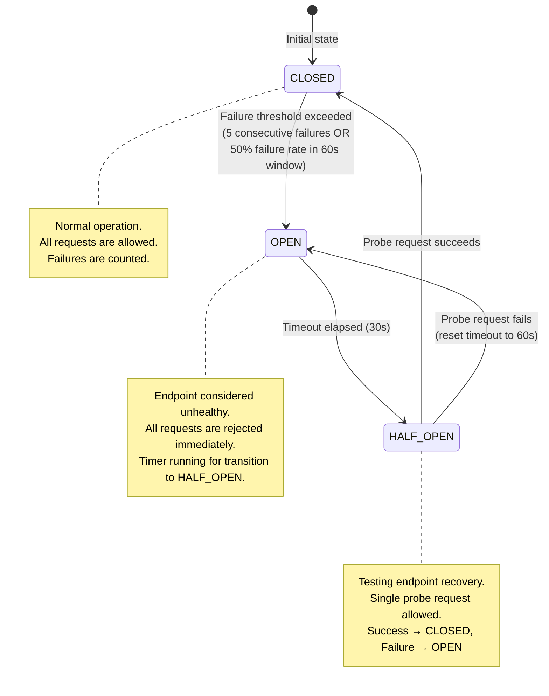
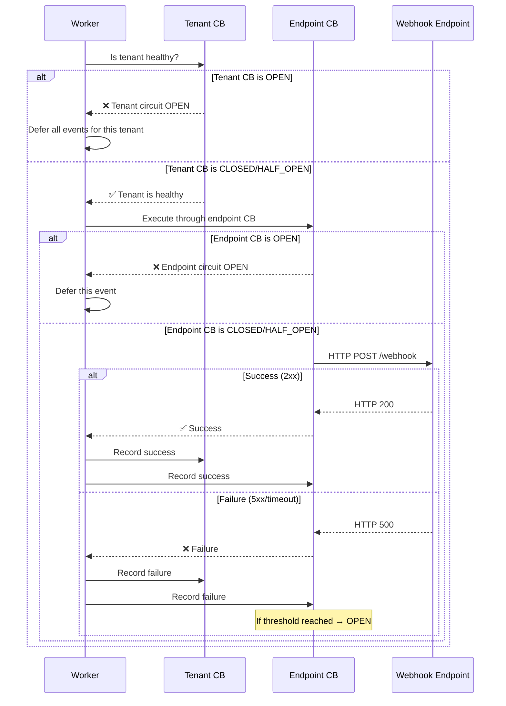
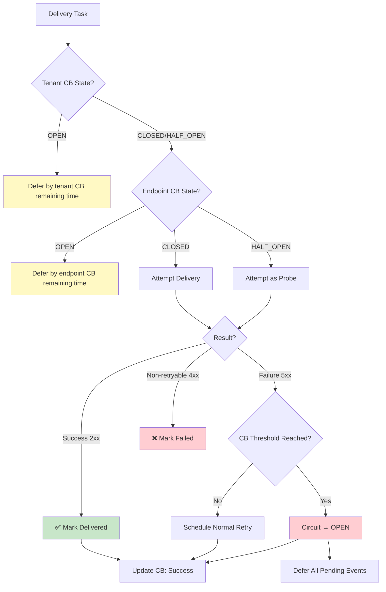

# Circuit Breakers

> **Document Status**: Production Reference  
> **Last Updated**: 2026-07-10  
> **Audience**: Backend Engineers, SREs  
> **Related Documents**: [Retry_Strategies.md](./Retry_Strategies.md), [Failure_Scenarios.md](./Failure_Scenarios.md), [Delivery_Guarantees.md](./Delivery_Guarantees.md)

---

## 1. Overview

Circuit breakers in EventRelay prevent cascading failures by detecting unhealthy webhook endpoints and temporarily stopping delivery attempts. This protects both EventRelay's resources and the failing endpoint from being overwhelmed by retries during outages.

EventRelay implements circuit breakers at two levels:
1. **Per-endpoint circuit breakers** — track health of individual webhook URLs
2. **Per-tenant circuit breakers** — track aggregate health across all endpoints for a tenant

---

## 2. Circuit Breaker State Machine



---

## 3. State Definitions

### 3.1 CLOSED (Normal Operation)

| Property | Value |
|---|---|
| **Behavior** | All delivery attempts are allowed |
| **Failure tracking** | Sliding window of 60 seconds, count-based |
| **Transition to OPEN** | 5 consecutive failures OR 50% failure rate in window (min 10 calls) |
| **Metrics recorded** | Success count, failure count, response times |

### 3.2 OPEN (Circuit Tripped)

| Property | Value |
|---|---|
| **Behavior** | All delivery attempts immediately rejected (not attempted) |
| **Duration** | 30 seconds (initial), doubles on repeated failures (max 5 minutes) |
| **Transition to HALF_OPEN** | Automatic after timeout duration |
| **Events during OPEN** | Queued for retry after circuit closes (not lost) |

### 3.3 HALF_OPEN (Recovery Probe)

| Property | Value |
|---|---|
| **Behavior** | Single probe request allowed; all others queued |
| **Transition to CLOSED** | 1 successful probe request |
| **Transition to OPEN** | 1 failed probe request (timeout doubles, capped at 5m) |
| **Probe selection** | Oldest queued event is used as the probe |

---

## 4. Configuration

### 4.1 Circuit Breaker Parameters

```yaml
eventrelay:
  circuit-breaker:
    # Per-endpoint circuit breaker
    endpoint:
      failure-rate-threshold: 50           # Percentage (50%)
      consecutive-failure-threshold: 5     # Consecutive failures to trip
      sliding-window-type: COUNT_BASED     # COUNT_BASED or TIME_BASED
      sliding-window-size: 10              # Number of calls in window
      minimum-number-of-calls: 5           # Min calls before rate evaluation
      wait-duration-in-open-state: 30s     # Initial open state duration
      max-wait-duration-in-open-state: 5m  # Maximum open state duration
      permitted-calls-in-half-open: 1      # Probe requests in half-open
      record-failure-predicate: "status >= 500 || timeout"
      ignore-exceptions:                   # Don't count as failures
        - java.net.UnknownHostException    # DNS failures use separate handling

    # Per-tenant circuit breaker (aggregate)
    tenant:
      failure-rate-threshold: 70           # Higher threshold (aggregate)
      sliding-window-type: TIME_BASED
      sliding-window-size: 120             # 120 second window
      minimum-number-of-calls: 20          # Need more samples
      wait-duration-in-open-state: 60s     # Longer cooldown
      max-wait-duration-in-open-state: 10m
      permitted-calls-in-half-open: 3      # More probes for tenant-level
```

### 4.2 Parameter Rationale

| Parameter | Value | Rationale |
|---|---|---|
| Failure rate threshold | 50% | Balanced — avoids tripping on occasional failures |
| Consecutive failures | 5 | Fast response to complete outages |
| Window size | 10 calls | Small enough for quick detection, large enough to avoid noise |
| Min calls before evaluation | 5 | Prevents tripping on low-volume endpoints |
| Open duration (initial) | 30 seconds | Short enough for quick recovery detection |
| Open duration (max) | 5 minutes | Prevents excessive probing of long outages |
| Half-open probes | 1 | Conservative — single probe to avoid overwhelming recovering endpoint |

---

## 5. Implementation

### 5.1 Resilience4j Integration

```java
@Configuration
public class CircuitBreakerConfig {

    @Bean
    public CircuitBreakerRegistry endpointCircuitBreakerRegistry() {
        CircuitBreakerConfig config = CircuitBreakerConfig.custom()
                .failureRateThreshold(50)
                .slidingWindowType(SlidingWindowType.COUNT_BASED)
                .slidingWindowSize(10)
                .minimumNumberOfCalls(5)
                .waitDurationInOpenState(Duration.ofSeconds(30))
                .permittedNumberOfCallsInHalfOpenState(1)
                .recordExceptions(
                        WebhookDeliveryException.class,
                        SocketTimeoutException.class,
                        ConnectTimeoutException.class
                )
                .ignoreExceptions(
                        NonRetryableException.class  // 4xx client errors
                )
                .automaticTransitionFromOpenToHalfOpenEnabled(true)
                .build();

        return CircuitBreakerRegistry.of(config);
    }

    @Bean
    public CircuitBreakerRegistry tenantCircuitBreakerRegistry() {
        CircuitBreakerConfig config = CircuitBreakerConfig.custom()
                .failureRateThreshold(70)
                .slidingWindowType(SlidingWindowType.TIME_BASED)
                .slidingWindowSize(120)
                .minimumNumberOfCalls(20)
                .waitDurationInOpenState(Duration.ofSeconds(60))
                .permittedNumberOfCallsInHalfOpenState(3)
                .automaticTransitionFromOpenToHalfOpenEnabled(true)
                .build();

        return CircuitBreakerRegistry.of(config);
    }
}
```

### 5.2 Per-Endpoint Circuit Breaker Service

```java
@Service
@Slf4j
public class EndpointCircuitBreakerService {

    private final CircuitBreakerRegistry registry;
    private final MeterRegistry metrics;

    // Track open duration escalation per endpoint
    private final ConcurrentHashMap<String, Duration> openDurationMap = new ConcurrentHashMap<>();
    private static final Duration INITIAL_OPEN_DURATION = Duration.ofSeconds(30);
    private static final Duration MAX_OPEN_DURATION = Duration.ofMinutes(5);

    /**
     * Gets or creates a circuit breaker for a specific webhook endpoint.
     */
    public CircuitBreaker getCircuitBreaker(String endpointId) {
        return registry.circuitBreaker(
                "endpoint-" + endpointId,
                this::createEndpointConfig
        );
    }

    /**
     * Attempts delivery through the circuit breaker.
     * Returns a DeliveryResult indicating success, failure, or circuit-open rejection.
     */
    public DeliveryResult executeWithCircuitBreaker(String endpointId,
                                                     Supplier<DeliveryOutcome> deliveryAction) {
        CircuitBreaker cb = getCircuitBreaker(endpointId);

        try {
            DeliveryOutcome outcome = CircuitBreaker.decorateSupplier(cb, deliveryAction).get();

            if (outcome.isSuccess()) {
                // Reset open duration on success
                openDurationMap.remove(endpointId);
                recordStateTransition(endpointId, "success");
                return DeliveryResult.success(outcome);
            } else if (outcome.isRetryable()) {
                // Record as failure for circuit breaker counting
                cb.onError(
                        outcome.getDuration().toMillis(),
                        TimeUnit.MILLISECONDS,
                        new WebhookDeliveryException(outcome.getStatusCode())
                );
                return DeliveryResult.failure(outcome);
            } else {
                // Non-retryable (4xx) — don't count against circuit breaker
                return DeliveryResult.permanentFailure(outcome);
            }
        } catch (CallNotPermittedException e) {
            // Circuit breaker is OPEN — request not attempted
            log.debug("Circuit breaker OPEN for endpoint {}, rejecting delivery", endpointId);
            metrics.counter("eventrelay.circuit_breaker.rejected",
                    "endpoint", endpointId).increment();
            return DeliveryResult.circuitOpen(getRemainingOpenTime(endpointId));
        }
    }

    /**
     * Escalates the open duration after a failed half-open probe.
     */
    public void escalateOpenDuration(String endpointId) {
        openDurationMap.compute(endpointId, (key, current) -> {
            Duration next = (current == null)
                    ? INITIAL_OPEN_DURATION.multipliedBy(2)
                    : current.multipliedBy(2);
            return next.compareTo(MAX_OPEN_DURATION) > 0 ? MAX_OPEN_DURATION : next;
        });

        Duration newDuration = openDurationMap.get(endpointId);
        log.info("Escalated circuit breaker open duration for endpoint {} to {}s",
                endpointId, newDuration.getSeconds());
    }

    private void recordStateTransition(String endpointId, String transition) {
        metrics.counter("eventrelay.circuit_breaker.transitions",
                "endpoint", endpointId,
                "transition", transition
        ).increment();
    }
}
```

### 5.3 Per-Tenant Circuit Breaker

```java
@Service
@Slf4j
public class TenantCircuitBreakerService {

    private final CircuitBreakerRegistry tenantRegistry;
    private final MeterRegistry metrics;

    /**
     * Checks tenant-level circuit breaker before any endpoint delivery.
     * This prevents a tenant with many failing endpoints from consuming
     * excessive worker resources.
     */
    public boolean isTenantHealthy(String tenantId) {
        CircuitBreaker cb = tenantRegistry.circuitBreaker("tenant-" + tenantId);
        return cb.getState() != CircuitBreaker.State.OPEN;
    }

    /**
     * Records a delivery outcome against the tenant circuit breaker.
     */
    public void recordOutcome(String tenantId, boolean success) {
        CircuitBreaker cb = tenantRegistry.circuitBreaker("tenant-" + tenantId);
        if (success) {
            cb.onSuccess(0, TimeUnit.MILLISECONDS);
        } else {
            cb.onError(0, TimeUnit.MILLISECONDS,
                    new TenantDeliveryException(tenantId));
        }
    }

    /**
     * Gets the current state and metrics for a tenant's circuit breaker.
     */
    public TenantCircuitBreakerStatus getStatus(String tenantId) {
        CircuitBreaker cb = tenantRegistry.circuitBreaker("tenant-" + tenantId);
        CircuitBreaker.Metrics cbMetrics = cb.getMetrics();

        return TenantCircuitBreakerStatus.builder()
                .tenantId(tenantId)
                .state(cb.getState().name())
                .failureRate(cbMetrics.getFailureRate())
                .numberOfSuccessfulCalls(cbMetrics.getNumberOfSuccessfulCalls())
                .numberOfFailedCalls(cbMetrics.getNumberOfFailedCalls())
                .numberOfNotPermittedCalls(cbMetrics.getNumberOfNotPermittedCalls())
                .build();
    }
}
```

### 5.4 Combined Circuit Breaker Flow



---

## 6. Circuit Breaker State Persistence

Circuit breaker state is stored in Redis for cross-worker consistency:

```java
@Component
public class DistributedCircuitBreakerState {

    private static final String KEY_PREFIX = "cb:endpoint:";
    private static final Duration STATE_TTL = Duration.ofHours(1);

    private final StringRedisTemplate redis;

    /**
     * Persists circuit breaker state to Redis for cross-worker visibility.
     */
    public void persistState(String endpointId, CircuitBreakerSnapshot snapshot) {
        String key = KEY_PREFIX + endpointId;
        Map<String, String> state = Map.of(
                "state", snapshot.getState().name(),
                "failure_count", String.valueOf(snapshot.getFailureCount()),
                "success_count", String.valueOf(snapshot.getSuccessCount()),
                "failure_rate", String.valueOf(snapshot.getFailureRate()),
                "last_failure_at", snapshot.getLastFailureAt().toString(),
                "open_until", snapshot.getOpenUntil() != null
                        ? snapshot.getOpenUntil().toString() : "",
                "updated_at", Instant.now().toString()
        );

        redis.opsForHash().putAll(key, state);
        redis.expire(key, STATE_TTL);
    }

    /**
     * Loads circuit breaker state from Redis.
     * Used when a new worker starts or when state is not in local cache.
     */
    public Optional<CircuitBreakerSnapshot> loadState(String endpointId) {
        String key = KEY_PREFIX + endpointId;
        Map<Object, Object> state = redis.opsForHash().entries(key);

        if (state.isEmpty()) {
            return Optional.empty();
        }

        return Optional.of(CircuitBreakerSnapshot.builder()
                .state(CircuitBreaker.State.valueOf((String) state.get("state")))
                .failureCount(Integer.parseInt((String) state.get("failure_count")))
                .successCount(Integer.parseInt((String) state.get("success_count")))
                .failureRate(Float.parseFloat((String) state.get("failure_rate")))
                .lastFailureAt(Instant.parse((String) state.get("last_failure_at")))
                .openUntil(parseOptionalInstant((String) state.get("open_until")))
                .build());
    }
}
```

---

## 7. Integration with Retry Logic

### 7.1 Retry Deferral When Circuit Is Open

When a circuit breaker is OPEN, events are not retried immediately. Instead, they are deferred until the circuit transitions to HALF_OPEN:

```java
@Service
public class CircuitAwareRetryService {

    private final EndpointCircuitBreakerService endpointCB;
    private final TenantCircuitBreakerService tenantCB;
    private final RetryEngine retryEngine;

    public DeliveryResult processDelivery(DeliveryTask task) {
        String endpointId = task.getEndpointId();
        String tenantId = task.getTenantId();

        // 1. Check tenant-level circuit breaker
        if (!tenantCB.isTenantHealthy(tenantId)) {
            long deferMs = tenantCB.getRemainingOpenTimeMs(tenantId);
            log.debug("Tenant {} circuit OPEN, deferring event {} by {}ms",
                    tenantId, task.getEventId(), deferMs);
            return DeliveryResult.deferred(deferMs);
        }

        // 2. Check endpoint-level circuit breaker
        CircuitBreaker cb = endpointCB.getCircuitBreaker(endpointId);
        if (cb.getState() == CircuitBreaker.State.OPEN) {
            long deferMs = endpointCB.getRemainingOpenTimeMs(endpointId);
            log.debug("Endpoint {} circuit OPEN, deferring event {} by {}ms",
                    endpointId, task.getEventId(), deferMs);
            return DeliveryResult.deferred(deferMs);
        }

        // 3. Attempt delivery through circuit breaker
        DeliveryResult result = endpointCB.executeWithCircuitBreaker(
                endpointId,
                () -> webhookDeliveryService.deliver(task)
        );

        // 4. Record outcome for tenant-level tracking
        tenantCB.recordOutcome(tenantId, result.isSuccess());

        // 5. Handle retry scheduling
        if (result.requiresRetry()) {
            return retryEngine.scheduleRetry(task, result);
        }

        return result;
    }
}
```

### 7.2 Interaction Diagram



---

## 8. Event Listener for State Transitions

```java
@Component
@Slf4j
public class CircuitBreakerEventListener {

    private final MeterRegistry metrics;
    private final NotificationService notificationService;
    private final DistributedCircuitBreakerState stateStore;

    @EventListener
    public void onCircuitBreakerStateTransition(CircuitBreakerOnStateTransitionEvent event) {
        String cbName = event.getCircuitBreakerName();
        CircuitBreaker.StateTransition transition = event.getStateTransition();

        log.info("Circuit breaker '{}' state transition: {} → {}",
                cbName, transition.getFromState(), transition.getToState());

        // Record metric
        metrics.counter("eventrelay.circuit_breaker.transitions",
                "name", cbName,
                "from", transition.getFromState().name(),
                "to", transition.getToState().name()
        ).increment();

        // Persist to Redis
        stateStore.persistState(extractEndpointId(cbName),
                CircuitBreakerSnapshot.from(event.getCircuitBreaker()));

        // Send notifications for important transitions
        switch (transition) {
            case CLOSED_TO_OPEN -> {
                log.warn("⚠️ Circuit breaker OPENED for {}", cbName);
                notificationService.sendAlert(AlertLevel.WARNING,
                        "Circuit breaker opened for " + cbName,
                        buildCircuitOpenContext(event.getCircuitBreaker()));
            }
            case OPEN_TO_HALF_OPEN -> {
                log.info("🔄 Circuit breaker testing recovery for {}", cbName);
            }
            case HALF_OPEN_TO_CLOSED -> {
                log.info("✅ Circuit breaker recovered for {}", cbName);
                notificationService.sendAlert(AlertLevel.INFO,
                        "Circuit breaker recovered for " + cbName, Map.of());
            }
            case HALF_OPEN_TO_OPEN -> {
                log.warn("⚠️ Circuit breaker recovery failed for {}, reopening", cbName);
            }
        }
    }

    @EventListener
    public void onCircuitBreakerFailureRateExceeded(
            CircuitBreakerOnFailureRateExceededEvent event) {
        String cbName = event.getCircuitBreakerName();
        float failureRate = event.getCircuitBreaker().getMetrics().getFailureRate();

        log.warn("Circuit breaker '{}' failure rate exceeded threshold: {:.1f}%",
                cbName, failureRate);

        metrics.gauge("eventrelay.circuit_breaker.failure_rate",
                Tags.of("name", cbName),
                failureRate);
    }
}
```

---

## 9. Management API

### 9.1 Circuit Breaker Status Endpoint

```java
@RestController
@RequestMapping("/api/v1/admin/circuit-breakers")
public class CircuitBreakerController {

    private final EndpointCircuitBreakerService endpointCBService;
    private final TenantCircuitBreakerService tenantCBService;

    @GetMapping("/endpoints/{endpointId}")
    public ResponseEntity<CircuitBreakerStatusResponse> getEndpointStatus(
            @PathVariable String endpointId) {
        CircuitBreaker cb = endpointCBService.getCircuitBreaker(endpointId);
        CircuitBreaker.Metrics cbMetrics = cb.getMetrics();

        return ResponseEntity.ok(CircuitBreakerStatusResponse.builder()
                .endpointId(endpointId)
                .state(cb.getState().name())
                .failureRate(cbMetrics.getFailureRate())
                .failureCount(cbMetrics.getNumberOfFailedCalls())
                .successCount(cbMetrics.getNumberOfSuccessfulCalls())
                .notPermittedCount(cbMetrics.getNumberOfNotPermittedCalls())
                .build());
    }

    /**
     * Force-close a circuit breaker (manual override for operational use).
     */
    @PostMapping("/endpoints/{endpointId}/reset")
    public ResponseEntity<Void> resetEndpointCircuitBreaker(
            @PathVariable String endpointId) {
        endpointCBService.getCircuitBreaker(endpointId).reset();
        log.info("Circuit breaker manually reset for endpoint {}", endpointId);
        return ResponseEntity.ok().build();
    }

    /**
     * Force-open a circuit breaker (e.g., during planned maintenance).
     */
    @PostMapping("/endpoints/{endpointId}/force-open")
    public ResponseEntity<Void> forceOpenCircuitBreaker(
            @PathVariable String endpointId) {
        endpointCBService.getCircuitBreaker(endpointId)
                .transitionToForcedOpenState();
        log.info("Circuit breaker force-opened for endpoint {}", endpointId);
        return ResponseEntity.ok().build();
    }
}
```

---

## 10. Monitoring and Alerting

### 10.1 Key Metrics

| Metric | Description | Alert Condition |
|---|---|---|
| `circuit_breaker.state` | Current state (gauge: 0=closed, 1=open, 2=half_open) | State = OPEN > 10 minutes |
| `circuit_breaker.transitions` | State transition counter | CLOSED_TO_OPEN > 5/hour |
| `circuit_breaker.rejected` | Calls rejected by open circuit | > 100/minute |
| `circuit_breaker.failure_rate` | Current failure rate percentage | > 50% |
| `circuit_breaker.open_endpoints` | Number of endpoints in OPEN state | > 10 |

### 10.2 Dashboard

```promql
# Number of currently open circuit breakers
count(eventrelay_circuit_breaker_state == 1)

# Circuit breaker open rate (transitions to OPEN per hour)
increase(eventrelay_circuit_breaker_transitions_total{to="OPEN"}[1h])

# Rejected delivery attempts due to open circuits
rate(eventrelay_circuit_breaker_rejected_total[5m])

# Average time circuit breakers stay open
avg(eventrelay_circuit_breaker_open_duration_seconds)
```

---

## 11. Production Considerations

### 11.1 Circuit Breaker Sizing

> [!IMPORTANT]
> The number of circuit breaker instances scales with the number of unique endpoints. Each circuit breaker consumes approximately 2KB of memory (sliding window + state).

| Scale | Endpoints | Memory | Consideration |
|---|---|---|---|
| Small | 100 | ~200 KB | No concerns |
| Medium | 10,000 | ~20 MB | Monitor memory usage |
| Large | 100,000 | ~200 MB | Consider evicting idle CBs |
| Very Large | 1,000,000 | ~2 GB | Use Redis-backed CBs exclusively |

### 11.2 Failure Detection Tuning

| Endpoint Type | Window Size | Failure Rate | Min Calls | Rationale |
|---|---|---|---|---|
| High-volume (>100 req/s) | 100 calls | 50% | 20 | Large sample, quick detection |
| Medium-volume (1-100 req/s) | 10 calls | 50% | 5 | Default configuration |
| Low-volume (<1 req/min) | 5 calls | 60% | 3 | Smaller window, higher threshold |
| Critical endpoints | 5 calls | 40% | 3 | More sensitive, faster tripping |

### 11.3 Common Pitfalls

> [!WARNING]
> **Pitfall 1: Circuit breaker flapping**  
> If an endpoint is intermittently failing, the circuit breaker may rapidly oscillate between OPEN and CLOSED. Mitigation: Use the escalating open duration (30s → 60s → 120s → 5m).

> [!WARNING]
> **Pitfall 2: Counting non-retryable errors**  
> A 404 response should NOT trip the circuit breaker — it's a client-side error. Only count 5xx errors and timeouts as failures.

> [!WARNING]
> **Pitfall 3: All workers sharing state**  
> Without distributed state (Redis), each worker maintains independent circuit breakers. Worker A may have its circuit open while Worker B's is closed, leading to inconsistent behavior. EventRelay solves this with Redis-backed state synchronization.

---

## 12. Summary

| Aspect | Configuration |
|---|---|
| **Implementation** | Resilience4j + Redis state persistence |
| **Granularity** | Per-endpoint + per-tenant |
| **Open threshold** | 5 consecutive failures OR 50% failure rate |
| **Open duration** | 30s initial, doubles on repeated failure, max 5m |
| **Half-open probes** | 1 request (endpoint), 3 requests (tenant) |
| **Close threshold** | 1 successful probe |
| **State persistence** | Redis (cross-worker consistency) |
| **Manual override** | Force-open and reset via admin API |
| **Retry integration** | Events deferred (not lost) when circuit is open |
