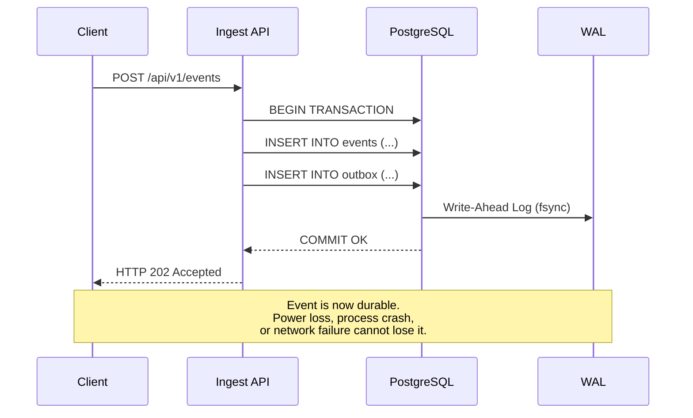
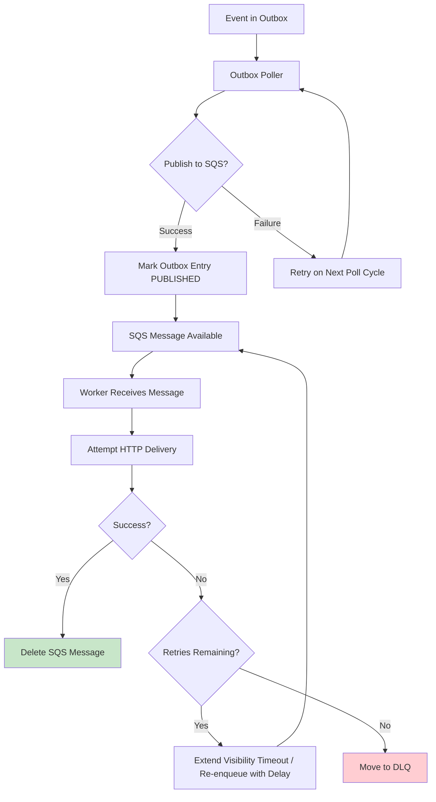
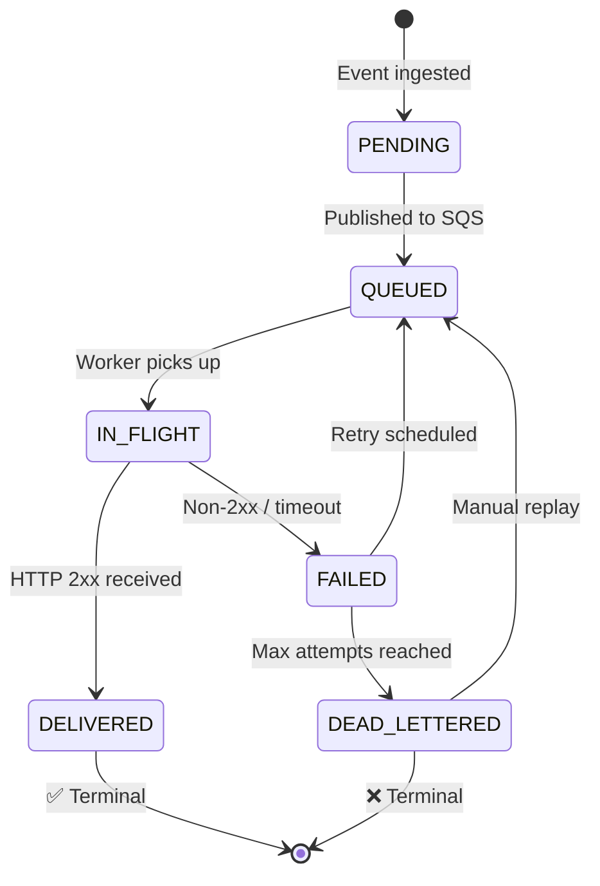
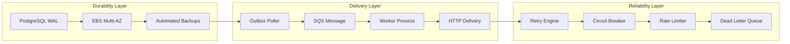

# Delivery Guarantees

> **Document Status**: Production Reference  
> **Last Updated**: 2026-07-10  
> **Audience**: Backend Engineers, API Consumers, SREs  
> **Related Documents**: [Exactly_Once_vs_At_Least_Once.md](./Exactly_Once_vs_At_Least_Once.md), [Retry_Strategies.md](./Retry_Strategies.md), [Failure_Scenarios.md](./Failure_Scenarios.md)

---

## 1. Overview

EventRelay provides a well-defined set of delivery guarantees that are technically enforced at every layer of the system. This document specifies what is guaranteed, what is best-effort, what is explicitly not guaranteed, and how each guarantee is enforced.

---

## 2. Guarantee Summary

| Category | Guarantee | Level | Enforcement |
|---|---|---|---|
| **Durability** | No message loss after 202 response | Guaranteed | PostgreSQL WAL + transactional outbox |
| **Delivery** | At-least-once delivery attempt | Guaranteed | SQS + bounded retries |
| **Retry** | Exponential backoff on failure | Guaranteed | Retry engine with jitter |
| **Terminal State** | Delivered or dead-lettered | Guaranteed | Max attempt cap (15) + DLQ |
| **Signing** | HMAC-SHA256 on every delivery | Guaranteed | Signature middleware |
| **Ordering** | Event delivery order | Best-effort | SQS Standard (not FIFO) |
| **Timing** | Delivery within specific window | Best-effort | Depends on receiver health |
| **Uniqueness** | Single delivery (no duplicates) | Not guaranteed | At-least-once semantics |
| **Exactly-once** | Each event processed once | Not guaranteed | Impossible across boundaries |

---

## 3. Guaranteed Properties

### 3.1 Durability — No Message Loss After Ingestion

**Guarantee**: Once EventRelay returns HTTP `202 Accepted`, the event is durably persisted and will not be lost under any circumstance short of catastrophic multi-AZ data loss.

**Technical Enforcement**:



**Implementation Details**:

```java
@Service
@Transactional
public class EventIngestionService {

    private final EventRepository eventRepository;
    private final OutboxRepository outboxRepository;

    public EventIngestionResult ingest(EventRequest request) {
        // Both writes happen in a single PostgreSQL transaction.
        // The 202 response is ONLY sent after COMMIT succeeds.
        Event event = Event.builder()
                .eventId(generateEventId())
                .tenantId(request.getTenantId())
                .eventType(request.getEventType())
                .payload(request.getPayload())
                .idempotencyKey(request.getIdempotencyKey())
                .status(EventStatus.PENDING)
                .createdAt(Instant.now())
                .build();

        eventRepository.save(event);

        OutboxEntry outboxEntry = OutboxEntry.builder()
                .eventId(event.getEventId())
                .aggregateType("EVENT")
                .payload(serializeForSqs(event))
                .status(OutboxStatus.PENDING)
                .createdAt(Instant.now())
                .build();

        outboxRepository.save(outboxEntry);

        return EventIngestionResult.accepted(event.getEventId());
    }
}
```

**Failure modes and recovery**:

| Failure | Before COMMIT | After COMMIT |
|---|---|---|
| API process crash | Transaction rolled back; client sees timeout; safe to retry | Event persisted; 202 may not reach client; safe to retry (idempotency key) |
| PostgreSQL crash | Transaction rolled back | WAL recovery on restart; event preserved |
| Network partition | Client sees timeout; safe to retry | Event persisted; outbox poller will publish |

### 3.2 At-Least-Once Delivery

**Guarantee**: Every event that reaches PENDING state will be attempted for delivery at least once, up to the maximum retry count.

**Technical Enforcement**:



**Outbox Poller** — ensures no events are stranded:

```java
@Scheduled(fixedDelay = 1000) // Every 1 second
public void pollOutbox() {
    List<OutboxEntry> pending = outboxRepository
            .findByStatusAndCreatedAtBefore(
                OutboxStatus.PENDING,
                Instant.now().minus(Duration.ofSeconds(5)),
                PageRequest.of(0, 100)
            );

    for (OutboxEntry entry : pending) {
        try {
            sqsClient.sendMessage(SendMessageRequest.builder()
                    .queueUrl(webhookQueueUrl)
                    .messageBody(entry.getPayload())
                    .messageGroupId(entry.getTenantId())
                    .messageDeduplicationId(entry.getEventId())
                    .build());

            outboxRepository.markAsPublished(entry.getId());
        } catch (SqsException e) {
            log.warn("Failed to publish outbox entry {}: {}", entry.getId(), e.getMessage());
            // Entry remains PENDING; will be retried on next poll
        }
    }
}
```

**SQS Visibility Timeout** — ensures in-flight messages are not lost:

| Parameter | Value | Rationale |
|---|---|---|
| Visibility timeout | 60 seconds | Allows 30s webhook timeout + 30s processing overhead |
| Message retention | 14 days | Maximum SQS retention; events won't expire before retry |
| Receive wait time | 20 seconds | Long polling to reduce empty receives |
| Max receive count | 15 | Before automatic DLQ redrive |

### 3.3 Bounded Retry with Backoff

**Guarantee**: Failed deliveries are retried with exponential backoff and jitter, up to a maximum of 15 attempts over approximately 26 hours.

**Retry Schedule**:

| Attempt | Base Delay | With Jitter (range) | Cumulative Time |
|---|---|---|---|
| 1 | Immediate | 0s | 0s |
| 2 | 1s | 0.5s – 1.5s | ~1s |
| 3 | 5s | 2.5s – 7.5s | ~6s |
| 4 | 30s | 15s – 45s | ~36s |
| 5 | 2m | 1m – 3m | ~2.5m |
| 6 | 5m | 2.5m – 7.5m | ~7.5m |
| 7 | 15m | 7.5m – 22.5m | ~22m |
| 8 | 30m | 15m – 45m | ~52m |
| 9 | 1h | 30m – 1.5h | ~1h 52m |
| 10 | 2h | 1h – 3h | ~3h 52m |
| 11 | 4h | 2h – 6h | ~7h 52m |
| 12 | 4h | 2h – 6h | ~11h 52m |
| 13 | 4h | 2h – 6h | ~15h 52m |
| 14 | 4h | 2h – 6h | ~19h 52m |
| 15 | 4h | 2h – 6h | ~23h 52m |

**Total retry window**: Approximately 24-28 hours before dead-lettering.

### 3.4 Terminal State Guarantee

**Guarantee**: Every event eventually reaches one of two terminal states: `DELIVERED` or `DEAD_LETTERED`. No event remains in a perpetual retry loop.



**Non-retryable status codes** — immediately terminal (no retry):

| Status Code | Meaning | Action |
|---|---|---|
| 400 | Bad Request | Mark FAILED, no retry |
| 401 | Unauthorized | Mark FAILED, no retry |
| 403 | Forbidden | Mark FAILED, no retry |
| 404 | Not Found | Mark FAILED, no retry |
| 405 | Method Not Allowed | Mark FAILED, no retry |
| 410 | Gone | Mark FAILED, disable subscription |
| 413 | Payload Too Large | Mark FAILED, no retry |
| 422 | Unprocessable Entity | Mark FAILED, no retry |

**Retryable status codes**:

| Status Code | Meaning | Action |
|---|---|---|
| 408 | Request Timeout | Retry with backoff |
| 429 | Too Many Requests | Retry after `Retry-After` header, if present |
| 500 | Internal Server Error | Retry with backoff |
| 502 | Bad Gateway | Retry with backoff |
| 503 | Service Unavailable | Retry with backoff |
| 504 | Gateway Timeout | Retry with backoff |

### 3.5 Cryptographic Signing

**Guarantee**: Every webhook delivery includes an HMAC-SHA256 signature, allowing consumers to verify authenticity and integrity.

```java
public class WebhookSigner {

    private static final String HMAC_ALGORITHM = "HmacSHA256";

    public String sign(String payload, String timestamp, String secret) {
        String signedContent = String.format("%s.%s", timestamp, payload);

        try {
            Mac mac = Mac.getInstance(HMAC_ALGORITHM);
            SecretKeySpec keySpec = new SecretKeySpec(
                    secret.getBytes(StandardCharsets.UTF_8), HMAC_ALGORITHM);
            mac.init(keySpec);

            byte[] hash = mac.doFinal(
                    signedContent.getBytes(StandardCharsets.UTF_8));

            return "v1=" + Base64.getEncoder().encodeToString(hash);
        } catch (NoSuchAlgorithmException | InvalidKeyException e) {
            throw new SigningException("Failed to compute HMAC signature", e);
        }
    }
}
```

**Headers included with every delivery**:

| Header | Example Value | Description |
|---|---|---|
| `X-EventRelay-Event-Id` | `evt_01H5KXJQ7V...` | Unique event identifier |
| `X-EventRelay-Timestamp` | `1720584000` | Unix timestamp of this attempt |
| `X-EventRelay-Signature` | `v1=base64hash...` | HMAC-SHA256 signature |
| `X-EventRelay-Attempt` | `3` | Current attempt number (1-based) |
| `Content-Type` | `application/json` | Always JSON |
| `User-Agent` | `EventRelay/1.0` | Identifies the sender |

---

## 4. Best-Effort Properties

### 4.1 Ordering — Best Effort

EventRelay uses SQS Standard queues, which provide best-effort ordering but do not guarantee FIFO:

```
Event A (created at T1) ─── may arrive ───→ before or after Event B
Event B (created at T2) ─── may arrive ───→ before or after Event A
```

**Why not FIFO?**

| Factor | SQS Standard | SQS FIFO |
|---|---|---|
| Throughput | Unlimited | 3,000 msg/s per group (with batching) |
| Ordering | Best-effort | Guaranteed within message group |
| Deduplication | Content-based (optional) | 5-minute window |
| Cost | Lower | Higher |
| **EventRelay choice** | **✅ Selected** | Not selected |

**Rationale**: Webhook delivery order is inherently unreliable because:
1. Retries can reorder events (Event A fails, Event B succeeds, Event A retried later)
2. Parallel workers process events concurrently
3. Network latency varies between attempts
4. Consumer processing time varies

**Consumer recommendation**: Include a `timestamp` or `sequence_number` in event payloads. Consumers should use this for ordering-sensitive operations:

```json
{
  "event_id": "evt_abc",
  "event_type": "order.status_changed",
  "timestamp": "2026-07-10T04:00:00Z",
  "sequence": 42,
  "data": {
    "order_id": "ord_123",
    "status": "shipped"
  }
}
```

### 4.2 Delivery Timing — Best Effort

EventRelay targets delivery within seconds for healthy endpoints, but timing depends on:

| Factor | Impact on Timing |
|---|---|
| Receiver health | Unhealthy endpoints trigger backoff delays |
| Queue depth | High volume may add queuing delay |
| Rate limiting | Per-tenant rate limits may throttle delivery |
| Circuit breaker state | OPEN circuit blocks delivery for timeout period |

**Typical delivery latencies (healthy endpoint)**:

| Percentile | Latency |
|---|---|
| p50 | < 500ms |
| p90 | < 2s |
| p99 | < 5s |
| p99.9 | < 15s |

---

## 5. SLA Definitions

### 5.1 Event Ingestion SLA

| Metric | Target | Measurement |
|---|---|---|
| Availability | 99.95% | Monthly uptime of Ingest API |
| Latency (p99) | < 200ms | Time from request receipt to 202 response |
| Error rate | < 0.1% | Non-client-error (5xx) response rate |
| Durability | 99.999999999% (11 nines) | Backed by PostgreSQL + EBS multi-AZ |

### 5.2 Event Delivery SLA

| Metric | Target | Measurement |
|---|---|---|
| First attempt latency | < 5s (p99) | Time from ingestion to first delivery attempt |
| Delivery success rate | > 99.5% | Events delivered within retry window (excludes permanently failed endpoints) |
| Dead-letter rate | < 0.5% | Events exhausting all retry attempts |
| Retry window | 24-28 hours | Maximum time before dead-lettering |

### 5.3 API Availability SLA

| Tier | Target | Includes |
|---|---|---|
| Standard | 99.9% (8.76h downtime/year) | Ingest API, Delivery, Management API |
| Premium | 99.95% (4.38h downtime/year) | All Standard + priority support |
| Enterprise | 99.99% (52.6m downtime/year) | All Premium + dedicated infrastructure |

---

## 6. How Guarantees Are Enforced Technically

### 6.1 End-to-End Guarantee Chain



### 6.2 Guarantee Enforcement Matrix

| Guarantee | Primary Mechanism | Backup Mechanism | Monitoring |
|---|---|---|---|
| Durability | PostgreSQL transactions | WAL + multi-AZ EBS | `eventrelay.events.persisted` counter |
| At-least-once | SQS visibility timeout | Outbox re-polling | `eventrelay.delivery.attempts` histogram |
| Bounded retries | Attempt counter in event metadata | SQS max receive count → DLQ | `eventrelay.retry.count` histogram |
| Terminal state | Max attempt check | SQS DLQ redrive policy | `eventrelay.events.dead_lettered` counter |
| Signing | Signing middleware | Pre-send validation | `eventrelay.signature.failures` counter |

---

## 7. Consumer Integration Guide

### 7.1 Expected Consumer Behavior

For EventRelay's guarantees to hold, consumers must:

```java
@RestController
@RequestMapping("/webhooks")
public class WebhookController {

    @PostMapping("/events")
    public ResponseEntity<Void> handleEvent(
            @RequestBody String body,
            @RequestHeader("X-EventRelay-Signature") String signature,
            @RequestHeader("X-EventRelay-Timestamp") String timestamp,
            @RequestHeader("X-EventRelay-Event-Id") String eventId) {

        // 1. Respond within 30 seconds (timeout threshold)
        // 2. Return 2xx to acknowledge receipt
        // 3. Verify signature before processing
        // 4. Handle duplicates via event_id (at-least-once semantics)

        if (!verifySignature(body, timestamp, signature)) {
            return ResponseEntity.status(401).build();
        }

        if (isDuplicate(eventId)) {
            return ResponseEntity.ok().build(); // ACK but don't reprocess
        }

        // Process asynchronously if possible (respond fast)
        asyncProcessor.enqueue(eventId, body);

        return ResponseEntity.ok().build();
    }
}
```

### 7.2 Response Code Contract

| Consumer Response | EventRelay Interpretation | Action |
|---|---|---|
| 200-299 | Successfully delivered | Mark DELIVERED, delete SQS message |
| 301, 302, 307, 308 | Redirect | Follow redirect (max 3 hops) |
| 400-499 (except 408, 429) | Permanent failure | Mark FAILED, no retry |
| 408 | Timeout | Retry with backoff |
| 429 | Rate limited | Respect `Retry-After` header, retry |
| 500-599 | Temporary failure | Retry with backoff |
| Connection refused | Endpoint down | Retry with backoff |
| DNS failure | Endpoint unreachable | Retry with backoff |
| TLS error | Certificate issue | Retry with backoff (up to 3 attempts) |
| Timeout (no response in 30s) | Endpoint too slow | Retry with backoff |

---

## 8. Delivery Guarantee Verification

### 8.1 Continuous Verification

EventRelay runs continuous verification to ensure guarantees hold:

```java
@Scheduled(fixedDelay = 60000) // Every minute
public void verifyDeliveryGuarantees() {
    // Check for events stuck in non-terminal states beyond SLA
    Instant slaThreshold = Instant.now().minus(Duration.ofHours(30));

    List<Event> stuckEvents = eventRepository
            .findByStatusInAndCreatedAtBefore(
                List.of(EventStatus.PENDING, EventStatus.QUEUED, EventStatus.IN_FLIGHT),
                slaThreshold
            );

    if (!stuckEvents.isEmpty()) {
        log.error("GUARANTEE VIOLATION: {} events stuck beyond 30h SLA", stuckEvents.size());
        alertService.sendCritical(
                "Delivery guarantee violation: " + stuckEvents.size() + " events stuck");

        // Auto-remediation: re-enqueue stuck events
        for (Event event : stuckEvents) {
            outboxRepository.reEnqueue(event.getEventId());
        }
    }
}
```

### 8.2 Guarantee Metrics Dashboard

| Metric | Query | Alert Threshold |
|---|---|---|
| Events without terminal state > 30h | `eventrelay_events_stuck_count` | > 0 → Critical |
| Delivery success rate (1h window) | `rate(eventrelay_deliveries_success[1h]) / rate(eventrelay_deliveries_total[1h])` | < 0.95 → Warning |
| Dead-letter rate (24h window) | `rate(eventrelay_events_dead_lettered[24h]) / rate(eventrelay_events_ingested[24h])` | > 0.01 → Warning |
| Outbox lag (pending entries) | `eventrelay_outbox_pending_count` | > 1000 → Warning, > 10000 → Critical |
| SQS approximate message age | `aws_sqs_oldest_message_age` | > 300s → Warning, > 3600s → Critical |

---

## 9. Production Considerations

### 9.1 Guarantee Limitations

> [!WARNING]
> **These scenarios can violate delivery guarantees**:
> - **Multi-AZ PostgreSQL failure**: Extremely rare but would lose events not yet replicated
> - **SQS service outage**: Events buffer in outbox; delivered after SQS recovery
> - **Prolonged worker fleet outage**: Events queue in SQS (up to 14 days)
> - **Clock skew**: Can affect retry timing but not delivery guarantee itself

### 9.2 Guarantee During Deployments

During rolling deployments:
- In-flight deliveries complete on old workers (graceful shutdown with 60s drain)
- SQS visibility timeout prevents message loss during worker restarts
- No additional duplicate risk beyond normal at-least-once semantics

### 9.3 Guarantee Testing

| Test | Frequency | Method |
|---|---|---|
| Kill worker mid-delivery | Weekly | Chaos test: `kill -9` on random worker |
| Simulate SQS unavailability | Monthly | Network policy to block SQS endpoints |
| Simulate PostgreSQL failover | Monthly | RDS failover trigger |
| End-to-end delivery verification | Continuous | Synthetic event monitoring |
| Duplicate rate measurement | Continuous | Prometheus metric tracking |

---

## 10. Summary

EventRelay's delivery guarantees are designed around a single principle: **reliability over perfection**. Rather than attempting the impossible (exactly-once delivery), EventRelay provides strong, verifiable, and technically enforced guarantees:

1. ✅ **Your event will not be lost** after successful ingestion
2. ✅ **Your event will be delivered** or explicitly dead-lettered
3. ✅ **Your event will be signed** for authenticity verification
4. ⚠️ **Your event may be delivered more than once** — implement idempotency
5. ⚠️ **Your events may arrive out of order** — use timestamps for ordering
