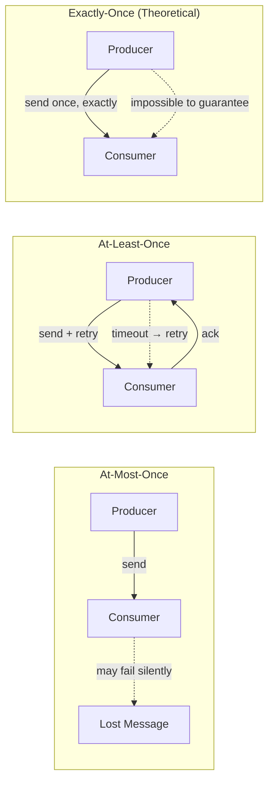
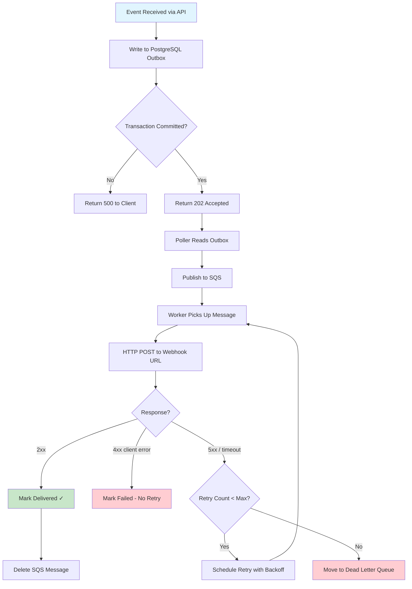
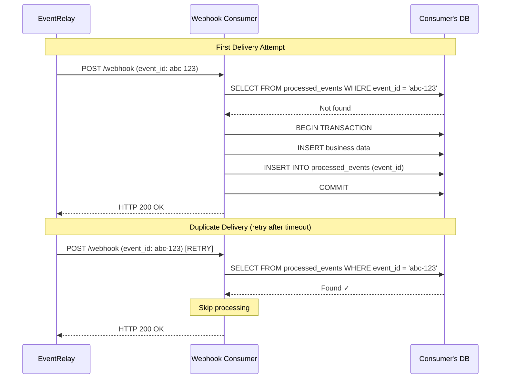
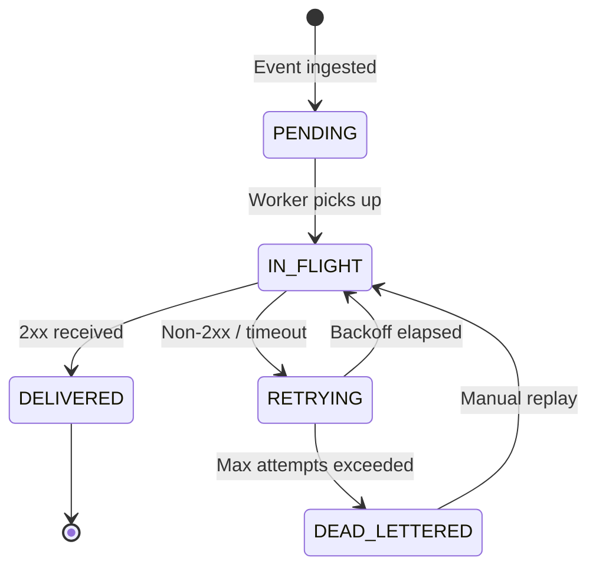

# Exactly-Once vs At-Least-Once Delivery

> **Document Status**: Production Reference  
> **Last Updated**: 2026-07-10  
> **Audience**: Backend Engineers, System Architects, Webhook Consumers  
> **Related Documents**: [Delivery_Guarantees.md](./Delivery_Guarantees.md), [Idempotency_Keys.md](./Idempotency_Keys.md), [Retry_Strategies.md](./Retry_Strategies.md)

---

## 1. Overview

The question of message delivery semantics is the single most important design decision in any webhook delivery platform. EventRelay implements **at-least-once delivery with idempotent consumers** — the only practical approach for reliable webhook delivery over unreliable networks.

This document explores the theoretical foundations, practical trade-offs, and implementation strategies behind this choice.

---

## 2. The Three Delivery Semantics

| Semantic | Definition | Message Loss | Duplicates | Practical? |
|---|---|---|---|---|
| **At-Most-Once** | Fire and forget; never retry | Possible | Never | Yes, but unreliable |
| **At-Least-Once** | Retry until acknowledged; may duplicate | Never (after ingest) | Possible | Yes |
| **Exactly-Once** | Each message delivered precisely once | Never | Never | Impossible in theory; approximated in practice |



---

## 3. Why Exactly-Once Is Impossible

### 3.1 The FLP Impossibility Result

The Fischer-Lynch-Paterson (FLP) impossibility theorem (1985) proves that in an asynchronous distributed system where even a single process can fail by crashing, it is impossible to guarantee consensus. Since exactly-once delivery requires consensus between sender and receiver on the delivery state, it is a direct corollary:

> **FLP Theorem**: No deterministic algorithm can guarantee consensus in an asynchronous system with even one faulty process.

**Reference**: Fischer, M.J., Lynch, N.A., Paterson, M.S. (1985). "Impossibility of distributed consensus with one faulty process." *Journal of the ACM*, 32(2), 374–382.

### 3.2 The Two Generals Problem

The Two Generals Problem (1975) illustrates the impossibility from a networking perspective:

```
General A                    General B
   |                            |
   |--- "Attack at dawn" ---→   |   (might be lost)
   |                            |
   |   ←--- "Acknowledged" ---  |   (might be lost)
   |                            |
   |--- "Ack of your Ack" --→   |   (might be lost)
   |          ...               |   (infinite regress)
```

No finite number of messages can guarantee both parties agree. Applied to webhooks:

- **EventRelay sends webhook** → target processes it → target sends HTTP 200
- But what if the 200 response is lost? EventRelay retries → target processes the event **again**
- There is no protocol that can eliminate this window of ambiguity

### 3.3 The Practical Impossibility Window

Even in systems claiming "exactly-once" (e.g., Kafka's transactional producers), what they actually provide is:

| System | Claim | Reality |
|---|---|---|
| Apache Kafka | Exactly-once semantics | Idempotent producers + transactional consumers within Kafka's boundary |
| AWS SQS FIFO | Exactly-once processing | Deduplication within a 5-minute window |
| Google Pub/Sub | Exactly-once delivery | Deduplication within the Pub/Sub system boundary |
| **Webhooks (any provider)** | **Cannot claim exactly-once** | **HTTP has no transactional boundary across systems** |

The fundamental issue: **webhooks cross system boundaries**. Unlike Kafka consumers (which are within the same system boundary as the broker), webhook receivers are entirely independent systems. There is no shared transaction coordinator.

---

## 4. The Impossibility Window in Webhook Delivery

```mermaid
sequenceDiagram
    participant ER as EventRelay
    participant Net as Network
    participant WH as Webhook Receiver

    ER->>Net: POST /webhook (event_id: abc-123)
    Net->>WH: POST /webhook (event_id: abc-123)
    
    Note over WH: Processes event successfully
    
    WH->>Net: HTTP 200 OK
    
    alt Response Lost (Network Failure)
        Net--xER: ❌ Response lost / timeout
        Note over ER: Assumes failure → schedules retry
        ER->>Net: POST /webhook (event_id: abc-123) [RETRY]
        Net->>WH: POST /webhook (event_id: abc-123) [DUPLICATE]
        Note over WH: ⚠️ Event received TWICE
    end
    
    alt Response Received
        Net->>ER: HTTP 200 OK
        Note over ER: Marks event as delivered ✓
    end
```



### 4.1 The Ambiguity Zone

The **ambiguity zone** exists between two events:
1. The webhook receiver finishes processing
2. EventRelay receives and processes the acknowledgment

During this window, the delivery state is **unknown** to EventRelay. The possible states are:

| Actual State | EventRelay Thinks | Action Taken | Result |
|---|---|---|---|
| Delivered + Ack received | Delivered | None | ✅ Correct |
| Delivered + Ack lost | Failed | Retry | ⚠️ Duplicate |
| Not delivered (timeout) | Failed | Retry | ✅ Correct retry |
| Partially delivered (crash) | Failed | Retry | ⚠️ Possible partial + full |

---

## 5. At-Least-Once: The Practical Answer

### 5.1 Why At-Least-Once Is the Right Choice

At-least-once delivery provides the strongest guarantee that is practically achievable for webhooks:

1. **No message loss**: Once an event is ingested and persisted, it will be delivered
2. **Bounded retries**: Finite attempts before dead-lettering
3. **Duplicate tolerance**: Consumers can handle duplicates via idempotency

### 5.2 EventRelay's At-Least-Once Implementation



### 5.3 Guarantees at Each Stage

| Stage | Guarantee | Mechanism |
|---|---|---|
| API Ingestion | Durable after 202 response | PostgreSQL WAL + fsync |
| Outbox → SQS | At-least-once | Poller retries on failure; SQS deduplication window |
| SQS → Worker | At-least-once | SQS visibility timeout; message not deleted until processed |
| Worker → Webhook | At-least-once | Retry on non-2xx; exponential backoff |
| Final state | Delivered or Dead-lettered | Bounded retry count (max 15 attempts) |

---

## 6. Achieving "Effectively-Once" Delivery

While true exactly-once is impossible, **effectively-once** delivery is achievable through the combination of at-least-once delivery and idempotent processing:

```
Effectively Once = At-Least-Once Delivery + Idempotent Consumer
```

### 6.1 EventRelay's Role (Producer Side)

EventRelay provides everything the consumer needs to implement idempotency:

```json
{
  "event_id": "evt_01H5KXJQ7V8RZMN3KQWX9P4Y6T",
  "idempotency_key": "idk_01H5KXJQ7V8RZMN3KQWX9P4Y6T",
  "event_type": "payment.completed",
  "attempt_number": 2,
  "first_attempted_at": "2026-07-10T04:00:00Z",
  "timestamp": "2026-07-10T04:05:30Z",
  "data": {
    "payment_id": "pay_abc123",
    "amount": 9900,
    "currency": "usd"
  }
}
```

**Key fields for deduplication**:
- `event_id` — globally unique, stable across retries
- `idempotency_key` — client-specified or auto-generated
- `attempt_number` — allows consumers to detect retries

### 6.2 Consumer's Role (Receiver Side)

The consumer must implement idempotent processing:

```java
// Consumer-side idempotent webhook handler (example)
@PostMapping("/webhooks/eventrelay")
public ResponseEntity<Void> handleWebhook(
        @RequestBody WebhookPayload payload,
        @RequestHeader("X-EventRelay-Event-Id") String eventId,
        @RequestHeader("X-EventRelay-Signature") String signature) {

    // 1. Verify HMAC signature
    if (!signatureVerifier.verify(payload, signature)) {
        return ResponseEntity.status(401).build();
    }

    // 2. Check if already processed (idempotency check)
    if (processedEventRepository.existsByEventId(eventId)) {
        log.info("Duplicate event detected, skipping: {}", eventId);
        return ResponseEntity.ok().build(); // Return 200, don't reprocess
    }

    // 3. Process the event within a transaction
    try {
        transactionTemplate.execute(status -> {
            // Process business logic
            processEvent(payload);
            // Record event as processed (same transaction)
            processedEventRepository.save(new ProcessedEvent(eventId, Instant.now()));
            return null;
        });
    } catch (DuplicateKeyException e) {
        // Race condition: concurrent request already processed this event
        log.info("Concurrent duplicate detected: {}", eventId);
        return ResponseEntity.ok().build();
    }

    return ResponseEntity.ok().build();
}
```

### 6.3 The Idempotency Pattern



---

## 7. How Industry Leaders Handle This

### 7.1 Stripe's Approach

Stripe is explicit in their documentation:

> "Webhook endpoints might occasionally receive the same event more than once. We advise you to guard against duplicated event receipts by making your event processing idempotent."
> — [Stripe Webhooks Documentation](https://stripe.com/docs/webhooks/best-practices)

**Stripe's implementation**:
- Every event has a unique `id` field (e.g., `evt_1234567890`)
- The same `id` is sent on every retry attempt
- Stripe recommends consumers store processed event IDs
- Stripe retries up to 3 days with exponential backoff

### 7.2 GitHub's Approach

GitHub webhooks include:
- `X-GitHub-Delivery` header — unique GUID per delivery
- Same payload on retries (same delivery ID)
- Consumers recommended to track delivery IDs

### 7.3 Svix's Approach

Svix (open-source webhook service) provides:
- `svix-id` header — unique per message
- `svix-timestamp` — for replay protection
- `svix-signature` — HMAC signature
- Explicit documentation that consumers must handle duplicates

### 7.4 AWS EventBridge

AWS EventBridge provides at-least-once delivery and recommends:
- Using the event `id` field for deduplication
- Making event handlers idempotent
- No guarantee of ordering

---

## 8. Comparison Table: Delivery Semantics

| Property | At-Most-Once | At-Least-Once | "Exactly-Once" |
|---|---|---|---|
| **Implementation complexity** | Low | Medium | Very High (often impossible) |
| **Message loss risk** | High | None (after ingestion) | None |
| **Duplicate risk** | None | Yes (bounded) | None (in theory) |
| **Consumer complexity** | Low | Medium (needs idempotency) | Low |
| **System boundary** | Any | Any | Same system only |
| **Latency** | Lowest | Low-Medium | Higher (coordination overhead) |
| **Throughput** | Highest | High | Lower (coordination overhead) |
| **Suitable for webhooks** | ❌ Unreliable | ✅ Standard approach | ❌ Not achievable |
| **Used by Stripe/GitHub** | No | **Yes** | No |

---

## 9. EventRelay's Delivery Contract

### 9.1 What EventRelay Guarantees

```
┌─────────────────────────────────────────────────────────────┐
│                   EventRelay Delivery Contract               │
├─────────────────────────────────────────────────────────────┤
│                                                              │
│  ✅ GUARANTEED:                                              │
│     • No message loss after HTTP 202 response                │
│     • Every event will be attempted at least once            │
│     • Retries with exponential backoff on failure            │
│     • Dead-lettering after max retry exhaustion              │
│     • Unique event_id stable across all retry attempts       │
│     • HMAC signature on every delivery attempt               │
│                                                              │
│  ⚠️ BEST EFFORT:                                             │
│     • Ordering (not guaranteed across events)                │
│     • Single delivery (duplicates possible)                  │
│     • Delivery timing (depends on backoff schedule)          │
│                                                              │
│  ❌ NOT GUARANTEED:                                           │
│     • Exactly-once delivery                                  │
│     • FIFO ordering                                          │
│     • Delivery within a specific time window                 │
│                                                              │
│  📋 CONSUMER RESPONSIBILITY:                                 │
│     • Implement idempotent webhook handlers                  │
│     • Return 2xx within 30 seconds                           │
│     • Verify HMAC signatures                                 │
│     • Store processed event_ids for deduplication            │
│                                                              │
└─────────────────────────────────────────────────────────────┘
```

### 9.2 Delivery State Machine



---

## 10. Why This Matters for Webhook Consumers

### 10.1 Consequences of Not Handling Duplicates

| Scenario | Non-Idempotent Handler | Idempotent Handler |
|---|---|---|
| Payment webhook delivered twice | Customer charged twice 💸 | Second delivery ignored ✅ |
| Order creation webhook duplicated | Two orders created 📦📦 | Duplicate detected, single order ✅ |
| Email notification duplicated | User receives two emails 📧📧 | Dedup check, single email ✅ |
| Inventory decrement duplicated | Stock count off by one | Idempotent decrement ✅ |

### 10.2 Designing Idempotent Operations

Operations fall into two categories:

**Naturally idempotent** (safe to repeat):
- `SET status = 'completed' WHERE order_id = ?` — same result regardless of repetitions
- `PUT /resources/{id}` — full replacement is idempotent
- Upserts — `INSERT ... ON CONFLICT UPDATE`

**Not naturally idempotent** (require deduplication):
- `INSERT INTO orders (...)` — creates duplicate rows
- `UPDATE balance = balance + 100` — increments multiple times
- `POST /emails/send` — sends multiple emails
- Counter increments — `INCREMENT visits_count`

For non-idempotent operations, use the event_id as a deduplication key:

```sql
-- Consumer-side deduplication table
CREATE TABLE processed_webhook_events (
    event_id     VARCHAR(64) PRIMARY KEY,
    processed_at TIMESTAMPTZ NOT NULL DEFAULT NOW(),
    handler      VARCHAR(128) NOT NULL
);

-- Create index for cleanup of old entries
CREATE INDEX idx_processed_events_timestamp
    ON processed_webhook_events (processed_at);

-- Cleanup events older than 7 days (cron job)
DELETE FROM processed_webhook_events
WHERE processed_at < NOW() - INTERVAL '7 days';
```

---

## 11. Academic and Industry References

| Reference | Key Insight |
|---|---|
| Fischer, Lynch, Paterson (1985) | Consensus impossible in async systems with failures |
| Gray (1978) — Two Generals Problem | Agreement impossible with unreliable communication |
| Lamport (1998) — Paxos | Consensus achievable with majority, but not with webhooks |
| Kleppmann (2017) — *Designing Data-Intensive Applications* | At-least-once + idempotency = effectively-once |
| Helland (2012) — "Idempotence Is Not a Medical Condition" | Practical idempotency patterns |
| Stripe Engineering Blog | Real-world at-least-once webhook delivery |
| AWS Architecture Blog — "Exponential Backoff and Jitter" | Retry strategies for distributed systems |

---

## 12. Production Considerations

### 12.1 Monitoring Duplicate Rates

Track duplicate delivery rates to understand system behavior:

```java
@Component
public class DeliveryMetrics {

    private final MeterRegistry registry;

    // Counter for total delivery attempts
    private final Counter totalDeliveries;
    // Counter for duplicate deliveries (consumer reported via API)
    private final Counter duplicateDeliveries;

    public DeliveryMetrics(MeterRegistry registry) {
        this.registry = registry;
        this.totalDeliveries = Counter.builder("eventrelay.deliveries.total")
                .description("Total webhook delivery attempts")
                .register(registry);
        this.duplicateDeliveries = Counter.builder("eventrelay.deliveries.duplicates")
                .description("Duplicate deliveries reported by consumers")
                .register(registry);
    }

    public void recordDelivery(boolean isDuplicate) {
        totalDeliveries.increment();
        if (isDuplicate) {
            duplicateDeliveries.increment();
        }
    }
}
```

### 12.2 Alerting Thresholds

| Metric | Warning | Critical |
|---|---|---|
| Duplicate rate | > 5% of deliveries | > 15% of deliveries |
| Retry rate | > 20% of attempts | > 50% of attempts |
| Dead-letter rate | > 1% of events | > 5% of events |
| Average attempts per event | > 2.0 | > 4.0 |

### 12.3 Consumer Documentation

EventRelay provides clear consumer documentation:

```markdown
## Handling Duplicate Deliveries

EventRelay guarantees at-least-once delivery. Your webhook handler
MUST be idempotent. Every webhook delivery includes:

- `X-EventRelay-Event-Id`: Unique event identifier (stable across retries)
- `X-EventRelay-Attempt`: Current attempt number (1-based)
- `X-EventRelay-Signature`: HMAC-SHA256 signature for verification

Recommended approach:
1. Verify the signature
2. Check if `event_id` has been processed before
3. If not processed, execute business logic and record the event_id
4. Return HTTP 200 regardless of whether it was a duplicate
```

---

## 13. Summary

| Aspect | EventRelay's Position |
|---|---|
| **Delivery semantic** | At-least-once |
| **Duplicate handling** | Consumer responsibility with EventRelay support |
| **Deduplication support** | Stable `event_id` across retries, `attempt_number` header |
| **Effectively-once** | Achievable with idempotent consumers |
| **Why not exactly-once** | Theoretically impossible across system boundaries |
| **Industry alignment** | Same approach as Stripe, GitHub, Svix, AWS |

> [!IMPORTANT]
> **The bottom line**: Exactly-once delivery is a myth in distributed systems that cross trust boundaries. At-least-once delivery with idempotent consumers is not a compromise — it is the correct engineering solution. EventRelay embraces this reality and provides all the tools consumers need to achieve effectively-once processing.
