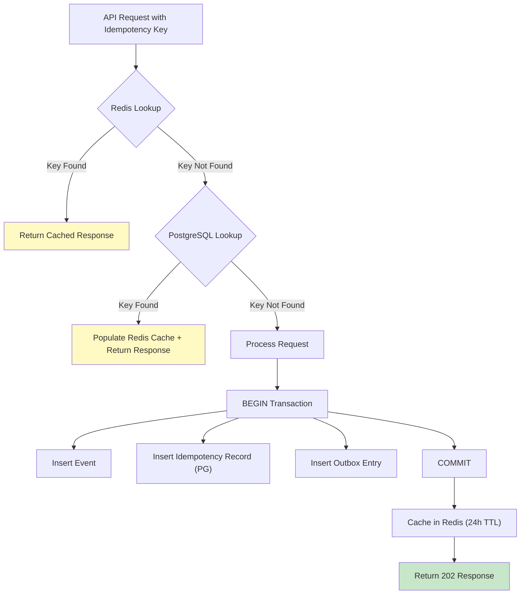
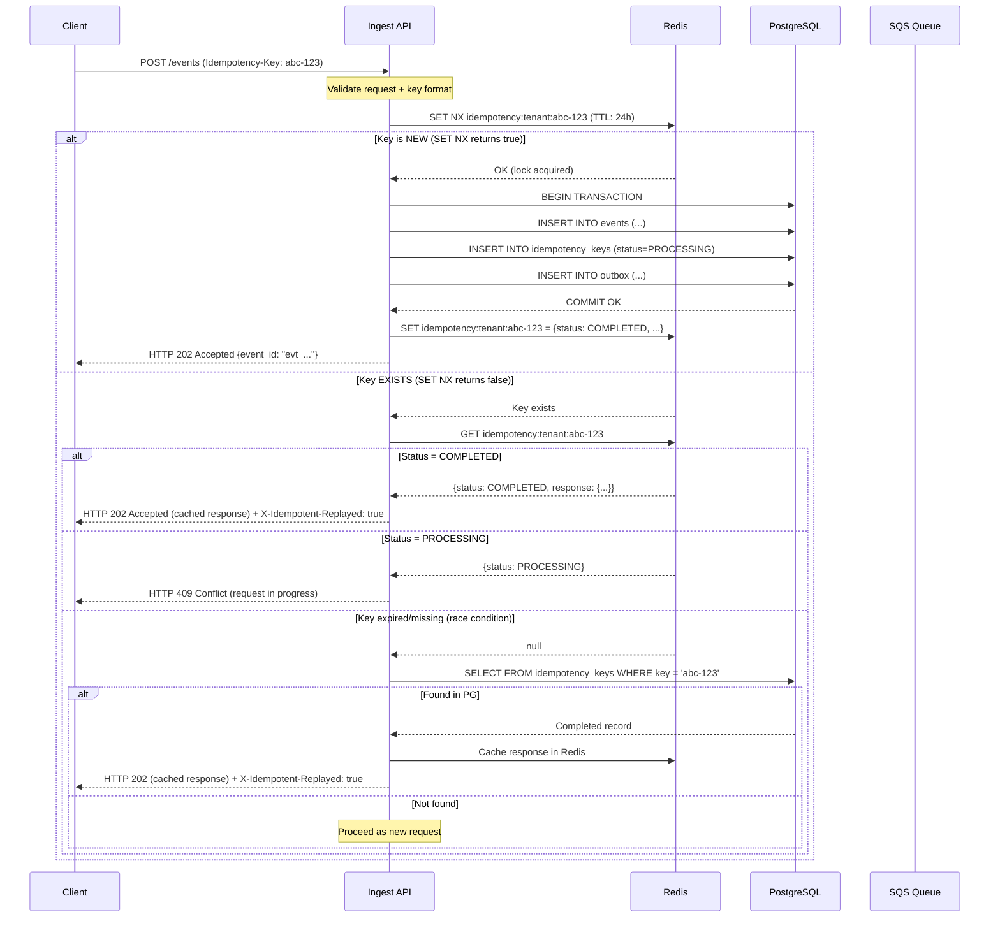
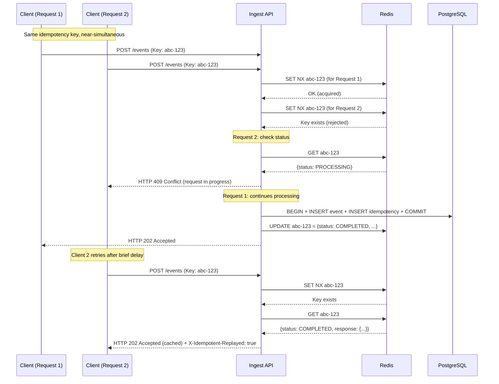
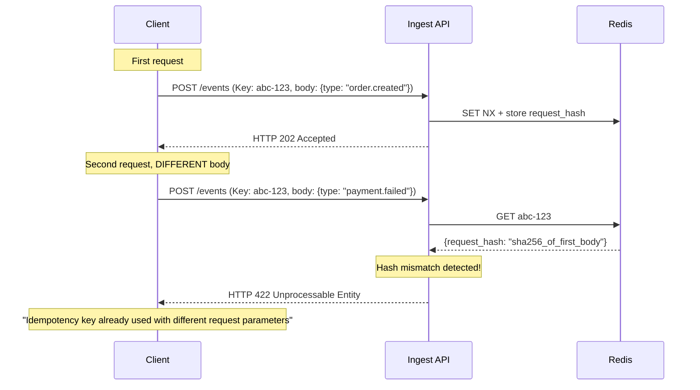

# Idempotency Keys

> **Document Status**: Production Reference  
> **Last Updated**: 2026-07-10  
> **Audience**: Backend Engineers, API Consumers  
> **Related Documents**: [Exactly_Once_vs_At_Least_Once.md](./Exactly_Once_vs_At_Least_Once.md), [Delivery_Guarantees.md](./Delivery_Guarantees.md), [Consistency.md](./Consistency.md)

---

## 1. Overview

Idempotency keys are the mechanism by which EventRelay ensures that duplicate event submissions produce the same result as a single submission. Combined with at-least-once delivery, idempotency keys enable **effectively-once** event processing across the entire pipeline.

This document covers key format, storage architecture, validation logic, duplicate detection flow, and response caching.

---

## 2. Design Principles

| Principle | Description |
|---|---|
| **Uniqueness** | Each key uniquely identifies a single logical event submission |
| **Stability** | The same key always returns the same response |
| **Bounded lifetime** | Keys expire after 24 hours to prevent unbounded storage growth |
| **Client control** | Clients can specify their own keys or use auto-generated ones |
| **Atomicity** | Key registration and event persistence happen in a single transaction |

---

## 3. Key Format

### 3.1 Auto-Generated Keys

When clients don't provide an idempotency key, EventRelay generates one using UUIDv7 (time-ordered):

```java
public class IdempotencyKeyGenerator {

    private static final String PREFIX = "idk_";

    /**
     * Generates a time-ordered idempotency key using UUIDv7.
     * Format: idk_01H5KXJQ7V8RZMN3KQWX9P4Y6T
     *
     * UUIDv7 provides:
     * - Time-ordered sorting (useful for debugging)
     * - Globally unique without coordination
     * - 48-bit millisecond timestamp + 74-bit random
     */
    public String generate() {
        return PREFIX + generateUuidV7Base32();
    }

    private String generateUuidV7Base32() {
        long timestamp = Instant.now().toEpochMilli();
        byte[] random = new byte[10]; // 80 bits of randomness
        SecureRandom.getInstanceStrong().nextBytes(random);

        // Combine timestamp (48 bits) + version (4 bits) + random (74 bits)
        ByteBuffer buffer = ByteBuffer.allocate(16);
        buffer.putShort((short) (timestamp >> 32));
        buffer.putInt((int) timestamp);
        buffer.put((byte) (0x70 | (random[0] & 0x0F))); // Version 7
        buffer.put(random, 1, 9);

        return Base32.encode(buffer.array());
    }
}
```

### 3.2 Client-Specified Keys

Clients may provide their own idempotency keys via the `Idempotency-Key` header:

```http
POST /api/v1/events HTTP/1.1
Host: api.eventrelay.io
Content-Type: application/json
Idempotency-Key: payment-completed-ord_12345-2026-07-10
Authorization: Bearer tenant_sk_...

{
  "event_type": "payment.completed",
  "data": {
    "order_id": "ord_12345",
    "amount": 9900
  }
}
```

### 3.3 Key Validation Rules

| Rule | Specification | Error Code |
|---|---|---|
| Minimum length | 8 characters | `IDEMPOTENCY_KEY_TOO_SHORT` |
| Maximum length | 256 characters | `IDEMPOTENCY_KEY_TOO_LONG` |
| Allowed characters | `[a-zA-Z0-9_\-\.]` | `IDEMPOTENCY_KEY_INVALID_CHARS` |
| Uniqueness scope | Per tenant | — |
| Lifetime | 24 hours from first use | — |

```java
public class IdempotencyKeyValidator {

    private static final int MIN_LENGTH = 8;
    private static final int MAX_LENGTH = 256;
    private static final Pattern VALID_PATTERN =
            Pattern.compile("^[a-zA-Z0-9_\\-.]+$");

    public ValidationResult validate(String key) {
        if (key == null || key.isEmpty()) {
            return ValidationResult.valid(); // Auto-generate
        }
        if (key.length() < MIN_LENGTH) {
            return ValidationResult.invalid("IDEMPOTENCY_KEY_TOO_SHORT",
                    "Idempotency key must be at least " + MIN_LENGTH + " characters");
        }
        if (key.length() > MAX_LENGTH) {
            return ValidationResult.invalid("IDEMPOTENCY_KEY_TOO_LONG",
                    "Idempotency key must not exceed " + MAX_LENGTH + " characters");
        }
        if (!VALID_PATTERN.matcher(key).matches()) {
            return ValidationResult.invalid("IDEMPOTENCY_KEY_INVALID_CHARS",
                    "Idempotency key may only contain alphanumeric characters, hyphens, underscores, and dots");
        }
        return ValidationResult.valid();
    }
}
```

---

## 4. Storage Architecture

Idempotency keys are stored in a two-tier architecture: **Redis** for fast lookups and **PostgreSQL** for durability and audit.

### 4.1 Architecture Diagram



### 4.2 Redis Storage

Redis serves as the primary lookup cache for idempotency checks, providing sub-millisecond response times:

```java
@Component
public class RedisIdempotencyStore {

    private static final Duration TTL = Duration.ofHours(24);
    private static final String KEY_PREFIX = "idempotency:";

    private final StringRedisTemplate redisTemplate;
    private final ObjectMapper objectMapper;

    /**
     * Attempts to acquire an idempotency lock for the given key.
     * Returns null if the key is new (caller should proceed with processing).
     * Returns the cached response if the key already exists.
     */
    public IdempotencyResult checkAndLock(String tenantId, String idempotencyKey) {
        String redisKey = buildKey(tenantId, idempotencyKey);

        // Use SET NX (set if not exists) with TTL for atomic check-and-lock
        Boolean acquired = redisTemplate.opsForValue()
                .setIfAbsent(redisKey, buildLockValue(), TTL);

        if (Boolean.TRUE.equals(acquired)) {
            // Key is new — caller should proceed with processing
            return IdempotencyResult.proceed();
        }

        // Key exists — retrieve cached response
        String cached = redisTemplate.opsForValue().get(redisKey);
        if (cached == null) {
            // Race condition: key expired between check and get
            return IdempotencyResult.proceed();
        }

        IdempotencyCachedResponse cachedResponse = deserialize(cached);
        if (cachedResponse.isLock()) {
            // Another request is currently processing this key
            return IdempotencyResult.inProgress();
        }

        return IdempotencyResult.duplicate(cachedResponse);
    }

    /**
     * Stores the final response for an idempotency key after successful processing.
     */
    public void cacheResponse(String tenantId, String idempotencyKey,
                               IdempotencyCachedResponse response) {
        String redisKey = buildKey(tenantId, idempotencyKey);
        redisTemplate.opsForValue().set(redisKey, serialize(response), TTL);
    }

    /**
     * Releases the lock if processing failed (allows retry with same key).
     */
    public void releaseLock(String tenantId, String idempotencyKey) {
        String redisKey = buildKey(tenantId, idempotencyKey);
        redisTemplate.delete(redisKey);
    }

    private String buildKey(String tenantId, String idempotencyKey) {
        return KEY_PREFIX + tenantId + ":" + idempotencyKey;
    }

    private String buildLockValue() {
        return "{\"status\":\"PROCESSING\",\"locked_at\":\"" + Instant.now() + "\"}";
    }
}
```

**Redis data structure**:

```
Key:   idempotency:{tenant_id}:{idempotency_key}
Value: {
         "status": "COMPLETED",          // PROCESSING | COMPLETED | FAILED
         "event_id": "evt_01H5KX...",
         "http_status": 202,
         "response_body": "{...}",
         "created_at": "2026-07-10T04:00:00Z"
       }
TTL:   86400 seconds (24 hours)
```

### 4.3 PostgreSQL Storage

PostgreSQL provides durable storage and audit trail:

```sql
CREATE TABLE idempotency_keys (
    id              BIGSERIAL PRIMARY KEY,
    tenant_id       VARCHAR(64)  NOT NULL,
    idempotency_key VARCHAR(256) NOT NULL,
    event_id        VARCHAR(64),
    request_hash    VARCHAR(64)  NOT NULL,  -- SHA-256 of request body
    http_status     SMALLINT     NOT NULL,
    response_body   JSONB,
    status          VARCHAR(20)  NOT NULL DEFAULT 'PROCESSING',
    created_at      TIMESTAMPTZ  NOT NULL DEFAULT NOW(),
    completed_at    TIMESTAMPTZ,
    expires_at      TIMESTAMPTZ  NOT NULL DEFAULT NOW() + INTERVAL '24 hours',

    CONSTRAINT uq_tenant_idempotency_key
        UNIQUE (tenant_id, idempotency_key)
);

-- Index for expiry cleanup
CREATE INDEX idx_idempotency_keys_expires
    ON idempotency_keys (expires_at)
    WHERE status != 'PROCESSING';

-- Index for tenant lookups
CREATE INDEX idx_idempotency_keys_tenant
    ON idempotency_keys (tenant_id, created_at DESC);

-- Cleanup expired keys (run daily via pg_cron)
-- Keeps 48h of history beyond TTL for audit purposes
CREATE OR REPLACE FUNCTION cleanup_expired_idempotency_keys()
RETURNS INTEGER AS $$
DECLARE
    deleted_count INTEGER;
BEGIN
    DELETE FROM idempotency_keys
    WHERE expires_at < NOW() - INTERVAL '48 hours'
    AND status != 'PROCESSING';

    GET DIAGNOSTICS deleted_count = ROW_COUNT;
    RETURN deleted_count;
END;
$$ LANGUAGE plpgsql;
```

### 4.4 Two-Tier Consistency

| Scenario | Redis State | PostgreSQL State | Resolution |
|---|---|---|---|
| Normal operation | Cached response | Durable record | Redis serves reads |
| Redis miss (eviction/restart) | Missing | Durable record | Repopulate Redis from PG |
| Redis available, PG down | Cached response | Unknown | Serve from Redis; degrade gracefully |
| Both available, disagreement | Stale/wrong | Source of truth | PostgreSQL wins; refresh Redis |
| Processing in progress | Lock value | PROCESSING status | Return 409 Conflict |

---

## 5. Duplicate Detection Flow

### 5.1 Complete Request Flow



### 5.2 Concurrent Duplicate Submission



### 5.3 Request Body Mismatch Detection

If a client sends the same idempotency key with a different request body, EventRelay rejects it:



---

## 6. Implementation

### 6.1 Idempotency Filter

```java
@Component
@Order(Ordered.HIGHEST_PRECEDENCE + 10)
public class IdempotencyFilter extends OncePerRequestFilter {

    private final RedisIdempotencyStore redisStore;
    private final IdempotencyKeyRepository pgRepository;
    private final IdempotencyKeyValidator keyValidator;
    private final ObjectMapper objectMapper;

    @Override
    protected void doFilterInternal(HttpServletRequest request,
                                     HttpServletResponse response,
                                     FilterChain filterChain) throws IOException, ServletException {

        // Only apply to event ingestion endpoints
        if (!isIdempotentEndpoint(request)) {
            filterChain.doFilter(request, response);
            return;
        }

        String idempotencyKey = request.getHeader("Idempotency-Key");
        String tenantId = extractTenantId(request);

        // If no key provided, generate one
        if (idempotencyKey == null || idempotencyKey.isBlank()) {
            idempotencyKey = IdempotencyKeyGenerator.generate();
            request.setAttribute("generated_idempotency_key", idempotencyKey);
            filterChain.doFilter(request, response);
            return;
        }

        // Validate key format
        ValidationResult validation = keyValidator.validate(idempotencyKey);
        if (!validation.isValid()) {
            writeErrorResponse(response, 400, validation.getErrorCode(),
                    validation.getMessage());
            return;
        }

        // Check for existing key
        String requestBody = readRequestBody(request);
        String requestHash = computeSha256(requestBody);

        IdempotencyResult result = redisStore.checkAndLock(tenantId, idempotencyKey);

        switch (result.getStatus()) {
            case PROCEED:
                // New key — proceed with processing
                request.setAttribute("idempotency_key", idempotencyKey);
                request.setAttribute("request_hash", requestHash);

                ContentCachingResponseWrapper wrappedResponse =
                        new ContentCachingResponseWrapper(response);

                try {
                    filterChain.doFilter(
                            new CachedBodyHttpServletRequest(request, requestBody),
                            wrappedResponse);

                    // Cache the response
                    cacheSuccessResponse(tenantId, idempotencyKey, requestHash,
                            wrappedResponse);
                } catch (Exception e) {
                    // Release lock so key can be retried
                    redisStore.releaseLock(tenantId, idempotencyKey);
                    throw e;
                }

                wrappedResponse.copyBodyToResponse();
                break;

            case DUPLICATE:
                // Check request hash matches
                if (!requestHash.equals(result.getCachedResponse().getRequestHash())) {
                    writeErrorResponse(response, 422, "IDEMPOTENCY_KEY_REUSED",
                            "This idempotency key has been used with different request parameters");
                    return;
                }

                // Return cached response
                response.setStatus(result.getCachedResponse().getHttpStatus());
                response.setHeader("X-Idempotent-Replayed", "true");
                response.setContentType("application/json");
                response.getWriter().write(
                        objectMapper.writeValueAsString(result.getCachedResponse().getBody()));
                break;

            case IN_PROGRESS:
                writeErrorResponse(response, 409, "IDEMPOTENCY_KEY_IN_PROGRESS",
                        "A request with this idempotency key is currently being processed");
                break;
        }
    }

    private boolean isIdempotentEndpoint(HttpServletRequest request) {
        return "POST".equals(request.getMethod())
                && request.getRequestURI().startsWith("/api/v1/events");
    }
}
```

### 6.2 Response Caching

```java
@Service
public class IdempotencyResponseCache {

    private final RedisIdempotencyStore redisStore;
    private final IdempotencyKeyRepository pgRepository;

    @Transactional
    public void cacheResponse(String tenantId, String idempotencyKey,
                               String requestHash, String eventId,
                               int httpStatus, Object responseBody) {
        // 1. Update PostgreSQL record
        pgRepository.completeIdempotencyKey(
                tenantId, idempotencyKey, eventId,
                httpStatus, responseBody, Instant.now());

        // 2. Update Redis cache with complete response
        IdempotencyCachedResponse cached = IdempotencyCachedResponse.builder()
                .status("COMPLETED")
                .eventId(eventId)
                .requestHash(requestHash)
                .httpStatus(httpStatus)
                .body(responseBody)
                .createdAt(Instant.now())
                .build();

        redisStore.cacheResponse(tenantId, idempotencyKey, cached);
    }
}
```

---

## 7. Edge Cases and Error Handling

### 7.1 Redis Unavailability

When Redis is down, fall back to PostgreSQL-only idempotency checking:

```java
public IdempotencyResult checkWithFallback(String tenantId, String idempotencyKey) {
    try {
        return redisStore.checkAndLock(tenantId, idempotencyKey);
    } catch (RedisConnectionException e) {
        log.warn("Redis unavailable for idempotency check, falling back to PostgreSQL");
        metrics.increment("idempotency.redis.fallback");

        // PostgreSQL fallback — uses advisory lock for concurrency control
        return pgFallbackCheck(tenantId, idempotencyKey);
    }
}

private IdempotencyResult pgFallbackCheck(String tenantId, String idempotencyKey) {
    // Use PostgreSQL advisory lock to prevent concurrent processing
    long lockId = computeLockId(tenantId, idempotencyKey);

    boolean acquired = pgRepository.tryAdvisoryLock(lockId);
    if (!acquired) {
        return IdempotencyResult.inProgress();
    }

    Optional<IdempotencyKey> existing = pgRepository
            .findByTenantIdAndKey(tenantId, idempotencyKey);

    if (existing.isPresent()) {
        pgRepository.releaseAdvisoryLock(lockId);
        IdempotencyKey record = existing.get();
        if ("COMPLETED".equals(record.getStatus())) {
            return IdempotencyResult.duplicate(record.toCachedResponse());
        }
        return IdempotencyResult.inProgress();
    }

    return IdempotencyResult.proceed();
}
```

### 7.2 Edge Case Matrix

| Scenario | Behavior | HTTP Response |
|---|---|---|
| New key, first request | Process normally | 202 Accepted |
| Same key, same body | Return cached response | 202 Accepted + `X-Idempotent-Replayed: true` |
| Same key, different body | Reject | 422 Unprocessable Entity |
| Same key, processing in progress | Reject with retry hint | 409 Conflict + `Retry-After: 2` |
| Key expired (after 24h) | Treat as new request | 202 Accepted |
| Redis down, PG available | Fallback to PG-only check | Normal response (higher latency) |
| Both Redis and PG down | Reject request (fail closed) | 503 Service Unavailable |
| Processing failed, lock held | Lock released; key can be retried | Normal response on retry |
| Key at max length (256 chars) | Accept | 202 Accepted |
| Key too short (< 8 chars) | Reject | 400 Bad Request |
| Empty key header | Auto-generate key | 202 Accepted |

### 7.3 Stale Lock Recovery

If a process crashes while holding a lock, the lock must be recovered:

```java
@Scheduled(fixedDelay = 60000) // Every minute
public void recoverStaleLocks() {
    // Find Redis keys with PROCESSING status older than 5 minutes
    // (normal processing should complete within 30 seconds)
    Set<String> processingKeys = redisStore.findByStatus("PROCESSING");

    for (String key : processingKeys) {
        IdempotencyCachedResponse value = redisStore.get(key);
        if (value != null && value.isOlderThan(Duration.ofMinutes(5))) {
            log.warn("Recovering stale idempotency lock: {}", key);
            redisStore.releaseLock(key);
            metrics.increment("idempotency.stale_lock_recovered");
        }
    }
}
```

---

## 8. Consumer Best Practices

### 8.1 Choosing Idempotency Keys

| Pattern | Example | When to Use |
|---|---|---|
| Business entity ID | `order-created-ord_12345` | When the operation maps to a specific entity |
| Composite key | `payment-completed-pay_456-2026-07-10` | When entity + date provides uniqueness |
| Request UUID | `550e8400-e29b-41d4-a716-446655440000` | When no natural business key exists |
| Hash of content | `sha256:abcdef1234...` | When content uniquely identifies the operation |

### 8.2 Client-Side Retry with Idempotency

```java
// Client-side example: safe retries with idempotency key
public EventRelayResponse submitEvent(EventRequest event) {
    String idempotencyKey = "evt-" + event.getBusinessId() + "-" + Instant.now().toEpochMilli();

    for (int attempt = 1; attempt <= 3; attempt++) {
        try {
            HttpResponse<String> response = httpClient.send(
                    HttpRequest.newBuilder()
                            .uri(URI.create("https://api.eventrelay.io/api/v1/events"))
                            .header("Content-Type", "application/json")
                            .header("Idempotency-Key", idempotencyKey)
                            .header("Authorization", "Bearer " + apiKey)
                            .POST(HttpRequest.BodyPublishers.ofString(serialize(event)))
                            .build(),
                    HttpResponse.BodyHandlers.ofString());

            if (response.statusCode() == 202) {
                return parseResponse(response.body());
            }
            if (response.statusCode() == 409) {
                // Request in progress, wait and retry
                Thread.sleep(2000);
                continue;
            }
            if (response.statusCode() >= 400 && response.statusCode() < 500) {
                throw new ClientException("Client error: " + response.body());
            }
        } catch (IOException | InterruptedException e) {
            if (attempt == 3) throw new EventRelayException("Failed after 3 attempts", e);
            Thread.sleep(1000 * attempt); // Simple backoff
        }
    }
    throw new EventRelayException("Failed to submit event after all retry attempts");
}
```

---

## 9. Metrics and Monitoring

### 9.1 Key Metrics

| Metric | Description | Alert Threshold |
|---|---|---|
| `eventrelay.idempotency.hits` | Duplicate requests detected | Informational |
| `eventrelay.idempotency.misses` | New keys (normal requests) | Informational |
| `eventrelay.idempotency.conflicts` | 409 responses (in-progress) | > 100/min → Warning |
| `eventrelay.idempotency.body_mismatch` | Same key, different body (422) | > 10/min → Warning |
| `eventrelay.idempotency.stale_locks` | Recovered stale locks | > 0 → Investigate |
| `eventrelay.idempotency.redis_fallback` | Redis failures, PG fallback | > 0 → Warning |
| `eventrelay.idempotency.key_count` | Total active keys in Redis | Capacity planning |

### 9.2 Dashboard Queries

```promql
# Duplicate detection rate
rate(eventrelay_idempotency_hits_total[5m])
/ (rate(eventrelay_idempotency_hits_total[5m]) + rate(eventrelay_idempotency_misses_total[5m]))

# Body mismatch rate (potential client bugs)
rate(eventrelay_idempotency_body_mismatch_total[5m])

# Redis fallback rate
rate(eventrelay_idempotency_redis_fallback_total[5m])
```

---

## 10. Production Considerations

### 10.1 Storage Capacity Planning

| Parameter | Value | Rationale |
|---|---|---|
| Redis memory per key | ~500 bytes | Key + cached response |
| Expected keys/day | ~1M (100K events × 10 tenants) | Based on traffic projections |
| Redis memory for idempotency | ~500 MB peak | 1M keys × 500 bytes |
| PostgreSQL rows/day | ~1M | Same as Redis |
| PostgreSQL cleanup | Daily (entries > 72h old) | Retains 48h audit buffer beyond TTL |

### 10.2 Performance Impact

| Operation | Without Idempotency | With Idempotency | Overhead |
|---|---|---|---|
| New request | ~15ms | ~18ms | +3ms (Redis SET NX) |
| Duplicate request | ~15ms | ~2ms | -13ms (cache hit, no DB write) |
| Concurrent duplicate | ~15ms | ~2ms | -13ms (409 response, fast) |
| Redis miss, PG fallback | ~15ms | ~25ms | +10ms (PG query) |

> [!TIP]
> Idempotency checking actually **improves** performance for duplicate requests, as they short-circuit before any database writes or SQS publishing.

---

## 11. Summary

| Aspect | Design Decision |
|---|---|
| **Key format** | Client-specified or auto-generated UUIDv7 |
| **Primary store** | Redis (sub-ms lookup, 24h TTL) |
| **Durable store** | PostgreSQL (audit trail, fallback) |
| **Concurrency** | Redis SET NX for distributed locking |
| **Stale lock recovery** | Background job, 5-minute threshold |
| **Body mismatch** | SHA-256 hash comparison, 422 rejection |
| **Fallback** | PostgreSQL advisory locks when Redis is down |
| **Expiry** | 24h Redis TTL + 72h PG retention for audit |
