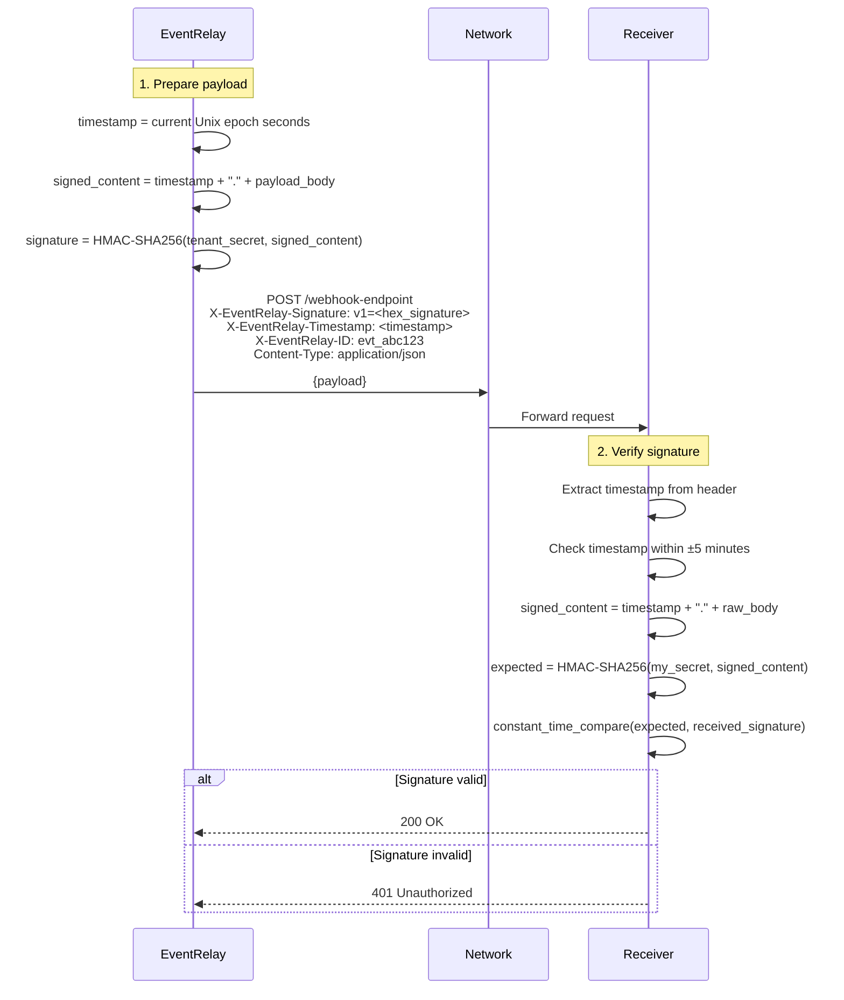
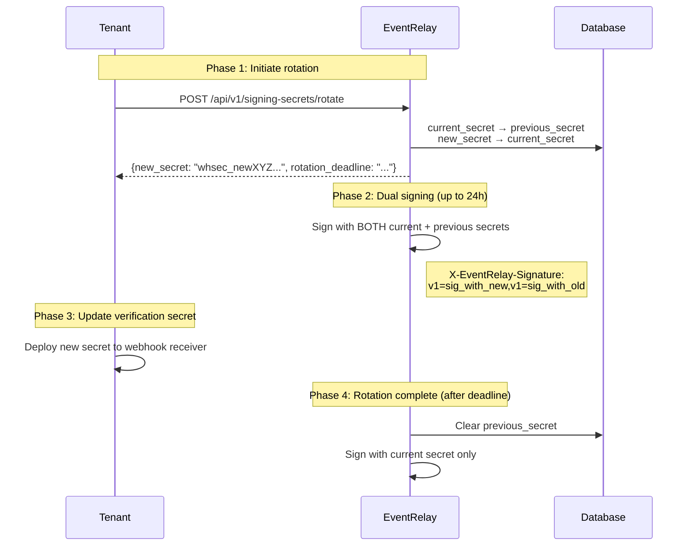

# HMAC-SHA256 Request Signing

## Overview

HMAC-SHA256 request signing is the **most critical security feature** of EventRelay. Every outgoing webhook delivery is signed with a tenant-specific secret, allowing receivers to cryptographically verify that:

1. **Authenticity** — The webhook was sent by EventRelay, not an attacker
2. **Integrity** — The payload was not tampered with in transit
3. **Timeliness** — The webhook was sent recently (not a replay)

This implementation closely follows the approach used by **Stripe**, **GitHub**, and **Svix**.

> [!IMPORTANT]
> HMAC signing is non-negotiable for webhook security. Without it, any attacker who discovers a webhook URL can send forged events to the receiver. Every single webhook delivery MUST include a valid signature.

---

## Signing Architecture



---

## Signature Format

### Headers Sent with Every Webhook

| Header | Format | Example |
|---|---|---|
| `X-EventRelay-Signature` | `v1=<hex-encoded-hmac>` | `v1=5257a869...e0b4c` |
| `X-EventRelay-Timestamp` | Unix epoch seconds (string) | `1752123456` |
| `X-EventRelay-ID` | Unique event delivery ID | `evt_7f8a9b2c3d4e5f6a` |

### Signature Header Structure

```
X-EventRelay-Signature: v1=5257a869e7ecebeda32affa62cdca3fa51cad7e77a0e56ff536d0ce8e108d8bd

                        ├┤ ├──────────────────────────────────────────────────────────────────┤
                        │  └── Hex-encoded HMAC-SHA256 (64 chars)
                        └───── Version prefix (for algorithm upgrades)
```

### Multiple Signatures (During Secret Rotation)

During secret rotation, EventRelay signs with **both** the current and the previous secret:

```
X-EventRelay-Signature: v1=5257a869...e108d8bd,v1=8c3f2a91...4d7e8f2b
                        └──── current secret ───┘ └── previous secret ──┘
```

The receiver should verify against each signature and accept if **any** match.

---

## Signing Process (Server-Side)

### Step-by-Step

```
Step 1: Generate timestamp
  timestamp = "1752123456" (current Unix epoch seconds)

Step 2: Construct the signed content
  signed_content = timestamp + "." + raw_request_body
  
  Example:
  signed_content = "1752123456.{\"event_type\":\"order.completed\",\"data\":{\"order_id\":\"ord_123\"}}"

Step 3: Compute HMAC-SHA256
  signature = HMAC-SHA256(
    key   = tenant_signing_secret,     // e.g., "whsec_MIGfMA0GCSqGSIb3DQEB..."
    data  = signed_content
  )

Step 4: Hex-encode and version-prefix
  header_value = "v1=" + hex_encode(signature)
  
  Result: "v1=5257a869e7ecebeda32affa62cdca3fa51cad7e77a0e56ff536d0ce8e108d8bd"
```

### Java Signing Implementation

```java
@Service
@Slf4j
public class WebhookSigningService {

    private static final String HMAC_ALGORITHM = "HmacSHA256";
    private static final String SIGNATURE_VERSION = "v1";

    /**
     * Signs a webhook payload with the tenant's signing secret(s).
     * Returns the complete X-EventRelay-Signature header value.
     *
     * @param payload       Raw JSON payload body (bytes, not string — avoids encoding issues)
     * @param timestamp     Unix epoch seconds when the webhook is being sent
     * @param signingSecret Current tenant signing secret
     * @param previousSecret Previous secret during rotation (nullable)
     * @return Signature header value, e.g., "v1=abc123..." or "v1=abc123...,v1=def456..."
     */
    public String signPayload(
            byte[] payload,
            long timestamp,
            String signingSecret,
            @Nullable String previousSecret) {

        // Construct signed content: timestamp.payload
        byte[] signedContent = buildSignedContent(timestamp, payload);

        // Sign with current secret
        String currentSignature = computeHmac(signingSecret, signedContent);
        StringBuilder headerValue = new StringBuilder();
        headerValue.append(SIGNATURE_VERSION).append("=").append(currentSignature);

        // During rotation, also sign with previous secret
        if (previousSecret != null && !previousSecret.isBlank()) {
            String previousSignature = computeHmac(previousSecret, signedContent);
            headerValue.append(",")
                .append(SIGNATURE_VERSION).append("=").append(previousSignature);
        }

        return headerValue.toString();
    }

    /**
     * Builds the signed content: "{timestamp}.{payload}"
     * Using byte concatenation to avoid string encoding inconsistencies.
     */
    private byte[] buildSignedContent(long timestamp, byte[] payload) {
        byte[] timestampBytes = String.valueOf(timestamp).getBytes(StandardCharsets.UTF_8);
        byte[] separator = ".".getBytes(StandardCharsets.UTF_8);

        byte[] result = new byte[timestampBytes.length + separator.length + payload.length];
        System.arraycopy(timestampBytes, 0, result, 0, timestampBytes.length);
        System.arraycopy(separator, 0, result, timestampBytes.length, separator.length);
        System.arraycopy(payload, 0, result, timestampBytes.length + separator.length, payload.length);
        return result;
    }

    /**
     * Computes HMAC-SHA256 and returns hex-encoded result.
     */
    private String computeHmac(String secret, byte[] data) {
        try {
            Mac mac = Mac.getInstance(HMAC_ALGORITHM);
            SecretKeySpec keySpec = new SecretKeySpec(
                secret.getBytes(StandardCharsets.UTF_8), HMAC_ALGORITHM);
            mac.init(keySpec);
            byte[] hmacBytes = mac.doFinal(data);
            return HexFormat.of().formatHex(hmacBytes);
        } catch (NoSuchAlgorithmException | InvalidKeyException e) {
            throw new SigningException("Failed to compute HMAC-SHA256", e);
        }
    }
}
```

### Webhook Delivery with Signing

```java
@Service
@Slf4j
public class WebhookDeliveryService {

    private final WebhookSigningService signingService;
    private final HttpClient httpClient;
    private final TenantSecretRepository secretRepository;

    public DeliveryResult deliverWebhook(WebhookDelivery delivery) {
        TenantSecret secrets = secretRepository.findByTenantId(delivery.getTenantId());

        long timestamp = Instant.now().getEpochSecond();
        byte[] payloadBytes = delivery.getPayload().getBytes(StandardCharsets.UTF_8);

        // Sign the payload
        String signature = signingService.signPayload(
            payloadBytes,
            timestamp,
            secrets.getCurrentSecret(),
            secrets.getPreviousSecret()  // null if not rotating
        );

        // Build the HTTP request
        HttpRequest request = HttpRequest.newBuilder()
            .uri(URI.create(delivery.getTargetUrl()))
            .header("Content-Type", "application/json")
            .header("X-EventRelay-Signature", signature)
            .header("X-EventRelay-Timestamp", String.valueOf(timestamp))
            .header("X-EventRelay-ID", delivery.getEventId())
            .header("User-Agent", "EventRelay/1.0")
            .timeout(Duration.ofSeconds(30))
            .POST(HttpRequest.BodyPublishers.ofByteArray(payloadBytes))
            .build();

        try {
            HttpResponse<String> response = httpClient.send(
                request, HttpResponse.BodyHandlers.ofString());

            return DeliveryResult.builder()
                .statusCode(response.statusCode())
                .success(response.statusCode() >= 200 && response.statusCode() < 300)
                .responseBody(truncate(response.body(), 1024))
                .deliveredAt(Instant.now())
                .build();

        } catch (IOException | InterruptedException e) {
            return DeliveryResult.builder()
                .success(false)
                .error(e.getMessage())
                .build();
        }
    }
}
```

---

## Receiver-Side Verification

### Verification Algorithm

```
Input:
  - received_signature  (from X-EventRelay-Signature header)
  - received_timestamp   (from X-EventRelay-Timestamp header)
  - raw_request_body     (raw bytes, NOT parsed JSON)
  - webhook_secret       (your stored signing secret)

Steps:
  1. Parse signatures: split header by "," → extract each "v1=..." value
  2. Validate timestamp: |current_time - received_timestamp| ≤ 300 seconds (5 min)
  3. Construct signed content: received_timestamp + "." + raw_request_body
  4. Compute expected signature: HMAC-SHA256(webhook_secret, signed_content)
  5. Compare: constant_time_compare(expected, received_signature)
  6. Accept if ANY signature matches (supports secret rotation)
```

> [!CAUTION]
> **Always use constant-time comparison** for signature verification. Using `==` or `.equals()` allows timing attacks where an attacker can determine the correct signature byte by byte based on response timing.

### Java Verification Example

```java
import javax.crypto.Mac;
import javax.crypto.spec.SecretKeySpec;
import java.nio.charset.StandardCharsets;
import java.security.MessageDigest;
import java.time.Instant;
import java.util.HexFormat;

public class EventRelayWebhookVerifier {

    private static final String HMAC_ALGORITHM = "HmacSHA256";
    private static final long TIMESTAMP_TOLERANCE_SECONDS = 300; // 5 minutes

    private final String webhookSecret;

    public EventRelayWebhookVerifier(String webhookSecret) {
        this.webhookSecret = webhookSecret;
    }

    /**
     * Verifies a webhook request. Call this in your webhook handler BEFORE
     * processing the event.
     *
     * @param signatureHeader Value of X-EventRelay-Signature header
     * @param timestampHeader Value of X-EventRelay-Timestamp header
     * @param rawBody         Raw request body as bytes (NOT parsed JSON)
     * @return true if the webhook is authentic and timely
     */
    public boolean verify(String signatureHeader, String timestampHeader, byte[] rawBody) {
        // Step 1: Validate timestamp
        long timestamp;
        try {
            timestamp = Long.parseLong(timestampHeader);
        } catch (NumberFormatException e) {
            return false;
        }

        long currentTime = Instant.now().getEpochSecond();
        if (Math.abs(currentTime - timestamp) > TIMESTAMP_TOLERANCE_SECONDS) {
            return false; // Too old or too far in the future — possible replay
        }

        // Step 2: Construct signed content
        String signedContent = timestamp + "." + new String(rawBody, StandardCharsets.UTF_8);

        // Step 3: Compute expected signature
        String expectedSignature = computeHmac(webhookSecret, signedContent);

        // Step 4: Parse received signatures and compare
        String[] signatures = signatureHeader.split(",");
        for (String sig : signatures) {
            sig = sig.trim();
            if (sig.startsWith("v1=")) {
                String receivedHmac = sig.substring(3);
                if (constantTimeEquals(expectedSignature, receivedHmac)) {
                    return true;
                }
            }
        }

        return false; // No signature matched
    }

    private String computeHmac(String secret, String data) {
        try {
            Mac mac = Mac.getInstance(HMAC_ALGORITHM);
            SecretKeySpec keySpec = new SecretKeySpec(
                secret.getBytes(StandardCharsets.UTF_8), HMAC_ALGORITHM);
            mac.init(keySpec);
            byte[] hmacBytes = mac.doFinal(data.getBytes(StandardCharsets.UTF_8));
            return HexFormat.of().formatHex(hmacBytes);
        } catch (Exception e) {
            throw new RuntimeException("HMAC computation failed", e);
        }
    }

    /**
     * Constant-time string comparison to prevent timing attacks.
     */
    private boolean constantTimeEquals(String a, String b) {
        return MessageDigest.isEqual(
            a.getBytes(StandardCharsets.UTF_8),
            b.getBytes(StandardCharsets.UTF_8)
        );
    }
}
```

### Spring Boot Webhook Receiver Example (Java)

```java
@RestController
@RequestMapping("/webhooks")
public class WebhookReceiverController {

    private final EventRelayWebhookVerifier verifier;

    public WebhookReceiverController(
            @Value("${eventrelay.webhook-secret}") String webhookSecret) {
        this.verifier = new EventRelayWebhookVerifier(webhookSecret);
    }

    @PostMapping("/events")
    public ResponseEntity<Void> handleWebhook(
            @RequestHeader("X-EventRelay-Signature") String signature,
            @RequestHeader("X-EventRelay-Timestamp") String timestamp,
            @RequestHeader("X-EventRelay-ID") String eventId,
            @RequestBody byte[] rawBody) {  // IMPORTANT: byte[], not String or Object

        // Step 1: Verify signature
        if (!verifier.verify(signature, timestamp, rawBody)) {
            log.warn("Webhook signature verification failed for event {}", eventId);
            return ResponseEntity.status(HttpStatus.UNAUTHORIZED).build();
        }

        // Step 2: Parse the verified payload
        WebhookEvent event = objectMapper.readValue(rawBody, WebhookEvent.class);

        // Step 3: Process idempotently (use eventId for deduplication)
        eventProcessor.processIdempotent(eventId, event);

        return ResponseEntity.ok().build();
    }
}
```

### Python Verification Example

```python
import hmac
import hashlib
import time


class EventRelayWebhookVerifier:
    """Verifies EventRelay webhook signatures."""

    TIMESTAMP_TOLERANCE = 300  # 5 minutes

    def __init__(self, webhook_secret: str):
        self.webhook_secret = webhook_secret

    def verify(
        self,
        signature_header: str,
        timestamp_header: str,
        raw_body: bytes
    ) -> bool:
        """
        Verify a webhook request.

        Args:
            signature_header: Value of X-EventRelay-Signature header
            timestamp_header: Value of X-EventRelay-Timestamp header
            raw_body: Raw request body bytes

        Returns:
            True if the webhook is authentic and timely
        """
        # Step 1: Validate timestamp
        try:
            timestamp = int(timestamp_header)
        except (ValueError, TypeError):
            return False

        current_time = int(time.time())
        if abs(current_time - timestamp) > self.TIMESTAMP_TOLERANCE:
            return False

        # Step 2: Construct signed content
        signed_content = f"{timestamp}.{raw_body.decode('utf-8')}"

        # Step 3: Compute expected signature
        expected = hmac.new(
            self.webhook_secret.encode('utf-8'),
            signed_content.encode('utf-8'),
            hashlib.sha256
        ).hexdigest()

        # Step 4: Compare each signature (supports rotation)
        for sig in signature_header.split(','):
            sig = sig.strip()
            if sig.startswith('v1='):
                received = sig[3:]
                if hmac.compare_digest(expected, received):
                    return True

        return False


# Flask example
from flask import Flask, request, abort

app = Flask(__name__)
verifier = EventRelayWebhookVerifier("whsec_your_secret_here")

@app.route('/webhooks/events', methods=['POST'])
def handle_webhook():
    signature = request.headers.get('X-EventRelay-Signature')
    timestamp = request.headers.get('X-EventRelay-Timestamp')
    raw_body = request.get_data()

    if not verifier.verify(signature, timestamp, raw_body):
        abort(401)

    event = request.get_json()
    # Process event...
    return '', 200
```

### Node.js Verification Example

```javascript
const crypto = require('crypto');

class EventRelayWebhookVerifier {
  static TIMESTAMP_TOLERANCE = 300; // 5 minutes

  constructor(webhookSecret) {
    this.webhookSecret = webhookSecret;
  }

  /**
   * Verify a webhook request.
   *
   * @param {string} signatureHeader - X-EventRelay-Signature header value
   * @param {string} timestampHeader - X-EventRelay-Timestamp header value
   * @param {Buffer|string} rawBody  - Raw request body
   * @returns {boolean} true if the webhook is authentic
   */
  verify(signatureHeader, timestampHeader, rawBody) {
    // Step 1: Validate timestamp
    const timestamp = parseInt(timestampHeader, 10);
    if (isNaN(timestamp)) return false;

    const currentTime = Math.floor(Date.now() / 1000);
    if (Math.abs(currentTime - timestamp) > EventRelayWebhookVerifier.TIMESTAMP_TOLERANCE) {
      return false;
    }

    // Step 2: Construct signed content
    const signedContent = `${timestamp}.${rawBody.toString('utf-8')}`;

    // Step 3: Compute expected signature
    const expected = crypto
      .createHmac('sha256', this.webhookSecret)
      .update(signedContent, 'utf-8')
      .digest('hex');

    // Step 4: Compare each signature
    const signatures = signatureHeader.split(',');
    for (const sig of signatures) {
      const trimmed = sig.trim();
      if (trimmed.startsWith('v1=')) {
        const received = trimmed.substring(3);
        try {
          if (crypto.timingSafeEqual(
            Buffer.from(expected, 'utf-8'),
            Buffer.from(received, 'utf-8')
          )) {
            return true;
          }
        } catch {
          // Length mismatch — not a valid signature
          continue;
        }
      }
    }

    return false;
  }
}

// Express.js example
const express = require('express');
const app = express();

// IMPORTANT: Use raw body parser for webhook routes
app.use('/webhooks', express.raw({ type: 'application/json' }));

const verifier = new EventRelayWebhookVerifier('whsec_your_secret_here');

app.post('/webhooks/events', (req, res) => {
  const signature = req.headers['x-eventrelay-signature'];
  const timestamp = req.headers['x-eventrelay-timestamp'];

  if (!verifier.verify(signature, timestamp, req.body)) {
    return res.status(401).json({ error: 'Invalid signature' });
  }

  const event = JSON.parse(req.body.toString());
  // Process event...
  res.status(200).send();
});
```

---

## Signature Versioning

### Why Version Signatures?

The `v1=` prefix allows future algorithm upgrades without breaking existing integrations:

| Version | Algorithm | Status |
|---|---|---|
| `v1` | HMAC-SHA256 | ✅ Current |
| `v2` | HMAC-SHA512 (future) | 🔮 Reserved |

### Upgrade Path

When upgrading from `v1` to `v2`:

1. **Phase 1**: Send both `v1` and `v2` signatures
   ```
   X-EventRelay-Signature: v1=abc123...,v2=def456...
   ```
2. **Phase 2**: Notify tenants to update their verification code
3. **Phase 3**: After migration period (90 days), stop sending `v1`
4. **Phase 4**: Only send `v2`

```java
// Future-proof signature generation
public String signPayloadVersioned(byte[] payload, long timestamp, String secret) {
    byte[] signedContent = buildSignedContent(timestamp, payload);

    StringBuilder signatures = new StringBuilder();

    // Always include current version
    String v1Sig = computeHmac("HmacSHA256", secret, signedContent);
    signatures.append("v1=").append(v1Sig);

    // During v2 migration, include v2 as well
    if (featureFlags.isEnabled("signature-v2")) {
        String v2Sig = computeHmac("HmacSHA512", secret, signedContent);
        signatures.append(",v2=").append(v2Sig);
    }

    return signatures.toString();
}
```

---

## Signing Secret Management

### Secret Format

```
whsec_base64encodedrandombytes...
└─┬─┘ └───────────┬───────────┘
prefix   32 bytes of SecureRandom, base64-encoded
```

### Secret Generation

```java
public String generateSigningSecret() {
    byte[] secretBytes = new byte[32]; // 256 bits
    new SecureRandom().nextBytes(secretBytes);
    String encoded = Base64.getEncoder().encodeToString(secretBytes);
    return "whsec_" + encoded;
}
```

### Secret Rotation (Dual-Secret Support)



### Secret Storage Schema

```sql
CREATE TABLE tenant_signing_secrets (
    id                  UUID PRIMARY KEY DEFAULT gen_random_uuid(),
    tenant_id           UUID NOT NULL REFERENCES tenants(id),
    current_secret      TEXT NOT NULL,              -- Encrypted at rest (AES-256-GCM)
    previous_secret     TEXT,                       -- Active during rotation
    rotation_started_at TIMESTAMPTZ,
    rotation_deadline   TIMESTAMPTZ,                -- Previous secret expires after this
    created_at          TIMESTAMPTZ NOT NULL DEFAULT NOW(),
    rotated_at          TIMESTAMPTZ,

    CONSTRAINT uq_tenant_secret UNIQUE (tenant_id)
);
```

---

## Step-by-Step Walkthrough

### Example: Complete Signing and Verification

**Scenario**: EventRelay sends a webhook for an `order.completed` event.

#### 1. Payload

```json
{"event_type":"order.completed","data":{"order_id":"ord_123","amount":9999},"timestamp":"2026-07-10T04:00:00Z"}
```

#### 2. Signing (EventRelay)

```
Tenant signing secret: whsec_dGhpcyBpcyBhIHRlc3Qgc2VjcmV0IGtleQ==
Timestamp:             1752123456
Raw payload:           {"event_type":"order.completed","data":{"order_id":"ord_123","amount":9999},"timestamp":"2026-07-10T04:00:00Z"}

Signed content:        1752123456.{"event_type":"order.completed","data":{"order_id":"ord_123","amount":9999},"timestamp":"2026-07-10T04:00:00Z"}

HMAC-SHA256:           5257a869e7ecebeda32affa62cdca3fa51cad7e77a0e56ff536d0ce8e108d8bd

Signature header:      v1=5257a869e7ecebeda32affa62cdca3fa51cad7e77a0e56ff536d0ce8e108d8bd
```

#### 3. HTTP Request Sent

```http
POST /webhooks/events HTTP/1.1
Host: api.customer.com
Content-Type: application/json
X-EventRelay-Signature: v1=5257a869e7ecebeda32affa62cdca3fa51cad7e77a0e56ff536d0ce8e108d8bd
X-EventRelay-Timestamp: 1752123456
X-EventRelay-ID: evt_7f8a9b2c3d4e5f6a
User-Agent: EventRelay/1.0

{"event_type":"order.completed","data":{"order_id":"ord_123","amount":9999},"timestamp":"2026-07-10T04:00:00Z"}
```

#### 4. Verification (Receiver)

```
My secret:         whsec_dGhpcyBpcyBhIHRlc3Qgc2VjcmV0IGtleQ==
Received timestamp: 1752123456
Current time:       1752123500 (44 seconds later — within 5 min tolerance ✓)

Construct:         "1752123456.{\"event_type\":\"order.completed\",...}"
Compute HMAC:      5257a869e7ecebeda32affa62cdca3fa51cad7e77a0e56ff536d0ce8e108d8bd
Compare:           constant_time_compare(my_hmac, received_hmac) → ✓ MATCH

Result: AUTHENTIC ✓
```

---

## Common Pitfalls

> [!WARNING]
> These are the most common mistakes when implementing webhook signature verification. Getting any of these wrong will either break verification or create security vulnerabilities.

| Pitfall | Problem | Solution |
|---|---|---|
| Parsing JSON before verifying | JSON parsers may reorder keys, add/remove whitespace | Verify against **raw body bytes**, then parse |
| Using `==` for comparison | Timing attack — attacker learns correct signature byte by byte | Use `MessageDigest.isEqual()` / `hmac.compare_digest()` / `crypto.timingSafeEqual()` |
| Not checking timestamp | Vulnerable to replay attacks | Always check `|now - timestamp| ≤ 300s` |
| Encoding mismatches | UTF-8 vs Latin-1 differences | Always use UTF-8 explicitly |
| Framework body parsing | Express.js, Django, etc. may parse body before your handler | Use raw body middleware for webhook routes |
| Ignoring multiple signatures | Breaks during secret rotation | Verify against ALL `v1=` values, accept if any match |

---

## Production Considerations

### Performance

| Metric | Value |
|---|---|
| HMAC-SHA256 computation | ~1μs per operation |
| Overhead per webhook | < 0.1ms total signing overhead |
| Memory | HMAC is streaming — constant memory regardless of payload size |

### Monitoring

```yaml
# Track signing operations
webhook_signatures_generated_total
webhook_signature_verification_failures_total{reason="expired|mismatch|missing"}
webhook_dual_secret_deliveries_total  # During rotation
```

### Testing

```java
@Test
void shouldVerifyValidSignature() {
    String secret = "whsec_dGVzdHNlY3JldA==";
    WebhookSigningService signer = new WebhookSigningService();
    EventRelayWebhookVerifier verifier = new EventRelayWebhookVerifier(secret);

    byte[] payload = "{\"event\":\"test\"}".getBytes(StandardCharsets.UTF_8);
    long timestamp = Instant.now().getEpochSecond();

    String signature = signer.signPayload(payload, timestamp, secret, null);

    assertTrue(verifier.verify(signature, String.valueOf(timestamp), payload));
}

@Test
void shouldRejectTamperedPayload() {
    // ... sign with original payload, verify with modified payload → false
}

@Test
void shouldRejectExpiredTimestamp() {
    // ... sign with old timestamp (6 minutes ago) → false
}

@Test
void shouldAcceptDuringSecretRotation() {
    // ... sign with both secrets, verify with either → true
}
```

---

## Related Documents

- [Replay Attack Protection](./Replay_Attack_Protection.md) — Timestamp validation details
- [Timestamp Validation](./Timestamp_Validation.md) — Clock skew and edge cases
- [Secret Rotation](./Secret_Rotation.md) — Signing secret rotation procedures
- [Security Best Practices](./Security_Best_Practices.md) — Overall security posture
