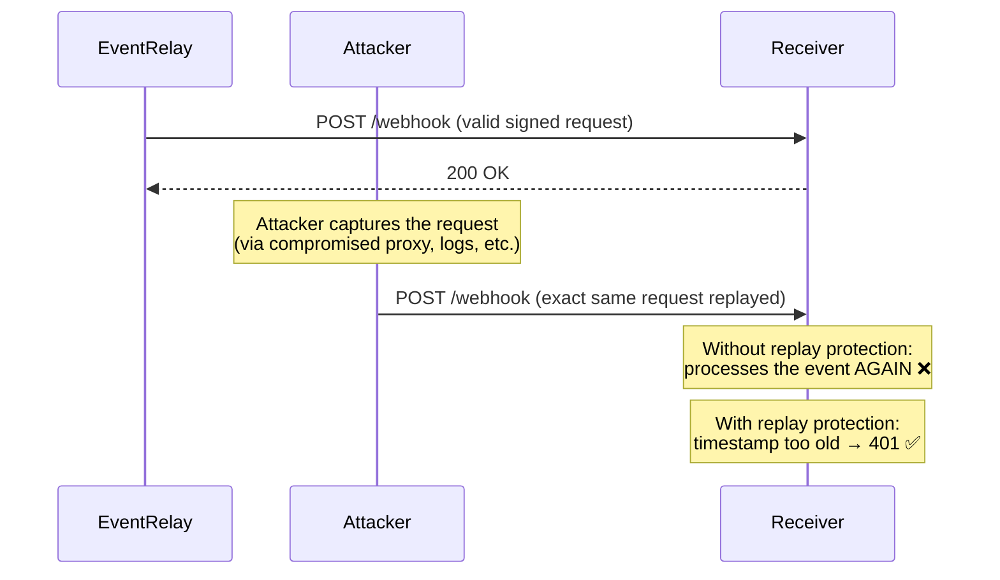
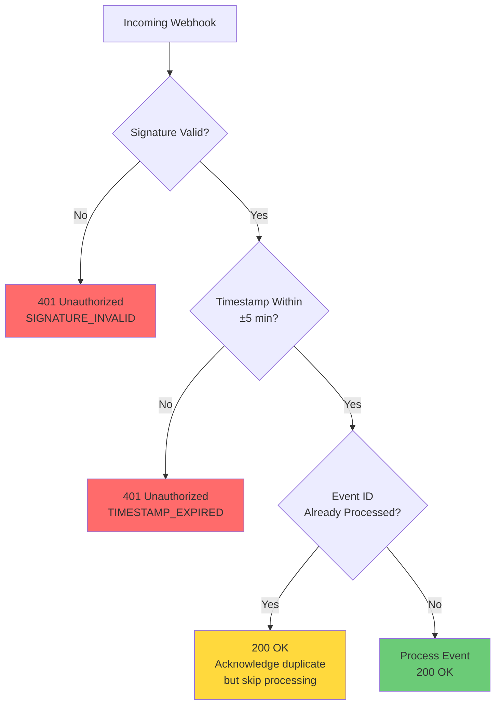

# Replay Attack Protection

## Overview

A **replay attack** occurs when an attacker intercepts a valid webhook delivery and re-sends it to the receiver, potentially causing duplicate processing (double charges, duplicate notifications, repeated state mutations). EventRelay implements multiple layers of replay attack prevention.

> [!IMPORTANT]
> Even with HTTPS, replay attacks are possible if an attacker gains access to server logs, a compromised proxy, or the receiver's request history. Replay protection is defense-in-depth — it protects against scenarios where transport security alone is insufficient.

---

## Attack Scenarios

### Scenario 1: Basic Replay



### Scenario 2: Delayed Replay

```
Timeline:
  T+0s:   EventRelay sends webhook → Receiver processes ✓
  T+10m:  Attacker replays exact same request
           → Timestamp check: |now - timestamp| = 600s > 300s → REJECT ✓
```

### Scenario 3: Rapid Replay (Within Tolerance Window)

```
Timeline:
  T+0s:   EventRelay sends webhook → Receiver processes ✓
  T+30s:  Attacker replays (within 5-min window)
           → Timestamp check passes (30s < 300s)
           → Nonce/idempotency check: event ID already processed → REJECT ✓
```

### Scenario 4: Request Modification Attack

```
Timeline:
  T+0s:   Attacker intercepts valid request
  T+1s:   Attacker modifies payload (e.g., changes amount)
           → HMAC verification fails (payload changed) → REJECT ✓
  T+1s:   Attacker replays with original payload but new timestamp
           → HMAC verification fails (timestamp in signed content changed) → REJECT ✓
```

---

## Protection Layer 1: Timestamp Validation

### How It Works

Every webhook includes an `X-EventRelay-Timestamp` header containing the Unix epoch time (seconds) when EventRelay sent the request. This timestamp is **included in the HMAC signed content**, making it tamper-proof.

```
Signed content = "{timestamp}.{payload}"
                  └────┬────┘
                  Attacker cannot change this
                  without invalidating the signature
```

### Tolerance Window

| Parameter | Value | Rationale |
|---|---|---|
| Default tolerance | ±300 seconds (5 minutes) | Accounts for network latency, retry delays, clock skew |
| Minimum recommended | ±60 seconds | For low-latency environments |
| Maximum recommended | ±600 seconds | For high-latency or international deployments |

### Implementation

```java
@Component
public class TimestampReplayProtection {

    private static final long DEFAULT_TOLERANCE_SECONDS = 300; // 5 minutes

    @Value("${eventrelay.webhook.timestamp-tolerance-seconds:300}")
    private long toleranceSeconds;

    /**
     * Validates that a webhook timestamp is within the acceptable window.
     *
     * @param timestampHeader The X-EventRelay-Timestamp header value
     * @return ValidationResult with details
     */
    public TimestampValidationResult validateTimestamp(String timestampHeader) {
        // Parse timestamp
        long receivedTimestamp;
        try {
            receivedTimestamp = Long.parseLong(timestampHeader);
        } catch (NumberFormatException e) {
            return TimestampValidationResult.invalid("Timestamp is not a valid number");
        }

        // Check bounds
        long currentTimestamp = Instant.now().getEpochSecond();
        long difference = Math.abs(currentTimestamp - receivedTimestamp);

        if (difference > toleranceSeconds) {
            String direction = (receivedTimestamp < currentTimestamp) ? "past" : "future";
            return TimestampValidationResult.expired(
                String.format(
                    "Timestamp is %d seconds in the %s (tolerance: %d seconds)",
                    difference, direction, toleranceSeconds
                )
            );
        }

        return TimestampValidationResult.valid(difference);
    }
}
```

```java
public record TimestampValidationResult(
    boolean valid,
    String reason,
    long skewSeconds
) {
    public static TimestampValidationResult valid(long skew) {
        return new TimestampValidationResult(true, null, skew);
    }

    public static TimestampValidationResult expired(String reason) {
        return new TimestampValidationResult(false, reason, -1);
    }

    public static TimestampValidationResult invalid(String reason) {
        return new TimestampValidationResult(false, reason, -1);
    }
}
```

---

## Protection Layer 2: Nonce / Idempotency Key

### Why Timestamps Alone Aren't Enough

Timestamps protect against **delayed** replays, but a rapid replay within the tolerance window would pass timestamp validation. The **idempotency key** (`X-EventRelay-ID`) provides a second layer of protection.

```
Replay within 5-minute window:
  ✅ Timestamp check passes (within tolerance)
  ❌ Nonce check fails (event ID already processed)
```

### Event ID as Nonce

Every webhook delivery includes an `X-EventRelay-ID` header with a unique delivery identifier:

```
X-EventRelay-ID: evt_7f8a9b2c3d4e5f6a
```

The receiver should track processed event IDs and reject duplicates.

### Redis-Based Nonce Store (Receiver Side)

```java
@Service
public class WebhookIdempotencyService {

    private final StringRedisTemplate redisTemplate;
    private static final String NONCE_PREFIX = "webhook:nonce:";
    private static final Duration NONCE_TTL = Duration.ofHours(24);

    /**
     * Checks if an event has already been processed and marks it as processed.
     * Uses Redis SET with NX (set-if-not-exists) for atomic check-and-set.
     *
     * @param eventId The X-EventRelay-ID value
     * @return true if this is a NEW event (should be processed)
     *         false if this event was already processed (duplicate/replay)
     */
    public boolean tryProcess(String eventId) {
        String key = NONCE_PREFIX + eventId;

        // SET key value NX EX ttl → returns true only if key didn't exist
        Boolean isNew = redisTemplate.opsForValue()
            .setIfAbsent(key, Instant.now().toString(), NONCE_TTL);

        return Boolean.TRUE.equals(isNew);
    }

    /**
     * Marks an event as processed explicitly (for cases where processing
     * happens asynchronously after initial acceptance).
     */
    public void markProcessed(String eventId) {
        String key = NONCE_PREFIX + eventId;
        redisTemplate.opsForValue().set(key, Instant.now().toString(), NONCE_TTL);
    }
}
```

### Database-Based Nonce Store (Alternative)

For receivers that need durability beyond Redis TTL:

```sql
CREATE TABLE processed_webhooks (
    event_id    VARCHAR(50) PRIMARY KEY,
    processed_at TIMESTAMPTZ NOT NULL DEFAULT NOW(),
    payload_hash VARCHAR(64)           -- Optional: SHA-256 of payload for debugging
);

-- Auto-cleanup: partition by month or use pg_cron to delete old entries
CREATE INDEX idx_processed_webhooks_time ON processed_webhooks(processed_at);
```

```java
@Repository
public interface ProcessedWebhookRepository extends JpaRepository<ProcessedWebhook, String> {

    @Modifying
    @Query(value = """
        INSERT INTO processed_webhooks (event_id, processed_at, payload_hash)
        VALUES (:eventId, NOW(), :payloadHash)
        ON CONFLICT (event_id) DO NOTHING
        """, nativeQuery = true)
    int tryInsert(@Param("eventId") String eventId, @Param("payloadHash") String payloadHash);
}
```

---

## Combined Protection: Webhook Verification Middleware

```java
@Component
@Slf4j
public class WebhookSecurityFilter {

    private final EventRelayWebhookVerifier signatureVerifier;
    private final TimestampReplayProtection timestampProtection;
    private final WebhookIdempotencyService idempotencyService;

    /**
     * Complete webhook verification: signature + timestamp + nonce.
     * Call this BEFORE processing any webhook event.
     */
    public WebhookVerificationResult verify(
            String signatureHeader,
            String timestampHeader,
            String eventId,
            byte[] rawBody) {

        // Layer 1: Signature verification (authenticity + integrity)
        if (!signatureVerifier.verify(signatureHeader, timestampHeader, rawBody)) {
            log.warn("Webhook signature verification failed for event {}", eventId);
            return WebhookVerificationResult.rejected("SIGNATURE_INVALID",
                "Webhook signature verification failed");
        }

        // Layer 2: Timestamp validation (replay protection — delayed)
        TimestampValidationResult timestampResult =
            timestampProtection.validateTimestamp(timestampHeader);
        if (!timestampResult.valid()) {
            log.warn("Webhook timestamp validation failed for event {}: {}",
                eventId, timestampResult.reason());
            return WebhookVerificationResult.rejected("TIMESTAMP_EXPIRED",
                timestampResult.reason());
        }

        // Layer 3: Nonce / idempotency check (replay protection — rapid)
        if (!idempotencyService.tryProcess(eventId)) {
            log.info("Duplicate webhook detected for event {} — skipping", eventId);
            return WebhookVerificationResult.duplicate(eventId);
        }

        return WebhookVerificationResult.accepted();
    }
}
```

### Verification Decision Tree



> [!NOTE]
> For duplicate events (Layer 3), return `200 OK` rather than an error code. From EventRelay's perspective, the webhook was delivered successfully. Returning an error would trigger unnecessary retries.

---

## Receiver-Side Implementation Patterns

### Pattern 1: Synchronous Processing

```java
@PostMapping("/webhooks/events")
public ResponseEntity<Void> handleWebhook(
        @RequestHeader("X-EventRelay-Signature") String signature,
        @RequestHeader("X-EventRelay-Timestamp") String timestamp,
        @RequestHeader("X-EventRelay-ID") String eventId,
        @RequestBody byte[] rawBody) {

    var result = webhookSecurityFilter.verify(signature, timestamp, eventId, rawBody);

    return switch (result.status()) {
        case ACCEPTED -> {
            processEvent(rawBody);
            yield ResponseEntity.ok().build();
        }
        case DUPLICATE -> ResponseEntity.ok().build();  // ACK but don't process
        case REJECTED -> ResponseEntity.status(401).build();
    };
}
```

### Pattern 2: Async Processing with Idempotency

```java
@PostMapping("/webhooks/events")
public ResponseEntity<Void> handleWebhook(
        @RequestHeader("X-EventRelay-Signature") String signature,
        @RequestHeader("X-EventRelay-Timestamp") String timestamp,
        @RequestHeader("X-EventRelay-ID") String eventId,
        @RequestBody byte[] rawBody) {

    // Verify signature and timestamp synchronously (fast)
    if (!signatureVerifier.verify(signature, timestamp, rawBody)) {
        return ResponseEntity.status(401).build();
    }

    // ACK immediately (EventRelay considers delivery successful)
    // Queue for async processing with built-in idempotency
    webhookQueue.enqueue(eventId, rawBody);

    return ResponseEntity.ok().build();
}

// Async processor with database-level idempotency
@Async
public void processFromQueue(String eventId, byte[] payload) {
    // INSERT ... ON CONFLICT DO NOTHING → returns 0 rows if duplicate
    int inserted = processedWebhookRepo.tryInsert(eventId, sha256(payload));
    if (inserted == 0) {
        log.debug("Skipping duplicate event {}", eventId);
        return;
    }

    // Actually process the event
    doProcess(payload);
}
```

---

## Edge Cases

### Clock Skew Between EventRelay and Receiver

If the receiver's clock is ahead by 3 minutes, a webhook sent at T=0 would appear to be 3 minutes old on arrival:

```
EventRelay clock:  T = 1752123456
Receiver clock:    T = 1752123636 (3 min ahead)
Perceived age:     180 seconds (within 300s tolerance ✓)

But if receiver clock is 6 minutes ahead:
Perceived age:     360 seconds (> 300s tolerance ✗)
```

**Mitigation**: Use NTP synchronization. The ±5 minute tolerance accounts for reasonable clock drift. See [Timestamp Validation](./Timestamp_Validation.md) for details.

### EventRelay Retries and Replay Protection

When EventRelay retries a failed delivery, it generates a **new timestamp and signature** for each attempt:

```
Attempt 1: timestamp=1752123456, signature=v1=abc...
Attempt 2: timestamp=1752123461, signature=v1=def...  (5s later, new signature)
Attempt 3: timestamp=1752123491, signature=v1=ghi...  (30s later, new signature)
```

The `X-EventRelay-ID` remains the same across retries, so the receiver's idempotency check catches the duplicate if attempt 1 was actually received.

### Network-Level Duplicates

Rarely, network issues can cause the same TCP packet to be delivered twice. The nonce check handles this:

```
Packet 1 arrives: Redis SET webhook:nonce:evt_123 NX → true → process
Packet 2 arrives: Redis SET webhook:nonce:evt_123 NX → false → skip
```

---

## Configuration

```yaml
# application.yml (Receiver-side)
eventrelay:
  webhook:
    # Timestamp tolerance for replay protection
    timestamp-tolerance-seconds: 300    # 5 minutes (default)

    # Nonce store configuration
    nonce:
      store: redis                      # "redis" or "database"
      ttl-hours: 24                     # How long to remember processed events
      
    # Signature verification
    signing-secret: ${EVENTRELAY_WEBHOOK_SECRET}
```

---

## Production Considerations

### Monitoring

```yaml
# Key metrics to track
webhook_replay_attempts_total          # Detected replays (should be near zero)
webhook_timestamp_rejections_total     # Timestamps outside tolerance
webhook_duplicate_events_total         # Nonce hits (expected during retries)
webhook_signature_failures_total       # Invalid signatures (possible attacks)
```

### Alert Rules

```yaml
groups:
  - name: webhook_security
    rules:
      - alert: HighReplayAttemptRate
        expr: rate(webhook_replay_attempts_total[5m]) > 1
        for: 5m
        labels:
          severity: warning
        annotations:
          summary: "Elevated webhook replay attempts detected"

      - alert: SignatureVerificationFailureSpike
        expr: rate(webhook_signature_failures_total[5m]) > 5
        for: 2m
        labels:
          severity: critical
        annotations:
          summary: "High rate of webhook signature failures — possible attack"
```

---

## Related Documents

- [HMAC Request Signing](./HMAC_Request_Signing.md) — How signatures are generated and verified
- [Timestamp Validation](./Timestamp_Validation.md) — Clock skew handling and edge cases
- [Security Best Practices](./Security_Best_Practices.md) — Overall security posture
