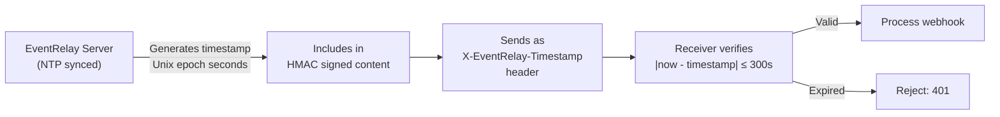

# Timestamp Validation

## Overview

Timestamp validation is a critical component of EventRelay's webhook security, working in conjunction with [HMAC signing](./HMAC_Request_Signing.md) and [replay attack protection](./Replay_Attack_Protection.md). The timestamp proves that a webhook was sent recently, preventing attackers from replaying captured requests hours or days later.

> [!NOTE]
> EventRelay generates all timestamps server-side. Client-provided timestamps are never trusted for security purposes. This eliminates an entire class of attacks where clients forge timestamps.

---

## Timestamp Architecture

### Timestamp Flow



### Why Server-Side Generation?

| Approach | Security | Issues |
|---|---|---|
| **Server-generated** (EventRelay's approach) | ✅ Trusted | Requires NTP sync on EventRelay servers |
| Client-generated | ❌ Untrusted | Client can set any timestamp; renders replay protection useless |
| Both (server overrides) | ✅ Trusted | Adds complexity with no security benefit |

---

## Timestamp Format

### Unix Epoch Seconds

EventRelay uses **Unix epoch seconds** (integer, not milliseconds) as the timestamp format:

```
X-EventRelay-Timestamp: 1752123456
```

| Property | Value |
|---|---|
| Format | Integer, Unix epoch seconds |
| Precision | 1 second |
| Timezone | UTC (always) |
| Range | 1970-01-01 to 2038-01-19 (32-bit) or 292 billion years (64-bit long) |
| Language representation | `long` (Java), `int` (Python), `number` (JavaScript) |

### Why Not ISO 8601?

| Format | Example | Parsing complexity | Signature safety |
|---|---|---|---|
| **Unix seconds** | `1752123456` | Trivial — `Long.parseLong()` | ✅ No encoding issues |
| ISO 8601 | `2026-07-10T04:00:56Z` | Complex — timezone, format variants | ⚠️ `+` encoding issues in URLs/headers |
| Unix milliseconds | `1752123456789` | Trivial | ✅ No encoding issues |

Unix seconds is the industry standard (used by Stripe, Twilio, Svix).

---

## Timestamp in Signature Computation

The timestamp is **cryptographically bound** to the payload via the HMAC signature:

```
signed_content = "{timestamp}.{payload}"
signature      = HMAC-SHA256(secret, signed_content)
```

This binding means:
- An attacker **cannot change the timestamp** without invalidating the signature
- An attacker **cannot reuse the signature** with a different timestamp
- The timestamp and payload are authenticated together as a single unit

### Example

```java
// What EventRelay signs:
long timestamp = 1752123456L;
String payload = "{\"event_type\":\"order.completed\"}";
String signedContent = timestamp + "." + payload;
// signedContent = "1752123456.{\"event_type\":\"order.completed\"}"

// HMAC covers BOTH the timestamp and the payload
String signature = hmacSha256(secret, signedContent);
```

### Why Concatenation Order Matters

```
Format: "{timestamp}.{payload}"

✅ "1752123456.{json}"     → timestamp is unambiguous (before the first ".")
❌ "{json}.1752123456"      → ambiguous if JSON contains "."
❌ "{timestamp}{payload}"   → ambiguous boundary
```

The `.` separator prevents ambiguity. The timestamp always comes first for consistent parsing.

---

## Clock Skew Handling

### The Clock Skew Problem

```
EventRelay Server Clock:  10:00:00.000 UTC
Receiver Server Clock:    10:00:03.500 UTC  (3.5 seconds ahead)

EventRelay sends:  X-EventRelay-Timestamp: 1752123600  (10:00:00)
Receiver checks:   current_time = 1752123604            (10:00:03.5, rounded)
Difference:        4 seconds → within 300s tolerance ✅

But if receiver is 6 minutes ahead:
Receiver checks:   current_time = 1752123960            (10:06:00)
Difference:        360 seconds → exceeds 300s tolerance ❌ (false rejection!)
```

### Tolerance Window Design

```
                    Past                          Future
    ◄──── reject ────│────── accept window ──────│──── reject ────►
                     │                           │
              -300s (5 min)               +300s (5 min)
                     │                           │
                     └──── current time ─────────┘
                              (T=0)
```

**Why ±5 minutes?**

| Factor | Typical range | Impact |
|---|---|---|
| Network latency | 10-500ms | Negligible |
| NTP drift (well-configured) | < 1 second | Negligible |
| NTP drift (misconfigured) | 1-60 seconds | Covered by tolerance |
| EventRelay retry delays | 1s to 1h | New timestamp per retry |
| Geographic distance | 100-300ms | Negligible |

The 5-minute window is a balance between:
- **Too tight** (e.g., ±30s): False rejections due to minor clock drift
- **Too loose** (e.g., ±30m): Larger replay attack window

### Configurable Tolerance

```java
@ConfigurationProperties(prefix = "eventrelay.webhook")
public class WebhookSecurityProperties {

    /**
     * Maximum allowed age of webhook timestamp, in seconds.
     * Default: 300 (5 minutes).
     *
     * <p>This value should account for:
     * <ul>
     *   <li>Network latency between EventRelay and the receiver</li>
     *   <li>Clock skew between servers (NTP drift)</li>
     *   <li>Processing delays in receiver's network stack</li>
     * </ul>
     *
     * <p>Increasing this value widens the replay attack window.
     * Decreasing it increases false rejection risk.
     */
    private long timestampToleranceSeconds = 300;

    /**
     * Whether to reject timestamps in the future.
     * Default: true (reject future timestamps beyond tolerance).
     *
     * <p>Future timestamps indicate:
     * <ul>
     *   <li>Clock skew where EventRelay's clock is ahead</li>
     *   <li>Forged timestamps (attack)</li>
     * </ul>
     */
    private boolean rejectFutureTimestamps = true;
}
```

---

## Validation Implementation

### Complete Timestamp Validator

```java
@Component
@Slf4j
public class WebhookTimestampValidator {

    private final WebhookSecurityProperties properties;
    private final Clock clock;

    public WebhookTimestampValidator(
            WebhookSecurityProperties properties,
            Clock clock) {
        this.properties = properties;
        this.clock = clock;
    }

    /**
     * Validates a webhook timestamp.
     *
     * @param timestampHeader Raw value of the X-EventRelay-Timestamp header
     * @return Validation result with details
     */
    public TimestampValidationResult validate(String timestampHeader) {
        // Step 1: Null/empty check
        if (timestampHeader == null || timestampHeader.isBlank()) {
            return TimestampValidationResult.builder()
                .valid(false)
                .rejectionReason(RejectionReason.MISSING)
                .message("X-EventRelay-Timestamp header is missing")
                .build();
        }

        // Step 2: Parse as long
        long webhookTimestamp;
        try {
            webhookTimestamp = Long.parseLong(timestampHeader.trim());
        } catch (NumberFormatException e) {
            return TimestampValidationResult.builder()
                .valid(false)
                .rejectionReason(RejectionReason.MALFORMED)
                .message("Timestamp is not a valid integer: " + timestampHeader)
                .build();
        }

        // Step 3: Sanity check — reject obviously invalid values
        if (webhookTimestamp < 1_000_000_000L) {
            // Before 2001-09-09 — almost certainly wrong (or milliseconds)
            return TimestampValidationResult.builder()
                .valid(false)
                .rejectionReason(RejectionReason.MALFORMED)
                .message("Timestamp appears to be in an invalid range (too old or wrong unit)")
                .build();
        }

        if (webhookTimestamp > 10_000_000_000L) {
            // Likely milliseconds instead of seconds
            return TimestampValidationResult.builder()
                .valid(false)
                .rejectionReason(RejectionReason.MALFORMED)
                .message("Timestamp appears to be in milliseconds — expected seconds")
                .build();
        }

        // Step 4: Compare against current time
        long currentTimestamp = clock.instant().getEpochSecond();
        long difference = currentTimestamp - webhookTimestamp;
        long absoluteDifference = Math.abs(difference);

        // Step 5: Check tolerance
        if (absoluteDifference > properties.getTimestampToleranceSeconds()) {
            boolean isFuture = difference < 0;
            return TimestampValidationResult.builder()
                .valid(false)
                .rejectionReason(isFuture ? RejectionReason.FUTURE : RejectionReason.EXPIRED)
                .message(String.format(
                    "Timestamp is %d seconds in the %s (tolerance: %d seconds)",
                    absoluteDifference,
                    isFuture ? "future" : "past",
                    properties.getTimestampToleranceSeconds()
                ))
                .webhookTimestamp(webhookTimestamp)
                .serverTimestamp(currentTimestamp)
                .skewSeconds(difference)
                .build();
        }

        // Step 6: Valid
        return TimestampValidationResult.builder()
            .valid(true)
            .webhookTimestamp(webhookTimestamp)
            .serverTimestamp(currentTimestamp)
            .skewSeconds(difference)
            .build();
    }

    public enum RejectionReason {
        MISSING,    // Header not present
        MALFORMED,  // Not a valid integer or wrong unit
        EXPIRED,    // Too far in the past
        FUTURE      // Too far in the future
    }
}
```

### Unit Tests

```java
@ExtendWith(MockitoExtension.class)
class WebhookTimestampValidatorTest {

    private WebhookTimestampValidator validator;
    private WebhookSecurityProperties properties;

    @BeforeEach
    void setUp() {
        properties = new WebhookSecurityProperties();
        properties.setTimestampToleranceSeconds(300); // 5 minutes
    }

    private void createValidatorAtTime(Instant fixedTime) {
        Clock fixedClock = Clock.fixed(fixedTime, ZoneOffset.UTC);
        validator = new WebhookTimestampValidator(properties, fixedClock);
    }

    @Test
    void shouldAcceptTimestampWithinTolerance() {
        Instant now = Instant.ofEpochSecond(1752123456);
        createValidatorAtTime(now);

        // 30 seconds ago — well within tolerance
        var result = validator.validate("1752123426");
        assertTrue(result.isValid());
        assertEquals(30L, result.getSkewSeconds());
    }

    @Test
    void shouldRejectTimestampTooOld() {
        Instant now = Instant.ofEpochSecond(1752123456);
        createValidatorAtTime(now);

        // 400 seconds ago — outside 300s tolerance
        var result = validator.validate("1752123056");
        assertFalse(result.isValid());
        assertEquals(RejectionReason.EXPIRED, result.getRejectionReason());
    }

    @Test
    void shouldRejectTimestampInFuture() {
        Instant now = Instant.ofEpochSecond(1752123456);
        createValidatorAtTime(now);

        // 400 seconds in the future
        var result = validator.validate("1752123856");
        assertFalse(result.isValid());
        assertEquals(RejectionReason.FUTURE, result.getRejectionReason());
    }

    @Test
    void shouldRejectMillisecondTimestamp() {
        Instant now = Instant.ofEpochSecond(1752123456);
        createValidatorAtTime(now);

        // Milliseconds instead of seconds
        var result = validator.validate("1752123456789");
        assertFalse(result.isValid());
        assertEquals(RejectionReason.MALFORMED, result.getRejectionReason());
    }

    @Test
    void shouldRejectMissingTimestamp() {
        createValidatorAtTime(Instant.now());
        var result = validator.validate(null);
        assertFalse(result.isValid());
        assertEquals(RejectionReason.MISSING, result.getRejectionReason());
    }

    @Test
    void shouldRejectNonNumericTimestamp() {
        createValidatorAtTime(Instant.now());
        var result = validator.validate("not-a-number");
        assertFalse(result.isValid());
        assertEquals(RejectionReason.MALFORMED, result.getRejectionReason());
    }

    @Test
    void shouldAcceptBoundaryTimestamp() {
        Instant now = Instant.ofEpochSecond(1752123456);
        createValidatorAtTime(now);

        // Exactly at the tolerance boundary (300 seconds)
        var result = validator.validate("1752123156");
        assertTrue(result.isValid()); // ≤ 300, not <
    }
}
```

---

## NTP Synchronization Requirements

### EventRelay Servers

EventRelay servers **must** run NTP-synchronized clocks. The generated timestamp is the foundation of replay protection — if EventRelay's clock is wrong, all receivers will reject legitimate webhooks.

```
EventRelay Server Requirements:
  ✅ NTP client running (chrony or ntpd)
  ✅ Maximum drift: < 1 second
  ✅ Monitoring: alert if NTP sync is lost
  ✅ Multiple NTP sources configured
```

### AWS ECS / Fargate

On AWS ECS (EventRelay's deployment target), time synchronization is handled automatically:

```
AWS Fargate:
  - Uses Amazon Time Sync Service (169.254.169.123)
  - Chrony pre-installed and configured
  - Typical accuracy: < 1ms from UTC
  - No configuration needed ✓
```

### Receiver Servers

Receivers should also run NTP, but EventRelay cannot enforce this. The ±5 minute tolerance accommodates receivers with moderate clock drift.

```yaml
# Recommended NTP configuration for receivers (chrony)
# /etc/chrony/chrony.conf
server 0.pool.ntp.org iburst
server 1.pool.ntp.org iburst
server 2.pool.ntp.org iburst
server 3.pool.ntp.org iburst

# Maximum allowed drift before correction
makestep 1 3   # Step the clock if drift > 1 second in the first 3 updates
```

### Monitoring NTP Drift

```java
@Component
@Slf4j
public class ClockDriftMonitor {

    private final MeterRegistry meterRegistry;

    @Scheduled(fixedRate = 60_000) // Check every minute
    public void checkClockDrift() {
        try {
            // Compare system clock against a known NTP server
            // In production, this would use an NTP client library
            Instant systemTime = Instant.now();
            // Log and expose as metric
            meterRegistry.gauge("system.clock.epoch_seconds", systemTime.getEpochSecond());
        } catch (Exception e) {
            log.error("Failed to check clock drift", e);
        }
    }
}
```

```yaml
# Prometheus alert for clock drift
- alert: ClockDriftDetected
  expr: abs(node_timex_offset_seconds) > 2
  for: 5m
  labels:
    severity: warning
  annotations:
    summary: "Server clock drift > 2 seconds detected"
```

---

## Edge Cases

### 1. Server Clock Drift (Gradual)

**Scenario**: Receiver's NTP daemon fails silently, clock drifts 1 second per hour.

```
Hour 0: Drift = 0s → webhooks accepted ✓
Hour 1: Drift = 1s → webhooks accepted ✓ (within tolerance)
Hour 4: Drift = 4min → webhooks accepted ✓ (borderline)
Hour 5: Drift = 5min → webhooks start failing ✗
Hour 6: Drift = 6min → all webhooks rejected ✗
```

**Mitigation**: Monitor NTP sync status. Alert when drift exceeds 30 seconds.

### 2. Leap Seconds

**Impact**: Minimal. Unix timestamps (which count SI seconds since epoch) handle leap seconds by either repeating a second or smearing the leap second over a period.

```
Scenario: Leap second at 2026-12-31T23:59:60Z

Google/AWS "leap smear":
  23:59:59.000 → 00:00:00.000 takes 2 real seconds, but timestamps increment normally
  Impact: ±0.5s of drift during smear window → well within 300s tolerance ✓

Linux "step" approach:
  23:59:59 → 23:59:59 (repeated) → 00:00:00
  Impact: Two different events may have the same epoch second
  Risk: Negligible for timestamp validation (1 second ambiguity)
```

**Conclusion**: Leap seconds do not affect timestamp validation in any meaningful way.

### 3. Time Zone Confusion

**Non-issue by design**: EventRelay uses Unix epoch seconds, which are inherently UTC. There is no timezone component to get wrong.

```
❌ "2026-07-10T04:00:00+05:30" — timezone parsing required
✅ 1752123456                    — always UTC, no parsing ambiguity
```

### 4. Daylight Saving Time

**Non-issue**: Unix timestamps are unaffected by DST transitions. `Instant.now().getEpochSecond()` returns the same value regardless of the JVM's timezone setting.

### 5. Year 2038 Problem

```
Maximum 32-bit signed int: 2,147,483,647 → 2038-01-19T03:14:07Z

Java:     Instant.getEpochSecond() returns long (64-bit) → no issue
Python:   time.time() returns float (64-bit) → no issue
Node.js:  Date.now() returns 53-bit safe integer → no issue until year 285,616
```

**Conclusion**: Not a concern for EventRelay — Java uses `long` for epoch seconds.

### 6. High Retry Count Scenario

When EventRelay retries a failed delivery many times, each attempt gets a fresh timestamp:

```
Attempt 1: t=1752123456 (original)         → receiver down
Attempt 2: t=1752123461 (5s later)         → receiver down
Attempt 3: t=1752123491 (30s later)        → receiver down
Attempt 4: t=1752123756 (5min later)       → receiver down
Attempt 5: t=1752127056 (1hr later)        → receiver back up, processes ✓

Each attempt has a valid, current timestamp → no replay protection issues.
```

---

## Timestamp Generation (Server-Side)

```java
@Service
public class WebhookTimestampService {

    private final Clock clock;

    public WebhookTimestampService(Clock clock) {
        this.clock = clock;
    }

    /**
     * Generates a webhook timestamp. Always uses server clock.
     * Never accepts client-provided timestamps for signing.
     */
    public long generateTimestamp() {
        return clock.instant().getEpochSecond();
    }

    /**
     * Formats timestamp for the X-EventRelay-Timestamp header.
     */
    public String formatTimestampHeader() {
        return String.valueOf(generateTimestamp());
    }
}

// Spring configuration for Clock (enables testing with fixed clocks)
@Configuration
public class ClockConfig {
    @Bean
    public Clock clock() {
        return Clock.systemUTC(); // Production: always UTC
    }
}
```

---

## Production Considerations

### Observability

| Metric | Description | Alert Threshold |
|---|---|---|
| `webhook_timestamp_skew_seconds` | Observed skew between EventRelay and receiver | > 60s (warning) |
| `webhook_timestamp_rejections_total` | Count of timestamp rejections by reason | > 5/min (investigate) |
| `system_ntp_offset_seconds` | NTP offset on EventRelay servers | > 2s (critical) |
| `system_ntp_sync_status` | Whether NTP is synchronized | `0` (critical) |

### Debugging Timestamp Issues

When a receiver reports webhook verification failures:

1. Check `X-EventRelay-Timestamp` vs receiver's current time
2. Compare clocks: `curl -s https://worldtimeapi.org/api/timezone/UTC | jq .unixtime`
3. Check NTP status: `chronyc tracking` or `ntpq -p`
4. Review tolerance configuration on the receiver

---

## Related Documents

- [HMAC Request Signing](./HMAC_Request_Signing.md) — How timestamps are included in signatures
- [Replay Attack Protection](./Replay_Attack_Protection.md) — Full replay protection strategy
- [Secret Rotation](./Secret_Rotation.md) — Secret rotation procedures
