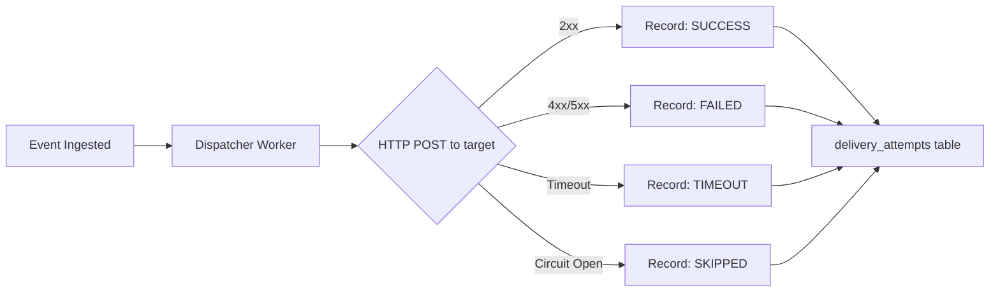
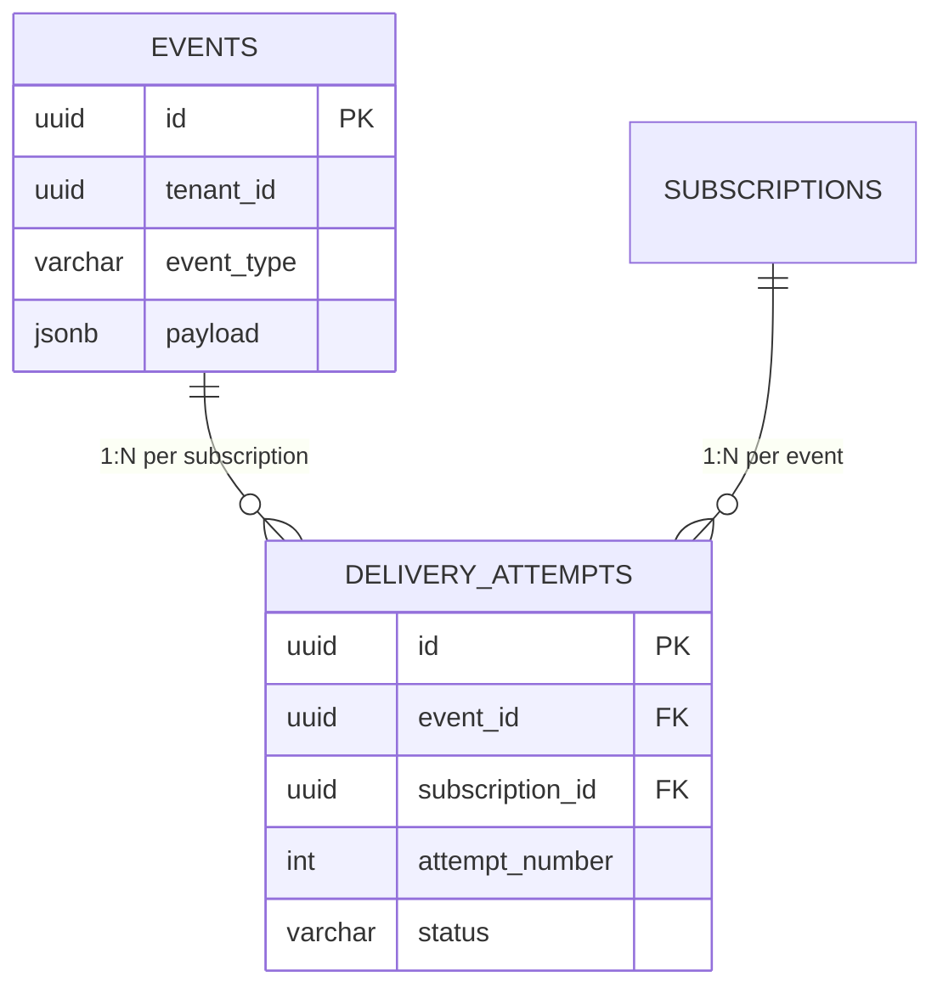

# Delivery Attempts

> Tracking every HTTP webhook delivery attempt for debugging and observability.

## Table of Contents

- [Overview](#overview)
- [Table Schema](#table-schema)
- [JPA Entity](#jpa-entity)
- [Recording Delivery Attempts](#recording-delivery-attempts)
- [Query Patterns for Debugging](#query-patterns-for-debugging)
  - [All Attempts for an Event](#all-attempts-for-an-event)
  - [Failed Deliveries by Subscription](#failed-deliveries-by-subscription)
  - [Slow Deliveries](#slow-deliveries)
  - [Error Analysis](#error-analysis)
  - [Delivery Success Rate](#delivery-success-rate)
  - [Subscription Health Dashboard](#subscription-health-dashboard)
- [Relationship to Events Table](#relationship-to-events-table)
- [Data Volume Estimation](#data-volume-estimation)
- [Indexing Strategy](#indexing-strategy)
- [Partitioning](#partitioning)
- [API Responses](#api-responses)
- [Production Considerations](#production-considerations)

---

## Overview

The `delivery_attempts` table records **every individual HTTP delivery attempt** made by the dispatcher workers. For each event × subscription pair, there may be 1 to 20 rows in this table (1 initial attempt + up to 19 retries).

This table is the **primary debugging tool** for both EventRelay operators and tenants investigating delivery failures. It answers questions like:

- *"Why didn't my webhook fire?"*
- *"What HTTP status code did the target return?"*
- *"How long did the delivery take?"*
- *"When was the last retry?"*



---

## Table Schema

```sql
CREATE TABLE delivery_attempts (
    id                      UUID PRIMARY KEY DEFAULT gen_random_uuid(),
    event_id                UUID NOT NULL,                        -- References events.id (no FK: partitioned table)
    subscription_id         UUID NOT NULL REFERENCES subscriptions(id),
    tenant_id               UUID NOT NULL REFERENCES tenants(id), -- Denormalized for performance
    attempt_number          INTEGER NOT NULL,                     -- 1-based: first attempt = 1
    status                  delivery_status NOT NULL,             -- SUCCESS, FAILED, TIMEOUT, SKIPPED
    http_status_code        INTEGER,                              -- NULL if connection failed before response
    response_body_snippet   TEXT,                                 -- First 1024 chars of response body
    request_headers         JSONB,                                -- Sent headers (signing header value redacted)
    response_headers        JSONB,                                -- Received response headers
    duration_ms             INTEGER NOT NULL,                     -- Total round-trip time in milliseconds
    error_message           TEXT,                                 -- Error details for non-SUCCESS attempts
    target_url              VARCHAR(2048) NOT NULL,               -- Snapshot of subscription URL at delivery time
    created_at              TIMESTAMPTZ NOT NULL DEFAULT now(),   -- When this attempt was made

    CONSTRAINT chk_delivery_attempt_number CHECK (attempt_number > 0 AND attempt_number <= 20),
    CONSTRAINT chk_delivery_duration CHECK (duration_ms >= 0),
    CONSTRAINT chk_delivery_http_status CHECK (
        http_status_code IS NULL OR (http_status_code >= 100 AND http_status_code <= 599)
    )
) PARTITION BY RANGE (created_at);

-- Core indexes (inherited by partitions)
CREATE INDEX idx_delivery_event_id ON delivery_attempts(event_id);
CREATE INDEX idx_delivery_tenant_created ON delivery_attempts(tenant_id, created_at DESC);
CREATE INDEX idx_delivery_subscription ON delivery_attempts(subscription_id, created_at DESC);
CREATE INDEX idx_delivery_status ON delivery_attempts(status, created_at DESC) WHERE status != 'SUCCESS';
```

### Column Details

| Column | Type | Nullable | Purpose |
|---|---|---|---|
| `id` | UUID | No | Unique attempt identifier |
| `event_id` | UUID | No | The event being delivered |
| `subscription_id` | UUID | No | The subscription (target URL) being delivered to |
| `tenant_id` | UUID | No | Denormalized for tenant-scoped queries without JOINs |
| `attempt_number` | INTEGER | No | 1-based attempt counter (1 = initial, 2+ = retries) |
| `status` | ENUM | No | Outcome: SUCCESS, FAILED, TIMEOUT, SKIPPED |
| `http_status_code` | INTEGER | Yes | HTTP response status code; NULL if connection failed |
| `response_body_snippet` | TEXT | Yes | First 1024 chars of response body for debugging |
| `request_headers` | JSONB | Yes | Outgoing headers snapshot (HMAC value redacted) |
| `response_headers` | JSONB | Yes | Response headers received |
| `duration_ms` | INTEGER | No | Round-trip time; 0 if SKIPPED (circuit breaker) |
| `error_message` | TEXT | Yes | Machine-readable error detail |
| `target_url` | VARCHAR | No | URL snapshot at delivery time |
| `created_at` | TIMESTAMPTZ | No | When the attempt was made; partition key |

### Why Snapshot `target_url`?

The subscription's `target_url` can change over time (tenant rotates their endpoint). By snapshotting the URL on each delivery attempt, we preserve an accurate historical record of *where* each attempt was sent — essential for debugging "it was working yesterday" scenarios.

---

## JPA Entity

```java
@Entity
@Table(name = "delivery_attempts")
@Immutable
public class DeliveryAttempt {

    @Id
    @GeneratedValue(strategy = GenerationType.UUID)
    private UUID id;

    @Column(name = "event_id", nullable = false, updatable = false)
    private UUID eventId;

    @Column(name = "subscription_id", nullable = false, updatable = false)
    private UUID subscriptionId;

    @Column(name = "tenant_id", nullable = false, updatable = false)
    private UUID tenantId;

    @Column(name = "attempt_number", nullable = false, updatable = false)
    private int attemptNumber;

    @Enumerated(EnumType.STRING)
    @Column(name = "status", nullable = false, updatable = false)
    private DeliveryStatus status;

    @Column(name = "http_status_code")
    private Integer httpStatusCode;

    @Column(name = "response_body_snippet", columnDefinition = "text")
    private String responseBodySnippet;

    @Column(name = "request_headers", columnDefinition = "jsonb")
    @JdbcTypeCode(SqlTypes.JSON)
    private Map<String, String> requestHeaders;

    @Column(name = "response_headers", columnDefinition = "jsonb")
    @JdbcTypeCode(SqlTypes.JSON)
    private Map<String, String> responseHeaders;

    @Column(name = "duration_ms", nullable = false, updatable = false)
    private int durationMs;

    @Column(name = "error_message", columnDefinition = "text")
    private String errorMessage;

    @Column(name = "target_url", nullable = false, updatable = false, length = 2048)
    private String targetUrl;

    @Column(name = "created_at", nullable = false, updatable = false)
    private Instant createdAt;

    protected DeliveryAttempt() {} // JPA

    @Builder
    public DeliveryAttempt(UUID eventId, UUID subscriptionId, UUID tenantId,
                           int attemptNumber, DeliveryStatus status,
                           Integer httpStatusCode, String responseBodySnippet,
                           Map<String, String> requestHeaders,
                           Map<String, String> responseHeaders,
                           int durationMs, String errorMessage, String targetUrl) {
        this.eventId = eventId;
        this.subscriptionId = subscriptionId;
        this.tenantId = tenantId;
        this.attemptNumber = attemptNumber;
        this.status = status;
        this.httpStatusCode = httpStatusCode;
        this.responseBodySnippet = truncate(responseBodySnippet, 1024);
        this.requestHeaders = requestHeaders;
        this.responseHeaders = responseHeaders;
        this.durationMs = durationMs;
        this.errorMessage = errorMessage;
        this.targetUrl = targetUrl;
        this.createdAt = Instant.now();
    }

    private static String truncate(String s, int maxLength) {
        return (s != null && s.length() > maxLength) ? s.substring(0, maxLength) : s;
    }
}

public enum DeliveryStatus {
    SUCCESS,  // HTTP 2xx response received
    FAILED,   // HTTP 4xx/5xx response or network error
    TIMEOUT,  // Request timed out (>30s default)
    SKIPPED   // Circuit breaker was open; attempt not made
}
```

---

## Recording Delivery Attempts

The dispatcher worker records every attempt, regardless of outcome:

```java
@Component
@Slf4j
public class WebhookDispatcher {

    private final DeliveryAttemptRepository deliveryAttemptRepository;
    private final WebClient webClient;

    public DeliveryResult deliver(DispatchTask task) {
        Instant start = Instant.now();
        DeliveryAttempt.DeliveryAttemptBuilder attemptBuilder = DeliveryAttempt.builder()
            .eventId(task.getEventId())
            .subscriptionId(task.getSubscriptionId())
            .tenantId(task.getTenantId())
            .attemptNumber(task.getAttemptNumber())
            .targetUrl(task.getTargetUrl())
            .requestHeaders(buildRequestHeaders(task));

        try {
            ResponseEntity<String> response = webClient.post()
                .uri(task.getTargetUrl())
                .headers(h -> h.setAll(buildSignedHeaders(task)))
                .bodyValue(task.getPayload())
                .retrieve()
                .toEntity(String.class)
                .block(Duration.ofSeconds(30));

            int durationMs = (int) Duration.between(start, Instant.now()).toMillis();
            boolean success = response.getStatusCode().is2xxSuccessful();

            DeliveryAttempt attempt = attemptBuilder
                .status(success ? DeliveryStatus.SUCCESS : DeliveryStatus.FAILED)
                .httpStatusCode(response.getStatusCode().value())
                .responseBodySnippet(response.getBody())
                .responseHeaders(extractHeaders(response.getHeaders()))
                .durationMs(durationMs)
                .errorMessage(success ? null : "HTTP " + response.getStatusCode().value())
                .build();

            deliveryAttemptRepository.save(attempt);
            return new DeliveryResult(success, attempt);

        } catch (WebClientResponseException e) {
            int durationMs = (int) Duration.between(start, Instant.now()).toMillis();
            DeliveryAttempt attempt = attemptBuilder
                .status(DeliveryStatus.FAILED)
                .httpStatusCode(e.getStatusCode().value())
                .responseBodySnippet(e.getResponseBodyAsString())
                .durationMs(durationMs)
                .errorMessage(e.getMessage())
                .build();
            deliveryAttemptRepository.save(attempt);
            return new DeliveryResult(false, attempt);

        } catch (Exception e) {
            int durationMs = (int) Duration.between(start, Instant.now()).toMillis();
            DeliveryStatus status = (e instanceof TimeoutException)
                ? DeliveryStatus.TIMEOUT : DeliveryStatus.FAILED;
            DeliveryAttempt attempt = attemptBuilder
                .status(status)
                .durationMs(durationMs)
                .errorMessage(e.getClass().getSimpleName() + ": " + e.getMessage())
                .build();
            deliveryAttemptRepository.save(attempt);
            return new DeliveryResult(false, attempt);
        }
    }
}
```

---

## Query Patterns for Debugging

### All Attempts for an Event

*"Show me every delivery attempt for event X"* — the most common debugging query:

```sql
SELECT
    da.attempt_number,
    da.status,
    da.http_status_code,
    da.duration_ms,
    da.error_message,
    da.target_url,
    da.created_at
FROM delivery_attempts da
WHERE da.event_id = :eventId
ORDER BY da.attempt_number ASC;
```

**Example output:**

| attempt_number | status | http_status_code | duration_ms | error_message | created_at |
|---|---|---|---|---|---|
| 1 | FAILED | 503 | 245 | HTTP 503 | 2026-07-10 08:00:00 |
| 2 | FAILED | 503 | 312 | HTTP 503 | 2026-07-10 08:00:05 |
| 3 | TIMEOUT | NULL | 30000 | ReadTimeoutException | 2026-07-10 08:00:35 |
| 4 | SUCCESS | 200 | 189 | NULL | 2026-07-10 08:05:35 |

### Failed Deliveries by Subscription

*"Show recent failures for subscription Y"* — identify problematic endpoints:

```sql
SELECT
    da.event_id,
    da.attempt_number,
    da.http_status_code,
    da.error_message,
    da.duration_ms,
    da.created_at
FROM delivery_attempts da
WHERE da.subscription_id = :subscriptionId
  AND da.status != 'SUCCESS'
  AND da.created_at >= now() - INTERVAL '24 hours'
ORDER BY da.created_at DESC
LIMIT 50;
```

### Slow Deliveries

*"Which deliveries are taking too long?"* — identify slow downstream endpoints:

```sql
SELECT
    da.subscription_id,
    s.target_url,
    avg(da.duration_ms) AS avg_duration_ms,
    max(da.duration_ms) AS max_duration_ms,
    percentile_cont(0.95) WITHIN GROUP (ORDER BY da.duration_ms) AS p95_duration_ms,
    count(*) AS attempt_count
FROM delivery_attempts da
JOIN subscriptions s ON s.id = da.subscription_id
WHERE da.tenant_id = :tenantId
  AND da.created_at >= now() - INTERVAL '1 hour'
  AND da.status = 'SUCCESS'
GROUP BY da.subscription_id, s.target_url
HAVING avg(da.duration_ms) > 5000  -- Endpoints averaging > 5 seconds
ORDER BY avg_duration_ms DESC;
```

### Error Analysis

*"What are the most common error patterns?"*:

```sql
-- Top failure reasons in the last 24 hours
SELECT
    COALESCE(da.http_status_code::text, 'CONNECTION_ERROR') AS error_type,
    count(*) AS occurrences,
    count(DISTINCT da.subscription_id) AS affected_subscriptions,
    count(DISTINCT da.event_id) AS affected_events
FROM delivery_attempts da
WHERE da.tenant_id = :tenantId
  AND da.status != 'SUCCESS'
  AND da.created_at >= now() - INTERVAL '24 hours'
GROUP BY da.http_status_code
ORDER BY occurrences DESC;
```

**Example output:**

| error_type | occurrences | affected_subscriptions | affected_events |
|---|---|---|---|
| 503 | 1,247 | 3 | 412 |
| 502 | 89 | 1 | 67 |
| CONNECTION_ERROR | 34 | 2 | 34 |
| 429 | 12 | 1 | 12 |

### Delivery Success Rate

```sql
-- Success rate per subscription over the last 7 days
SELECT
    da.subscription_id,
    s.target_url,
    count(*) FILTER (WHERE da.status = 'SUCCESS') AS successes,
    count(*) FILTER (WHERE da.status != 'SUCCESS') AS failures,
    round(
        100.0 * count(*) FILTER (WHERE da.status = 'SUCCESS') / count(*), 2
    ) AS success_rate_pct
FROM delivery_attempts da
JOIN subscriptions s ON s.id = da.subscription_id
WHERE da.tenant_id = :tenantId
  AND da.created_at >= now() - INTERVAL '7 days'
GROUP BY da.subscription_id, s.target_url
ORDER BY success_rate_pct ASC;
```

### Subscription Health Dashboard

```sql
-- Real-time subscription health overview
SELECT
    s.id AS subscription_id,
    s.target_url,
    s.status AS sub_status,
    s.failure_count AS consecutive_failures,
    (SELECT count(*) FROM delivery_attempts da
     WHERE da.subscription_id = s.id
       AND da.created_at >= now() - INTERVAL '1 hour'
       AND da.status = 'SUCCESS') AS successes_1h,
    (SELECT count(*) FROM delivery_attempts da
     WHERE da.subscription_id = s.id
       AND da.created_at >= now() - INTERVAL '1 hour'
       AND da.status != 'SUCCESS') AS failures_1h,
    (SELECT avg(da.duration_ms) FROM delivery_attempts da
     WHERE da.subscription_id = s.id
       AND da.created_at >= now() - INTERVAL '1 hour') AS avg_latency_ms_1h
FROM subscriptions s
WHERE s.tenant_id = :tenantId
  AND s.deleted_at IS NULL
ORDER BY s.failure_count DESC;
```

---

## Relationship to Events Table



> [!NOTE]
> The foreign key from `delivery_attempts.event_id` to `events.id` is **not enforced** at the database level because `events` is a partitioned table (PostgreSQL limitation). Referential integrity is maintained by the application — delivery attempts are always created in the context of an event being dispatched.

### Cardinality

For a single event with `N` subscriptions and a maximum of `M` retry attempts:
- **Total rows per event** = `N × M` (worst case)
- **Typical**: 1 subscription × 1 attempt = 1 row
- **Worst case**: 5 subscriptions × 20 attempts = 100 rows per event

---

## Data Volume Estimation

| Scenario | Events/day | Subscriptions/event | Avg Attempts/event | Rows/day | Rows/month |
|---|---|---|---|---|---|
| Small | 10,000 | 1 | 1.2 | 12,000 | 360K |
| Medium | 100,000 | 2 | 1.5 | 300,000 | 9M |
| Large | 1,000,000 | 3 | 1.8 | 5,400,000 | 162M |
| Enterprise | 10,000,000 | 5 | 2.0 | 100,000,000 | 3B |

> [!WARNING]
> At enterprise scale (3B rows/month), aggressive partitioning and retention policies are critical. Partitions older than 30 days should be dropped. See [Partitioning.md](./Partitioning.md) and [Retention.md](./Retention.md).

---

## Indexing Strategy

| Index | Columns | Type | Primary Query |
|---|---|---|---|
| `pk_delivery_attempts` | `id` | B-tree (PK) | Single attempt lookup |
| `idx_delivery_event_id` | `event_id` | B-tree | "Show all attempts for event X" |
| `idx_delivery_tenant_created` | `(tenant_id, created_at DESC)` | B-tree | Tenant dashboard, recent attempts |
| `idx_delivery_subscription` | `(subscription_id, created_at DESC)` | B-tree | Subscription health queries |
| `idx_delivery_status` | `(status, created_at DESC)` | Partial B-tree | Failed delivery investigation |

The partial index on `status` (`WHERE status != 'SUCCESS'`) is critical — most rows are `SUCCESS`, so a full index would be wasteful. The partial index only includes the rows that operators care about when debugging.

---

## Partitioning

The `delivery_attempts` table is partitioned monthly by `created_at`:

```sql
-- Auto-created monthly partitions
CREATE TABLE delivery_attempts_y2026m07
    PARTITION OF delivery_attempts
    FOR VALUES FROM ('2026-07-01') TO ('2026-08-01');

CREATE TABLE delivery_attempts_y2026m08
    PARTITION OF delivery_attempts
    FOR VALUES FROM ('2026-08-01') TO ('2026-09-01');
```

Benefits:
- **Fast cleanup** — `DROP TABLE delivery_attempts_y2026m04` is instant vs. `DELETE` on millions of rows
- **Partition pruning** — queries with `created_at` bounds scan only relevant partitions
- **Parallel maintenance** — VACUUM, ANALYZE run per-partition

See [Partitioning.md](./Partitioning.md) for the complete partitioning strategy.

---

## API Responses

### GET /v1/events/{eventId}/delivery-attempts

```json
{
  "event_id": "evt_8a3b7c9d-e4f5-6789-abcd-ef0123456789",
  "attempts": [
    {
      "id": "att_11111111-2222-3333-4444-555555555555",
      "attempt_number": 1,
      "status": "FAILED",
      "http_status_code": 503,
      "duration_ms": 245,
      "error_message": "HTTP 503 Service Unavailable",
      "target_url": "https://api.example.com/webhooks",
      "created_at": "2026-07-10T08:00:00Z"
    },
    {
      "id": "att_66666666-7777-8888-9999-aaaaaaaaaaaa",
      "attempt_number": 2,
      "status": "SUCCESS",
      "http_status_code": 200,
      "duration_ms": 189,
      "error_message": null,
      "target_url": "https://api.example.com/webhooks",
      "created_at": "2026-07-10T08:00:05Z"
    }
  ],
  "total_attempts": 2,
  "final_status": "DELIVERED"
}
```

> [!TIP]
> Response headers and request headers are omitted from the default API response for brevity. They are available via `?include=headers` query parameter.

---

## Production Considerations

1. **Truncate response bodies** — store only the first 1024 characters to prevent storage explosion from verbose error pages
2. **Redact signing headers** — never store the full HMAC signature value in `request_headers`; replace with `"X-Signature: [REDACTED]"`
3. **Batch inserts** — when a single event fans out to multiple subscriptions, batch the delivery attempt INSERTs
4. **Async writes** — delivery attempt recording should not block the retry decision; write asynchronously if latency is a concern
5. **Retention** — default 30 days; drop old monthly partitions. Operators rarely investigate deliveries older than a week
6. **Monitoring** — alert on delivery success rate dropping below 95% per subscription

---

## Related Documents

- [PostgreSQL_Schema.md](./PostgreSQL_Schema.md) — Full schema DDL
- [Event_Log.md](./Event_Log.md) — The events table (parent entity)
- [Indexing.md](./Indexing.md) — Index strategy for delivery_attempts
- [Partitioning.md](./Partitioning.md) — Monthly partitioning for delivery_attempts
- [Retention.md](./Retention.md) — 30-day retention policy for delivery attempts
