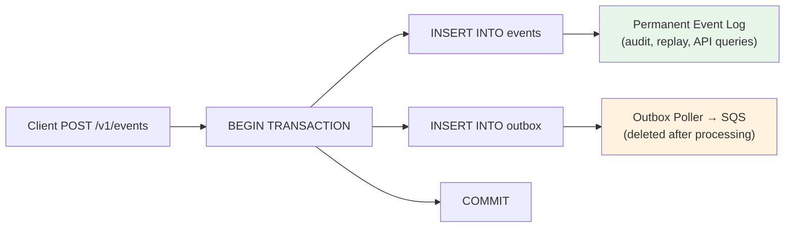

# Event Log

> Permanent, append-only record of every ingested event in EventRelay.

## Table of Contents

- [Overview](#overview)
- [Event Log vs. Outbox — Different Purposes](#event-log-vs-outbox--different-purposes)
- [Table Schema](#table-schema)
- [JPA Entity](#jpa-entity)
- [Query Patterns](#query-patterns)
  - [By Tenant](#by-tenant)
  - [By Event Type](#by-event-type)
  - [By Time Range](#by-time-range)
  - [By Idempotency Key](#by-idempotency-key)
  - [Combined Filters](#combined-filters)
- [Indexing Strategy](#indexing-strategy)
- [Idempotency Enforcement](#idempotency-enforcement)
- [Audit Trail](#audit-trail)
- [Event Replay](#event-replay)
- [Retention Policy](#retention-policy)
- [Performance Characteristics](#performance-characteristics)
- [Production Considerations](#production-considerations)

---

## Overview

The **event log** is the canonical, append-only record of every event ingested into EventRelay. It serves three critical functions:

1. **Source of truth** — the authoritative record of what happened and when
2. **Audit trail** — compliance-grade record for debugging, forensics, and regulatory requirements
3. **Replay source** — enables re-delivery of events when a subscription is misconfigured or a downstream system needs reprocessing

The event log is **separate from the outbox**. The outbox is a transient dispatch queue; the event log is a permanent historical record.

---

## Event Log vs. Outbox — Different Purposes

| Aspect | Event Log (`events`) | Outbox (`outbox`) |
|---|---|---|
| **Purpose** | Permanent historical record | Transient dispatch queue |
| **Lifetime** | Retained for 90 days (configurable) | Deleted within 1 hour of processing |
| **Mutability** | Append-only, never updated | Status updated during processing |
| **Query patterns** | By tenant, type, time range | By status (PENDING only) |
| **Primary consumer** | API (list events), audit, replay | Outbox poller |
| **Primary key** | UUID (content-addressed) | BIGSERIAL (ordered) |
| **Partitioned** | ✅ Yes (monthly by created_at) | ❌ No (small, transient) |
| **Contains** | Canonical event data | SQS message payload (may differ) |



---

## Table Schema

```sql
CREATE TABLE events (
    id              UUID PRIMARY KEY DEFAULT gen_random_uuid(),
    tenant_id       UUID NOT NULL REFERENCES tenants(id),
    event_type      VARCHAR(255) NOT NULL,                    -- Dot-notation: "order.completed", "user.created"
    idempotency_key VARCHAR(255),                             -- Client-provided dedup key (unique per tenant)
    payload         JSONB NOT NULL,                           -- Event payload (max ~1MB enforced at API layer)
    metadata        JSONB NOT NULL DEFAULT '{}'::jsonb,       -- System-generated metadata
    created_at      TIMESTAMPTZ NOT NULL DEFAULT now(),

    CONSTRAINT uq_events_idempotency UNIQUE (tenant_id, idempotency_key)
) PARTITION BY RANGE (created_at);

COMMENT ON TABLE events IS 'Append-only event log. Partitioned monthly by created_at.';
```

### Column Details

| Column | Type | Purpose |
|---|---|---|
| `id` | UUID | Globally unique event identifier; returned to client on ingest |
| `tenant_id` | UUID | Tenant ownership; every query filters by this |
| `event_type` | VARCHAR(255) | Dot-notation event type for routing and filtering |
| `idempotency_key` | VARCHAR(255) | Client-provided key for deduplication; nullable |
| `payload` | JSONB | The actual event data; schema-free, validated at API layer |
| `metadata` | JSONB | System metadata: source IP, SDK version, trace ID, ingested_at |
| `created_at` | TIMESTAMPTZ | Immutable creation timestamp; partition key |

### Metadata Schema

The `metadata` JSONB column stores system-generated context:

```json
{
  "source_ip": "203.0.113.42",
  "sdk_version": "eventrelay-java-1.2.0",
  "trace_id": "tr-8a3b7c9d-e4f5-6789-abcd-ef0123456789",
  "user_agent": "EventRelay-SDK/1.2.0 Java/17",
  "ingested_via": "rest_api",
  "content_length": 2048
}
```

---

## JPA Entity

```java
@Entity
@Table(name = "events")
@Immutable // Hibernate: prevent accidental updates
public class Event {

    @Id
    @GeneratedValue(strategy = GenerationType.UUID)
    private UUID id;

    @Column(name = "tenant_id", nullable = false, updatable = false)
    private UUID tenantId;

    @Column(name = "event_type", nullable = false, updatable = false, length = 255)
    private String eventType;

    @Column(name = "idempotency_key", updatable = false, length = 255)
    private String idempotencyKey;

    @Column(name = "payload", nullable = false, updatable = false, columnDefinition = "jsonb")
    @JdbcTypeCode(SqlTypes.JSON)
    private Map<String, Object> payload;

    @Column(name = "metadata", nullable = false, updatable = false, columnDefinition = "jsonb")
    @JdbcTypeCode(SqlTypes.JSON)
    private Map<String, Object> metadata;

    @Column(name = "created_at", nullable = false, updatable = false)
    private Instant createdAt;

    protected Event() {} // JPA

    @Builder
    public Event(UUID tenantId, String eventType, String idempotencyKey,
                 Map<String, Object> payload, Map<String, Object> metadata) {
        this.tenantId = tenantId;
        this.eventType = eventType;
        this.idempotencyKey = idempotencyKey;
        this.payload = payload;
        this.metadata = metadata != null ? metadata : Map.of();
        this.createdAt = Instant.now();
    }
}
```

> [!NOTE]
> The `@Immutable` annotation prevents Hibernate from generating UPDATE statements against the events table. Events are append-only by design.

---

## Query Patterns

### By Tenant

The most common query — list recent events for a tenant (dashboard, API):

```sql
-- List recent events for a tenant, paginated
SELECT id, event_type, payload, metadata, created_at
FROM events
WHERE tenant_id = :tenantId
ORDER BY created_at DESC
LIMIT :pageSize
OFFSET :offset;

-- Cursor-based pagination (preferred for large datasets)
SELECT id, event_type, payload, metadata, created_at
FROM events
WHERE tenant_id = :tenantId
  AND created_at < :cursor
ORDER BY created_at DESC
LIMIT :pageSize;
```

**Index used:** `idx_events_tenant_created (tenant_id, created_at DESC)`

### By Event Type

Filter events by type within a tenant:

```sql
SELECT id, event_type, payload, created_at
FROM events
WHERE tenant_id = :tenantId
  AND event_type = :eventType
ORDER BY created_at DESC
LIMIT 50;
```

**Index used:** `idx_events_tenant_type (tenant_id, event_type)`

### By Time Range

Bounded time-range query (leverages partition pruning):

```sql
-- Events in the last 24 hours
SELECT id, event_type, payload, created_at
FROM events
WHERE tenant_id = :tenantId
  AND created_at >= now() - INTERVAL '24 hours'
  AND created_at < now()
ORDER BY created_at DESC;
```

> [!TIP]
> Always include `created_at` bounds in queries against the events table. This enables **partition pruning**, which eliminates scanning irrelevant monthly partitions.

### By Idempotency Key

Look up a specific event by its deduplication key:

```sql
SELECT id, event_type, payload, created_at
FROM events
WHERE tenant_id = :tenantId
  AND idempotency_key = :idempotencyKey;
```

**Index used:** `idx_events_idempotency (tenant_id, idempotency_key) WHERE idempotency_key IS NOT NULL`

### Combined Filters

```sql
-- Events of a specific type in a time range
SELECT id, event_type, payload, metadata, created_at
FROM events
WHERE tenant_id = :tenantId
  AND event_type = :eventType
  AND created_at BETWEEN :startTime AND :endTime
ORDER BY created_at DESC
LIMIT 100;
```

### Spring Data JPA Repository

```java
public interface EventRepository extends JpaRepository<Event, UUID> {

    @Query("""
        SELECT e FROM Event e
        WHERE e.tenantId = :tenantId
        ORDER BY e.createdAt DESC
        """)
    Page<Event> findByTenantId(@Param("tenantId") UUID tenantId, Pageable pageable);

    @Query("""
        SELECT e FROM Event e
        WHERE e.tenantId = :tenantId AND e.eventType = :eventType
        ORDER BY e.createdAt DESC
        """)
    Page<Event> findByTenantIdAndEventType(
        @Param("tenantId") UUID tenantId,
        @Param("eventType") String eventType,
        Pageable pageable
    );

    @Query("""
        SELECT e FROM Event e
        WHERE e.tenantId = :tenantId
          AND e.createdAt BETWEEN :start AND :end
        ORDER BY e.createdAt DESC
        """)
    List<Event> findByTenantIdAndTimeRange(
        @Param("tenantId") UUID tenantId,
        @Param("start") Instant start,
        @Param("end") Instant end
    );

    Optional<Event> findByTenantIdAndIdempotencyKey(UUID tenantId, String idempotencyKey);
}
```

---

## Indexing Strategy

| Index | Columns | Type | Purpose |
|---|---|---|---|
| `pk_events` | `id` | B-tree (PK) | Primary key lookup |
| `idx_events_tenant_created` | `(tenant_id, created_at DESC)` | B-tree | Tenant dashboard, pagination |
| `idx_events_tenant_type` | `(tenant_id, event_type)` | B-tree | Event type filtering |
| `idx_events_idempotency` | `(tenant_id, idempotency_key)` | Partial B-tree | Dedup check (WHERE idempotency_key IS NOT NULL) |

> [!IMPORTANT]
> Indexes are defined on the parent partitioned table and automatically inherited by child partitions. Each partition has its own physical index.

See [Indexing.md](./Indexing.md) for the full indexing strategy including `EXPLAIN ANALYZE` examples.

---

## Idempotency Enforcement

EventRelay supports client-provided idempotency keys to prevent duplicate event ingestion:

```java
@Service
@Transactional
public class EventIngestionService {

    public Event ingestEvent(UUID tenantId, IngestEventRequest request) {
        // Check for existing event with same idempotency key
        if (request.getIdempotencyKey() != null) {
            Optional<Event> existing = eventRepository
                .findByTenantIdAndIdempotencyKey(tenantId, request.getIdempotencyKey());

            if (existing.isPresent()) {
                log.info("Idempotent event detected: tenant={}, key={}",
                    tenantId, request.getIdempotencyKey());
                return existing.get(); // Return existing event (200 OK)
            }
        }

        // Proceed with ingestion (event + outbox in same transaction)
        Event event = createEvent(tenantId, request);
        createOutboxEntry(event);
        return event;
    }
}
```

**Two layers of protection:**

1. **Application layer** — check-then-insert with the repository query
2. **Database layer** — `UNIQUE (tenant_id, idempotency_key)` constraint catches race conditions

```sql
-- If two concurrent requests arrive with the same idempotency_key,
-- the second INSERT will fail with:
-- ERROR: duplicate key value violates unique constraint "uq_events_idempotency"
-- The application catches this and returns the existing event.
```

---

## Audit Trail

The event log serves as a compliance-grade audit trail:

### What Gets Logged

| Data Point | Source | Stored In |
|---|---|---|
| Event payload | Client request body | `payload` |
| Event type | Client request | `event_type` |
| Source IP address | HTTP request | `metadata.source_ip` |
| API key used | Authentication | `metadata.api_key_prefix` |
| SDK version | User-Agent header | `metadata.sdk_version` |
| Trace ID | X-Trace-Id header or auto-generated | `metadata.trace_id` |
| Timestamp | Server clock (UTC) | `created_at` |

### Audit Query Examples

```sql
-- All events from a specific IP in the last 24 hours
SELECT id, event_type, created_at, metadata->>'source_ip' AS source_ip
FROM events
WHERE tenant_id = :tenantId
  AND metadata->>'source_ip' = '203.0.113.42'
  AND created_at >= now() - INTERVAL '24 hours'
ORDER BY created_at DESC;

-- Event count by type per day (analytics)
SELECT
    event_type,
    date_trunc('day', created_at) AS day,
    count(*) AS event_count
FROM events
WHERE tenant_id = :tenantId
  AND created_at >= now() - INTERVAL '30 days'
GROUP BY event_type, date_trunc('day', created_at)
ORDER BY day DESC, event_count DESC;
```

---

## Event Replay

Events can be replayed (re-delivered) from the event log. Common scenarios:

1. **New subscription** — a tenant creates a new subscription and wants historical events delivered
2. **Bug fix** — a downstream system had a bug and needs events reprocessed
3. **DLQ replay** — replaying a dead-lettered event

### Replay Implementation

```java
@Service
@Transactional
public class EventReplayService {

    private final EventRepository eventRepository;
    private final OutboxRepository outboxRepository;

    /**
     * Replay events matching the given criteria by re-inserting them into the outbox.
     */
    public int replayEvents(UUID tenantId, ReplayRequest request) {
        List<Event> events = eventRepository.findByTenantIdAndTimeRange(
            tenantId,
            request.getFrom(),
            request.getTo()
        );

        // Filter by event type if specified
        if (request.getEventType() != null) {
            events = events.stream()
                .filter(e -> e.getEventType().equals(request.getEventType()))
                .toList();
        }

        // Cap replay batch size
        if (events.size() > 10_000) {
            throw new ReplayBatchTooLargeException(
                "Replay batch limited to 10,000 events. Narrow the time range.");
        }

        // Re-insert into outbox for re-delivery
        for (Event event : events) {
            OutboxEntry replayEntry = OutboxEntry.builder()
                .aggregateType("EventReplay")
                .aggregateId(event.getId())
                .eventType(event.getEventType())
                .payload(buildReplayPayload(event, request.getSubscriptionId()))
                .build();
            outboxRepository.save(replayEntry);
        }

        log.info("Replayed {} events for tenant={}", events.size(), tenantId);
        return events.size();
    }
}
```

---

## Retention Policy

| Tier | Default Retention | Configurable? |
|---|---|---|
| Free | 30 days | ❌ No |
| Starter | 60 days | ❌ No |
| Business | 90 days | ✅ Yes (up to 180 days) |
| Enterprise | 365 days | ✅ Yes (up to unlimited) |

Events beyond the retention period are archived to S3 (optional) and then deleted by dropping entire partitions. See [Retention.md](./Retention.md) for the complete retention strategy.

```sql
-- Retention check: find partitions older than retention period
SELECT schemaname, tablename, pg_size_pretty(pg_total_relation_size(schemaname || '.' || tablename))
FROM pg_tables
WHERE tablename LIKE 'events_y%'
ORDER BY tablename;
```

---

## Performance Characteristics

### Write Performance

| Metric | Value |
|---|---|
| Single event INSERT latency | < 2ms (with indexes) |
| Batch INSERT (100 events) | < 20ms |
| Idempotency check (cache hit) | < 1ms (Redis) |
| Idempotency check (cache miss) | < 3ms (index scan) |

### Read Performance

| Query Pattern | Expected Latency | Partition Pruning |
|---|---|---|
| Recent events by tenant (LIMIT 50) | < 5ms | ✅ Yes |
| Events by type + tenant | < 10ms | Depends on time bounds |
| Events by time range (single month) | < 15ms | ✅ Yes (single partition) |
| Events by time range (3 months) | < 50ms | ✅ Yes (3 partitions) |
| Idempotency key lookup | < 3ms | ❌ No (unique index) |

---

## Production Considerations

1. **Always include `created_at` bounds** in queries to trigger partition pruning
2. **Use cursor-based pagination** (not OFFSET) for the public API — OFFSET degrades linearly
3. **Payload size limit** — enforce 1MB max at the API layer; PostgreSQL JSONB can handle larger, but SQS has a 256KB message limit
4. **JSONB vs JSON** — use JSONB (binary) for indexable, compressed storage; JSON (text) only if you need to preserve formatting
5. **Monitor partition count** — too many partitions (>100) can slow query planning. Drop old partitions per retention policy

---

## Related Documents

- [PostgreSQL_Schema.md](./PostgreSQL_Schema.md) — Full schema DDL
- [Outbox_Table.md](./Outbox_Table.md) — Outbox pattern (distinct from event log)
- [Indexing.md](./Indexing.md) — Index strategy including events table
- [Partitioning.md](./Partitioning.md) — Monthly partitioning for events
- [Retention.md](./Retention.md) — Event log retention and cleanup
