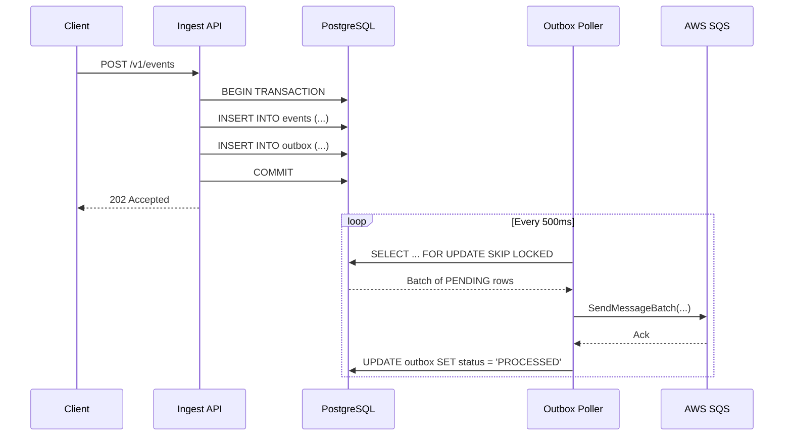
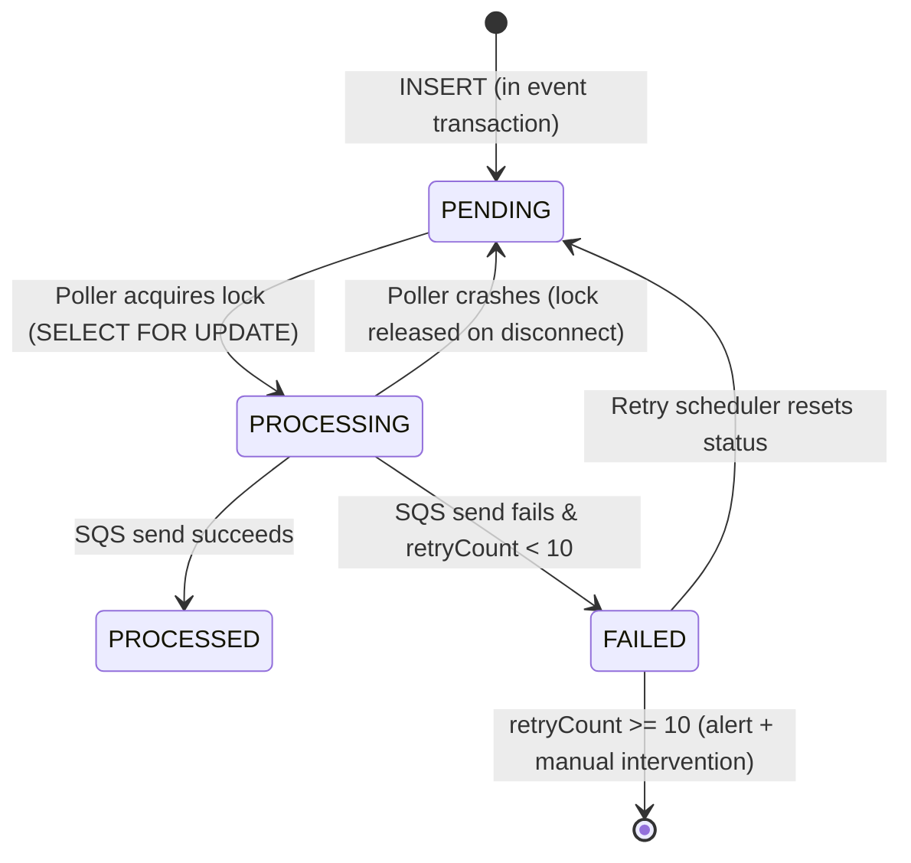

# Outbox Table — Deep Dive

> Transactional outbox pattern implementation for reliable event dispatch in EventRelay.

## Table of Contents

- [Overview](#overview)
- [Why the Outbox Pattern?](#why-the-outbox-pattern)
- [Table Schema](#table-schema)
- [State Machine](#state-machine)
- [Outbox Poller](#outbox-poller)
  - [Polling Query (SELECT FOR UPDATE SKIP LOCKED)](#polling-query)
  - [Batch Processing](#batch-processing)
  - [Poller Java Implementation](#poller-java-implementation)
- [Outbox Writer](#outbox-writer)
- [Cleanup Strategy](#cleanup-strategy)
  - [Immediate Deletion](#immediate-deletion)
  - [Archive Before Delete](#archive-before-delete)
- [Table Growth Management](#table-growth-management)
- [Performance Analysis](#performance-analysis)
- [Failure Modes](#failure-modes)
- [Production Considerations](#production-considerations)

---

## Overview

The **transactional outbox pattern** solves the dual-write problem: ensuring that an event is both persisted to the database and dispatched to the message queue (AWS SQS) atomically. Without the outbox, a crash between the database write and the SQS send could lose the event silently.

**Flow:**



---

## Why the Outbox Pattern?

| Approach | Atomicity | Reliability | Complexity |
|---|---|---|---|
| Direct SQS publish after DB commit | ❌ Event lost if app crashes after commit | ❌ Poor | Low |
| SQS publish before DB commit | ❌ Phantom events if DB commit fails | ❌ Poor | Low |
| **Transactional Outbox** | ✅ Both in same DB transaction | ✅ Guaranteed delivery | Medium |
| CDC (Change Data Capture) | ✅ DB log-based | ✅ Guaranteed delivery | High (Debezium) |

The outbox pattern provides **guaranteed delivery** with **manageable complexity**. CDC (Debezium) is a valid alternative for very high throughput, but introduces operational complexity (Kafka Connect, connectors, schema registry).

> [!NOTE]
> EventRelay uses the polling-based outbox pattern rather than CDC. This decision trades ~500ms additional latency for significantly simpler infrastructure and operations.

---

## Table Schema

```sql
CREATE TABLE outbox (
    id              BIGSERIAL PRIMARY KEY,
    aggregate_type  VARCHAR(100) NOT NULL DEFAULT 'Event',
    aggregate_id    UUID NOT NULL,                            -- events.id
    event_type      VARCHAR(255) NOT NULL,
    payload         JSONB NOT NULL,
    status          outbox_status NOT NULL DEFAULT 'PENDING',
    retry_count     INTEGER NOT NULL DEFAULT 0,
    created_at      TIMESTAMPTZ NOT NULL DEFAULT now(),
    processed_at    TIMESTAMPTZ,

    CONSTRAINT chk_outbox_retry CHECK (retry_count <= 10)
);

-- Primary polling index: only PENDING rows, ordered by creation
CREATE INDEX idx_outbox_pending ON outbox(created_at ASC)
    WHERE status = 'PENDING';

-- Cleanup index: find processed rows for deletion
CREATE INDEX idx_outbox_processed ON outbox(processed_at)
    WHERE status = 'PROCESSED';
```

### Column Rationale

| Column | Why It Exists |
|---|---|
| `id` (BIGSERIAL) | Sequential ordering guarantees FIFO processing; UUID would not provide ordering |
| `aggregate_type` | Supports future entity types beyond events (e.g., `Notification`, `AuditLog`) |
| `aggregate_id` | Links back to `events.id` for traceability |
| `event_type` | Duplicated from events to enable SQS routing without JOINing events |
| `payload` | Full SQS message body; self-contained so the poller needs zero JOINs |
| `status` | State machine: PENDING → PROCESSING → PROCESSED/FAILED |
| `retry_count` | Tracks dispatch retries to SQS (not webhook retries); capped at 10 |
| `processed_at` | Timestamp for cleanup job to identify old processed rows |

### JPA Entity

```java
@Entity
@Table(name = "outbox")
public class OutboxEntry {

    @Id
    @GeneratedValue(strategy = GenerationType.IDENTITY)
    private Long id;

    @Column(name = "aggregate_type", nullable = false, length = 100)
    private String aggregateType = "Event";

    @Column(name = "aggregate_id", nullable = false)
    private UUID aggregateId;

    @Column(name = "event_type", nullable = false)
    private String eventType;

    @Column(name = "payload", nullable = false, columnDefinition = "jsonb")
    @JdbcTypeCode(SqlTypes.JSON)
    private Map<String, Object> payload;

    @Enumerated(EnumType.STRING)
    @Column(name = "status", nullable = false)
    private OutboxStatus status = OutboxStatus.PENDING;

    @Column(name = "retry_count", nullable = false)
    private int retryCount = 0;

    @Column(name = "created_at", nullable = false, updatable = false)
    private Instant createdAt = Instant.now();

    @Column(name = "processed_at")
    private Instant processedAt;

    // Constructors, getters, setters...

    public void markProcessed() {
        this.status = OutboxStatus.PROCESSED;
        this.processedAt = Instant.now();
    }

    public void markFailed() {
        this.status = OutboxStatus.FAILED;
        this.retryCount++;
    }

    public boolean canRetry() {
        return this.retryCount < 10;
    }
}

public enum OutboxStatus {
    PENDING, PROCESSING, PROCESSED, FAILED
}
```

---

## State Machine



> [!IMPORTANT]
> If a poller instance crashes while holding a lock, PostgreSQL automatically releases the `FOR UPDATE` lock when the connection is closed. The row returns to `PENDING` state with no data loss.

---

## Outbox Poller

### Polling Query

The core query uses `SELECT ... FOR UPDATE SKIP LOCKED` to allow multiple poller instances to process the outbox concurrently without contention:

```sql
-- Acquire a batch of PENDING outbox entries
-- FOR UPDATE: locks selected rows to prevent other pollers from grabbing them
-- SKIP LOCKED: if a row is already locked by another poller, skip it (no waiting)
SELECT id, aggregate_type, aggregate_id, event_type, payload, created_at
FROM outbox
WHERE status = 'PENDING'
ORDER BY created_at ASC, id ASC
LIMIT :batchSize
FOR UPDATE SKIP LOCKED;
```

**Why `SKIP LOCKED`?**

Without `SKIP LOCKED`, concurrent pollers would block on locked rows, serializing processing. With `SKIP LOCKED`, each poller grabs a non-overlapping batch, enabling horizontal scaling.

**Why order by `created_at, id`?**

- `created_at` provides chronological ordering
- `id` (BIGSERIAL) breaks ties within the same timestamp
- Together they guarantee FIFO processing

### Batch Processing

```sql
-- After successfully sending a batch to SQS, mark them as processed
UPDATE outbox
SET status = 'PROCESSED',
    processed_at = now()
WHERE id = ANY(:processedIds);

-- For failed entries, increment retry count
UPDATE outbox
SET status = CASE
        WHEN retry_count < 9 THEN 'PENDING'::outbox_status
        ELSE 'FAILED'::outbox_status
    END,
    retry_count = retry_count + 1
WHERE id = ANY(:failedIds);
```

### Poller Java Implementation

```java
@Component
@Slf4j
public class OutboxPoller {

    private static final int BATCH_SIZE = 100;
    private static final Duration POLL_INTERVAL = Duration.ofMillis(500);

    private final JdbcTemplate jdbcTemplate;
    private final SqsClient sqsClient;
    private final MeterRegistry meterRegistry;
    private final String queueUrl;

    @Scheduled(fixedDelay = 500) // 500ms between poll completions
    @Transactional
    public void poll() {
        Timer.Sample sample = Timer.start(meterRegistry);

        List<OutboxEntry> batch = acquireBatch(BATCH_SIZE);
        if (batch.isEmpty()) {
            return;
        }

        log.debug("Acquired {} outbox entries for processing", batch.size());
        meterRegistry.counter("outbox.poll.batch_size").increment(batch.size());

        // Partition into SQS batches of 10 (SQS limit)
        List<List<OutboxEntry>> sqsBatches = Lists.partition(batch, 10);

        List<Long> processedIds = new ArrayList<>();
        List<Long> failedIds = new ArrayList<>();

        for (List<OutboxEntry> sqsBatch : sqsBatches) {
            try {
                SendMessageBatchResponse response = sqsClient.sendMessageBatch(
                    SendMessageBatchRequest.builder()
                        .queueUrl(queueUrl)
                        .entries(sqsBatch.stream()
                            .map(this::toSqsEntry)
                            .toList())
                        .build()
                );

                response.successful().forEach(s ->
                    processedIds.add(Long.parseLong(s.id())));
                response.failed().forEach(f -> {
                    failedIds.add(Long.parseLong(f.id()));
                    log.error("SQS send failed for outbox id={}: {}", f.id(), f.message());
                });
            } catch (SqsException e) {
                log.error("SQS batch send failed", e);
                sqsBatch.forEach(entry -> failedIds.add(entry.getId()));
            }
        }

        markProcessed(processedIds);
        markFailed(failedIds);

        sample.stop(meterRegistry.timer("outbox.poll.duration"));
        meterRegistry.counter("outbox.processed.total").increment(processedIds.size());
        meterRegistry.counter("outbox.failed.total").increment(failedIds.size());
    }

    private List<OutboxEntry> acquireBatch(int batchSize) {
        return jdbcTemplate.query("""
            SELECT id, aggregate_type, aggregate_id, event_type, payload, created_at
            FROM outbox
            WHERE status = 'PENDING'
            ORDER BY created_at ASC, id ASC
            LIMIT ?
            FOR UPDATE SKIP LOCKED
            """,
            new OutboxEntryRowMapper(),
            batchSize
        );
    }

    private SendMessageBatchRequestEntry toSqsEntry(OutboxEntry entry) {
        return SendMessageBatchRequestEntry.builder()
            .id(String.valueOf(entry.getId()))
            .messageBody(entry.getPayload().toString())
            .messageGroupId(entry.getAggregateId().toString())
            .messageDeduplicationId(entry.getId() + "-" + entry.getRetryCount())
            .build();
    }

    private void markProcessed(List<Long> ids) {
        if (!ids.isEmpty()) {
            jdbcTemplate.update(
                "UPDATE outbox SET status = 'PROCESSED', processed_at = now() WHERE id = ANY(?)",
                ids.toArray(new Long[0])
            );
        }
    }

    private void markFailed(List<Long> ids) {
        if (!ids.isEmpty()) {
            jdbcTemplate.update("""
                UPDATE outbox SET
                    status = CASE WHEN retry_count < 9 THEN 'PENDING'::outbox_status ELSE 'FAILED'::outbox_status END,
                    retry_count = retry_count + 1
                WHERE id = ANY(?)
                """,
                ids.toArray(new Long[0])
            );
        }
    }
}
```

---

## Outbox Writer

The outbox entry is inserted in the **same transaction** as the event:

```java
@Service
@Transactional
public class EventIngestionService {

    private final EventRepository eventRepository;
    private final OutboxRepository outboxRepository;

    public Event ingestEvent(UUID tenantId, IngestEventRequest request) {
        // 1. Persist the canonical event
        Event event = Event.builder()
            .tenantId(tenantId)
            .eventType(request.getEventType())
            .idempotencyKey(request.getIdempotencyKey())
            .payload(request.getPayload())
            .metadata(buildMetadata())
            .build();
        eventRepository.save(event);

        // 2. Write outbox entry in the SAME transaction
        OutboxEntry outboxEntry = OutboxEntry.builder()
            .aggregateType("Event")
            .aggregateId(event.getId())
            .eventType(event.getEventType())
            .payload(buildSqsPayload(event))
            .build();
        outboxRepository.save(outboxEntry);

        // Transaction commits atomically — both or neither are persisted
        return event;
    }

    private Map<String, Object> buildSqsPayload(Event event) {
        return Map.of(
            "eventId", event.getId(),
            "tenantId", event.getTenantId(),
            "eventType", event.getEventType(),
            "payload", event.getPayload(),
            "createdAt", event.getCreatedAt().toString()
        );
    }
}
```

---

## Cleanup Strategy

The outbox table is a **transient queue**, not a long-term store. Processed rows must be cleaned up aggressively to prevent table bloat.

### Immediate Deletion

Delete processed rows older than 1 hour (safety buffer for debugging):

```sql
-- Cleanup job: runs every 5 minutes
DELETE FROM outbox
WHERE status = 'PROCESSED'
  AND processed_at < now() - INTERVAL '1 hour'
LIMIT 10000;  -- Batch to avoid long-running transactions
```

> [!WARNING]
> Use `LIMIT` to cap the number of rows deleted per run. Deleting millions of rows in a single transaction will lock the table and spike WAL generation.

### Archive Before Delete

For audit requirements, archive to a separate table before deletion:

```sql
-- Archive processed entries
INSERT INTO outbox_archive (id, aggregate_type, aggregate_id, event_type, created_at, processed_at)
SELECT id, aggregate_type, aggregate_id, event_type, created_at, processed_at
FROM outbox
WHERE status = 'PROCESSED'
  AND processed_at < now() - INTERVAL '1 hour';

-- Then delete
DELETE FROM outbox
WHERE status = 'PROCESSED'
  AND processed_at < now() - INTERVAL '1 hour';
```

### Cleanup Job (Spring Scheduled)

```java
@Component
@Slf4j
public class OutboxCleanupJob {

    private static final int BATCH_SIZE = 10_000;
    private static final Duration RETENTION = Duration.ofHours(1);

    private final JdbcTemplate jdbcTemplate;
    private final MeterRegistry meterRegistry;

    @Scheduled(fixedRate = 300_000) // Every 5 minutes
    public void cleanup() {
        int totalDeleted = 0;
        int deleted;

        do {
            deleted = jdbcTemplate.update("""
                DELETE FROM outbox
                WHERE id IN (
                    SELECT id FROM outbox
                    WHERE status = 'PROCESSED'
                      AND processed_at < now() - INTERVAL '1 hour'
                    LIMIT ?
                )
                """, BATCH_SIZE);
            totalDeleted += deleted;
        } while (deleted == BATCH_SIZE);

        if (totalDeleted > 0) {
            log.info("Outbox cleanup: deleted {} processed entries", totalDeleted);
            meterRegistry.counter("outbox.cleanup.deleted").increment(totalDeleted);
        }
    }
}
```

---

## Table Growth Management

### Monitoring

```sql
-- Check outbox table size and row count
SELECT
    pg_size_pretty(pg_total_relation_size('outbox')) AS total_size,
    pg_size_pretty(pg_relation_size('outbox')) AS table_size,
    pg_size_pretty(pg_indexes_size('outbox')) AS index_size,
    (SELECT count(*) FROM outbox WHERE status = 'PENDING') AS pending_count,
    (SELECT count(*) FROM outbox WHERE status = 'PROCESSED') AS processed_count,
    (SELECT count(*) FROM outbox WHERE status = 'FAILED') AS failed_count;
```

### Alerting Thresholds

| Metric | Warning | Critical |
|---|---|---|
| Pending rows | > 1,000 | > 10,000 |
| Table size | > 100 MB | > 500 MB |
| Oldest pending row age | > 5 minutes | > 15 minutes |
| Failed rows | > 10 | > 100 |

### VACUUM Strategy

```sql
-- The outbox table has high churn (INSERT + DELETE), so aggressive autovacuum is critical
ALTER TABLE outbox SET (
    autovacuum_vacuum_threshold = 100,
    autovacuum_vacuum_scale_factor = 0.01,    -- Vacuum when 1% of rows are dead (default 20%)
    autovacuum_analyze_threshold = 50,
    autovacuum_analyze_scale_factor = 0.005
);
```

---

## Performance Analysis

### Polling Query Benchmark

```sql
EXPLAIN (ANALYZE, BUFFERS, FORMAT TEXT)
SELECT id, aggregate_type, aggregate_id, event_type, payload, created_at
FROM outbox
WHERE status = 'PENDING'
ORDER BY created_at ASC, id ASC
LIMIT 100
FOR UPDATE SKIP LOCKED;
```

**Expected plan with idx_outbox_pending:**

```
Limit  (cost=0.42..12.56 rows=100 width=523) (actual time=0.031..0.187 rows=100 loops=1)
  ->  LockRows  (cost=0.42..1245.67 rows=10234 width=523) (actual time=0.029..0.178 rows=100 loops=1)
        ->  Index Scan using idx_outbox_pending on outbox  (cost=0.42..1143.33 rows=10234 width=523)
              Index Cond: (status = 'PENDING'::outbox_status)
              Buffers: shared hit=15
Planning Time: 0.089 ms
Execution Time: 0.214 ms
```

### Throughput Estimates

| Scenario | Events/sec | Outbox Write Latency | Poll Cycle Time | End-to-End Latency |
|---|---|---|---|---|
| Low (startup) | 10 | < 1ms | ~500ms | ~500ms |
| Medium (growth) | 500 | < 2ms | ~500ms | ~600ms |
| High (enterprise) | 5,000 | < 5ms | ~500ms | ~800ms |
| Peak (burst) | 10,000 | ~10ms | ~500ms | ~1.2s |

> [!TIP]
> At sustained rates above 5,000 events/sec, consider switching from polling to CDC (Debezium) for lower latency, or run multiple poller instances (each grabs non-overlapping batches via `SKIP LOCKED`).

---

## Failure Modes

| Failure | Impact | Recovery |
|---|---|---|
| Poller crashes mid-batch | Locked rows released on disconnect; re-polled next cycle | Automatic |
| SQS unavailable | Outbox rows remain PENDING; retry on next poll cycle | Automatic |
| Database full | INSERTs fail; API returns 503 | Alert on disk usage; increase storage |
| Runaway retry loop | Row stays FAILED after 10 retries | Alert; manual investigation |
| Cleanup job fails | Table grows; eventually slows polling | Monitor table size; fix cleanup |

---

## Production Considerations

1. **Run multiple poller instances** (2-3 per ECS cluster) for high availability. `SKIP LOCKED` ensures no double-processing.
2. **Set `statement_timeout`** on the poller connection to 5 seconds to prevent long-running lock acquisitions.
3. **Monitor the pending row age** — if the oldest pending row is > 5 minutes old, the poller is falling behind.
4. **Use SQS FIFO queues** with `messageGroupId = aggregate_id` to preserve per-event ordering.
5. **Never modify processed outbox rows** — they should only be deleted by the cleanup job.

---

## Related Documents

- [PostgreSQL_Schema.md](./PostgreSQL_Schema.md) — Full schema DDL
- [Event_Log.md](./Event_Log.md) — Canonical event log (different from outbox)
- [Indexing.md](./Indexing.md) — Index strategy for the outbox table
- [Retention.md](./Retention.md) — Outbox cleanup as part of overall retention policy
