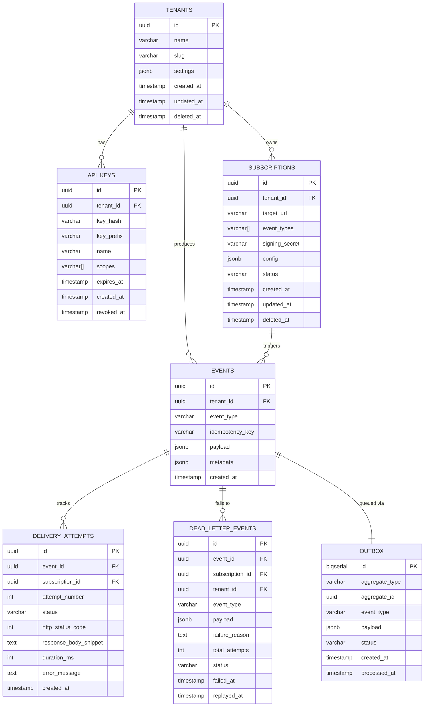

# PostgreSQL Schema Design

> Complete database schema for the EventRelay Reliable Webhook Delivery Platform.

## Table of Contents

- [Overview](#overview)
- [Design Principles](#design-principles)
- [Entity-Relationship Diagram](#entity-relationship-diagram)
- [Schema DDL](#schema-ddl)
  - [Tenants](#tenants)
  - [API Keys](#api-keys)
  - [Subscriptions](#subscriptions)
  - [Events](#events)
  - [Outbox](#outbox)
  - [Delivery Attempts](#delivery-attempts)
  - [Dead Letter Events](#dead-letter-events)
- [Enum Types](#enum-types)
- [Schema Design Rationale](#schema-design-rationale)
- [Cross-Reference Constraints](#cross-reference-constraints)
- [Production Considerations](#production-considerations)

---

## Overview

EventRelay uses PostgreSQL as its primary data store, serving three critical functions:

1. **Transactional Outbox** — guarantees at-least-once event dispatch via the outbox pattern
2. **Event Log** — permanent, auditable record of every ingested event
3. **Delivery Tracking** — full history of every HTTP delivery attempt for debugging and observability

The schema is designed for **multi-tenant isolation** (row-level filtering via `tenant_id`), **high write throughput** (minimal indexes on hot paths), and **operational debuggability** (rich metadata on every delivery attempt).

---

## Design Principles

| Principle | Implementation |
|---|---|
| **Multi-tenancy** | Every data table includes `tenant_id` as a non-nullable FK; all queries filter by tenant |
| **Idempotency** | `idempotency_key` on events table with unique constraint per tenant |
| **Soft Deletes** | Tenants and subscriptions use `deleted_at` timestamp instead of hard delete |
| **Audit Trail** | `created_at` and `updated_at` on all tables; events are append-only |
| **Time-Series Optimization** | Events and delivery_attempts are partitioned by `created_at` (see [Partitioning](./Partitioning.md)) |
| **Normalization** | 3NF for configuration data (tenants, subscriptions); denormalized payload on events for read performance |

---

## Entity-Relationship Diagram



---

## Enum Types

Define domain-specific enum types to enforce valid state transitions at the database level:

```sql
-- Event processing status in the outbox
CREATE TYPE outbox_status AS ENUM (
    'PENDING',      -- Awaiting pickup by the poller
    'PROCESSING',   -- Locked by a poller instance
    'PROCESSED',    -- Successfully dispatched to SQS
    'FAILED'        -- Dispatch to SQS failed (will be retried)
);

-- Delivery attempt outcome
CREATE TYPE delivery_status AS ENUM (
    'SUCCESS',      -- 2xx response received
    'FAILED',       -- Non-2xx response or network error
    'TIMEOUT',      -- Request timed out (>30s)
    'SKIPPED'       -- Circuit breaker open, attempt skipped
);

-- Subscription status
CREATE TYPE subscription_status AS ENUM (
    'ACTIVE',       -- Receiving events
    'PAUSED',       -- Temporarily paused by tenant
    'DISABLED'      -- Disabled due to repeated failures
);

-- Dead letter event status
CREATE TYPE dlq_status AS ENUM (
    'PENDING',      -- Awaiting manual review
    'REPLAYED',     -- Manually replayed
    'DISCARDED'     -- Manually discarded
);
```

---

## Schema DDL

### Tenants

The root entity. Every piece of data in EventRelay belongs to a tenant.

```sql
CREATE TABLE tenants (
    id              UUID PRIMARY KEY DEFAULT gen_random_uuid(),
    name            VARCHAR(255) NOT NULL,
    slug            VARCHAR(63) NOT NULL,                     -- URL-safe identifier (e.g., "acme-corp")
    settings        JSONB NOT NULL DEFAULT '{}'::jsonb,       -- Tenant-specific config (rate limits, retry policy overrides)
    tier            VARCHAR(20) NOT NULL DEFAULT 'free',      -- Pricing tier: free, starter, business, enterprise
    created_at      TIMESTAMPTZ NOT NULL DEFAULT now(),
    updated_at      TIMESTAMPTZ NOT NULL DEFAULT now(),
    deleted_at      TIMESTAMPTZ,                              -- Soft delete: NULL = active

    CONSTRAINT uq_tenants_slug UNIQUE (slug),
    CONSTRAINT chk_tenants_tier CHECK (tier IN ('free', 'starter', 'business', 'enterprise'))
);

COMMENT ON TABLE tenants IS 'Root multi-tenant entity. All data is scoped to a tenant.';
COMMENT ON COLUMN tenants.slug IS 'URL-safe unique identifier used in API paths (e.g., /v1/tenants/acme-corp/events).';
COMMENT ON COLUMN tenants.settings IS 'JSON overrides for rate limits, retry policies, signing algorithm. Schema: {"rate_limit_rps": 100, "max_retry_attempts": 10, "signing_algorithm": "hmac-sha256"}';
COMMENT ON COLUMN tenants.deleted_at IS 'Soft delete timestamp. Non-null means tenant is deactivated; data is retained for retention period.';
```

### API Keys

Authentication credentials for tenant API access. Keys are stored as bcrypt hashes.

```sql
CREATE TABLE api_keys (
    id              UUID PRIMARY KEY DEFAULT gen_random_uuid(),
    tenant_id       UUID NOT NULL REFERENCES tenants(id) ON DELETE CASCADE,
    key_hash        VARCHAR(255) NOT NULL,                    -- bcrypt hash of the full API key
    key_prefix      VARCHAR(12) NOT NULL,                     -- First 8 chars for identification (e.g., "er_live_a3b...")
    name            VARCHAR(255) NOT NULL,                    -- Human-readable label (e.g., "Production Key")
    scopes          TEXT[] NOT NULL DEFAULT '{events:write}', -- Permission scopes
    expires_at      TIMESTAMPTZ,                              -- NULL = never expires
    created_at      TIMESTAMPTZ NOT NULL DEFAULT now(),
    revoked_at      TIMESTAMPTZ,                              -- NULL = active; non-null = revoked

    CONSTRAINT uq_api_keys_prefix UNIQUE (key_prefix)
);

CREATE INDEX idx_api_keys_tenant_id ON api_keys(tenant_id);
CREATE INDEX idx_api_keys_key_prefix ON api_keys(key_prefix) WHERE revoked_at IS NULL;

COMMENT ON TABLE api_keys IS 'API authentication keys. The raw key is shown once at creation; only the bcrypt hash is stored.';
COMMENT ON COLUMN api_keys.key_prefix IS 'First 8 characters of the raw key, used for identification in logs and dashboards without exposing the full key.';
COMMENT ON COLUMN api_keys.scopes IS 'Array of permission scopes: events:write, events:read, subscriptions:manage, dlq:replay.';
```

### Subscriptions

Defines where events should be delivered. A tenant can have multiple subscriptions, each listening for specific event types.

```sql
CREATE TABLE subscriptions (
    id              UUID PRIMARY KEY DEFAULT gen_random_uuid(),
    tenant_id       UUID NOT NULL REFERENCES tenants(id) ON DELETE CASCADE,
    target_url      VARCHAR(2048) NOT NULL,                   -- Webhook endpoint URL (must be HTTPS in production)
    event_types     TEXT[] NOT NULL DEFAULT '{}',              -- Event types to subscribe to; empty = all events
    signing_secret  VARCHAR(255) NOT NULL,                    -- HMAC-SHA256 secret for request signing
    description     VARCHAR(500),                             -- Human-readable description
    config          JSONB NOT NULL DEFAULT '{}'::jsonb,       -- Per-subscription overrides (custom headers, timeout)
    status          subscription_status NOT NULL DEFAULT 'ACTIVE',
    failure_count   INTEGER NOT NULL DEFAULT 0,               -- Consecutive failure count for circuit breaker
    last_failure_at TIMESTAMPTZ,                              -- Timestamp of most recent failure
    created_at      TIMESTAMPTZ NOT NULL DEFAULT now(),
    updated_at      TIMESTAMPTZ NOT NULL DEFAULT now(),
    deleted_at      TIMESTAMPTZ,                              -- Soft delete

    CONSTRAINT chk_subscriptions_url CHECK (target_url ~ '^https?://'),
    CONSTRAINT chk_subscriptions_event_types CHECK (array_length(event_types, 1) IS NULL OR array_length(event_types, 1) <= 50)
);

CREATE INDEX idx_subscriptions_tenant_id ON subscriptions(tenant_id) WHERE deleted_at IS NULL;
CREATE INDEX idx_subscriptions_event_types ON subscriptions USING GIN (event_types) WHERE deleted_at IS NULL;

COMMENT ON TABLE subscriptions IS 'Webhook subscription definitions. Each subscription delivers matching events to a target URL.';
COMMENT ON COLUMN subscriptions.event_types IS 'Filter for event types. Empty array means subscribe to ALL event types for this tenant.';
COMMENT ON COLUMN subscriptions.signing_secret IS 'HMAC-SHA256 secret used to sign outgoing webhook payloads. Generated server-side, rotatable by tenant.';
COMMENT ON COLUMN subscriptions.config IS 'JSON overrides: {"custom_headers": {"X-Source": "eventrelay"}, "timeout_ms": 15000, "retry_policy": "exponential"}';
COMMENT ON COLUMN subscriptions.failure_count IS 'Consecutive delivery failures. Reset to 0 on success. Used by circuit breaker (threshold: 50).';
```

### Events

The canonical, append-only event log. Every ingested event is persisted here permanently (subject to retention policy).

```sql
CREATE TABLE events (
    id              UUID PRIMARY KEY DEFAULT gen_random_uuid(),
    tenant_id       UUID NOT NULL REFERENCES tenants(id),
    event_type      VARCHAR(255) NOT NULL,                    -- Dot-notation type (e.g., "order.completed")
    idempotency_key VARCHAR(255),                             -- Client-provided dedup key
    payload         JSONB NOT NULL,                           -- Event payload (max ~1MB enforced at API layer)
    metadata        JSONB NOT NULL DEFAULT '{}'::jsonb,       -- System metadata (source IP, SDK version, trace ID)
    created_at      TIMESTAMPTZ NOT NULL DEFAULT now(),

    CONSTRAINT uq_events_idempotency UNIQUE (tenant_id, idempotency_key)
) PARTITION BY RANGE (created_at);

-- Partition creation is automated; see Partitioning.md
-- Example: CREATE TABLE events_y2026m07 PARTITION OF events FOR VALUES FROM ('2026-07-01') TO ('2026-08-01');

CREATE INDEX idx_events_tenant_created ON events(tenant_id, created_at DESC);
CREATE INDEX idx_events_tenant_type ON events(tenant_id, event_type);
CREATE INDEX idx_events_idempotency ON events(tenant_id, idempotency_key) WHERE idempotency_key IS NOT NULL;

COMMENT ON TABLE events IS 'Append-only event log. Partitioned monthly by created_at. Source of truth for all ingested events.';
COMMENT ON COLUMN events.idempotency_key IS 'Client-provided key for deduplication. Unique per tenant. NULL means no dedup protection.';
COMMENT ON COLUMN events.metadata IS 'System-generated metadata: {"source_ip": "1.2.3.4", "sdk_version": "1.0.0", "trace_id": "abc-123"}';
```

### Outbox

Transactional outbox for reliable event dispatch. Written in the same transaction as the event insert.

```sql
CREATE TABLE outbox (
    id              BIGSERIAL PRIMARY KEY,                    -- Sequential for ordered polling
    aggregate_type  VARCHAR(100) NOT NULL DEFAULT 'Event',    -- Entity type that produced this message
    aggregate_id    UUID NOT NULL,                            -- ID of the source entity (event ID)
    event_type      VARCHAR(255) NOT NULL,                    -- Duplicated from events for SQS routing
    payload         JSONB NOT NULL,                           -- Full message payload for SQS
    status          outbox_status NOT NULL DEFAULT 'PENDING',
    retry_count     INTEGER NOT NULL DEFAULT 0,               -- Number of dispatch retries
    created_at      TIMESTAMPTZ NOT NULL DEFAULT now(),
    processed_at    TIMESTAMPTZ,                              -- When successfully dispatched to SQS

    CONSTRAINT chk_outbox_retry CHECK (retry_count <= 10)
);

-- Hot-path index: the poller queries PENDING rows ordered by creation time
CREATE INDEX idx_outbox_pending ON outbox(created_at ASC) WHERE status = 'PENDING';
-- Cleanup index: find old processed rows for deletion
CREATE INDEX idx_outbox_processed ON outbox(processed_at) WHERE status = 'PROCESSED';

COMMENT ON TABLE outbox IS 'Transactional outbox. Rows are inserted atomically with events, then polled and dispatched to SQS. See Outbox_Table.md.';
COMMENT ON COLUMN outbox.id IS 'BIGSERIAL for strict ordering. The poller processes rows in id order to preserve event sequence.';
COMMENT ON COLUMN outbox.aggregate_id IS 'References events.id. Not a FK to avoid cross-partition FK issues when events table is partitioned.';
COMMENT ON COLUMN outbox.status IS 'State machine: PENDING -> PROCESSING -> PROCESSED | FAILED. Only PENDING rows are polled.';
```

### Delivery Attempts

Records every individual HTTP delivery attempt for debugging and observability.

```sql
CREATE TABLE delivery_attempts (
    id                      UUID PRIMARY KEY DEFAULT gen_random_uuid(),
    event_id                UUID NOT NULL,                        -- References events.id (no FK due to partitioning)
    subscription_id         UUID NOT NULL REFERENCES subscriptions(id),
    tenant_id               UUID NOT NULL REFERENCES tenants(id), -- Denormalized for query performance
    attempt_number          INTEGER NOT NULL,                     -- 1-based attempt count
    status                  delivery_status NOT NULL,
    http_status_code        INTEGER,                              -- NULL if connection failed
    response_body_snippet   TEXT,                                 -- First 1024 chars of response body
    request_headers         JSONB,                                -- Sent headers (signing header redacted)
    response_headers        JSONB,                                -- Received response headers
    duration_ms             INTEGER NOT NULL,                     -- Round-trip time in milliseconds
    error_message           TEXT,                                 -- Error details if status != SUCCESS
    target_url              VARCHAR(2048) NOT NULL,               -- Snapshot of URL at delivery time
    created_at              TIMESTAMPTZ NOT NULL DEFAULT now(),

    CONSTRAINT chk_delivery_attempt_number CHECK (attempt_number > 0 AND attempt_number <= 20),
    CONSTRAINT chk_delivery_duration CHECK (duration_ms >= 0)
) PARTITION BY RANGE (created_at);

CREATE INDEX idx_delivery_event_id ON delivery_attempts(event_id);
CREATE INDEX idx_delivery_tenant_created ON delivery_attempts(tenant_id, created_at DESC);
CREATE INDEX idx_delivery_subscription ON delivery_attempts(subscription_id, created_at DESC);
CREATE INDEX idx_delivery_status ON delivery_attempts(status, created_at DESC) WHERE status != 'SUCCESS';

COMMENT ON TABLE delivery_attempts IS 'Every HTTP webhook delivery attempt. Partitioned monthly. See Delivery_Attempts.md.';
COMMENT ON COLUMN delivery_attempts.response_body_snippet IS 'First 1024 characters of the response body. Truncated to limit storage.';
COMMENT ON COLUMN delivery_attempts.target_url IS 'Snapshot of the subscription URL at delivery time. Preserved even if subscription URL changes later.';
```

### Dead Letter Events

Events that exhausted all retry attempts. Stored for manual inspection and replay.

```sql
CREATE TABLE dead_letter_events (
    id              UUID PRIMARY KEY DEFAULT gen_random_uuid(),
    event_id        UUID NOT NULL,                            -- References events.id
    subscription_id UUID NOT NULL REFERENCES subscriptions(id),
    tenant_id       UUID NOT NULL REFERENCES tenants(id),
    event_type      VARCHAR(255) NOT NULL,                    -- Denormalized for filtering
    payload         JSONB NOT NULL,                           -- Full event payload snapshot
    failure_reason  TEXT NOT NULL,                            -- Human-readable failure summary
    last_http_status INTEGER,                                 -- HTTP status of final attempt
    total_attempts  INTEGER NOT NULL,                         -- Total delivery attempts made
    status          dlq_status NOT NULL DEFAULT 'PENDING',
    failed_at       TIMESTAMPTZ NOT NULL DEFAULT now(),       -- When the event was dead-lettered
    replayed_at     TIMESTAMPTZ,                              -- When manually replayed (NULL if not)
    discarded_at    TIMESTAMPTZ,                              -- When manually discarded (NULL if not)
    replayed_by     VARCHAR(255),                             -- User/API key that triggered replay

    CONSTRAINT chk_dlq_attempts CHECK (total_attempts > 0)
);

CREATE INDEX idx_dlq_tenant_status ON dead_letter_events(tenant_id, status) WHERE status = 'PENDING';
CREATE INDEX idx_dlq_tenant_failed ON dead_letter_events(tenant_id, failed_at DESC);
CREATE INDEX idx_dlq_event_id ON dead_letter_events(event_id);

COMMENT ON TABLE dead_letter_events IS 'Dead letter queue. Events that exhausted retries. Supports manual replay and discard. See Retention.md for cleanup.';
COMMENT ON COLUMN dead_letter_events.payload IS 'Full event payload snapshot. Denormalized from events table so DLQ entries remain self-contained even after event log retention cleanup.';
COMMENT ON COLUMN dead_letter_events.failure_reason IS 'Human-readable summary, e.g., "Connection refused after 10 attempts over 24h" or "HTTP 503 Service Unavailable".';
```

---

## Cross-Reference Constraints

> [!NOTE]
> Foreign keys from `delivery_attempts` and `dead_letter_events` to `events` are intentionally omitted because the `events` table uses declarative partitioning. PostgreSQL does not support foreign keys referencing partitioned tables. Referential integrity is enforced at the application layer.

**Relationship summary:**

| Parent Table | Child Table | Relationship | FK Enforced? |
|---|---|---|---|
| `tenants` | `api_keys` | 1:N | ✅ Yes (CASCADE) |
| `tenants` | `subscriptions` | 1:N | ✅ Yes (CASCADE) |
| `tenants` | `events` | 1:N | ✅ Yes |
| `events` | `outbox` | 1:1 | ❌ No (partitioning) |
| `events` | `delivery_attempts` | 1:N | ❌ No (partitioning) |
| `events` | `dead_letter_events` | 1:N | ❌ No (partitioning) |
| `subscriptions` | `delivery_attempts` | 1:N | ✅ Yes |
| `subscriptions` | `dead_letter_events` | 1:N | ✅ Yes |

---

## Schema Design Rationale

### Why UUIDs for Primary Keys?

- **Distributed generation** — UUIDs can be generated by the application without a database round-trip, enabling pre-computation of IDs before `INSERT`
- **Merge-safe** — No conflicts when merging data across environments or shards
- **Security** — Non-sequential IDs prevent enumeration attacks
- **Exception**: `outbox.id` uses `BIGSERIAL` because the poller relies on strict ordering

### Why Denormalize `tenant_id` on Delivery Attempts?

The `delivery_attempts` table includes `tenant_id` even though it could be derived via `events.tenant_id`. This avoids a JOIN on every tenant-scoped query against the delivery history — a table that can contain billions of rows.

### Why Store `payload` on Dead Letter Events?

The `dead_letter_events` table stores a full copy of the event payload rather than just referencing `events.id`. This ensures DLQ entries remain queryable and replayable even after the original event is cleaned up by the retention policy (default: 90 days).

### Why `TEXT[]` for Event Types on Subscriptions?

PostgreSQL arrays with a GIN index provide efficient containment queries (`@>` operator) for event type filtering, avoiding a separate junction table. This keeps the subscription model simple while supporting queries like "find all subscriptions that listen for `order.completed`".

### Why No FK from Outbox to Events?

The `events` table is partitioned by `created_at` using PostgreSQL declarative partitioning. PostgreSQL does not allow foreign keys that reference partitioned tables. The `outbox.aggregate_id` column stores the `events.id` value, and referential integrity is guaranteed by the application (both rows are inserted in the same transaction).

---

## Production Considerations

### Connection Pooling

```yaml
# application.yml — HikariCP settings
spring:
  datasource:
    hikari:
      maximum-pool-size: 20        # Match ECS task count × 20
      minimum-idle: 5
      connection-timeout: 5000     # 5s — fail fast
      idle-timeout: 300000         # 5 min
      max-lifetime: 1800000        # 30 min — below PostgreSQL's default timeout
      leak-detection-threshold: 30000
```

### Statement Timeout

Set a global statement timeout to prevent runaway queries:

```sql
ALTER DATABASE eventrelay SET statement_timeout = '30s';
-- Outbox poller uses a shorter timeout per-session:
-- SET LOCAL statement_timeout = '5s';
```

### Row-Level Security (Optional Enhancement)

For defense-in-depth, enable RLS to enforce tenant isolation at the database level:

```sql
ALTER TABLE events ENABLE ROW LEVEL SECURITY;

CREATE POLICY tenant_isolation_events ON events
    USING (tenant_id = current_setting('app.current_tenant_id')::uuid);
```

> [!WARNING]
> RLS adds ~5-10% query overhead. Evaluate whether application-layer tenant filtering (via Spring's `@TenantFilter`) is sufficient for your threat model.

### Schema Version Tracking

The schema version is managed by Flyway. See [Migrations.md](./Migrations.md) for the full migration strategy.

```sql
-- Flyway automatically creates and manages this table:
-- flyway_schema_history (installed_rank, version, description, type, script, checksum, ...)
```

---

## Related Documents

- [Outbox_Table.md](./Outbox_Table.md) — Deep dive into the outbox pattern implementation
- [Event_Log.md](./Event_Log.md) — Event log usage, indexing, and retention
- [Delivery_Attempts.md](./Delivery_Attempts.md) — Delivery tracking and debugging queries
- [Tenant_Data.md](./Tenant_Data.md) — Multi-tenancy data model
- [Indexing.md](./Indexing.md) — Comprehensive indexing strategy
- [Partitioning.md](./Partitioning.md) — Table partitioning approach
- [Retention.md](./Retention.md) — Data retention and cleanup policies
- [Migrations.md](./Migrations.md) — Flyway migration strategy
