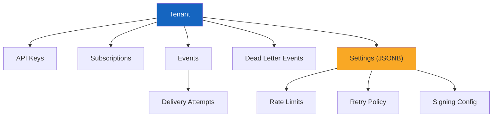

# Tenant Data Model

> Multi-tenancy data isolation, tenant configuration, and lifecycle management in EventRelay.

## Table of Contents

- [Overview](#overview)
- [Tenants Table Schema](#tenants-table-schema)
- [API Keys Table Schema](#api-keys-table-schema)
- [Tenant Settings Schema](#tenant-settings-schema)
- [JPA Entities](#jpa-entities)
- [Multi-Tenancy Data Isolation](#multi-tenancy-data-isolation)
  - [Row-Level Filtering via tenant_id](#row-level-filtering-via-tenant_id)
  - [Spring Tenant Context](#spring-tenant-context)
  - [Optional: PostgreSQL Row-Level Security](#optional-postgresql-row-level-security)
- [Tenant Lifecycle](#tenant-lifecycle)
  - [Creation](#creation)
  - [Update](#update)
  - [Soft Delete](#soft-delete)
  - [Hard Delete (GDPR)](#hard-delete-gdpr)
- [Rate Limit Configuration](#rate-limit-configuration)
- [Retry Policy Configuration](#retry-policy-configuration)
- [Signing Secret Management](#signing-secret-management)
- [Data Access Patterns](#data-access-patterns)
- [Tenant Tiers and Limits](#tenant-tiers-and-limits)
- [Production Considerations](#production-considerations)

---

## Overview

EventRelay is a **multi-tenant** platform. Every piece of data — events, subscriptions, delivery attempts, dead letter entries — belongs to exactly one tenant. The tenant data model provides:

1. **Isolation** — tenants cannot see or affect each other's data
2. **Configuration** — per-tenant overrides for rate limits, retry policies, and signing algorithms
3. **Lifecycle management** — creation, update, soft delete, and GDPR-compliant hard delete



---

## Tenants Table Schema

```sql
CREATE TABLE tenants (
    id              UUID PRIMARY KEY DEFAULT gen_random_uuid(),
    name            VARCHAR(255) NOT NULL,                    -- Display name ("Acme Corporation")
    slug            VARCHAR(63) NOT NULL,                     -- URL-safe identifier ("acme-corp")
    settings        JSONB NOT NULL DEFAULT '{}'::jsonb,       -- Tenant-specific configuration overrides
    tier            VARCHAR(20) NOT NULL DEFAULT 'free',      -- Pricing tier
    contact_email   VARCHAR(255),                             -- Primary contact email
    created_at      TIMESTAMPTZ NOT NULL DEFAULT now(),
    updated_at      TIMESTAMPTZ NOT NULL DEFAULT now(),
    deleted_at      TIMESTAMPTZ,                              -- Soft delete timestamp

    CONSTRAINT uq_tenants_slug UNIQUE (slug),
    CONSTRAINT chk_tenants_tier CHECK (tier IN ('free', 'starter', 'business', 'enterprise')),
    CONSTRAINT chk_tenants_slug_format CHECK (slug ~ '^[a-z0-9][a-z0-9-]*[a-z0-9]$')
);

-- Lookup active tenants by slug (API authentication flow)
CREATE INDEX idx_tenants_slug_active ON tenants(slug) WHERE deleted_at IS NULL;

COMMENT ON TABLE tenants IS 'Root entity for multi-tenancy. All data tables reference tenant_id.';
COMMENT ON COLUMN tenants.slug IS 'URL-safe identifier. 3-63 chars, lowercase alphanumeric + hyphens. Used in API paths.';
COMMENT ON COLUMN tenants.settings IS 'Per-tenant configuration overrides. See Tenant Settings Schema section.';
```

---

## API Keys Table Schema

```sql
CREATE TABLE api_keys (
    id              UUID PRIMARY KEY DEFAULT gen_random_uuid(),
    tenant_id       UUID NOT NULL REFERENCES tenants(id) ON DELETE CASCADE,
    key_hash        VARCHAR(255) NOT NULL,                    -- bcrypt hash of the full API key
    key_prefix      VARCHAR(12) NOT NULL,                     -- First 8 chars for identification
    name            VARCHAR(255) NOT NULL,                    -- Human-readable label
    scopes          TEXT[] NOT NULL DEFAULT '{events:write}', -- Permission scopes
    expires_at      TIMESTAMPTZ,                              -- NULL = never expires
    last_used_at    TIMESTAMPTZ,                              -- Updated on each API call
    created_at      TIMESTAMPTZ NOT NULL DEFAULT now(),
    revoked_at      TIMESTAMPTZ,                              -- Non-null = revoked

    CONSTRAINT uq_api_keys_prefix UNIQUE (key_prefix)
);

CREATE INDEX idx_api_keys_tenant ON api_keys(tenant_id) WHERE revoked_at IS NULL;
CREATE INDEX idx_api_keys_prefix_active ON api_keys(key_prefix) WHERE revoked_at IS NULL;
```

### Available Scopes

| Scope | Description | Default |
|---|---|---|
| `events:write` | Ingest events via POST /v1/events | ✅ Yes |
| `events:read` | List and retrieve events | ❌ No |
| `subscriptions:manage` | Create, update, delete subscriptions | ❌ No |
| `dlq:read` | View dead letter events | ❌ No |
| `dlq:replay` | Replay dead letter events | ❌ No |
| `tenant:admin` | Manage tenant settings and API keys | ❌ No |

### API Key Format

```
er_live_a3b7c9d2e4f56789abcdef0123456789abcdef01234567
│  │    │
│  │    └── 48 random hex characters (the secret)
│  └── Environment: live, test
└── Prefix: "er" (EventRelay)
```

- The full key is shown **once** at creation
- Only the bcrypt hash (`key_hash`) and prefix (`key_prefix = "er_live_a3b7c9d2"`) are stored
- The prefix is used for identification in logs and dashboards

---

## Tenant Settings Schema

The `settings` JSONB column stores per-tenant configuration overrides. Unset values fall back to tier defaults.

```json
{
  "rate_limit": {
    "requests_per_second": 100,
    "burst_size": 200
  },
  "retry_policy": {
    "max_attempts": 10,
    "initial_delay_ms": 1000,
    "max_delay_ms": 3600000,
    "backoff_multiplier": 5.0,
    "jitter_factor": 0.2
  },
  "signing": {
    "algorithm": "hmac-sha256",
    "header_name": "X-EventRelay-Signature",
    "timestamp_tolerance_seconds": 300
  },
  "delivery": {
    "timeout_ms": 30000,
    "max_payload_bytes": 1048576,
    "circuit_breaker_threshold": 50,
    "circuit_breaker_reset_ms": 300000
  },
  "retention": {
    "event_log_days": 90,
    "delivery_attempts_days": 30,
    "dead_letter_days": 30
  },
  "notifications": {
    "dlq_webhook_url": "https://ops.acme.com/alerts",
    "failure_threshold_pct": 10
  }
}
```

### Settings Java Class

```java
@Data
@Builder
@NoArgsConstructor
@AllArgsConstructor
public class TenantSettings {

    @Builder.Default
    private RateLimitSettings rateLimit = new RateLimitSettings();

    @Builder.Default
    private RetryPolicySettings retryPolicy = new RetryPolicySettings();

    @Builder.Default
    private SigningSettings signing = new SigningSettings();

    @Builder.Default
    private DeliverySettings delivery = new DeliverySettings();

    @Builder.Default
    private RetentionSettings retention = new RetentionSettings();

    @Data
    @Builder
    public static class RateLimitSettings {
        @Builder.Default private int requestsPerSecond = 100;
        @Builder.Default private int burstSize = 200;
    }

    @Data
    @Builder
    public static class RetryPolicySettings {
        @Builder.Default private int maxAttempts = 10;
        @Builder.Default private long initialDelayMs = 1000;
        @Builder.Default private long maxDelayMs = 3_600_000;
        @Builder.Default private double backoffMultiplier = 5.0;
        @Builder.Default private double jitterFactor = 0.2;
    }

    @Data
    @Builder
    public static class SigningSettings {
        @Builder.Default private String algorithm = "hmac-sha256";
        @Builder.Default private String headerName = "X-EventRelay-Signature";
        @Builder.Default private int timestampToleranceSeconds = 300;
    }

    @Data
    @Builder
    public static class DeliverySettings {
        @Builder.Default private int timeoutMs = 30_000;
        @Builder.Default private int maxPayloadBytes = 1_048_576; // 1MB
        @Builder.Default private int circuitBreakerThreshold = 50;
        @Builder.Default private long circuitBreakerResetMs = 300_000; // 5 min
    }

    @Data
    @Builder
    public static class RetentionSettings {
        @Builder.Default private int eventLogDays = 90;
        @Builder.Default private int deliveryAttemptsDays = 30;
        @Builder.Default private int deadLetterDays = 30;
    }
}
```

---

## JPA Entities

### Tenant Entity

```java
@Entity
@Table(name = "tenants")
@Where(clause = "deleted_at IS NULL") // Hibernate: auto-filter soft-deleted rows
public class Tenant {

    @Id
    @GeneratedValue(strategy = GenerationType.UUID)
    private UUID id;

    @Column(nullable = false, length = 255)
    private String name;

    @Column(nullable = false, unique = true, length = 63)
    private String slug;

    @Column(name = "settings", nullable = false, columnDefinition = "jsonb")
    @JdbcTypeCode(SqlTypes.JSON)
    private TenantSettings settings = new TenantSettings();

    @Column(nullable = false, length = 20)
    private String tier = "free";

    @Column(name = "contact_email", length = 255)
    private String contactEmail;

    @Column(name = "created_at", nullable = false, updatable = false)
    private Instant createdAt;

    @Column(name = "updated_at", nullable = false)
    private Instant updatedAt;

    @Column(name = "deleted_at")
    private Instant deletedAt;

    @PrePersist
    protected void onCreate() {
        this.createdAt = Instant.now();
        this.updatedAt = this.createdAt;
    }

    @PreUpdate
    protected void onUpdate() {
        this.updatedAt = Instant.now();
    }

    public void softDelete() {
        this.deletedAt = Instant.now();
    }

    public boolean isActive() {
        return this.deletedAt == null;
    }

    /**
     * Resolve a setting with tier-based defaults.
     */
    public int getEffectiveRateLimit() {
        if (settings.getRateLimit() != null && settings.getRateLimit().getRequestsPerSecond() > 0) {
            return settings.getRateLimit().getRequestsPerSecond();
        }
        return TierDefaults.getRateLimit(this.tier);
    }
}
```

### API Key Entity

```java
@Entity
@Table(name = "api_keys")
public class ApiKey {

    @Id
    @GeneratedValue(strategy = GenerationType.UUID)
    private UUID id;

    @ManyToOne(fetch = FetchType.LAZY)
    @JoinColumn(name = "tenant_id", nullable = false)
    private Tenant tenant;

    @Column(name = "key_hash", nullable = false, length = 255)
    private String keyHash;

    @Column(name = "key_prefix", nullable = false, unique = true, length = 12)
    private String keyPrefix;

    @Column(nullable = false, length = 255)
    private String name;

    @Column(name = "scopes", columnDefinition = "text[]")
    @JdbcTypeCode(SqlTypes.ARRAY)
    private String[] scopes = new String[]{"events:write"};

    @Column(name = "expires_at")
    private Instant expiresAt;

    @Column(name = "last_used_at")
    private Instant lastUsedAt;

    @Column(name = "created_at", nullable = false, updatable = false)
    private Instant createdAt = Instant.now();

    @Column(name = "revoked_at")
    private Instant revokedAt;

    public boolean isValid() {
        return revokedAt == null && (expiresAt == null || expiresAt.isAfter(Instant.now()));
    }

    public void revoke() {
        this.revokedAt = Instant.now();
    }

    public boolean hasScope(String scope) {
        return Arrays.asList(scopes).contains(scope);
    }
}
```

---

## Multi-Tenancy Data Isolation

### Row-Level Filtering via tenant_id

Every data table includes a `tenant_id` column. All queries MUST filter by `tenant_id`:

```java
// ✅ CORRECT: Always filter by tenant_id
@Query("SELECT e FROM Event e WHERE e.tenantId = :tenantId ORDER BY e.createdAt DESC")
Page<Event> findByTenantId(@Param("tenantId") UUID tenantId, Pageable pageable);

// ❌ WRONG: Never query without tenant_id filter
@Query("SELECT e FROM Event e ORDER BY e.createdAt DESC")
Page<Event> findAll(Pageable pageable); // DANGER: cross-tenant data leak
```

### Spring Tenant Context

The tenant ID is resolved from the API key in the authentication filter and stored in a request-scoped context:

```java
@Component
public class TenantContext {

    private static final ThreadLocal<UUID> CURRENT_TENANT = new ThreadLocal<>();

    public static UUID getCurrentTenantId() {
        UUID tenantId = CURRENT_TENANT.get();
        if (tenantId == null) {
            throw new IllegalStateException("Tenant context not set. Ensure TenantFilter is active.");
        }
        return tenantId;
    }

    public static void setCurrentTenantId(UUID tenantId) {
        CURRENT_TENANT.set(tenantId);
    }

    public static void clear() {
        CURRENT_TENANT.remove();
    }
}

@Component
@Order(1)
public class TenantFilter extends OncePerRequestFilter {

    private final ApiKeyService apiKeyService;

    @Override
    protected void doFilterInternal(HttpServletRequest request,
                                     HttpServletResponse response,
                                     FilterChain chain) throws ServletException, IOException {
        try {
            String apiKey = extractApiKey(request);
            ApiKey key = apiKeyService.validateAndResolve(apiKey);
            TenantContext.setCurrentTenantId(key.getTenant().getId());

            // Set for optional PostgreSQL RLS
            // jdbcTemplate.execute("SET app.current_tenant_id = '" + key.getTenant().getId() + "'");

            chain.doFilter(request, response);
        } finally {
            TenantContext.clear();
        }
    }

    private String extractApiKey(HttpServletRequest request) {
        String header = request.getHeader("Authorization");
        if (header != null && header.startsWith("Bearer ")) {
            return header.substring(7);
        }
        throw new UnauthorizedException("Missing or invalid Authorization header");
    }
}
```

### Optional: PostgreSQL Row-Level Security

For defense-in-depth, enable RLS as a secondary enforcement layer:

```sql
-- Enable RLS on all tenant-scoped tables
ALTER TABLE events ENABLE ROW LEVEL SECURITY;
ALTER TABLE subscriptions ENABLE ROW LEVEL SECURITY;
ALTER TABLE delivery_attempts ENABLE ROW LEVEL SECURITY;
ALTER TABLE dead_letter_events ENABLE ROW LEVEL SECURITY;

-- Policy: rows are visible only when app.current_tenant_id matches
CREATE POLICY tenant_isolation ON events
    USING (tenant_id = current_setting('app.current_tenant_id')::uuid);

CREATE POLICY tenant_isolation ON subscriptions
    USING (tenant_id = current_setting('app.current_tenant_id')::uuid);

CREATE POLICY tenant_isolation ON delivery_attempts
    USING (tenant_id = current_setting('app.current_tenant_id')::uuid);

CREATE POLICY tenant_isolation ON dead_letter_events
    USING (tenant_id = current_setting('app.current_tenant_id')::uuid);
```

> [!WARNING]
> RLS adds ~5-10% query overhead. Use it only if your threat model requires database-level isolation (e.g., regulatory requirements, shared database with untrusted application code).

---

## Tenant Lifecycle

### Creation

```java
@Service
@Transactional
public class TenantService {

    public TenantCreationResult createTenant(CreateTenantRequest request) {
        // 1. Validate slug uniqueness
        if (tenantRepository.existsBySlug(request.getSlug())) {
            throw new SlugAlreadyExistsException(request.getSlug());
        }

        // 2. Create tenant
        Tenant tenant = Tenant.builder()
            .name(request.getName())
            .slug(request.getSlug())
            .tier(request.getTier() != null ? request.getTier() : "free")
            .contactEmail(request.getContactEmail())
            .settings(TierDefaults.getDefaultSettings(request.getTier()))
            .build();
        tenantRepository.save(tenant);

        // 3. Generate initial API key
        String rawKey = ApiKeyGenerator.generate("live");
        ApiKey apiKey = ApiKey.builder()
            .tenant(tenant)
            .keyHash(passwordEncoder.encode(rawKey))
            .keyPrefix(rawKey.substring(0, 12))
            .name("Default Key")
            .scopes(new String[]{"events:write", "events:read", "subscriptions:manage"})
            .build();
        apiKeyRepository.save(apiKey);

        // 4. Return result (raw key is shown ONCE)
        return new TenantCreationResult(tenant, rawKey);
    }
}
```

### Update

```java
public Tenant updateTenant(UUID tenantId, UpdateTenantRequest request) {
    Tenant tenant = tenantRepository.findById(tenantId)
        .orElseThrow(() -> new TenantNotFoundException(tenantId));

    if (request.getName() != null) tenant.setName(request.getName());
    if (request.getContactEmail() != null) tenant.setContactEmail(request.getContactEmail());
    if (request.getSettings() != null) {
        // Merge settings (don't replace entirely)
        TenantSettings merged = mergeSettings(tenant.getSettings(), request.getSettings());
        tenant.setSettings(merged);
    }

    return tenantRepository.save(tenant);
}
```

### Soft Delete

```java
public void deactivateTenant(UUID tenantId) {
    Tenant tenant = tenantRepository.findById(tenantId)
        .orElseThrow(() -> new TenantNotFoundException(tenantId));

    tenant.softDelete();
    tenantRepository.save(tenant);

    // Revoke all API keys
    apiKeyRepository.revokeAllByTenantId(tenantId);

    // Pause all subscriptions
    subscriptionRepository.pauseAllByTenantId(tenantId);

    log.info("Tenant soft-deleted: id={}, slug={}", tenantId, tenant.getSlug());
}
```

### Hard Delete (GDPR)

See [Retention.md](./Retention.md) for the full GDPR right-to-erasure implementation.

```java
@Transactional
public void hardDeleteTenant(UUID tenantId) {
    // 1. Archive to S3 if required
    archiveService.archiveTenantData(tenantId);

    // 2. Delete all tenant data (cascading)
    deliveryAttemptRepository.deleteByTenantId(tenantId);
    deadLetterEventRepository.deleteByTenantId(tenantId);
    eventRepository.deleteByTenantId(tenantId);
    subscriptionRepository.deleteByTenantId(tenantId);
    apiKeyRepository.deleteByTenantId(tenantId);
    tenantRepository.deleteById(tenantId);

    log.warn("Tenant HARD DELETED (GDPR): id={}", tenantId);
}
```

---

## Rate Limit Configuration

Per-tenant rate limits are stored in `settings.rate_limit` and loaded into Redis:

```java
@Service
public class RateLimitConfigLoader {

    private final RedisTemplate<String, String> redisTemplate;

    public void loadRateLimitConfig(Tenant tenant) {
        TenantSettings.RateLimitSettings rateLimit = tenant.getSettings().getRateLimit();
        int rps = rateLimit != null ? rateLimit.getRequestsPerSecond()
            : TierDefaults.getRateLimit(tenant.getTier());

        String key = "ratelimit:config:" + tenant.getId();
        redisTemplate.opsForHash().putAll(key, Map.of(
            "requests_per_second", String.valueOf(rps),
            "burst_size", String.valueOf(rps * 2)
        ));
        redisTemplate.expire(key, Duration.ofHours(24));
    }
}
```

---

## Retry Policy Configuration

Per-tenant retry policies override the global defaults:

```java
@Component
public class RetryPolicyResolver {

    private final TenantRepository tenantRepository;
    private static final RetryPolicySettings GLOBAL_DEFAULTS = RetryPolicySettings.builder()
        .maxAttempts(10)
        .initialDelayMs(1_000)
        .maxDelayMs(3_600_000)
        .backoffMultiplier(5.0)
        .jitterFactor(0.2)
        .build();

    public RetryPolicySettings resolve(UUID tenantId) {
        return tenantRepository.findById(tenantId)
            .map(Tenant::getSettings)
            .map(TenantSettings::getRetryPolicy)
            .filter(Objects::nonNull)
            .orElse(GLOBAL_DEFAULTS);
    }

    /**
     * Calculate the delay for a specific attempt number.
     * Formula: min(initialDelay * multiplier^(attempt-1), maxDelay) * (1 ± jitter)
     */
    public Duration calculateDelay(RetryPolicySettings policy, int attemptNumber) {
        double rawDelay = policy.getInitialDelayMs()
            * Math.pow(policy.getBackoffMultiplier(), attemptNumber - 1);
        double cappedDelay = Math.min(rawDelay, policy.getMaxDelayMs());
        double jitter = cappedDelay * policy.getJitterFactor() * (Math.random() * 2 - 1);
        long finalDelay = Math.max(0, (long) (cappedDelay + jitter));
        return Duration.ofMillis(finalDelay);
    }
}
```

---

## Tenant Tiers and Limits

| Feature | Free | Starter | Business | Enterprise |
|---|---|---|---|---|
| **Rate limit (rps)** | 10 | 100 | 1,000 | 10,000 |
| **Max subscriptions** | 5 | 25 | 100 | Unlimited |
| **Max event payload** | 64 KB | 256 KB | 1 MB | 5 MB |
| **Retry attempts** | 5 | 10 | 15 | 20 |
| **Event log retention** | 30 days | 60 days | 90 days | 365 days |
| **DLQ retention** | 7 days | 30 days | 30 days | 90 days |
| **API keys** | 2 | 10 | 50 | Unlimited |
| **Custom retry policy** | ❌ | ❌ | ✅ | ✅ |
| **Custom headers** | ❌ | ✅ | ✅ | ✅ |
| **SLA** | Best effort | 99.9% | 99.95% | 99.99% |

```java
public class TierDefaults {

    private static final Map<String, TierConfig> TIERS = Map.of(
        "free", new TierConfig(10, 5, 65_536, 5, 30),
        "starter", new TierConfig(100, 25, 262_144, 10, 60),
        "business", new TierConfig(1_000, 100, 1_048_576, 15, 90),
        "enterprise", new TierConfig(10_000, Integer.MAX_VALUE, 5_242_880, 20, 365)
    );

    public static int getRateLimit(String tier) {
        return TIERS.getOrDefault(tier, TIERS.get("free")).rateLimit();
    }

    public record TierConfig(
        int rateLimit,
        int maxSubscriptions,
        int maxPayloadBytes,
        int maxRetryAttempts,
        int eventLogRetentionDays
    ) {}
}
```

---

## Data Access Patterns

| Operation | Query Pattern | Expected Volume |
|---|---|---|
| Authenticate API key | `SELECT by key_prefix WHERE revoked_at IS NULL` | Every API request |
| Resolve tenant settings | `SELECT by tenant_id` (cached in Redis) | Every API request (cache) |
| List tenant subscriptions | `SELECT by tenant_id WHERE deleted_at IS NULL` | Dashboard, event routing |
| Create tenant | `INSERT tenant + INSERT api_key` | Rare (signup flow) |
| Update tenant settings | `UPDATE settings JSONB` | Rare (admin action) |
| Deactivate tenant | `UPDATE deleted_at + revoke keys + pause subs` | Rare (churn) |

> [!TIP]
> Cache tenant and API key lookups in Redis with a 5-minute TTL. The authentication flow runs on every request and must be sub-millisecond.

---

## Production Considerations

1. **Cache tenant settings** — load tenant settings into Redis on startup and refresh on update. Don't hit PostgreSQL on every request.
2. **API key rotation** — support creating new keys before revoking old ones (overlap period).
3. **Slug immutability** — once a tenant slug is set, it should not change (it's used in API paths and logging).
4. **Settings migration** — when adding new setting fields, ensure backward compatibility with existing JSONB values (use defaults for missing fields).
5. **Audit tenant changes** — log all tenant setting changes with the admin user and timestamp.
6. **Rate limit propagation** — when a tenant's rate limit is updated, push the new config to Redis immediately (don't wait for cache expiry).

---

## Related Documents

- [PostgreSQL_Schema.md](./PostgreSQL_Schema.md) — Full schema DDL including tenants and api_keys
- [Retention.md](./Retention.md) — GDPR hard delete and data retention policies
- [Migrations.md](./Migrations.md) — Flyway migrations for tenant tables
