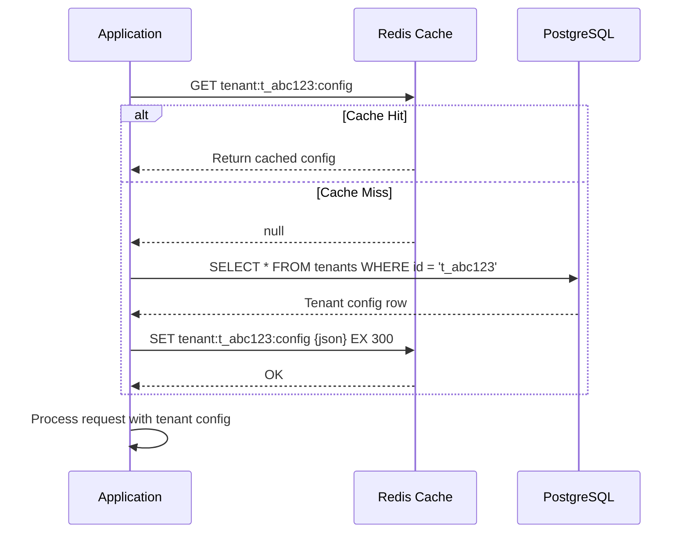
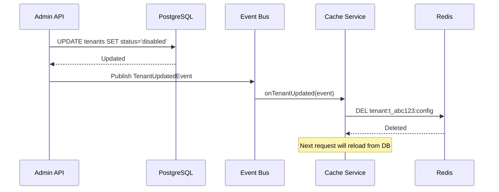

# Redis Caching Strategy

## Overview

EventRelay uses Redis as a **distributed cache** to reduce PostgreSQL load on frequently accessed, rarely changing data — tenant configurations, subscription mappings, and API key lookups. The cache-aside (lazy-loading) pattern is used as the primary strategy, with event-driven invalidation for consistency-critical paths.

> [!NOTE]
> Caching is a **performance optimization**, not a correctness requirement. EventRelay must function correctly (at degraded performance) if Redis is entirely unavailable.

---

## What to Cache

| Data Type             | Read Frequency   | Write Frequency | Cache TTL  | Justification                                         |
|-----------------------|------------------|-----------------|------------|-------------------------------------------------------|
| Tenant Configuration  | Every request    | Rarely (~daily) | 5 minutes  | Validates tenant identity and extracts settings       |
| Subscription Data     | Every event      | Occasionally    | 5 minutes  | Determines which endpoints receive each event type    |
| API Key → Tenant Map  | Every request    | Rarely          | 10 minutes | Authentication lookup on every API call               |
| Endpoint Details      | Every delivery   | Occasionally    | 5 minutes  | URL, secret, headers for webhook delivery             |
| Rate Limit Config     | Every request    | Rarely          | 5 minutes  | Tenant/endpoint rate limit parameters                 |

### What NOT to Cache

| Data Type            | Reason                                                        |
|----------------------|---------------------------------------------------------------|
| Event payloads       | Large, unique, and accessed once during delivery              |
| Delivery logs        | Write-heavy, rarely re-read in the hot path                   |
| Outbox events        | Transient — consumed by the poller and deleted                |
| Dedup keys           | Already handled by dedicated Redis key-value (not cache layer)|

---

## Cache Key Naming Conventions

All cache keys follow a hierarchical namespace pattern:

```
{entity}:{scope}:{identifier}
```

| Cache Key Pattern                          | Example                                      | Value Type   |
|--------------------------------------------|----------------------------------------------|--------------|
| `tenant:{tenantId}:config`                 | `tenant:t_abc123:config`                     | JSON Hash    |
| `sub:{tenantId}:{eventType}`               | `sub:t_abc123:order.created`                 | JSON List    |
| `apikey:{hashedKey}`                        | `apikey:sha256_a1b2c3d4...`                  | JSON Hash    |
| `endpoint:{endpointId}`                    | `endpoint:ep_xyz789`                         | JSON Hash    |
| `ratelimit:config:{tenantId}`              | `ratelimit:config:t_abc123`                  | JSON Hash    |

> [!TIP]
> Use colons (`:`) as separators — this is the Redis convention and is recognized by tools like RedisInsight for hierarchical browsing. Never include user-supplied values directly in keys without validation.

### Key Validation

```java
/**
 * Sanitize cache key components to prevent injection.
 * Only allows alphanumeric characters, hyphens, underscores, and dots.
 */
public static String sanitizeKeyComponent(String component) {
    if (component == null || component.isBlank()) {
        throw new IllegalArgumentException("Cache key component cannot be null or blank");
    }
    if (!component.matches("[a-zA-Z0-9._-]+")) {
        throw new IllegalArgumentException(
            "Invalid cache key component: " + component);
    }
    return component;
}
```

---

## Cache-Aside Pattern Implementation



### Generic Cache-Aside Service

```java
package com.eventrelay.cache;

import com.fasterxml.jackson.core.JsonProcessingException;
import com.fasterxml.jackson.databind.ObjectMapper;
import org.slf4j.Logger;
import org.slf4j.LoggerFactory;
import org.springframework.data.redis.core.StringRedisTemplate;
import org.springframework.stereotype.Service;

import java.time.Duration;
import java.util.Optional;
import java.util.function.Supplier;

@Service
public class CacheService {

    private static final Logger log = LoggerFactory.getLogger(CacheService.class);

    private final StringRedisTemplate redisTemplate;
    private final ObjectMapper objectMapper;

    public CacheService(StringRedisTemplate redisTemplate, ObjectMapper objectMapper) {
        this.redisTemplate = redisTemplate;
        this.objectMapper = objectMapper;
    }

    /**
     * Cache-aside: attempt to read from cache, on miss call the supplier
     * and populate the cache with the result.
     *
     * @param key      Redis key
     * @param type     Class of the cached value (for deserialization)
     * @param ttl      Time-to-live for the cache entry
     * @param loader   Supplier to call on cache miss (typically a DB query)
     * @return The cached or freshly loaded value, or empty if not found
     */
    public <T> Optional<T> getOrLoad(String key, Class<T> type,
                                      Duration ttl, Supplier<Optional<T>> loader) {
        // 1. Try cache
        try {
            String cached = redisTemplate.opsForValue().get(key);
            if (cached != null) {
                log.debug("Cache hit: {}", key);
                return Optional.of(objectMapper.readValue(cached, type));
            }
        } catch (Exception e) {
            log.warn("Cache read failed for key {}: {}", key, e.getMessage());
            // Fall through to loader
        }

        // 2. Cache miss — load from source
        log.debug("Cache miss: {}", key);
        Optional<T> value = loader.get();

        // 3. Populate cache
        value.ifPresent(v -> put(key, v, ttl));

        return value;
    }

    /**
     * Explicitly put a value into the cache.
     */
    public <T> void put(String key, T value, Duration ttl) {
        try {
            String json = objectMapper.writeValueAsString(value);
            redisTemplate.opsForValue().set(key, json, ttl);
            log.debug("Cache set: {} (TTL: {}s)", key, ttl.getSeconds());
        } catch (JsonProcessingException e) {
            log.error("Failed to serialize cache value for key {}: {}", key, e.getMessage());
        } catch (Exception e) {
            log.warn("Cache write failed for key {}: {}", key, e.getMessage());
        }
    }

    /**
     * Evict a specific key from the cache.
     */
    public void evict(String key) {
        try {
            Boolean deleted = redisTemplate.delete(key);
            log.debug("Cache evict: {} (deleted: {})", key, deleted);
        } catch (Exception e) {
            log.warn("Cache eviction failed for key {}: {}", key, e.getMessage());
        }
    }

    /**
     * Evict all keys matching a pattern (e.g., "tenant:t_abc123:*").
     * Use sparingly — SCAN is O(N) and should not be called in hot paths.
     */
    public void evictByPattern(String pattern) {
        try {
            var keys = redisTemplate.keys(pattern);
            if (keys != null && !keys.isEmpty()) {
                redisTemplate.delete(keys);
                log.info("Cache evict by pattern '{}': {} keys removed",
                    pattern, keys.size());
            }
        } catch (Exception e) {
            log.warn("Pattern-based eviction failed for '{}': {}", pattern, e.getMessage());
        }
    }
}
```

---

## Domain-Specific Cache Services

### TenantCacheService

```java
package com.eventrelay.cache;

import com.eventrelay.tenant.Tenant;
import com.eventrelay.tenant.TenantRepository;
import org.springframework.stereotype.Service;

import java.time.Duration;
import java.util.Optional;

@Service
public class TenantCacheService {

    private static final Duration TENANT_CACHE_TTL = Duration.ofMinutes(5);
    private static final String KEY_PATTERN = "tenant:%s:config";

    private final CacheService cacheService;
    private final TenantRepository tenantRepository;

    public TenantCacheService(CacheService cacheService,
                               TenantRepository tenantRepository) {
        this.cacheService = cacheService;
        this.tenantRepository = tenantRepository;
    }

    public Optional<Tenant> getTenant(String tenantId) {
        String key = String.format(KEY_PATTERN, tenantId);
        return cacheService.getOrLoad(key, Tenant.class, TENANT_CACHE_TTL,
            () -> tenantRepository.findById(tenantId));
    }

    public void invalidateTenant(String tenantId) {
        String key = String.format(KEY_PATTERN, tenantId);
        cacheService.evict(key);
    }
}
```

### SubscriptionCacheService

```java
package com.eventrelay.cache;

import com.eventrelay.subscription.Subscription;
import com.eventrelay.subscription.SubscriptionRepository;
import com.fasterxml.jackson.core.type.TypeReference;
import com.fasterxml.jackson.databind.ObjectMapper;
import org.springframework.data.redis.core.StringRedisTemplate;
import org.springframework.stereotype.Service;

import java.time.Duration;
import java.util.Collections;
import java.util.List;

@Service
public class SubscriptionCacheService {

    private static final Duration SUBSCRIPTION_CACHE_TTL = Duration.ofMinutes(5);
    private static final String KEY_PATTERN = "sub:%s:%s";

    private final StringRedisTemplate redisTemplate;
    private final ObjectMapper objectMapper;
    private final SubscriptionRepository subscriptionRepository;

    public SubscriptionCacheService(StringRedisTemplate redisTemplate,
                                     ObjectMapper objectMapper,
                                     SubscriptionRepository subscriptionRepository) {
        this.redisTemplate = redisTemplate;
        this.objectMapper = objectMapper;
        this.subscriptionRepository = subscriptionRepository;
    }

    /**
     * Get all active subscriptions for a tenant + event type combination.
     * This is called for every incoming event to determine delivery targets.
     */
    public List<Subscription> getSubscriptions(String tenantId, String eventType) {
        String key = String.format(KEY_PATTERN, tenantId, eventType);

        try {
            String cached = redisTemplate.opsForValue().get(key);
            if (cached != null) {
                return objectMapper.readValue(cached,
                    new TypeReference<List<Subscription>>() {});
            }
        } catch (Exception e) {
            // Fall through to DB
        }

        // Cache miss — load from DB
        List<Subscription> subscriptions = subscriptionRepository
            .findActiveByTenantAndEventType(tenantId, eventType);

        try {
            String json = objectMapper.writeValueAsString(subscriptions);
            redisTemplate.opsForValue().set(key, json, SUBSCRIPTION_CACHE_TTL);
        } catch (Exception e) {
            // Cache write failure is non-fatal
        }

        return subscriptions;
    }

    /**
     * Invalidate all cached subscriptions for a tenant.
     * Called when subscriptions are created, updated, or deleted.
     */
    public void invalidateTenantSubscriptions(String tenantId) {
        cacheService.evictByPattern(String.format("sub:%s:*", tenantId));
    }
}
```

### ApiKeyCacheService

```java
package com.eventrelay.cache;

import com.eventrelay.auth.ApiKeyInfo;
import com.eventrelay.auth.ApiKeyRepository;
import org.springframework.stereotype.Service;

import java.nio.charset.StandardCharsets;
import java.security.MessageDigest;
import java.time.Duration;
import java.util.HexFormat;
import java.util.Optional;

@Service
public class ApiKeyCacheService {

    private static final Duration API_KEY_CACHE_TTL = Duration.ofMinutes(10);
    private static final String KEY_PATTERN = "apikey:%s";

    private final CacheService cacheService;
    private final ApiKeyRepository apiKeyRepository;

    public ApiKeyCacheService(CacheService cacheService,
                               ApiKeyRepository apiKeyRepository) {
        this.cacheService = cacheService;
        this.apiKeyRepository = apiKeyRepository;
    }

    /**
     * Look up API key information. The raw API key is hashed before
     * using as a cache key — never store plaintext keys in Redis.
     */
    public Optional<ApiKeyInfo> lookup(String rawApiKey) {
        String hashedKey = hashKey(rawApiKey);
        String cacheKey = String.format(KEY_PATTERN, hashedKey);

        return cacheService.getOrLoad(cacheKey, ApiKeyInfo.class, API_KEY_CACHE_TTL,
            () -> apiKeyRepository.findByKeyHash(hashedKey));
    }

    public void invalidateKey(String rawApiKey) {
        String hashedKey = hashKey(rawApiKey);
        cacheService.evict(String.format(KEY_PATTERN, hashedKey));
    }

    private String hashKey(String rawKey) {
        try {
            MessageDigest digest = MessageDigest.getInstance("SHA-256");
            byte[] hash = digest.digest(rawKey.getBytes(StandardCharsets.UTF_8));
            return HexFormat.of().formatHex(hash);
        } catch (Exception e) {
            throw new RuntimeException("SHA-256 not available", e);
        }
    }
}
```

---

## Cache Invalidation

### Strategy 1: TTL-Based Expiry (Default)

All cache entries have a TTL. After expiry, the next read triggers a cache miss and reloads from PostgreSQL. This provides **eventual consistency** with bounded staleness.

```
Staleness Window = TTL value (e.g., 5 minutes for tenant config)
```

### Strategy 2: Event-Driven Invalidation

For operations where stale data is unacceptable (e.g., tenant disabled, API key revoked), publish an invalidation event immediately:



```java
package com.eventrelay.cache;

import com.eventrelay.events.*;
import org.springframework.context.event.EventListener;
import org.springframework.stereotype.Component;

@Component
public class CacheInvalidationListener {

    private final TenantCacheService tenantCacheService;
    private final SubscriptionCacheService subscriptionCacheService;
    private final ApiKeyCacheService apiKeyCacheService;

    public CacheInvalidationListener(
            TenantCacheService tenantCacheService,
            SubscriptionCacheService subscriptionCacheService,
            ApiKeyCacheService apiKeyCacheService) {
        this.tenantCacheService = tenantCacheService;
        this.subscriptionCacheService = subscriptionCacheService;
        this.apiKeyCacheService = apiKeyCacheService;
    }

    @EventListener
    public void onTenantUpdated(TenantUpdatedEvent event) {
        tenantCacheService.invalidateTenant(event.getTenantId());
    }

    @EventListener
    public void onTenantDisabled(TenantDisabledEvent event) {
        // Invalidate all caches for the disabled tenant
        tenantCacheService.invalidateTenant(event.getTenantId());
        subscriptionCacheService.invalidateTenantSubscriptions(event.getTenantId());
    }

    @EventListener
    public void onSubscriptionChanged(SubscriptionChangedEvent event) {
        subscriptionCacheService.invalidateTenantSubscriptions(event.getTenantId());
    }

    @EventListener
    public void onApiKeyRevoked(ApiKeyRevokedEvent event) {
        apiKeyCacheService.invalidateKey(event.getRawApiKey());
    }
}
```

### Invalidation Strategy Summary

| Data Type          | TTL-Based | Event-Driven | Rationale                                              |
|--------------------|-----------|--------------|--------------------------------------------------------|
| Tenant Config      | ✅ 5 min  | ✅ On update  | Stale config could cause incorrect routing             |
| Subscriptions      | ✅ 5 min  | ✅ On change  | New subscriptions should activate quickly              |
| API Key Lookup     | ✅ 10 min | ✅ On revoke  | Revoked keys must stop working within seconds          |
| Endpoint Details   | ✅ 5 min  | ✅ On update  | URL/secret changes need immediate propagation          |
| Rate Limit Config  | ✅ 5 min  | ❌            | Eventual consistency acceptable for rate limit changes |

---

## Cache Warming on Startup

Preload frequently accessed data into Redis during application startup to avoid a **cache stampede** (thundering herd) after deployment:

```java
package com.eventrelay.cache;

import com.eventrelay.tenant.TenantRepository;
import com.eventrelay.subscription.SubscriptionRepository;
import org.slf4j.Logger;
import org.slf4j.LoggerFactory;
import org.springframework.boot.context.event.ApplicationReadyEvent;
import org.springframework.context.event.EventListener;
import org.springframework.scheduling.annotation.Async;
import org.springframework.stereotype.Component;

@Component
public class CacheWarmer {

    private static final Logger log = LoggerFactory.getLogger(CacheWarmer.class);

    private final TenantRepository tenantRepository;
    private final TenantCacheService tenantCacheService;
    private final SubscriptionCacheService subscriptionCacheService;

    public CacheWarmer(TenantRepository tenantRepository,
                        TenantCacheService tenantCacheService,
                        SubscriptionCacheService subscriptionCacheService) {
        this.tenantRepository = tenantRepository;
        this.tenantCacheService = tenantCacheService;
        this.subscriptionCacheService = subscriptionCacheService;
    }

    @Async
    @EventListener(ApplicationReadyEvent.class)
    public void warmCaches() {
        log.info("Starting cache warming...");
        long start = System.currentTimeMillis();

        try {
            // Warm tenant configs (active tenants only)
            var activeTenants = tenantRepository.findAllActive();
            activeTenants.forEach(tenant ->
                tenantCacheService.getTenant(tenant.getId())
            );
            log.info("Warmed {} tenant configs", activeTenants.size());

            // Warm subscription caches for top-volume tenants
            var topTenants = tenantRepository.findTopByEventVolume(100);
            topTenants.forEach(tenant -> {
                var eventTypes = subscriptionCacheService
                    .getDistinctEventTypes(tenant.getId());
                eventTypes.forEach(eventType ->
                    subscriptionCacheService
                        .getSubscriptions(tenant.getId(), eventType)
                );
            });

            long elapsed = System.currentTimeMillis() - start;
            log.info("Cache warming completed in {}ms", elapsed);

        } catch (Exception e) {
            log.error("Cache warming failed (non-fatal): {}", e.getMessage());
            // Application continues — cache will populate lazily
        }
    }
}
```

> [!TIP]
> Cache warming should complete within **30 seconds** for typical deployments. If it takes longer, reduce the scope to top-N tenants by event volume.

---

## Serialization

### Jackson JSON Serialization Configuration

```java
package com.eventrelay.config;

import com.fasterxml.jackson.annotation.JsonInclude;
import com.fasterxml.jackson.databind.DeserializationFeature;
import com.fasterxml.jackson.databind.ObjectMapper;
import com.fasterxml.jackson.databind.SerializationFeature;
import com.fasterxml.jackson.datatype.jsr310.JavaTimeModule;
import org.springframework.context.annotation.Bean;
import org.springframework.context.annotation.Configuration;
import org.springframework.data.redis.connection.RedisConnectionFactory;
import org.springframework.data.redis.core.StringRedisTemplate;
import org.springframework.data.redis.serializer.GenericJackson2JsonRedisSerializer;
import org.springframework.data.redis.serializer.StringRedisSerializer;

@Configuration
public class RedisCacheConfig {

    @Bean
    public ObjectMapper cacheObjectMapper() {
        return new ObjectMapper()
            .registerModule(new JavaTimeModule())
            .setSerializationInclusion(JsonInclude.Include.NON_NULL)
            .disable(SerializationFeature.WRITE_DATES_AS_TIMESTAMPS)
            .disable(DeserializationFeature.FAIL_ON_UNKNOWN_PROPERTIES);
    }

    @Bean
    public StringRedisTemplate stringRedisTemplate(
            RedisConnectionFactory connectionFactory) {
        StringRedisTemplate template = new StringRedisTemplate();
        template.setConnectionFactory(connectionFactory);
        template.setKeySerializer(new StringRedisSerializer());
        template.setValueSerializer(new StringRedisSerializer());
        template.setHashKeySerializer(new StringRedisSerializer());
        template.setHashValueSerializer(new StringRedisSerializer());
        return template;
    }
}
```

### Why String Serialization (not JDK serialization)?

| Approach                | Size    | Debuggability | Cross-language | Performance   |
|-------------------------|---------|---------------|----------------|---------------|
| JDK Serialization       | Large   | ❌ Binary      | ❌ Java only    | Slow          |
| Jackson JSON (String)   | Medium  | ✅ Readable    | ✅ Yes          | Fast          |
| Protocol Buffers        | Small   | ❌ Binary      | ✅ Yes          | Very fast     |
| **Selected: JSON**      | **~2x** | **✅ Yes**      | **✅ Yes**      | **Good enough** |

> [!NOTE]
> JSON serialization adds ~2x size overhead vs. Protobuf, but the debuggability advantage (inspecting cache values via `redis-cli` or RedisInsight) is worth it for operational teams.

---

## Spring Cache Abstraction Alternative

For simpler cache-aside patterns, Spring's `@Cacheable` annotation can be used:

```java
@Service
public class TenantService {

    private final TenantRepository tenantRepository;

    @Cacheable(value = "tenants", key = "#tenantId",
               unless = "#result == null")
    public Tenant findTenant(String tenantId) {
        return tenantRepository.findById(tenantId).orElse(null);
    }

    @CacheEvict(value = "tenants", key = "#tenantId")
    public void updateTenant(String tenantId, TenantUpdateRequest request) {
        // Update tenant in DB — cache is evicted automatically
    }

    @CacheEvict(value = "tenants", allEntries = true)
    public void clearTenantCache() {
        // Evict all tenant cache entries
    }
}
```

```java
// Spring Cache Manager configuration
@Configuration
@EnableCaching
public class CacheManagerConfig {

    @Bean
    public RedisCacheManager cacheManager(RedisConnectionFactory connectionFactory) {
        RedisCacheConfiguration defaultConfig = RedisCacheConfiguration
            .defaultCacheConfig()
            .entryTtl(Duration.ofMinutes(5))
            .serializeKeysWith(
                RedisSerializationContext.SerializationPair
                    .fromSerializer(new StringRedisSerializer()))
            .serializeValuesWith(
                RedisSerializationContext.SerializationPair
                    .fromSerializer(new GenericJackson2JsonRedisSerializer()))
            .disableCachingNullValues();

        Map<String, RedisCacheConfiguration> cacheConfigs = Map.of(
            "tenants", defaultConfig.entryTtl(Duration.ofMinutes(5)),
            "subscriptions", defaultConfig.entryTtl(Duration.ofMinutes(5)),
            "apikeys", defaultConfig.entryTtl(Duration.ofMinutes(10)),
            "endpoints", defaultConfig.entryTtl(Duration.ofMinutes(5))
        );

        return RedisCacheManager.builder(connectionFactory)
            .cacheDefaults(defaultConfig)
            .withInitialCacheConfigurations(cacheConfigs)
            .build();
    }
}
```

> [!WARNING]
> EventRelay prefers the **explicit `CacheService`** over `@Cacheable` for critical paths because it provides better error handling (silent fallback on Redis failure), metrics instrumentation, and consistent key naming. Use `@Cacheable` only for non-critical, convenience caching.

---

## Production Considerations

1. **Cache Stampede Prevention**: When a popular cache key expires, multiple concurrent requests may simultaneously load from PostgreSQL. Mitigate with:
   - **Cache warming** on startup
   - **Probabilistic early expiration**: Refresh cache entries at 80% of TTL with some probability
   - **Distributed lock on cache miss**: Only one thread reloads; others wait

2. **Negative Caching**: Cache `NOT FOUND` results with a shorter TTL (1 minute) to prevent repeated DB lookups for invalid tenant IDs.

3. **Memory Budget**: At 5,000 tenants × 2 KB avg config = 10 MB. Subscriptions are larger (~5 KB per event type) but bounded by total event types. Budget **100 MB** for the cache layer.

4. **Serialization Versioning**: Include `@JsonIgnoreProperties(ignoreUnknown = true)` on cached DTOs to handle forward/backward compatibility during rolling deployments.

5. **Monitoring**: Track cache hit rate — target **>95%** for tenant configs and API key lookups. If hit rate drops below 90%, investigate TTL settings or cache key distribution.
