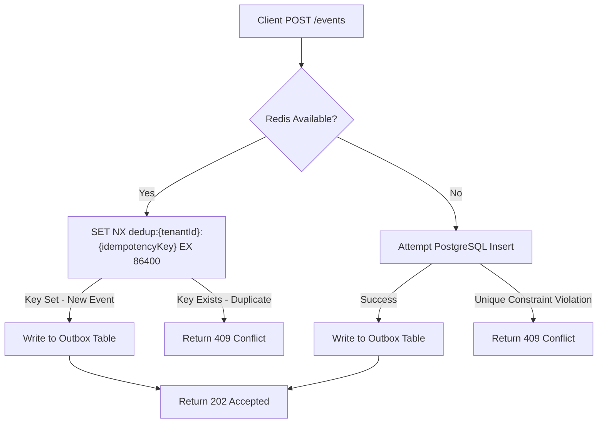
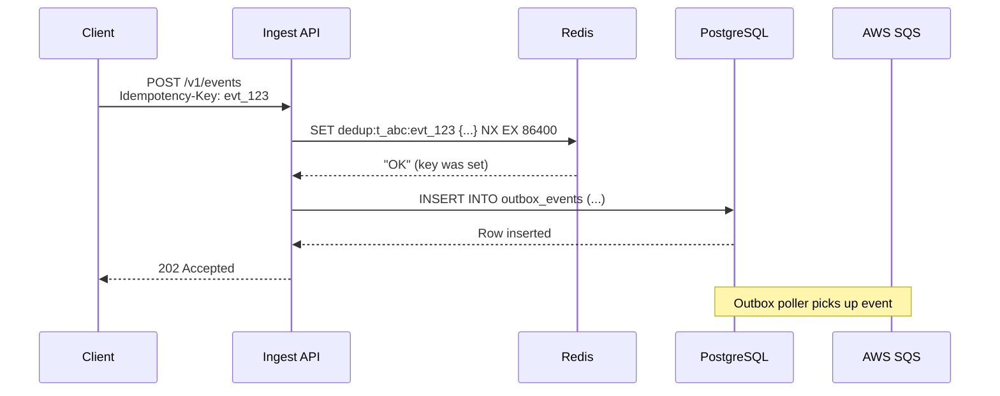
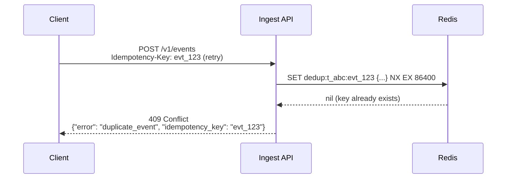
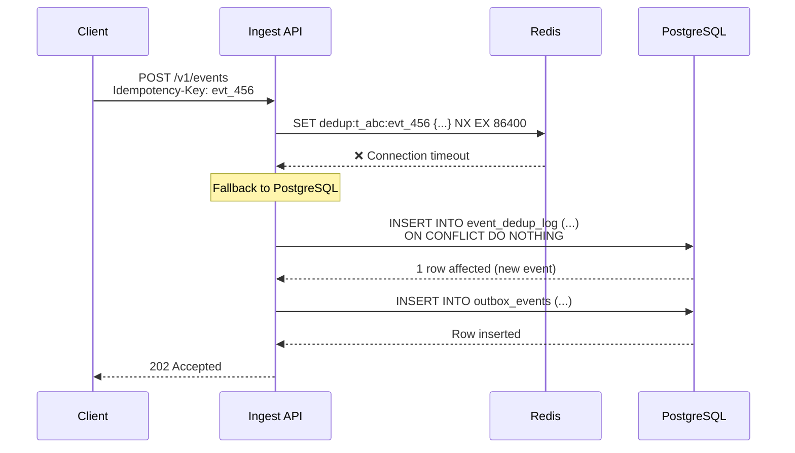
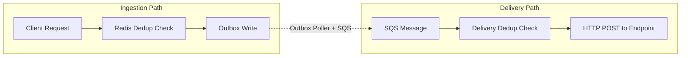
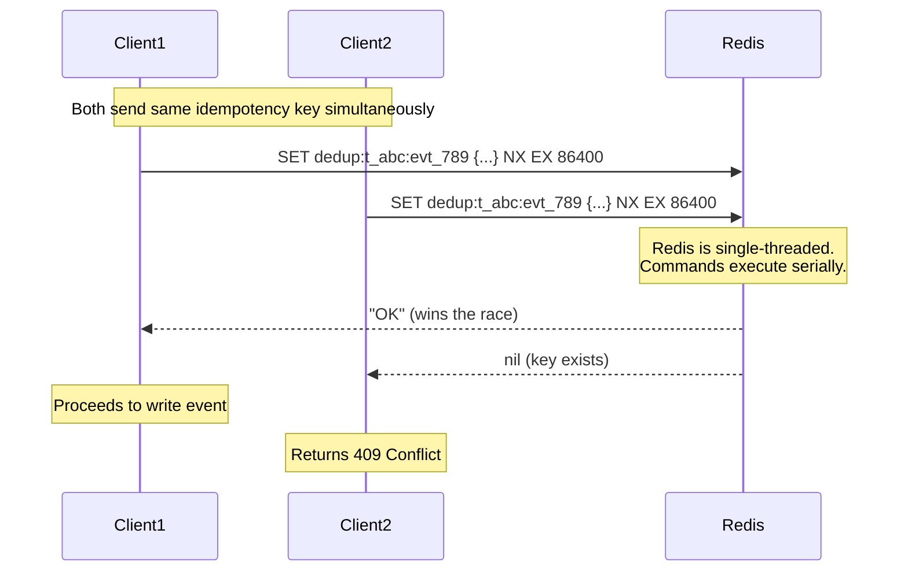
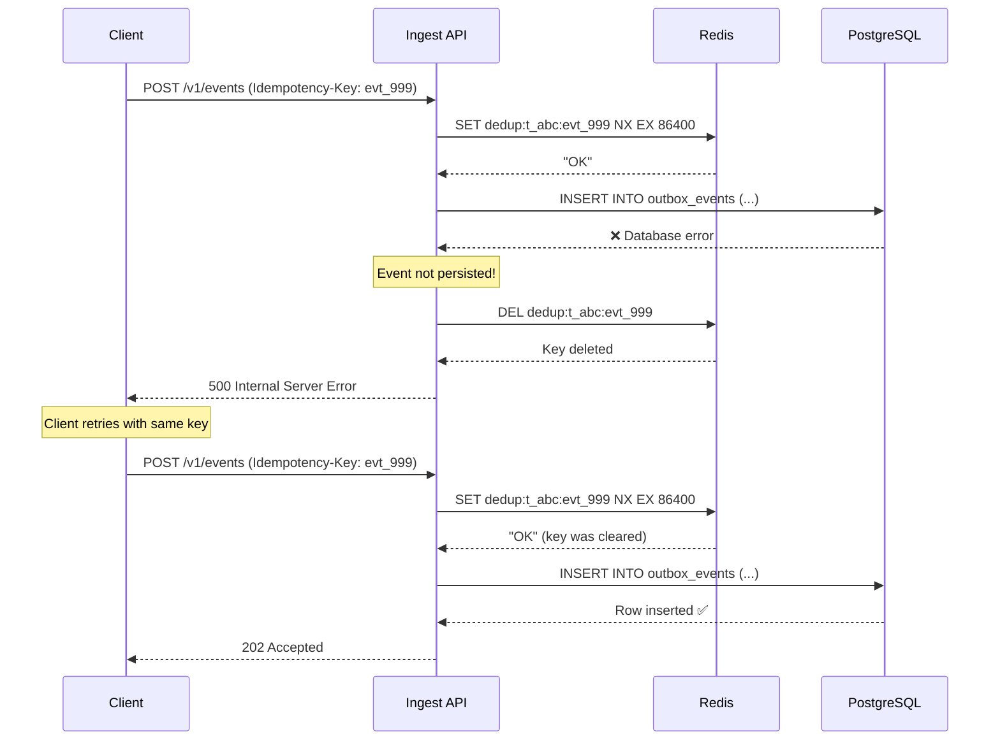

# Redis-Based Event Deduplication

## Overview

EventRelay guarantees **at-least-once delivery**, which means duplicate events can arrive at the ingestion endpoint due to client retries, network issues, or infrastructure failures. Redis-based deduplication provides a fast, atomic mechanism to detect and reject duplicates before they enter the processing pipeline, using the `SET NX` (Set if Not eXists) command with TTL-based key expiry.

> [!IMPORTANT]
> Deduplication is a **best-effort optimization** layered on top of the PostgreSQL unique constraint on `idempotency_key`. Redis handles the fast path; PostgreSQL serves as the authoritative fallback.

---

## Architecture



---

## Dedup Key Format

All deduplication keys follow a consistent naming convention:

```
dedup:{tenantId}:{idempotencyKey}
```

| Component         | Description                                         | Example                                |
|-------------------|-----------------------------------------------------|----------------------------------------|
| `dedup`           | Key namespace prefix                                | `dedup`                                |
| `tenantId`        | UUID of the tenant submitting the event             | `t_abc123`                             |
| `idempotencyKey`  | Client-provided idempotency key from request header | `evt_2024_order_789`                   |
| **Full Key**      | Composite key                                       | `dedup:t_abc123:evt_2024_order_789`    |

> [!NOTE]
> Tenant-scoping the key ensures that idempotency keys are unique **per tenant**, not globally. Two tenants can independently use the same idempotency key without collision.

### Key Length Considerations

```
Average key length: ~50 bytes
  "dedup:"          =  6 bytes
  tenantId (UUID)   = 36 bytes
  ":"               =  1 byte
  idempotencyKey    = ~20–40 bytes (client-defined)
```

At 1 million active dedup keys, memory overhead from keys alone is approximately **50 MB** — well within acceptable limits for a dedicated Redis instance.

---

## TTL Strategy

| Parameter            | Value       | Rationale                                                                 |
|----------------------|-------------|---------------------------------------------------------------------------|
| Default TTL          | 24 hours    | Covers retry windows for most integration patterns                        |
| Minimum TTL          | 1 hour      | Prevents premature key expiry during extended outages                     |
| Maximum TTL          | 72 hours    | Cap to prevent unbounded memory growth                                    |
| Per-tenant override  | Configurable| Enterprise tenants may need longer windows for batch processing           |

```yaml
# application.yml
eventrelay:
  deduplication:
    default-ttl-seconds: 86400    # 24 hours
    min-ttl-seconds: 3600         # 1 hour
    max-ttl-seconds: 259200       # 72 hours
    redis-key-prefix: "dedup"
    fallback-enabled: true        # Use PostgreSQL on Redis failure
```

### Why 24 Hours?

1. **Client retry windows**: Most webhook clients retry for 4–8 hours. 24 hours provides a 3x safety margin.
2. **Memory efficiency**: At 10,000 events/hour, 24h retains ~240K keys × 50 bytes ≈ 12 MB.
3. **Industry alignment**: Stripe uses a 24-hour idempotency window. GitHub uses similar durations.
4. **Batch processing**: Covers daily batch jobs that might retry the same payload.

---

## Redis Commands

### Core Dedup Check — SET NX with EX

```redis
# Atomic set-if-not-exists with TTL
# Returns "OK" if key was set (new event), nil if key already exists (duplicate)
SET dedup:t_abc123:evt_order_789 1 NX EX 86400
```

### Checking Key Existence (Read-Only)

```redis
# Check if key exists without modifying
EXISTS dedup:t_abc123:evt_order_789

# Check remaining TTL
TTL dedup:t_abc123:evt_order_789
```

### Storing Metadata in the Dedup Value

Instead of storing `1`, store a JSON payload for observability:

```redis
SET dedup:t_abc123:evt_order_789 '{"eventId":"e_456","receivedAt":"2024-01-15T10:30:00Z","sourceIp":"10.0.1.5"}' NX EX 86400
```

This allows operators to inspect **when** and **from where** the original event was received when a duplicate is detected.

---

## Java Implementation

### DeduplicationService

```java
package com.eventrelay.dedup;

import io.lettuce.core.SetArgs;
import io.lettuce.core.api.sync.RedisCommands;
import org.slf4j.Logger;
import org.slf4j.LoggerFactory;
import org.springframework.stereotype.Service;

import java.time.Duration;
import java.time.Instant;

@Service
public class DeduplicationService {

    private static final Logger log = LoggerFactory.getLogger(DeduplicationService.class);
    private static final String KEY_PREFIX = "dedup";

    private final RedisCommands<String, String> redisCommands;
    private final DeduplicationProperties properties;
    private final DeduplicationFallbackService fallbackService;

    public DeduplicationService(
            RedisCommands<String, String> redisCommands,
            DeduplicationProperties properties,
            DeduplicationFallbackService fallbackService) {
        this.redisCommands = redisCommands;
        this.properties = properties;
        this.fallbackService = fallbackService;
    }

    /**
     * Attempts to mark an event as seen. Returns true if the event is new
     * (not a duplicate), false if it has been seen before.
     *
     * @param tenantId       the tenant identifier
     * @param idempotencyKey the client-provided idempotency key
     * @return true if the event is new, false if duplicate
     */
    public boolean tryMarkEventAsNew(String tenantId, String idempotencyKey) {
        String key = buildKey(tenantId, idempotencyKey);
        String value = buildValue();
        long ttlSeconds = properties.getDefaultTtlSeconds();

        try {
            String result = redisCommands.set(
                key,
                value,
                SetArgs.Builder.nx().ex(ttlSeconds)
            );

            boolean isNew = "OK".equals(result);

            if (!isNew) {
                log.info("Duplicate event detected: tenantId={}, idempotencyKey={}",
                    tenantId, idempotencyKey);
            }

            return isNew;

        } catch (Exception e) {
            log.warn("Redis unavailable for dedup check, falling back to PostgreSQL: {}",
                e.getMessage());
            return fallbackService.tryMarkEventAsNew(tenantId, idempotencyKey);
        }
    }

    /**
     * Checks if an event has already been processed without marking it.
     * Useful for read-only dedup checks in status endpoints.
     */
    public boolean isDuplicate(String tenantId, String idempotencyKey) {
        String key = buildKey(tenantId, idempotencyKey);
        try {
            return redisCommands.exists(key) > 0;
        } catch (Exception e) {
            log.warn("Redis unavailable for dedup read, falling back: {}", e.getMessage());
            return fallbackService.isDuplicate(tenantId, idempotencyKey);
        }
    }

    /**
     * Removes a dedup key — used when event processing fails and the event
     * should be eligible for resubmission.
     */
    public void removeKey(String tenantId, String idempotencyKey) {
        String key = buildKey(tenantId, idempotencyKey);
        try {
            redisCommands.del(key);
            log.debug("Removed dedup key: {}", key);
        } catch (Exception e) {
            log.warn("Failed to remove dedup key from Redis: {}", e.getMessage());
        }
    }

    private String buildKey(String tenantId, String idempotencyKey) {
        return String.format("%s:%s:%s", KEY_PREFIX, tenantId, idempotencyKey);
    }

    private String buildValue() {
        return String.format("{\"receivedAt\":\"%s\"}", Instant.now().toString());
    }
}
```

### Configuration Properties

```java
package com.eventrelay.dedup;

import org.springframework.boot.context.properties.ConfigurationProperties;
import org.springframework.validation.annotation.Validated;

import jakarta.validation.constraints.Max;
import jakarta.validation.constraints.Min;

@Validated
@ConfigurationProperties(prefix = "eventrelay.deduplication")
public class DeduplicationProperties {

    @Min(3600)
    @Max(259200)
    private long defaultTtlSeconds = 86400;

    private String redisKeyPrefix = "dedup";
    private boolean fallbackEnabled = true;

    // Getters and setters
    public long getDefaultTtlSeconds() { return defaultTtlSeconds; }
    public void setDefaultTtlSeconds(long defaultTtlSeconds) {
        this.defaultTtlSeconds = defaultTtlSeconds;
    }
    public String getRedisKeyPrefix() { return redisKeyPrefix; }
    public void setRedisKeyPrefix(String redisKeyPrefix) {
        this.redisKeyPrefix = redisKeyPrefix;
    }
    public boolean isFallbackEnabled() { return fallbackEnabled; }
    public void setFallbackEnabled(boolean fallbackEnabled) {
        this.fallbackEnabled = fallbackEnabled;
    }
}
```

### PostgreSQL Fallback Service

```java
package com.eventrelay.dedup;

import org.slf4j.Logger;
import org.slf4j.LoggerFactory;
import org.springframework.dao.DuplicateKeyException;
import org.springframework.jdbc.core.JdbcTemplate;
import org.springframework.stereotype.Service;

@Service
public class DeduplicationFallbackService {

    private static final Logger log = LoggerFactory.getLogger(DeduplicationFallbackService.class);

    private final JdbcTemplate jdbcTemplate;

    public DeduplicationFallbackService(JdbcTemplate jdbcTemplate) {
        this.jdbcTemplate = jdbcTemplate;
    }

    /**
     * Fallback dedup using PostgreSQL unique constraint on (tenant_id, idempotency_key).
     * This is slower than Redis but provides durability guarantees.
     */
    public boolean tryMarkEventAsNew(String tenantId, String idempotencyKey) {
        try {
            jdbcTemplate.update(
                """
                INSERT INTO event_dedup_log (tenant_id, idempotency_key, received_at)
                VALUES (?, ?, NOW())
                ON CONFLICT (tenant_id, idempotency_key) DO NOTHING
                """,
                tenantId, idempotencyKey
            );
            // If rows affected = 1, the event is new
            // ON CONFLICT DO NOTHING returns 0 rows affected for duplicates
            return true;
        } catch (DuplicateKeyException e) {
            log.info("Duplicate detected via PostgreSQL fallback: tenantId={}, key={}",
                tenantId, idempotencyKey);
            return false;
        }
    }

    public boolean isDuplicate(String tenantId, String idempotencyKey) {
        Integer count = jdbcTemplate.queryForObject(
            "SELECT COUNT(*) FROM event_dedup_log WHERE tenant_id = ? AND idempotency_key = ?",
            Integer.class, tenantId, idempotencyKey
        );
        return count != null && count > 0;
    }
}
```

### PostgreSQL Dedup Table

```sql
CREATE TABLE event_dedup_log (
    id              BIGSERIAL PRIMARY KEY,
    tenant_id       VARCHAR(64) NOT NULL,
    idempotency_key VARCHAR(255) NOT NULL,
    received_at     TIMESTAMPTZ NOT NULL DEFAULT NOW(),

    CONSTRAINT uq_tenant_idempotency UNIQUE (tenant_id, idempotency_key)
);

-- Index for TTL-based cleanup (periodic job deletes old entries)
CREATE INDEX idx_dedup_received_at ON event_dedup_log (received_at);

-- Partition by tenant for high-volume deployments
-- ALTER TABLE event_dedup_log ADD CONSTRAINT ... PARTITION BY HASH (tenant_id);
```

---

## Sequence Diagrams

### Happy Path — New Event



### Duplicate Event Detected



### Redis Unavailable — Fallback to PostgreSQL



---

## Dedup in Ingestion Path vs. Delivery Path

EventRelay performs deduplication at **two distinct points**:



| Aspect             | Ingestion Path Dedup              | Delivery Path Dedup                     |
|--------------------|-----------------------------------|-----------------------------------------|
| **Purpose**        | Prevent duplicate event creation  | Prevent duplicate webhook delivery      |
| **Key**            | `dedup:{tenantId}:{idempotencyKey}` | `delivery:{eventId}:{endpointId}`      |
| **TTL**            | 24 hours                          | 7 days (covers full retry window)       |
| **Trigger**        | Client submits same idempotency key | SQS delivers same message twice (at-least-once) |
| **Fallback**       | PostgreSQL unique constraint      | PostgreSQL delivery log                 |
| **Performance**    | Critical (synchronous path)       | Important (async path)                  |

### Delivery Path Dedup Implementation

```java
/**
 * Checks if a webhook delivery has already been attempted for this
 * event + endpoint combination. Prevents duplicate deliveries when
 * SQS delivers the same message twice.
 */
public boolean hasBeenDelivered(String eventId, String endpointId) {
    String key = String.format("delivery:%s:%s", eventId, endpointId);
    try {
        return redisCommands.exists(key) > 0;
    } catch (Exception e) {
        log.warn("Redis unavailable for delivery dedup: {}", e.getMessage());
        return deliveryLogRepository.existsByEventIdAndEndpointId(eventId, endpointId);
    }
}

public void markAsDelivered(String eventId, String endpointId) {
    String key = String.format("delivery:%s:%s", eventId, endpointId);
    long ttlSeconds = 604800; // 7 days
    try {
        redisCommands.set(key, "1", SetArgs.Builder.nx().ex(ttlSeconds));
    } catch (Exception e) {
        log.warn("Failed to set delivery dedup key: {}", e.getMessage());
    }
}
```

---

## Concurrent Request Handling

The `SET NX` command is **atomic** in Redis — only one client can set a key that doesn't exist. This guarantees correct behavior under concurrent requests:



### Key Properties of SET NX Atomicity

| Property                  | Guarantee                                                       |
|---------------------------|-----------------------------------------------------------------|
| **Mutual exclusion**      | Exactly one caller succeeds for a given key                     |
| **No race conditions**    | Redis's single-threaded command execution prevents TOCTOU bugs  |
| **No distributed locks**  | SET NX itself acts as a lightweight lock                        |
| **Crash safety**          | TTL ensures keys expire even if the winning caller crashes      |

### Edge Case: SET NX Succeeds but Event Write Fails



> [!WARNING]
> If the Redis `DEL` command also fails after the database error, the event becomes temporarily "blocked" until the TTL expires. For critical events, consider wrapping both operations in a compensating transaction or reducing the TTL for the error case.

---

## Monitoring & Observability

### Key Metrics to Track

```java
@Component
public class DeduplicationMetrics {

    private final MeterRegistry meterRegistry;
    private final Counter newEventCounter;
    private final Counter duplicateCounter;
    private final Counter fallbackCounter;
    private final Timer dedupLatencyTimer;

    public DeduplicationMetrics(MeterRegistry meterRegistry) {
        this.meterRegistry = meterRegistry;
        this.newEventCounter = Counter.builder("eventrelay.dedup.new_events")
            .description("Count of new (non-duplicate) events")
            .register(meterRegistry);
        this.duplicateCounter = Counter.builder("eventrelay.dedup.duplicates")
            .description("Count of duplicate events rejected")
            .register(meterRegistry);
        this.fallbackCounter = Counter.builder("eventrelay.dedup.fallback")
            .description("Count of dedup checks falling back to PostgreSQL")
            .register(meterRegistry);
        this.dedupLatencyTimer = Timer.builder("eventrelay.dedup.latency")
            .description("Latency of dedup check operations")
            .register(meterRegistry);
    }

    // Called from DeduplicationService
    public void recordNewEvent() { newEventCounter.increment(); }
    public void recordDuplicate() { duplicateCounter.increment(); }
    public void recordFallback() { fallbackCounter.increment(); }
    public Timer.Sample startTimer() { return Timer.start(meterRegistry); }
    public void stopTimer(Timer.Sample sample) { sample.stop(dedupLatencyTimer); }
}
```

### Prometheus Alerts

```yaml
groups:
  - name: eventrelay_dedup
    rules:
      - alert: HighDuplicateRate
        expr: rate(eventrelay_dedup_duplicates_total[5m]) / rate(eventrelay_dedup_new_events_total[5m]) > 0.3
        for: 10m
        labels:
          severity: warning
        annotations:
          summary: "High duplicate event rate ({{ $value | humanizePercentage }})"

      - alert: DedupFallbackActive
        expr: rate(eventrelay_dedup_fallback_total[5m]) > 0
        for: 5m
        labels:
          severity: critical
        annotations:
          summary: "Dedup falling back to PostgreSQL — Redis may be unavailable"
```

---

## Production Considerations

1. **Key Collision Probability**: With UUID-based tenant IDs and client-provided idempotency keys, collisions are effectively impossible. However, validate idempotency key length (max 255 chars) and character set (alphanumeric + `-_`) at the API layer.

2. **Redis Cluster Sharding**: Dedup keys are naturally sharded by tenant ID in the key name. No hash tags are needed since each key is independent.

3. **Memory Budgeting**: Reserve dedicated memory for dedup keys. At 10K events/second with 24h TTL: `10,000 × 86,400 × 80 bytes ≈ 64 GB`. For high-throughput deployments, consider reducing TTL or using a dedicated Redis instance for dedup.

4. **Clock Skew**: TTL is relative, not wall-clock based, so clock skew between application servers does not affect dedup correctness.

5. **Testing**: Use Testcontainers with a Redis container for integration tests. Mock Redis failures to verify PostgreSQL fallback behavior.

```java
@Testcontainers
class DeduplicationServiceIntegrationTest {

    @Container
    static GenericContainer<?> redis = new GenericContainer<>("redis:7-alpine")
        .withExposedPorts(6379);

    @Test
    void shouldRejectDuplicateEvent() {
        // First submission — should succeed
        assertTrue(dedupService.tryMarkEventAsNew("tenant-1", "key-abc"));

        // Second submission — should be rejected
        assertFalse(dedupService.tryMarkEventAsNew("tenant-1", "key-abc"));
    }

    @Test
    void shouldAllowResubmissionAfterTtlExpiry() {
        dedupService.tryMarkEventAsNew("tenant-1", "key-xyz");

        // Fast-forward Redis TTL (or use short TTL in test config)
        redis.execInContainer("redis-cli", "DEL", "dedup:tenant-1:key-xyz");

        assertTrue(dedupService.tryMarkEventAsNew("tenant-1", "key-xyz"));
    }
}
```
