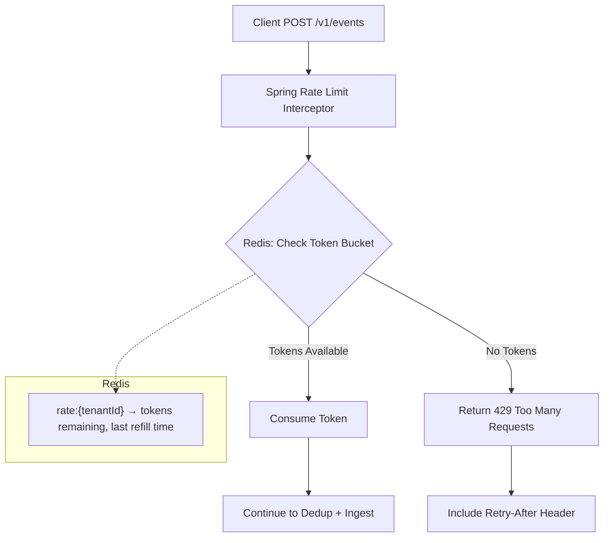
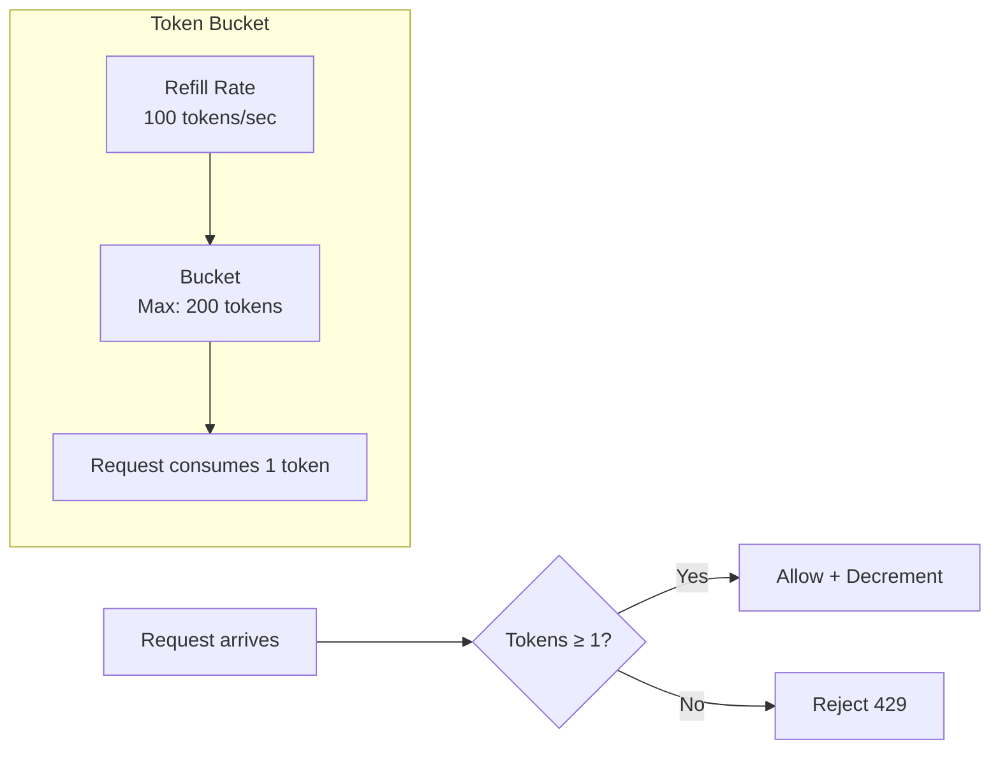

# Token Bucket Rate Limiting with Redis

## Overview

EventRelay enforces per-tenant and per-endpoint rate limits to protect downstream webhook targets from traffic spikes and to ensure fair resource allocation across tenants. The implementation uses a **token bucket algorithm** backed by Redis, with atomic Lua scripts to guarantee correctness under concurrent access.

> [!IMPORTANT]
> Rate limiting is enforced at the **Ingest API** layer, before events enter the outbox. This prevents overloaded tenants from saturating the SQS queue and starving other tenants.

---

## Architecture



---

## Token Bucket Algorithm

The token bucket algorithm allows **burst traffic** up to a maximum bucket capacity while enforcing a sustained rate over time.



### How It Works

1. Each tenant has a bucket initialized with `maxTokens` tokens.
2. Tokens are added at a fixed `refillRate` (tokens per second) up to `maxTokens`.
3. Each API request consumes 1 token.
4. If no tokens remain, the request is rejected with `429 Too Many Requests`.
5. The bucket state (current tokens + last refill timestamp) is stored in Redis.
6. Token refill is calculated lazily on each request — no background refill process needed.

### Configuration Defaults

| Parameter              | Default    | Description                                          |
|------------------------|------------|------------------------------------------------------|
| `maxTokens`            | 200        | Maximum burst size (bucket capacity)                 |
| `refillRate`           | 100        | Tokens added per second (sustained rate)             |
| `tokensPerRequest`     | 1          | Tokens consumed per API call                         |
| Per-tenant override    | Yes        | Stored in tenant configuration                       |
| Per-endpoint override  | Yes        | Endpoint-specific limits for sensitive targets       |

```yaml
# application.yml
eventrelay:
  rate-limiting:
    enabled: true
    default-max-tokens: 200
    default-refill-rate: 100     # tokens per second
    tokens-per-request: 1
    redis-key-prefix: "rate"
    header-enabled: true         # Include rate limit headers in responses
```

---

## Redis Lua Script — Atomic Token Bucket

The entire check-refill-consume operation is executed as a single atomic Lua script on the Redis server. This eliminates race conditions without distributed locks.

```lua
-- token_bucket.lua
-- KEYS[1] = rate limit key (e.g., "rate:t_abc123")
-- ARGV[1] = max tokens (bucket capacity)
-- ARGV[2] = refill rate (tokens per second)
-- ARGV[3] = tokens to consume (typically 1)
-- ARGV[4] = current timestamp in milliseconds
--
-- Returns: {allowed (0/1), remaining_tokens, retry_after_ms}

local key = KEYS[1]
local max_tokens = tonumber(ARGV[1])
local refill_rate = tonumber(ARGV[2])
local tokens_requested = tonumber(ARGV[3])
local now = tonumber(ARGV[4])

-- Get current bucket state
local bucket = redis.call('HMGET', key, 'tokens', 'last_refill')
local current_tokens = tonumber(bucket[1])
local last_refill = tonumber(bucket[2])

-- Initialize bucket if it doesn't exist
if current_tokens == nil then
    current_tokens = max_tokens
    last_refill = now
end

-- Calculate tokens to add since last refill
local elapsed_ms = now - last_refill
local elapsed_seconds = elapsed_ms / 1000.0
local tokens_to_add = elapsed_seconds * refill_rate

-- Refill the bucket (cap at max_tokens)
current_tokens = math.min(max_tokens, current_tokens + tokens_to_add)

-- Update last refill time
last_refill = now

-- Attempt to consume tokens
if current_tokens >= tokens_requested then
    -- Allow the request
    current_tokens = current_tokens - tokens_requested

    -- Persist updated state with 60-second TTL (auto-cleanup for inactive tenants)
    redis.call('HSET', key, 'tokens', current_tokens, 'last_refill', last_refill)
    redis.call('EXPIRE', key, 60)

    return {1, math.floor(current_tokens), 0}
else
    -- Reject the request — calculate retry-after
    local deficit = tokens_requested - current_tokens
    local retry_after_ms = math.ceil((deficit / refill_rate) * 1000)

    -- Still persist the refill calculation
    redis.call('HSET', key, 'tokens', current_tokens, 'last_refill', last_refill)
    redis.call('EXPIRE', key, 60)

    return {0, math.floor(current_tokens), retry_after_ms}
end
```

### Why a Lua Script?

| Approach               | Atomicity | Network Round Trips | Race Conditions |
|------------------------|-----------|---------------------|-----------------|
| GET → compute → SET    | ❌ No     | 3                   | ⚠️ Yes          |
| MULTI/EXEC transaction | ⚠️ Partial| 4+                  | ⚠️ Possible     |
| **Lua script (EVAL)**  | ✅ Yes    | **1**               | **✅ None**     |

> [!NOTE]
> Lua scripts in Redis execute atomically and block the server during execution. Keep scripts short (our script executes in <0.1ms). For Redis Cluster, all keys accessed by the script must map to the same hash slot — ensured here because we use a single key.

---

## Java Implementation

### RateLimiterService

```java
package com.eventrelay.ratelimit;

import io.lettuce.core.ScriptOutputType;
import io.lettuce.core.api.sync.RedisCommands;
import org.slf4j.Logger;
import org.slf4j.LoggerFactory;
import org.springframework.stereotype.Service;

import jakarta.annotation.PostConstruct;
import java.io.IOException;
import java.io.InputStream;
import java.nio.charset.StandardCharsets;
import java.time.Instant;
import java.util.List;

@Service
public class RateLimiterService {

    private static final Logger log = LoggerFactory.getLogger(RateLimiterService.class);

    private final RedisCommands<String, String> redisCommands;
    private final RateLimitProperties properties;
    private final TenantRateLimitRepository tenantRateLimitRepo;
    private String luaScript;
    private String luaScriptSha;

    public RateLimiterService(
            RedisCommands<String, String> redisCommands,
            RateLimitProperties properties,
            TenantRateLimitRepository tenantRateLimitRepo) {
        this.redisCommands = redisCommands;
        this.properties = properties;
        this.tenantRateLimitRepo = tenantRateLimitRepo;
    }

    @PostConstruct
    void loadScript() throws IOException {
        try (InputStream is = getClass().getResourceAsStream("/lua/token_bucket.lua")) {
            if (is == null) throw new IllegalStateException("token_bucket.lua not found");
            this.luaScript = new String(is.readAllBytes(), StandardCharsets.UTF_8);
            this.luaScriptSha = redisCommands.scriptLoad(luaScript);
            log.info("Loaded token bucket Lua script, SHA: {}", luaScriptSha);
        }
    }

    /**
     * Check rate limit for a tenant. Returns a RateLimitResult indicating
     * whether the request is allowed, remaining tokens, and retry-after.
     */
    public RateLimitResult checkRateLimit(String tenantId) {
        TenantRateLimit config = tenantRateLimitRepo
            .findByTenantId(tenantId)
            .orElse(TenantRateLimit.defaults(properties));

        String key = buildKey(tenantId);
        long nowMillis = Instant.now().toEpochMilli();

        try {
            List<Long> result = redisCommands.evalsha(
                luaScriptSha,
                ScriptOutputType.MULTI,
                new String[]{key},
                String.valueOf(config.getMaxTokens()),
                String.valueOf(config.getRefillRate()),
                String.valueOf(properties.getTokensPerRequest()),
                String.valueOf(nowMillis)
            );

            boolean allowed = result.get(0) == 1L;
            long remaining = result.get(1);
            long retryAfterMs = result.get(2);

            return new RateLimitResult(
                allowed,
                config.getMaxTokens(),
                remaining,
                retryAfterMs
            );

        } catch (Exception e) {
            log.error("Rate limit check failed for tenant {}: {}", tenantId, e.getMessage());
            // Fail open: allow the request if Redis is unavailable
            return RateLimitResult.allowed(config.getMaxTokens());
        }
    }

    /**
     * Check rate limit for a specific endpoint under a tenant.
     */
    public RateLimitResult checkEndpointRateLimit(String tenantId, String endpointId) {
        String key = String.format("%s:%s:%s", properties.getRedisKeyPrefix(), tenantId, endpointId);
        // Uses same Lua script with endpoint-specific limits
        EndpointRateLimit config = tenantRateLimitRepo
            .findEndpointLimit(tenantId, endpointId)
            .orElse(EndpointRateLimit.defaults());

        long nowMillis = Instant.now().toEpochMilli();

        try {
            List<Long> result = redisCommands.evalsha(
                luaScriptSha,
                ScriptOutputType.MULTI,
                new String[]{key},
                String.valueOf(config.getMaxTokens()),
                String.valueOf(config.getRefillRate()),
                String.valueOf(1),
                String.valueOf(nowMillis)
            );

            return new RateLimitResult(
                result.get(0) == 1L,
                config.getMaxTokens(),
                result.get(1),
                result.get(2)
            );
        } catch (Exception e) {
            log.error("Endpoint rate limit check failed: {}", e.getMessage());
            return RateLimitResult.allowed(config.getMaxTokens());
        }
    }

    private String buildKey(String tenantId) {
        return String.format("%s:%s", properties.getRedisKeyPrefix(), tenantId);
    }
}
```

### RateLimitResult DTO

```java
package com.eventrelay.ratelimit;

public record RateLimitResult(
    boolean allowed,
    long limit,
    long remaining,
    long retryAfterMs
) {
    public static RateLimitResult allowed(long limit) {
        return new RateLimitResult(true, limit, limit, 0);
    }
}
```

### Spring Interceptor Integration

```java
package com.eventrelay.ratelimit;

import jakarta.servlet.http.HttpServletRequest;
import jakarta.servlet.http.HttpServletResponse;
import org.springframework.http.HttpStatus;
import org.springframework.stereotype.Component;
import org.springframework.web.servlet.HandlerInterceptor;

import com.fasterxml.jackson.databind.ObjectMapper;
import java.util.Map;

@Component
public class RateLimitInterceptor implements HandlerInterceptor {

    private final RateLimiterService rateLimiterService;
    private final ObjectMapper objectMapper;

    public RateLimitInterceptor(RateLimiterService rateLimiterService,
                                 ObjectMapper objectMapper) {
        this.rateLimiterService = rateLimiterService;
        this.objectMapper = objectMapper;
    }

    @Override
    public boolean preHandle(HttpServletRequest request,
                              HttpServletResponse response,
                              Object handler) throws Exception {
        String tenantId = request.getHeader("X-Tenant-Id");
        if (tenantId == null) {
            // Tenant ID extraction handled by auth filter upstream
            return true;
        }

        RateLimitResult result = rateLimiterService.checkRateLimit(tenantId);

        // Always set rate limit headers (RFC 6585 / draft-ietf-httpapi-ratelimit-headers)
        response.setHeader("X-RateLimit-Limit", String.valueOf(result.limit()));
        response.setHeader("X-RateLimit-Remaining", String.valueOf(result.remaining()));

        if (!result.allowed()) {
            long retryAfterSeconds = Math.max(1, result.retryAfterMs() / 1000);
            response.setHeader("Retry-After", String.valueOf(retryAfterSeconds));
            response.setHeader("X-RateLimit-Reset",
                String.valueOf(System.currentTimeMillis() / 1000 + retryAfterSeconds));
            response.setStatus(HttpStatus.TOO_MANY_REQUESTS.value());
            response.setContentType("application/json");
            response.getWriter().write(objectMapper.writeValueAsString(Map.of(
                "error", "rate_limit_exceeded",
                "message", "Rate limit exceeded for tenant " + tenantId,
                "retry_after_seconds", retryAfterSeconds,
                "limit", result.limit(),
                "remaining", result.remaining()
            )));
            return false;
        }

        return true;
    }
}
```

### Interceptor Registration

```java
package com.eventrelay.config;

import com.eventrelay.ratelimit.RateLimitInterceptor;
import org.springframework.context.annotation.Configuration;
import org.springframework.web.servlet.config.annotation.InterceptorRegistry;
import org.springframework.web.servlet.config.annotation.WebMvcConfigurer;

@Configuration
public class WebMvcConfig implements WebMvcConfigurer {

    private final RateLimitInterceptor rateLimitInterceptor;

    public WebMvcConfig(RateLimitInterceptor rateLimitInterceptor) {
        this.rateLimitInterceptor = rateLimitInterceptor;
    }

    @Override
    public void addInterceptors(InterceptorRegistry registry) {
        registry.addInterceptor(rateLimitInterceptor)
            .addPathPatterns("/v1/events/**", "/v1/webhooks/**")
            .excludePathPatterns("/v1/health", "/v1/metrics");
    }
}
```

---

## Rate Limit Response Headers

EventRelay follows the [IETF RateLimit Header Fields draft](https://datatracker.ietf.org/doc/draft-ietf-httpapi-ratelimit-headers/) specification:

| Header                  | Description                                       | Example      |
|-------------------------|---------------------------------------------------|--------------|
| `X-RateLimit-Limit`     | Maximum requests allowed in the window            | `200`        |
| `X-RateLimit-Remaining` | Remaining requests in current window              | `147`        |
| `X-RateLimit-Reset`     | Unix timestamp when the limit fully resets         | `1705312800` |
| `Retry-After`           | Seconds until the client should retry (on 429)    | `2`          |

### Example 429 Response

```json
HTTP/1.1 429 Too Many Requests
Content-Type: application/json
X-RateLimit-Limit: 200
X-RateLimit-Remaining: 0
Retry-After: 2
X-RateLimit-Reset: 1705312802

{
  "error": "rate_limit_exceeded",
  "message": "Rate limit exceeded for tenant t_abc123",
  "retry_after_seconds": 2,
  "limit": 200,
  "remaining": 0
}
```

---

## Per-Tenant & Per-Endpoint Rate Limits

### Tenant Rate Limit Configuration

```sql
CREATE TABLE tenant_rate_limits (
    tenant_id     VARCHAR(64) PRIMARY KEY,
    max_tokens    INTEGER NOT NULL DEFAULT 200,
    refill_rate   INTEGER NOT NULL DEFAULT 100,      -- tokens per second
    tier          VARCHAR(20) NOT NULL DEFAULT 'standard',
    updated_at    TIMESTAMPTZ NOT NULL DEFAULT NOW()
);

-- Example tier configurations
INSERT INTO tenant_rate_limits (tenant_id, max_tokens, refill_rate, tier) VALUES
    ('t_free_tier',       50,    25,  'free'),
    ('t_standard',        200,   100, 'standard'),
    ('t_enterprise',      2000,  1000, 'enterprise');
```

### Rate Limit Tiers

| Tier          | Max Tokens (Burst) | Refill Rate (req/s) | Monthly Volume Estimate |
|---------------|--------------------|--------------------|-------------------------|
| Free          | 50                 | 25                 | ~65M events             |
| Standard      | 200                | 100                | ~260M events            |
| Enterprise    | 2,000              | 1,000              | ~2.6B events            |
| Custom        | Configurable       | Configurable       | Negotiated              |

### Per-Endpoint Rate Limits

```sql
CREATE TABLE endpoint_rate_limits (
    endpoint_id   VARCHAR(64) NOT NULL,
    tenant_id     VARCHAR(64) NOT NULL,
    max_tokens    INTEGER NOT NULL DEFAULT 50,
    refill_rate   INTEGER NOT NULL DEFAULT 20,
    PRIMARY KEY (tenant_id, endpoint_id)
);
```

This allows tenants to protect specific downstream endpoints that have lower capacity:

```json
{
  "endpoint_id": "ep_fragile_crm",
  "max_tokens": 10,
  "refill_rate": 5,
  "reason": "CRM API rate-limited to 5 req/s"
}
```

---

## Sliding Window Alternative

For use cases where **precise per-second accuracy** matters more than burst tolerance, EventRelay supports a sliding window counter as an alternative:

```lua
-- sliding_window.lua
-- Sliding window rate limiter using sorted sets
-- KEYS[1] = rate limit key
-- ARGV[1] = window size in milliseconds
-- ARGV[2] = max requests in window
-- ARGV[3] = current timestamp in milliseconds
-- ARGV[4] = unique request ID

local key = KEYS[1]
local window_ms = tonumber(ARGV[1])
local max_requests = tonumber(ARGV[2])
local now = tonumber(ARGV[3])
local request_id = ARGV[4]

-- Remove expired entries
local window_start = now - window_ms
redis.call('ZREMRANGEBYSCORE', key, '-inf', window_start)

-- Count current requests in window
local current_count = redis.call('ZCARD', key)

if current_count < max_requests then
    -- Allow: add this request to the window
    redis.call('ZADD', key, now, request_id)
    redis.call('PEXPIRE', key, window_ms)
    return {1, max_requests - current_count - 1, 0}
else
    -- Reject: calculate when the oldest entry expires
    local oldest = redis.call('ZRANGE', key, 0, 0, 'WITHSCORES')
    local retry_after = 0
    if #oldest > 0 then
        retry_after = tonumber(oldest[2]) + window_ms - now
    end
    return {0, 0, retry_after}
end
```

### Token Bucket vs. Sliding Window

| Characteristic       | Token Bucket              | Sliding Window               |
|----------------------|---------------------------|------------------------------|
| Burst handling       | ✅ Allows controlled burst | ❌ Strict per-window limit   |
| Memory usage         | O(1) per key              | O(n) per key (n = requests)  |
| Precision            | ⚠️ Approximate             | ✅ Exact count               |
| Redis operations     | HSET (2 fields)           | ZADD + ZREMRANGEBYSCORE      |
| **Recommended for**  | **General API limiting**  | **Billing / compliance**     |

> [!TIP]
> Use the **token bucket** for the ingestion API (allows burst, low memory) and the **sliding window** for billing-critical endpoints where exact counts matter.

---

## Performance Characteristics

### Latency Benchmarks

| Operation                        | p50     | p99     | p99.9   |
|----------------------------------|---------|---------|---------|
| Lua script execution (Redis)    | 0.05ms  | 0.15ms  | 0.3ms   |
| Full rate limit check (app)     | 0.3ms   | 1.2ms   | 3ms     |
| Network RTT (same AZ)           | 0.2ms   | 0.8ms   | 2ms     |

### Throughput

- Single Redis instance: **~200,000 rate limit checks/second**
- With Redis Cluster (3 shards): **~600,000 checks/second**
- Application overhead: Negligible compared to Redis RTT

### Memory Usage

Token bucket uses 2 hash fields per tenant:

```
Per key: ~100 bytes (key name + 2 hash fields + metadata)
10,000 active tenants: ~1 MB
100,000 active tenants: ~10 MB
```

---

## Fail-Open vs. Fail-Closed

> [!WARNING]
> EventRelay defaults to **fail-open** — if Redis is unavailable, rate limiting is bypassed and all requests are allowed. This prioritizes availability over strict rate enforcement.

```java
// In RateLimiterService.checkRateLimit():
} catch (Exception e) {
    log.error("Rate limit check failed, failing open: {}", e.getMessage());
    meterRegistry.counter("eventrelay.ratelimit.failopen").increment();
    return RateLimitResult.allowed(config.getMaxTokens());
}
```

For deployments requiring strict rate enforcement (e.g., billing), configure **fail-closed** behavior:

```yaml
eventrelay:
  rate-limiting:
    fail-mode: closed  # Reject requests if Redis is unavailable
```

---

## Monitoring

```yaml
# Prometheus alert rules
groups:
  - name: eventrelay_ratelimit
    rules:
      - alert: HighRateLimitRejections
        expr: >
          sum(rate(eventrelay_ratelimit_rejected_total[5m])) by (tenant_id)
          / sum(rate(eventrelay_ratelimit_total[5m])) by (tenant_id) > 0.1
        for: 5m
        labels:
          severity: warning
        annotations:
          summary: "Tenant {{ $labels.tenant_id }} exceeding rate limit (>10% rejection)"

      - alert: RateLimitFailOpen
        expr: rate(eventrelay_ratelimit_failopen_total[5m]) > 0
        for: 2m
        labels:
          severity: critical
        annotations:
          summary: "Rate limiting failing open — Redis may be unavailable"
```

---

## Production Considerations

1. **Script Caching**: The Lua script is loaded once via `SCRIPT LOAD` and executed via `EVALSHA` to avoid re-parsing on every call. If Redis is restarted, the script is automatically reloaded on the next `@PostConstruct`.

2. **Clock Precision**: Use `Instant.now().toEpochMilli()` for millisecond precision. Server clock drift between application instances is acceptable because each request calculates elapsed time independently.

3. **Redis Cluster**: Ensure all keys for a single tenant hash to the same slot. Since the Lua script uses a single `KEYS[1]`, this is inherently satisfied.

4. **Hot Key Mitigation**: High-volume tenants (enterprise tier) may create hot keys. Consider prefixing with a random shard: `rate:{shard}:{tenantId}` and aggregating across shards.

5. **Graceful Degradation**: When approaching rate limits, consider returning `X-RateLimit-Remaining` headers early so clients can proactively throttle before hitting 429s.
