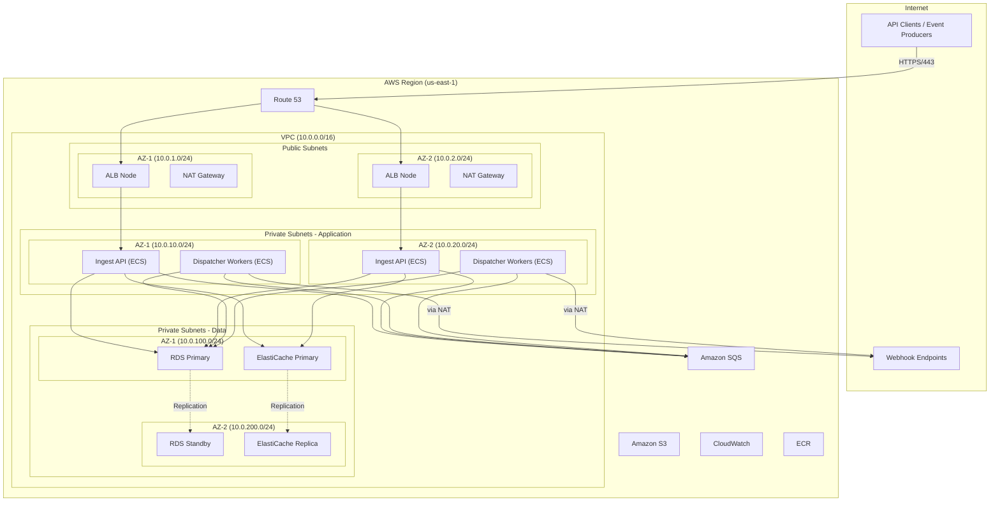
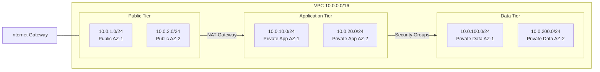
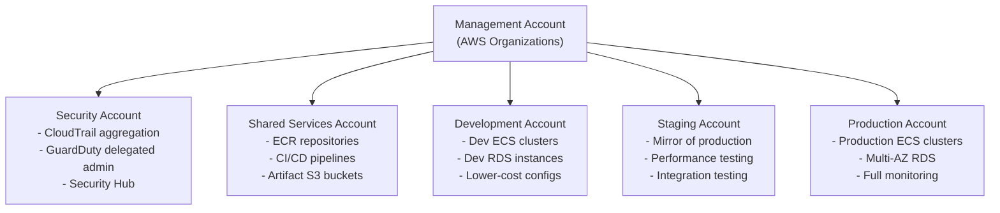

# AWS Architecture

## Overview

EventRelay's AWS architecture is designed for **high availability**, **security**, and **cost efficiency**. The platform runs across two Availability Zones (AZs) in a single AWS region, with strict network isolation between tiers. This document covers the overall cloud topology, service placement, networking strategy, and cost projections.

> [!IMPORTANT]
> All production deployments MUST span at least 2 Availability Zones. Single-AZ deployments are acceptable only for development environments.

---

## Architecture Diagram



---

## VPC Design

### CIDR Planning

| Component | CIDR Block | Usable IPs | Purpose |
|---|---|---|---|
| **VPC** | `10.0.0.0/16` | 65,536 | Overall VPC |
| **Public Subnet AZ-1** | `10.0.1.0/24` | 251 | ALB, NAT Gateway |
| **Public Subnet AZ-2** | `10.0.2.0/24` | 251 | ALB, NAT Gateway |
| **Private App Subnet AZ-1** | `10.0.10.0/24` | 251 | ECS Tasks (Ingest, Dispatcher) |
| **Private App Subnet AZ-2** | `10.0.20.0/24` | 251 | ECS Tasks (Ingest, Dispatcher) |
| **Private Data Subnet AZ-1** | `10.0.100.0/24` | 251 | RDS, ElastiCache |
| **Private Data Subnet AZ-2** | `10.0.200.0/24` | 251 | RDS, ElastiCache |
| **Reserved** | `10.0.0.0/24`, `10.0.30-99.0/24` | — | Future expansion |

> [!TIP]
> The `/24` subnet size provides 251 usable IPs per subnet. Each ECS Fargate task in `awsvpc` mode consumes one ENI (and one IP), so this supports up to ~250 tasks per subnet. For larger deployments, use `/20` subnets (4,091 IPs).

### Subnet Architecture



---

## Service Placement

### Tier Mapping

| Service | Tier | Subnet | Justification |
|---|---|---|---|
| **Application Load Balancer** | Public | `10.0.1.0/24`, `10.0.2.0/24` | Internet-facing, SSL termination |
| **NAT Gateway** | Public | `10.0.1.0/24`, `10.0.2.0/24` | Outbound internet for private subnets |
| **Ingest API (ECS)** | Private App | `10.0.10.0/24`, `10.0.20.0/24` | No direct internet exposure |
| **Dispatcher Workers (ECS)** | Private App | `10.0.10.0/24`, `10.0.20.0/24` | Outbound via NAT for webhook delivery |
| **PostgreSQL (RDS)** | Private Data | `10.0.100.0/24`, `10.0.200.0/24` | Maximum isolation |
| **Redis (ElastiCache)** | Private Data | `10.0.100.0/24`, `10.0.200.0/24` | Maximum isolation |

### Why Three Tiers?

1. **Public Tier** — Only ALB and NAT Gateway have public IPs. No application code runs here.
2. **Application Tier** — ECS tasks run here with no direct internet access. Outbound traffic goes via NAT Gateway (needed for Dispatcher workers to reach webhook endpoints).
3. **Data Tier** — Databases have no internet access at all. Accessible only from the application tier via security group rules.

---

## Internet Access Strategy

### Inbound Traffic Flow

```
Client → Route 53 (DNS) → ALB (Public Subnet) → ECS Ingest API (Private App Subnet)
```

- Route 53 resolves `api.eventrelay.io` to the ALB's public DNS
- ALB terminates TLS (ACM certificate) and forwards HTTP to ECS target groups
- ECS tasks have **no public IPs** — they are reachable only via the ALB

### Outbound Traffic Flow

```
Dispatcher Worker (Private Subnet) → NAT Gateway (Public Subnet) → Internet → Webhook Endpoint
```

- Dispatcher workers must reach external webhook endpoints (outbound HTTP/HTTPS)
- NAT Gateway provides outbound internet access from private subnets
- All outbound traffic appears from the NAT Gateway's Elastic IP (useful for IP allowlisting)

> [!NOTE]
> For services that only need AWS API access (SQS, S3, CloudWatch), use **VPC Endpoints** instead of NAT Gateway to reduce costs and improve latency. See [Networking.md](./Networking.md) for VPC Endpoint configuration.

### NAT Gateway Configuration

```yaml
# One NAT Gateway per AZ for high availability
NAT Gateway AZ-1:
  Subnet: Public AZ-1 (10.0.1.0/24)
  Elastic IP: eip-nat-az1
  Route Table: Private subnets AZ-1

NAT Gateway AZ-2:
  Subnet: Public AZ-2 (10.0.2.0/24)
  Elastic IP: eip-nat-az2
  Route Table: Private subnets AZ-2
```

> [!WARNING]
> NAT Gateways cost ~$32/month each plus $0.045/GB data processed. With two NAT Gateways, that's ~$64/month baseline. Use VPC Endpoints for SQS and S3 to significantly reduce NAT traffic and costs.

---

## AWS Account Structure

### Recommended Multi-Account Strategy



### Account Responsibilities

| Account | Purpose | Key Services |
|---|---|---|
| **Management** | Organization root, billing, SCPs | AWS Organizations, SSO, Cost Explorer |
| **Security** | Centralized security monitoring | CloudTrail, GuardDuty, Security Hub, Config |
| **Shared Services** | CI/CD, shared container registry | ECR, CodePipeline, S3 artifacts |
| **Development** | Developer sandbox | ECS (minimal), RDS (single-AZ), no HA |
| **Staging** | Pre-production validation | Mirrors production topology at smaller scale |
| **Production** | Live traffic | Full HA, Multi-AZ, monitoring, alerting |

> [!TIP]
> For startups or small teams, a minimum of 3 accounts is recommended: **Development**, **Staging**, and **Production**. The security and shared services functions can be consolidated into the management account initially.

### Service Control Policies (SCPs)

```json
{
  "Version": "2012-10-17",
  "Statement": [
    {
      "Sid": "DenyRegionsOutsideUsEast1",
      "Effect": "Deny",
      "Action": "*",
      "Resource": "*",
      "Condition": {
        "StringNotEquals": {
          "aws:RequestedRegion": ["us-east-1", "us-west-2"]
        },
        "ArnNotLike": {
          "aws:PrincipalARN": "arn:aws:iam::*:role/OrganizationAdmin"
        }
      }
    },
    {
      "Sid": "DenyLeaveOrganization",
      "Effect": "Deny",
      "Action": "organizations:LeaveOrganization",
      "Resource": "*"
    },
    {
      "Sid": "DenyDisableCloudTrail",
      "Effect": "Deny",
      "Action": [
        "cloudtrail:StopLogging",
        "cloudtrail:DeleteTrail"
      ],
      "Resource": "*"
    }
  ]
}
```

---

## Key AWS Services

### Core Services

| Service | Usage | Configuration |
|---|---|---|
| **ECS Fargate** | Application hosting | Ingest API + Dispatcher Workers |
| **RDS PostgreSQL** | Event store, outbox, subscriptions | Multi-AZ, 15.x, db.r6g.large |
| **ElastiCache Redis** | Rate limiting, dedup cache | Cluster mode, cache.r6g.large |
| **SQS** | Event queue for dispatch | Standard queue, 14-day retention |
| **ALB** | Load balancing, TLS termination | Internet-facing, WAF-enabled |

### Supporting Services

| Service | Usage | Configuration |
|---|---|---|
| **Route 53** | DNS management | Alias records to ALB |
| **ACM** | TLS certificates | Auto-renewed, *.eventrelay.io |
| **ECR** | Container registry | Image scanning enabled |
| **CloudWatch** | Logs, metrics, alarms | 30-day log retention |
| **S3** | Payload archival, logs, artifacts | Lifecycle policies, SSE-S3 |
| **Secrets Manager** | Database creds, API keys | Auto-rotation enabled |
| **WAF** | Web application firewall | Rate limiting, SQL injection protection |

---

## CloudFormation — VPC Stack

```yaml
AWSTemplateFormatVersion: '2010-09-09'
Description: EventRelay VPC with 2 AZs, public and private subnets

Parameters:
  EnvironmentName:
    Type: String
    Default: production
    AllowedValues: [development, staging, production]

  VpcCidr:
    Type: String
    Default: '10.0.0.0/16'

Mappings:
  SubnetConfig:
    PublicSubnet1:
      CIDR: '10.0.1.0/24'
    PublicSubnet2:
      CIDR: '10.0.2.0/24'
    PrivateAppSubnet1:
      CIDR: '10.0.10.0/24'
    PrivateAppSubnet2:
      CIDR: '10.0.20.0/24'
    PrivateDataSubnet1:
      CIDR: '10.0.100.0/24'
    PrivateDataSubnet2:
      CIDR: '10.0.200.0/24'

Resources:
  # ---- VPC ----
  VPC:
    Type: AWS::EC2::VPC
    Properties:
      CidrBlock: !Ref VpcCidr
      EnableDnsSupport: true
      EnableDnsHostnames: true
      Tags:
        - Key: Name
          Value: !Sub '${EnvironmentName}-eventrelay-vpc'

  InternetGateway:
    Type: AWS::EC2::InternetGateway
    Properties:
      Tags:
        - Key: Name
          Value: !Sub '${EnvironmentName}-igw'

  InternetGatewayAttachment:
    Type: AWS::EC2::VPCGatewayAttachment
    Properties:
      VpcId: !Ref VPC
      InternetGatewayId: !Ref InternetGateway

  # ---- Public Subnets ----
  PublicSubnet1:
    Type: AWS::EC2::Subnet
    Properties:
      VpcId: !Ref VPC
      CidrBlock: !FindInMap [SubnetConfig, PublicSubnet1, CIDR]
      AvailabilityZone: !Select [0, !GetAZs '']
      MapPublicIpOnLaunch: true
      Tags:
        - Key: Name
          Value: !Sub '${EnvironmentName}-public-az1'

  PublicSubnet2:
    Type: AWS::EC2::Subnet
    Properties:
      VpcId: !Ref VPC
      CidrBlock: !FindInMap [SubnetConfig, PublicSubnet2, CIDR]
      AvailabilityZone: !Select [1, !GetAZs '']
      MapPublicIpOnLaunch: true
      Tags:
        - Key: Name
          Value: !Sub '${EnvironmentName}-public-az2'

  # ---- Private App Subnets ----
  PrivateAppSubnet1:
    Type: AWS::EC2::Subnet
    Properties:
      VpcId: !Ref VPC
      CidrBlock: !FindInMap [SubnetConfig, PrivateAppSubnet1, CIDR]
      AvailabilityZone: !Select [0, !GetAZs '']
      Tags:
        - Key: Name
          Value: !Sub '${EnvironmentName}-private-app-az1'

  PrivateAppSubnet2:
    Type: AWS::EC2::Subnet
    Properties:
      VpcId: !Ref VPC
      CidrBlock: !FindInMap [SubnetConfig, PrivateAppSubnet2, CIDR]
      AvailabilityZone: !Select [1, !GetAZs '']
      Tags:
        - Key: Name
          Value: !Sub '${EnvironmentName}-private-app-az2'

  # ---- Private Data Subnets ----
  PrivateDataSubnet1:
    Type: AWS::EC2::Subnet
    Properties:
      VpcId: !Ref VPC
      CidrBlock: !FindInMap [SubnetConfig, PrivateDataSubnet1, CIDR]
      AvailabilityZone: !Select [0, !GetAZs '']
      Tags:
        - Key: Name
          Value: !Sub '${EnvironmentName}-private-data-az1'

  PrivateDataSubnet2:
    Type: AWS::EC2::Subnet
    Properties:
      VpcId: !Ref VPC
      CidrBlock: !FindInMap [SubnetConfig, PrivateDataSubnet2, CIDR]
      AvailabilityZone: !Select [1, !GetAZs '']
      Tags:
        - Key: Name
          Value: !Sub '${EnvironmentName}-private-data-az2'

  # ---- NAT Gateways ----
  NatEIP1:
    Type: AWS::EC2::EIP
    Properties:
      Domain: vpc

  NatEIP2:
    Type: AWS::EC2::EIP
    Properties:
      Domain: vpc

  NatGateway1:
    Type: AWS::EC2::NatGateway
    Properties:
      AllocationId: !GetAtt NatEIP1.AllocationId
      SubnetId: !Ref PublicSubnet1
      Tags:
        - Key: Name
          Value: !Sub '${EnvironmentName}-nat-az1'

  NatGateway2:
    Type: AWS::EC2::NatGateway
    Properties:
      AllocationId: !GetAtt NatEIP2.AllocationId
      SubnetId: !Ref PublicSubnet2
      Tags:
        - Key: Name
          Value: !Sub '${EnvironmentName}-nat-az2'

  # ---- Route Tables ----
  PublicRouteTable:
    Type: AWS::EC2::RouteTable
    Properties:
      VpcId: !Ref VPC
      Tags:
        - Key: Name
          Value: !Sub '${EnvironmentName}-public-rt'

  PublicRoute:
    Type: AWS::EC2::Route
    DependsOn: InternetGatewayAttachment
    Properties:
      RouteTableId: !Ref PublicRouteTable
      DestinationCidrBlock: '0.0.0.0/0'
      GatewayId: !Ref InternetGateway

  PublicSubnet1RouteTableAssoc:
    Type: AWS::EC2::SubnetRouteTableAssociation
    Properties:
      SubnetId: !Ref PublicSubnet1
      RouteTableId: !Ref PublicRouteTable

  PublicSubnet2RouteTableAssoc:
    Type: AWS::EC2::SubnetRouteTableAssociation
    Properties:
      SubnetId: !Ref PublicSubnet2
      RouteTableId: !Ref PublicRouteTable

  PrivateRouteTable1:
    Type: AWS::EC2::RouteTable
    Properties:
      VpcId: !Ref VPC
      Tags:
        - Key: Name
          Value: !Sub '${EnvironmentName}-private-rt-az1'

  PrivateRoute1:
    Type: AWS::EC2::Route
    Properties:
      RouteTableId: !Ref PrivateRouteTable1
      DestinationCidrBlock: '0.0.0.0/0'
      NatGatewayId: !Ref NatGateway1

  PrivateAppSubnet1RouteTableAssoc:
    Type: AWS::EC2::SubnetRouteTableAssociation
    Properties:
      SubnetId: !Ref PrivateAppSubnet1
      RouteTableId: !Ref PrivateRouteTable1

  PrivateDataSubnet1RouteTableAssoc:
    Type: AWS::EC2::SubnetRouteTableAssociation
    Properties:
      SubnetId: !Ref PrivateDataSubnet1
      RouteTableId: !Ref PrivateRouteTable1

  PrivateRouteTable2:
    Type: AWS::EC2::RouteTable
    Properties:
      VpcId: !Ref VPC
      Tags:
        - Key: Name
          Value: !Sub '${EnvironmentName}-private-rt-az2'

  PrivateRoute2:
    Type: AWS::EC2::Route
    Properties:
      RouteTableId: !Ref PrivateRouteTable2
      DestinationCidrBlock: '0.0.0.0/0'
      NatGatewayId: !Ref NatGateway2

  PrivateAppSubnet2RouteTableAssoc:
    Type: AWS::EC2::SubnetRouteTableAssociation
    Properties:
      SubnetId: !Ref PrivateAppSubnet2
      RouteTableId: !Ref PrivateRouteTable2

  PrivateDataSubnet2RouteTableAssoc:
    Type: AWS::EC2::SubnetRouteTableAssociation
    Properties:
      SubnetId: !Ref PrivateDataSubnet2
      RouteTableId: !Ref PrivateRouteTable2

Outputs:
  VpcId:
    Value: !Ref VPC
    Export:
      Name: !Sub '${EnvironmentName}-VpcId'

  PublicSubnetIds:
    Value: !Join [',', [!Ref PublicSubnet1, !Ref PublicSubnet2]]
    Export:
      Name: !Sub '${EnvironmentName}-PublicSubnetIds'

  PrivateAppSubnetIds:
    Value: !Join [',', [!Ref PrivateAppSubnet1, !Ref PrivateAppSubnet2]]
    Export:
      Name: !Sub '${EnvironmentName}-PrivateAppSubnetIds'

  PrivateDataSubnetIds:
    Value: !Join [',', [!Ref PrivateDataSubnet1, !Ref PrivateDataSubnet2]]
    Export:
      Name: !Sub '${EnvironmentName}-PrivateDataSubnetIds'
```

---

## Cost Estimates

### Monthly Cost Breakdown

| Service | Small (Dev) | Medium (Staging) | Large (Production) |
|---|---|---|---|
| **ECS Fargate** | $35 (2 tasks × 0.25 vCPU) | $180 (4 tasks × 0.5 vCPU) | $720 (8 tasks × 1 vCPU) |
| **RDS PostgreSQL** | $30 (db.t3.micro, single-AZ) | $180 (db.r6g.large, single-AZ) | $460 (db.r6g.large, Multi-AZ) |
| **ElastiCache Redis** | $13 (cache.t3.micro) | $130 (cache.r6g.large) | $260 (cache.r6g.large, replica) |
| **ALB** | $22 | $22 | $22 + LCU costs (~$40) |
| **NAT Gateway** | $32 (1 NAT) | $64 (2 NAT) | $64 + data (~$100) |
| **SQS** | $1 | $5 | $25 |
| **S3** | $1 | $5 | $25 |
| **CloudWatch** | $5 | $15 | $50 |
| **Route 53** | $1 | $1 | $2 |
| **Secrets Manager** | $2 | $2 | $5 |
| **ECR** | $1 | $2 | $5 |
| **WAF** | — | $10 | $30 |
| **Total** | **~$143/mo** | **~$616/mo** | **~$1,808/mo** |

> [!NOTE]
> Estimates are based on us-east-1 pricing as of 2024. Actual costs vary by traffic volume, data transfer, and usage patterns. Use AWS Cost Explorer and set up AWS Budgets to monitor spending.

### Cost Optimization Opportunities

| Strategy | Potential Savings | Complexity |
|---|---|---|
| VPC Endpoints for SQS/S3 | $30–60/mo (NAT data reduction) | Low |
| Fargate Spot for Dispatchers | 50–70% on Dispatcher compute | Medium |
| RDS Reserved Instances (1-year) | ~35% on RDS | Low |
| ElastiCache Reserved Nodes | ~35% on Redis | Low |
| S3 Lifecycle Policies | 40–70% on storage | Low |
| Right-sizing ECS tasks | 10–30% on Fargate | Medium |

See [Cost_Optimization.md](./Cost_Optimization.md) for detailed optimization strategies.

---

## Production Considerations

### High Availability Checklist

- [ ] ECS services spread across 2+ AZs
- [ ] RDS Multi-AZ enabled
- [ ] ElastiCache with replica in second AZ
- [ ] NAT Gateway in each AZ
- [ ] ALB spanning all public subnets
- [ ] SQS (inherently HA, regional service)

### Disaster Recovery

| Strategy | RPO | RTO | Cost |
|---|---|---|---|
| **Multi-AZ (default)** | 0 | < 5 min | Included in Multi-AZ pricing |
| **Cross-Region Read Replica** | < 1 min | 15–30 min | ~60% additional RDS cost |
| **Full Cross-Region Active-Active** | 0 | < 1 min | ~100% additional cost |

### Tagging Strategy

All resources MUST be tagged with:

```yaml
Tags:
  - Key: Project
    Value: eventrelay
  - Key: Environment
    Value: production | staging | development
  - Key: Service
    Value: ingest-api | dispatcher | database | cache
  - Key: Owner
    Value: platform-team
  - Key: CostCenter
    Value: engineering
  - Key: ManagedBy
    Value: cloudformation
```

---

## Related Documents

- [ECS_Fargate.md](./ECS_Fargate.md) — ECS task definitions and service configuration
- [Networking.md](./Networking.md) — Security groups, NACLs, VPC endpoints
- [Load_Balancer.md](./Load_Balancer.md) — ALB configuration and SSL termination
- [IAM.md](./IAM.md) — IAM roles and policies
- [Cost_Optimization.md](./Cost_Optimization.md) — Detailed cost optimization strategies
