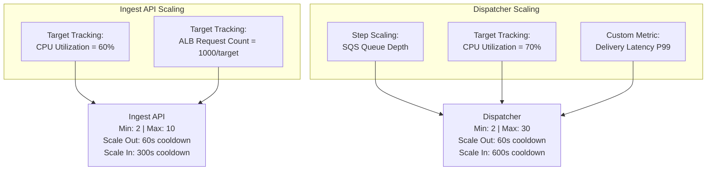
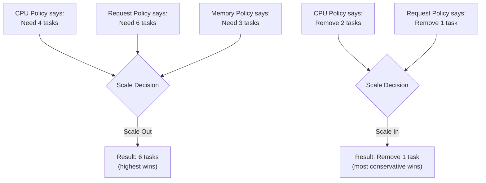
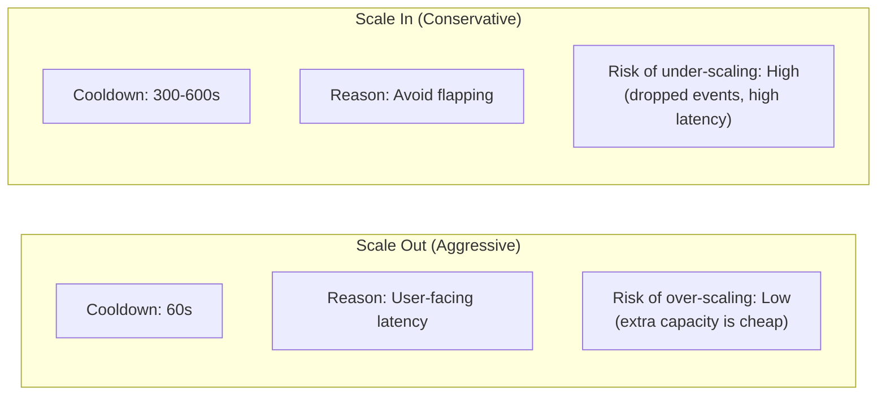
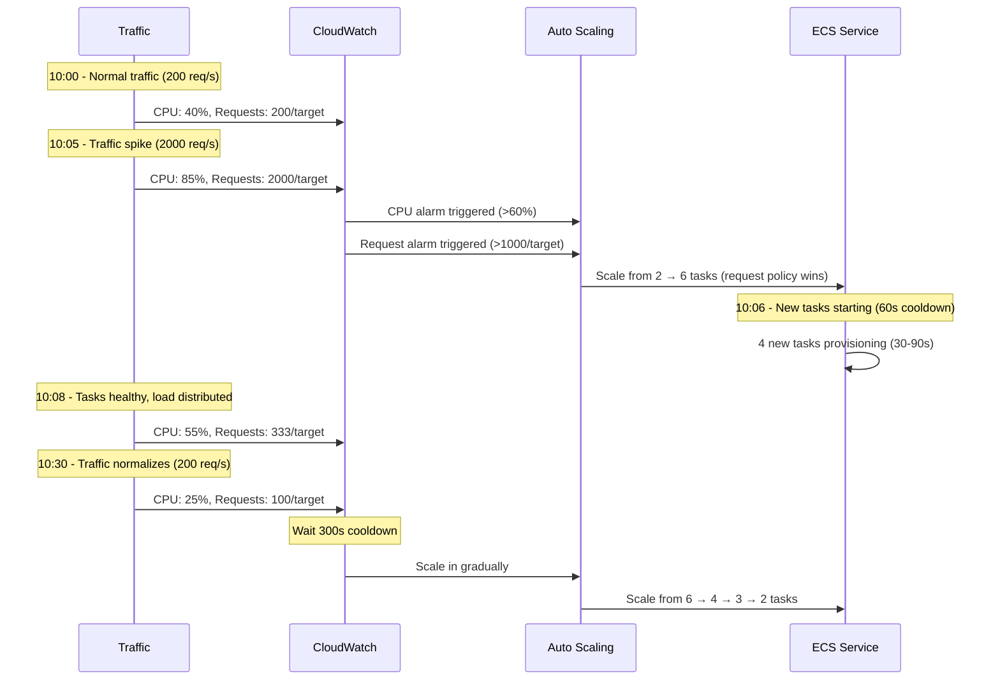
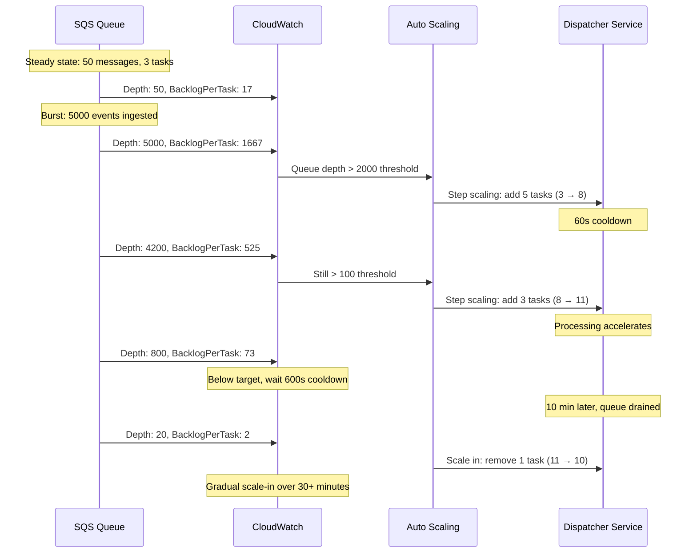

# Auto-Scaling Configuration

## Overview

EventRelay uses **ECS Service Auto Scaling** to dynamically adjust the number of running tasks based on demand. The scaling strategy follows a key principle: **scale out aggressively, scale in conservatively**. This ensures the platform can absorb traffic spikes quickly while avoiding premature scale-in that could cause service degradation.

> [!IMPORTANT]
> Auto-scaling is configured differently for the Ingest API (request-driven) and Dispatcher Workers (queue-driven). Each service has its own scaling policies tuned to its workload characteristics.

---

## Scaling Strategy Overview



### Scaling Principles

| Principle | Implementation |
|---|---|
| **Scale out aggressively** | Short evaluation period (1 min), low cooldown (60s), multiple signals |
| **Scale in conservatively** | Longer evaluation (5 min), high cooldown (300–600s), single signal |
| **Multiple signals** | OR logic — any signal can trigger scale-out |
| **Minimum capacity** | Always maintain enough tasks for basic availability |
| **Prevent flapping** | Different cooldowns for scale-out vs scale-in |
| **Graceful drain** | Connection draining before task termination |

---

## Ingest API Auto-Scaling

### Scaling Configuration

| Parameter | Value | Rationale |
|---|---|---|
| **Min Tasks** | 2 | One per AZ for HA |
| **Max Tasks** | 10 | Cost cap; increase for burst traffic |
| **Desired Tasks** | 2 | Start with minimum |
| **Scale-Out Cooldown** | 60s | Fast response to traffic spikes |
| **Scale-In Cooldown** | 300s | Avoid premature scale-in |

### CloudFormation — Ingest API Scaling

```yaml
Resources:
  # ---- Scalable Target ----
  IngestApiScalableTarget:
    Type: AWS::ApplicationAutoScaling::ScalableTarget
    Properties:
      ServiceNamespace: ecs
      ResourceId: !Sub 'service/eventrelay-${Environment}/ingest-api'
      ScalableDimension: ecs:service:DesiredCount
      MinCapacity: 2
      MaxCapacity: 10
      RoleARN: !GetAtt AutoScalingRole.Arn

  # ---- Policy 1: CPU Target Tracking ----
  IngestApiCPUScalingPolicy:
    Type: AWS::ApplicationAutoScaling::ScalingPolicy
    Properties:
      PolicyName: ingest-api-cpu-scaling
      PolicyType: TargetTrackingScaling
      ScalingTargetId: !Ref IngestApiScalableTarget
      TargetTrackingScalingPolicyConfiguration:
        PredefinedMetricSpecification:
          PredefinedMetricType: ECSServiceAverageCPUUtilization
        TargetValue: 60.0
        ScaleInCooldown: 300
        ScaleOutCooldown: 60

  # ---- Policy 2: ALB Request Count Target Tracking ----
  IngestApiRequestScalingPolicy:
    Type: AWS::ApplicationAutoScaling::ScalingPolicy
    Properties:
      PolicyName: ingest-api-request-scaling
      PolicyType: TargetTrackingScaling
      ScalingTargetId: !Ref IngestApiScalableTarget
      TargetTrackingScalingPolicyConfiguration:
        PredefinedMetricSpecification:
          PredefinedMetricType: ALBRequestCountPerTarget
          ResourceLabel: !Sub '${ALBFullName}/${IngestApiTargetGroupFullName}'
        TargetValue: 1000.0
        ScaleInCooldown: 300
        ScaleOutCooldown: 60

  # ---- Policy 3: Memory Target Tracking ----
  IngestApiMemoryScalingPolicy:
    Type: AWS::ApplicationAutoScaling::ScalingPolicy
    Properties:
      PolicyName: ingest-api-memory-scaling
      PolicyType: TargetTrackingScaling
      ScalingTargetId: !Ref IngestApiScalableTarget
      TargetTrackingScalingPolicyConfiguration:
        PredefinedMetricSpecification:
          PredefinedMetricType: ECSServiceAverageMemoryUtilization
        TargetValue: 75.0
        ScaleInCooldown: 300
        ScaleOutCooldown: 120
```

### How Multiple Policies Interact

When multiple scaling policies are active, AWS uses the following logic:

- **Scale-out**: The policy that provides the **largest** capacity increase wins
- **Scale-in**: The policy that provides the **smallest** capacity decrease wins (most conservative)



---

## Dispatcher Workers Auto-Scaling

### Scaling Configuration

| Parameter | Value | Rationale |
|---|---|---|
| **Min Tasks** | 2 | Minimum for availability |
| **Max Tasks** | 30 | High ceiling for burst processing |
| **Desired Tasks** | 3 | Baseline for steady-state |
| **Scale-Out Cooldown** | 60s | Rapid response to queue buildup |
| **Scale-In Cooldown** | 600s | Very conservative; avoid terminating workers mid-delivery |

### CloudFormation — Dispatcher Scaling

```yaml
Resources:
  # ---- Scalable Target ----
  DispatcherScalableTarget:
    Type: AWS::ApplicationAutoScaling::ScalableTarget
    Properties:
      ServiceNamespace: ecs
      ResourceId: !Sub 'service/eventrelay-${Environment}/dispatcher-workers'
      ScalableDimension: ecs:service:DesiredCount
      MinCapacity: 2
      MaxCapacity: 30
      RoleARN: !GetAtt AutoScalingRole.Arn

  # ---- Policy 1: CPU Target Tracking ----
  DispatcherCPUScalingPolicy:
    Type: AWS::ApplicationAutoScaling::ScalingPolicy
    Properties:
      PolicyName: dispatcher-cpu-scaling
      PolicyType: TargetTrackingScaling
      ScalingTargetId: !Ref DispatcherScalableTarget
      TargetTrackingScalingPolicyConfiguration:
        PredefinedMetricSpecification:
          PredefinedMetricType: ECSServiceAverageCPUUtilization
        TargetValue: 70.0
        ScaleInCooldown: 600
        ScaleOutCooldown: 60

  # ---- Policy 2: SQS Queue Depth Step Scaling ----
  DispatcherQueueDepthScaleOutPolicy:
    Type: AWS::ApplicationAutoScaling::ScalingPolicy
    Properties:
      PolicyName: dispatcher-queue-depth-scale-out
      PolicyType: StepScaling
      ScalingTargetId: !Ref DispatcherScalableTarget
      StepScalingPolicyConfiguration:
        AdjustmentType: ChangeInCapacity
        Cooldown: 60
        MetricAggregationType: Average
        StepAdjustments:
          # 100-500 messages: add 1 task
          - MetricIntervalLowerBound: 0
            MetricIntervalUpperBound: 400
            ScalingAdjustment: 1
          # 500-2000 messages: add 3 tasks
          - MetricIntervalLowerBound: 400
            MetricIntervalUpperBound: 1900
            ScalingAdjustment: 3
          # 2000-10000 messages: add 5 tasks
          - MetricIntervalLowerBound: 1900
            MetricIntervalUpperBound: 9900
            ScalingAdjustment: 5
          # >10000 messages: add 10 tasks
          - MetricIntervalLowerBound: 9900
            ScalingAdjustment: 10

  DispatcherQueueDepthScaleInPolicy:
    Type: AWS::ApplicationAutoScaling::ScalingPolicy
    Properties:
      PolicyName: dispatcher-queue-depth-scale-in
      PolicyType: StepScaling
      ScalingTargetId: !Ref DispatcherScalableTarget
      StepScalingPolicyConfiguration:
        AdjustmentType: ChangeInCapacity
        Cooldown: 600
        MetricAggregationType: Average
        StepAdjustments:
          # Queue empty for sustained period: remove 1 task
          - MetricIntervalUpperBound: 0
            ScalingAdjustment: -1

  # ---- CloudWatch Alarms for Step Scaling ----
  QueueDepthHighAlarm:
    Type: AWS::CloudWatch::Alarm
    Properties:
      AlarmName: !Sub 'eventrelay-sqs-queue-depth-high-${Environment}'
      AlarmDescription: SQS queue depth exceeds threshold
      MetricName: ApproximateNumberOfMessagesVisible
      Namespace: AWS/SQS
      Statistic: Average
      Period: 60
      EvaluationPeriods: 1
      Threshold: 100
      ComparisonOperator: GreaterThanThreshold
      Dimensions:
        - Name: QueueName
          Value: !Sub 'eventrelay-events-${Environment}'
      AlarmActions:
        - !Ref DispatcherQueueDepthScaleOutPolicy
      OKActions:
        - !Ref DispatcherQueueDepthScaleInPolicy

  # ---- Policy 3: Custom Metric — Delivery Latency ----
  DispatcherLatencyScalingPolicy:
    Type: AWS::ApplicationAutoScaling::ScalingPolicy
    Properties:
      PolicyName: dispatcher-latency-scaling
      PolicyType: TargetTrackingScaling
      ScalingTargetId: !Ref DispatcherScalableTarget
      TargetTrackingScalingPolicyConfiguration:
        CustomizedMetricSpecification:
          MetricName: DeliveryLatencyP99
          Namespace: EventRelay
          Statistic: Average
          Unit: Milliseconds
        TargetValue: 5000.0  # 5 seconds P99
        ScaleInCooldown: 600
        ScaleOutCooldown: 60
```

---

## Custom Metrics for Scaling

### Publishing Custom Metrics

```java
@Component
public class ScalingMetricsPublisher {

    private final CloudWatchAsyncClient cloudWatch;
    private final MeterRegistry meterRegistry;

    @Scheduled(fixedRate = 60_000) // Every 60 seconds
    public void publishScalingMetrics() {
        // Metric 1: Queue processing rate (messages/second)
        double processingRate = getProcessingRate();

        // Metric 2: Delivery latency P99
        double deliveryLatencyP99 = getDeliveryLatencyP99();

        // Metric 3: Active delivery count
        long activeDeliveries = getActiveDeliveryCount();

        // Metric 4: Backlog per task (queue_depth / active_tasks)
        double backlogPerTask = getBacklogPerTask();

        List<MetricDatum> metrics = List.of(
            MetricDatum.builder()
                .metricName("ProcessingRate")
                .value(processingRate)
                .unit(StandardUnit.COUNT_SECOND)
                .timestamp(Instant.now())
                .dimensions(
                    Dimension.builder().name("Service").value("dispatcher").build(),
                    Dimension.builder().name("Environment").value(environment).build()
                )
                .build(),

            MetricDatum.builder()
                .metricName("DeliveryLatencyP99")
                .value(deliveryLatencyP99)
                .unit(StandardUnit.MILLISECONDS)
                .timestamp(Instant.now())
                .dimensions(
                    Dimension.builder().name("Service").value("dispatcher").build(),
                    Dimension.builder().name("Environment").value(environment).build()
                )
                .build(),

            MetricDatum.builder()
                .metricName("BacklogPerTask")
                .value(backlogPerTask)
                .unit(StandardUnit.COUNT)
                .timestamp(Instant.now())
                .dimensions(
                    Dimension.builder().name("Service").value("dispatcher").build(),
                    Dimension.builder().name("Environment").value(environment).build()
                )
                .build()
        );

        cloudWatch.putMetricData(PutMetricDataRequest.builder()
            .namespace("EventRelay")
            .metricData(metrics)
            .build());
    }

    private double getBacklogPerTask() {
        // SQS visible messages / number of running dispatcher tasks
        // This is the best metric for queue-based auto-scaling
        long visibleMessages = getApproximateMessageCount();
        int activeTasks = getActiveTaskCount();
        return activeTasks > 0 ? (double) visibleMessages / activeTasks : visibleMessages;
    }
}
```

### Backlog-per-Task Scaling (Recommended)

The **backlog-per-task** metric is the most effective way to scale queue consumers. It answers: "How many messages would each task need to process if we stopped adding new messages?"

```yaml
Resources:
  BacklogPerTaskScalingPolicy:
    Type: AWS::ApplicationAutoScaling::ScalingPolicy
    Properties:
      PolicyName: dispatcher-backlog-per-task
      PolicyType: TargetTrackingScaling
      ScalingTargetId: !Ref DispatcherScalableTarget
      TargetTrackingScalingPolicyConfiguration:
        CustomizedMetricSpecification:
          MetricName: BacklogPerTask
          Namespace: EventRelay
          Statistic: Average
          Unit: Count
        TargetValue: 100.0  # Each task should have ~100 messages in backlog
        ScaleInCooldown: 600
        ScaleOutCooldown: 60
```

**Why backlog-per-task is superior to raw queue depth:**

| Scenario | Queue Depth = 1000 | Backlog Per Task (10 tasks) | Action |
|---|---|---|---|
| **High depth, many tasks** | ALARM (>100) | 100 (target) | No scaling needed |
| **High depth, few tasks** | ALARM (>100) | 500 (5x target) | Scale out aggressively |
| **Low depth, many tasks** | OK (<100) | 10 (0.1x target) | Scale in gently |

---

## Cooldown Periods

### Why Asymmetric Cooldowns?



### Cooldown Configuration

| Service | Scale-Out Cooldown | Scale-In Cooldown | Rationale |
|---|---|---|---|
| **Ingest API** | 60s | 300s (5 min) | Fast response to traffic; conservative scale-in to handle bursty patterns |
| **Dispatcher Workers** | 60s | 600s (10 min) | Fast backlog drain; very conservative scale-in since tasks may have in-flight deliveries |

---

## Scaling Scenarios

### Scenario 1: Traffic Spike (Ingest API)



### Scenario 2: Queue Backlog (Dispatcher)



### Scenario 3: Webhook Endpoint Down

When a major webhook endpoint is down, messages retry and re-enter the queue:

```
Queue depth increases → Dispatcher scales out → But deliveries still fail
→ More retries → More queue messages → More scale out (waste!)
```

**Mitigation: Circuit Breaker + Scale Cap**

```java
// Circuit breaker prevents futile deliveries, reducing queue churn
@Bean
public ScalingAwareCircuitBreaker circuitBreaker() {
    return CircuitBreaker.custom()
        .failureThreshold(5)
        .successThreshold(2)
        .timeout(Duration.ofMinutes(5))
        .onOpen(() -> {
            // Publish metric to suppress scaling
            publishMetric("CircuitBreakerOpen", 1.0);
        })
        .build();
}
```

---

## Scheduled Scaling

For predictable traffic patterns, combine auto-scaling with scheduled actions:

```yaml
Resources:
  # Scale up before business hours
  MorningScaleUp:
    Type: AWS::ApplicationAutoScaling::ScalableTarget
    Properties:
      ScheduledActions:
        - ScheduledActionName: morning-scale-up
          Schedule: 'cron(0 8 ? * MON-FRI *)'  # 8 AM UTC, weekdays
          ScalableTargetAction:
            MinCapacity: 4
            MaxCapacity: 10

  # Scale down after business hours
  EveningScaleDown:
    Type: AWS::ApplicationAutoScaling::ScalableTarget
    Properties:
      ScheduledActions:
        - ScheduledActionName: evening-scale-down
          Schedule: 'cron(0 22 ? * MON-FRI *)'  # 10 PM UTC, weekdays
          ScalableTargetAction:
            MinCapacity: 2
            MaxCapacity: 6

  # Weekend minimum
  WeekendScaleDown:
    Type: AWS::ApplicationAutoScaling::ScalableTarget
    Properties:
      ScheduledActions:
        - ScheduledActionName: weekend-scale-down
          Schedule: 'cron(0 22 ? * FRI *)'  # Friday 10 PM UTC
          ScalableTargetAction:
            MinCapacity: 2
            MaxCapacity: 4
```

---

## Auto-Scaling IAM Role

```yaml
Resources:
  AutoScalingRole:
    Type: AWS::IAM::Role
    Properties:
      RoleName: !Sub 'eventrelay-autoscaling-${Environment}'
      AssumeRolePolicyDocument:
        Version: '2012-10-17'
        Statement:
          - Effect: Allow
            Principal:
              Service: application-autoscaling.amazonaws.com
            Action: sts:AssumeRole
      Policies:
        - PolicyName: ECSAutoScalingPolicy
          PolicyDocument:
            Version: '2012-10-17'
            Statement:
              - Effect: Allow
                Action:
                  - ecs:DescribeServices
                  - ecs:UpdateService
                Resource: '*'
                Condition:
                  ArnLike:
                    ecs:cluster: !Sub 'arn:aws:ecs:${AWS::Region}:${AWS::AccountId}:cluster/eventrelay-*'
              - Effect: Allow
                Action:
                  - cloudwatch:DescribeAlarms
                  - cloudwatch:PutMetricAlarm
                  - cloudwatch:DeleteAlarms
                  - cloudwatch:GetMetricStatistics
                Resource: '*'
              - Effect: Allow
                Action:
                  - application-autoscaling:*
                Resource: '*'
```

---

## Monitoring Scaling Activity

### CloudWatch Dashboard — Scaling Metrics

```json
{
  "widgets": [
    {
      "type": "metric",
      "properties": {
        "title": "ECS Task Count",
        "metrics": [
          ["AWS/ECS", "RunningTaskCount", "ServiceName", "ingest-api", "ClusterName", "eventrelay-production"],
          ["AWS/ECS", "RunningTaskCount", "ServiceName", "dispatcher-workers", "ClusterName", "eventrelay-production"]
        ],
        "period": 60,
        "stat": "Average"
      }
    },
    {
      "type": "metric",
      "properties": {
        "title": "SQS Queue Depth",
        "metrics": [
          ["AWS/SQS", "ApproximateNumberOfMessagesVisible", "QueueName", "eventrelay-events-production"],
          ["AWS/SQS", "ApproximateNumberOfMessagesNotVisible", "QueueName", "eventrelay-events-production"]
        ],
        "period": 60,
        "stat": "Average"
      }
    },
    {
      "type": "metric",
      "properties": {
        "title": "CPU Utilization by Service",
        "metrics": [
          ["AWS/ECS", "CPUUtilization", "ServiceName", "ingest-api", "ClusterName", "eventrelay-production"],
          ["AWS/ECS", "CPUUtilization", "ServiceName", "dispatcher-workers", "ClusterName", "eventrelay-production"]
        ],
        "period": 60,
        "stat": "Average"
      }
    },
    {
      "type": "metric",
      "properties": {
        "title": "Backlog Per Task",
        "metrics": [
          ["EventRelay", "BacklogPerTask", "Service", "dispatcher", "Environment", "production"]
        ],
        "period": 60,
        "stat": "Average"
      }
    }
  ]
}
```

### Scaling Activity Alerts

```yaml
Resources:
  ScalingActivityAlarm:
    Type: AWS::CloudWatch::Alarm
    Properties:
      AlarmName: !Sub 'eventrelay-max-capacity-${Environment}'
      AlarmDescription: >
        Dispatcher workers have reached maximum capacity. 
        Increase MaxCapacity or investigate queue backlog cause.
      MetricName: RunningTaskCount
      Namespace: AWS/ECS
      Statistic: Maximum
      Period: 300
      EvaluationPeriods: 3
      Threshold: 28  # Near max of 30
      ComparisonOperator: GreaterThanOrEqualToThreshold
      Dimensions:
        - Name: ServiceName
          Value: dispatcher-workers
        - Name: ClusterName
          Value: !Sub 'eventrelay-${Environment}'
      AlarmActions:
        - !Ref OpsAlertSNSTopic
```

---

## Production Considerations

1. **Test scaling policies** in staging with load testing tools (k6, Locust) before production deployment
2. **Set appropriate maximums** — unbounded scaling can cause runaway costs; always set `MaxCapacity`
3. **Monitor NAT Gateway** — scaling out dispatchers increases outbound traffic through NAT Gateway
4. **Database connection limits** — each new task opens database connections; ensure RDS `max_connections` can handle max task count × connections per task
5. **Subnet IP capacity** — each Fargate task consumes one IP; ensure subnets have sufficient CIDR space
6. **Alarm for max capacity** — always alert when approaching max capacity so you can adjust limits proactively

---

## Related Documents

- [ECS_Fargate.md](./ECS_Fargate.md) — ECS task and service configuration
- [EC2_Deployment.md](./EC2_Deployment.md) — EC2 ASG scaling configuration
- [Cost_Optimization.md](./Cost_Optimization.md) — Right-sizing and cost management
- [Networking.md](./Networking.md) — Subnet capacity and VPC endpoints
