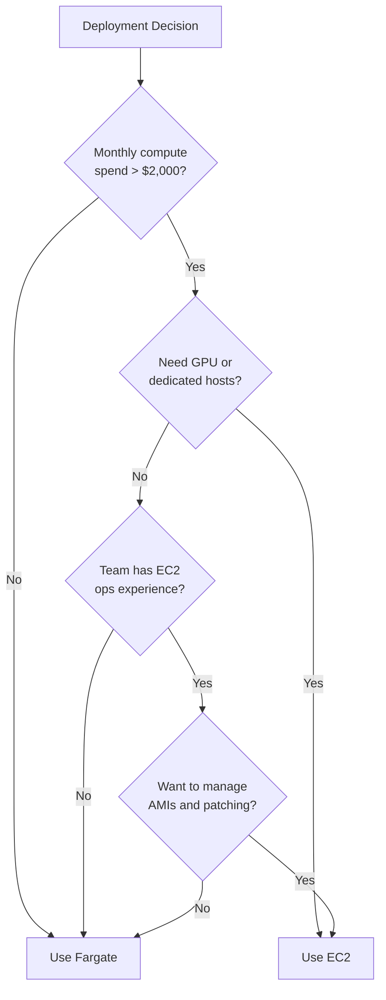
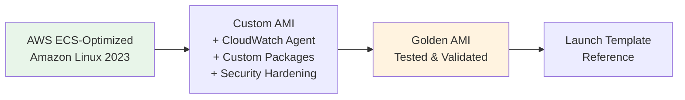
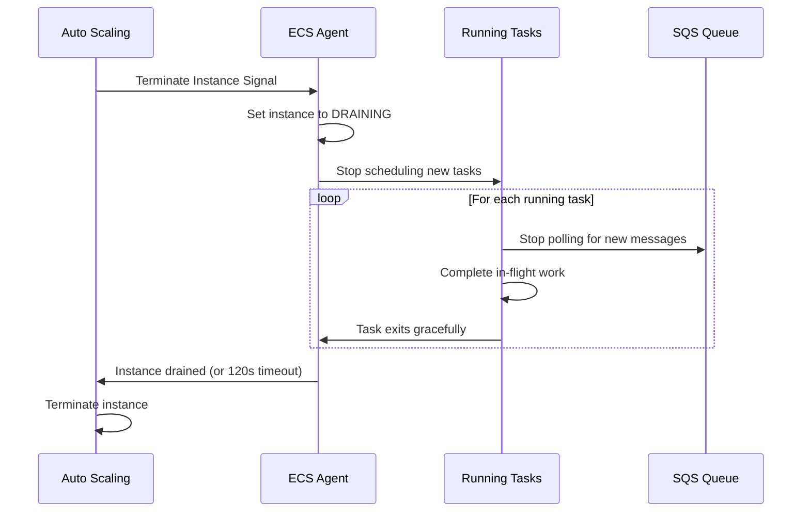

# EC2 Deployment (Alternative)

## Overview

While **ECS Fargate is the recommended** deployment target for EventRelay (see [ECS_Fargate.md](./ECS_Fargate.md)), an EC2-based deployment may be appropriate for specific scenarios. This document covers when to choose EC2, instance selection, Auto Scaling Group (ASG) configuration, and cost optimization with Spot Instances.

> [!NOTE]
> This document covers deploying ECS services on **EC2 launch type** (ECS-optimized instances managed by ASG), not standalone EC2 without ECS. The application code and container images remain the same — only the compute layer changes.

---

## When to Choose EC2 over Fargate

### Decision Matrix

| Factor | Choose Fargate | Choose EC2 |
|---|---|---|
| **Operational overhead** | ✅ No instance management | ❌ Patch, monitor, scale instances |
| **Cost at small scale** | ✅ Pay-per-task-second | ❌ Minimum instance cost |
| **Cost at large scale** | ❌ Premium pricing | ✅ 30–50% cheaper at scale |
| **GPU workloads** | ❌ Not supported | ✅ GPU instances available |
| **Persistent storage** | ❌ Ephemeral only (20GB) | ✅ EBS volumes, instance store |
| **Custom AMIs** | ❌ AWS-managed runtime | ✅ Full control over OS |
| **Network performance** | ❌ Limited to task ENI | ✅ Enhanced networking, placement groups |
| **Startup time** | ❌ 30–90s cold start | ✅ Containers start in 5–10s on warm instances |
| **Spot savings** | ✅ Fargate Spot (up to 70%) | ✅ EC2 Spot (up to 90%) |
| **Compliance requirements** | ❌ Shared tenancy | ✅ Dedicated hosts available |

### Recommended EC2 Scenarios for EventRelay

1. **High-volume dispatch (>10,000 events/sec)** — EC2 c5 instances provide better price/performance for CPU-intensive HTTP dispatch at scale
2. **Large payload processing** — If processing events >1MB that need local SSD caching
3. **Strict compliance** — Requirements for dedicated hosts or hardware-level isolation
4. **Cost optimization at scale** — Running 20+ concurrent tasks where EC2 Reserved Instances provide significant savings



---

## EC2 Instance Selection

### Recommended Instance Types

| Instance | vCPU | Memory | Network | Use Case | On-Demand/hr |
|---|---|---|---|---|---|
| **t3.medium** | 2 | 4 GB | Up to 5 Gbps | Development | $0.0416 |
| **t3.large** | 2 | 8 GB | Up to 5 Gbps | Staging | $0.0832 |
| **c5.xlarge** | 4 | 8 GB | Up to 10 Gbps | Production (compute) | $0.1700 |
| **c5.2xlarge** | 8 | 16 GB | Up to 10 Gbps | Production (high throughput) | $0.3400 |
| **m5.xlarge** | 4 | 16 GB | Up to 10 Gbps | Production (balanced) | $0.1920 |
| **r5.xlarge** | 4 | 32 GB | Up to 10 Gbps | Memory-intensive processing | $0.2520 |

### Instance Selection Guidelines

```
Ingest API (memory-bound, moderate CPU):
  Dev:  t3.medium (2 vCPU, 4 GB) — burst CPU sufficient
  Prod: m5.xlarge (4 vCPU, 16 GB) — balanced, hosts 4-8 tasks

Dispatcher Workers (CPU-bound, high network):
  Dev:  t3.medium (2 vCPU, 4 GB) — burst CPU for low volume
  Prod: c5.xlarge (4 vCPU, 8 GB) — compute-optimized for HTTP dispatch
```

> [!WARNING]
> **Avoid `t3` instances in production.** They use CPU credits and will throttle under sustained load. Use `c5` (compute-optimized) or `m5` (general-purpose) for production workloads. The `t3` burstable instances are appropriate only for development and staging.

### ECS Container Density

Each EC2 instance can host multiple ECS tasks. The number of tasks per instance depends on the CPU and memory reservation per task:

| Instance | Total vCPU | Total Memory | Ingest Tasks (0.5 vCPU/1GB) | Dispatcher Tasks (1 vCPU/2GB) |
|---|---|---|---|---|
| **t3.medium** | 2 | 4 GB | 3 | 1 |
| **c5.xlarge** | 4 | 8 GB | 6 | 3 |
| **c5.2xlarge** | 8 | 16 GB | 14 | 7 |
| **m5.xlarge** | 4 | 16 GB | 7 | 3 |

> [!NOTE]
> Actual capacity is slightly less than advertised because the ECS agent and OS consume ~256 MB of memory and some CPU. The ECS-optimized AMI reserves resources for the ECS agent automatically.

---

## Launch Template

### CloudFormation — EC2 Launch Template

```yaml
Parameters:
  Environment:
    Type: String
    Default: production
  InstanceType:
    Type: String
    Default: c5.xlarge
  KeyPairName:
    Type: AWS::EC2::KeyPair::KeyName
    Default: eventrelay-production

Resources:
  ECSLaunchTemplate:
    Type: AWS::EC2::LaunchTemplate
    Properties:
      LaunchTemplateName: !Sub 'eventrelay-ecs-${Environment}'
      LaunchTemplateData:
        ImageId: !Ref ECSOptimizedAMI
        InstanceType: !Ref InstanceType
        KeyName: !Ref KeyPairName
        IamInstanceProfile:
          Arn: !GetAtt ECSInstanceProfile.Arn
        SecurityGroupIds:
          - !Ref ECSInstanceSecurityGroup
        Monitoring:
          Enabled: true
        BlockDeviceMappings:
          - DeviceName: /dev/xvda
            Ebs:
              VolumeType: gp3
              VolumeSize: 50
              Iops: 3000
              Throughput: 125
              Encrypted: true
              DeleteOnTermination: true
        TagSpecifications:
          - ResourceType: instance
            Tags:
              - Key: Name
                Value: !Sub 'eventrelay-ecs-${Environment}'
              - Key: Project
                Value: eventrelay
              - Key: Environment
                Value: !Ref Environment
          - ResourceType: volume
            Tags:
              - Key: Name
                Value: !Sub 'eventrelay-ecs-vol-${Environment}'
        UserData:
          Fn::Base64: !Sub |
            #!/bin/bash -xe
            # Configure ECS agent
            cat >> /etc/ecs/ecs.config << 'EOF'
            ECS_CLUSTER=eventrelay-${Environment}
            ECS_ENABLE_CONTAINER_METADATA=true
            ECS_CONTAINER_INSTANCE_PROPAGATE_TAGS_FROM=ec2_instance
            ECS_ENABLE_SPOT_INSTANCE_DRAINING=true
            ECS_ENGINE_TASK_CLEANUP_WAIT_DURATION=30m
            ECS_IMAGE_CLEANUP_INTERVAL=30m
            ECS_IMAGE_MINIMUM_CLEANUP_AGE=1h
            ECS_NUM_IMAGES_DELETE_PER_CYCLE=5
            ECS_RESERVED_MEMORY=256
            ECS_ENABLE_TASK_ENI=true
            ECS_AWSVPC_BLOCK_IMDS=true
            EOF

            # Install CloudWatch agent
            yum install -y amazon-cloudwatch-agent
            cat > /opt/aws/amazon-cloudwatch-agent/etc/config.json << 'CWEOF'
            {
              "agent": {
                "metrics_collection_interval": 60
              },
              "metrics": {
                "namespace": "EventRelay/EC2",
                "append_dimensions": {
                  "InstanceId": "${!aws:InstanceId}",
                  "AutoScalingGroupName": "${!aws:AutoScalingGroupName}"
                },
                "metrics_collected": {
                  "cpu": {
                    "measurement": ["cpu_usage_idle", "cpu_usage_user", "cpu_usage_system"],
                    "totalcpu": true
                  },
                  "mem": {
                    "measurement": ["mem_used_percent", "mem_available_percent"]
                  },
                  "disk": {
                    "measurement": ["disk_used_percent"],
                    "resources": ["/"]
                  },
                  "net": {
                    "measurement": ["bytes_sent", "bytes_recv", "packets_sent", "packets_recv"]
                  }
                }
              }
            }
            CWEOF
            /opt/aws/amazon-cloudwatch-agent/bin/amazon-cloudwatch-agent-ctl \
              -a fetch-config -m ec2 -s \
              -c file:/opt/aws/amazon-cloudwatch-agent/etc/config.json

            # Signal CloudFormation
            /opt/aws/bin/cfn-signal -e $? \
              --stack ${AWS::StackName} \
              --resource AutoScalingGroup \
              --region ${AWS::Region}

  # ---- SSM Parameter for latest ECS-optimized AMI ----
  ECSOptimizedAMI:
    Type: AWS::SSM::Parameter::Value<AWS::EC2::Image::Id>
    Default: /aws/service/ecs/optimized-ami/amazon-linux-2023/recommended/image_id

  # ---- Instance Profile ----
  ECSInstanceRole:
    Type: AWS::IAM::Role
    Properties:
      RoleName: !Sub 'eventrelay-ecs-instance-${Environment}'
      AssumeRolePolicyDocument:
        Version: '2012-10-17'
        Statement:
          - Effect: Allow
            Principal:
              Service: ec2.amazonaws.com
            Action: sts:AssumeRole
      ManagedPolicyArns:
        - arn:aws:iam::aws:policy/service-role/AmazonEC2ContainerServiceforEC2Role
        - arn:aws:iam::aws:policy/AmazonSSMManagedInstanceCore
        - arn:aws:iam::aws:policy/CloudWatchAgentServerPolicy
      Tags:
        - Key: Project
          Value: eventrelay

  ECSInstanceProfile:
    Type: AWS::IAM::InstanceProfile
    Properties:
      InstanceProfileName: !Sub 'eventrelay-ecs-instance-profile-${Environment}'
      Roles:
        - !Ref ECSInstanceRole
```

---

## Auto Scaling Group Configuration

### CloudFormation — ASG

```yaml
Resources:
  AutoScalingGroup:
    Type: AWS::AutoScaling::AutoScalingGroup
    CreationPolicy:
      ResourceSignal:
        Count: !Ref DesiredCapacity
        Timeout: PT10M
    UpdatePolicy:
      AutoScalingRollingUpdate:
        MaxBatchSize: 1
        MinInstancesInService: !Ref MinCapacity
        PauseTime: PT10M
        WaitOnResourceSignals: true
        SuspendProcesses:
          - HealthCheck
          - ReplaceUnhealthy
          - AZRebalance
          - AlarmNotification
          - ScheduledActions
    Properties:
      AutoScalingGroupName: !Sub 'eventrelay-ecs-asg-${Environment}'
      LaunchTemplate:
        LaunchTemplateId: !Ref ECSLaunchTemplate
        Version: !GetAtt ECSLaunchTemplate.LatestVersionNumber
      MinSize: !Ref MinCapacity
      MaxSize: !Ref MaxCapacity
      DesiredCapacity: !Ref DesiredCapacity
      VPCZoneIdentifier:
        - !ImportValue PrivateAppSubnet1
        - !ImportValue PrivateAppSubnet2
      HealthCheckType: EC2
      HealthCheckGracePeriod: 300
      TerminationPolicies:
        - OldestLaunchTemplate
        - OldestInstance
      NewInstancesProtectedFromScaleIn: true
      Tags:
        - Key: Name
          Value: !Sub 'eventrelay-ecs-${Environment}'
          PropagateAtLaunch: true
        - Key: AmazonECSManaged
          Value: 'true'
          PropagateAtLaunch: true

  # ---- Capacity Provider ----
  EC2CapacityProvider:
    Type: AWS::ECS::CapacityProvider
    Properties:
      Name: !Sub 'eventrelay-ec2-${Environment}'
      AutoScalingGroupProvider:
        AutoScalingGroupArn: !Ref AutoScalingGroup
        ManagedScaling:
          Status: ENABLED
          TargetCapacity: 80
          MinimumScalingStepSize: 1
          MaximumScalingStepSize: 5
          InstanceWarmupPeriod: 300
        ManagedTerminationProtection: ENABLED

  # ---- Scaling Policies ----
  ScaleOutPolicy:
    Type: AWS::AutoScaling::ScalingPolicy
    Properties:
      AutoScalingGroupName: !Ref AutoScalingGroup
      PolicyType: StepScaling
      AdjustmentType: ChangeInCapacity
      StepAdjustments:
        - MetricIntervalLowerBound: 0
          MetricIntervalUpperBound: 20
          ScalingAdjustment: 1
        - MetricIntervalLowerBound: 20
          ScalingAdjustment: 2
      Cooldown: 180

  ScaleInPolicy:
    Type: AWS::AutoScaling::ScalingPolicy
    Properties:
      AutoScalingGroupName: !Ref AutoScalingGroup
      PolicyType: StepScaling
      AdjustmentType: ChangeInCapacity
      StepAdjustments:
        - MetricIntervalUpperBound: 0
          ScalingAdjustment: -1
      Cooldown: 600

  # ---- CloudWatch Alarms for Scaling ----
  HighCPUAlarm:
    Type: AWS::CloudWatch::Alarm
    Properties:
      AlarmName: !Sub 'eventrelay-asg-high-cpu-${Environment}'
      MetricName: CPUUtilization
      Namespace: AWS/EC2
      Statistic: Average
      Period: 300
      EvaluationPeriods: 2
      Threshold: 70
      ComparisonOperator: GreaterThanThreshold
      Dimensions:
        - Name: AutoScalingGroupName
          Value: !Ref AutoScalingGroup
      AlarmActions:
        - !Ref ScaleOutPolicy

  LowCPUAlarm:
    Type: AWS::CloudWatch::Alarm
    Properties:
      AlarmName: !Sub 'eventrelay-asg-low-cpu-${Environment}'
      MetricName: CPUUtilization
      Namespace: AWS/EC2
      Statistic: Average
      Period: 300
      EvaluationPeriods: 6
      Threshold: 30
      ComparisonOperator: LessThanThreshold
      Dimensions:
        - Name: AutoScalingGroupName
          Value: !Ref AutoScalingGroup
      AlarmActions:
        - !Ref ScaleInPolicy
```

### ASG Configuration by Environment

| Parameter | Development | Staging | Production |
|---|---|---|---|
| **Instance Type** | t3.medium | c5.xlarge | c5.xlarge / c5.2xlarge |
| **Min Capacity** | 1 | 2 | 2 |
| **Max Capacity** | 2 | 4 | 10 |
| **Desired Capacity** | 1 | 2 | 3 |
| **Health Check Grace** | 300s | 300s | 300s |
| **Target Capacity** | 80% | 80% | 80% |
| **Scale-Out Cooldown** | 300s | 180s | 180s |
| **Scale-In Cooldown** | 600s | 600s | 600s |

---

## AMI Management

### AMI Strategy



### Custom AMI Build Script (Packer)

```hcl
# packer/eventrelay-ecs.pkr.hcl
source "amazon-ebs" "eventrelay_ecs" {
  ami_name      = "eventrelay-ecs-${formatdate("YYYY-MM-DD-hhmm", timestamp())}"
  instance_type = "t3.medium"
  region        = "us-east-1"

  source_ami_filter {
    filters = {
      name                = "al2023-ami-ecs-hvm-*-x86_64"
      root-device-type    = "ebs"
      virtualization-type = "hvm"
    }
    most_recent = true
    owners      = ["amazon"]
  }

  ssh_username = "ec2-user"

  tags = {
    Name        = "eventrelay-ecs"
    Project     = "eventrelay"
    BuildDate   = formatdate("YYYY-MM-DD", timestamp())
    BaseAMI     = "{{ .SourceAMIName }}"
  }
}

build {
  sources = ["source.amazon-ebs.eventrelay_ecs"]

  provisioner "shell" {
    inline = [
      # Install CloudWatch agent
      "sudo yum install -y amazon-cloudwatch-agent",

      # Install SSM agent (usually pre-installed)
      "sudo yum install -y amazon-ssm-agent",
      "sudo systemctl enable amazon-ssm-agent",

      # Security hardening
      "sudo yum update -y",

      # Install diagnostic tools
      "sudo yum install -y htop iotop tcpdump",

      # Configure Docker log rotation
      "sudo mkdir -p /etc/docker",
      "echo '{\"log-driver\": \"json-file\", \"log-opts\": {\"max-size\": \"50m\", \"max-file\": \"5\"}}' | sudo tee /etc/docker/daemon.json",

      # Clean up
      "sudo yum clean all",
      "sudo rm -rf /var/cache/yum"
    ]
  }
}
```

### AMI Lifecycle

| Stage | Action | Frequency |
|---|---|---|
| **Build** | Packer builds from latest ECS-optimized AMI | Weekly (automated) |
| **Test** | Launch instance, run validation tests | After each build |
| **Promote** | Update Launch Template to new AMI ID | After validation |
| **Deprecate** | Mark old AMIs as deprecated | 30 days after replacement |
| **Deregister** | Remove old AMIs and delete snapshots | 90 days after deprecation |

---

## Spot Instances for Cost Savings

### Spot Strategy

Spot Instances can reduce EC2 costs by up to **90%** for Dispatcher workers, which are inherently interruption-tolerant (SQS provides message durability).

```yaml
Resources:
  SpotAutoScalingGroup:
    Type: AWS::AutoScaling::AutoScalingGroup
    Properties:
      MixedInstancesPolicy:
        InstancesDistribution:
          OnDemandBaseCapacity: 1
          OnDemandPercentageAboveBaseCapacity: 25
          SpotAllocationStrategy: capacity-optimized
          SpotMaxPrice: ''  # Use on-demand price as cap
        LaunchTemplate:
          LaunchTemplateSpecification:
            LaunchTemplateId: !Ref ECSLaunchTemplate
            Version: !GetAtt ECSLaunchTemplate.LatestVersionNumber
          Overrides:
            - InstanceType: c5.xlarge
            - InstanceType: c5a.xlarge
            - InstanceType: c5d.xlarge
            - InstanceType: m5.xlarge
            - InstanceType: m5a.xlarge
      MinSize: 2
      MaxSize: 10
      DesiredCapacity: 3
      VPCZoneIdentifier:
        - !ImportValue PrivateAppSubnet1
        - !ImportValue PrivateAppSubnet2
```

### Spot Interruption Handling

```java
@Component
@ConditionalOnProperty(name = "deployment.spot-enabled", havingValue = "true")
public class SpotInterruptionHandler {

    private static final Logger log = LoggerFactory.getLogger(SpotInterruptionHandler.class);
    private final SqsMessageConsumer messageConsumer;

    /**
     * Polls the EC2 instance metadata for spot termination notices.
     * When a 2-minute warning is received, gracefully stops consuming new messages.
     */
    @Scheduled(fixedDelay = 5000)
    public void checkSpotTermination() {
        try {
            HttpClient client = HttpClient.newHttpClient();
            HttpRequest request = HttpRequest.newBuilder()
                .uri(URI.create("http://169.254.169.254/latest/meta-data/spot/termination-time"))
                .timeout(Duration.ofSeconds(2))
                .GET()
                .build();

            HttpResponse<String> response = client.send(request, HttpResponse.BodyHandlers.ofString());

            if (response.statusCode() == 200) {
                log.warn("Spot termination notice received! Time: {}", response.body());
                log.warn("Stopping message consumption and draining in-flight work...");
                messageConsumer.stopConsuming();
                // ECS_ENABLE_SPOT_INSTANCE_DRAINING=true handles the rest
            }
        } catch (Exception e) {
            // 404 = no termination notice, which is normal
        }
    }
}
```

### Cost Comparison: On-Demand vs Spot vs Fargate

| Configuration | Monthly Cost (3 instances) | Savings vs On-Demand |
|---|---|---|
| **c5.xlarge On-Demand** | $367/mo | — |
| **c5.xlarge Spot (avg)** | $110/mo | **70%** |
| **c5.xlarge Reserved (1yr)** | $238/mo | **35%** |
| **Fargate (equiv. vCPU/mem)** | $430/mo | **-17%** (more expensive) |
| **Fargate Spot (equiv.)** | $172/mo | **53%** |

> [!TIP]
> The optimal strategy for production: **On-Demand base (1 instance)** + **Spot for burst (remaining)**. This ensures minimum capacity is always available while maximizing cost savings for elastic capacity.

---

## Instance Draining

When scaling in or during Spot interruption, instances must be drained gracefully:



### Lifecycle Hook for Graceful Draining

```yaml
Resources:
  TerminationLifecycleHook:
    Type: AWS::AutoScaling::LifecycleHook
    Properties:
      AutoScalingGroupName: !Ref AutoScalingGroup
      LifecycleTransition: autoscaling:EC2_INSTANCE_TERMINATING
      HeartbeatTimeout: 300  # 5 minutes to drain
      DefaultResult: CONTINUE
      NotificationTargetARN: !Ref DrainingSNSTopic
      RoleARN: !GetAtt LifecycleHookRole.Arn
```

---

## Production Considerations

### Security Hardening

1. **IMDSv2 Only** — Enforce Instance Metadata Service v2 (token-based) in the launch template
2. **No SSH Keys** — Use SSM Session Manager instead of SSH for instance access
3. **Encrypted EBS** — All volumes encrypted with AWS-managed keys (or CMK)
4. **CIS Benchmark** — Apply CIS Amazon Linux 2023 Level 1 hardening

```yaml
# IMDSv2 enforcement in launch template
MetadataOptions:
  HttpTokens: required
  HttpPutResponseHopLimit: 1
  HttpEndpoint: enabled
  InstanceMetadataTags: enabled
```

### Monitoring Checklist

- [ ] CloudWatch agent installed and reporting custom metrics
- [ ] ECS container insights enabled
- [ ] ASG scaling activities alarm configured
- [ ] Instance status check alarms
- [ ] Disk usage monitoring (EBS volume)
- [ ] Memory utilization monitoring (custom metric)

---

## Related Documents

- [ECS_Fargate.md](./ECS_Fargate.md) — Primary Fargate deployment (recommended)
- [Auto_Scaling.md](./Auto_Scaling.md) — Application-level auto-scaling policies
- [IAM.md](./IAM.md) — Instance roles and task roles
- [Cost_Optimization.md](./Cost_Optimization.md) — Cost optimization strategies
