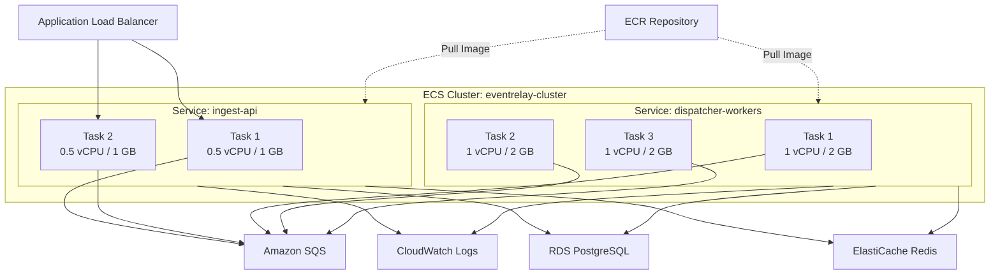
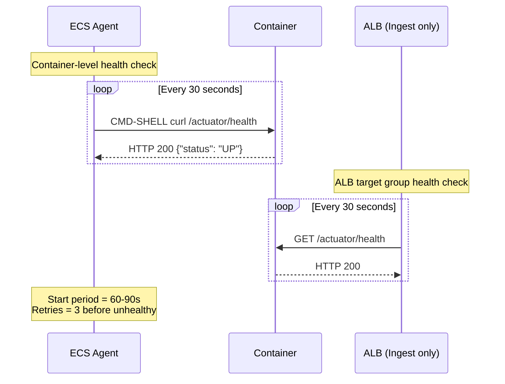
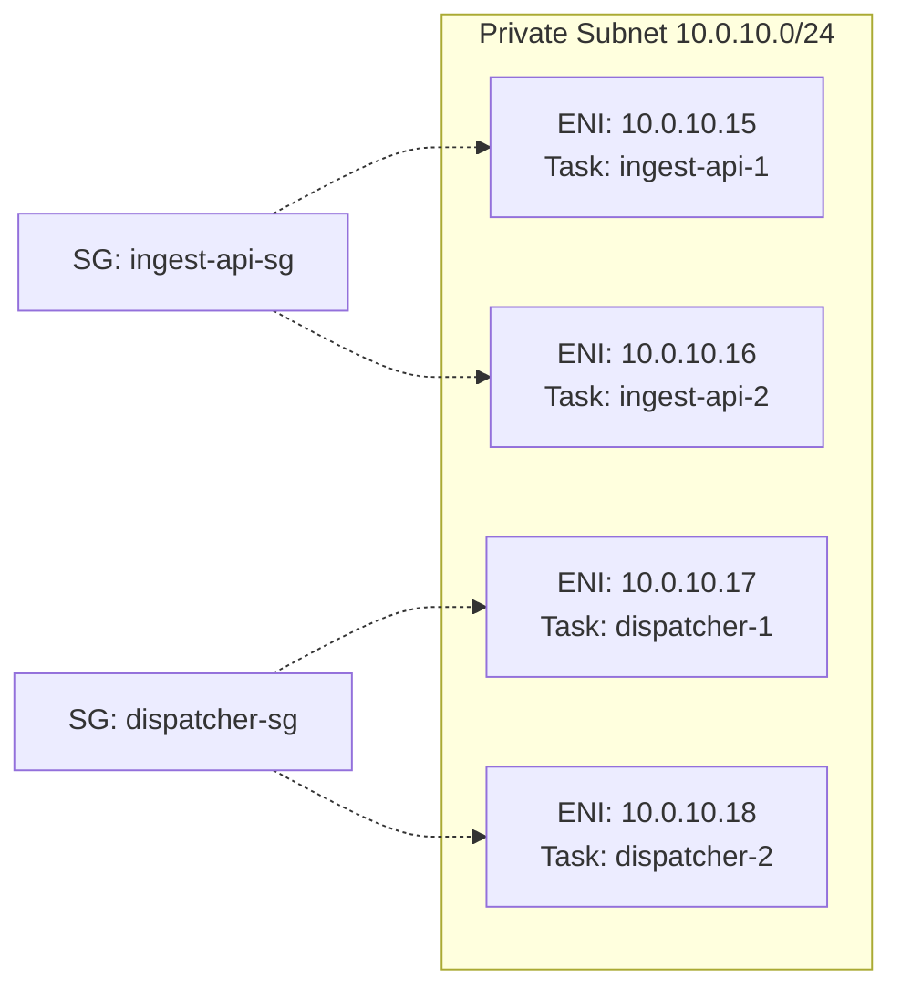

# ECS Fargate Deployment

## Overview

EventRelay runs on **AWS ECS with Fargate** launch type, eliminating the need to manage EC2 instances. The platform consists of two ECS services: the **Ingest API** (handles event ingestion and subscription management) and the **Dispatcher Workers** (consume from SQS and deliver webhooks). Both services run in `awsvpc` networking mode within private subnets.

> [!IMPORTANT]
> Fargate is the **recommended** deployment target for EventRelay. Choose EC2 only when specific requirements justify it (see [EC2_Deployment.md](./EC2_Deployment.md) for comparison).

---

## Architecture Overview



---

## ECS Cluster

### Cluster Configuration

```yaml
Cluster Name: eventrelay-{environment}
Capacity Providers:
  - FARGATE (default, weight: 1)
  - FARGATE_SPOT (weight: 0, used for dispatchers via service config)
Container Insights: Enabled
Execute Command: Enabled (for debugging)
```

### CloudFormation — ECS Cluster

```yaml
Resources:
  ECSCluster:
    Type: AWS::ECS::Cluster
    Properties:
      ClusterName: !Sub 'eventrelay-${Environment}'
      ClusterSettings:
        - Name: containerInsights
          Value: enabled
      CapacityProviders:
        - FARGATE
        - FARGATE_SPOT
      DefaultCapacityProviderStrategy:
        - CapacityProvider: FARGATE
          Weight: 1
          Base: 2
      Configuration:
        ExecuteCommandConfiguration:
          Logging: DEFAULT
      Tags:
        - Key: Project
          Value: eventrelay
        - Key: Environment
          Value: !Ref Environment
```

---

## Task Definitions

### Ingest API Task Definition

| Parameter | Value |
|---|---|
| **Family** | `eventrelay-ingest-api` |
| **CPU** | 512 (0.5 vCPU) |
| **Memory** | 1024 MB |
| **Network Mode** | `awsvpc` |
| **Requires Compatibilities** | `FARGATE` |
| **Runtime Platform** | Linux/X86_64 |
| **Container Port** | 8080 |

```json
{
  "family": "eventrelay-ingest-api",
  "networkMode": "awsvpc",
  "requiresCompatibilities": ["FARGATE"],
  "cpu": "512",
  "memory": "1024",
  "runtimePlatform": {
    "cpuArchitecture": "X86_64",
    "operatingSystemFamily": "LINUX"
  },
  "executionRoleArn": "arn:aws:iam::123456789012:role/eventrelay-ecs-execution-role",
  "taskRoleArn": "arn:aws:iam::123456789012:role/eventrelay-ingest-task-role",
  "containerDefinitions": [
    {
      "name": "ingest-api",
      "image": "123456789012.dkr.ecr.us-east-1.amazonaws.com/eventrelay/ingest-api:latest",
      "essential": true,
      "portMappings": [
        {
          "containerPort": 8080,
          "protocol": "tcp"
        }
      ],
      "healthCheck": {
        "command": [
          "CMD-SHELL",
          "curl -f http://localhost:8080/actuator/health || exit 1"
        ],
        "interval": 30,
        "timeout": 5,
        "retries": 3,
        "startPeriod": 60
      },
      "environment": [
        {
          "name": "SPRING_PROFILES_ACTIVE",
          "value": "production"
        },
        {
          "name": "SERVER_PORT",
          "value": "8080"
        },
        {
          "name": "JAVA_OPTS",
          "value": "-XX:MaxRAMPercentage=75.0 -XX:+UseG1GC -XX:+UseStringDeduplication"
        }
      ],
      "secrets": [
        {
          "name": "SPRING_DATASOURCE_URL",
          "valueFrom": "arn:aws:secretsmanager:us-east-1:123456789012:secret:eventrelay/database:url::"
        },
        {
          "name": "SPRING_DATASOURCE_USERNAME",
          "valueFrom": "arn:aws:secretsmanager:us-east-1:123456789012:secret:eventrelay/database:username::"
        },
        {
          "name": "SPRING_DATASOURCE_PASSWORD",
          "valueFrom": "arn:aws:secretsmanager:us-east-1:123456789012:secret:eventrelay/database:password::"
        },
        {
          "name": "SPRING_REDIS_HOST",
          "valueFrom": "arn:aws:secretsmanager:us-east-1:123456789012:secret:eventrelay/redis:host::"
        },
        {
          "name": "AWS_SQS_QUEUE_URL",
          "valueFrom": "arn:aws:ssm:us-east-1:123456789012:parameter/eventrelay/sqs-queue-url"
        }
      ],
      "logConfiguration": {
        "logDriver": "awslogs",
        "options": {
          "awslogs-group": "/ecs/eventrelay/ingest-api",
          "awslogs-region": "us-east-1",
          "awslogs-stream-prefix": "ingest",
          "awslogs-create-group": "true"
        }
      },
      "ulimits": [
        {
          "name": "nofile",
          "softLimit": 65536,
          "hardLimit": 65536
        }
      ]
    }
  ]
}
```

### Dispatcher Workers Task Definition

| Parameter | Value |
|---|---|
| **Family** | `eventrelay-dispatcher` |
| **CPU** | 1024 (1 vCPU) |
| **Memory** | 2048 MB |
| **Network Mode** | `awsvpc` |
| **Requires Compatibilities** | `FARGATE` |
| **Runtime Platform** | Linux/X86_64 |
| **Container Port** | 8081 (health check only) |

```json
{
  "family": "eventrelay-dispatcher",
  "networkMode": "awsvpc",
  "requiresCompatibilities": ["FARGATE"],
  "cpu": "1024",
  "memory": "2048",
  "runtimePlatform": {
    "cpuArchitecture": "X86_64",
    "operatingSystemFamily": "LINUX"
  },
  "executionRoleArn": "arn:aws:iam::123456789012:role/eventrelay-ecs-execution-role",
  "taskRoleArn": "arn:aws:iam::123456789012:role/eventrelay-dispatcher-task-role",
  "containerDefinitions": [
    {
      "name": "dispatcher",
      "image": "123456789012.dkr.ecr.us-east-1.amazonaws.com/eventrelay/dispatcher:latest",
      "essential": true,
      "portMappings": [
        {
          "containerPort": 8081,
          "protocol": "tcp"
        }
      ],
      "healthCheck": {
        "command": [
          "CMD-SHELL",
          "curl -f http://localhost:8081/actuator/health || exit 1"
        ],
        "interval": 30,
        "timeout": 10,
        "retries": 3,
        "startPeriod": 90
      },
      "environment": [
        {
          "name": "SPRING_PROFILES_ACTIVE",
          "value": "production,dispatcher"
        },
        {
          "name": "SERVER_PORT",
          "value": "8081"
        },
        {
          "name": "JAVA_OPTS",
          "value": "-XX:MaxRAMPercentage=75.0 -XX:+UseG1GC -XX:+UseStringDeduplication -XX:ActiveProcessorCount=2"
        },
        {
          "name": "DISPATCHER_CONCURRENCY",
          "value": "10"
        },
        {
          "name": "DISPATCHER_HTTP_TIMEOUT_SECONDS",
          "value": "30"
        },
        {
          "name": "DISPATCHER_BATCH_SIZE",
          "value": "10"
        }
      ],
      "secrets": [
        {
          "name": "SPRING_DATASOURCE_URL",
          "valueFrom": "arn:aws:secretsmanager:us-east-1:123456789012:secret:eventrelay/database:url::"
        },
        {
          "name": "SPRING_DATASOURCE_USERNAME",
          "valueFrom": "arn:aws:secretsmanager:us-east-1:123456789012:secret:eventrelay/database:username::"
        },
        {
          "name": "SPRING_DATASOURCE_PASSWORD",
          "valueFrom": "arn:aws:secretsmanager:us-east-1:123456789012:secret:eventrelay/database:password::"
        },
        {
          "name": "SPRING_REDIS_HOST",
          "valueFrom": "arn:aws:secretsmanager:us-east-1:123456789012:secret:eventrelay/redis:host::"
        },
        {
          "name": "AWS_SQS_QUEUE_URL",
          "valueFrom": "arn:aws:ssm:us-east-1:123456789012:parameter/eventrelay/sqs-queue-url"
        },
        {
          "name": "AWS_SQS_DLQ_URL",
          "valueFrom": "arn:aws:ssm:us-east-1:123456789012:parameter/eventrelay/sqs-dlq-url"
        }
      ],
      "logConfiguration": {
        "logDriver": "awslogs",
        "options": {
          "awslogs-group": "/ecs/eventrelay/dispatcher",
          "awslogs-region": "us-east-1",
          "awslogs-stream-prefix": "dispatcher",
          "awslogs-create-group": "true"
        }
      },
      "ulimits": [
        {
          "name": "nofile",
          "softLimit": 65536,
          "hardLimit": 65536
        }
      ]
    }
  ]
}
```

> [!NOTE]
> Dispatcher workers have higher CPU/memory allocation because they make outbound HTTP calls with potentially long timeouts (up to 30s per delivery). The `-XX:ActiveProcessorCount=2` JVM flag ensures proper thread pool sizing in constrained Fargate environments.

---

## ECS Service Configuration

### CloudFormation — Ingest API Service

```yaml
Resources:
  IngestApiService:
    Type: AWS::ECS::Service
    DependsOn: ALBListenerRule
    Properties:
      ServiceName: ingest-api
      Cluster: !Ref ECSCluster
      TaskDefinition: !Ref IngestApiTaskDefinition
      DesiredCount: 2
      LaunchType: FARGATE
      PlatformVersion: '1.4.0'
      DeploymentConfiguration:
        MaximumPercent: 200
        MinimumHealthyPercent: 100
        DeploymentCircuitBreaker:
          Enable: true
          Rollback: true
      NetworkConfiguration:
        AwsvpcConfiguration:
          AssignPublicIp: DISABLED
          Subnets:
            - !ImportValue PrivateAppSubnet1
            - !ImportValue PrivateAppSubnet2
          SecurityGroups:
            - !Ref IngestApiSecurityGroup
      LoadBalancers:
        - ContainerName: ingest-api
          ContainerPort: 8080
          TargetGroupArn: !Ref IngestApiTargetGroup
      HealthCheckGracePeriodSeconds: 120
      EnableExecuteCommand: true
      PropagateTags: SERVICE
      Tags:
        - Key: Service
          Value: ingest-api

  # ---- Target Group ----
  IngestApiTargetGroup:
    Type: AWS::ElasticLoadBalancingV2::TargetGroup
    Properties:
      Name: !Sub 'eventrelay-ingest-${Environment}'
      Port: 8080
      Protocol: HTTP
      VpcId: !ImportValue VpcId
      TargetType: ip
      HealthCheckEnabled: true
      HealthCheckPath: /actuator/health
      HealthCheckProtocol: HTTP
      HealthCheckPort: '8080'
      HealthCheckIntervalSeconds: 30
      HealthCheckTimeoutSeconds: 5
      HealthyThresholdCount: 2
      UnhealthyThresholdCount: 3
      Matcher:
        HttpCode: '200'
      TargetGroupAttributes:
        - Key: deregistration_delay.timeout_seconds
          Value: '30'
        - Key: slow_start.duration_seconds
          Value: '60'
```

### CloudFormation — Dispatcher Workers Service

```yaml
Resources:
  DispatcherService:
    Type: AWS::ECS::Service
    Properties:
      ServiceName: dispatcher-workers
      Cluster: !Ref ECSCluster
      TaskDefinition: !Ref DispatcherTaskDefinition
      DesiredCount: 3
      CapacityProviderStrategy:
        - CapacityProvider: FARGATE
          Weight: 1
          Base: 1
        - CapacityProvider: FARGATE_SPOT
          Weight: 3
      PlatformVersion: '1.4.0'
      DeploymentConfiguration:
        MaximumPercent: 200
        MinimumHealthyPercent: 50
        DeploymentCircuitBreaker:
          Enable: true
          Rollback: true
      NetworkConfiguration:
        AwsvpcConfiguration:
          AssignPublicIp: DISABLED
          Subnets:
            - !ImportValue PrivateAppSubnet1
            - !ImportValue PrivateAppSubnet2
          SecurityGroups:
            - !Ref DispatcherSecurityGroup
      EnableExecuteCommand: true
      PropagateTags: SERVICE
      Tags:
        - Key: Service
          Value: dispatcher-workers
```

> [!TIP]
> Dispatcher workers use a `FARGATE_SPOT` capacity provider strategy (weight: 3 vs FARGATE weight: 1). This means ~75% of dispatcher tasks run on Spot capacity (up to 70% cheaper). The `Base: 1` ensures at least one task always runs on regular Fargate for reliability. Since dispatchers process SQS messages and handle retries gracefully, Spot interruptions are safe.

---

## Container Health Checks

### Health Check Strategy



### Health Check Configuration Matrix

| Parameter | Ingest API | Dispatcher Workers |
|---|---|---|
| **Endpoint** | `/actuator/health` | `/actuator/health` |
| **Port** | 8080 | 8081 |
| **Interval** | 30s | 30s |
| **Timeout** | 5s | 10s |
| **Retries** | 3 | 3 |
| **Start Period** | 60s | 90s |
| **ALB Health Check** | Yes | No (no ALB) |

### Spring Boot Health Indicator

```java
@Component
public class EventRelayHealthIndicator implements HealthIndicator {

    private final DataSource dataSource;
    private final RedisConnectionFactory redisConnectionFactory;
    private final SqsAsyncClient sqsClient;

    @Override
    public Health health() {
        Health.Builder builder = Health.up();

        // Check database connectivity
        try (Connection conn = dataSource.getConnection()) {
            if (!conn.isValid(2)) {
                return builder.down().withDetail("database", "Connection invalid").build();
            }
            builder.withDetail("database", "UP");
        } catch (SQLException e) {
            return builder.down().withDetail("database", e.getMessage()).build();
        }

        // Check Redis connectivity
        try {
            RedisConnection conn = redisConnectionFactory.getConnection();
            String pong = conn.ping();
            conn.close();
            builder.withDetail("redis", pong != null ? "UP" : "DOWN");
        } catch (Exception e) {
            builder.withDetail("redis", "DOWN: " + e.getMessage());
            // Redis is degraded, not fatal
            return builder.status("DEGRADED").build();
        }

        return builder.build();
    }
}
```

---

## Logging to CloudWatch

### Log Group Structure

```
/ecs/eventrelay/
├── ingest-api/           # Ingest API container logs
│   ├── ingest/<task-id>
│   └── ...
├── dispatcher/           # Dispatcher worker logs
│   ├── dispatcher/<task-id>
│   └── ...
└── sidecar/              # Any sidecar container logs
```

### CloudFormation — Log Groups

```yaml
Resources:
  IngestApiLogGroup:
    Type: AWS::Logs::LogGroup
    Properties:
      LogGroupName: /ecs/eventrelay/ingest-api
      RetentionInDays: 30
      Tags:
        - Key: Service
          Value: ingest-api

  DispatcherLogGroup:
    Type: AWS::Logs::LogGroup
    Properties:
      LogGroupName: /ecs/eventrelay/dispatcher
      RetentionInDays: 30
      Tags:
        - Key: Service
          Value: dispatcher

  # Metric filters for error tracking
  IngestApiErrorMetricFilter:
    Type: AWS::Logs::MetricFilter
    Properties:
      LogGroupName: !Ref IngestApiLogGroup
      FilterPattern: 'ERROR'
      MetricTransformations:
        - MetricNamespace: EventRelay
          MetricName: IngestApiErrors
          MetricValue: '1'
          DefaultValue: 0

  DispatcherErrorMetricFilter:
    Type: AWS::Logs::MetricFilter
    Properties:
      LogGroupName: !Ref DispatcherLogGroup
      FilterPattern: 'ERROR'
      MetricTransformations:
        - MetricNamespace: EventRelay
          MetricName: DispatcherErrors
          MetricValue: '1'
          DefaultValue: 0
```

### Structured JSON Logging (logback-spring.xml)

```xml
<?xml version="1.0" encoding="UTF-8"?>
<configuration>
    <springProfile name="production">
        <appender name="JSON_CONSOLE" class="ch.qos.logback.core.ConsoleAppender">
            <encoder class="net.logstash.logback.encoder.LogstashEncoder">
                <includeMdcKeyName>traceId</includeMdcKeyName>
                <includeMdcKeyName>spanId</includeMdcKeyName>
                <includeMdcKeyName>tenantId</includeMdcKeyName>
                <includeMdcKeyName>eventId</includeMdcKeyName>
                <fieldNames>
                    <timestamp>timestamp</timestamp>
                    <version>[ignore]</version>
                </fieldNames>
            </encoder>
        </appender>

        <root level="INFO">
            <appender-ref ref="JSON_CONSOLE" />
        </root>

        <logger name="io.eventrelay" level="INFO" />
        <logger name="io.eventrelay.dispatcher" level="DEBUG" />
        <logger name="org.springframework.web" level="WARN" />
    </springProfile>
</configuration>
```

---

## ECR Container Registry

### Repository Configuration

```yaml
Resources:
  IngestApiRepository:
    Type: AWS::ECR::Repository
    Properties:
      RepositoryName: eventrelay/ingest-api
      ImageScanningConfiguration:
        ScanOnPush: true
      ImageTagMutability: IMMUTABLE
      EncryptionConfiguration:
        EncryptionType: AES256
      LifecyclePolicy:
        LifecyclePolicyText: |
          {
            "rules": [
              {
                "rulePriority": 1,
                "description": "Keep last 20 production images",
                "selection": {
                  "tagStatus": "tagged",
                  "tagPrefixList": ["v"],
                  "countType": "imageCountMoreThan",
                  "countNumber": 20
                },
                "action": {
                  "type": "expire"
                }
              },
              {
                "rulePriority": 2,
                "description": "Remove untagged images after 7 days",
                "selection": {
                  "tagStatus": "untagged",
                  "countType": "sinceImagePushed",
                  "countUnit": "days",
                  "countNumber": 7
                },
                "action": {
                  "type": "expire"
                }
              }
            ]
          }

  DispatcherRepository:
    Type: AWS::ECR::Repository
    Properties:
      RepositoryName: eventrelay/dispatcher
      ImageScanningConfiguration:
        ScanOnPush: true
      ImageTagMutability: IMMUTABLE
      EncryptionConfiguration:
        EncryptionType: AES256
```

> [!WARNING]
> Always use **immutable image tags** in production. This prevents accidental overwrites and ensures deployments are reproducible. Use semantic versioning (`v1.2.3`) or Git SHA-based tags (`git-abc1234`).

### Image Push Workflow

```bash
# Authenticate Docker with ECR
aws ecr get-login-password --region us-east-1 | \
  docker login --username AWS --password-stdin 123456789012.dkr.ecr.us-east-1.amazonaws.com

# Build and tag
docker build -t eventrelay/ingest-api:v1.2.3 -f Dockerfile.ingest .
docker tag eventrelay/ingest-api:v1.2.3 \
  123456789012.dkr.ecr.us-east-1.amazonaws.com/eventrelay/ingest-api:v1.2.3

# Push
docker push 123456789012.dkr.ecr.us-east-1.amazonaws.com/eventrelay/ingest-api:v1.2.3
```

---

## Service Discovery

### AWS Cloud Map Integration

```yaml
Resources:
  ServiceDiscoveryNamespace:
    Type: AWS::ServiceDiscovery::PrivateDnsNamespace
    Properties:
      Name: eventrelay.local
      Vpc: !ImportValue VpcId

  IngestApiDiscoveryService:
    Type: AWS::ServiceDiscovery::Service
    Properties:
      Name: ingest-api
      NamespaceId: !Ref ServiceDiscoveryNamespace
      DnsConfig:
        DnsRecords:
          - Type: A
            TTL: 10
        RoutingPolicy: MULTIVALUE
      HealthCheckCustomConfig:
        FailureThreshold: 1
```

After registration, services can resolve each other via DNS:
- `ingest-api.eventrelay.local` → Ingest API task IPs
- `dispatcher.eventrelay.local` → Dispatcher worker task IPs

---

## Task Networking (awsvpc Mode)

### How awsvpc Works

Each Fargate task gets its **own Elastic Network Interface (ENI)** with a private IP address from the subnet CIDR. This means:

1. Each task has a unique IP — no port conflicts
2. Security groups apply at the **task level**, not instance level
3. Tasks appear as individual hosts in VPC flow logs
4. ENI limits can constrain task count per subnet (addressed by using `/20` subnets for large deployments)



---

## Deployment Strategies

### Rolling Update (Default)

```yaml
DeploymentConfiguration:
  MaximumPercent: 200        # Allow doubling tasks during deployment
  MinimumHealthyPercent: 100 # Keep all existing tasks until new ones are healthy
  DeploymentCircuitBreaker:
    Enable: true             # Auto-rollback on deployment failure
    Rollback: true
```

### Blue/Green Deployment (via CodeDeploy)

For zero-downtime deployments with instant rollback:

```yaml
Resources:
  IngestApiService:
    Type: AWS::ECS::Service
    Properties:
      DeploymentController:
        Type: CODE_DEPLOY
      # ... other config

  BlueGreenDeploymentGroup:
    Type: AWS::CodeDeploy::DeploymentGroup
    Properties:
      ApplicationName: !Ref CodeDeployApplication
      ServiceRoleArn: !GetAtt CodeDeployServiceRole.Arn
      DeploymentConfigName: CodeDeployDefault.ECSLinear10PercentEvery1Minutes
      ECSServices:
        - ClusterName: !Ref ECSCluster
          ServiceName: !GetAtt IngestApiService.Name
      BlueGreenDeploymentConfiguration:
        TerminateBlueInstancesOnDeploymentSuccess:
          Action: TERMINATE
          TerminationWaitTimeInMinutes: 5
        DeploymentReadyOption:
          ActionOnTimeout: CONTINUE_DEPLOYMENT
          WaitTimeInMinutes: 0
      LoadBalancerInfo:
        TargetGroupPairInfoList:
          - TargetGroups:
              - Name: !GetAtt BlueTargetGroup.TargetGroupName
              - Name: !GetAtt GreenTargetGroup.TargetGroupName
            ProdTrafficRoute:
              ListenerArns:
                - !Ref ALBListener
```

---

## Sizing Guide

### Per-Environment Configuration

| Parameter | Development | Staging | Production |
|---|---|---|---|
| **Ingest API vCPU** | 256 (0.25) | 512 (0.5) | 512 (0.5) |
| **Ingest API Memory** | 512 MB | 1024 MB | 1024 MB |
| **Ingest API Tasks** | 1 | 2 | 2–6 (auto-scaled) |
| **Dispatcher vCPU** | 512 (0.5) | 1024 (1.0) | 1024 (1.0) |
| **Dispatcher Memory** | 1024 MB | 2048 MB | 2048 MB |
| **Dispatcher Tasks** | 1 | 2 | 3–20 (auto-scaled) |
| **Capacity Provider** | FARGATE | FARGATE | FARGATE + SPOT |

> [!TIP]
> Monitor `MemoryUtilization` and `CPUUtilization` CloudWatch metrics for 2 weeks after launch. If average CPU is below 30%, consider downsizing. If memory utilization exceeds 80%, upsize to avoid OOM kills.

---

## Debugging with ECS Exec

```bash
# Enable interactive shell into a running task
aws ecs execute-command \
  --cluster eventrelay-production \
  --task arn:aws:ecs:us-east-1:123456789012:task/eventrelay-production/abc123 \
  --container ingest-api \
  --interactive \
  --command "/bin/sh"

# Check JVM heap usage
jcmd 1 GC.heap_info

# Thread dump for debugging
jcmd 1 Thread.print
```

> [!CAUTION]
> ECS Exec requires the `ssmmessages` VPC endpoint or NAT Gateway for connectivity. Ensure the task role includes `ssmmessages:CreateControlChannel` and `ssmmessages:CreateDataChannel` permissions. See [IAM.md](./IAM.md) for the complete policy.

---

## Production Considerations

1. **Image Immutability** — Always use immutable tags; never deploy `:latest` in production
2. **Graceful Shutdown** — Spring Boot handles `SIGTERM`; ensure `deregistration_delay` (30s) is less than the ECS stop timeout (120s default)
3. **Resource Limits** — Set JVM `-XX:MaxRAMPercentage=75.0` to leave headroom for the OS and sidecar containers
4. **Spot Interruptions** — Dispatcher workers are Spot-safe because SQS visibility timeout protects in-flight messages; the message becomes visible again after interruption
5. **Log Retention** — Set CloudWatch log retention to 30 days for cost control; archive to S3 for long-term needs
6. **Platform Version** — Pin to `1.4.0` (latest stable) for deterministic networking behavior

---

## Related Documents

- [AWS_Architecture.md](./AWS_Architecture.md) — Overall AWS architecture
- [Auto_Scaling.md](./Auto_Scaling.md) — ECS service auto-scaling policies
- [IAM.md](./IAM.md) — Task roles and execution roles
- [Load_Balancer.md](./Load_Balancer.md) — ALB and target group configuration
- [EC2_Deployment.md](./EC2_Deployment.md) — Alternative EC2-based deployment
