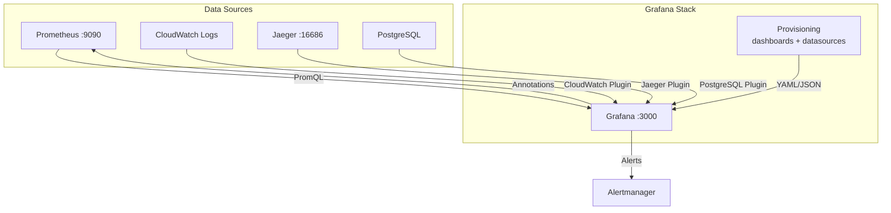

# Grafana Setup & Configuration

## Overview

Grafana serves as the primary visualization and dashboarding layer for EventRelay's observability stack. It connects to Prometheus for metrics, provides real-time dashboards for operational visibility, and integrates with the alerting pipeline for on-call notifications.

> [!IMPORTANT]
> Grafana is the single pane of glass for EventRelay operations. All runbooks and incident response procedures reference Grafana dashboards as the starting point for investigation.

---

## Architecture



---

## Deployment on ECS

### ECS Task Definition

```json
{
  "family": "eventrelay-grafana",
  "networkMode": "awsvpc",
  "containerDefinitions": [
    {
      "name": "grafana",
      "image": "grafana/grafana-oss:10.4.0",
      "essential": true,
      "portMappings": [
        { "containerPort": 3000, "protocol": "tcp" }
      ],
      "environment": [
        { "name": "GF_SERVER_ROOT_URL", "value": "https://grafana.eventrelay.io" },
        { "name": "GF_SERVER_SERVE_FROM_SUB_PATH", "value": "false" },
        { "name": "GF_DATABASE_TYPE", "value": "postgres" },
        { "name": "GF_DATABASE_HOST", "value": "eventrelay-db.cluster-xxxx.us-east-1.rds.amazonaws.com:5432" },
        { "name": "GF_DATABASE_NAME", "value": "grafana" },
        { "name": "GF_DATABASE_SSL_MODE", "value": "require" },
        { "name": "GF_AUTH_ANONYMOUS_ENABLED", "value": "false" },
        { "name": "GF_AUTH_BASIC_ENABLED", "value": "true" },
        { "name": "GF_SECURITY_ADMIN_USER", "value": "admin" },
        { "name": "GF_USERS_ALLOW_SIGN_UP", "value": "false" },
        { "name": "GF_ALERTING_ENABLED", "value": "true" },
        { "name": "GF_UNIFIED_ALERTING_ENABLED", "value": "true" },
        { "name": "GF_INSTALL_PLUGINS", "value": "grafana-piechart-panel,grafana-clock-panel" },
        { "name": "GF_LOG_LEVEL", "value": "info" },
        { "name": "GF_LOG_MODE", "value": "console" }
      ],
      "secrets": [
        {
          "name": "GF_SECURITY_ADMIN_PASSWORD",
          "valueFrom": "arn:aws:secretsmanager:us-east-1:123456789012:secret:eventrelay/grafana/admin-password"
        },
        {
          "name": "GF_DATABASE_USER",
          "valueFrom": "arn:aws:secretsmanager:us-east-1:123456789012:secret:eventrelay/grafana/db-user"
        },
        {
          "name": "GF_DATABASE_PASSWORD",
          "valueFrom": "arn:aws:secretsmanager:us-east-1:123456789012:secret:eventrelay/grafana/db-password"
        }
      ],
      "mountPoints": [
        {
          "sourceVolume": "grafana-provisioning",
          "containerPath": "/etc/grafana/provisioning"
        }
      ],
      "logConfiguration": {
        "logDriver": "awslogs",
        "options": {
          "awslogs-group": "/ecs/eventrelay/grafana",
          "awslogs-region": "us-east-1",
          "awslogs-stream-prefix": "grafana"
        }
      },
      "memory": 2048,
      "cpu": 1024,
      "healthCheck": {
        "command": ["CMD-SHELL", "wget --spider -q http://localhost:3000/api/health || exit 1"],
        "interval": 30,
        "timeout": 5,
        "retries": 3,
        "startPeriod": 30
      }
    }
  ],
  "volumes": [
    {
      "name": "grafana-provisioning",
      "efsVolumeConfiguration": {
        "fileSystemId": "fs-0123456789abcdef0",
        "rootDirectory": "/grafana-provisioning",
        "transitEncryption": "ENABLED"
      }
    }
  ]
}
```

---

## Data Source Configuration

### Provisioning Data Sources (YAML)

```yaml
# provisioning/datasources/datasources.yml
apiVersion: 1

datasources:
  # ──────────────────────────────────────────
  # Primary: Prometheus
  # ──────────────────────────────────────────
  - name: Prometheus
    type: prometheus
    access: proxy
    url: http://prometheus:9090
    isDefault: true
    editable: false
    jsonData:
      timeInterval: "15s"        # Matches Prometheus scrape interval
      queryTimeout: "60s"
      httpMethod: POST           # POST for large queries
      exemplarTraceIdDestinations:
        - name: traceID
          datasourceUid: jaeger
          urlDisplayLabel: "View Trace"
    version: 1

  # ──────────────────────────────────────────
  # Jaeger (Distributed Tracing)
  # ──────────────────────────────────────────
  - name: Jaeger
    type: jaeger
    access: proxy
    url: http://jaeger-query:16686
    uid: jaeger
    editable: false
    jsonData:
      tracesToMetrics:
        datasourceUid: Prometheus
        tags:
          - key: service.name
            value: service
        queries:
          - name: "Request Rate"
            query: "sum(rate(http_server_requests_seconds_count{$$__tags}[5m]))"

  # ──────────────────────────────────────────
  # CloudWatch (Logs)
  # ──────────────────────────────────────────
  - name: CloudWatch
    type: cloudwatch
    access: proxy
    editable: false
    jsonData:
      authType: default          # Uses ECS task role
      defaultRegion: us-east-1
      logGroups:
        - arn: "arn:aws:logs:us-east-1:123456789012:log-group:/ecs/eventrelay/*"

  # ──────────────────────────────────────────
  # PostgreSQL (Direct DB queries for debugging)
  # ──────────────────────────────────────────
  - name: PostgreSQL
    type: postgres
    access: proxy
    url: eventrelay-db.cluster-xxxx.us-east-1.rds.amazonaws.com:5432
    database: eventrelay
    editable: false
    jsonData:
      sslmode: require
      maxOpenConns: 5
      maxIdleConns: 2
      connMaxLifetime: 14400
      postgresVersion: 1500
      timescaledb: false
    secureJsonData:
      user: grafana_reader
      password: "${GRAFANA_PG_PASSWORD}"
```

---

## Dashboard Organization

### Folder Structure

```
EventRelay/
├── Overview/
│   └── EventRelay Overview          # High-level system health
├── Services/
│   ├── Ingest API                   # Ingestion metrics & health
│   ├── Dispatcher Workers           # Delivery metrics & performance
│   ├── Retry Engine                 # Retry metrics & queue health
│   └── DLQ Processor               # Dead-letter queue metrics
├── Tenants/
│   └── Per-Tenant Dashboard         # Tenant-specific metrics (variable)
├── Infrastructure/
│   ├── ECS Cluster                  # Container metrics
│   ├── PostgreSQL                   # Database performance
│   ├── Redis                        # Cache & rate limiting
│   └── SQS                         # Queue metrics
├── SLO/
│   └── SLO & Error Budget          # SLI/SLO tracking
└── Debug/
    └── Event Investigation          # Individual event tracing
```

### Dashboard Provisioning

```yaml
# provisioning/dashboards/dashboards.yml
apiVersion: 1

providers:
  - name: EventRelay
    orgId: 1
    folder: EventRelay
    type: file
    disableDeletion: true
    editable: false
    updateIntervalSeconds: 30
    allowUiUpdates: false
    options:
      path: /etc/grafana/provisioning/dashboards/eventrelay
      foldersFromFilesStructure: true
```

---

## User Management

### Roles and Permissions

| Role | Access Level | Use Case |
|------|-------------|----------|
| **Admin** | Full access, provisioning, user management | Platform team leads |
| **Editor** | Create/edit dashboards, cannot change data sources | On-call engineers |
| **Viewer** | View dashboards, no edit access | Developers, stakeholders |
| **Tenant Viewer** | View tenant-specific dashboards only | External tenant admins |

### Team Configuration

```yaml
# Teams (configured via Grafana API or Terraform)
teams:
  - name: Platform Engineering
    role: Admin
    members: [alice, bob]
  
  - name: On-Call
    role: Editor
    members: [charlie, dave, eve]
  
  - name: Product
    role: Viewer
    members: [frank, grace]
```

### Authentication (OIDC/SSO)

```ini
# grafana.ini (environment variables)
GF_AUTH_GENERIC_OAUTH_ENABLED=true
GF_AUTH_GENERIC_OAUTH_NAME=SSO
GF_AUTH_GENERIC_OAUTH_CLIENT_ID=eventrelay-grafana
GF_AUTH_GENERIC_OAUTH_SCOPES=openid profile email groups
GF_AUTH_GENERIC_OAUTH_AUTH_URL=https://idp.company.com/authorize
GF_AUTH_GENERIC_OAUTH_TOKEN_URL=https://idp.company.com/oauth/token
GF_AUTH_GENERIC_OAUTH_API_URL=https://idp.company.com/userinfo
GF_AUTH_GENERIC_OAUTH_ROLE_ATTRIBUTE_PATH=contains(groups, 'platform-admin') && 'Admin' || contains(groups, 'oncall') && 'Editor' || 'Viewer'
```

---

## Alerting Integration

Grafana Unified Alerting connects to Prometheus Alertmanager for routing and notification:

```yaml
# provisioning/alerting/alerting.yml
apiVersion: 1

contactPoints:
  - orgId: 1
    name: critical-oncall
    receivers:
      - uid: pagerduty-critical
        type: pagerduty
        settings:
          integrationKey: "${PAGERDUTY_INTEGRATION_KEY}"
          severity: critical
          class: eventrelay
          component: webhook-delivery
        disableResolveMessage: false

      - uid: slack-critical
        type: slack
        settings:
          url: "${SLACK_WEBHOOK_URL}"
          recipient: "#eventrelay-alerts-critical"
          title: "🚨 EventRelay Critical Alert"
          text: |
            *Alert:* {{ .CommonLabels.alertname }}
            *Severity:* {{ .CommonLabels.severity }}
            *Summary:* {{ .CommonAnnotations.summary }}
            *Dashboard:* {{ .CommonAnnotations.dashboard_url }}

  - orgId: 1
    name: warning-channel
    receivers:
      - uid: slack-warning
        type: slack
        settings:
          url: "${SLACK_WEBHOOK_URL}"
          recipient: "#eventrelay-alerts-warning"
          title: "⚠️ EventRelay Warning"

policies:
  - orgId: 1
    receiver: warning-channel
    group_by: ["alertname", "service"]
    group_wait: 30s
    group_interval: 5m
    repeat_interval: 4h
    routes:
      - receiver: critical-oncall
        matchers:
          - severity = critical
        group_wait: 10s
        group_interval: 1m
        repeat_interval: 1h
        continue: false
```

---

## Main Overview Dashboard JSON

The following is the provisioned JSON for the **EventRelay Overview** dashboard:

```json
{
  "dashboard": {
    "id": null,
    "uid": "eventrelay-overview",
    "title": "EventRelay Overview",
    "description": "High-level operational overview of the EventRelay webhook delivery platform",
    "tags": ["eventrelay", "overview", "production"],
    "timezone": "utc",
    "refresh": "30s",
    "time": { "from": "now-1h", "to": "now" },
    "templating": {
      "list": [
        {
          "name": "environment",
          "type": "custom",
          "current": { "text": "production", "value": "production" },
          "options": [
            { "text": "production", "value": "production" },
            { "text": "staging", "value": "staging" }
          ]
        },
        {
          "name": "tenant_id",
          "type": "query",
          "datasource": "Prometheus",
          "query": "label_values(eventrelay_events_received_total{environment=\"$environment\"}, tenant_id)",
          "refresh": 2,
          "includeAll": true,
          "allValue": ".*"
        }
      ]
    },
    "panels": [
      {
        "title": "Delivery Success Rate",
        "type": "stat",
        "gridPos": { "h": 4, "w": 6, "x": 0, "y": 0 },
        "targets": [
          {
            "expr": "sum(rate(eventrelay_deliveries_total{status=\"success\", environment=\"$environment\", tenant_id=~\"$tenant_id\"}[5m])) / sum(rate(eventrelay_deliveries_total{environment=\"$environment\", tenant_id=~\"$tenant_id\"}[5m])) * 100",
            "legendFormat": "Success Rate"
          }
        ],
        "fieldConfig": {
          "defaults": {
            "unit": "percent",
            "thresholds": {
              "steps": [
                { "color": "red", "value": 0 },
                { "color": "orange", "value": 95 },
                { "color": "yellow", "value": 99 },
                { "color": "green", "value": 99.9 }
              ]
            },
            "min": 90,
            "max": 100
          }
        }
      },
      {
        "title": "Events Throughput (per second)",
        "type": "stat",
        "gridPos": { "h": 4, "w": 6, "x": 6, "y": 0 },
        "targets": [
          {
            "expr": "sum(rate(eventrelay_events_received_total{environment=\"$environment\"}[5m]))",
            "legendFormat": "Events/s"
          }
        ],
        "fieldConfig": {
          "defaults": { "unit": "ops", "decimals": 1 }
        }
      },
      {
        "title": "DLQ Depth",
        "type": "stat",
        "gridPos": { "h": 4, "w": 6, "x": 12, "y": 0 },
        "targets": [
          {
            "expr": "sum(eventrelay_dlq_events_total{environment=\"$environment\"})",
            "legendFormat": "DLQ Events"
          }
        ],
        "fieldConfig": {
          "defaults": {
            "thresholds": {
              "steps": [
                { "color": "green", "value": 0 },
                { "color": "yellow", "value": 50 },
                { "color": "orange", "value": 100 },
                { "color": "red", "value": 500 }
              ]
            }
          }
        }
      },
      {
        "title": "Active Tenants",
        "type": "stat",
        "gridPos": { "h": 4, "w": 6, "x": 18, "y": 0 },
        "targets": [
          {
            "expr": "count(count by (tenant_id) (eventrelay_events_received_total{environment=\"$environment\"}))",
            "legendFormat": "Tenants"
          }
        ]
      },
      {
        "title": "Delivery Latency (p50 / p95 / p99)",
        "type": "timeseries",
        "gridPos": { "h": 8, "w": 12, "x": 0, "y": 4 },
        "targets": [
          {
            "expr": "histogram_quantile(0.50, sum(rate(eventrelay_delivery_latency_seconds_bucket{environment=\"$environment\"}[5m])) by (le))",
            "legendFormat": "p50"
          },
          {
            "expr": "histogram_quantile(0.95, sum(rate(eventrelay_delivery_latency_seconds_bucket{environment=\"$environment\"}[5m])) by (le))",
            "legendFormat": "p95"
          },
          {
            "expr": "histogram_quantile(0.99, sum(rate(eventrelay_delivery_latency_seconds_bucket{environment=\"$environment\"}[5m])) by (le))",
            "legendFormat": "p99"
          }
        ],
        "fieldConfig": {
          "defaults": { "unit": "s" }
        }
      },
      {
        "title": "Events Throughput Over Time",
        "type": "timeseries",
        "gridPos": { "h": 8, "w": 12, "x": 12, "y": 4 },
        "targets": [
          {
            "expr": "sum(rate(eventrelay_events_received_total{environment=\"$environment\"}[5m]))",
            "legendFormat": "Received"
          },
          {
            "expr": "sum(rate(eventrelay_deliveries_total{status=\"success\", environment=\"$environment\"}[5m]))",
            "legendFormat": "Delivered"
          },
          {
            "expr": "sum(rate(eventrelay_deliveries_total{status=\"failed\", environment=\"$environment\"}[5m]))",
            "legendFormat": "Failed"
          }
        ],
        "fieldConfig": {
          "defaults": { "unit": "ops" }
        }
      },
      {
        "title": "Delivery Status Breakdown",
        "type": "piechart",
        "gridPos": { "h": 8, "w": 8, "x": 0, "y": 12 },
        "targets": [
          {
            "expr": "sum by (status) (increase(eventrelay_deliveries_total{environment=\"$environment\"}[1h]))",
            "legendFormat": "{{ status }}"
          }
        ]
      },
      {
        "title": "Queue Depth (SQS)",
        "type": "timeseries",
        "gridPos": { "h": 8, "w": 8, "x": 8, "y": 12 },
        "targets": [
          {
            "expr": "eventrelay_queue_depth{environment=\"$environment\"}",
            "legendFormat": "{{ queue_name }}"
          }
        ]
      },
      {
        "title": "Rate Limited Requests",
        "type": "timeseries",
        "gridPos": { "h": 8, "w": 8, "x": 16, "y": 12 },
        "targets": [
          {
            "expr": "sum(rate(eventrelay_rate_limited_total{environment=\"$environment\"}[5m])) by (tenant_id)",
            "legendFormat": "{{ tenant_id }}"
          }
        ],
        "fieldConfig": {
          "defaults": { "unit": "ops" }
        }
      },
      {
        "title": "JVM Heap Memory",
        "type": "timeseries",
        "gridPos": { "h": 8, "w": 12, "x": 0, "y": 20 },
        "targets": [
          {
            "expr": "sum(jvm_memory_used_bytes{area=\"heap\", application=\"eventrelay-ingest-api\"}) by (instance)",
            "legendFormat": "Used - {{ instance }}"
          },
          {
            "expr": "sum(jvm_memory_max_bytes{area=\"heap\", application=\"eventrelay-ingest-api\"}) by (instance)",
            "legendFormat": "Max - {{ instance }}"
          }
        ],
        "fieldConfig": {
          "defaults": { "unit": "bytes" }
        }
      },
      {
        "title": "HTTP Request Rate by Endpoint",
        "type": "timeseries",
        "gridPos": { "h": 8, "w": 12, "x": 12, "y": 20 },
        "targets": [
          {
            "expr": "sum(rate(http_server_requests_seconds_count{application=\"eventrelay-ingest-api\", environment=\"$environment\"}[5m])) by (uri, method)",
            "legendFormat": "{{ method }} {{ uri }}"
          }
        ],
        "fieldConfig": {
          "defaults": { "unit": "reqps" }
        }
      }
    ]
  },
  "overwrite": true,
  "folderId": 0
}
```

---

## Production Considerations

### Performance

- Set **dashboard auto-refresh** to no less than 30s for overview dashboards
- Use **$__rate_interval** instead of hardcoded `[5m]` in PromQL for rate() functions
- Avoid **instant queries** for dashboards with many panels; use range queries
- Enable **query caching** (`GF_FEATURE_TOGGLES_ENABLE=publicDashboards`) for read-heavy dashboards

### Backup and Recovery

- Grafana state (dashboards, users, alert rules) is stored in PostgreSQL — include in RDS automated backups
- Export critical dashboards as JSON and store in Git (infrastructure-as-code)
- Use **Grafana provisioning** to ensure dashboards can be rebuilt from scratch

### High Availability

- Run **2+ Grafana replicas** behind an ALB
- Use **PostgreSQL** (not SQLite) for session and state storage
- All replicas share the same Prometheus data source — no state divergence

---

## Related Documents

- [Prometheus.md](./Prometheus.md) — Prometheus setup and scrape configuration
- [Dashboards.md](./Dashboards.md) — Detailed dashboard designs
- [Alerting.md](./Alerting.md) — Alerting rules and routing
- [SLA_SLO.md](./SLA_SLO.md) — SLO dashboard and error budgets
